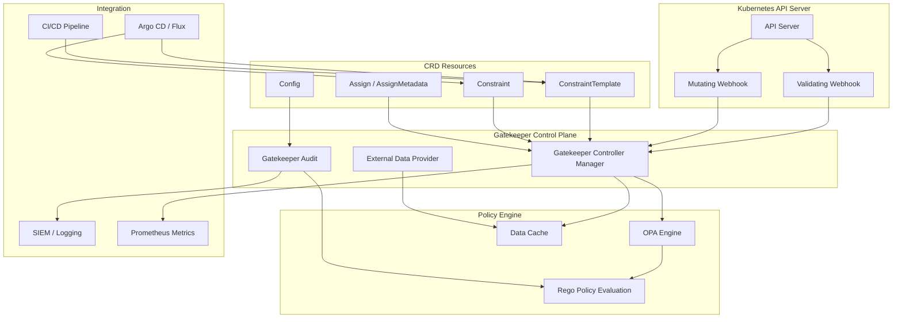

> **生产环境安全提示**
>
> 本文档包含可直接执行的运维命令。执行前请确认：当前目标集群与 Namespace 是否正确；是否具备足够的 RBAC 权限；是否已在非生产环境验证。命令风险等级标注：🔴 高风险（可能造成数据丢失或服务中断）、🟡 中风险（会修改集群状态，但通常可回滚）、🟢 低风险/只读（信息收集，无副作用）。


# OPA Gatekeeper 策略即代码深度实践

> **Author**: Cloud Native Security Architect | **Version**: v1.0 | **Update Time**: 2026-05-18
> **Scenario**: Enterprise-grade [[kubernetes|Kubernetes]] policy enforcement with OPA Gatekeeper | **Complexity**: ⭐⭐⭐⭐

<!-- chunk: 概述 -->## 概述

OPA（Open Policy Agent）是一个通用的开源策略引擎，采用 Rego 语言声明式定义策略，能够与 Kubernetes、API 网关、CI/CD 管道等多种系统集成。Gatekeeper 是 OPA 在 Kubernetes 中的准入控制器实现，通过 CRD 将策略定义为 Kubernetes 原生资源，支持验证（Validate）、变异（Mutate）和审计（Audit）三种模式，为企业提供声明式的安全策略管理能力。

## 威胁模型分析

在 Kubernetes 集群中，如果没有统一的策略执行机制，开发人员和运维人员可能会创建不安全的工作负载配置，导致严重的安全风险。以下是 OPA Gatekeeper 重点防护的威胁场景：

**容器逃逸风险**：特权容器、挂载宿主机 PID/Network 命名空间、添加危险 Linux Capabilities 等配置可被攻击者利用实现容器逃逸，获取宿主机控制权。Gatekeeper 通过准入控制拦截这些危险配置，确保所有工作负载遵循安全基线。

**供应链攻击**：未限制镜像来源允许从任意 Registry 拉取镜像，增加了供应链攻击面。攻击者可通过植入恶意镜像实现初始访问。Gatekeeper 的镜像来源限制策略可确保仅使用经过审批的受信任 Registry。

**密钥泄露**：将敏感信息以明文形式写入 Pod 环境变量或 ConfigMap 中，会导致凭据泄露。Gatekeeper 可检测并拦截这些不安全配置，强制要求使用 Secret 资源或外部密钥管理系统。

**资源耗尽**：未设置资源限制的 Pod 可能消耗过多节点资源，影响同节点其他工作负载的可用性，甚至导致节点崩溃。资源配额策略确保每个 Pod 都有合理的资源边界。

**合规违规**：企业需要满足 PCI-DSS、HIPAA、SOC2 等合规要求，但人工审查无法保证所有资源配置都符合标准。Gatekeeper 的审计功能可持续扫描存量资源，发现并报告合规偏差。

<!-- chunk: 架构设计 -->## 架构设计

## 核心组件架构



## 工作流程

Gatekeeper 的工作流程分为三个阶段。首先是策略定义阶段，管理员创建 ConstraintTemplate CRD，其中包含 Rego 策略逻辑和参数 Schema 定义。然后基于模板创建具体的 Constraint 实例，指定匹配规则和参数值。

其次是准入控制阶段，当 Kubernetes API Server 接收到资源创建或更新请求时，通过 ValidatingWebhook 或 MutatingWebhook 将请求转发给 Gatekeeper。Gatekeeper 加载对应的 ConstraintTemplate 和 Constraint，将请求资源作为输入传入 Rego 引擎进行评估，返回允许或拒绝的结果。变异 webhook 则在验证之前修改请求对象。

最后是审计阶段，Gatekeeper 的 Audit 组件定期扫描集群中已有的资源，对比当前策略进行检查，将违规资源记录到 Constraint 的 status 字段中，并生成 Prometheus 指标供监控系统消费。

## 高可用部署架构

```yaml
# values-gatekeeper-ha.yaml
replicas: 3

resources:
  requests:
    cpu: 200m
    memory: 512Mi
  limits:
    cpu: "1"
    memory: 1Gi

podDisruptionBudget:
  minAvailable: 2

affinity:
  podAntiAffinity:
    preferredDuringSchedulingIgnoredDuringExecution:
      - weight: 100
        podAffinityTerm:
          labelSelector:
            matchLabels:
              app: gatekeeper
          topologyKey: kubernetes.io/hostname

enableMutation: true
enableExternalData: true

auditInterval: 60
auditMatchKindOnly: false
constraintViolationsLimit: 50
auditFromCache: true
auditChunkSize: 500

validatingWebhookFailurePolicy: Ignore
validatingWebhookTimeoutSeconds: 5
mutatingWebhookFailurePolicy: Ignore
mutatingWebhookTimeoutSeconds: 2

logLevel: INFO
logDenies: true
emitAdmissionEvents: true
emitAuditEvents: true
```

<!-- chunk: 核心配置 -->## 核心配置

## ConstraintTemplate 定义

ConstraintTemplate 是 Gatekeeper 的核心抽象，将 Rego 策略封装为可复用的 CRD。每个模板定义了策略逻辑和参数 Schema，Constraint 实例基于模板创建并传入具体参数。

```yaml
apiVersion: templates.gatekeeper.sh/v1
kind: ConstraintTemplate
metadata:
  name: k8srequiredlabels
  annotations:
    description: "要求资源必须包含指定标签"
spec:
  crd:
    spec:
      names:
        kind: K8sRequiredLabels
      validation:
        openAPIV3Schema:
          type: object
          properties:
            labels:
              type: array
              items:
                type: object
                properties:
                  key:
                    type: string
                  allowedRegex:
                    type: string
  targets:
    - target: admission.k8s.gatekeeper.sh
      rego: |
        package k8srequiredlabels

        violation[{"msg": msg}] {
          provided := {label | input.review.object.metadata.labels[label]}
          required := {label | label := input.parameters.labels[_].key}
          missing := required - provided
          count(missing) > 0
          msg := sprintf("必须包含标签: %v", [missing])
        }

        violation[{"msg": msg}] {
          label := input.parameters.labels[_]
          value := input.review.object.metadata.labels[label.key]
          label.allowedRegex
          not regex.match(label.allowedRegex, value)
          msg := sprintf("标签 %v 的值 %v 不符合正则 %v", [label.key, value, label.allowedRegex])
        }
---
apiVersion: templates.gatekeeper.sh/v1
kind: ConstraintTemplate
metadata:
  name: k8sallowedrepos
  annotations:
    description: "限制容器镜像来源 Registry"
spec:
  crd:
    spec:
      names:
        kind: K8sAllowedRepos
      validation:
        openAPIV3Schema:
          type: object
          properties:
            repos:
              type: array
              items:
                type: string
  targets:
    - target: admission.k8s.gatekeeper.sh
      rego: |
        package k8sallowedrepos

        violation[{"msg": msg}] {
          container := input_containers[_]
          satisfied := [good | repo := input.parameters.repos[_]
                              good := startswith(container.image, repo)]
          not any(satisfied)
          msg := sprintf("容器 <%v> 使用了未授权的镜像 <%v>，允许的 Registry: %v",
                        [container.name, container.image, input.parameters.repos])
        }

        input_containers[c] {
          c := input.review.object.spec.containers[_]
        }
        input_containers[c] {
          c := input.review.object.spec.initContainers[_]
        }
        input_containers[c] {
          c := input.review.object.spec.ephemeralContainers[_]
        }
---
apiVersion: templates.gatekeeper.sh/v1
kind: ConstraintTemplate
metadata:
  name: k8sblockprivileged
  annotations:
    description: "禁止特权容器"
spec:
  crd:
    spec:
      names:
        kind: K8sBlockPrivileged
      validation:
        openAPIV3Schema:
          type: object
          properties:
            exemptImages:
              type: array
              items:
                type: string
  targets:
    - target: admission.k8s.gatekeeper.sh
      rego: |
        package k8sblockprivileged

        violation[{"msg": msg}] {
          container := input_containers[_]
          not is_exempt(container)
          container.securityContext.privileged == true
          msg := sprintf("容器 <%v> 不允许以特权模式运行", [container.name])
        }

        is_exempt(container) {
          exempt := input.parameters.exemptImages[_]
          startswith(container.image, exempt)
        }

        input_containers[c] {
          c := input.review.object.spec.containers[_]
        }
        input_containers[c] {
          c := input.review.object.spec.initContainers[_]
        }
---
apiVersion: templates.gatekeeper.sh/v1
kind: ConstraintTemplate
metadata:
  name: k8sresourcelimits
  annotations:
    description: "强制容器资源限制"
spec:
  crd:
    spec:
      names:
        kind: K8sResourceLimits
      validation:
        openAPIV3Schema:
          type: object
          properties:
            cpu:
              type: string
            memory:
              type: string
  targets:
    - target: admission.k8s.gatekeeper.sh
      rego: |
        package k8sresourcelimits

        violation[{"msg": msg}] {
          container := input_containers[_]
          not container.resources.limits.cpu
          msg := sprintf("容器 <%v> 未设置 CPU 限制", [container.name])
        }

        violation[{"msg": msg}] {
          container := input_containers[_]
          not container.resources.limits.memory
          msg := sprintf("容器 <%v> 未设置内存限制", [container.name])
        }

        violation[{"msg": msg}] {
          container := input_containers[_]
          input.parameters.cpu
          cpu_val := resource.parse(container.resources.limits.cpu)
          max_cpu := resource.parse(input.parameters.cpu)
          cpu_val > max_cpu
          msg := sprintf("容器 <%v> CPU 限制 %v 超过最大值 %v",
                        [container.name, container.resources.limits.cpu, input.parameters.cpu])
        }

        violation[{"msg": msg}] {
          container := input_containers[_]
          input.parameters.memory
          mem_val := resource.parse(container.resources.limits.memory)
          max_mem := resource.parse(input.parameters.memory)
          mem_val > max_mem
          msg := sprintf("容器 <%v> 内存限制 %v 超过最大值 %v",
                        [container.name, container.resources.limits.memory, input.parameters.memory])
        }

        input_containers[c] {
          c := input.review.object.spec.containers[_]
        }
```

## Constraint 策略实例

```yaml
apiVersion: constraints.gatekeeper.sh/v1beta1
kind: K8sRequiredLabels
metadata:
  name: require-cost-labels
spec:
  match:
    kinds:
      - apiGroups: [""]
        kinds: ["Namespace"]
    excludedNamespaces:
      - kube-system
      - gatekeeper-system
      - kube-node-lease
      - kube-public
  parameters:
    labels:
      - key: cost-center
        allowedRegex: "^team-[a-z]+$"
      - key: environment
        allowedRegex: "^(production|staging|development)$"
      - key: owned-by
        allowedRegex: "^[a-z]+@[a-z]+\\.[a-z]+$"
---
apiVersion: constraints.gatekeeper.sh/v1beta1
kind: K8sAllowedRepos
metadata:
  name: restrict-image-registries
spec:
  match:
    kinds:
      - apiGroups: [""]
        kinds: ["Pod"]
      - apiGroups: ["apps"]
        kinds: ["Deployment", "StatefulSet", "DaemonSet"]
    excludedNamespaces:
      - kube-system
      - gatekeeper-system
      - istio-system
  parameters:
    repos:
      - "registry.company.com/"
      - "harbor.company.com/"
      - "gcr.io/company/"
      - "ghcr.io/company/"
---
apiVersion: constraints.gatekeeper.sh/v1beta1
kind: K8sBlockPrivileged
metadata:
  name: block-privileged-containers
spec:
  match:
    kinds:
      - apiGroups: [""]
        kinds: ["Pod"]
    excludedNamespaces:
      - kube-system
      - gatekeeper-system
      - cattle-system
  parameters:
    exemptImages:
      - "gcr.io/istio-release/"
---
apiVersion: constraints.gatekeeper.sh/v1beta1
kind: K8sResourceLimits
metadata:
  name: enforce-resource-limits
spec:
  match:
    kinds:
      - apiGroups: [""]
        kinds: ["Pod"]
    excludedNamespaces:
      - kube-system
      - gatekeeper-system
  parameters:
    cpu: "4"
    memory: "8Gi"
```

<!-- chunk: 安全策略实战 -->## 安全策略实战

## 禁止宿主机命名空间共享

宿主机 PID、IPC 和 Network 命名空间共享是容器逃逸的主要途径之一。攻击者可通过共享命名空间访问宿主机进程、网络连接和 IPC 资源。以下策略全面禁止这些危险配置：

```yaml
apiVersion: templates.gatekeeper.sh/v1
kind: ConstraintTemplate
metadata:
  name: k8sblockhostnamespace
spec:
  crd:
    spec:
      names:
        kind: K8sBlockHostNamespace
  targets:
    - target: admission.k8s.gatekeeper.sh
      rego: |
        package k8sblockhostnamespace

        violation[{"msg": msg}] {
          input.review.object.spec.hostPID == true
          msg := "禁止使用 hostPID"
        }

        violation[{"msg": msg}] {
          input.review.object.spec.hostIPC == true
          msg := "禁止使用 hostIPC"
        }

        violation[{"msg": msg}] {
          input.review.object.spec.hostNetwork == true
          msg := "禁止使用 hostNetwork"
        }
---
apiVersion: constraints.gatekeeper.sh/v1beta1
kind: K8sBlockHostNamespace
metadata:
  name: block-host-namespace
spec:
  match:
    kinds:
      - apiGroups: [""]
        kinds: ["Pod"]
    excludedNamespaces:
      - kube-system
      - gatekeeper-system
      - calico-system
      - cilium-test
```

## 强制安全上下文

安全上下文（Security Context）是 Pod 和容器级别的安全配置，包括运行用户、文件系统权限、能力控制等。以下策略确保所有工作负载都配置了合理的安全上下文：

```yaml
apiVersion: templates.gatekeeper.sh/v1
kind: ConstraintTemplate
metadata:
  name: k8ssecuritycontext
spec:
  crd:
    spec:
      names:
        kind: K8sSecurityContext
      validation:
        openAPIV3Schema:
          type: object
          properties:
            allowedUsers:
              type: array
              items:
                type: integer
  targets:
    - target: admission.k8s.gatekeeper.sh
      rego: |
        package k8ssecuritycontext

        violation[{"msg": msg}] {
          container := input_containers[_]
          not container.securityContext.runAsNonRoot
          msg := sprintf("容器 <%v> 必须设置 runAsNonRoot: true", [container.name])
        }

        violation[{"msg": msg}] {
          container := input_containers[_]
          not container.securityContext.allowPrivilegeEscalation == false
          msg := sprintf("容器 <%v> 必须设置 allowPrivilegeEscalation: false", [container.name])
        }

        violation[{"msg": msg}] {
          container := input_containers[_]
          caps := container.securityContext.capabilities.drop[_]
          not caps == "ALL"
          msg := sprintf("容器 <%v> 必须丢弃所有 Linux capabilities (drop: [ALL])", [container.name])
        }

        violation[{"msg": msg}] {
          container := input_containers[_]
          container.securityContext.readOnlyRootFilesystem == false
          msg := sprintf("容器 <%v> 建议启用 readOnlyRootFilesystem: true", [container.name])
        }

        input_containers[c] {
          c := input.review.object.spec.containers[_]
        }
        input_containers[c] {
          c := input.review.object.spec.initContainers[_]
        }
```

## 变异策略自动注入安全配置

变异策略（Mutation）允许 Gatekeeper 在资源创建时自动修改配置，无需开发人员手动添加安全字段。这降低了人为遗漏的风险：

```yaml
apiVersion: mutations.gatekeeper.sh/v1
kind: Assign
metadata:
  name: inject-security-context
spec:
  applyTo:
    - groups: [""]
      kinds: ["Pod"]
      versions: ["v1"]
  match:
    scope: Namespaced
    excludedNamespaces:
      - kube-system
      - gatekeeper-system
  location: "spec.containers[name:*].securityContext.allowPrivilegeEscalation"
  parameters:
    assign:
      value: false
---
apiVersion: mutations.gatekeeper.sh/v1
kind: Assign
metadata:
  name: inject-run-as-non-root
spec:
  applyTo:
    - groups: [""]
      kinds: ["Pod"]
      versions: ["v1"]
  match:
    scope: Namespaced
    excludedNamespaces:
      - kube-system
      - gatekeeper-system
  location: "spec.securityContext.runAsNonRoot"
  parameters:
    assign:
      value: true
---
apiVersion: mutations.gatekeeper.sh/v1
kind: AssignMetadata
metadata:
  name: inject-managed-by-label
spec:
  match:
    scope: Namespaced
    kinds:
      - apiGroups: ["apps"]
        kinds: ["Deployment", "StatefulSet"]
  location: "metadata.labels.managed-by"
  parameters:
    assign:
      value: "gatekeeper-mutation"
```

## 外部数据集成

Gatekeeper 支持通过 External Data 功能在策略评估时查询外部数据源，实现更灵活的策略控制。例如查询镜像漏洞数据库、CMDB 系统或审批系统：

```yaml
apiVersion: templates.gatekeeper.sh/v1
kind: ConstraintTemplate
metadata:
  name: k8simagedigest
spec:
  crd:
    spec:
      names:
        kind: K8sImageDigest
  targets:
    - target: admission.k8s.gatekeeper.sh
      rego: |
        package k8simagedigest

        violation[{"msg": msg}] {
          container := input_containers[_]
          not contains(container.image, "@")
          msg := sprintf("容器 <%v> 镜像必须使用摘要 (digest) 而非标签", [container.name])
        }

        input_containers[c] {
          c := input.review.object.spec.containers[_]
        }
---
apiVersion: constraints.gatekeeper.sh/v1beta1
kind: K8sImageDigest
metadata:
  name: require-image-digest
spec:
  match:
    kinds:
      - apiGroups: [""]
        kinds: ["Pod"]
    excludedNamespaces:
      - kube-system
```

<!-- chunk: 合规与审计 -->## 合规与审计

## 审计配置

Gatekeeper 的审计组件定期扫描集群中的存量资源，将违规信息写入 Constraint 的 status 字段。通过 Config 资源可以自定义审计行为：

```yaml
apiVersion: config.gatekeeper.sh/v1alpha1
kind: Config
metadata:
  name: config
  namespace: gatekeeper-system
spec:
  match:
    - excludedNamespaces:
        - kube-system
        - gatekeeper-system
        - kube-node-lease
        - kube-public
      processes:
        - audit
        - webhook
  sync:
    syncOnly:
      - group: ""
        version: "v1"
        kind: Namespace
      - group: ""
        version: "v1"
        kind: Pod
  validation:
    traces:
      - user: "admin"
        kind:
          group: ""
          version: "v1"
          kind: "Pod"
        dump: "All"
```

## 合规报告生成

``` bash
# 🟢 低风险：只读/信息收集，通常无副作用
#!/bin/bash
# generate_compliance_report.sh

REPORT_DIR="/tmp/gatekeeper-reports"
DATE=$(date +%Y%m%d_%H%M%S)
mkdir -p "$REPORT_DIR/$DATE"

echo "# Gatekeeper Compliance Report - $(date)" > "$REPORT_DIR/$DATE/report.md"
echo "" >> "$REPORT_DIR/$DATE/report.md"

CONSTRAINTS=$(kubectl get constraints -o json)
echo "$CONSTRAINTS" | jq -r '.items[] | .metadata.name' | while read constraint; do
    echo "<!-- chunk: Constraint: $constraint" >> "$REPORT_DIR/$DATE/report.md" -->## Constraint: $constraint" >> "$REPORT_DIR/$DATE/report.md"
    echo "" >> "$REPORT_DIR/$DATE/report.md"

    KIND=$(echo "$CONSTRAINTS" | jq -r ".items[] | select(.metadata.name==\"$constraint\") | .kind")
    VIOLATIONS=$(kubectl get "$KIND" "$constraint" -o json | jq '.status.violations // []')

    TOTAL=$(echo "$VIOLATIONS" | jq 'length')
    echo "Total violations: $TOTAL" >> "$REPORT_DIR/$DATE/report.md"
    echo "" >> "$REPORT_DIR/$DATE/report.md"

    if [ "$TOTAL" -gt 0 ]; then
        echo "| Namespace | Kind | Name | Message |" >> "$REPORT_DIR/$DATE/report.md"
        echo "|-----------|------|------|---------|" >> "$REPORT_DIR/$DATE/report.md"
        echo "$VIOLATIONS" | jq -r '.[] | "| \(.namespace // "cluster") | \(.kind) | \(.name) | \(.message) |"' >> "$REPORT_DIR/$DATE/report.md"
    fi
    echo "" >> "$REPORT_DIR/$DATE/report.md"
done

echo "Report generated: $REPORT_DIR/$DATE/report.md"
```
## OPA vs Kyverno 对比与选型

企业在选择策略引擎时需要综合考虑多个因素。OPA Gatekeeper 使用 Rego 语言定义策略，Rego 是一种功能强大的声明式策略语言，支持复杂的逻辑表达、集合运算和递归查询，适合处理复杂的策略场景。缺点是学习曲线陡峭，需要专门的 Rego 知识。

Kyverno 采用 YAML 定义策略，与 Kubernetes 资源定义风格一致，学习成本低，运维人员可以快速上手。Kyverno 对 Kubernetes 场景做了深度优化，内置了丰富的策略库和镜像验证功能。

对于需要跨平台策略统一（如同时管理 Kubernetes、Terraform、API 网关策略）的企业，OPA 是更好的选择。对于纯粹的 Kubernetes 场景，追求快速落地的团队，Kyverno 更为合适。两种方案都支持变异和审计功能，可以根据团队技术栈和需求灵活选择。

<!-- chunk: 监控与告警 -->## 监控与告警

## Prometheus 监控配置

```yaml
apiVersion: monitoring.coreos.com/v1
kind: ServiceMonitor
metadata:
  name: gatekeeper-metrics
  namespace: gatekeeper-system
spec:
  selector:
    matchLabels:
      app: gatekeeper
  endpoints:
    - port: metrics
      interval: 30s
      path: /metrics
---
apiVersion: monitoring.coreos.com/v1
kind: PrometheusRule
metadata:
  name: gatekeeper-alerts
  namespace: gatekeeper-system
spec:
  groups:
    - name: gatekeeper.rules
      rules:
        - alert: GatekeeperControllerDown
          expr: up{job="gatekeeper"} == 0
          for: 5m
          labels:
            severity: critical
          annotations:
            summary: "Gatekeeper 控制器不可用"
            description: "Gatekeeper 控制器已停止响应超过 5 分钟"

        - alert: GatekeeperHighViolations
          expr: gatekeeper_violations > 20
          for: 10m
          labels:
            severity: warning
          annotations:
            summary: "Gatekeeper 违规数量过高"
            description: "当前有 {{ $value }} 个策略违规需要处理"

        - alert: GatekeeperWebhookLatencyHigh
          expr: |
            histogram_quantile(0.95,
              rate(gatekeeper_validation_request_duration_seconds_bucket[5m])
            ) > 2
          for: 5m
          labels:
            severity: warning
          annotations:
            summary: "Gatekeeper Webhook 延迟过高"
            description: "95 分位延迟超过 2 秒，可能影响 API Server 性能"

        - alert: GatekeeperAuditErrors
          expr: rate(gatekeeper_audit_duration_seconds_count{error="true"}[5m]) > 0
          for: 5m
          labels:
            severity: warning
          annotations:
            summary: "Gatekeeper 审计扫描出现错误"
            description: "审计扫描在最近 5 分钟内出现错误"

        - alert: GatekeeperWebhookDenyRate
          expr: rate(gatekeeper_validation_requests_denied[5m]) > 5
          for: 2m
          labels:
            severity: info
          annotations:
            summary: "Gatekeeper 拒绝率异常"
            description: "最近 5 分钟每秒拒绝 {{ $value }} 个请求，可能存在配置错误"
```

## Grafana Dashboard

```json
{
  "dashboard": {
    "title": "OPA Gatekeeper Policy Dashboard",
    "panels": [
      {
        "title": "Admission Requests Rate",
        "type": "graph",
        "gridPos": {"h": 8, "w": 12, "x": 0, "y": 0},
        "targets": [
          {
            "expr": "rate(gatekeeper_validation_request_duration_seconds_count[5m])",
            "legendFormat": "{{allowed}}"
          }
        ]
      },
      {
        "title": "Active Violations by Constraint",
        "type": "barchart",
        "gridPos": {"h": 8, "w": 12, "x": 12, "y": 0},
        "targets": [
          {
            "expr": "gatekeeper_violations",
            "legendFormat": "{{constraint_kind}}/{{constraint_name}}"
          }
        ]
      },
      {
        "title": "Webhook Latency P95",
        "type": "graph",
        "gridPos": {"h": 8, "w": 12, "x": 0, "y": 8},
        "targets": [
          {
            "expr": "histogram_quantile(0.95, rate(gatekeeper_validation_request_duration_seconds_bucket[5m]))",
            "legendFormat": "p95 latency"
          }
        ]
      },
      {
        "title": "Deny Rate by Constraint",
        "type": "graph",
        "gridPos": {"h": 8, "w": 12, "x": 12, "y": 8},
        "targets": [
          {
            "expr": "rate(gatekeeper_validation_requests_denied[5m])",
            "legendFormat": "{{constraint_kind}}"
          }
        ]
      }
    ]
  }
}
```

<!-- chunk: 最佳实践 -->## 最佳实践

## 策略开发流程

策略开发应遵循结构化的流程以确保质量和可维护性。首先明确策略目标和适用范围，确定需要验证的资源类型、命名空间和匹配条件。然后编写 ConstraintTemplate 和 Constraint，使用 `conftest` 工具在本地进行单元测试。测试通过后在开发集群中以 Audit 模式部署，观察一段时间确认无误报后再切换为 Enforce 模式。最后将策略纳入 GitOps 流程，通过代码审查和 CI/CD 管道管理策略变更。

## 渐进式策略部署

建议采用渐进式部署策略。初始阶段仅启用 Audit 模式，观察并收集违规数据，评估策略对现有工作负载的影响。根据审计结果调整策略参数和排除规则后，对非关键命名空间切换为 Enforce 模式。确认稳定后逐步扩展到所有命名空间。

```yaml
apiVersion: constraints.gatekeeper.sh/v1beta1
kind: K8sRequiredLabels
metadata:
  name: require-app-labels-staging
spec:
  enforcementAction: dryrun
  match:
    kinds:
      - apiGroups: ["apps"]
        kinds: ["Deployment"]
    namespaces:
      - staging
  parameters:
    labels:
      - key: app.kubernetes.io/name
      - key: app.kubernetes.io/version
```

## 策略测试框架

```yaml
# .github/workflows/gatekeeper-policy-test.yml
name: Gatekeeper Policy Tests

on:
  pull_request:
    paths:
      - 'policies/gatekeeper/**'

jobs:
  test:
    runs-on: ubuntu-latest
    steps:
      - uses: actions/checkout@v4

      - name: Install conftest
        run: |
          wget -q https://github.com/open-policy-agent/conftest/releases/download/v0.55.0/conftest_0.55.0_Linux_x86_64.tar.gz
          tar xzf conftest_0.55.0_Linux_x86_64.tar.gz
          sudo mv conftest /usr/local/bin/

      - name: Test Rego policies
        run: |
          conftest test policies/gatekeeper/test/resources/ \
            -p policies/gatekeeper/policies/ \
            --all-namespaces

      - name: Validate ConstraintTemplates
        run: |
          for f in policies/gatekeeper/templates/*.yaml; do
            echo "Validating $f"
            kubectl apply --dry-run=client -f "$f" 2>&1 || exit 1
          done
```

## GitOps 集成

```yaml
apiVersion: argoproj.io/v1alpha1
kind: Application
metadata:
  name: gatekeeper-policies
  namespace: argocd
spec:
  project: security
  source:
    repoURL: https://github.com/company/security-policies.git
    targetRevision: main
    path: gatekeeper
    directory:
      recurse: true
  destination:
    server: https://kubernetes.default.svc
    namespace: gatekeeper-system
  syncPolicy:
    automated:
      prune: true
      selfHeal: true
    syncOptions:
      - CreateNamespace=true
      - ServerSideApply=true
  ignoreDifferences:
    - group: constraints.gatekeeper.sh
      kind: "*"
      jsonPointers:
        - /status
```

<!-- chunk: 故障排查 -->## 故障排查

## 常见问题诊断

**策略未生效**：首先检查 ConstraintTemplate 是否已成功创建并就绪，`kubectl get constrainttemplates` 查看状态。然后检查 Constraint 的 match 字段是否正确匹配目标资源和命名空间。确认 Webhook 配置是否正确，`kubectl get validatingwebhookconfigurations` 查看 Gatekeeper webhook 是否注册。

**Webhook 超时**：当 Gatekeeper Controller 资源不足或策略过于复杂时，可能导致 Webhook 响应超时。检查 Controller Pod 资源使用情况，增大 CPU/内存限制。优化 Rego 策略避免复杂递归。适当增加 `validatingWebhookTimeoutSeconds`。

**审计扫描不完整**：检查 Config 资源的 sync 配置，确保需要审计的资源类型已包含在 syncOnly 列表中。查看 Audit Pod 日志是否有错误信息。确认 `auditChunkSize` 和 `constraintViolationsLimit` 参数是否合理。

``` bash
# 🟢 低风险：只读/信息收集，通常无副作用
#!/bin/bash
# gatekeeper_diagnostics.sh

echo "=== Gatekeeper Health Check ==="
kubectl get pods -n gatekeeper-system -o wide
echo ""

echo "=== ConstraintTemplate Status ==="
kubectl get constrainttemplates -o custom-columns=NAME:.metadata.name,READY:.status.byPod[0].enforced
echo ""

echo "=== Constraint Violations Summary ==="
kubectl get constraints -o json | jq -r '.items[] | "\(.kind)/\(.metadata.name): \(.status.totalViolations // 0) violations"'
echo ""

echo "=== Webhook Configuration ==="
kubectl get validatingwebhookconfigurations -o yaml | grep -A5 "gatekeeper"
echo ""

echo "=== Recent Deny Events ==="
kubectl get events -n gatekeeper-system --field-selector reason=FailedAdmission --sort-by='.lastTimestamp' | tail -20
echo ""

echo "=== Controller Logs (last 50 lines) ==="
kubectl logs -n gatekeeper-system -l app=gatekeeper --tail=50
```
## 性能优化

在高规模集群中，Gatekeeper 的性能表现至关重要。建议将 Rego 策略保持在简洁高效的水平，避免在单条规则中进行大量集合运算。使用 `auditFromCache: true` 减少审计期间的 API Server 压力。合理设置 `auditChunkSize` 控制审计扫描的批量大小。对于复杂的策略场景，考虑使用 External Data Provider 将部分计算卸载到专用服务。

---

*本文档基于企业级 OPA Gatekeeper 策略管理实践经验编写，持续更新最新技术和最佳实践。*

---

<!-- chunk: Obsidian 相关文档 -->## Obsidian 相关文档

- 安全 MOC
- [[08-安全/README.md|Domain 05: 云原生安全 (Cloud Native Security)]]
- [[08-安全/00-总览/00-open-source-projects-index.md|Domain-25 云原生安全 — 开源项目索引]]
- Falco 云原生安全监控深度实践
- Sysdig企业级容器安全深度实践
- Aqua Security 企业级容器安全平台深度实践
- Kyverno 企业级策略管理深度实践
- HashiCorp Vault 企业级密钥管理深度实践
- 容器镜像安全扫描深度实践
- Kubernetes 安全加固深度实践
- gVisor 容器沙箱深度解析
- cert-manager 自动证书管理深度实践

## See Also

- 04-kyverno-enterprise-policy-management
- 05-vault-enterprise-secrets-management
- 10-image-security-scanning
- 11-kubernetes-security-hardening

- [[08-安全/README.md|返回目录]]

## Related

- [[37-归档/release-notes/security/gatekeeper/RELEASE-NOTES-3.22.md|gatekeeper v3.22 Release Notes]]
- [[37-归档/release-notes/security/gatekeeper/RELEASE-NOTES-3.21.md|gatekeeper v3.21 Release Notes]]


<!-- risk-assessed -->
