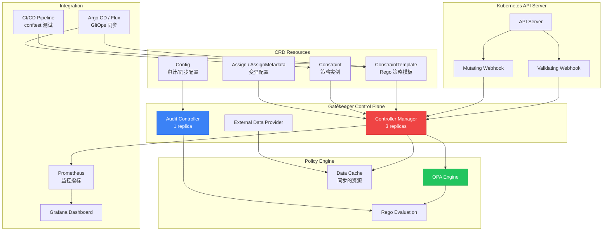

> **生产环境安全提示**
>
> 本文档包含可直接执行的运维命令。执行前请确认：当前目标集群与 Namespace 是否正确；是否具备足够的 RBAC 权限；是否已在非生产环境验证。命令风险等级标注：🔴 高风险（可能造成数据丢失或服务中断）、🟡 中风险（会修改集群状态，但通常可回滚）、🟢 低风险/只读（信息收集，无副作用）。


# OPA Gatekeeper 策略即代码深度实践

> **Author**: Cloud Native Security Architect | **Version**: v1.0 | **Update Time**: 2026-05-18
> **Scenario**: Enterprise-grade [[Kubernetes|Kubernetes]] policy enforcement with OPA Gatekeeper | **Complexity**: ⭐⭐⭐⭐

<!-- chunk: 概述 -->## 概述

OPA（Open Policy Agent）是一个通用的开源策略引擎，采用 Rego 语言声明式定义策略，能够与 Kubernetes、API 网关、CI/CD 管道等多种系统集成。Gatekeeper 是 OPA 在 Kubernetes 中的准入控制器实现，通过 CRD 将策略定义为 Kubernetes 原生资源，支持验证（Validate）、变异（Mutate）和审计（Audit）三种模式，为企业提供声明式的安全策略管理能力。

与 [[Kyverno|Kyverno]] 的 YAML 原生语法不同，OPA Gatekeeper 使用 Rego 策略语言。Rego 是一种声明式的策略查询语言，具有强大的模式匹配和数据查询能力，适合表达复杂的安全策略逻辑。学习 Rego 需要一定的投入，但一旦掌握，可以实现非常灵活和强大的策略控制，包括跨资源关联查询、复合条件判断、集合运算等高级功能。对于需要在 Kubernetes 之外也统一策略管理的场景（如 API 网关、Kafka 授权、SSH 访问控制等），OPA/Rego 是更好的选择。

## 威胁模型分析

在 Kubernetes 集群中，如果没有统一的策略执行机制，开发人员和运维人员可能会创建不安全的工作负载配置，导致严重的安全风险。OPA Gatekeeper 重点防护的威胁场景包括：

**容器逃逸风险**：特权容器、挂载宿主机 PID/Network 命名空间、添加危险 Linux Capabilities 等配置可被攻击者利用实现容器逃逸，获取宿主机控制权。具体的攻击路径包括：特权容器可以直接访问宿主机的所有设备文件，通过 `nsenter` 命令进入宿主机命名空间；挂载 `docker.sock` 的容器可以通过 Docker API 在宿主机上创建新的特权容器；拥有 `CAP_SYS_ADMIN` capability 的容器可以挂载宿主机文件系统、修改内核参数。Gatekeeper 通过准入控制拦截这些危险配置，确保所有工作负载遵循安全基线。

**供应链攻击**：未限制镜像来源允许从任意 Registry 拉取镜像，增加了供应链攻击面。攻击者可通过植入恶意镜像实现初始访问。典型的供应链攻击场景包括：在 Docker Hub 发布与流行镜像名称相似的恶意镜像（typosquatting）；通过依赖混淆攻击，在公共仓库发布与内部包同名的恶意版本；入侵 CI/CD 管道后修改构建脚本，在镜像中植入后门；通过中间人攻击替换 HTTP 传输的镜像层。Gatekeeper 的镜像来源限制策略确保仅使用经过审批的受信任 Registry。

**密钥泄露**：将敏感信息以明文形式写入 Pod 环境变量或 ConfigMap 中，会导致凭据泄露。攻击者获取 Pod 的环境变量（通过容器逃逸、API Server 访问或日志泄露）后可以直接读取数据库密码、API Key 等敏感信息。Gatekeeper 可检测并拦截这些不安全配置，强制要求使用 Secret 资源或外部密钥管理系统。

**合规违规**：企业需要满足 PCI-DSS、HIPAA、SOC2 等合规要求，但人工审查无法保证所有资源配置都符合标准。Gatekeeper 的审计功能可持续扫描存量资源，发现并报告合规偏差。在 SOC 2 审计中，需要证明所有部署的工作负载都满足安全基线，Gatekeeper 的审计报告可以作为合规证据。

**资源耗尽**：未设置资源限制的工作负载可能因内存泄漏或恶意利用消耗过多节点资源，影响同节点其他工作负载的可用性。这本质上是一种拒绝服务攻击向量——攻击者在获取一个 Pod 的控制权后，可以故意消耗大量资源影响整个节点。

**攻击向量与防御矩阵**：

| 攻击向量 | 风险等级 | Gatekeeper 防御 | ConstraintTemplate |
|:---|:---|:---|:---|
| 特权容器逃逸 | 严重 | 禁止 privileged:true | K8sBlockPrivileged |
| 危险 Capabilities | 高 | 禁止危险 capabilities | K8sBlockCapabilities |
| 主机命名空间 | 严重 | 禁止 hostPID/hostIPC/hostNetwork | K8sBlockHostNamespace |
| 未授权镜像源 | 高 | 限制镜像 Registry | K8sAllowedRepos |
| Latest 标签 | 中 | 禁止 :latest 标签 | K8sBlockLatestTag |
| 缺少标签 | 低 | 强制必要标签 | K8sRequiredLabels |
| 缺少资源限制 | 中 | 强制设置 limits | K8sResourceLimits |
| 密钥明文暴露 | 高 | 检测 env 中的敏感值 | K8sBlockSecretInEnv |
| HostPath 挂载 | 高 | 禁止 hostPath 卷 | K8sBlockHostPath |
| 缺少网络策略 | 中 | 检测命名空间缺少 NP | K8sRequireNetworkPolicy |

<!-- chunk: 架构设计 -->## 架构设计

## 核心组件架构



## 部署配置

生产环境的 Gatekeeper 部署需要考虑高可用性（至少 3 个控制器副本）、审计频率和资源分配。Controller Manager 负责准入控制，需要充足的 CPU 和内存以保证低延迟。Audit Controller 负责存量资源的定期合规扫描，在大规模集群中需要较长的审计间隔和分块处理以减少 API Server 负载。

> ⚠️ **🟡 中危变更** — 变更集群资源状态，建议先 --dry-run 或 diff 确认
> - `helm upgrade/install`：部署/升级 release

``` bash
# 🟡 中风险：会修改集群/资源状态，执行前请确认目标、影响范围与授权
helm repo add gatekeeper https://open-policy-agent.github.io/gatekeeper/charts
helm repo update

helm install gatekeeper gatekeeper/gatekeeper \
  --namespace gatekeeper-system \
  --create-namespace \
  --version 3.18.0 \
  --set replicas=3 \
  --set enableExternalData=true \
  --set enableMutation=true \
  --set validatingWebhookTimeoutSeconds=5 \
  --set mutatingWebhookTimeoutSeconds=2 \
  --set auditInterval=60 \
  --set auditFromCache=true \
  --set logDenies=true \
  --set emitAdmissionEvents=true
```
```yaml
# values-gatekeeper-production.yaml
replicas: 3

resources:
  requests:
    cpu: 200m
    memory: 512Mi
  limits:
    cpu: "1"
    memory: 1Gi

podDisruptionBudget:
  minAvailable: 2

affinity:
  podAntiAffinity:
    preferredDuringSchedulingIgnoredDuringExecution:
      - weight: 100
        podAffinityTerm:
          labelSelector:
            matchLabels:
              app: gatekeeper
          topologyKey: kubernetes.io/hostname

topologySpreadConstraints:
  - maxSkew: 1
    topologyKey: topology.kubernetes.io/zone
    whenUnsatisfiable: DoNotSchedule
    labelSelector:
      matchLabels:
        app: gatekeeper

enableMutation: true
enableExternalData: true

auditInterval: 60
auditMatchKindOnly: false
constraintViolationsLimit: 50
auditFromCache: true
auditChunkSize: 500

validatingWebhookFailurePolicy: Ignore
validatingWebhookTimeoutSeconds: 5
mutatingWebhookFailurePolicy: Ignore
mutatingWebhookTimeoutSeconds: 2

logLevel: INFO
logDenies: true
emitAdmissionEvents: true
emitAuditEvents: true

metrics:
  enabled: true
  serviceMonitor:
    enabled: true
```

<!-- chunk: 核心配置 -->## 核心配置

## ConstraintTemplate 策略模板

ConstraintTemplate 是 Gatekeeper 的核心概念。每个 ConstraintTemplate 包含一段 Rego 策略代码和一个 CRD Schema 定义。Rego 代码定义了策略的检查逻辑，CRD Schema 定义了 Constraint 可以接受的参数。这种模板化设计使得同一个 ConstraintTemplate 可以被多个 Constraint 实例化，每个实例使用不同的参数，实现策略的复用和灵活配置。

```yaml
apiVersion: templates.gatekeeper.sh/v1
kind: ConstraintTemplate
metadata:
  name: k8srequiredlabels
  annotations:
    description: "要求资源必须包含指定标签，支持正则校验"
    metadata.gatekeeper.sh/title: "Required Labels"
spec:
  crd:
    spec:
      names:
        kind: K8sRequiredLabels
      validation:
        openAPIV3Schema:
          type: object
          properties:
            labels:
              type: array
              items:
                type: object
                properties:
                  key:
                    type: string
                  allowedRegex:
                    type: string
  targets:
    - target: admission.k8s.gatekeeper.sh
      rego: |
        package k8srequiredlabels

        violation[{"msg": msg}] {
          provided := {label | input.review.object.metadata.labels[label]}
          required := {label | label := input.parameters.labels[_].key}
          missing := required - provided
          count(missing) > 0
          msg := sprintf("必须包含标签: %v", [missing])
        }

        violation[{"msg": msg}] {
          label := input.parameters.labels[_]
          value := input.review.object.metadata.labels[label.key]
          label.allowedRegex
          not regex.match(label.allowedRegex, value)
          msg := sprintf("标签 %v 的值 %v 不符合正则 %v", [label.key, value, label.allowedRegex])
        }
---
apiVersion: templates.gatekeeper.sh/v1
kind: ConstraintTemplate
metadata:
  name: k8sallowedrepos
  annotations:
    description: "限制容器镜像来源 Registry"
    metadata.gatekeeper.sh/title: "Allowed Repositories"
spec:
  crd:
    spec:
      names:
        kind: K8sAllowedRepos
      validation:
        openAPIV3Schema:
          type: object
          properties:
            repos:
              type: array
              items:
                type: string
  targets:
    - target: admission.k8s.gatekeeper.sh
      rego: |
        package k8sallowedrepos

        violation[{"msg": msg}] {
          container := input_containers[_]
          satisfied := [good | repo := input.parameters.repos[_]
                              good := startswith(container.image, repo)]
          not any(satisfied)
          msg := sprintf("容器 <%v> 使用未授权镜像 <%v>，允许: %v",
                        [container.name, container.image, input.parameters.repos])
        }

        input_containers[c] {
          c := input.review.object.spec.containers[_]
        }
        input_containers[c] {
          c := input.review.object.spec.initContainers[_]
        }
        input_containers[c] {
          c := input.review.object.spec.ephemeralContainers[_]
        }
---
apiVersion: templates.gatekeeper.sh/v1
kind: ConstraintTemplate
metadata:
  name: k8sresourcelimits
  annotations:
    description: "强制容器设置资源限制"
    metadata.gatekeeper.sh/title: "Resource Limits"
spec:
  crd:
    spec:
      names:
        kind: K8sResourceLimits
      validation:
        openAPIV3Schema:
          type: object
          properties:
            cpu:
              type: string
            memory:
              type: string
  targets:
    - target: admission.k8s.gatekeeper.sh
      rego: |
        package k8sresourcelimits

        violation[{"msg": msg}] {
          container := input_containers[_]
          not container.resources.limits.cpu
          msg := sprintf("容器 <%v> 未设置 CPU 限制", [container.name])
        }

        violation[{"msg": msg}] {
          container := input_containers[_]
          not container.resources.limits.memory
          msg := sprintf("容器 <%v> 未设置内存限制", [container.name])
        }

        violation[{"msg": msg}] {
          container := input_containers[_]
          input.parameters.cpu
          cpu_limit := resource.parse_quantity(container.resources.limits.cpu)
          max_cpu := resource.parse_quantity(input.parameters.cpu)
          cpu_limit > max_cpu
          msg := sprintf("容器 <%v> CPU 限制 %v 超过最大值 %v",
                        [container.name, container.resources.limits.cpu, input.parameters.cpu])
        }

        input_containers[c] {
          c := input.review.object.spec.containers[_]
        }
        input_containers[c] {
          c := input.review.object.spec.initContainers[_]
        }
---
apiVersion: templates.gatekeeper.sh/v1
kind: ConstraintTemplate
metadata:
  name: k8sblockhostnamespace
  annotations:
    description: "禁止使用主机命名空间"
    metadata.gatekeeper.sh/title: "Block Host Namespace"
spec:
  crd:
    spec:
      names:
        kind: K8sBlockHostNamespace
  targets:
    - target: admission.k8s.gatekeeper.sh
      rego: |
        package k8sblockhostnamespace

        violation[{"msg": msg}] {
          input.review.object.spec.hostPID == true
          msg := "禁止使用 hostPID"
        }
        violation[{"msg": msg}] {
          input.review.object.spec.hostIPC == true
          msg := "禁止使用 hostIPC"
        }
        violation[{"msg": msg}] {
          input.review.object.spec.hostNetwork == true
          msg := "禁止使用 hostNetwork"
        }
---
apiVersion: templates.gatekeeper.sh/v1
kind: ConstraintTemplate
metadata:
  name: k8sblocklatesttag
  annotations:
    description: "禁止使用 :latest 镜像标签"
    metadata.gatekeeper.sh/title: "Block Latest Tag"
spec:
  crd:
    spec:
      names:
        kind: K8sBlockLatestTag
  targets:
    - target: admission.k8s.gatekeeper.sh
      rego: |
        package k8sblocklatesttag

        violation[{"msg": msg}] {
          container := input_containers[_]
          image := container.image
          endswith(image, ":latest")
          msg := sprintf("容器 <%v> 使用了 :latest 标签 <%v>", [container.name, image])
        }

        violation[{"msg": msg}] {
          container := input_containers[_]
          image := container.image
          not contains(image, ":")
          msg := sprintf("容器 <%v> 的镜像 <%v> 未指定标签（默认为 latest）", [container.name, image])
        }

        input_containers[c] {
          c := input.review.object.spec.containers[_]
        }
        input_containers[c] {
          c := input.review.object.spec.initContainers[_]
        }
---
apiVersion: templates.gatekeeper.sh/v1
kind: ConstraintTemplate
metadata:
  name: k8sblockhostpath
  annotations:
    description: "禁止使用 HostPath 卷挂载"
    metadata.gatekeeper.sh/title: "Block HostPath Mounts"
spec:
  crd:
    spec:
      names:
        kind: K8sBlockHostPath
      validation:
        openAPIV3Schema:
          type: object
          properties:
            allowedPaths:
              type: array
              items:
                type: string
  targets:
    - target: admission.k8s.gatekeeper.sh
      rego: |
        package k8sblockhostpath

        violation[{"msg": msg}] {
          volume := input.review.object.spec.volumes[_]
          volume.hostPath
          not is_allowed(volume.hostPath.path)
          msg := sprintf("禁止使用 HostPath 挂载: %v", [volume.hostPath.path])
        }

        is_allowed(path) {
          allowed := input.parameters.allowedPaths[_]
          startswith(path, allowed)
        }
```

## Constraint 策略实例

Constraint 是 ConstraintTemplate 的实例化，定义了策略的匹配范围和参数。通过 `match` 字段可以精确控制策略应用的资源范围，包括资源类型、命名空间、标签选择器等。通过 `excludedNamespaces` 可以排除系统命名空间，避免策略影响关键系统组件。

```yaml
apiVersion: constraints.gatekeeper.sh/v1beta1
kind: K8sRequiredLabels
metadata:
  name: require-cost-labels
spec:
  match:
    kinds:
      - apiGroups: [""]
        kinds: ["Namespace"]
    excludedNamespaces:
      - kube-system
      - gatekeeper-system
      - kube-node-lease
      - kube-public
  parameters:
    labels:
      - key: cost-center
        allowedRegex: "^team-[a-z]+$"
      - key: environment
        allowedRegex: "^(production|staging|development)$"
      - key: owned-by
        allowedRegex: "^[a-z]+@[a-z]+\\.[a-z]+$"
---
apiVersion: constraints.gatekeeper.sh/v1beta1
kind: K8sAllowedRepos
metadata:
  name: restrict-image-registries
spec:
  match:
    kinds:
      - apiGroups: [""]
        kinds: ["Pod"]
      - apiGroups: ["apps"]
        kinds: ["Deployment", "StatefulSet", "DaemonSet"]
    excludedNamespaces:
      - kube-system
      - gatekeeper-system
      - istio-system
  parameters:
    repos:
      - "registry.company.com/"
      - "harbor.company.com/"
      - "gcr.io/company/"
---
apiVersion: constraints.gatekeeper.sh/v1beta1
kind: K8sResourceLimits
metadata:
  name: enforce-resource-limits
spec:
  match:
    kinds:
      - apiGroups: [""]
        kinds: ["Pod"]
    excludedNamespaces:
      - kube-system
      - gatekeeper-system
  parameters:
    cpu: "4"
    memory: "8Gi"
---
apiVersion: constraints.gatekeeper.sh/v1beta1
kind: K8sBlockHostNamespace
metadata:
  name: block-host-namespace
spec:
  match:
    kinds:
      - apiGroups: [""]
        kinds: ["Pod"]
    excludedNamespaces:
      - kube-system
      - gatekeeper-system
      - calico-system
---
apiVersion: constraints.gatekeeper.sh/v1beta1
kind: K8sBlockLatestTag
metadata:
  name: block-latest-tag
spec:
  match:
    kinds:
      - apiGroups: [""]
        kinds: ["Pod"]
      - apiGroups: ["apps"]
        kinds: ["Deployment", "StatefulSet", "DaemonSet"]
    excludedNamespaces:
      - kube-system
      - gatekeeper-system
---
apiVersion: constraints.gatekeeper.sh/v1beta1
kind: K8sBlockHostPath
metadata:
  name: block-hostpath-mounts
spec:
  match:
    kinds:
      - apiGroups: [""]
        kinds: ["Pod"]
    excludedNamespaces:
      - kube-system
      - gatekeeper-system
  parameters:
    allowedPaths:
      - "/dev/null"
```

<!-- chunk: 安全策略实战 -->## 安全策略实战

## 变异策略自动注入安全配置

Gatekeeper 的变异功能通过 Assign 和 AssignMetadata CRD 实现，可以在资源创建时自动注入安全配置。Assign 用于修改 spec 级别的字段，AssignMetadata 用于修改 metadata 级别的字段（如标签和注释）。变异操作仅在字段不存在时生效（使用 `path` 匹配），不会覆盖用户已设置的值。

```yaml
apiVersion: mutations.gatekeeper.sh/v1
kind: Assign
metadata:
  name: inject-security-context
spec:
  applyTo:
    - groups: [""]
      kinds: ["Pod"]
      versions: ["v1"]
  match:
    scope: Namespaced
    excludedNamespaces:
      - kube-system
      - gatekeeper-system
  location: "spec.containers[name:*].securityContext.allowPrivilegeEscalation"
  parameters:
    assign:
      value: false
---
apiVersion: mutations.gatekeeper.sh/v1
kind: Assign
metadata:
  name: inject-run-as-non-root
spec:
  applyTo:
    - groups: [""]
      kinds: ["Pod"]
      versions: ["v1"]
  match:
    scope: Namespaced
    excludedNamespaces:
      - kube-system
      - gatekeeper-system
  location: "spec.securityContext.runAsNonRoot"
  parameters:
    assign:
      value: true
---
apiVersion: mutations.gatekeeper.sh/v1
kind: Assign
metadata:
  name: inject-drop-capabilities
spec:
  applyTo:
    - groups: [""]
      kinds: ["Pod"]
      versions: ["v1"]
  match:
    scope: Namespaced
    excludedNamespaces:
      - kube-system
      - gatekeeper-system
  location: "spec.containers[name:*].securityContext.capabilities.drop"
  parameters:
    assign:
      value:
        - ALL
---
apiVersion: mutations.gatekeeper.sh/v1
kind: AssignMetadata
metadata:
  name: inject-managed-by-label
spec:
  match:
    scope: Namespaced
    kinds:
      - apiGroups: ["apps"]
        kinds: ["Deployment", "StatefulSet"]
  location: "metadata.labels.managed-by"
  parameters:
    assign:
      value: "gatekeeper-mutation"
---
apiVersion: mutations.gatekeeper.sh/v1
kind: AssignMetadata
metadata:
  name: inject-environment-label
spec:
  match:
    scope: Namespaced
    kinds:
      - apiGroups: [""]
        kinds: ["Namespace"]
  location: "metadata.labels.gatekeeper-managed"
  parameters:
    assign:
      value: "true"
```

## 渐进式策略部署

生产环境的策略落地应该采用渐进式方法。首先以 dryrun（审计）模式部署策略，观察违规情况但不阻断任何操作。确认策略逻辑正确且无重大误报后，在非关键命名空间切换为 deny（强制）模式。稳定后逐步扩展到所有命名空间。这种分阶段部署方式可以最大程度降低策略上线对业务的影响。

```yaml
# Audit 模式: 仅观察不阻断
apiVersion: constraints.gatekeeper.sh/v1beta1
kind: K8sRequiredLabels
metadata:
  name: require-app-labels-audit
spec:
  enforcementAction: dryrun
  match:
    kinds:
      - apiGroups: ["apps"]
        kinds: ["Deployment"]
  parameters:
    labels:
      - key: app.kubernetes.io/name
      - key: app.kubernetes.io/version
---
# Enforce 模式: 阻断违规请求
apiVersion: constraints.gatekeeper.sh/v1beta1
kind: K8sRequiredLabels
metadata:
  name: require-app-labels-enforce
spec:
  enforcementAction: deny
  match:
    kinds:
      - apiGroups: ["apps"]
        kinds: ["Deployment"]
    namespaces:
      - production
      - staging
  parameters:
    labels:
      - key: app.kubernetes.io/name
      - key: app.kubernetes.io/version
```

## 高级 Rego 策略示例

以下示例展示了 Rego 语言的强大表达能力，包括跨资源关联查询、复合条件判断等高级功能。

```yaml
apiVersion: templates.gatekeeper.sh/v1
kind: ConstraintTemplate
metadata:
  name: k8srequirenetworkpolicy
  annotations:
    description: "检测命名空间中是否存在默认 NetworkPolicy"
spec:
  crd:
    spec:
      names:
        kind: K8sRequireNetworkPolicy
  targets:
    - target: admission.k8s.gatekeeper.sh
      rego: |
        package k8srequirenetworkpolicy

        violation[{"msg": msg}] {
          ns := input.review.object.metadata.name
          not has_default_deny_policy(ns)
          msg := sprintf("命名空间 <%v> 缺少默认 deny NetworkPolicy", [ns])
        }

        has_default_deny_policy(ns) {
          some np in data.inventory.namespace[ns]["networking.k8s.io/v1"].NetworkPolicy
          np.spec.podSelector == {}
          "Ingress" in np.spec.policyTypes
        }
---
apiVersion: templates.gatekeeper.sh/v1
kind: ConstraintTemplate
metadata:
  name: k8suniqueingresshost
  annotations:
    description: "确保 Ingress Host 唯一，防止域名冲突"
spec:
  crd:
    spec:
      names:
        kind: K8sUniqueIngressHost
  targets:
    - target: admission.k8s.gatekeeper.sh
      rego: |
        package k8suniqueingresshost

        same_host(host) {
          ns := input.review.object.metadata.namespace
          some i in data.inventory.namespace[ns]["networking.k8s.io/v1"].Ingress
          some rule in i.spec.rules
          rule.host == host
        }

        violation[{"msg": msg}] {
          some rule in input.review.object.spec.rules
          same_host(rule.host)
          msg := sprintf("Ingress host <%v> 已被占用", [rule.host])
        }
```

<!-- chunk: 合规与审计 -->## 合规与审计

## 审计配置

Gatekeeper 的审计功能通过 Audit Controller 实现，定期扫描集群中的存量资源，将合规状态写入 Constraint 的 `status.violations` 字段。审计间隔、扫描范围和资源同步都通过 Config CRD 配置。

```yaml
apiVersion: config.gatekeeper.sh/v1alpha1
kind: Config
metadata:
  name: config
  namespace: gatekeeper-system
spec:
  match:
    - excludedNamespaces:
        - kube-system
        - gatekeeper-system
        - kube-node-lease
        - kube-public
      processes:
        - audit
        - webhook
  sync:
    syncOnly:
      - group: ""
        version: "v1"
        kind: Namespace
      - group: ""
        version: "v1"
        kind: Pod
      - group: "networking.k8s.io"
        version: "v1"
        kind: NetworkPolicy
      - group: "networking.k8s.io"
        version: "v1"
        kind: Ingress
  validation:
    traces:
      - user: "admin"
        kind:
          group: ""
          version: "v1"
          kind: "Pod"
        dump: "All"
```

## 违规查看

``` bash
# 🟢 低风险：只读/信息收集，通常无副作用
# 查看所有违规
kubectl get constraints -o json | jq '.items[] | {name: .metadata.name, violations: .status.violations}'

# 查看特定约束的违规
kubectl get k8srequiredlabels require-cost-labels -o json | jq '.status.violations'

# 统计违规数量
kubectl get constraints -o json | jq -r '
  .items[] |
  "\(.kind)/\(.metadata.name): \(.status.totalViolations // 0) violations"
'

# 查看审计日志
kubectl logs -n gatekeeper-system deployment/gatekeeper-audit --tail=50

# 生成合规报告
kubectl get constraints -o json | jq -r '
  .items[] |
  select(.status.totalViolations > 0) |
  {name: .metadata.name, total: .status.totalViolations, enforcement: .spec.enforcementAction}
'

# 查看特定命名空间的违规
kubectl get constraints -o json | jq -r '
  .items[] |
  .status.violations[]? |
  select(.namespace == "production") |
  "\(.kind)/\(.name): \(.message)"
'

# 导出完整合规报告
kubectl get constraints -o json | jq '{
  report_date: now | strftime("%Y-%m-%dT%H:%M:%SZ"),
  constraints: [.items[] | {
    name: .metadata.name,
    kind: .kind,
    enforcement: .spec.enforcementAction,
    total_violations: .status.totalViolations,
    violations: [.status.violations[]? | {
      namespace: .namespace,
      kind: .kind,
      name: .name,
      message: .message
    }]
  }]
}'
```
## OPA vs Kyverno 对比

| 维度 | OPA Gatekeeper | Kyverno |
|:---|:---|:---|
| **策略语言** | Rego（专用 DSL） | YAML（K8s 原生） |
| **学习曲线** | 高（需学 Rego） | 低（YAML 即可） |
| **灵活性** | 极高（通用策略引擎） | 高（K8s 场景优化） |
| **变异能力** | 支持（Assign/AssignMetadata） | 支持（patchStrategicMerge） |
| **外部数据** | 支持（External Data） | 支持（API Call） |
| **镜像验证** | 不原生支持 | 原生 VerifyImages |
| **清理策略** | 不支持 | 原生 CleanupPolicy |
| **非 K8s 场景** | 支持（API 网关、SSH 等） | 不支持 |
| **策略模板复用** | ConstraintTemplate | 策略可继承和引用 |
| **社区策略库** | Gatekeeper Library | Kyverno Policies |
| **推荐场景** | 复杂策略/跨平台统一 | 快速落地/纯 K8s 环境 |

<!-- chunk: 监控与告警 -->## 监控与告警

## Prometheus 告警规则

```yaml
apiVersion: monitoring.coreos.com/v1
kind: PrometheusRule
metadata:
  name: gatekeeper-alerts
  namespace: gatekeeper-system
spec:
  groups:
    - name: gatekeeper.rules
      rules:
        - alert: GatekeeperControllerDown
          expr: up{job="gatekeeper"} == 0
          for: 5m
          labels:
            severity: critical
          annotations:
            summary: "Gatekeeper 控制器不可用"
            description: "Gatekeeper 已停止响应，策略执行中断"

        - alert: GatekeeperHighViolations
          expr: gatekeeper_violations > 20
          for: 10m
          labels:
            severity: warning
          annotations:
            summary: "Gatekeeper 违规数量过高: {{ $value }}"
            description: "请检查违规详情并通知相关团队修复"

        - alert: GatekeeperWebhookLatencyHigh
          expr: |
            histogram_quantile(0.95,
              rate(gatekeeper_validation_request_duration_seconds_bucket[5m])
            ) > 2
          for: 5m
          labels:
            severity: warning
          annotations:
            summary: "Gatekeeper Webhook P95 延迟超过 2 秒"
            description: "延迟过高可能影响集群部署性能"

        - alert: GatekeeperWebhookDenyRate
          expr: rate(gatekeeper_validation_requests_denied[5m]) > 5
          for: 2m
          labels:
            severity: info
          annotations:
            summary: "Gatekeeper 拒绝率异常: {{ $value }}/s"
            description: "可能存在大量不合规的部署尝试"

        - alert: GatekeeperAuditStale
          expr: |
            time() - gatekeeper_audit_last_run_timestamp > 600
          for: 5m
          labels:
            severity: warning
          annotations:
            summary: "Gatekeeper 审计扫描超过 10 分钟未执行"
            description: "合规状态可能已过期"

        - alert: GatekeeperSyncErrors
          expr: rate(gatekeeper_sync_error_count[5m]) > 0
          for: 5m
          labels:
            severity: warning
          annotations:
            summary: "Gatekeeper 数据同步错误"
            description: "资源同步失败可能影响策略评估准确性"
```

## Grafana Dashboard

```json
{
  "dashboard": {
    "title": "OPA Gatekeeper Dashboard",
    "panels": [
      {
        "title": "Admission Review Rate",
        "type": "timeseries",
        "gridPos": {"h": 8, "w": 12, "x": 0, "y": 0},
        "targets": [
          {
            "expr": "sum(rate(gatekeeper_validation_request_duration_seconds_count[5m]))",
            "legendFormat": "Total Requests"
          },
          {
            "expr": "sum(rate(gatekeeper_validation_requests_denied[5m]))",
            "legendFormat": "Denied"
          }
        ]
      },
      {
        "title": "Webhook Latency Percentiles",
        "type": "timeseries",
        "gridPos": {"h": 8, "w": 12, "x": 12, "y": 0},
        "targets": [
          {
            "expr": "histogram_quantile(0.50, rate(gatekeeper_validation_request_duration_seconds_bucket[5m]))",
            "legendFormat": "P50"
          },
          {
            "expr": "histogram_quantile(0.95, rate(gatekeeper_validation_request_duration_seconds_bucket[5m]))",
            "legendFormat": "P95"
          },
          {
            "expr": "histogram_quantile(0.99, rate(gatekeeper_validation_request_duration_seconds_bucket[5m]))",
            "legendFormat": "P99"
          }
        ]
      },
      {
        "title": "Violations by Constraint",
        "type": "barchart",
        "gridPos": {"h": 8, "w": 12, "x": 0, "y": 8},
        "targets": [
          {
            "expr": "gatekeeper_violations",
            "legendFormat": "{{constraint_kind}}/{{constraint_name}}"
          }
        ]
      },
      {
        "title": "Constraint Count",
        "type": "stat",
        "gridPos": {"h": 4, "w": 6, "x": 12, "y": 8},
        "targets": [
          {
            "expr": "count(gatekeeper_constraint_info)",
            "legendFormat": "Constraints"
          }
        ]
      },
      {
        "title": "Template Count",
        "type": "stat",
        "gridPos": {"h": 4, "w": 6, "x": 18, "y": 8},
        "targets": [
          {
            "expr": "count(gatekeeper_template_info)",
            "legendFormat": "Templates"
          }
        ]
      }
    ]
  }
}
```

<!-- chunk: 最佳实践 -->## 最佳实践

## 策略开发流程

策略开发应遵循结构化流程：首先明确策略目标和适用范围，编写 ConstraintTemplate 和 Constraint。使用 `conftest` 在本地进行单元测试。在开发集群中以 Audit 模式部署观察，确认无误报后切换 Enforce 模式。最后将策略纳入 GitOps 流程，通过代码审查和 CI/CD 管道管理策略变更。

1. **需求分析**：明确策略要防御的威胁和适用的资源范围
2. **Rego 开发**：编写 ConstraintTemplate，包含完整的 Rego 策略逻辑
3. **单元测试**：使用 conftest 在本地验证策略行为
4. **审计部署**：以 dryrun 模式部署到开发集群，观察 2-3 周
5. **强制部署**：确认无误后切换为 deny 模式
6. **GitOps 集成**：通过 Argo CD/Flux 管理策略生命周期

## Rego 策略测试

> ⚠️ **🟡 中危变更** — 变更集群资源状态，建议先 --dry-run 或 diff 确认
> - `kubectl apply/create/replace`：创建/变更集群资源

``` bash
# 🟡 中风险：会修改集群/资源状态，执行前请确认目标、影响范围与授权
# 安装 conftest
wget -q https://github.com/open-policy-agent/conftest/releases/download/v0.55.0/conftest_0.55.0_Linux_x86_64.tar.gz
tar xzf conftest_0.55.0_Linux_x86_64.tar.gz
sudo mv conftest /usr/local/bin/

# 测试策略
conftest test policies/gatekeeper/test/resources/ -p policies/gatekeeper/policies/

# 验证 ConstraintTemplate
for f in policies/gatekeeper/templates/*.yaml; do
  kubectl apply --dry-run=client -f "$f" 2>&1 || exit 1
done
```
## CI/CD 集成

```yaml
# .github/workflows/gatekeeper-policy-test.yml
name: Gatekeeper Policy Tests
on:
  pull_request:
    paths:
      - 'policies/gatekeeper/**'

jobs:
  test:
    runs-on: ubuntu-latest
    steps:
      - uses: actions/checkout@v4

      - name: Install conftest
        run: |
          wget -q https://github.com/open-policy-agent/conftest/releases/download/v0.55.0/conftest_0.55.0_Linux_x86_64.tar.gz
          tar xzf conftest_0.55.0_Linux_x86_64.tar.gz
          sudo mv conftest /usr/local/bin/

      - name: Test Rego policies
        run: conftest test policies/gatekeeper/test/resources/ -p policies/gatekeeper/policies/

      - name: Validate ConstraintTemplates
        run: |
          for f in policies/gatekeeper/templates/*.yaml; do
            kubectl apply --dry-run=client -f "$f" 2>&1 || exit 1
          done

      - name: Rego Style Check
        run: |
          which opa || (curl -L -o opa https://openpolicyagent.org/downloads/latest/opa_linux_amd64 && chmod +x opa)
          ./opa fmt --list policies/gatekeeper/policies/
```

## GitOps 集成

```yaml
apiVersion: argoproj.io/v1alpha1
kind: Application
metadata:
  name: gatekeeper-policies
  namespace: argocd
spec:
  project: security
  source:
    repoURL: https://github.com/company/security-policies.git
    targetRevision: main
    path: gatekeeper
    directory:
      recurse: true
  destination:
    server: https://kubernetes.default.svc
    namespace: gatekeeper-system
  syncPolicy:
    automated:
      prune: true
      selfHeal: true
    syncOptions:
      - CreateNamespace=true
      - ServerSideApply=true
  ignoreDifferences:
    - group: constraints.gatekeeper.sh
      kind: "*"
      jsonPointers:
        - /status
```

<!-- chunk: 事件响应流程 -->## 事件响应流程

当 Gatekeeper 检测到安全违规时，应遵循以下事件响应流程：

1. **检测**：通过 Prometheus 告警或定期合规报告发现违规
2. **分类**：根据违规的严重程度和影响范围进行分类
3. **通知**：通知相关的开发团队和安全管理员
4. **修复**：开发团队修复资源配置，使其符合安全基线
5. **验证**：确认修复后资源通过策略检查
6. **复盘**：分析违规根因，优化策略或流程防止再次发生

| 违规严重程度 | 响应时间 | 动作 |
|:---|:---|:---|
| Critical（特权容器、主机命名空间） | < 1 小时 | 立即阻断并通知 |
| High（未授权镜像、HostPath 挂载） | < 4 小时 | 阻断并创建工单 |
| Medium（缺少资源限制、标签） | < 24 小时 | 审计记录并限期修复 |
| Low（缺少建议标签） | < 1 周 | 审计记录并优化 |

<!-- chunk: 故障排查 -->## 故障排查

## 完整诊断脚本

``` bash
# 🟢 低风险：只读/信息收集，通常无副作用
#!/bin/bash
# gatekeeper_diagnostics.sh

echo "=== Gatekeeper Health ==="
kubectl get pods -n gatekeeper-system -o wide
echo ""

echo "=== Resource Usage ==="
kubectl top pods -n gatekeeper-system
echo ""

echo "=== ConstraintTemplate Status ==="
kubectl get constrainttemplates -o custom-columns=NAME:.metadata.name,READY:.status.byPod[0].enforced
echo ""

echo "=== Constraint Violations Summary ==="
kubectl get constraints -o json | jq -r '.items[] | "\(.kind)/\(.metadata.name): \(.status.totalViolations // 0) violations (\(.spec.enforcementAction // "deny"))"'
echo ""

echo "=== Detailed Violations (Top 20) ==="
kubectl get constraints -o json | jq -r '.items[] | .status.violations[]? | "\(.namespace // "cluster")/\(.kind)/\(.name): \(.message)"' | head -20
echo ""

echo "=== Webhook Configuration ==="
kubectl get validatingwebhookconfigurations -o yaml | grep -A5 "gatekeeper"
kubectl get mutatingwebhookconfigurations -o yaml | grep -A5 "gatekeeper"
echo ""

echo "=== Recent Deny Events ==="
kubectl get events -n gatekeeper-system --field-selector reason=FailedAdmission --sort-by='.lastTimestamp' | tail -20
echo ""

echo "=== Controller Logs (last 30 lines) ==="
kubectl logs -n gatekeeper-system -l app=gatekeeper --tail=30
echo ""

echo "=== Audit Controller Logs ==="
kubectl logs -n gatekeeper-system deployment/gatekeeper-audit --tail=20
echo ""

echo "=== Config Status ==="
kubectl get config -n gatekeeper-system -o yaml
```
## 常见问题

**ConstraintTemplate 无法创建**：检查 Rego 语法是否正确。使用 `opa check` 命令验证 Rego 代码语法。检查 CRD Schema 定义是否正确，参数类型是否与 Rego 代码中的引用匹配。

**策略不生效**：检查 Constraint 的 `match` 字段是否正确匹配了目标资源。检查 `excludedNamespaces` 是否意外排除了目标命名空间。确认 ConstraintTemplate 的 `status.byPod[0].enforced` 为 true。

**审计不运行**：检查 Config CRD 中的 `sync.syncOnly` 是否包含了需要审计的资源类型。检查 Audit Controller Pod 是否正常运行。查看 Audit Controller 日志是否有错误。

**Webhook 拒绝所有请求**：紧急恢复方法是将 Webhook 的 failurePolicy 改为 Ignore：

> ⚠️ **🟡 中危变更** — 变更集群资源状态，建议先 --dry-run 或 diff 确认
> - `kubectl edit/patch`：修改运行中的资源

``` bash
# 🟡 中风险：会修改集群/资源状态，执行前请确认目标、影响范围与授权
# 紧急恢复
for wh in $(kubectl get validatingwebhookconfigurations -l app=gatekeeper -o name); do
  kubectl patch "$wh" --type json -p='[{"op":"replace","path":"/webhooks/0/failurePolicy","value":"Ignore"}]'
done

# 恢复
for wh in $(kubectl get validatingwebhookconfigurations -l app=gatekeeper -o name); do
  kubectl patch "$wh" --type json -p='[{"op":"replace","path":"/webhooks/0/failurePolicy","value":"Fail"}]'
done
```
---

*本文档基于 OPA Gatekeeper 策略管理实践经验编写，持续更新最新技术和最佳实践。*

---

<!-- chunk: Obsidian 相关文档 -->## Obsidian 相关文档

- 安全 MOC
- [[08-安全/README.md|Domain 05: 云原生安全 (Cloud Native Security)]]
- [[08-安全/00-总览/00-open-source-projects-index.md|Domain-25 云原生安全 — 开源项目索引]]
- Falco 云原生安全监控深度实践
- Sysdig企业级容器安全深度实践
- Aqua Security 企业级容器安全平台深度实践
- Kyverno 企业级策略管理深度实践
- HashiCorp Vault 企业级密钥管理深度实践
- OPA Gatekeeper 策略即代码深度实践
- 容器镜像安全扫描深度实践
- Kubernetes 安全加固深度实践
- gVisor 容器沙箱深度解析

## See Also

- 99-java-security-kubernetes-guide
- 99-kyverno-policy-guide
- 99-vault-k8s-secrets-guide
- 01-falco-cloud-native-security

- [[08-安全/README.md|返回目录]]

## Related

- [[21-生态参考/03-领域索引/security-index.md|Security 安全知识图谱索引]]


<!-- risk-assessed -->
