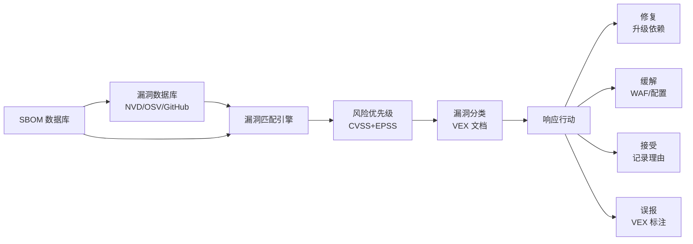
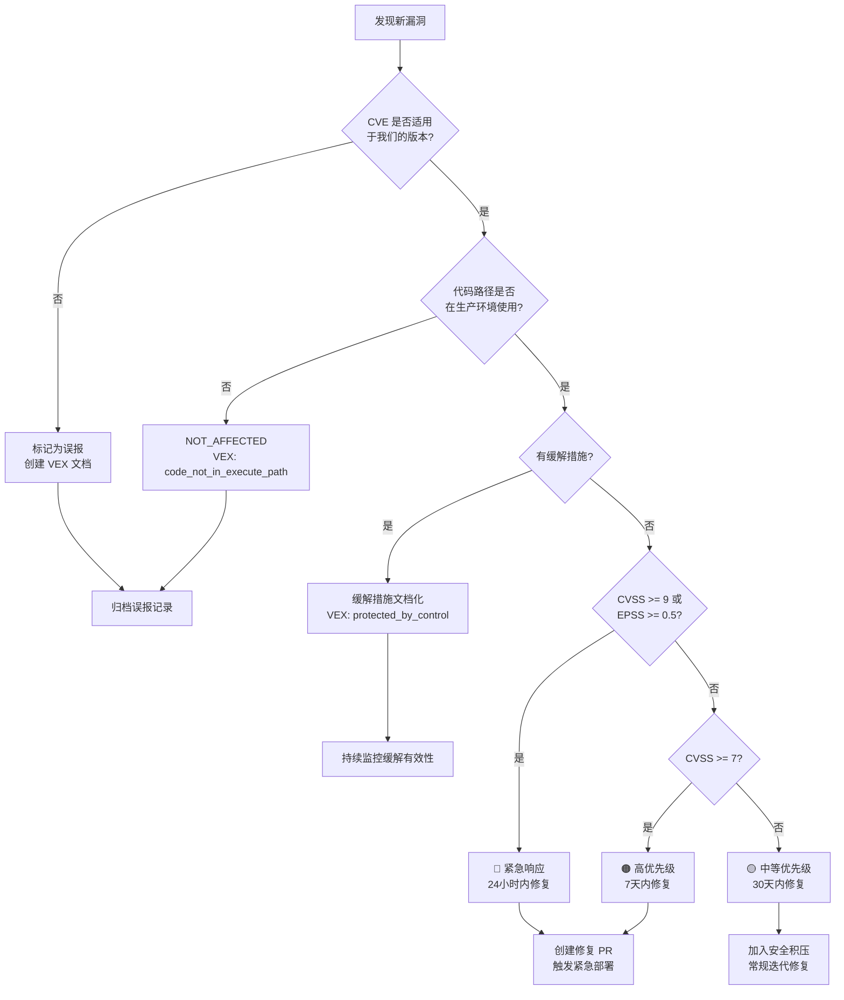
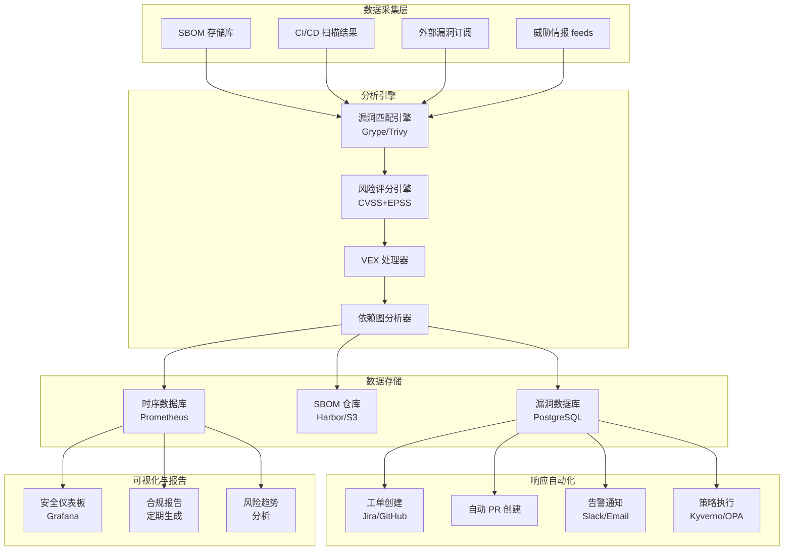

> **生产环境安全提示**
>
> 本文档包含可直接执行的运维命令。执行前请确认：当前目标集群与 Namespace 是否正确；是否具备足够的 RBAC 权限；是否已在非生产环境验证。命令风险等级标注：🔴 高风险（可能造成数据丢失或服务中断）、🟡 中风险（会修改集群状态，但通常可回滚）、🟢 低风险/只读（信息收集，无副作用）。


# SBOM 漏洞分析与治理 (SBOM Vulnerability Analysis and Governance)

> 基于 SBOM 的漏洞分析是现代供应链安全治理的核心，通过系统化的漏洞发现、评估、响应和跟踪，实现主动安全态势管理。

---

<!-- chunk: 目录 (Table of Contents) -->## 目录 (Table of Contents)

1. [SBOM 驱动的漏洞分析基础](#1-sbom-驱动的漏洞分析基础)
2. [Grype 漏洞扫描完整指南](#2-grype-漏洞扫描完整指南)
3. [VEX 漏洞可利用性交换](#3-vex-漏洞可利用性交换)
4. [CVSS 风险评分体系](#4-cvss-风险评分体系)
5. [EPSS 漏洞利用预测](#5-epss-漏洞利用预测)
6. [依赖图谱漏洞传播分析](#6-依赖图谱漏洞传播分析)
7. [漏洞治理框架](#7-漏洞治理框架)
8. [自动化修复工作流](#8-自动化修复工作流)
9. [漏洞数据源与情报](#9-漏洞数据源与情报)
10. [合规性漏洞报告](#10-合规性漏洞报告)
11. [漏洞度量与 KPI](#11-漏洞度量与-kpi)
12. [企业级漏洞治理平台](#12-企业级漏洞治理平台)

---

<!-- chunk: 1. SBOM 驱动的漏洞分析基础 -->## 1. SBOM 驱动的漏洞分析基础

## 1.1 SBOM 与漏洞分析的关系

```
传统漏洞管理 vs SBOM 驱动的漏洞管理:

传统方式:
发现漏洞 → 手动清查受影响系统 → 耗时数天/周 → 响应滞后

SBOM 驱动:
发现漏洞 → 查询 SBOM 数据库 → 秒级定位受影响组件 → 快速响应

Log4Shell 响应时间对比:
- 有 SBOM: 平均响应时间 < 2小时
- 无 SBOM: 平均响应时间 > 5天
```



## 1.2 漏洞匹配原理

```
漏洞匹配流程:

1. SBOM 组件标识
   ─ 包名 + 版本号
   ─ PURL (Package URL)
   ─ CPE (Common Platform Enumeration)

2. 漏洞数据库查询
   NVD 匹配: 基于 CPE 2.3 模式匹配
   OSV 匹配: 基于版本范围匹配
   GitHub 匹配: 基于 GHSA 编号匹配

3. 匹配置信度分级
   HIGH   - 精确 PURL + 版本匹配
   MEDIUM - 包名 + 版本范围匹配
   LOW    - 仅包名匹配（不含版本）

4. 去重和关联
   ─ 同一漏洞可能有多个 CVE/GHSA 编号
   ─ 合并重复匹配
   ─ 关联 CVSS 评分
```

## 1.3 漏洞数据库覆盖范围

```bash
# 主要漏洞数据库对比

# 数据库                覆盖范围           更新频率    PURL支持
# ─────────────────────────────────────────────────────────────
# NVD (NIST)           所有 CVE           每小时      CPE 映射
# OSV (Google)         开源生态系统        实时        PURL 原生
# GitHub Advisory (GHSA) GitHub 托管包    实时        PURL 原生
# VulnDB              商业，更全面         实时        部分
# RHSA/ALAS/DSA        Linux 发行版       实时        包名
# RustSec             Rust 生态           实时        cargo PURL

# 查看 Grype 数据库覆盖
grype db status
grype db list
```

---

<!-- chunk: 2. Grype 漏洞扫描完整指南 -->## 2. Grype 漏洞扫描完整指南

## 2.1 安装与初始化

```bash
# 安装 Grype

# 方式1: 官方脚本
curl -sSfL https://raw.githubusercontent.com/anchore/grype/main/install.sh | \
  sh -s -- -b /usr/local/bin

# 方式2: Homebrew
brew install grype

# 方式3: Go 安装
go install github.com/anchore/grype/cmd/grype@latest

# 方式4: 二进制下载（固定版本）
VERSION="v0.74.1"
curl -Lo grype.tar.gz \
  https://github.com/anchore/grype/releases/download/${VERSION}/grype_${VERSION}_linux_amd64.tar.gz
tar -xzf grype.tar.gz grype
sudo mv grype /usr/local/bin/

# 初始化漏洞数据库
grype db update
grype db status

# 验证安装
grype version
# grype 0.74.1
#  BuildDate: 2024-01-01T00:00:00Z
#  GitCommit: abc123
#  DBSchemaVersion: 5
#  Platform: linux/amd64
```

## 2.2 扫描目标类型

``` bash
# 🟢 低风险：只读/信息收集，通常无副作用
# ============ 容器镜像扫描 ============

# 扫描 Docker 镜像
grype nginx:latest

# 扫描并输出 JSON 格式
grype nginx:latest -o json

# 扫描私有镜像
grype myregistry.io/myapp:v1.0.0

# 扫描本地 tar 镜像
docker save nginx:latest -o nginx.tar
grype docker-archive:./nginx.tar

# 扫描 OCI 布局
grype oci-layout:./my-oci-image/

# ============ SBOM 扫描（推荐方式）============

# 扫描 CycloneDX SBOM
grype sbom:./sbom.cdx.json

# 扫描 SPDX SBOM
grype sbom:./sbom.spdx.json

# 扫描远程 SBOM
grype sbom:https://example.com/sbom.cdx.json

# ============ 文件系统扫描 ============

# 扫描目录
grype dir:./my-project

# 扫描 JAR/WAR 文件
grype file:./app.jar

# ============ 扫描选项 ============

# 设置失败阈值
grype myapp:latest --fail-on critical  # 发现 Critical 时返回非0
grype myapp:latest --fail-on high

# 仅显示特定严重级别
grype myapp:latest \
  --only-fixed \  # 仅显示有已知修复的漏洞
  -o table

# 排除特定目录
grype dir:. \
  --exclude "**/test/**" \
  --exclude "**/docs/**"

# 详细模式
grype myapp:latest -v

# 安静模式（仅输出结果）
grype myapp:latest -q -o json
```
## 2.3 输出格式与报告

```bash
# Grype 输出格式

# 表格格式（默认，人类可读）
grype myapp:latest -o table
# NAME          INSTALLED  FIXED-IN  TYPE  VULNERABILITY  SEVERITY
# openssl       1.1.1n     1.1.1t    apk   CVE-2023-0286  High
# ...

# JSON 格式（机器可读）
grype myapp:latest -o json > vulnerabilities.json

# SARIF 格式（IDE/GitHub 集成）
grype myapp:latest -o sarif > results.sarif

# CycloneDX 格式（带漏洞的 SBOM）
grype myapp:latest -o cyclonedx > enriched-sbom.cdx.xml
grype myapp:latest -o cyclonedx-json > enriched-sbom.cdx.json

# SPDX 格式
grype myapp:latest -o spdx-json > enriched-sbom.spdx.json

# JUnit XML 格式（CI 测试报告）
grype myapp:latest -o junit > test-results.xml

# 模板格式（自定义报告）
cat > vuln-report.tmpl << 'EOF'
# Vulnerability Report
Generated: {{ now }}

<!-- chunk: Summary -->## Summary
Total: {{ len .Matches }}

<!-- chunk: Critical/High Vulnerabilities -->## Critical/High Vulnerabilities
{{ range .Matches }}{{ if or (eq .Vulnerability.Severity "Critical") (eq .Vulnerability.Severity "High") }}
- **{{ .Vulnerability.ID }}** ({{ .Vulnerability.Severity }})
  Package: {{ .Artifact.Name }} {{ .Artifact.Version }}
  Fixed in: {{ .Vulnerability.Fix.State }}
{{ end }}{{ end }}
EOF

grype myapp:latest -o template -t vuln-report.tmpl > report.md
```

## 2.4 Grype 配置文件

```yaml
# ~/.grype/config.yaml
---

# 扫描选项
fail-on-severity: high

# 输出选项
output:
  - format: table
  - format: json
    file: grype-results.json

# 仅显示有修复的漏洞
only-fixed: false

# 忽略特定漏洞
ignore:
  - vulnerability: CVE-2022-1234
    reason: "Not applicable - we don't use the vulnerable feature"
  - vulnerability: CVE-2021-5678
    fix-state: not-fixed  # 忽略无修复版本的漏洞
  - package:
      name: openssl
      version: 1.1.1t
      type: apk
    vulnerability: CVE-2023-0286

# 数据库选项
db:
  auto-update: true
  validate-by-hash-on-start: true
  
# 日志选项
log:
  level: warn
  
# 并行扫描
parallelism: 4
```

## 2.5 Grype 结果深度分析

```python
#!/usr/bin/env python3
"""Grype 扫描结果深度分析工具"""

import json
import sys
from dataclasses import dataclass, field
from typing import List, Dict, Optional
from collections import defaultdict

@dataclass
class VulnerabilityMatch:
    cve_id: str
    severity: str
    package_name: str
    package_version: str
    package_type: str
    fixed_version: Optional[str]
    cvss_score: Optional[float]
    description: str
    urls: List[str] = field(default_factory=list)

def parse_grype_output(grype_json_file: str) -> List[VulnerabilityMatch]:
    """解析 Grype JSON 输出"""
    with open(grype_json_file) as f:
        data = json.load(f)
    
    matches = []
    for match in data.get("matches", []):
        vuln = match.get("vulnerability", {})
        artifact = match.get("artifact", {})
        
        # 提取 CVSS 分数
        cvss_score = None
        for cvss in vuln.get("cvss", []):
            if cvss.get("version", "").startswith("3"):
                cvss_score = cvss.get("metrics", {}).get("baseScore")
                break
        
        # 获取修复版本
        fix_state = vuln.get("fix", {})
        fixed_version = None
        if fix_state.get("state") == "fixed":
            versions = fix_state.get("versions", [])
            fixed_version = versions[0] if versions else "fixed"
        
        vm = VulnerabilityMatch(
            cve_id=vuln.get("id", ""),
            severity=vuln.get("severity", "Unknown"),
            package_name=artifact.get("name", ""),
            package_version=artifact.get("version", ""),
            package_type=artifact.get("type", ""),
            fixed_version=fixed_version,
            cvss_score=cvss_score,
            description=vuln.get("description", "")[:200],
            urls=vuln.get("urls", [])[:3]
        )
        matches.append(vm)
    
    return matches

def generate_risk_report(matches: List[VulnerabilityMatch]) -> None:
    """生成风险报告"""
    # 按严重度分组
    by_severity = defaultdict(list)
    for m in matches:
        by_severity[m.severity].append(m)
    
    # 统计有修复的漏洞
    fixable = [m for m in matches if m.fixed_version]
    unfixable = [m for m in matches if not m.fixed_version]
    
    # 按包统计
    by_package = defaultdict(list)
    for m in matches:
        by_package[f"{m.package_name}@{m.package_version}"].append(m)
    
    # 按 CVSS 分数排序
    sorted_by_cvss = sorted(
        [m for m in matches if m.cvss_score],
        key=lambda x: x.cvss_score,
        reverse=True
    )
    
    print(f"\n{'='*70}")
    print(f"漏洞分析报告")
    print(f"{'='*70}")
    
    # 摘要
    print(f"\n📊 摘要:")
    print(f"  总漏洞数: {len(matches)}")
    print(f"  有修复版本: {len(fixable)} ({len(fixable)/max(len(matches),1)*100:.0f}%)")
    print(f"  无修复版本: {len(unfixable)}")
    
    severity_order = ["Critical", "High", "Medium", "Low", "Negligible", "Unknown"]
    for sev in severity_order:
        count = len(by_severity.get(sev, []))
        if count > 0:
            bar = "█" * min(count // 2 + 1, 30)
            print(f"  {sev:12s}: {count:4d} {bar}")
    
    # 最高 CVSS 分数漏洞
    if sorted_by_cvss:
        print(f"\n🔥 最高风险漏洞 (Top 10 by CVSS):")
        for m in sorted_by_cvss[:10]:
            fix_info = f"修复版本: {m.fixed_version}" if m.fixed_version else "暂无修复"
            print(f"  [{m.cvss_score:4.1f}] {m.cve_id:20s} | {m.package_name}@{m.package_version}")
            print(f"         {m.severity:12s} | {fix_info}")
    
    # 急需修复（有修复版本的 Critical/High）
    urgent = [m for m in matches 
              if m.severity in ["Critical", "High"] and m.fixed_version]
    if urgent:
        print(f"\n⚡ 急需修复 ({len(urgent)} 个，有可用修复版本):")
        for m in urgent[:15]:
            print(f"  - {m.cve_id} ({m.severity}): {m.package_name}@{m.package_version} → {m.fixed_version}")
    
    # 最受影响的包
    print(f"\n📦 漏洞最多的包 (Top 10):")
    for pkg, vulns in sorted(by_package.items(), key=lambda x: -len(x[1]))[:10]:
        severities = ",".join(set(v.severity for v in vulns))
        print(f"  {pkg:50s} {len(vulns):3d} 个漏洞 [{severities}]")
    
    # 修复建议
    print(f"\n💡 优先修复建议:")
    print(f"  1. 立即修复 {len(urgent)} 个有可用修复版本的 Critical/High 漏洞")
    
    no_fix_critical = [m for m in matches 
                       if m.severity == "Critical" and not m.fixed_version]
    if no_fix_critical:
        print(f"  2. 评估 {len(no_fix_critical)} 个无修复版本的 Critical 漏洞（考虑缓解措施）")
    
    print(f"  3. 建立定期扫描计划（建议每日扫描关键镜像）")

if __name__ == "__main__":
    file = sys.argv[1] if len(sys.argv) > 1 else "grype-results.json"
    matches = parse_grype_output(file)
    generate_risk_report(matches)
```

## 2.6 持续集成中的 Grype

```yaml
# GitHub Actions Grype 扫描工作流
name: Vulnerability Scanning with Grype

on:
  push:
    branches: [main]
  pull_request:
  schedule:
    - cron: '0 6 * * *'  # 每天早上6点

jobs:
  grype-scan:
    runs-on: ubuntu-latest
    permissions:
      security-events: write
      contents: read
    
    strategy:
      matrix:
        target:
          - image: "nginx:latest"
            name: "nginx"
          - image: "alpine:latest"  
            name: "alpine"
    
    steps:
      - uses: actions/checkout@b4ffde65f46336ab88eb53be808477a3936bae11
      
      # 生成 SBOM 先
      - name: Generate SBOM
        uses: anchore/sbom-action@78fc58e266e87a38d4194b2137a3d4e9baf7e6ef
        with:
          image: ${{ matrix.target.image }}
          format: cyclonedx-json
          output-file: sbom-${{ matrix.target.name }}.cdx.json
      
      # 基于 SBOM 扫描漏洞
      - name: Run Grype on SBOM
        uses: anchore/scan-action@3343887d815d7b07465f6fdcd395bd66508d486a
        id: grype
        with:
          sbom: sbom-${{ matrix.target.name }}.cdx.json
          severity-cutoff: high
          fail-build: ${{ github.event_name == 'push' }}  # PR 时不强制失败
          output-format: sarif
      
      # 上传 SARIF 到 GitHub Security
      - name: Upload SARIF
        uses: github/codeql-action/upload-sarif@cdcdbb579706841c47f7063dda365e292e5cad7a
        if: always()
        with:
          sarif_file: ${{ steps.grype.outputs.sarif }}
          category: "grype-${{ matrix.target.name }}"
      
      # 生成人类可读报告
      - name: Generate Human-Readable Report
        if: always()
        run: |
          # 安装 Grype
          curl -sSfL https://raw.githubusercontent.com/anchore/grype/main/install.sh | \
            sh -s -- -b /usr/local/bin
          
          # 生成详细报告
          grype sbom:sbom-${{ matrix.target.name }}.cdx.json \
            -o table \
            --fail-on critical || true
      
      # PR 评论（如果是 PR）
      - name: Comment on PR
        if: github.event_name == 'pull_request'
        uses: actions/github-script@60a0d83039c74a4aee543508d2ffcb1c3799cdea
        with:
          script: |
            const fs = require('fs');
            const sarif = JSON.parse(fs.readFileSync('${{ steps.grype.outputs.sarif }}', 'utf8'));
            const results = sarif.runs[0]?.results || [];
            const critical = results.filter(r => r.level === 'error').length;
            const high = results.filter(r => r.level === 'warning').length;
            
            await github.rest.issues.createComment({
              owner: context.repo.owner,
              repo: context.repo.repo,
              issue_number: context.issue.number,
              body: `<!-- chunk: 🔍 Vulnerability Scan Results - ${{ matrix.target.name }} -->## 🔍 Vulnerability Scan Results - ${{ matrix.target.name }}
              
              | Severity | Count |
              |----------|-------|
              | Critical | ${critical} |
              | High | ${high} |
              
              ${critical > 0 ? '⛔ **BLOCKING**: Critical vulnerabilities found!' : '✅ No critical vulnerabilities'}
              `
            });
```

---

<!-- chunk: 3. VEX 漏洞可利用性交换 -->## 3. VEX 漏洞可利用性交换

## 3.1 VEX 概述

VEX（Vulnerability Exploitability eXchange）是一种用于声明特定漏洞在特定软件版本中是否可被利用的机器可读文档格式。

```
VEX 解决的核心问题:

扫描工具发现 CVE-2021-44228 (Log4Shell) 影响你的镜像
但你的应用实际上:
  ─ 使用 Log4j 但未暴露 JNDI lookup 功能
  ─ 或 Log4j 是测试依赖，未包含在生产构建中
  ─ 或已通过配置缓解了此漏洞

没有 VEX:
  ─ 每次扫描都会产生 "误报"
  ─ 安全团队需要手动重新评估
  ─ 开发团队被无效告警疲劳轰炸

有了 VEX:
  ─ 漏洞分类结果可复用
  ─ 工具可以自动过滤已知误报
  ─ 减少告警疲劳
  ─ 合规性证明文档化
```

## 3.2 VEX 状态定义

```
VEX 四种状态:

1. NOT_AFFECTED (不受影响)
   ─ 组件中的代码存在漏洞，但该软件不受影响
   ─ 例：包含有漏洞的函数但从未调用
   ─ 例：漏洞在特定操作系统上不可利用

2. AFFECTED (受影响)
   ─ 组件受漏洞影响，且已确认可被利用
   ─ 需要提供修复行动建议
   ─ 包含 CVSS 环境评分（可选）

3. FIXED (已修复)
   ─ 漏洞已在此版本中修复
   ─ 包含修复版本号或 commit 引用

4. UNDER_INVESTIGATION (调查中)
   ─ 正在评估漏洞影响
   ─ 临时状态，应在规定时间内更新
```

## 3.3 CycloneDX VEX 格式

```json
// CycloneDX 格式的 VEX 文档
// 方式1: 内嵌在 BOM 中
{
  "bomFormat": "CycloneDX",
  "specVersion": "1.5",
  "version": 1,
  "serialNumber": "urn:uuid:9e4e2b31-4b78-4d60-a1aa-8b4e7e9a6e20",
  "metadata": {
    "timestamp": "2024-01-15T10:30:00Z",
    "authors": [
      {
        "name": "Security Team",
        "email": "security@mycompany.com"
      }
    ]
  },
  
  "vulnerabilities": [
    {
      "id": "CVE-2021-44228",
      "source": {
        "name": "NVD",
        "url": "https://nvd.nist.gov/vuln/detail/CVE-2021-44228"
      },
      "ratings": [
        {
          "source": {"name": "NVD"},
          "score": 10.0,
          "severity": "critical",
          "method": "CVSSv3",
          "vector": "CVSS:3.1/AV:N/AC:L/PR:N/UI:N/S:C/C:H/I:H/A:H"
        },
        {
          "source": {"name": "MyCompany-Adjusted"},
          "score": 0.0,
          "severity": "none",
          "method": "CVSSv3",
          "vector": "CVSS:3.1/AV:N/AC:L/PR:N/UI:N/S:C/C:N/I:N/A:N",
          "justification": "JNDI feature is disabled via configuration"
        }
      ],
      "analysis": {
        "state": "not_affected",
        "justification": "protected_by_mitigating_control",
        "detail": "The application sets LOG4J_FORMAT_MSG_NO_LOOKUPS=true in all deployment configurations. JNDI lookup functionality is completely disabled.",
        "responses": [
          "will_not_fix"
        ]
      },
      "affects": [
        {
          "ref": "pkg:maven/org.apache.logging.log4j/log4j-core@2.14.1",
          "versions": [
            {
              "version": "2.14.1",
              "status": "affected"
            }
          ]
        }
      ]
    },
    
    {
      "id": "CVE-2023-12345",
      "source": {
        "name": "NVD"
      },
      "analysis": {
        "state": "fixed",
        "detail": "Fixed by upgrading openssl to 3.1.4-r1 in base image alpine:3.19.0",
        "responses": [
          "update"
        ]
      },
      "affects": [
        {
          "ref": "pkg:apk/alpine/openssl@3.1.3-r0"
        }
      ]
    },
    
    {
      "id": "CVE-2022-99999",
      "analysis": {
        "state": "under_investigation",
        "detail": "Security team is evaluating the impact. Expected assessment by 2024-02-01.",
        "firstIssued": "2024-01-15T10:30:00Z",
        "lastUpdated": "2024-01-15T10:30:00Z"
      },
      "affects": [
        {
          "ref": "pkg:npm/some-package@1.2.3"
        }
      ]
    }
  ]
}
```

## 3.4 OpenVEX 格式

```json
// OpenVEX 格式（CISA 支持的独立 VEX 格式）
{
  "@context": "https://openvex.dev/ns/v0.2.0",
  "@id": "https://mycompany.com/vex/myapp-v1.0-vex-2024-01",
  "author": "Security Team <security@mycompany.com>",
  "timestamp": "2024-01-15T10:30:00Z",
  "last_updated": "2024-01-15T10:30:00Z",
  "version": 1,
  
  "statements": [
    {
      "vulnerability": {
        "@id": "https://nvd.nist.gov/vuln/detail/CVE-2021-44228",
        "name": "CVE-2021-44228",
        "description": "Apache Log4j2 JNDI lookup remote code execution"
      },
      "timestamp": "2024-01-15T10:30:00Z",
      "products": [
        {
          "@id": "pkg:docker/myorg/myapp@v1.0.0",
          "subcomponents": [
            {
              "@id": "pkg:maven/org.apache.logging.log4j/log4j-core@2.14.1"
            }
          ]
        }
      ],
      "status": "not_affected",
      "justification": "protected_by_mitigating_control",
      "impact_statement": "The application configures Log4j with LOG4J_FORMAT_MSG_NO_LOOKUPS=true in Kubernetes deployment ConfigMaps, effectively disabling JNDI lookups. This has been verified in production configuration audit on 2024-01-14."
    }
  ]
}
```

## 3.5 VEX 工具链

``` bash
# 🟢 低风险：只读/信息收集，通常无副作用
# OpenVEX CLI 工具
go install github.com/openvex/vexctl/cmd/vexctl@latest

# 创建 VEX 文档
vexctl create \
  --product "pkg:docker/myorg/myapp@v1.0.0" \
  --vulnerability "CVE-2021-44228" \
  --status "not_affected" \
  --justification "protected_by_mitigating_control" \
  --impact "Log4j JNDI disabled via LOG4J_FORMAT_MSG_NO_LOOKUPS=true" \
  > myapp-vex.json

# 合并多个 VEX 文档
vexctl merge vex-doc1.json vex-doc2.json > merged-vex.json

# 应用 VEX 过滤漏洞报告
vexctl filter \
  --vex myapp-vex.json \
  --scan-results grype-results.json \
  > filtered-results.json

# 生成 VEX 报告（哪些漏洞被过滤了）
vexctl report \
  --vex myapp-vex.json \
  --scan-results grype-results.json

# Grype 集成 VEX
grype sbom:sbom.cdx.json \
  --vex myapp-vex.json \
  -o table

# Trivy 集成 VEX
trivy image \
  --vex myapp-vex.openvex.json \
  myapp:v1.0.0
```
## 3.6 VEX 治理流程

```python
#!/usr/bin/env python3
"""VEX 文档生命周期管理"""

import json
import uuid
from datetime import datetime, timedelta
from typing import Optional
from dataclasses import dataclass, asdict

@dataclass
class VEXStatement:
    vulnerability_id: str
    product_purl: str
    status: str  # not_affected, affected, fixed, under_investigation
    justification: Optional[str] = None
    impact_statement: Optional[str] = None
    action_statement: Optional[str] = None
    review_date: Optional[str] = None  # For under_investigation
    
    # Valid justifications for not_affected:
    # - component_not_present
    # - vulnerable_code_not_present  
    # - vulnerable_code_cannot_be_controlled_by_adversary
    # - vulnerable_code_not_in_execute_path
    # - inline_mitigations_already_exist
    # - protected_by_mitigating_control


class VEXManager:
    def __init__(self, output_file: str, author: str, author_email: str):
        self.output_file = output_file
        self.author = author
        self.author_email = author_email
        self.statements = []
        
    def add_not_affected(
        self,
        cve_id: str,
        product_purl: str,
        justification: str,
        impact_statement: str
    ):
        """添加 not_affected VEX 声明"""
        
        valid_justifications = [
            "component_not_present",
            "vulnerable_code_not_present",
            "vulnerable_code_cannot_be_controlled_by_adversary",
            "vulnerable_code_not_in_execute_path",
            "inline_mitigations_already_exist",
            "protected_by_mitigating_control"
        ]
        
        if justification not in valid_justifications:
            raise ValueError(f"Invalid justification. Must be one of: {valid_justifications}")
        
        stmt = VEXStatement(
            vulnerability_id=cve_id,
            product_purl=product_purl,
            status="not_affected",
            justification=justification,
            impact_statement=impact_statement
        )
        self.statements.append(stmt)
        print(f"✅ Added NOT_AFFECTED statement for {cve_id}")
    
    def add_under_investigation(
        self,
        cve_id: str,
        product_purl: str,
        investigation_notes: str,
        review_days: int = 14
    ):
        """添加调查中的 VEX 声明"""
        review_date = (datetime.utcnow() + timedelta(days=review_days)).isoformat() + "Z"
        
        stmt = VEXStatement(
            vulnerability_id=cve_id,
            product_purl=product_purl,
            status="under_investigation",
            impact_statement=investigation_notes,
            review_date=review_date
        )
        self.statements.append(stmt)
        print(f"⏳ Added UNDER_INVESTIGATION statement for {cve_id} (review by {review_date})")
    
    def add_affected(
        self,
        cve_id: str,
        product_purl: str,
        action_statement: str
    ):
        """添加受影响的 VEX 声明"""
        stmt = VEXStatement(
            vulnerability_id=cve_id,
            product_purl=product_purl,
            status="affected",
            action_statement=action_statement
        )
        self.statements.append(stmt)
        print(f"⚠️  Added AFFECTED statement for {cve_id}")
    
    def save(self) -> None:
        """保存为 OpenVEX 格式"""
        doc = {
            "@context": "https://openvex.dev/ns/v0.2.0",
            "@id": f"https://security.mycompany.com/vex/{uuid.uuid4()}",
            "author": f"{self.author} <{self.author_email}>",
            "timestamp": datetime.utcnow().isoformat() + "Z",
            "last_updated": datetime.utcnow().isoformat() + "Z",
            "version": 1,
            "statements": []
        }
        
        for stmt in self.statements:
            statement = {
                "vulnerability": {"name": stmt.vulnerability_id},
                "timestamp": datetime.utcnow().isoformat() + "Z",
                "products": [{"@id": stmt.product_purl}],
                "status": stmt.status
            }
            
            if stmt.justification:
                statement["justification"] = stmt.justification
            if stmt.impact_statement:
                statement["impact_statement"] = stmt.impact_statement
            if stmt.action_statement:
                statement["action_statement"] = stmt.action_statement
            
            doc["statements"].append(statement)
        
        with open(self.output_file, 'w') as f:
            json.dump(doc, f, indent=2)
        
        print(f"\n✅ VEX document saved: {self.output_file}")
        print(f"   Total statements: {len(self.statements)}")


# 示例使用
if __name__ == "__main__":
    manager = VEXManager(
        "myapp-v1.0.0-vex.json",
        "Security Team",
        "security@mycompany.com"
    )
    
    manager.add_not_affected(
        "CVE-2021-44228",
        "pkg:docker/myorg/myapp@v1.0.0",
        "protected_by_mitigating_control",
        "LOG4J_FORMAT_MSG_NO_LOOKUPS=true is set in all deployment configurations"
    )
    
    manager.add_under_investigation(
        "CVE-2024-00001",
        "pkg:docker/myorg/myapp@v1.0.0",
        "Evaluating if the vulnerable function path is reachable in our codebase",
        review_days=7
    )
    
    manager.save()
```

---

<!-- chunk: 4. CVSS 风险评分体系 -->## 4. CVSS 风险评分体系

## 4.1 CVSS v3.1 基础评分

```
CVSS v3.1 基础指标:

攻击向量 (AV):
  N (Network)    - 可通过网络远程利用        权重: 最高
  A (Adjacent)   - 需要网络相邻访问          权重: 高
  L (Local)      - 需要本地访问              权重: 中
  P (Physical)   - 需要物理接触              权重: 低

攻击复杂度 (AC):
  L (Low)        - 无特殊条件限制            权重: 高
  H (High)       - 需要特定条件              权重: 低

所需权限 (PR):
  N (None)       - 不需要权限                权重: 高
  L (Low)        - 普通用户权限              权重: 中
  H (High)       - 管理员权限                权重: 低

用户交互 (UI):
  N (None)       - 无需用户交互              权重: 高
  R (Required)   - 需要用户参与              权重: 低

影响范围 (S):
  U (Unchanged)  - 仅影响单一组件            
  C (Changed)    - 影响其他组件

机密性影响 (C), 完整性影响 (I), 可用性影响 (A):
  N (None)       - 无影响
  L (Low)        - 有限影响
  H (High)       - 完全影响

评分范围:
  9.0 - 10.0: Critical (严重)
  7.0 - 8.9:  High (高危)
  4.0 - 6.9:  Medium (中危)
  0.1 - 3.9:  Low (低危)
  0.0:        None (无)
```

## 4.2 CVSS 环境评分（自定义风险）

```python
#!/usr/bin/env python3
"""CVSS 环境评分计算器 - 根据实际环境调整风险"""

from dataclasses import dataclass
from typing import Optional
import math

@dataclass
class CVSSEnvironmental:
    """CVSS v3.1 环境评分计算"""
    
    # 基础评分（来自 NVD）
    base_score: float
    base_vector: str
    
    # 环境修改指标 (X = 不修改, 使用基础分)
    modified_av: str = "X"  # Attack Vector
    modified_ac: str = "X"  # Attack Complexity
    modified_pr: str = "X"  # Privileges Required
    modified_ui: str = "X"  # User Interaction
    modified_s: str = "X"   # Scope
    modified_c: str = "X"   # Confidentiality
    modified_i: str = "X"   # Integrity
    modified_a: str = "X"   # Availability
    
    # 补充指标
    cr: str = "M"  # Confidentiality Requirement (H/M/L)
    ir: str = "M"  # Integrity Requirement
    ar: str = "M"  # Availability Requirement
    
    def get_context_adjusted_score(self) -> float:
        """获取根据业务上下文调整后的风险分数"""
        
        # 简化计算示例
        # 实际应使用完整的 CVSS v3.1 公式
        
        score = self.base_score
        
        # 机密性要求调整
        if self.cr == "H":
            score = min(score * 1.1, 10.0)
        elif self.cr == "L":
            score = score * 0.9
        
        # 完整性要求调整
        if self.ir == "H":
            score = min(score * 1.05, 10.0)
        elif self.ir == "L":
            score = score * 0.95
        
        # 可用性要求调整
        if self.ar == "H":
            score = min(score * 1.05, 10.0)
        elif self.ar == "L":
            score = score * 0.95
        
        return round(score, 1)
    
    @property
    def severity(self) -> str:
        """获取环境评分对应的严重级别"""
        score = self.get_context_adjusted_score()
        if score >= 9.0:
            return "Critical"
        elif score >= 7.0:
            return "High"
        elif score >= 4.0:
            return "Medium"
        elif score > 0:
            return "Low"
        return "None"


# 实际应用示例：调整 Log4Shell 的环境评分
log4shell = CVSSEnvironmental(
    base_score=10.0,
    base_vector="CVSS:3.1/AV:N/AC:L/PR:N/UI:N/S:C/C:H/I:H/A:H",
    # 我们的系统不处理高度机密数据
    cr="L",  
    # 但完整性很重要
    ir="H",
    # 可用性中等重要
    ar="M",
    # 攻击复杂度实际更高（有WAF过滤）
    modified_ac="H"
)

print(f"Log4Shell 基础评分: {log4shell.base_score}")
print(f"Log4Shell 环境调整后: {log4shell.get_context_adjusted_score()}")
print(f"环境评分严重级别: {log4shell.severity}")
```

## 4.3 CVSS 评分实战分析

```bash
# 使用 CVSS 计算器 API
# FIRST.org 提供公开 API

# 计算 CVSS v3.1 基础分
curl -s "https://www.first.org/cvss/calculator/4.0#CVSS:4.0/AV:N/AC:L/AT:N/PR:N/UI:N/VC:H/VI:H/VA:H/SC:H/SI:H/SA:H"

# 批量获取 CVE 的 CVSS 评分
#!/bin/bash
get_cvss_score() {
  local CVE_ID="$1"
  
  # 使用 NVD API v2.0
  RESULT=$(curl -s -H "apiKey: ${NVD_API_KEY}" \
    "https://services.nvd.nist.gov/rest/json/cves/2.0?cveId=${CVE_ID}" | \
    jq -r '.vulnerabilities[0].cve.metrics.cvssMetricV31[0].cvssData | 
           "\(.baseScore) (\(.baseSeverity))"')
  
  echo "${CVE_ID}: ${RESULT}"
}

# 批量处理
while IFS= read -r cve; do
  get_cvss_score "$cve"
  sleep 0.1  # 避免速率限制
done < cve-list.txt
```

---

<!-- chunk: 5. EPSS 漏洞利用预测 -->## 5. EPSS 漏洞利用预测

## 5.1 EPSS 概述

EPSS（Exploit Prediction Scoring System，漏洞利用预测评分系统）是 FIRST 组织维护的数据驱动评分系统，预测漏洞在未来 30 天内被利用的概率。

```
CVSS vs EPSS 的关键区别:

CVSS：漏洞的理论严重性（静态，基于特征）
EPSS：漏洞被实际利用的概率（动态，基于数据）

关键洞察:
─ CVSS Critical 漏洞 (~7,000个) 中，只有约 5% 在野外被利用
─ EPSS > 50% 的漏洞，即使 CVSS 较低，也应优先处理
─ 结合 CVSS + EPSS 可以更精准地优先处理漏洞

EPSS 数据来源:
─ 超过 100 万个源的威胁情报
─ Shadowserver 蜜罐数据
─ 公开漏洞利用代码
─ 扫描活动
─ 社交媒体讨论
```

## 5.2 EPSS 数据获取与使用

```python
#!/usr/bin/env python3
"""EPSS 数据集成示例"""

import requests
import json
from typing import List, Dict, Optional
from datetime import datetime, timedelta

class EPSSClient:
    """EPSS API 客户端"""
    
    BASE_URL = "https://api.first.org/data/v1/epss"
    
    def __init__(self):
        self.session = requests.Session()
        self.session.headers.update({
            "Accept": "application/json"
        })
    
    def get_score(self, cve_id: str) -> Optional[Dict]:
        """获取单个 CVE 的 EPSS 评分"""
        try:
            response = self.session.get(
                self.BASE_URL,
                params={"cve": cve_id}
            )
            response.raise_for_status()
            data = response.json()
            
            if data.get("data"):
                item = data["data"][0]
                return {
                    "cve": item["cve"],
                    "epss": float(item["epss"]),
                    "percentile": float(item["percentile"]),
                    "date": item["date"]
                }
        except Exception as e:
            print(f"Error fetching EPSS for {cve_id}: {e}")
        return None
    
    def get_bulk_scores(self, cve_ids: List[str]) -> Dict[str, Dict]:
        """批量获取 CVE 的 EPSS 评分"""
        results = {}
        
        # API 支持批量查询（最多100个）
        for i in range(0, len(cve_ids), 100):
            batch = cve_ids[i:i+100]
            try:
                response = self.session.get(
                    self.BASE_URL,
                    params={"cve": ",".join(batch)}
                )
                response.raise_for_status()
                data = response.json()
                
                for item in data.get("data", []):
                    results[item["cve"]] = {
                        "epss": float(item["epss"]),
                        "percentile": float(item["percentile"]),
                        "date": item["date"]
                    }
            except Exception as e:
                print(f"Error in batch {i}: {e}")
        
        return results
    
    def get_high_risk_cves(self, min_epss: float = 0.1) -> List[Dict]:
        """获取 EPSS 高于阈值的 CVE 列表"""
        try:
            response = self.session.get(
                self.BASE_URL,
                params={"epss-gt": min_epss, "limit": 100}
            )
            response.raise_for_status()
            return response.json().get("data", [])
        except Exception as e:
            print(f"Error: {e}")
        return []


def prioritize_vulnerabilities(
    grype_results_file: str,
    output_file: str
) -> None:
    """基于 CVSS + EPSS 优先级排序漏洞"""
    
    # 加载 Grype 结果
    with open(grype_results_file) as f:
        grype_data = json.load(f)
    
    matches = grype_data.get("matches", [])
    if not matches:
        print("No vulnerabilities found")
        return
    
    # 提取所有 CVE IDs
    cve_ids = list(set(
        m["vulnerability"]["id"] 
        for m in matches 
        if m["vulnerability"]["id"].startswith("CVE-")
    ))
    
    print(f"Fetching EPSS scores for {len(cve_ids)} CVEs...")
    
    # 获取 EPSS 评分
    epss_client = EPSSClient()
    epss_scores = epss_client.get_bulk_scores(cve_ids)
    
    # 富化漏洞数据
    enriched = []
    for match in matches:
        vuln = match["vulnerability"]
        cve_id = vuln["id"]
        
        # 获取 CVSS 评分
        cvss_score = 0
        for cvss in vuln.get("cvss", []):
            if cvss.get("version", "").startswith("3"):
                cvss_score = cvss.get("metrics", {}).get("baseScore", 0)
                break
        
        # 获取 EPSS 评分
        epss_data = epss_scores.get(cve_id, {})
        epss_score = epss_data.get("epss", 0)
        epss_percentile = epss_data.get("percentile", 0)
        
        # 计算综合优先级分数
        # 公式: CVSS权重 * CVSS + EPSS权重 * (EPSS * 10)
        # 调整 EPSS 到 0-10 范围
        priority_score = (0.5 * cvss_score) + (0.5 * epss_score * 10)
        
        enriched.append({
            "cve_id": cve_id,
            "package": f"{match['artifact']['name']}@{match['artifact']['version']}",
            "severity": vuln.get("severity"),
            "cvss_score": cvss_score,
            "epss_score": epss_score,
            "epss_percentile": epss_percentile,
            "priority_score": round(priority_score, 2),
            "has_fix": bool(vuln.get("fix", {}).get("versions")),
            "risk_category": _categorize_risk(cvss_score, epss_score)
        })
    
    # 按优先级排序
    enriched.sort(key=lambda x: -x["priority_score"])
    
    # 输出报告
    print(f"\n漏洞优先级报告 (CVSS + EPSS 综合排序)")
    print(f"{'='*90}")
    print(f"{'CVE ID':20s} | {'包':35s} | {'CVSS':5s} | {'EPSS%':7s} | {'优先分':7s} | {'风险类别':10s}")
    print(f"{'-'*90}")
    
    for vuln in enriched[:20]:
        fix_marker = "✅" if vuln["has_fix"] else "❌"
        print(f"{vuln['cve_id']:20s} | {vuln['package'][:35]:35s} | "
              f"{vuln['cvss_score']:5.1f} | {vuln['epss_score']*100:6.1f}% | "
              f"{vuln['priority_score']:7.2f} | {fix_marker} {vuln['risk_category']}")
    
    # 保存完整结果
    with open(output_file, 'w') as f:
        json.dump(enriched, f, indent=2)
    print(f"\n完整报告已保存: {output_file}")


def _categorize_risk(cvss: float, epss: float) -> str:
    """综合 CVSS 和 EPSS 进行风险分类"""
    if cvss >= 7.0 and epss >= 0.1:
        return "🔴 紧急"
    elif cvss >= 7.0 and epss >= 0.01:
        return "🟠 高优先"
    elif cvss >= 7.0:
        return "🟡 重要"
    elif epss >= 0.1:
        return "🟠 活跃利用"
    elif cvss >= 4.0:
        return "🔵 中等"
    else:
        return "⚪ 低"


if __name__ == "__main__":
    prioritize_vulnerabilities("grype-results.json", "prioritized-vulns.json")
```

---

<!-- chunk: 6. 依赖图谱漏洞传播分析 -->## 6. 依赖图谱漏洞传播分析

## 6.1 传播路径分析

```python
#!/usr/bin/env python3
"""漏洞传播路径分析 - 分析漏洞在依赖树中的影响"""

import json
from collections import defaultdict, deque
from typing import Dict, List, Set, Tuple

class VulnerabilityPropagationAnalyzer:
    """分析漏洞在依赖图中的传播"""
    
    def __init__(self, sbom_file: str, grype_file: str):
        # 加载 SBOM
        with open(sbom_file) as f:
            self.sbom = json.load(f)
        
        # 加载漏洞数据
        with open(grype_file) as f:
            self.grype_data = json.load(f)
        
        # 构建依赖图
        self.dep_graph = self._build_dep_graph()
        self.reverse_graph = self._build_reverse_graph()
        self.components = self._index_components()
        self.vulnerabilities = self._index_vulnerabilities()
    
    def _build_dep_graph(self) -> Dict[str, Set[str]]:
        """构建依赖图"""
        graph = defaultdict(set)
        for dep in self.sbom.get("dependencies", []):
            ref = dep.get("ref", "")
            for d in dep.get("dependsOn", []):
                graph[ref].add(d)
        return dict(graph)
    
    def _build_reverse_graph(self) -> Dict[str, Set[str]]:
        """构建反向依赖图"""
        reverse = defaultdict(set)
        for source, targets in self.dep_graph.items():
            for target in targets:
                reverse[target].add(source)
        return dict(reverse)
    
    def _index_components(self) -> Dict[str, dict]:
        """索引组件信息"""
        index = {}
        for comp in self.sbom.get("components", []):
            purl = comp.get("purl", "")
            if purl:
                index[purl] = comp
        return index
    
    def _index_vulnerabilities(self) -> Dict[str, List[dict]]:
        """索引漏洞信息（按包 PURL）"""
        vuln_index = defaultdict(list)
        
        for match in self.grype_data.get("matches", []):
            artifact = match.get("artifact", {})
            purl = artifact.get("purl", "")
            vuln = match.get("vulnerability", {})
            
            if purl:
                vuln_index[purl].append({
                    "id": vuln.get("id"),
                    "severity": vuln.get("severity"),
                    "cvss_score": self._get_cvss_score(vuln)
                })
        
        return dict(vuln_index)
    
    def _get_cvss_score(self, vuln: dict) -> float:
        """提取 CVSS 分数"""
        for cvss in vuln.get("cvss", []):
            if cvss.get("version", "").startswith("3"):
                return cvss.get("metrics", {}).get("baseScore", 0)
        return 0
    
    def analyze_blast_radius(self, vulnerable_purl: str) -> Dict:
        """分析漏洞的爆炸半径（影响多少上游组件）"""
        affected = set()
        paths = []
        queue = deque([(vulnerable_purl, [vulnerable_purl])])
        
        while queue:
            current, path = queue.popleft()
            
            for parent in self.reverse_graph.get(current, set()):
                if parent not in affected:
                    affected.add(parent)
                    new_path = path + [parent]
                    paths.append(new_path)
                    queue.append((parent, new_path))
        
        # 分析影响的组件类型
        affected_apps = []
        affected_libs = []
        
        for purl in affected:
            comp = self.components.get(purl, {})
            comp_type = comp.get("type", "unknown")
            name = comp.get("name", purl)
            
            if comp_type in ["application", "container", "device"]:
                affected_apps.append(name)
            else:
                affected_libs.append(name)
        
        return {
            "vulnerable_component": vulnerable_purl,
            "total_affected": len(affected),
            "affected_applications": affected_apps,
            "affected_libraries": affected_libs,
            "propagation_paths": paths[:10],  # 限制输出数量
            "max_path_length": max((len(p) for p in paths), default=0)
        }
    
    def get_critical_path_vulnerabilities(self) -> List[Dict]:
        """获取关键路径上的漏洞"""
        results = []
        
        for purl, vulns in self.vulnerabilities.items():
            for vuln in vulns:
                if vuln["cvss_score"] >= 7.0:  # High 或 Critical
                    blast = self.analyze_blast_radius(purl)
                    
                    comp = self.components.get(purl, {})
                    results.append({
                        "cve_id": vuln["id"],
                        "severity": vuln["severity"],
                        "cvss_score": vuln["cvss_score"],
                        "component": comp.get("name", purl),
                        "version": comp.get("version", ""),
                        "blast_radius": blast["total_affected"],
                        "affected_apps": len(blast["affected_applications"])
                    })
        
        # 按影响范围排序
        return sorted(results, key=lambda x: (-x["blast_radius"], -x["cvss_score"]))
    
    def generate_report(self) -> None:
        """生成完整的影响分析报告"""
        print(f"\n{'='*70}")
        print("漏洞传播影响分析报告")
        print(f"{'='*70}")
        
        critical_vulns = self.get_critical_path_vulnerabilities()
        
        print(f"\n高危/严重漏洞影响分析 (Top 10):")
        print(f"{'CVE ID':20s} | {'包名':25s} | {'CVSS':5s} | {'影响组件':8s} | {'影响应用':8s}")
        print(f"{'-'*70}")
        
        for vuln in critical_vulns[:10]:
            print(f"{vuln['cve_id']:20s} | "
                  f"{vuln['component'][:25]:25s} | "
                  f"{vuln['cvss_score']:5.1f} | "
                  f"{vuln['blast_radius']:8d} | "
                  f"{vuln['affected_apps']:8d}")
        
        # 统计最高风险的漏洞
        if critical_vulns:
            top_vuln = critical_vulns[0]
            print(f"\n🔴 最高影响漏洞: {top_vuln['cve_id']}")
            print(f"   组件: {top_vuln['component']}@{top_vuln['version']}")
            print(f"   影响 {top_vuln['blast_radius']} 个组件")
            
            # 详细爆炸半径分析
            for purl, vulns in self.vulnerabilities.items():
                for v in vulns:
                    if v["id"] == top_vuln["cve_id"]:
                        blast = self.analyze_blast_radius(purl)
                        if blast["affected_applications"]:
                            print(f"   受影响的应用: {', '.join(blast['affected_applications'][:5])}")
                        break
```

---

<!-- chunk: 7. 漏洞治理框架 -->## 7. 漏洞治理框架

## 7.1 漏洞分类决策树



## 7.2 SLA 管理框架

```yaml
# 漏洞响应 SLA 定义

vulnerability_sla:
  
  critical:
    cvss_range: "9.0 - 10.0"
    combined_trigger: "CVSS>=9.0 OR EPSS>=0.5"
    initial_response: "2小时"
    triage_complete: "8小时"
    fix_or_mitigation: "24小时"
    patch_deployment: "72小时"
    escalation:
      - level: 1 (2h无响应): "通知安全团队负责人"
      - level: 2 (8h无响应): "通知CTO/CISO"
      - level: 3 (24h无修复): "启动紧急事件响应"
  
  high:
    cvss_range: "7.0 - 8.9"
    combined_trigger: "CVSS>=7.0 AND EPSS>=0.01"
    initial_response: "8小时"
    triage_complete: "24小时"
    fix_or_mitigation: "7天"
    patch_deployment: "14天"
  
  medium:
    cvss_range: "4.0 - 6.9"
    initial_response: "3天"
    triage_complete: "1周"
    fix_or_mitigation: "30天"
    patch_deployment: "60天"
  
  low:
    cvss_range: "0.1 - 3.9"
    initial_response: "2周"
    triage_complete: "1个月"
    fix_or_mitigation: "90天"
    patch_deployment: "next_release"
  
  exceptions:
    approval_required: "安全团队负责人"
    max_extension: "一个 SLA 周期"
    documentation: "必须在漏洞跟踪系统中记录理由"
```

## 7.3 漏洞跟踪系统集成

```python
#!/usr/bin/env python3
"""漏洞跟踪系统集成 - Jira/GitHub Issues"""

import requests
import json
from datetime import datetime, timedelta
from typing import Optional

class VulnerabilityTracker:
    """漏洞跟踪系统集成"""
    
    def __init__(self, jira_url: str, jira_token: str, project_key: str):
        self.jira_url = jira_url
        self.headers = {
            "Authorization": f"Bearer {jira_token}",
            "Content-Type": "application/json"
        }
        self.project_key = project_key
    
    def create_vulnerability_issue(
        self,
        cve_id: str,
        severity: str,
        package: str,
        version: str,
        cvss_score: float,
        epss_score: float,
        description: str,
        fix_version: Optional[str] = None
    ) -> dict:
        """创建漏洞跟踪 Issue"""
        
        # 根据严重级别计算截止日期
        sla_days = {
            "Critical": 3,
            "High": 14,
            "Medium": 60,
            "Low": 90
        }
        days = sla_days.get(severity, 90)
        due_date = (datetime.utcnow() + timedelta(days=days)).strftime("%Y-%m-%d")
        
        # 设置优先级映射
        priority_map = {
            "Critical": "Highest",
            "High": "High",
            "Medium": "Medium",
            "Low": "Low"
        }
        
        issue_data = {
            "fields": {
                "project": {"key": self.project_key},
                "summary": f"[Security] {cve_id} in {package}@{version} ({severity})",
                "description": {
                    "type": "doc",
                    "version": 1,
                    "content": [{
                        "type": "paragraph",
                        "content": [{
                            "type": "text",
                            "text": f"""
Vulnerability: {cve_id}
Severity: {severity}
CVSS Score: {cvss_score}
EPSS Score: {epss_score:.3f} ({epss_score*100:.1f}% probability of exploitation)
Package: {package}@{version}
Fix Version: {fix_version or 'Not available'}
Due Date: {due_date}

Description:
{description}

Recommended Actions:
1. Verify if this vulnerability applies to your usage
2. Upgrade to {fix_version or 'next available version'}
3. If no fix available, implement workaround or accept risk
4. Update SBOM and VEX documentation after resolution
"""
                        }]
                    }]
                },
                "issuetype": {"name": "Bug"},
                "priority": {"name": priority_map.get(severity, "Medium")},
                "duedate": due_date,
                "labels": ["security", "vulnerability", "supply-chain", cve_id, severity.lower()],
                "customfield_10016": days,  # Story points (SLA)
            }
        }
        
        try:
            response = requests.post(
                f"{self.jira_url}/rest/api/3/issue",
                headers=self.headers,
                json=issue_data
            )
            response.raise_for_status()
            issue = response.json()
            print(f"✅ Created Jira issue: {issue['key']} for {cve_id}")
            return issue
        except requests.exceptions.RequestException as e:
            print(f"❌ Failed to create issue: {e}")
            return {}
    
    def update_issue_status(self, issue_key: str, new_status: str) -> bool:
        """更新 Issue 状态"""
        # 获取可用的转换
        transitions_response = requests.get(
            f"{self.jira_url}/rest/api/3/issue/{issue_key}/transitions",
            headers=self.headers
        )
        transitions = transitions_response.json().get("transitions", [])
        
        transition_id = None
        for t in transitions:
            if t["name"].lower() == new_status.lower():
                transition_id = t["id"]
                break
        
        if not transition_id:
            print(f"⚠️  Status '{new_status}' not available for {issue_key}")
            return False
        
        try:
            requests.post(
                f"{self.jira_url}/rest/api/3/issue/{issue_key}/transitions",
                headers=self.headers,
                json={"transition": {"id": transition_id}}
            )
            print(f"✅ Updated {issue_key} status to {new_status}")
            return True
        except Exception as e:
            print(f"❌ Failed to update status: {e}")
            return False


def auto_create_vulnerability_issues(
    grype_file: str,
    tracker: VulnerabilityTracker,
    create_for: List[str] = ["Critical", "High"]
) -> None:
    """自动为高优先级漏洞创建跟踪 Issue"""
    from typing import List
    
    with open(grype_file) as f:
        data = json.load(f)
    
    created = 0
    skipped = 0
    
    for match in data.get("matches", []):
        vuln = match["vulnerability"]
        severity = vuln.get("severity", "Unknown")
        
        if severity not in create_for:
            skipped += 1
            continue
        
        artifact = match["artifact"]
        cvss_score = 0
        for cvss in vuln.get("cvss", []):
            if cvss.get("version", "").startswith("3"):
                cvss_score = cvss.get("metrics", {}).get("baseScore", 0)
                break
        
        fix_versions = vuln.get("fix", {}).get("versions", [])
        fix_version = fix_versions[0] if fix_versions else None
        
        tracker.create_vulnerability_issue(
            cve_id=vuln["id"],
            severity=severity,
            package=artifact["name"],
            version=artifact["version"],
            cvss_score=cvss_score,
            epss_score=0,  # 从 EPSS API 获取
            description=vuln.get("description", "No description available")[:500],
            fix_version=fix_version
        )
        created += 1
    
    print(f"\n摘要: 创建 {created} 个 Issue，跳过 {skipped} 个")
```

---

<!-- chunk: 8. 自动化修复工作流 -->## 8. 自动化修复工作流

## 8.1 自动依赖更新

```yaml
# .github/workflows/auto-remediation.yml
name: Automated Vulnerability Remediation

on:
  # 在漏洞扫描后触发
  workflow_run:
    workflows: ["Vulnerability Scanning with Grype"]
    types: [completed]
  
  # 或定期运行
  schedule:
    - cron: '0 4 * * 1'  # 每周一早上4点

permissions:
  contents: write
  pull-requests: write
  security-events: read

jobs:
  auto-fix:
    runs-on: ubuntu-latest
    if: ${{ github.event.workflow_run.conclusion == 'failure' || github.event_name == 'schedule' }}
    
    steps:
      - uses: actions/checkout@b4ffde65f46336ab88eb53be808477a3936bae11
      
      - name: Run vulnerability scan
        run: |
          # 安装工具
          curl -sSfL https://raw.githubusercontent.com/anchore/grype/main/install.sh | \
            sh -s -- -b /usr/local/bin
          curl -sSfL https://raw.githubusercontent.com/anchore/syft/main/install.sh | \
            sh -s -- -b /usr/local/bin
          
          # 生成 SBOM
          syft . -o cyclonedx-json > sbom.cdx.json
          
          # 扫描漏洞
          grype sbom:sbom.cdx.json -o json > vulnerabilities.json || true
      
      - name: Analyze and fix vulnerabilities
        id: fix
        run: |
          python3 << 'EOF'
          import json
          import subprocess
          import sys
          
          with open("vulnerabilities.json") as f:
              data = json.load(f)
          
          fixable = []
          for match in data.get("matches", []):
              vuln = match["vulnerability"]
              artifact = match["artifact"]
              severity = vuln.get("severity", "Unknown")
              
              if severity not in ["Critical", "High"]:
                  continue
              
              fix_versions = vuln.get("fix", {}).get("versions", [])
              if not fix_versions:
                  continue
              
              fixable.append({
                  "cve_id": vuln["id"],
                  "severity": severity,
                  "package_name": artifact["name"],
                  "current_version": artifact["version"],
                  "fix_version": fix_versions[0],
                  "package_type": artifact["type"]
              })
          
          print(f"Found {len(fixable)} fixable high/critical vulnerabilities")
          
          # 生成修复摘要
          with open("fix-summary.json", "w") as f:
              json.dump(fixable, f, indent=2)
          
          if fixable:
              print("::set-output name=has_fixes::true")
          else:
              print("::set-output name=has_fixes::false")
          EOF
      
      - name: Apply fixes for Go dependencies
        if: steps.fix.outputs.has_fixes == 'true' && hashFiles('go.mod') != ''
        run: |
          # 读取需要修复的包
          FIXES=$(cat fix-summary.json | jq -r '.[] | select(.package_type == "go-module") | "\(.package_name)@\(.fix_version)"')
          
          for pkg_ver in $FIXES; do
            PKG=$(echo "$pkg_ver" | cut -d@ -f1)
            VER=$(echo "$pkg_ver" | cut -d@ -f2)
            echo "Upgrading Go package: $PKG to $VER"
            go get "${PKG}@${VER}" 2>/dev/null || true
          done
          
          go mod tidy
      
      - name: Apply fixes for npm dependencies
        if: steps.fix.outputs.has_fixes == 'true' && hashFiles('package.json') != ''
        run: |
          FIXES=$(cat fix-summary.json | jq -r '.[] | select(.package_type == "npm") | "\(.package_name)@\(.fix_version)"')
          
          for pkg_ver in $FIXES; do
            echo "Upgrading npm package: $pkg_ver"
            npm install "${pkg_ver}" 2>/dev/null || true
          done
      
      - name: Create Pull Request
        if: steps.fix.outputs.has_fixes == 'true'
        uses: peter-evans/create-pull-request@c55203cfde3e5c11a452d352b4393e68b85b4533
        with:
          commit-message: "security: auto-fix high/critical vulnerabilities"
          title: "🔒 Auto-fix: Security vulnerabilities in dependencies"
          body: |
            <!-- chunk: Automated Security Fix -->## Automated Security Fix
            
            This PR was automatically generated to fix security vulnerabilities.
            
            #<!-- chunk: Changes -->## Changes
            $(cat fix-summary.json | python3 -c "
            import json,sys
            data = json.load(sys.stdin)
            for f in data:
                print(f'- **{f[\"cve_id\"]}** ({f[\"severity\"]}): {f[\"package_name\"]} {f[\"current_version\"]} → {f[\"fix_version\"]}')
            ")
            
            #<!-- chunk: Next Steps -->## Next Steps
            - [ ] Review the changes
            - [ ] Run full test suite
            - [ ] Verify no breaking changes
            - [ ] Approve and merge
          branch: security/auto-fix-${{ github.run_number }}
          labels: |
            security
            automated
            vulnerability-fix
```

## 8.2 修复验证流程

```bash
#!/bin/bash
# verify-fix.sh - 验证漏洞修复有效性

set -euo pipefail

CVE_ID="${1:?需要 CVE ID 参数}"
IMAGE_BEFORE="${2:?需要修复前镜像}"
IMAGE_AFTER="${3:?需要修复后镜像}"

echo "🔍 验证漏洞修复: ${CVE_ID}"
echo "  修复前: ${IMAGE_BEFORE}"
echo "  修复后: ${IMAGE_AFTER}"

# 检查修复前
echo ""
echo "--- 修复前扫描 ---"
BEFORE_COUNT=$(grype "${IMAGE_BEFORE}" \
  --fail-on none \
  -o json 2>/dev/null | \
  jq "[.matches[] | select(.vulnerability.id == \"${CVE_ID}\")] | length")

# 检查修复后
echo ""
echo "--- 修复后扫描 ---"
AFTER_COUNT=$(grype "${IMAGE_AFTER}" \
  --fail-on none \
  -o json 2>/dev/null | \
  jq "[.matches[] | select(.vulnerability.id == \"${CVE_ID}\")] | length")

echo ""
echo "--- 修复验证结果 ---"
echo "  修复前 ${CVE_ID} 出现次数: ${BEFORE_COUNT}"
echo "  修复后 ${CVE_ID} 出现次数: ${AFTER_COUNT}"

if [ "${AFTER_COUNT}" -eq 0 ] && [ "${BEFORE_COUNT}" -gt 0 ]; then
  echo "✅ 漏洞 ${CVE_ID} 已成功修复！"
  exit 0
elif [ "${AFTER_COUNT}" -gt 0 ]; then
  echo "❌ 漏洞 ${CVE_ID} 仍然存在！修复未成功。"
  exit 1
elif [ "${BEFORE_COUNT}" -eq 0 ]; then
  echo "⚠️  修复前未检测到漏洞 ${CVE_ID}，无法验证"
  exit 0
fi
```

---

<!-- chunk: 9. 漏洞数据源与情报 -->## 9. 漏洞数据源与情报

## 9.1 数据源集成

```python
#!/usr/bin/env python3
"""多数据源漏洞情报聚合"""

import requests
import json
from typing import Dict, List, Optional
from datetime import datetime

class VulnerabilityIntelligence:
    """多数据源漏洞情报聚合器"""
    
    def get_nvd_details(self, cve_id: str, api_key: Optional[str] = None) -> dict:
        """从 NVD API v2 获取详细信息"""
        headers = {}
        if api_key:
            headers["apiKey"] = api_key
        
        url = f"https://services.nvd.nist.gov/rest/json/cves/2.0?cveId={cve_id}"
        
        try:
            r = requests.get(url, headers=headers, timeout=30)
            r.raise_for_status()
            data = r.json()
            
            if not data.get("vulnerabilities"):
                return {}
            
            vuln = data["vulnerabilities"][0]["cve"]
            
            # 提取关键信息
            cvss_v3 = None
            for metric in vuln.get("metrics", {}).get("cvssMetricV31", []):
                if metric.get("type") == "Primary":
                    cvss_v3 = metric["cvssData"]
                    break
            
            return {
                "id": cve_id,
                "description": vuln.get("descriptions", [{}])[0].get("value", ""),
                "published": vuln.get("published"),
                "last_modified": vuln.get("lastModified"),
                "cvss_v3_score": cvss_v3.get("baseScore") if cvss_v3 else None,
                "cvss_v3_vector": cvss_v3.get("vectorString") if cvss_v3 else None,
                "cvss_v3_severity": cvss_v3.get("baseSeverity") if cvss_v3 else None,
                "references": [r["url"] for r in vuln.get("references", [])[:5]]
            }
        except Exception as e:
            print(f"Error fetching NVD data for {cve_id}: {e}")
            return {}
    
    def get_osv_details(self, cve_id: str) -> dict:
        """从 OSV 数据库获取信息"""
        url = "https://api.osv.dev/v1/vulns"
        
        try:
            r = requests.get(f"{url}/{cve_id}", timeout=30)
            if r.status_code == 404:
                # 尝试通过 CVE 别名查找
                query_r = requests.post(
                    "https://api.osv.dev/v1/query",
                    json={"query": {"aliases": [cve_id]}}
                )
                data = query_r.json()
                vulns = data.get("vulns", [])
                return vulns[0] if vulns else {}
            
            r.raise_for_status()
            return r.json()
        except Exception as e:
            print(f"Error fetching OSV data for {cve_id}: {e}")
            return {}
    
    def get_github_advisory(self, cve_id: str, github_token: Optional[str] = None) -> dict:
        """从 GitHub Security Advisory 获取信息"""
        headers = {"Accept": "application/vnd.github+json"}
        if github_token:
            headers["Authorization"] = f"token {github_token}"
        
        # GraphQL 查询
        query = """
        query($cve: String!) {
          securityAdvisory(ghsaId: $cve) {
            ghsaId
            summary
            description
            severity
            cvss {
              score
              vectorString
            }
            publishedAt
            updatedAt
            vulnerabilities(first: 10) {
              nodes {
                package {
                  ecosystem
                  name
                }
                vulnerableVersionRange
                firstPatchedVersion {
                  identifier
                }
              }
            }
          }
        }
        """
        
        # 先通过 CVE ID 查找 GHSA ID
        # 这需要额外的查询...
        return {}
    
    def get_comprehensive_intel(self, cve_id: str) -> dict:
        """获取综合漏洞情报"""
        intel = {
            "cve_id": cve_id,
            "fetched_at": datetime.utcnow().isoformat() + "Z",
            "sources": {}
        }
        
        # NVD
        nvd_data = self.get_nvd_details(cve_id)
        if nvd_data:
            intel["sources"]["nvd"] = nvd_data
            intel["cvss_score"] = nvd_data.get("cvss_v3_score")
            intel["severity"] = nvd_data.get("cvss_v3_severity")
            intel["description"] = nvd_data.get("description")
        
        # OSV
        osv_data = self.get_osv_details(cve_id)
        if osv_data:
            intel["sources"]["osv"] = {
                "id": osv_data.get("id"),
                "aliases": osv_data.get("aliases", []),
                "affected": [
                    {
                        "package": a.get("package", {}),
                        "ranges": a.get("ranges", [])
                    }
                    for a in osv_data.get("affected", [])
                ]
            }
        
        return intel
```

## 9.2 威胁情报订阅配置

```yaml
# 威胁情报订阅配置
threat_intelligence:
  
  # CVE/漏洞数据源
  vulnerability_feeds:
    nvd:
      url: "https://services.nvd.nist.gov/rest/json/cves/2.0"
      update_frequency: "hourly"
      api_key_env: "NVD_API_KEY"
      
    osv:
      url: "https://osv.dev/list"
      update_frequency: "every_15_minutes"
      ecosystems:
        - "npm"
        - "PyPI"
        - "Go"
        - "RubyGems"
        - "Maven"
        - "crates.io"
        
    github_advisory:
      url: "https://api.github.com/advisories"
      update_frequency: "hourly"
      token_env: "GITHUB_TOKEN"
  
  # 漏洞利用情报
  exploit_intelligence:
    epss:
      url: "https://api.first.org/data/v1/epss"
      update_frequency: "daily"
      
    cisa_kev:  # CISA 已知被利用漏洞
      url: "https://www.cisa.gov/sites/default/files/feeds/known_exploited_vulnerabilities.json"
      update_frequency: "daily"
      alert_on_new: true
  
  # 告警配置
  alerting:
    channels:
      - type: slack
        webhook_env: "SLACK_WEBHOOK_URL"
        channel: "#security-alerts"
      - type: email
        recipients:
          - "security@company.com"
          - "devops@company.com"
    
    triggers:
      # 触发告警的条件
      - condition: "cisa_kev_match"
        severity: "P1"
        message_template: "🚨 CRITICAL: CVE {cve_id} is actively exploited (CISA KEV)"
        
      - condition: "cvss >= 9.0"
        severity: "P2"
        message_template: "⛔ CRITICAL CVSS: {cve_id} ({cvss_score}) affects {packages}"
        
      - condition: "epss >= 0.5"
        severity: "P2"
        message_template: "⚠️ HIGH EXPLOITATION PROBABILITY: {cve_id} (EPSS: {epss})"
```

---

<!-- chunk: 10. 合规性漏洞报告 -->## 10. 合规性漏洞报告

## 10.1 合规性报告生成

```python
#!/usr/bin/env python3
"""合规性漏洞报告生成器"""

import json
from datetime import datetime
from typing import List, Dict
import html

def generate_compliance_report(
    sbom_file: str,
    vulnerabilities_file: str,
    company_name: str,
    product_name: str,
    output_html: str
) -> None:
    """生成符合监管要求的漏洞报告"""
    
    with open(sbom_file) as f:
        sbom = json.load(f)
    
    with open(vulnerabilities_file) as f:
        vulns = json.load(f)
    
    matches = vulns.get("matches", [])
    
    # 统计数据
    by_severity = {}
    for m in matches:
        sev = m["vulnerability"].get("severity", "Unknown")
        by_severity[sev] = by_severity.get(sev, 0) + 1
    
    fixable = sum(1 for m in matches 
                  if m["vulnerability"].get("fix", {}).get("versions"))
    
    report_html = f"""<!DOCTYPE html>
<html lang="zh-CN">
<head>
    <meta charset="UTF-8">
    <title>漏洞安全报告 - {html.escape(product_name)}</title>
    <style>
        body {{ font-family: 'Arial', sans-serif; margin: 40px; color: #333; }}
        h1 {{ color: #2c3e50; border-bottom: 3px solid #3498db; padding-bottom: 10px; }}
        h2 {{ color: #2980b9; margin-top: 30px; }}
        table {{ border-collapse: collapse; width: 100%; margin: 20px 0; }}
        th {{ background-color: #3498db; color: white; padding: 12px; text-align: left; }}
        td {{ padding: 10px; border-bottom: 1px solid #ddd; }}
        tr:hover {{ background-color: #f5f5f5; }}
        .critical {{ color: #c0392b; font-weight: bold; }}
        .high {{ color: #e67e22; font-weight: bold; }}
        .medium {{ color: #f39c12; }}
        .low {{ color: #27ae60; }}
        .summary-box {{ background: #ecf0f1; border-radius: 8px; padding: 20px; margin: 20px 0; }}
        .metric {{ display: inline-block; margin: 10px 20px; text-align: center; }}
        .metric-value {{ font-size: 36px; font-weight: bold; color: #2c3e50; }}
        .metric-label {{ font-size: 14px; color: #7f8c8d; }}
        .badge-critical {{ background: #c0392b; color: white; padding: 2px 8px; border-radius: 4px; }}
        .badge-high {{ background: #e67e22; color: white; padding: 2px 8px; border-radius: 4px; }}
        .badge-medium {{ background: #f39c12; color: white; padding: 2px 8px; border-radius: 4px; }}
        .badge-low {{ background: #27ae60; color: white; padding: 2px 8px; border-radius: 4px; }}
    </style>
</head>
<body>
    <h1>软件漏洞安全报告</h1>
    
    <div class="summary-box">
        <p><strong>报告生成时间:</strong> {datetime.utcnow().strftime('%Y-%m-%d %H:%M:%S UTC')}</p>
        <p><strong>产品名称:</strong> {html.escape(product_name)}</p>
        <p><strong>组织:</strong> {html.escape(company_name)}</p>
        <p><strong>总组件数:</strong> {len(sbom.get('components', []))}</p>
    </div>
    
    <h2>漏洞摘要</h2>
    <div class="summary-box">
        <div class="metric">
            <div class="metric-value">{len(matches)}</div>
            <div class="metric-label">总漏洞数</div>
        </div>
        <div class="metric">
            <div class="metric-value" style="color:#c0392b">{by_severity.get('Critical', 0)}</div>
            <div class="metric-label">严重 (Critical)</div>
        </div>
        <div class="metric">
            <div class="metric-value" style="color:#e67e22">{by_severity.get('High', 0)}</div>
            <div class="metric-label">高危 (High)</div>
        </div>
        <div class="metric">
            <div class="metric-value" style="color:#f39c12">{by_severity.get('Medium', 0)}</div>
            <div class="metric-label">中危 (Medium)</div>
        </div>
        <div class="metric">
            <div class="metric-value" style="color:#27ae60">{by_severity.get('Low', 0)}</div>
            <div class="metric-label">低危 (Low)</div>
        </div>
        <div class="metric">
            <div class="metric-value">{fixable}</div>
            <div class="metric-label">有修复版本</div>
        </div>
    </div>
    
    <h2>漏洞详情</h2>
    <table>
        <tr>
            <th>CVE ID</th>
            <th>严重级别</th>
            <th>受影响组件</th>
            <th>版本</th>
            <th>修复版本</th>
            <th>CVSS 评分</th>
        </tr>
"""
    
    # 按严重级别排序
    severity_order = {"Critical": 0, "High": 1, "Medium": 2, "Low": 3, "Unknown": 4}
    sorted_matches = sorted(matches, 
                           key=lambda x: severity_order.get(x["vulnerability"].get("severity", "Unknown"), 5))
    
    for match in sorted_matches:
        vuln = match["vulnerability"]
        artifact = match["artifact"]
        sev = vuln.get("severity", "Unknown")
        
        cvss_score = ""
        for cvss in vuln.get("cvss", []):
            if cvss.get("version", "").startswith("3"):
                cvss_score = str(cvss.get("metrics", {}).get("baseScore", ""))
                break
        
        fix_versions = vuln.get("fix", {}).get("versions", [])
        fix_ver = fix_versions[0] if fix_versions else "暂无"
        
        sev_lower = sev.lower()
        report_html += f"""
        <tr>
            <td><a href="https://nvd.nist.gov/vuln/detail/{html.escape(vuln.get('id', ''))}">{html.escape(vuln.get('id', ''))}</a></td>
            <td><span class="badge-{sev_lower}">{html.escape(sev)}</span></td>
            <td>{html.escape(artifact.get('name', ''))}</td>
            <td>{html.escape(artifact.get('version', ''))}</td>
            <td>{html.escape(fix_ver)}</td>
            <td>{html.escape(cvss_score)}</td>
        </tr>"""
    
    report_html += """
    </table>
    
    <h2>合规声明</h2>
    <p>本报告依据以下标准和要求生成：</p>
    <ul>
        <li>NIST SP 800-218 安全软件开发框架 (SSDF)</li>
        <li>EO 14028 改善国家网络安全</li>
        <li>NTIA 软件物料清单 (SBOM) 最小元素标准</li>
    </ul>
    
    <p><em>本报告由自动化工具生成，仅供参考。所有漏洞评估应结合具体业务背景进行人工审核。</em></p>
</body>
</html>"""
    
    with open(output_html, 'w', encoding='utf-8') as f:
        f.write(report_html)
    
    print(f"✅ 合规性报告已生成: {output_html}")


if __name__ == "__main__":
    generate_compliance_report(
        "sbom.cdx.json",
        "grype-results.json",
        "MyCompany",
        "MyApp v1.0.0",
        "compliance-report.html"
    )
```

---

<!-- chunk: 11. 漏洞度量与 KPI -->## 11. 漏洞度量与 KPI

## 11.1 度量指标定义

```yaml
# 漏洞管理 KPI 框架

vulnerability_kpis:
  
  # 漏洞暴露度量
  exposure:
    
    open_vulnerability_count:
      description: "各严重级别的开放漏洞数量"
      formula: "COUNT(open_vulnerabilities) BY severity"
      target:
        critical: 0
        high: "< 10"
        medium: "< 50"
      alert_threshold:
        critical: 1    # 任何严重漏洞立即告警
        high: 5        # 超过5个高危告警
    
    mean_time_to_detect:
      description: "漏洞平均检测时间（从漏洞发布到首次扫描发现）"
      formula: "AVG(first_scan_detection_date - cve_publish_date)"
      target: "< 24 hours"
      unit: "hours"
    
    sbom_coverage:
      description: "SBOM 覆盖的生产软件组件比例"
      formula: "components_with_sbom / total_components * 100"
      target: "100%"
      minimum: "95%"
  
  # 漏洞响应度量
  response:
    
    mean_time_to_remediate:
      description: "按严重级别的平均修复时间"
      formula: "AVG(remediation_date - detection_date) BY severity"
      target:
        critical: "< 24 hours"
        high: "< 168 hours (7 days)"
        medium: "< 720 hours (30 days)"
      unit: "hours"
    
    sla_compliance_rate:
      description: "在 SLA 时间内修复的漏洞比例"
      formula: "vulns_fixed_within_sla / total_vulns_fixed * 100"
      target: "> 90%"
      unit: "%"
    
    false_positive_rate:
      description: "被标记为误报的漏洞扫描结果比例"
      formula: "false_positives / total_scan_results * 100"
      target: "< 10%"
      monitoring: "高误报率可能表明工具配置问题"
  
  # 修复质量度量
  quality:
    
    recurrence_rate:
      description: "同一 CVE 修复后再次出现的比率"
      formula: "recurring_cves / total_fixed_cves * 100"
      target: "< 5%"
      note: "高复发率可能表明补丁未完整应用"
    
    automation_rate:
      description: "自动化修复（无人工干预）的漏洞比例"
      formula: "auto_remediated / total_remediated * 100"
      target: "> 40%"
      trend: "应随时间增长"
```

## 11.2 Prometheus 监控集成

```yaml
# prometheus-rules.yaml - 漏洞告警规则
groups:
  - name: vulnerability-alerts
    interval: 1h
    rules:
      
      # Critical 漏洞立即告警
      - alert: CriticalVulnerabilityFound
        expr: supply_chain_open_vulnerabilities_total{severity="critical"} > 0
        for: 0m
        labels:
          severity: critical
          team: security
        annotations:
          summary: "发现 {{ $value }} 个严重漏洞"
          description: "产品 {{ $labels.product }} 存在 {{ $value }} 个 Critical 级别漏洞，需要立即响应"
          runbook: "https://wiki.company.com/security/vulnerability-response"
      
      # SLA 违规告警
      - alert: VulnerabilitySlaBreach
        expr: |
          supply_chain_vulnerability_fix_duration_hours{severity="critical"} > 24
        for: 0m
        labels:
          severity: high
        annotations:
          summary: "Critical 漏洞修复超过 SLA 时限 (24h)"
          description: "CVE {{ $labels.cve_id }} 已超过 24 小时 SLA 时限"
      
      # SBOM 覆盖率下降
      - alert: SBOMCoverageDropped
        expr: supply_chain_sbom_coverage_ratio < 0.95
        for: 1h
        labels:
          severity: warning
        annotations:
          summary: "SBOM 覆盖率低于 95%"
          description: "当前 SBOM 覆盖率为 {{ $value | humanizePercentage }}"
      
      # 漏洞积压增长
      - alert: VulnerabilityBacklogGrowing
        expr: |
          increase(supply_chain_open_vulnerabilities_total[7d]) > 20
        for: 0m
        labels:
          severity: warning
        annotations:
          summary: "过去7天新增超过20个漏洞"
          description: "漏洞积压快速增长，建议审查依赖管理策略"
```

---

<!-- chunk: 12. 企业级漏洞治理平台 -->## 12. 企业级漏洞治理平台

## 12.1 平台架构



## 12.2 Dependency Track 高级配置

```yaml
# Dependency Track 高级部署配置
version: '3.9'

volumes:
  dt-data:

services:
  dtrack-apiserver:
    image: dependencytrack/apiserver:4.10.1
    environment:
      # 数据库配置
      ALPINE_DATABASE_MODE: "external"
      ALPINE_DATABASE_URL: "jdbc:postgresql://postgres:5432/dtrack"
      ALPINE_DATABASE_DRIVER: "org.postgresql.Driver"
      ALPINE_DATABASE_USERNAME: "dtrack"
      ALPINE_DATABASE_PASSWORD: "${DB_PASSWORD}"
      
      # OIDC/OAuth2 集成
      ALPINE_OIDC_ENABLED: "true"
      ALPINE_OIDC_ISSUER: "https://accounts.google.com"
      ALPINE_OIDC_CLIENT_ID: "${OIDC_CLIENT_ID}"
      
      # 漏洞数据源配置
      ALPINE_NVD_API_KEY: "${NVD_API_KEY}"
      ALPINE_GITHUB_ADVISORIES_ENABLED: "true"
      ALPINE_GITHUB_ADVISORIES_TOKEN: "${GITHUB_TOKEN}"
      ALPINE_OSV_ENABLED: "true"
      ALPINE_EPSS_ENABLED: "true"
      
      # 通知配置
      ALPINE_NOTIFICATION_PUBLISHER_SLACK_WEBHOOK_URL: "${SLACK_WEBHOOK}"
      
      # 扫描策略
      ALPINE_VULNERABILITY_ANALYSIS_ENABLED: "true"
      ALPINE_COMPONENT_ANALYSIS_ENABLED: "true"
      
    volumes:
      - 'dt-data:/data'
    ports:
      - "8080:8080"
    restart: unless-stopped
    
  postgres:
    image: postgres:15-alpine
    environment:
      POSTGRES_DB: "dtrack"
      POSTGRES_USER: "dtrack"
      POSTGRES_PASSWORD: "${DB_PASSWORD}"
    volumes:
      - postgres-data:/var/lib/postgresql/data
    restart: unless-stopped
    
  redis:
    image: redis:7-alpine
    restart: unless-stopped

volumes:
  postgres-data:
```

---

<!-- chunk: 参考资料 -->## 参考资料

| 资源 | 类型 | 链接 |
|------|------|------|
| Grype | 漏洞扫描工具 | https://github.com/anchore/grype |
| NVD API v2 | 漏洞数据库 | https://nvd.nist.gov/developers |
| OSV | 开源漏洞数据库 | https://osv.dev |
| EPSS | 利用预测评分 | https://www.first.org/epss |
| OpenVEX | VEX 规范 | https://openvex.dev |
| CISA KEV | 已知利用漏洞 | https://www.cisa.gov/known-exploited-vulnerabilities-catalog |
| CVSS v4.0 | 评分标准 | https://www.first.org/cvss/v4-0 |
| Dependency Track | SBOM 管理平台 | https://dependencytrack.org |

---

*本文档覆盖 SBOM 漏洞分析与治理的完整生命周期，从工具使用到企业平台架构。*
*版本: 1.0 | 最后更新: 2024年*

---

<!-- chunk: Obsidian 相关文档 -->## Obsidian 相关文档

- 安全 KUDIG Database — Global MOC
- [[08-安全/README.md|[[Domain 39: 供应链安全 (Supply Chain Security)|Domain 39: 供应链安全 (Supply Chain Security)]] Security]])]]
- [[08-安全/00-总览/00-open-source-projects-index.md|Domain-39 供应链安全 — 开源项目索引]]
- [[08-安全/05-供应链/01-supply-chain-security-overview.md|01 supply chain security overview]]
- 供应链安全成熟度模型 (Supply Chain Security Maturity Model)
- SBOM 生成与管理 (SBOM Generation and Management)
- SLSA 级别与实施 (SLSA Levels and Implementation)
- GitHub Actions SLSA 构建 (GitHub Actions SLSA Build)
- Sigstore 与 Cosign 签名 (Sigstore and Cosign Signing)
- Fulcio 与 Rekor 透明日志 (Fulcio and Rekor Transparency Logs)
- Policy Controller 镜像验证 (Policy Controller Image Verification...
- 合规自动化与审计 (Compliance Automation and Audit)

## See Also

- 02-supply-chain-maturity-model
- 03-sbom-generation-management
- 05-slsa-levels-implementation
- 06-github-actions-slsa-build

- [[08-安全/README.md|返回目录]]

<!-- risk-assessed -->
