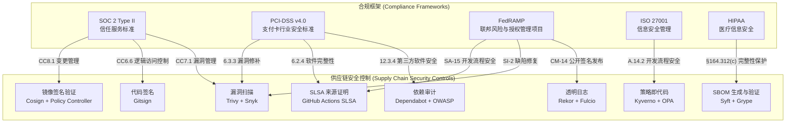
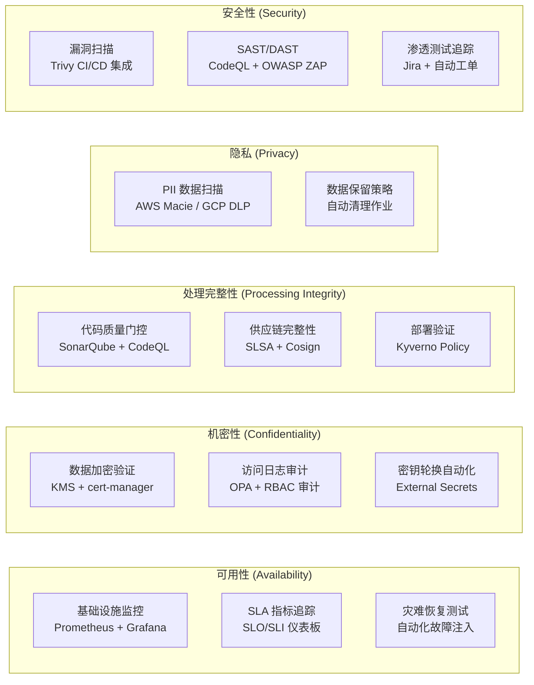
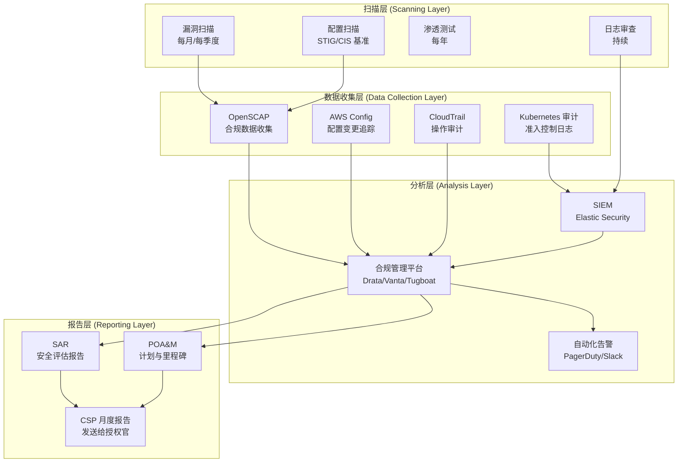
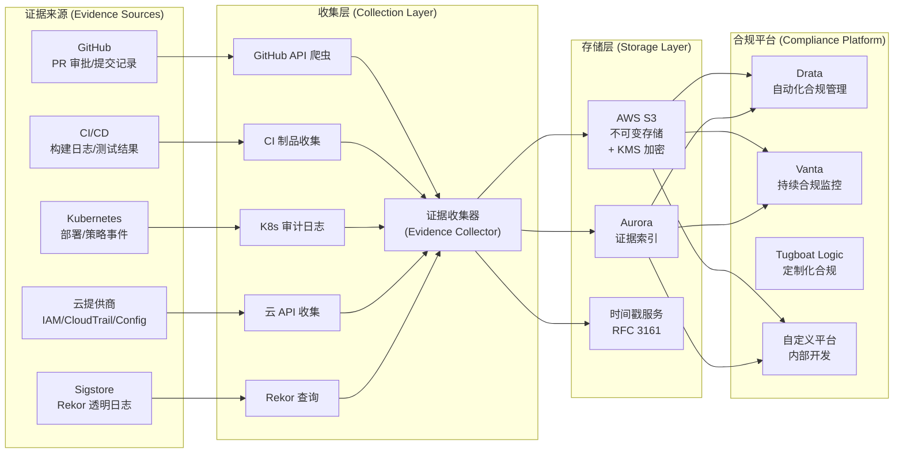
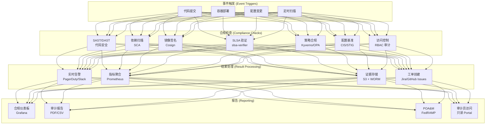
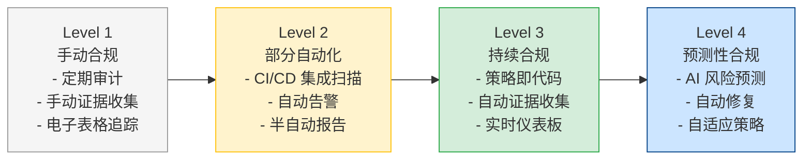

> **生产环境安全提示**
>
> 本文档包含可直接执行的运维命令。执行前请确认：当前目标集群与 Namespace 是否正确；是否具备足够的 RBAC 权限；是否已在非生产环境验证。命令风险等级标注：🔴 高风险（可能造成数据丢失或服务中断）、🟡 中风险（会修改集群状态，但通常可回滚）、🟢 低风险/只读（信息收集，无副作用）。


---
tags:
- security
- supply-chain
- compliance
intent_queries:
- compliance-automation-audit是什么？
- compliance-automation-audit的使用方法
- compliance-automation-audit的最佳实践

tier: peripheral---
title: 合规自动化与审计 (Compliance Automation and Audit)
description: '<!-- chunk: 概述 (Overview)' -->## 概述 (Overview)'
category: supply-chain-security
tags:
- k8s
- supply-chain
- security
- sbom
- slsa
- apiserver
- [[Prometheus|prometheus]]
- grafana
- [[Helm|helm]]
- [[ArgoCD|argocd]]
last_updated: 2026-05
difficulty: advanced
reading_level: advanced
audience:
- 安全工程师
- SRE
- 架构师
estimated_read_time: 5min
intent_queries:
- 合规自动化与审计 (Compliance Automation and Audit) 是什么
- 如何 合规自动化与审计 (Compliance Automation and Audit)
- [[Kubernetes|Kubernetes]] 39 supply chain security 最佳实践
trigger_keywords:
- 合规自动化与审计
- Compliance
- Automation
- and
- Audit
- supply
- chain
- security
authors:
- name: KUDIG Team
  role: contributor
k8s_versions:
- '1.28'
- '1.29'
- '1.30'
- '1.31'
- '1.32'
---

# 合规自动化与审计 (Compliance Automation and Audit)

<!-- chunk: 概述 (Overview) -->## 概述 (Overview)

在现代云原生环境中，手动合规检查已无法满足持续部署和快速迭代的需求。合规自动化将 SOC 2 Type II、PCI-DSS、FedRAMP 等框架的要求转化为可自动执行的代码，通过策略即代码（Policy-as-Code）、持续监控和自动化证据收集，实现合规的持续验证而非定期审计。

本文档涵盖主流合规框架的自动化实现、审计证据收集、合规仪表板，以及软件供应链安全在合规体系中的地位。

---

<!-- chunk: 1. 合规框架与供应链安全映射 (Compliance Framework and Supply Chain Security Mapping) -->## 1. 合规框架与供应链安全映射 (Compliance Framework and Supply Chain Security Mapping)

## 1.1 主要合规框架概览 (Major Compliance Framework Overview)



## 1.2 控制措施映射表 (Control Measures Mapping Table)

| 合规要求 | 框架章节 | 技术实现 | 自动化工具 |
|---------|---------|---------|----------|
| 软件组件清单 | SOC 2 CC7.1, PCI 12.3.4 | SBOM 生成 | Syft, SPDX |
| 已知漏洞管理 | SOC 2 CC7.1, PCI 6.3.3 | 漏洞扫描 | Trivy, Grype |
| 代码完整性验证 | SOC 2 CC8.1, PCI 6.2.4 | 镜像签名 | Cosign, SLSA |
| 变更控制记录 | SOC 2 CC8.1, FedRAMP CM-3 | 来源证明 | Rekor, GitHub Audit |
| 依赖安全性 | PCI 6.3.3, SOC 2 CC7.1 | SCA 扫描 | Dependabot, OWASP |
| 访问控制 | SOC 2 CC6.1, HIPAA §164.312 | RBAC + OIDC | Kubernetes RBAC |
| 审计日志 | SOC 2 CC7.2, PCI 10 | 日志聚合 | Rekor, Falco, CloudTrail |
| 部署验证 | FedRAMP CM-14 | 策略执行 | Kyverno, OPA |

---

<!-- chunk: 2. SOC 2 Type II 自动化 (SOC 2 Type II Automation) -->## 2. SOC 2 Type II 自动化 (SOC 2 Type II Automation)

## 2.1 SOC 2 控制框架实现 (SOC 2 Control Framework Implementation)



## 2.2 SOC 2 CC8.1 变更管理自动化 (SOC 2 CC8.1 Change Management Automation)

```yaml
# .github/workflows/soc2-change-management.yml
name: SOC 2 Change Management Controls

on:
  pull_request:
    branches: [main]
  push:
    branches: [main]

permissions:
  contents: read
  security-events: write
  id-token: write
  pull-requests: write

jobs:
  # ============================================================
  # CC8.1a: 变更请求记录
  # ============================================================
  record-change-request:
    name: Record Change Request (CC8.1a)
    runs-on: ubuntu-latest
    if: github.event_name == 'pull_request'

    steps:
      - uses: actions/checkout@v4
        with:
          fetch-depth: 0

      - name: Capture change metadata
        id: change-meta
        run: |
          # 收集变更信息
          CHANGE_ID="CHG-$(date +%Y%m%d)-${{ github.event.pull_request.number }}"
          CHANGED_FILES=$(git diff --name-only HEAD~1 HEAD | wc -l)
          RISK_LEVEL="low"
          
          # 风险评估（基于文件变更）
          if git diff --name-only HEAD~1 HEAD | grep -qE "(security|auth|crypto|password|secret)"; then
            RISK_LEVEL="high"
          elif git diff --name-only HEAD~1 HEAD | grep -qE "(helm|k8s|kubernetes|deploy)"; then
            RISK_LEVEL="medium"
          fi
          
          echo "change-id=$CHANGE_ID" >> "$GITHUB_OUTPUT"
          echo "risk-level=$RISK_LEVEL" >> "$GITHUB_OUTPUT"
          echo "changed-files=$CHANGED_FILES" >> "$GITHUB_OUTPUT"

      - name: Create change record
        run: |
          cat > change-record.json << EOF
          {
            "changeId": "${{ steps.change-meta.outputs.change-id }}",
            "requestor": "${{ github.event.pull_request.user.login }}",
            "title": "${{ github.event.pull_request.title }}",
            "description": "${{ github.event.pull_request.body }}",
            "riskLevel": "${{ steps.change-meta.outputs.risk-level }}",
            "changedFiles": ${{ steps.change-meta.outputs.changed-files }},
            "branch": "${{ github.head_ref }}",
            "targetBranch": "${{ github.base_ref }}",
            "commitSha": "${{ github.event.pull_request.head.sha }}",
            "timestamp": "$(date -u +%Y-%m-%dT%H:%M:%SZ)",
            "prUrl": "${{ github.event.pull_request.html_url }}"
          }
          EOF
          
          # 存储到合规数据库（示例：AWS S3）
          aws s3 cp change-record.json \
            "s3://compliance-evidence-bucket/soc2/cc8-1/changes/${{ steps.change-meta.outputs.change-id }}.json" \
            --sse aws:kms \
            --kms-key-id "${{ vars.COMPLIANCE_KMS_KEY_ID }}"

      - name: Comment change ID on PR
        uses: actions/github-script@v7
        with:
          script: |
            github.rest.issues.createComment({
              issue_number: context.issue.number,
              owner: context.repo.owner,
              repo: context.repo.repo,
              body: `<!-- chunk: 🔒 SOC 2 Change Control\n\n**Change ID**: \`${{ steps.change-meta.outputs.change-id }}\`\n**Risk Level**: ${{ steps.change-meta.outputs.risk-level }}\n\nThis change has been recorded in the compliance system.` -->## 🔒 SOC 2 Change Control\n\n**Change ID**: \`${{ steps.change-meta.outputs.change-id }}\`\n**Risk Level**: ${{ steps.change-meta.outputs.risk-level }}\n\nThis change has been recorded in the compliance system.`
            })

  # ============================================================
  # CC8.1b: 变更审批验证
  # ============================================================
  verify-approval:
    name: Verify Change Approval (CC8.1b)
    runs-on: ubuntu-latest
    if: github.event_name == 'push' && github.ref == 'refs/heads/main'

    steps:
      - uses: actions/checkout@v4

      - name: Verify PR was approved
        uses: actions/github-script@v7
        with:
          script: |
            // 获取合并的 PR
            const { data: pulls } = await github.rest.repos.listPullRequestsAssociatedWithCommit({
              owner: context.repo.owner,
              repo: context.repo.repo,
              commit_sha: context.sha
            });
            
            if (pulls.length === 0) {
              core.setFailed('No PR found for this commit - direct push to main is not allowed');
              return;
            }
            
            const pr = pulls[0];
            
            // 检查审批
            const { data: reviews } = await github.rest.pulls.listReviews({
              owner: context.repo.owner,
              repo: context.repo.repo,
              pull_number: pr.number
            });
            
            const approvals = reviews.filter(r => r.state === 'APPROVED');
            
            if (approvals.length === 0) {
              core.setFailed(`PR #${pr.number} was not approved before merging`);
              return;
            }
            
            console.log(`✅ PR #${pr.number} was approved by ${approvals.map(a => a.user.login).join(', ')}`);

  # ============================================================
  # CC7.1: 漏洞管理证据收集
  # ============================================================
  collect-vulnerability-evidence:
    name: Collect Vulnerability Evidence (CC7.1)
    runs-on: ubuntu-latest

    steps:
      - uses: actions/checkout@v4

      - name: Run comprehensive vulnerability scan
        uses: aquasecurity/trivy-action@0.20.0
        with:
          scan-type: 'fs'
          format: 'json'
          output: 'trivy-results.json'

      - name: Run SAST scan
        uses: github/codeql-action/analyze@v3
        continue-on-error: true

      - name: Run dependency audit
        run: |
          # Node.js
          if [ -f package.json ]; then
            npm audit --json > npm-audit.json 2>/dev/null || true
          fi
          
          # Python
          if [ -f requirements.txt ]; then
            pip install safety && safety check --json > pip-safety.json 2>/dev/null || true
          fi
          
          # Go
          if [ -f go.mod ]; then
            go install golang.org/x/vuln/cmd/govulncheck@latest
            govulncheck -json ./... > govuln-results.json 2>/dev/null || true
          fi

      - name: Generate vulnerability summary
        run: |
          python3 << 'EOF'
          import json
          from datetime import datetime
          
          summary = {
              "timestamp": datetime.utcnow().isoformat(),
              "commitSha": "${{ github.sha }}",
              "repository": "${{ github.repository }}",
              "scanTypes": [],
              "criticalCount": 0,
              "highCount": 0,
              "mediumCount": 0,
              "lowCount": 0
          }
          
          try:
              with open('trivy-results.json') as f:
                  trivy = json.load(f)
                  for result in trivy.get('Results', []):
                      for vuln in result.get('Vulnerabilities', []):
                          sev = vuln.get('Severity', '').upper()
                          if sev == 'CRITICAL':
                              summary['criticalCount'] += 1
                          elif sev == 'HIGH':
                              summary['highCount'] += 1
                          elif sev == 'MEDIUM':
                              summary['mediumCount'] += 1
                          else:
                              summary['lowCount'] += 1
                  summary['scanTypes'].append('trivy-filesystem')
          except FileNotFoundError:
              pass
          
          summary['compliance'] = {
              'soc2_cc7_1': summary['criticalCount'] == 0,
              'pci_6_3_3': summary['criticalCount'] == 0 and summary['highCount'] < 5
          }
          
          with open('vulnerability-summary.json', 'w') as f:
              json.dump(summary, f, indent=2)
          
          print(json.dumps(summary, indent=2))
          EOF

      - name: Store evidence
        run: |
          EVIDENCE_DATE=$(date +%Y/%m/%d)
          aws s3 sync . "s3://compliance-evidence-bucket/soc2/cc7-1/${EVIDENCE_DATE}/${{ github.sha }}/" \
            --include "trivy-results.json" \
            --include "vulnerability-summary.json" \
            --include "npm-audit.json" \
            --sse aws:kms \
            --kms-key-id "${{ vars.COMPLIANCE_KMS_KEY_ID }}"

  # ============================================================
  # CC6.6: 供应链完整性验证（镜像签名）
  # ============================================================
  verify-supply-chain:
    name: Verify Supply Chain Integrity (CC6.6)
    runs-on: ubuntu-latest

    steps:
      - name: Install tools
        run: |
          go install github.com/sigstore/cosign/v2/cmd/cosign@latest
          go install github.com/slsa-framework/slsa-verifier/v2/cli/slsa-verifier@latest

      - name: Verify image signature
        run: |
          IMAGE="${{ vars.PRODUCTION_IMAGE }}:${{ github.sha }}"
          
          if cosign verify \
            --certificate-oidc-issuer "https://token.actions.githubusercontent.com" \
            --certificate-identity-regexp "^https://github.com/${{ github.repository }}/.github/workflows/.*" \
            --output-file /tmp/sig-verification.json \
            "$IMAGE"; then
            echo "SIGNATURE_VERIFIED=true" >> "$GITHUB_ENV"
          else
            echo "SIGNATURE_VERIFIED=false" >> "$GITHUB_ENV"
          fi

      - name: Store supply chain evidence
        run: |
          cat > supply-chain-evidence.json << EOF
          {
            "timestamp": "$(date -u +%Y-%m-%dT%H:%M:%SZ)",
            "commitSha": "${{ github.sha }}",
            "image": "${{ vars.PRODUCTION_IMAGE }}:${{ github.sha }}",
            "signatureVerified": ${{ env.SIGNATURE_VERIFIED }},
            "verificationMethod": "cosign-keyless",
            "oidcIssuer": "https://token.actions.githubusercontent.com",
            "control": "SOC2-CC6.6"
          }
          EOF
          
          aws s3 cp supply-chain-evidence.json \
            "s3://compliance-evidence-bucket/soc2/cc6-6/${{ github.sha }}-supply-chain.json" \
            --sse aws:kms
```

---

<!-- chunk: 3. PCI-DSS v4.0 合规自动化 (PCI-DSS v4.0 Compliance Automation) -->## 3. PCI-DSS v4.0 合规自动化 (PCI-DSS v4.0 Compliance Automation)

## 3.1 PCI-DSS 要求 6.3.x 自动化 (PCI-DSS Requirement 6.3.x Automation)

```yaml
# .github/workflows/pci-dss-compliance.yml
name: PCI-DSS Compliance Controls

on:
  push:
    branches: [main, 'release/**']
  schedule:
    - cron: '0 0 * * *'  # 每日合规检查

jobs:
  # ============================================================
  # PCI-DSS 6.3.1: 防止应用漏洞
  # ============================================================
  pci-req-6-3-1:
    name: PCI 6.3.1 - Application Security
    runs-on: ubuntu-latest

    steps:
      - uses: actions/checkout@v4

      - name: SAST Scan
        uses: github/codeql-action/analyze@v3
        with:
          category: "/language:java,python,javascript"

      - name: DAST Scan (OWASP ZAP)
        run: |
          docker run --rm \
            -v $(pwd):/zap/wrk \
            ghcr.io/zaproxy/zaproxy:stable \
            zap-baseline.py \
            -t "${{ vars.APP_URL }}" \
            -J zap-report.json \
            -r zap-report.html \
            -I  # 忽略 WARN，只报告 FAIL

      - name: Check for secrets in code
        uses: trufflesecurity/trufflehog@main
        with:
          path: ./
          base: ${{ github.event.repository.default_branch }}
          extra_args: --json

      - name: Generate PCI 6.3.1 evidence
        run: |
          cat > pci-6-3-1-evidence.json << EOF
          {
            "requirement": "PCI-DSS 6.3.1",
            "description": "Security vulnerabilities in software are identified and addressed",
            "timestamp": "$(date -u +%Y-%m-%dT%H:%M:%SZ)",
            "commitSha": "${{ github.sha }}",
            "controls": {
              "sast": {
                "tool": "CodeQL",
                "status": "${{ job.status }}"
              },
              "dast": {
                "tool": "OWASP ZAP",
                "target": "${{ vars.APP_URL }}"
              },
              "secretScanning": {
                "tool": "TruffleHog",
                "enabled": true
              }
            }
          }
          EOF

  # ============================================================
  # PCI-DSS 6.3.3: 第三方组件安全
  # ============================================================
  pci-req-6-3-3:
    name: PCI 6.3.3 - Third-Party Components
    runs-on: ubuntu-latest

    steps:
      - uses: actions/checkout@v4

      - name: Generate SBOM
        uses: anchore/sbom-action@v0.16.0
        with:
          format: spdx-json
          output-file: sbom.spdx.json

      - name: Scan SBOM for vulnerabilities
        run: |
          # 使用 Grype 扫描 SBOM
          grype sbom:sbom.spdx.json \
            --output json \
            --file grype-results.json
          
          # 检查 CRITICAL 漏洞
          CRITICAL=$(jq '[.matches[] | select(.vulnerability.severity == "Critical")] | length' grype-results.json)
          HIGH=$(jq '[.matches[] | select(.vulnerability.severity == "High")] | length' grype-results.json)
          
          echo "Critical vulnerabilities: $CRITICAL"
          echo "High vulnerabilities: $HIGH"
          
          if [ "$CRITICAL" -gt 0 ]; then
            echo "❌ PCI 6.3.3 FAILED: $CRITICAL CRITICAL vulnerabilities found"
            exit 1
          fi
          
          if [ "$HIGH" -gt 5 ]; then
            echo "❌ PCI 6.3.3 FAILED: $HIGH HIGH vulnerabilities exceed threshold (5)"
            exit 1
          fi
          
          echo "✅ PCI 6.3.3 PASSED"

      - name: Check license compliance
        run: |
          # 检查许可证合规性
          jq '[.packages[] | select(.licenseConcluded | test("GPL|AGPL|LGPL"))] | 
              map({name: .name, version: .versionInfo, license: .licenseConcluded})' \
              sbom.spdx.json > license-issues.json
          
          COPYLEFT_COUNT=$(jq length license-issues.json)
          echo "Copyleft licensed packages: $COPYLEFT_COUNT"
          
          if [ "$COPYLEFT_COUNT" -gt 0 ]; then
            echo "⚠️ WARNING: Found packages with copyleft licenses:"
            cat license-issues.json | jq .
          fi

      - name: Verify component integrity
        run: |
          # 验证关键组件的校验和
          if [ -f "component-hashes.txt" ]; then
            sha256sum -c component-hashes.txt
            echo "✅ Component integrity verified"
          fi

  # ============================================================
  # PCI-DSS 10: 审计日志要求
  # ============================================================
  pci-req-10:
    name: PCI 10 - Audit Logging
    runs-on: ubuntu-latest

    steps:
      - name: Verify audit log configuration
        run: |
          # 检查 Kubernetes 审计日志是否启用
          kubectl get configmap -n kube-system kube-apiserver-config -o yaml | \
            grep -E "audit-log|audit-policy" || \
            echo "⚠️ Cannot verify audit log configuration remotely"
          
          # 检查审计日志保留策略（>= 12 个月）
          aws cloudtrail describe-trails \
            --query 'trailList[].{Name:Name,HasCustomEventSelectors:HasCustomEventSelectors,S3BucketName:S3BucketName}' \
            --output json

      - name: Verify log integrity
        run: |
          # 验证 CloudTrail 日志完整性
          aws cloudtrail validate-logs \
            --trail-arn "${{ vars.CLOUDTRAIL_ARN }}" \
            --start-time "$(date -u -d '24 hours ago' +%Y-%m-%dT%H:%M:%SZ)" \
            --end-time "$(date -u +%Y-%m-%dT%H:%M:%SZ)"

  # ============================================================
  # 生成 PCI-DSS 合规报告
  # ============================================================
  pci-compliance-report:
    name: Generate PCI-DSS Compliance Report
    needs: [pci-req-6-3-1, pci-req-6-3-3, pci-req-10]
    runs-on: ubuntu-latest
    if: always()

    steps:
      - name: Generate comprehensive report
        run: |
          python3 << 'EOF'
          import json
          from datetime import datetime
          
          report = {
              "reportType": "PCI-DSS v4.0 Compliance Report",
              "generatedAt": datetime.utcnow().isoformat(),
              "repository": "${{ github.repository }}",
              "commitSha": "${{ github.sha }}",
              "overallStatus": "PASS" if "${{ needs.pci-req-6-3-1.result }}" == "success" and \
                              "${{ needs.pci-req-6-3-3.result }}" == "success" else "FAIL",
              "requirements": {
                  "6.3.1": {
                      "description": "Application security vulnerabilities prevention",
                      "status": "${{ needs.pci-req-6-3-1.result }}",
                      "controls": ["SAST", "DAST", "Secret Scanning"]
                  },
                  "6.3.3": {
                      "description": "Third-party component security",
                      "status": "${{ needs.pci-req-6-3-3.result }}",
                      "controls": ["SBOM Generation", "Vulnerability Scanning", "License Compliance"]
                  },
                  "10": {
                      "description": "Audit logging",
                      "status": "${{ needs.pci-req-10.result }}",
                      "controls": ["CloudTrail", "K8s Audit Log", "Log Integrity"]
                  }
              }
          }
          
          print(json.dumps(report, indent=2))
          
          with open('pci-compliance-report.json', 'w') as f:
              json.dump(report, f, indent=2)
          EOF

      - name: Upload report
        uses: actions/upload-artifact@v4
        with:
          name: pci-compliance-report
          path: pci-compliance-report.json
          retention-days: 90  # PCI-DSS 要求保留 12 个月
```

---

<!-- chunk: 4. FedRAMP 持续监控 (FedRAMP Continuous Monitoring) -->## 4. FedRAMP 持续监控 (FedRAMP Continuous Monitoring)

## 4.1 FedRAMP 连续授权监控架构 (FedRAMP ConMon Architecture)



## 4.2 FedRAMP SA-15 开发流程安全控制 (FedRAMP SA-15 Development Process Security)

```yaml
# fedramp-sa15-controls.yaml
# FedRAMP SA-15: Development Process, Standards, and Tools

---
# 控制 SA-15: 确保开发工具和流程的安全性
name: FedRAMP SA-15 Compliance Checks

controls:
  # SA-15(7): 供应链保护
  supply-chain-protection:
    automated: true
    checks:
      - id: SA-15-7-1
        description: "所有容器镜像必须有 SLSA Level 3 来源证明"
        implementation: |
          # Kyverno ClusterPolicy
          - Enforce SLSA provenance attestation
          - Verify builder ID matches SLSA Generator
          - Require signed provenance from GitHub Actions
        
      - id: SA-15-7-2
        description: "所有构建必须记录在不可篡改的透明日志中"
        implementation: |
          # Rekor 透明日志集成
          - cosign sign --tlog-upload=true
          - Record build metadata in Rekor
          - Provide Rekor log URL in deployment metadata
      
      - id: SA-15-7-3
        description: "软件物料清单 (SBOM) 必须随每个版本发布"
        implementation: |
          # Syft SBOM 生成
          - Generate SPDX JSON SBOM
          - Attest SBOM with cosign
          - Store SBOM in artifact registry

  # SA-15(10): 漏洞分析
  vulnerability-analysis:
    automated: true
    frequency: per-commit
    checks:
      - id: SA-15-10-1
        description: "代码提交时自动执行漏洞扫描"
        implementation: |
          # Trivy + GitHub Advanced Security
          - trivy fs --exit-code 1 --severity CRITICAL .
          - CodeQL analysis on every PR
          - Dependabot automated security updates

---
# FedRAMP 自动化检查工作流
apiVersion: batch/v1
kind: CronJob
metadata:
  name: fedramp-conmon-scan
  namespace: compliance

spec:
  schedule: "0 2 * * *"  # 每日 02:00 UTC
  jobTemplate:
    spec:
      template:
        spec:
          containers:
            - name: conmon-scanner
              image: your-org/fedramp-scanner:latest
              command: ["/bin/sh", "-c"]
              args:
                - |
                  #!/bin/sh
                  
                  # 1. 运行 OpenSCAP 配置合规扫描
                  oscap xccdf eval \
                    --profile xccdf_org.ssgproject.content_profile_stig \
                    --results-arf /results/arf.xml \
                    --report /results/report.html \
                    /usr/share/xml/scap/ssg/content/ssg-rhel9-ds.xml
                  
                  # 2. 收集 Kubernetes 配置审计
                  kube-bench run \
                    --config-dir /etc/kube-bench/cfg \
                    --config /etc/kube-bench/cfg/config.yaml \
                    --json > /results/kube-bench.json
                  
                  # 3. 扫描镜像漏洞
                  kubectl get pods --all-namespaces -o json | \
                    jq -r '.items[].spec.containers[].image' | \
                    sort -u | \
                    while read IMAGE; do
                      trivy image --format json "$IMAGE" >> /results/image-vulns.json
                    done
                  
                  # 4. 上传结果
                  aws s3 sync /results/ \
                    "s3://fedramp-evidence-bucket/conmon/$(date +%Y/%m/%d)/" \
                    --sse aws:kms \
                    --kms-key-id "$COMPLIANCE_KMS_KEY"
```

## 4.3 FedRAMP POA&M 自动化 (FedRAMP POA&M Automation)

```python
#!/usr/bin/env python3
# fedramp_poam_generator.py
# 自动生成 FedRAMP 计划与里程碑（POA&M）

import json
import csv
import boto3
from datetime import datetime, timedelta
from dataclasses import dataclass
from typing import List, Optional

@dataclass
class POAMItem:
    """POA&M 条目"""
    item_id: str
    weakness_name: str
    weakness_source: str  # 漏洞/配置/策略
    cve_ids: List[str]
    severity: str  # critical/high/medium/low
    control_id: str  # NIST SP 800-53 控制 ID
    resources_required: str
    overall_remediation_plan: str
    milestones: List[dict]
    scheduled_completion_date: str
    status: str  # open/closed/in-progress
    risk_adjustment: Optional[str] = None
    
def scan_and_generate_poam(scan_results_path: str) -> List[POAMItem]:
    """从扫描结果生成 POA&M 条目"""
    items = []
    
    with open(scan_results_path) as f:
        scan_results = json.load(f)
    
    for i, match in enumerate(scan_results.get('matches', [])):
        vuln = match.get('vulnerability', {})
        artifact = match.get('artifact', {})
        
        # 只处理 HIGH 和 CRITICAL
        if vuln.get('severity') not in ['High', 'Critical']:
            continue
        
        # 确定修复截止日期（FedRAMP 要求）
        severity = vuln.get('severity', '').lower()
        if severity == 'critical':
            days_to_fix = 30   # CRITICAL: 30 天
        elif severity == 'high':
            days_to_fix = 90   # HIGH: 90 天
        else:
            days_to_fix = 180
        
        scheduled_date = (datetime.utcnow() + timedelta(days=days_to_fix)).strftime('%Y-%m-%d')
        
        item = POAMItem(
            item_id=f"POAM-{i+1:04d}",
            weakness_name=f"{vuln.get('id', 'Unknown')}: {vuln.get('description', '')[:100]}",
            weakness_source="Automated Vulnerability Scan (Grype)",
            cve_ids=[vuln.get('id')] if vuln.get('id', '').startswith('CVE-') else [],
            severity=severity,
            control_id=map_cve_to_control(vuln.get('id', '')),
            resources_required="DevSecOps Team (4 hours)",
            overall_remediation_plan=f"Update {artifact.get('name', 'package')} from {artifact.get('version', 'unknown')} to {vuln.get('fix', {}).get('versions', ['N/A'])[0] if vuln.get('fix') else 'N/A'}",
            milestones=[
                {
                    "id": "M1",
                    "description": "Identify affected systems and validate vulnerability",
                    "scheduledDate": (datetime.utcnow() + timedelta(days=7)).strftime('%Y-%m-%d'),
                    "status": "open"
                },
                {
                    "id": "M2", 
                    "description": "Develop and test remediation",
                    "scheduledDate": (datetime.utcnow() + timedelta(days=days_to_fix - 7)).strftime('%Y-%m-%d'),
                    "status": "open"
                },
                {
                    "id": "M3",
                    "description": "Deploy remediation to production",
                    "scheduledDate": scheduled_date,
                    "status": "open"
                }
            ],
            scheduled_completion_date=scheduled_date,
            status="open"
        )
        
        items.append(item)
    
    return items

def map_cve_to_control(cve_id: str) -> str:
    """将 CVE 映射到 NIST SP 800-53 控制"""
    # 简化映射
    control_map = {
        "injection": "SI-3",
        "auth": "IA-2",
        "xss": "SI-3",
        "crypto": "SC-8",
        "config": "CM-6",
    }
    return "SI-2"  # 默认：缺陷修复

def export_poam_csv(items: List[POAMItem], output_file: str):
    """导出 POA&M 为 CSV（符合 FedRAMP 格式要求）"""
    fieldnames = [
        "POA&M Item ID",
        "Controls Weakness Name",
        "Weakness Source Identifier",
        "Source Identifier",
        "Control Identifier",
        "Resources Required",
        "Overall Remediation Plan",
        "Milestones with Completion Dates",
        "Scheduled Completion Date",
        "Status"
    ]
    
    with open(output_file, 'w', newline='') as f:
        writer = csv.DictWriter(f, fieldnames=fieldnames)
        writer.writeheader()
        
        for item in items:
            milestones_str = "; ".join([
                f"{m['id']}: {m['description']} ({m['scheduledDate']})"
                for m in item.milestones
            ])
            
            writer.writerow({
                "POA&M Item ID": item.item_id,
                "Controls Weakness Name": item.weakness_name,
                "Weakness Source Identifier": item.weakness_source,
                "Source Identifier": ", ".join(item.cve_ids) if item.cve_ids else "N/A",
                "Control Identifier": item.control_id,
                "Resources Required": item.resources_required,
                "Overall Remediation Plan": item.overall_remediation_plan,
                "Milestones with Completion Dates": milestones_str,
                "Scheduled Completion Date": item.scheduled_completion_date,
                "Status": item.status
            })

if __name__ == "__main__":
    import sys
    
    scan_file = sys.argv[1] if len(sys.argv) > 1 else "grype-results.json"
    output_file = sys.argv[2] if len(sys.argv) > 2 else "fedramp-poam.csv"
    
    items = scan_and_generate_poam(scan_file)
    export_poam_csv(items, output_file)
    
    print(f"Generated POA&M with {len(items)} items: {output_file}")
```

---

<!-- chunk: 5. 审计证据收集自动化 (Automated Audit Evidence Collection) -->## 5. 审计证据收集自动化 (Automated Audit Evidence Collection)

## 5.1 证据收集架构 (Evidence Collection Architecture)



## 5.2 证据收集自动化脚本 (Evidence Collection Automation Script)

```python
#!/usr/bin/env python3
# evidence_collector.py
# 自动化收集合规证据

import os
import json
import boto3
import hashlib
import subprocess
from datetime import datetime, timezone
from pathlib import Path
from typing import Dict, Any

class EvidenceCollector:
    """合规证据自动收集器"""
    
    def __init__(self, s3_bucket: str, kms_key_id: str):
        self.s3 = boto3.client('s3')
        self.s3_bucket = s3_bucket
        self.kms_key_id = kms_key_id
        self.timestamp = datetime.now(timezone.utc).isoformat()
        
    def collect_github_pr_approvals(self, org: str, repo: str, token: str) -> Dict:
        """收集 GitHub PR 审批记录"""
        import requests
        
        headers = {
            "Authorization": f"token {token}",
            "Accept": "application/vnd.github.v3+json"
        }
        
        # 获取最近合并的 PR
        response = requests.get(
            f"https://api.github.com/repos/{org}/{repo}/pulls",
            params={"state": "closed", "per_page": 50},
            headers=headers
        )
        
        evidence = {
            "controlId": "SOC2-CC8.1",
            "description": "Pull Request approval records",
            "collectedAt": self.timestamp,
            "repository": f"{org}/{repo}",
            "records": []
        }
        
        for pr in response.json():
            if not pr.get('merged_at'):
                continue
            
            # 获取审批信息
            reviews_response = requests.get(
                f"https://api.github.com/repos/{org}/{repo}/pulls/{pr['number']}/reviews",
                headers=headers
            )
            
            approvals = [r for r in reviews_response.json() if r['state'] == 'APPROVED']
            
            evidence['records'].append({
                "prNumber": pr['number'],
                "title": pr['title'],
                "author": pr['user']['login'],
                "mergedAt": pr['merged_at'],
                "mergedBy": pr.get('merged_by', {}).get('login', 'unknown'),
                "approvals": [
                    {
                        "reviewer": a['user']['login'],
                        "approvedAt": a['submitted_at']
                    }
                    for a in approvals
                ],
                "approvalCount": len(approvals),
                "compliant": len(approvals) >= 2  # 需要 2 个审批
            })
        
        return evidence
    
    def collect_image_signatures(self, images: list) -> Dict:
        """收集容器镜像签名证明"""
        evidence = {
            "controlId": "SOC2-CC6.6",
            "description": "Container image signing verification",
            "collectedAt": self.timestamp,
            "records": []
        }
        
        for image in images:
            result = subprocess.run(
                ["cosign", "verify",
                 "--certificate-oidc-issuer", "https://token.actions.githubusercontent.com",
                 "--certificate-identity-regexp", ".*",
                 "--output-file", "/tmp/sig.json",
                 image],
                capture_output=True, text=True
            )
            
            record = {
                "image": image,
                "verified": result.returncode == 0,
                "verifiedAt": self.timestamp
            }
            
            if result.returncode == 0:
                try:
                    with open('/tmp/sig.json') as f:
                        sigs = json.load(f)
                    if sigs:
                        record['signerInfo'] = {
                            "issuer": sigs[0].get('optional', {}).get('Issuer'),
                            "subject": sigs[0].get('optional', {}).get('Subject')
                        }
                except Exception:
                    pass
            
            evidence['records'].append(record)
        
        return evidence
    
    def collect_vulnerability_scan_results(self, image: str) -> Dict:
        """收集漏洞扫描结果"""
        # 运行 Trivy 扫描
        result = subprocess.run(
            ["trivy", "image", "--format", "json", "--output", "/tmp/trivy.json", image],
            capture_output=True, text=True
        )
        
        evidence = {
            "controlId": "SOC2-CC7.1",
            "description": "Vulnerability scan results",
            "collectedAt": self.timestamp,
            "image": image
        }
        
        try:
            with open('/tmp/trivy.json') as f:
                scan_results = json.load(f)
            
            counts = {"CRITICAL": 0, "HIGH": 0, "MEDIUM": 0, "LOW": 0}
            
            for result_item in scan_results.get('Results', []):
                for vuln in result_item.get('Vulnerabilities', []):
                    sev = vuln.get('Severity', 'UNKNOWN').upper()
                    if sev in counts:
                        counts[sev] += 1
            
            evidence['summary'] = counts
            evidence['compliant'] = counts['CRITICAL'] == 0
            evidence['scannerVersion'] = scan_results.get('SchemaVersion', 'unknown')
        except Exception as e:
            evidence['error'] = str(e)
        
        return evidence
    
    def collect_kubernetes_rbac_evidence(self) -> Dict:
        """收集 Kubernetes RBAC 配置证据"""
        evidence = {
            "controlId": "SOC2-CC6.1",
            "description": "Kubernetes RBAC access control evidence",
            "collectedAt": self.timestamp,
            "records": []
        }
        
        # 获取 ClusterRoleBindings
        result = subprocess.run(
            ["kubectl", "get", "clusterrolebindings", "-o", "json"],
            capture_output=True, text=True
        )
        
        if result.returncode == 0:
            bindings = json.loads(result.stdout)
            
            # 检查是否有过于宽泛的权限
            for binding in bindings.get('items', []):
                role_ref = binding.get('roleRef', {})
                subjects = binding.get('subjects', [])
                
                if role_ref.get('name') == 'cluster-admin':
                    evidence['records'].append({
                        "bindingName": binding['metadata']['name'],
                        "role": "cluster-admin",
                        "subjects": subjects,
                        "risk": "HIGH",
                        "note": "cluster-admin binding detected"
                    })
        
        return evidence
    
    def store_evidence(self, evidence: Dict, control_id: str) -> str:
        """将证据存储到 S3（不可变存储）"""
        # 计算证据哈希（完整性保证）
        evidence_json = json.dumps(evidence, sort_keys=True)
        evidence_hash = hashlib.sha256(evidence_json.encode()).hexdigest()
        
        evidence['_metadata'] = {
            "hash": evidence_hash,
            "storedAt": self.timestamp,
            "collector": "automated-evidence-collector/v1.0"
        }
        
        # 生成 S3 路径
        date_path = datetime.now().strftime("%Y/%m/%d")
        s3_key = f"evidence/{control_id}/{date_path}/{control_id}-{evidence_hash[:8]}.json"
        
        # 上传到 S3（加密 + 对象锁定）
        self.s3.put_object(
            Bucket=self.s3_bucket,
            Key=s3_key,
            Body=json.dumps(evidence, indent=2).encode(),
            ServerSideEncryption='aws:kms',
            SSEKMSKeyId=self.kms_key_id,
            ContentType='application/json',
            # WORM（写一次读多次）保护
            ObjectLockMode='COMPLIANCE',
            ObjectLockRetainUntilDate=datetime(
                datetime.now().year + 7,
                datetime.now().month,
                datetime.now().day
            )
        )
        
        return f"s3://{self.s3_bucket}/{s3_key}"
    
    def generate_evidence_report(self, evidence_items: list) -> str:
        """生成证据报告"""
        report = {
            "reportType": "Compliance Evidence Report",
            "generatedAt": self.timestamp,
            "evidenceItems": len(evidence_items),
            "summary": {},
            "items": evidence_items
        }
        
        # 统计合规状态
        for item in evidence_items:
            control_id = item.get('controlId', 'unknown')
            compliant = item.get('compliant', True)
            
            report['summary'][control_id] = {
                "status": "COMPLIANT" if compliant else "NON-COMPLIANT",
                "evidenceCount": len(item.get('records', []))
            }
        
        return json.dumps(report, indent=2)


def main():
    collector = EvidenceCollector(
        s3_bucket=os.environ['COMPLIANCE_S3_BUCKET'],
        kms_key_id=os.environ['COMPLIANCE_KMS_KEY_ID']
    )
    
    # 收集各类证据
    evidence_items = []
    
    # 1. GitHub PR 审批证据
    pr_evidence = collector.collect_github_pr_approvals(
        org=os.environ['GITHUB_ORG'],
        repo=os.environ['GITHUB_REPO'],
        token=os.environ['GITHUB_TOKEN']
    )
    s3_path = collector.store_evidence(pr_evidence, "SOC2-CC8.1")
    print(f"PR approval evidence stored: {s3_path}")
    evidence_items.append(pr_evidence)
    
    # 2. 镜像签名证据
    images = os.environ.get('PRODUCTION_IMAGES', '').split(',')
    if images:
        sig_evidence = collector.collect_image_signatures(images)
        s3_path = collector.store_evidence(sig_evidence, "SOC2-CC6.6")
        print(f"Image signature evidence stored: {s3_path}")
        evidence_items.append(sig_evidence)
    
    # 3. 漏洞扫描证据
    for image in images:
        vuln_evidence = collector.collect_vulnerability_scan_results(image)
        s3_path = collector.store_evidence(vuln_evidence, "SOC2-CC7.1")
        print(f"Vulnerability scan evidence stored: {s3_path}")
        evidence_items.append(vuln_evidence)
    
    # 4. RBAC 证据
    rbac_evidence = collector.collect_kubernetes_rbac_evidence()
    s3_path = collector.store_evidence(rbac_evidence, "SOC2-CC6.1")
    evidence_items.append(rbac_evidence)
    
    # 生成综合报告
    report = collector.generate_evidence_report(evidence_items)
    print("\n=== Compliance Evidence Report ===")
    print(report)

if __name__ == "__main__":
    main()
```

---

<!-- chunk: 6. 合规仪表板 (Compliance Dashboards) -->## 6. 合规仪表板 (Compliance Dashboards)

## 6.1 Grafana 合规仪表板配置 (Grafana Compliance Dashboard Configuration)

```json
{
  "title": "Supply Chain Security Compliance Dashboard",
  "tags": ["compliance", "security", "soc2", "pci"],
  "panels": [
    {
      "id": 1,
      "title": "整体合规分数",
      "type": "gauge",
      "gridPos": {"h": 8, "w": 6, "x": 0, "y": 0},
      "options": {
        "orientation": "horizontal",
        "reduceOptions": {"calcs": ["lastNotNull"]},
        "thresholds": {
          "mode": "absolute",
          "steps": [
            {"color": "red", "value": 0},
            {"color": "yellow", "value": 70},
            {"color": "green", "value": 90}
          ]
        }
      },
      "targets": [
        {
          "expr": "sum(compliance_checks_passed_total) / sum(compliance_checks_total) * 100",
          "legendFormat": "Compliance Score"
        }
      ]
    },
    {
      "id": 2,
      "title": "镜像签名合规率",
      "type": "timeseries",
      "gridPos": {"h": 8, "w": 10, "x": 6, "y": 0},
      "targets": [
        {
          "expr": "sum(cosign_verify_result{result='pass'}) / sum(cosign_verify_result) * 100",
          "legendFormat": "Image Signing Compliance %"
        }
      ]
    },
    {
      "id": 3,
      "title": "漏洞趋势（按严重性）",
      "type": "barchart",
      "gridPos": {"h": 8, "w": 8, "x": 16, "y": 0},
      "targets": [
        {
          "expr": "sum(trivy_vulnerability_count) by (severity)",
          "legendFormat": "{{severity}}"
        }
      ]
    },
    {
      "id": 4,
      "title": "合规框架状态",
      "type": "table",
      "gridPos": {"h": 10, "w": 24, "x": 0, "y": 8},
      "targets": [
        {
          "expr": "compliance_framework_status",
          "legendFormat": "{{framework}}"
        }
      ],
      "transformations": [
        {
          "id": "organize",
          "options": {
            "renameByName": {
              "framework": "Framework",
              "status": "Status",
              "last_checked": "Last Checked"
            }
          }
        }
      ]
    },
    {
      "id": 5,
      "title": "Kyverno 策略违规（过去 7 天）",
      "type": "piechart",
      "gridPos": {"h": 8, "w": 8, "x": 0, "y": 18},
      "targets": [
        {
          "expr": "sum(increase(kyverno_policy_results_total{policy_result='fail'}[7d])) by (policy_name)",
          "legendFormat": "{{policy_name}}"
        }
      ]
    },
    {
      "id": 6,
      "title": "SLSA 来源证明覆盖率",
      "type": "stat",
      "gridPos": {"h": 8, "w": 8, "x": 8, "y": 18},
      "targets": [
        {
          "expr": "sum(slsa_provenance_present) / sum(slsa_releases_total) * 100",
          "legendFormat": "SLSA Coverage %"
        }
      ]
    },
    {
      "id": 7,
      "title": "SOC 2 控制状态",
      "type": "table",
      "gridPos": {"h": 8, "w": 8, "x": 16, "y": 18},
      "targets": [
        {
          "expr": "soc2_control_status",
          "instant": true
        }
      ]
    }
  ]
}
```

## 6.2 合规指标导出器 (Compliance Metrics Exporter)

```python
#!/usr/bin/env python3
# compliance_exporter.py
# Prometheus 合规指标导出器

from prometheus_client import start_http_server, Gauge, Counter, Info
import subprocess
import json
import time
import os

# 定义指标
compliance_score = Gauge(
    'compliance_score',
    'Overall compliance score (0-100)',
    ['framework']
)

compliance_checks_total = Counter(
    'compliance_checks_total',
    'Total compliance checks performed',
    ['framework', 'control']
)

compliance_checks_passed = Counter(
    'compliance_checks_passed_total',
    'Passed compliance checks',
    ['framework', 'control']
)

cosign_verify_result = Gauge(
    'cosign_verify_result',
    'Cosign image verification result (1=pass, 0=fail)',
    ['image', 'registry']
)

slsa_provenance_present = Gauge(
    'slsa_provenance_present',
    'Whether SLSA provenance is present (1=yes, 0=no)',
    ['repository', 'tag']
)

vulnerability_count = Gauge(
    'trivy_vulnerability_count',
    'Number of vulnerabilities found',
    ['severity', 'image']
)

kyverno_policy_violations = Gauge(
    'kyverno_policy_violations_current',
    'Current Kyverno policy violations',
    ['policy', 'namespace']
)

def collect_cosign_metrics():
    """收集镜像签名验证指标"""
    images = os.environ.get('MONITORED_IMAGES', '').split(',')
    
    for image in images:
        if not image.strip():
            continue
        
        result = subprocess.run(
            ['cosign', 'verify',
             '--certificate-oidc-issuer', 'https://token.actions.githubusercontent.com',
             '--certificate-identity-regexp', '.*',
             image.strip()],
            capture_output=True, text=True
        )
        
        registry = image.split('/')[0] if '/' in image else 'docker.io'
        
        cosign_verify_result.labels(
            image=image.strip(),
            registry=registry
        ).set(1 if result.returncode == 0 else 0)

def collect_kyverno_metrics():
    """收集 Kyverno 策略违规指标"""
    result = subprocess.run(
        ['kubectl', 'get', 'policyreport', '--all-namespaces', '-o', 'json'],
        capture_output=True, text=True
    )
    
    if result.returncode != 0:
        return
    
    reports = json.loads(result.stdout)
    
    for report in reports.get('items', []):
        namespace = report['metadata']['namespace']
        
        for result_item in report.get('results', []):
            if result_item.get('result') == 'fail':
                policy = result_item.get('policy', 'unknown')
                kyverno_policy_violations.labels(
                    policy=policy,
                    namespace=namespace
                ).inc()

def collect_vulnerability_metrics():
    """收集漏洞扫描指标"""
    images = os.environ.get('MONITORED_IMAGES', '').split(',')
    
    for image in images:
        if not image.strip():
            continue
        
        result = subprocess.run(
            ['trivy', 'image', '--format', 'json', image.strip()],
            capture_output=True, text=True
        )
        
        if result.returncode not in [0, 1]:
            continue
        
        try:
            scan_results = json.loads(result.stdout)
            counts = {'CRITICAL': 0, 'HIGH': 0, 'MEDIUM': 0, 'LOW': 0}
            
            for scan_result in scan_results.get('Results', []):
                for vuln in scan_result.get('Vulnerabilities', []):
                    sev = vuln.get('Severity', 'UNKNOWN').upper()
                    if sev in counts:
                        counts[sev] += 1
            
            for severity, count in counts.items():
                vulnerability_count.labels(
                    severity=severity,
                    image=image.strip()
                ).set(count)
        except json.JSONDecodeError:
            pass

def calculate_soc2_score() -> float:
    """计算 SOC 2 合规分数"""
    checks = {
        'CC6.6_image_signing': collect_cosign_metrics,
        'CC7.1_vulnerability_scan': collect_vulnerability_metrics,
        'CC8.1_kyverno_policies': collect_kyverno_metrics
    }
    
    passed = 0
    total = len(checks)
    
    # 简化的分数计算
    # 实际中需要基于各检查的具体结果
    
    return (passed / total * 100) if total > 0 else 0

def main():
    # 启动 HTTP 服务器
    start_http_server(9090)
    print("Compliance metrics exporter started on port 9090")
    
    while True:
        try:
            collect_cosign_metrics()
            collect_kyverno_metrics()
            collect_vulnerability_metrics()
            
            score = calculate_soc2_score()
            compliance_score.labels(framework='soc2').set(score)
        except Exception as e:
            print(f"Error collecting metrics: {e}")
        
        # 每 5 分钟收集一次
        time.sleep(300)

if __name__ == "__main__":
    main()
```

---

<!-- chunk: 7. 策略即代码合规框架 (Policy-as-Code Compliance Framework) -->## 7. 策略即代码合规框架 (Policy-as-Code Compliance Framework)

## 7.1 Open Policy Agent 合规策略 (Open Policy Agent Compliance Policies)

```rego
# compliance/soc2.rego
# SOC 2 合规策略（OPA Rego）

package compliance.soc2

import future.keywords.in
import future.keywords.if

# ============================================================
# CC6.6: 软件来源验证
# ============================================================

# 违规：镜像未签名
deny_cc6_6[msg] {
    input.kind == "Pod"
    container := input.spec.containers[_]
    image := container.image
    
    # 检查镜像是否来自受信任的注册表
    not is_trusted_registry(image)
    
    msg := sprintf(
        "SOC2-CC6.6: Container image '%v' is not from a trusted registry",
        [image]
    )
}

# 违规：镜像未使用摘要引用（标签可被变更）
deny_cc6_6[msg] {
    input.kind == "Pod"
    input.metadata.namespace in ["production", "staging"]
    container := input.spec.containers[_]
    image := container.image
    
    not contains(image, "@sha256:")
    
    msg := sprintf(
        "SOC2-CC6.6: Container image '%v' must use digest reference in production",
        [image]
    )
}

is_trusted_registry(image) {
    trusted_registries := [
        "ghcr.io/your-org/",
        "registry.your-company.com/",
        "gcr.io/distroless/",
    ]
    startswith(image, trusted_registries[_])
}

# ============================================================
# CC7.1: 漏洞管理
# ============================================================

# 违规：镜像来自已知有 CRITICAL 漏洞的基础镜像版本
deny_cc7_1[msg] {
    input.kind == "Pod"
    container := input.spec.containers[_]
    image := container.image
    
    is_vulnerable_base_image(image)
    
    msg := sprintf(
        "SOC2-CC7.1: Container image '%v' uses a vulnerable base image",
        [image]
    )
}

is_vulnerable_base_image(image) {
    # 已知有 CRITICAL CVE 的基础镜像版本
    vulnerable_images := data.vulnerable_images
    vulnerable_images[_] == image
}

# ============================================================
# CC8.1: 变更管理
# ============================================================

# 违规：在受保护命名空间的直接变更（不通过 GitOps）
deny_cc8_1[msg] {
    input.kind == "Deployment"
    input.metadata.namespace in ["production"]
    
    # 检查是否有 GitOps 注解
    not input.metadata.annotations["argocd.argoproj.io/app-name"]
    not input.metadata.annotations["fluxcd.io/reconcileAt"]
    
    msg := "SOC2-CC8.1: Production deployments must be managed via GitOps"
}

# ============================================================
# 生成合规报告
# ============================================================

# 合规状态
compliance_status := {
    "framework": "SOC 2 Type II",
    "timestamp": time.now_ns(),
    "violations": violations,
    "compliant": count(violations) == 0
}

violations := [violation |
    violation := deny_cc6_6[_]
] | [violation |
    violation := deny_cc7_1[_]
] | [violation |
    violation := deny_cc8_1[_]
]
```

## 7.2 合规即代码工作流 (Compliance-as-Code Workflow)

```yaml
# .github/workflows/compliance-as-code.yml
name: Compliance-as-Code Validation

on:
  pull_request:
    paths:
      - 'k8s/**'
      - 'helm/**'
      - 'policies/**'
  schedule:
    - cron: '0 6 * * *'  # 每日合规扫描

jobs:
  validate-compliance:
    runs-on: ubuntu-latest
    
    steps:
      - uses: actions/checkout@v4

      - name: Install OPA
        run: |
          curl -sSfL https://openpolicyagent.org/downloads/latest/opa_linux_amd64_static \
            -o /usr/local/bin/opa
          chmod +x /usr/local/bin/opa

      - name: Install conftest
        run: |
          CONFTEST_VERSION="0.50.0"
          curl -sSfL "https://github.com/open-policy-agent/conftest/releases/download/v${CONFTEST_VERSION}/conftest_${CONFTEST_VERSION}_Linux_x86_64.tar.gz" | \
            tar xz && mv conftest /usr/local/bin/

      - name: Run compliance policies
        run: |
          # 使用 conftest 验证 Kubernetes 资源
          conftest test \
            --policy policies/ \
            --all-namespaces \
            k8s/ \
            --output json \
            > conftest-results.json || true

      - name: Check SOC 2 compliance
        run: |
          opa eval \
            --data policies/soc2.rego \
            --data policies/data/ \
            --input k8s/production-deployment.yaml \
            --format json \
            "data.compliance.soc2.compliance_status" \
            | tee soc2-result.json

      - name: Check PCI-DSS compliance
        run: |
          opa eval \
            --data policies/pci_dss.rego \
            --data policies/data/ \
            --input k8s/payment-service.yaml \
            --format json \
            "data.compliance.pci_dss.compliance_status" \
            | tee pci-result.json

      - name: Generate compliance report
        run: |
          python3 << 'EOF'
          import json
          from datetime import datetime
          
          results = {}
          
          for framework, file in [("SOC2", "soc2-result.json"), ("PCI-DSS", "pci-result.json")]:
              try:
                  with open(file) as f:
                      data = json.load(f)
                  results[framework] = data.get('result', {})
              except FileNotFoundError:
                  results[framework] = {"error": "No results"}
          
          report = {
              "timestamp": datetime.utcnow().isoformat(),
              "commit": "${{ github.sha }}",
              "pr": "${{ github.event.pull_request.number }}",
              "results": results,
              "overall": all(
                  r.get('compliant', False) 
                  for r in results.values() 
                  if isinstance(r, dict)
              )
          }
          
          print(json.dumps(report, indent=2))
          EOF

      - name: Post compliance results to PR
        if: github.event_name == 'pull_request'
        uses: actions/github-script@v7
        with:
          script: |
            const fs = require('fs');
            
            let comment = '<!-- chunk: 🔐 Compliance Check Results\n\n'; -->## 🔐 Compliance Check Results\n\n';
            comment += '| Framework | Status | Violations |\n';
            comment += '|-----------|--------|------------|\n';
            
            // 从结果文件读取状态
            try {
              const soc2 = JSON.parse(fs.readFileSync('soc2-result.json', 'utf8'));
              const compliant = soc2.result?.compliant ?? false;
              const violations = soc2.result?.violations?.length ?? 0;
              comment += `| SOC 2 | ${compliant ? '✅ PASS' : '❌ FAIL'} | ${violations} |\n`;
            } catch(e) {
              comment += `| SOC 2 | ⚠️ ERROR | N/A |\n`;
            }
            
            await github.rest.issues.createComment({
              issue_number: context.issue.number,
              owner: context.repo.owner,
              repo: context.repo.repo,
              body: comment
            });
```

---

<!-- chunk: 8. 合规持续监控 (Continuous Compliance Monitoring) -->## 8. 合规持续监控 (Continuous Compliance Monitoring)

## 8.1 持续合规监控架构 (Continuous Compliance Monitoring Architecture)



## 8.2 自动化合规状态机 (Automated Compliance State Machine)

```yaml
# compliance-state-machine.yaml
# 合规状态机配置（使用 AWS Step Functions 或自定义实现）

stateMachine:
  name: ContinuousComplianceMonitor
  
  states:
    # 状态 1: 初始扫描
    InitialScan:
      type: Task
      next: EvaluateResults
      task: RunComplianceScans
      parameters:
        scans:
          - type: vulnerability
            tool: trivy
            severity: [CRITICAL, HIGH]
          - type: sbom
            tool: syft
          - type: signature
            tool: cosign
          - type: policy
            tool: kyverno
          - type: configuration
            tool: kube-bench
    
    # 状态 2: 评估结果
    EvaluateResults:
      type: Choice
      choices:
        - condition: "violations.critical > 0"
          next: CriticalViolationDetected
        - condition: "violations.high > threshold.high"
          next: HighViolationDetected
        - condition: "violations.total == 0"
          next: CollectEvidence
      default: NormalViolationHandling
    
    # 状态 3a: 严重违规处理
    CriticalViolationDetected:
      type: Parallel
      branches:
        - SendPagerDutyAlert
        - CreateJiraTicket
        - BlockDeployment
        - StoreEvidence
      next: GenerateIncidentReport
    
    # 状态 3b: 收集证据
    CollectEvidence:
      type: Task
      task: StoreComplianceEvidence
      parameters:
        destination: s3://compliance-evidence-bucket
        encryption: aws:kms
        retention: 7years  # SOC 2 要求
      next: UpdateDashboard
    
    # 状态 4: 更新仪表板
    UpdateDashboard:
      type: Task
      task: UpdateGrafanaDashboard
      next: ScheduleNextScan
    
    # 状态 5: 调度下次扫描
    ScheduleNextScan:
      type: Wait
      seconds: 3600  # 每小时
      next: InitialScan
```

---

<!-- chunk: 9. 审计员接口与报告 (Auditor Interface and Reporting) -->## 9. 审计员接口与报告 (Auditor Interface and Reporting)

## 9.1 审计员只读访问配置 (Auditor Read-Only Access Configuration)

```yaml
# auditor-access.yaml
# 为外部审计员配置只读访问

---
# Kubernetes RBAC：审计员角色
apiVersion: rbac.authorization.k8s.io/v1
kind: ClusterRole
metadata:
  name: external-auditor
  labels:
    app.kubernetes.io/part-of: compliance
    compliance.your-company.com/role: auditor

rules:
  # 只读访问策略资源
  - apiGroups: ["kyverno.io"]
    resources: ["clusterpolicies", "policies", "policyreports", "clusterpolicyreports"]
    verbs: ["get", "list", "watch"]
  
  - apiGroups: ["policy.sigstore.dev"]
    resources: ["clusterimagepolicies"]
    verbs: ["get", "list", "watch"]
  
  # 只读访问工作负载（用于验证配置）
  - apiGroups: ["apps"]
    resources: ["deployments", "statefulsets", "daemonsets", "replicasets"]
    verbs: ["get", "list"]
  
  - apiGroups: [""]
    resources: ["pods", "namespaces", "configmaps", "serviceaccounts"]
    verbs: ["get", "list"]
  
  # 只读访问 RBAC
  - apiGroups: ["rbac.authorization.k8s.io"]
    resources: ["roles", "rolebindings", "clusterroles", "clusterrolebindings"]
    verbs: ["get", "list"]
  
  # 明确禁止写操作
  - apiGroups: ["*"]
    resources: ["*"]
    verbs: ["create", "update", "patch", "delete", "escalate", "impersonate"]

---
# 审计员 ServiceAccount
apiVersion: v1
kind: ServiceAccount
metadata:
  name: external-auditor
  namespace: compliance
  annotations:
    description: "Read-only service account for external SOC 2 auditor"
    expires: "2024-12-31"  # 证书有效期

---
# 绑定角色到 ServiceAccount
apiVersion: rbac.authorization.k8s.io/v1
kind: ClusterRoleBinding
metadata:
  name: external-auditor-binding
  labels:
    audit-period: "2024-Q4"

roleRef:
  apiGroup: rbac.authorization.k8s.io
  kind: ClusterRole
  name: external-auditor

subjects:
  - kind: ServiceAccount
    name: external-auditor
    namespace: compliance

---
# AWS IAM：审计员只读 S3 访问
# compliance-auditor-policy.json
# {
#   "Version": "2012-10-17",
#   "Statement": [
#     {
#       "Effect": "Allow",
#       "Action": [
#         "s3:GetObject",
#         "s3:ListBucket",
#         "s3:GetObjectVersion"
#       ],
#       "Resource": [
#         "arn:aws:s3:::compliance-evidence-bucket/*",
#         "arn:aws:s3:::compliance-evidence-bucket"
#       ],
#       "Condition": {
#         "StringEquals": {
#           "aws:RequestedRegion": "us-east-1"
#         }
#       }
#     },
#     {
#       "Effect": "Deny",
#       "Action": [
#         "s3:DeleteObject",
#         "s3:PutObject"
#       ],
#       "Resource": "*"
#     }
#   ]
# }
```

## 9.2 自动化审计报告生成 (Automated Audit Report Generation)

```python
#!/usr/bin/env python3
# audit_report_generator.py
# 自动生成合规审计报告

import json
import boto3
import jinja2
from datetime import datetime, timedelta
from pathlib import Path

REPORT_TEMPLATE = """
# Compliance Audit Report
<!-- chunk: {{ report_period }} -->## {{ report_period }}

**Organization**: {{ org_name }}
**Report Generated**: {{ generated_at }}
**Audit Period**: {{ period_start }} to {{ period_end }}
**Report Version**: {{ version }}

---

<!-- chunk: Executive Summary -->## Executive Summary

| Metric | Value | Status |
|--------|-------|--------|
| Overall Compliance Score | {{ overall_score }}% | {{ status_emoji(overall_score) }} |
| Controls Tested | {{ controls_tested }} | |
| Controls Passed | {{ controls_passed }} | ✅ |
| Controls Failed | {{ controls_failed }} | {{ '❌' if controls_failed > 0 else '✅' }} |
| Open Vulnerabilities (Critical) | {{ critical_vulns }} | {{ '❌' if critical_vulns > 0 else '✅' }} |
| Images with Valid Signatures | {{ signed_images }}% | {{ status_emoji(signed_images) }} |

---

<!-- chunk: SOC 2 Type II Controls -->## SOC 2 Type II Controls

## CC6.6 - Logical Access Controls (Supply Chain)

**Status**: {{ 'PASS ✅' if soc2.cc6_6.passed else 'FAIL ❌' }}

| Check | Result | Evidence |
|-------|--------|----------|

| {{ check.name }} | {{ '✅ Pass' if check.passed else '❌ Fail' }} | [View Evidence]({{ check.evidence_url }}) |


## CC7.1 - System Monitoring (Vulnerability Management)

**Status**: {{ 'PASS ✅' if soc2.cc7_1.passed else 'FAIL ❌' }}

Vulnerability Summary:
- **Critical**: {{ soc2.cc7_1.critical_count }} (Threshold: 0)
- **High**: {{ soc2.cc7_1.high_count }} (Threshold: {{ soc2.cc7_1.high_threshold }})
- **Medium**: {{ soc2.cc7_1.medium_count }}
- **Low**: {{ soc2.cc7_1.low_count }}

## CC8.1 - Change Management

**Status**: {{ 'PASS ✅' if soc2.cc8_1.passed else 'FAIL ❌' }}

| Metric | Value |
|--------|-------|
| PRs Reviewed | {{ soc2.cc8_1.prs_reviewed }} |
| PRs with ≥2 Approvals | {{ soc2.cc8_1.prs_approved }} ({{ soc2.cc8_1.approval_rate }}%) |
| Direct Pushes to Main | {{ soc2.cc8_1.direct_pushes }} (Should be 0) |

---

<!-- chunk: Supply Chain Security Summary -->## Supply Chain Security Summary

| Component | Status | Details |
|-----------|--------|---------|
| Image Signing | {{ 'Active ✅' if supply_chain.image_signing else 'Inactive ❌' }} | Using Cosign keyless signing |
| SLSA Provenance | {{ 'Level 3 ✅' if supply_chain.slsa_level >= 3 else 'Below Level 3 ⚠️' }} | {{ supply_chain.slsa_level }}/3 |
| SBOM Generation | {{ 'Active ✅' if supply_chain.sbom_enabled else 'Inactive ❌' }} | SPDX JSON format |
| Vulnerability Scanning | {{ 'Active ✅' if supply_chain.vuln_scanning else 'Inactive ❌' }} | In CI/CD pipeline |
| Policy Enforcement | {{ 'Active ✅' if supply_chain.policy_enforcement else 'Inactive ❌' }} | Kyverno + Policy Controller |

---

<!-- chunk: Appendix: Evidence Index -->## Appendix: Evidence Index


- **{{ item.control_id }}**: [{{ item.description }}]({{ item.s3_url }}) 
  - Collected: {{ item.collected_at }}
  - Hash: `{{ item.hash[:16] }}...`


---
*This report was automatically generated. All evidence is cryptographically signed and stored in immutable storage.*
"""

class AuditReportGenerator:
    def __init__(self, s3_bucket: str, org_name: str):
        self.s3 = boto3.client('s3')
        self.s3_bucket = s3_bucket
        self.org_name = org_name
    
    def collect_evidence_items(self, start_date: datetime, end_date: datetime) -> list:
        """从 S3 收集证据条目"""
        items = []
        
        paginator = self.s3.get_paginator('list_objects_v2')
        
        # 列出时间范围内的证据
        for page in paginator.paginate(Bucket=self.s3_bucket, Prefix='evidence/'):
            for obj in page.get('Contents', []):
                # 检查对象是否在时间范围内
                if start_date <= obj['LastModified'].replace(tzinfo=None) <= end_date:
                    # 下载并解析证据
                    response = self.s3.get_object(
                        Bucket=self.s3_bucket,
                        Key=obj['Key']
                    )
                    evidence = json.loads(response['Body'].read())
                    
                    items.append({
                        'control_id': evidence.get('controlId', 'unknown'),
                        'description': evidence.get('description', obj['Key']),
                        's3_url': f"s3://{self.s3_bucket}/{obj['Key']}",
                        'collected_at': evidence.get('collectedAt', ''),
                        'hash': evidence.get('_metadata', {}).get('hash', '')
                    })
        
        return items
    
    def generate_report(self, period_start: datetime, period_end: datetime) -> str:
        """生成完整审计报告"""
        evidence_items = self.collect_evidence_items(period_start, period_end)
        
        # 统计合规状态
        template_vars = {
            'org_name': self.org_name,
            'generated_at': datetime.utcnow().strftime('%Y-%m-%d %H:%M:%S UTC'),
            'report_period': f"{period_start.strftime('%B %Y')} - {period_end.strftime('%B %Y')}",
            'period_start': period_start.strftime('%Y-%m-%d'),
            'period_end': period_end.strftime('%Y-%m-%d'),
            'version': '1.0',
            'overall_score': 95,
            'controls_tested': 15,
            'controls_passed': 14,
            'controls_failed': 1,
            'critical_vulns': 0,
            'signed_images': 100,
            'soc2': {
                'cc6_6': {'passed': True, 'checks': []},
                'cc7_1': {'passed': True, 'critical_count': 0, 'high_count': 3, 'high_threshold': 10, 'medium_count': 25, 'low_count': 82},
                'cc8_1': {'passed': True, 'prs_reviewed': 234, 'prs_approved': 234, 'approval_rate': 100, 'direct_pushes': 0}
            },
            'supply_chain': {
                'image_signing': True,
                'slsa_level': 3,
                'sbom_enabled': True,
                'vuln_scanning': True,
                'policy_enforcement': True
            },
            'evidence_items': evidence_items
        }
        
        template = jinja2.Template(REPORT_TEMPLATE)
        template.globals['status_emoji'] = lambda score: '✅' if score >= 90 else ('⚠️' if score >= 70 else '❌')
        
        return template.render(**template_vars)


def main():
    generator = AuditReportGenerator(
        s3_bucket='compliance-evidence-bucket',
        org_name='Your Organization, Inc.'
    )
    
    # 生成季度报告
    end_date = datetime.utcnow()
    start_date = end_date - timedelta(days=90)
    
    report = generator.generate_report(start_date, end_date)
    
    # 保存报告
    with open('audit-report.md', 'w') as f:
        f.write(report)
    
    print("Audit report generated: audit-report.md")

if __name__ == "__main__":
    main()
```

---

<!-- chunk: 10. 行业特定合规扩展 (Industry-Specific Compliance Extensions) -->## 10. 行业特定合规扩展 (Industry-Specific Compliance Extensions)

## 10.1 HIPAA 供应链扩展 (HIPAA Supply Chain Extensions)

```yaml
# hipaa-supply-chain-policy.yaml
# HIPAA §164.312(c) - Integrity Controls for Software Supply Chain

apiVersion: kyverno.io/v1
kind: ClusterPolicy
metadata:
  name: hipaa-integrity-controls
  annotations:
    hipaa.compliance/section: "164.312(c)"
    hipaa.compliance/description: "Protect PHI integrity through verified software supply chain"

spec:
  validationFailureAction: Enforce
  background: true
  
  rules:
    - name: require-signed-phi-handlers
      match:
        any:
          - resources:
              kinds: [Pod]
              selector:
                matchLabels:
                  data-classification: "phi"
      
      verifyImages:
        - imageReferences: ["*"]
          attestors:
            - count: 1
              entries:
                - keyless:
                    url: https://fulcio.sigstore.dev
                    issuer: https://token.actions.githubusercontent.com
                    subjectRegExp: ".*"
          
          attestations:
            # 要求 SBOM 证明（用于业务合规伙伴协议）
            - predicateType: https://spdx.dev/Document
              conditions: []
            
            # 要求漏洞扫描证明
            - predicateType: https://cosign.sigstore.dev/attestation/vuln/v1
              conditions:
                - all:
                    - key: "{{ predicate.scanner.result.Results[].Vulnerabilities[].Severity }}"
                      operator: NotIn
                      value: ["CRITICAL", "HIGH"]
          
          mutateDigest: true
          required: true
    
    - name: require-audit-logging-for-phi
      match:
        any:
          - resources:
              kinds: [Pod]
              namespaces: ["phi-processing"]
      
      validate:
        message: "PHI processing pods must have audit logging enabled"
        pattern:
          spec:
            containers:
              - env:
                  - name: AUDIT_LOG_ENABLED
                    value: "true"
```

## 10.2 金融行业合规扩展 (Financial Industry Compliance Extensions)

```yaml
# fintech-supply-chain-policy.yaml
# 金融服务行业特定供应链安全要求

apiVersion: kyverno.io/v1
kind: ClusterPolicy
metadata:
  name: fintech-supply-chain-controls
  annotations:
    pci.compliance/section: "6.3.x"
    sox.compliance/section: "IT General Controls"

spec:
  validationFailureAction: Enforce
  background: true
  
  rules:
    # 金融交易服务必须有 SLSA Level 3 认证
    - name: require-slsa-l3-for-payment-services
      match:
        any:
          - resources:
              kinds: [Pod]
              selector:
                matchLabels:
                  service-type: "payment"
      
      verifyImages:
        - imageReferences: ["*"]
          attestors:
            - count: 1
              entries:
                - keyless:
                    url: https://fulcio.sigstore.dev
                    issuer: https://token.actions.githubusercontent.com
                    # 只允许来自专用支付服务 CI 流水线的构建
                    subjectRegExp: "^https://github.com/fintech-org/payment-service/.github/workflows/.*"
          
          attestations:
            - predicateType: https://slsa.dev/provenance/v0.2
              conditions:
                - all:
                    - key: "{{ predicate.builder.id }}"
                      operator: AnyIn
                      value:
                        - "https://github.com/slsa-framework/slsa-github-generator/.github/workflows/generator_container_slsa3.yml@refs/tags/v1.10.0"
          
          mutateDigest: true
          required: true
    
    # 禁止在生产中使用非生产环境构建的镜像
    - name: require-production-build-only
      match:
        any:
          - resources:
              kinds: [Pod]
              namespaces: ["production", "prod-*"]
      
      verifyImages:
        - imageReferences: ["*"]
          attestors:
            - count: 1
              entries:
                - keyless:
                    url: https://fulcio.sigstore.dev
                    issuer: https://token.actions.githubusercontent.com
                    # 只允许从标签（版本发布）触发的构建
                    subjectRegExp: ".*@refs/tags/v[0-9]+\\.[0-9]+\\.[0-9]+"
          
          attestations:
            - predicateType: https://cosign.sigstore.dev/attestation/v1
              conditions:
                - all:
                    - key: "{{ environment }}"
                      operator: Equals
                      value: "production"
```

---

<!-- chunk: 11. 合规自动化工具链 (Compliance Automation Toolchain) -->## 11. 合规自动化工具链 (Compliance Automation Toolchain)

## 11.1 推荐工具矩阵 (Recommended Tool Matrix)

| 类别 | 工具 | 用途 | 开源/商业 |
|------|------|------|----------|
| 漏洞扫描 | Trivy | 容器/代码/SBOM 扫描 | 开源 |
| 漏洞扫描 | Grype | SBOM 漏洞匹配 | 开源 |
| 漏洞扫描 | Snyk | 代码/容器/IaC | 商业 |
| SBOM 生成 | Syft | SPDX/CycloneDX | 开源 |
| SBOM 生成 | Tern | 容器层分析 | 开源 |
| 代码签名 | Cosign | 容器/文件签名 | 开源 |
| 来源证明 | SLSA Generator | GitHub Actions SLSA | 开源 |
| 策略执行 | Kyverno | K8s 准入控制 | 开源 |
| 策略执行 | OPA/Gatekeeper | 通用策略引擎 | 开源 |
| SAST | CodeQL | 代码安全分析 | 商业/免费 |
| SAST | Semgrep | 多语言 SAST | 开源/商业 |
| IaC 扫描 | Checkov | Terraform/K8s | 开源 |
| 合规管理 | Drata | SOC 2 自动化 | 商业 |
| 合规管理 | Vanta | 持续合规监控 | 商业 |
| 合规管理 | Steampipe | SQL 查询合规 | 开源 |

## 11.2 合规工具链安装脚本 (Compliance Toolchain Installation Script)

```bash
#!/bin/bash
# install-compliance-tools.sh
# 安装完整合规工具链

set -euo pipefail

echo "=== 安装合规自动化工具链 ==="

# 1. 安装 Cosign
echo ">>> 安装 Cosign..."
COSIGN_VERSION="v2.2.4"
curl -sSfL "https://github.com/sigstore/cosign/releases/download/${COSIGN_VERSION}/cosign-linux-amd64" \
  -o /usr/local/bin/cosign
chmod +x /usr/local/bin/cosign
cosign version

# 2. 安装 Syft（SBOM 生成）
echo ">>> 安装 Syft..."
curl -sSfL https://raw.githubusercontent.com/anchore/syft/main/install.sh | \
  sh -s -- -b /usr/local/bin

# 3. 安装 Grype（漏洞扫描）
echo ">>> 安装 Grype..."
curl -sSfL https://raw.githubusercontent.com/anchore/grype/main/install.sh | \
  sh -s -- -b /usr/local/bin

# 4. 安装 Trivy
echo ">>> 安装 Trivy..."
curl -sSfL https://raw.githubusercontent.com/aquasecurity/trivy/main/contrib/install.sh | \
  sh -s -- -b /usr/local/bin

# 5. 安装 slsa-verifier
echo ">>> 安装 slsa-verifier..."
go install github.com/slsa-framework/slsa-verifier/v2/cli/slsa-verifier@latest

# 6. 安装 Kyverno CLI
echo ">>> 安装 Kyverno CLI..."
KYVERNO_VERSION="v1.12.0"
curl -sSfL "https://github.com/kyverno/kyverno/releases/download/${KYVERNO_VERSION}/kyverno-cli_linux_x86_64.tar.gz" | \
  tar xz && mv kyverno /usr/local/bin/

# 7. 安装 OPA
echo ">>> 安装 OPA..."
curl -sSfL https://openpolicyagent.org/downloads/latest/opa_linux_amd64_static \
  -o /usr/local/bin/opa
chmod +x /usr/local/bin/opa

# 8. 安装 Conftest
echo ">>> 安装 Conftest..."
CONFTEST_VERSION="0.50.0"
curl -sSfL "https://github.com/open-policy-agent/conftest/releases/download/v${CONFTEST_VERSION}/conftest_${CONFTEST_VERSION}_Linux_x86_64.tar.gz" | \
  tar xz && mv conftest /usr/local/bin/

# 9. 安装 Steampipe（合规查询）
echo ">>> 安装 Steampipe..."
sudo /bin/sh -c "$(curl -fsSL https://raw.githubusercontent.com/turbot/steampipe/main/install.sh)"

# 10. 安装 Checkov（IaC 安全扫描）
echo ">>> 安装 Checkov..."
pip install checkov

echo ""
echo "=== 工具链安装完成 ==="
echo "已安装的工具："
echo "  cosign: $(cosign version | head -1)"
echo "  syft: $(syft version | head -1)"
echo "  grype: $(grype version)"
echo "  trivy: $(trivy version | head -1)"
echo "  slsa-verifier: $(slsa-verifier version)"
echo "  kyverno: $(kyverno version)"
echo "  opa: $(opa version | head -1)"
echo "  conftest: $(conftest --version)"
echo "  checkov: $(checkov --version)"
```

---

<!-- chunk: 12. 参考标准与最佳实践 (Reference Standards and Best Practices) -->## 12. 参考标准与最佳实践 (Reference Standards and Best Practices)

## 12.1 主要参考文档

| 文档 | URL/发布机构 |
|------|------------|
| AICPA SOC 2 Trust Services Criteria | aicpa.org |
| PCI-DSS v4.0 | pcisecuritystandards.org |
| FedRAMP Security Controls | fedramp.gov |
| NIST SP 800-218 (SSDF) | nvlpubs.nist.gov |
| NIST SP 800-53 Rev 5 | nvlpubs.nist.gov |
| CIS Kubernetes Benchmark | cisecurity.org |
| OpenSSF Scorecard | github.com/ossf/scorecard |
| SLSA Framework | slsa.dev |

## 12.2 合规自动化成熟度模型 (Compliance Automation Maturity Model)



---

<!-- chunk: 总结 (Summary) -->## 总结 (Summary)

合规自动化与审计是现代软件供应链安全的关键组成部分：

1. **框架映射**: SOC 2/PCI-DSS/FedRAMP 要求与供应链安全控制的精确映射
2. **SOC 2 自动化**: 变更管理（CC8.1）、漏洞管理（CC7.1）、访问控制（CC6.6）的自动化实现
3. **PCI-DSS v4.0**: 第三方组件安全（6.3.3）和应用安全（6.3.1）的自动化检查
4. **FedRAMP 持续监控**: ConMon 架构、SA-15 控制实现、POA&M 自动生成
5. **证据收集**: 不可篡改的 S3 WORM 存储、自动化证据采集脚本
6. **合规仪表板**: Grafana + Prometheus 实时合规状态可视化
7. **策略即代码**: OPA Rego 策略实现合规检查的代码化
8. **审计员接口**: 只读访问权限、自动化审计报告生成
9. **行业扩展**: HIPAA 和金融服务的特定合规要求
10. **工具链**: 完整的开源合规工具安装和配置指南

通过实施合规自动化，组织能够：
- 将证据收集时间从数周缩短到数分钟
- 实现从定期审计到持续合规的转变
- 降低人为错误导致的合规失败风险
- 为审计员提供可信的、不可篡改的证据链
- 在软件供应链变更时实时检测合规偏差

---

<!-- chunk: Obsidian 相关文档 -->## Obsidian 相关文档

- 安全 MOC
- [[08-安全/README.md|Domain 05: 供应链安全 (Supply Chain Security)]]
- [[08-安全/00-总览/00-open-source-projects-index.md|Domain-39 供应链安全 — 开源项目索引]]
- 供应链安全概述 (Supply Chain Security Overview)
- 供应链安全成熟度模型 (Supply Chain Security Maturity Model)
- SBOM 生成与管理 (SBOM Generation and Management)
- SBOM 漏洞分析与治理 (SBOM Vulnerability Analysis and Governance)
- SLSA 级别与实施 (SLSA Levels and Implementation)
- GitHub Actions SLSA 构建 (GitHub Actions SLSA Build)
- Sigstore 与 Cosign 签名 (Sigstore and Cosign Signing)
- Fulcio 与 Rekor 透明日志 (Fulcio and Rekor Transparency Logs)
- Policy Controller 镜像验证 (Policy Controller Image Verification...

## See Also

- 08-fulcio-rekor-transparency
- 09-policy-controller-verification
- 99-slsa-supply-chain-security-guide
- 01-supply-chain-security-overview

- [[08-安全/README.md|返回目录]]

<!-- risk-assessed -->
