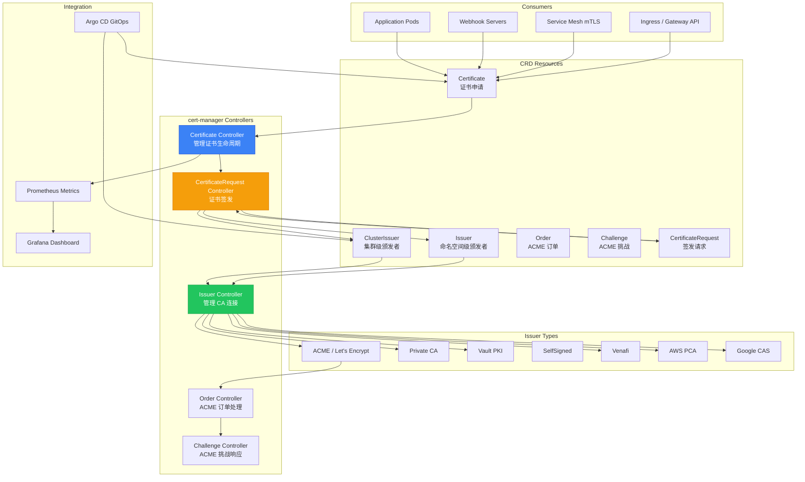

> **生产环境安全提示**
>
> 本文档包含可直接执行的运维命令。执行前请确认：当前目标集群与 Namespace 是否正确；是否具备足够的 RBAC 权限；是否已在非生产环境验证。命令风险等级标注：🔴 高风险（可能造成数据丢失或服务中断）、🟡 中风险（会修改集群状态，但通常可回滚）、🟢 低风险/只读（信息收集，无副作用）。


# cert-manager 自动证书管理深度实践

> **Author**: Cloud Native Security Architect | **Version**: v1.0 | **Update Time**: 2026-05-18
> **Scenario**: Automated TLS certificate management for [[kubernetes|Kubernetes]] | **Complexity**: ⭐⭐⭐

<!-- chunk: 概述 -->## 概述

TLS 证书是云原生环境中服务间安全通信的基础。在 Kubernetes 集群中，[[ingress|Ingress]] 端点、服务间 mTLS、Webhook 服务器等场景都需要大量证书。手动管理证书的签发、分发和轮换既繁琐又容易出错，证书过期导致的服务中断是常见的生产事故。cert-manager 是 Kubernetes 生态中最流行的证书管理工具，它将证书生命周期完全自动化，支持 ACME（Let's Encrypt）、私有 CA、Vault PKI、自签名等多种颁发者，通过声明式 API 管理证书的签发和自动轮换。

cert-manager 的核心价值在于将证书管理从手动操作转变为声明式自动化。管理员只需创建一个 Certificate 资源，指定域名、颁发者和有效期，cert-manager 就会自动完成证书签发、Secret 创建和到期前自动轮换。当证书即将到期时，cert-manager 会自动申请新证书并更新 Secret，使用该 Secret 的 Ingress 和工作负载会自动获取新证书。对于 ACME（Let's Encrypt）证书，cert-manager 自动处理 HTTP-01 和 DNS-01 挑战，无需手动操作 DNS 记录或配置 Web 服务器。

## 威胁模型分析

**证书过期导致服务中断**：未及时轮换的证书过期后，TLS 连接会失败，导致服务不可用。在微服务架构中，一个过期的证书可能影响整个调用链。例如，如果 API Gateway 的证书过期，所有通过网关的请求都会失败。如果服务间 mTLS 的证书过期，服务之间的通信会中断，导致级联问题。历史上，因证书过期导致的大规模服务中断事件屡见不鲜。cert-manager 通过自动轮换机制确保证书始终有效，在证书到期前自动申请续签。

**中间人攻击**：未加密的 HTTP 通信可被中间人窃听和篡改。Ingress 端点如果没有 TLS 保护，用户数据（包括登录凭据、个人信息、支付数据等）可能在传输过程中被截获。DNS 欺骗攻击可以将用户流量导向攻击者的服务器。cert-manager 与 Ingress 集成，自动为域名配置 TLS，确保所有外部流量都经过加密。

**自签名证书信任链问题**：自签名证书不被浏览器和客户端信任，会导致安全警告和连接失败。客户端应用在遇到不受信任的证书时通常会拒绝连接，导致服务不可用。使用 Let's Encrypt 等公共 CA 或企业内部 PKI 可以建立完整的信任链。cert-manager 支持多种颁发者类型，可以根据场景选择合适的 CA。

**密钥泄露**：TLS 私钥存储不当可能被攻击者获取，用于解密流量或冒充服务器。攻击者获取了私钥后可以进行中间人攻击——在用户不知情的情况下解密和修改 TLS 流量。私钥泄露后，攻击者还可以冒充合法服务器进行钓鱼攻击。cert-manager 将私钥存储在 Kubernetes Secret 中，可配合 [[etcd|etcd]] 静态加密和 RBAC 控制访问。

**弱密钥和过期算法**：使用弱密钥（如 RSA 1024）或过期算法（如 SHA-1）的证书容易被破解。随着计算能力的提升，曾经安全的密钥长度可能不再安全。cert-manager 支持配置密钥算法和长度，推荐使用 ECDSA P-256 或 RSA 2048 以上的密钥。

**攻击向量与防御矩阵**：

| 攻击向量 | 风险等级 | cert-manager 防御 | 配置方法 |
|:---|:---|:---|:---|
| 证书过期中断 | 高 | 自动轮换 | Certificate + renewBefore |
| 中间人攻击 | 高 | TLS 加密 | Ingress + ClusterIssuer |
| 自签名不受信任 | 中 | 公共 CA / 企业 PKI | ACME / 私有 CA Issuer |
| 私钥泄露 | 严重 | Secret 加密 + RBAC | etcd 加密 + 最小权限 RBAC |
| 弱密钥算法 | 中 | 强制密钥策略 | privateKey.algorithm: ECDSA |
| 通配符滥用 | 中 | 限制通配符范围 | DNS-01 + 域名范围限制 |
| 速率限制耗尽 | 中 | staging 测试 + 通配符复用 | staging Issuer + 通配符证书 |

<!-- chunk: 架构设计 -->## 架构设计

## cert-manager 组件架构

cert-manager 由三个核心控制器组成，每个控制器负责证书生命周期的不同阶段。Certificate Controller 监听 Certificate 资源的创建和变更，触发证书签发流程。Issuer Controller 管理与各种 CA 的交互，包括 ACME 注册、订单创建和挑战处理。CertificateRequest Controller 处理实际的证书签名请求，与 CA 通信获取签发的证书。



## 安装部署

> ⚠️ **🟡 中危变更** — 变更集群资源状态，建议先 --dry-run 或 diff 确认
> - `helm upgrade/install`：部署/升级 release

``` bash
# 🟡 中风险：会修改集群/资源状态，执行前请确认目标、影响范围与授权
helm repo add jetstack https://charts.jetstack.io
helm repo update

helm install cert-manager jetstack/cert-manager \
  --namespace cert-manager \
  --create-namespace \
  --version v1.17.0 \
  --set installCRDs=true \
  --set prometheus.enabled=true \
  --set prometheus.servicemonitor.enabled=true
```
```yaml
# values-cert-manager-production.yaml
replicaCount: 2

resources:
  requests:
    cpu: 100m
    memory: 128Mi
  limits:
    cpu: 500m
    memory: 512Mi

podDisruptionBudget:
  enabled: true
  minAvailable: 1

affinity:
  podAntiAffinity:
    preferredDuringSchedulingIgnoredDuringExecution:
      - weight: 100
        podAffinityTerm:
          labelSelector:
            matchExpressions:
              - key: app.kubernetes.io/name
                operator: In
                values:
                  - cert-manager
          topologyKey: kubernetes.io/hostname

topologySpreadConstraints:
  - maxSkew: 1
    topologyKey: topology.kubernetes.io/zone
    whenUnsatisfiable: DoNotSchedule
    labelSelector:
      matchLabels:
        app.kubernetes.io/name: cert-manager

prometheus:
  enabled: true
  servicemonitor:
    enabled: true
    namespace: monitoring
    interval: 30s

featureGates:
  - AdditionalCertificateOutputFormats
  - ExperimentalGatewayAPISupport

webhook:
  replicaCount: 2
  resources:
    requests:
      cpu: 50m
      memory: 64Mi
    limits:
      cpu: 200m
      memory: 256Mi
  timeoutSeconds: 5

cainjector:
  replicaCount: 2
  resources:
    requests:
      cpu: 50m
      memory: 128Mi
    limits:
      cpu: 200m
      memory: 256Mi

startupapicheck:
  enabled: true

extraArgs:
  - --enable-certificate-owner-ref=true
  - --default-issuer-kind=ClusterIssuer
  - --default-issuer-name=letsencrypt-prod
```

<!-- chunk: 核心配置 -->## 核心配置

## ACME / Let's Encrypt 配置

## HTTP-01 挑战

HTTP-01 挑战是最常用的 ACME 验证方式，适合公开可访问的域名。cert-manager 在集群中创建临时 HTTP 服务来响应 Let's Encrypt 的验证请求。HTTP-01 挑战的优点是配置简单，不需要 DNS 服务商的 API 凭据。缺点是不支持通配符证书，域名必须通过 Ingress 暴露到公网。

```yaml
apiVersion: cert-manager.io/v1
kind: ClusterIssuer
metadata:
  name: letsencrypt-prod
spec:
  acme:
    server: https://acme-v02.api.letsencrypt.org/directory
    email: admin@example.com
    privateKeySecretRef:
      name: letsencrypt-prod-key
    solvers:
      - http01:
          ingress:
            class: nginx
            serviceType: ClusterIP
        selector:
          dnsZones:
            - "example.com"
            - "www.example.com"
      - http01:
          ingress:
            class: traefik
        selector:
          dnsZones:
            - "traefik.example.com"
---
apiVersion: cert-manager.io/v1
kind: ClusterIssuer
metadata:
  name: letsencrypt-staging
spec:
  acme:
    server: https://acme-staging-v02.api.letsencrypt.org/directory
    email: admin@example.com
    privateKeySecretRef:
      name: letsencrypt-staging-key
    solvers:
      - http01:
          ingress:
            class: nginx
```

## DNS-01 挑战（通配符证书）

DNS-01 挑战通过在 DNS 中添加 TXT 记录验证域名所有权，支持签发通配符证书。DNS-01 挑战的优点是支持通配符证书（`*.example.com`）、不需要公网可访问的 Ingress、可以签发内网域名证书。缺点是需要 DNS 服务商的 API 凭据，配置相对复杂。

```yaml
apiVersion: cert-manager.io/v1
kind: ClusterIssuer
metadata:
  name: letsencrypt-dns
spec:
  acme:
    server: https://acme-v02.api.letsencrypt.org/directory
    email: admin@example.com
    privateKeySecretRef:
      name: letsencrypt-dns-key
    solvers:
      - dns01:
          route53:
            region: us-east-1
            hostedZoneID: Z1234567890ABC
            role: arn:aws:iam::123456789012:role/cert-manager-dns
        selector:
          dnsZones:
            - "example.com"
            - "*.example.com"
---
# Cloudflare DNS
apiVersion: v1
kind: Secret
metadata:
  name: cloudflare-api-token
  namespace: cert-manager
type: Opaque
stringData:
  api-token: "cloudflare-api-token-value"
---
apiVersion: cert-manager.io/v1
kind: ClusterIssuer
metadata:
  name: letsencrypt-cloudflare
spec:
  acme:
    server: https://acme-v02.api.letsencrypt.org/directory
    email: admin@example.com
    privateKeySecretRef:
      name: letsencrypt-cloudflare-key
    solvers:
      - dns01:
          cloudflare:
            apiTokenSecretRef:
              name: cloudflare-api-token
              key: api-token
        selector:
          dnsZones:
            - "example.com"
            - "*.example.com"
---
# Google Cloud DNS
apiVersion: cert-manager.io/v1
kind: ClusterIssuer
metadata:
  name: letsencrypt-gcp
spec:
  acme:
    server: https://acme-v02.api.letsencrypt.org/directory
    email: admin@example.com
    privateKeySecretRef:
      name: letsencrypt-gcp-key
    solvers:
      - dns01:
          cloudDNS:
            project: my-gcp-project
            serviceAccountSecretRef:
              name: gcp-dns-sa
              key: key.json
        selector:
          dnsZones:
            - "example.com"
---
# Akamai Edge DNS
apiVersion: cert-manager.io/v1
kind: ClusterIssuer
metadata:
  name: letsencrypt-akamai
spec:
  acme:
    server: https://acme-v02.api.letsencrypt.org/directory
    email: admin@example.com
    privateKeySecretRef:
      name: letsencrypt-akamai-key
    solvers:
      - dns01:
          akamai:
            serviceConsumerDomain: example.akamai.com
            clientTokenSecretRef:
              name: akamai-credentials
              key: clientToken
            clientSecretSecretRef:
              name: akamai-credentials
              key: clientSecret
            accessTokenSecretRef:
              name: akamai-credentials
              key: accessToken
```

## 私有 CA 配置

私有 CA 适合内部服务间 mTLS 场景。cert-manager 管理私有 CA 的密钥对，并使用它签发子证书。私有 CA 证书需要分发到所有客户端的 TrustStore 中。

> ⚠️ **🟡 中危变更** — 变更集群资源状态，建议先 --dry-run 或 diff 确认
> - `kubectl apply/create/replace`：创建/变更集群资源

``` bash
# 🟡 中风险：会修改集群/资源状态，执行前请确认目标、影响范围与授权
# 创建 CA 私钥和证书
openssl genrsa -out ca.key 4096
openssl req -x509 -new -nodes -key ca.key \
  -sha256 -days 3650 \
  -out ca.crt \
  -subj "/CN=MyOrg Internal CA/O=MyOrg/C=US"

# 创建 Secret
kubectl create secret tls ca-key-pair \
  --cert=ca.crt \
  --key=ca.key \
  --namespace=cert-manager

# 安全保管 CA 私钥
kubectl get secret ca-key-pair -n cert-manager -o yaml | \
  kubectl neat > ca-secret-backup.yaml
```
```yaml
apiVersion: cert-manager.io/v1
kind: ClusterIssuer
metadata:
  name: myorg-ca
spec:
  ca:
    secretName: ca-key-pair
    crlDistributionPoints:
      - "http://pki.example.com/ca.crl"
    ocspServers:
      - "http://pki.example.com/ocsp"
---
apiVersion: cert-manager.io/v1
kind: Certificate
metadata:
  name: internal-app
  namespace: production
spec:
  secretName: internal-app-tls
  issuerRef:
    name: myorg-ca
    kind: ClusterIssuer
  dnsNames:
    - app.production.svc.cluster.local
    - app.production
    - app
  ipAddresses:
    - "10.0.0.1"
  duration: 2160h
  renewBefore: 360h
  usages:
    - digital signature
    - key encipherment
    - server auth
    - client auth
  privateKey:
    algorithm: ECDSA
    size: 256
    rotationPolicy: Always
  subject:
    organizations:
      - MyOrg
    organizationalUnits:
      - Engineering
---
# CA 证书分发到所有命名空间的 TrustStore
apiVersion: cert-manager.io/v1
kind: Certificate
metadata:
  name: ca-trust-bundle
  namespace: production
spec:
  secretName: ca-trust-bundle
  issuerRef:
    name: myorg-ca
    kind: ClusterIssuer
  commonName: "MyOrg CA Trust Bundle"
  isCA: false
  keystores:
    jks:
      create: true
      passwordSecretRef:
        name: keystore-password
        key: password
    pkcs12:
      create: true
      passwordSecretRef:
        name: keystore-password
        key: password
```

## 证书申请与使用

```yaml
# 申请公开证书
apiVersion: cert-manager.io/v1
kind: Certificate
metadata:
  name: example-com
  namespace: default
spec:
  secretName: example-com-tls
  issuerRef:
    name: letsencrypt-prod
    kind: ClusterIssuer
  dnsNames:
    - example.com
    - www.example.com
    - api.example.com
  privateKey:
    algorithm: RSA
    encoding: PKCS1
    size: 2048
  usages:
    - digital signature
    - key encipherment
  revisionHistoryLimit: 3
---
# 申请通配符证书
apiVersion: cert-manager.io/v1
kind: Certificate
metadata:
  name: wildcard-example-com
  namespace: default
spec:
  secretName: wildcard-example-com-tls
  issuerRef:
    name: letsencrypt-dns
    kind: ClusterIssuer
  dnsNames:
    - "*.example.com"
    - "example.com"
  duration: 2160h
  renewBefore: 720h
---
# 申请短期证书（mTLS 场景）
apiVersion: cert-manager.io/v1
kind: Certificate
metadata:
  name: service-mtls
  namespace: production
spec:
  secretName: service-mtls-tls
  issuerRef:
    name: myorg-ca
    kind: ClusterIssuer
  dnsNames:
    - service-a.production.svc.cluster.local
  duration: 24h
  renewBefore: 8h
  privateKey:
    algorithm: ECDSA
    size: 256
  usages:
    - digital signature
    - server auth
    - client auth
```

<!-- chunk: 安全策略实战 -->## 安全策略实战

## Ingress TLS 自动化

cert-manager 与 Kubernetes Ingress 深度集成，通过注解可以自动为 Ingress 端点配置 TLS 证书。当 Ingress 资源中指定了 `tls` 字段但对应的 Secret 不存在时，cert-manager 会自动创建 Certificate 资源并签发证书。证书更新后 Secret 会自动更新，Ingress Controller 会自动加载新证书。

```yaml
apiVersion: networking.k8s.io/v1
kind: Ingress
metadata:
  name: myapp
  annotations:
    cert-manager.io/cluster-issuer: "letsencrypt-prod"
    cert-manager.io/certificate-renew-before: "360h"
    nginx.ingress.kubernetes.io/ssl-redirect: "true"
    nginx.ingress.kubernetes.io/force-ssl-redirect: "true"
    nginx.ingress.kubernetes.io/ssl-protocols: "TLSv1.2 TLSv1.3"
    nginx.ingress.kubernetes.io/ssl-ciphers: "ECDHE-ECDSA-AES128-GCM-SHA256:ECDHE-RSA-AES128-GCM-SHA256:ECDHE-ECDSA-AES256-GCM-SHA384:ECDHE-RSA-AES256-GCM-SHA384"
    nginx.ingress.kubernetes.io/ssl-prefer-server-ciphers: "true"
    nginx.ingress.kubernetes.io/configuration-snippet: |
      more_set_headers "X-Content-Type-Options: nosniff";
      more_set_headers "X-Frame-Options: DENY";
      more_set_headers "X-XSS-Protection: 1; mode=block";
      more_set_headers "Strict-Transport-Security: max-age=31536000; includeSubDomains; preload";
spec:
  ingressClassName: nginx
  tls:
    - hosts:
        - app.example.com
      secretName: app-example-com-tls
  rules:
    - host: app.example.com
      http:
        paths:
          - path: /
            pathType: Prefix
            backend:
              service:
                name: myapp
                port:
                  number: 80
```

## Gateway API TLS

```yaml
apiVersion: gateway.networking.k8s.io/v1
kind: Gateway
metadata:
  name: example-gateway
  annotations:
    cert-manager.io/cluster-issuer: "letsencrypt-prod"
spec:
  gatewayClassName: nginx
  listeners:
    - name: https
      protocol: HTTPS
      port: 443
      hostname: "*.example.com"
      tls:
        mode: Terminate
        certificateRefs:
          - kind: Secret
            name: wildcard-example-com-tls
    - name: http
      protocol: HTTP
      port: 80
      hostname: "*.example.com"
      allowedRoutes:
        namespaces:
          from: All
---
# GatewayRoute 引用 Gateway
apiVersion: gateway.networking.k8s.io/v1
kind: HTTPRoute
metadata:
  name: myapp-route
spec:
  parentRefs:
    - name: example-gateway
  hostnames:
    - "app.example.com"
  rules:
    - backendRefs:
        - name: myapp
          port: 80
```

## Vault PKI 集成

cert-manager 可以与 HashiCorp Vault 的 PKI 引擎集成，使用 Vault 作为证书颁发者。这适合已有 Vault PKI 基础设施的企业，可以统一管理所有证书的签发和撤销。

```yaml
apiVersion: v1
kind: Secret
metadata:
  name: cert-manager-vault-token
  namespace: production
type: Opaque
stringData:
  token: "s.xxxxx"
---
apiVersion: cert-manager.io/v1
kind: Issuer
metadata:
  name: vault-issuer
  namespace: production
spec:
  vault:
    server: https://vault.vault.svc.cluster.local:8200
    path: pki/sign/myapp
    auth:
      kubernetes:
        mountPath: /v1/auth/kubernetes
        role: cert-manager
        secretRef:
          name: cert-manager-vault-token
          key: token
---
apiVersion: cert-manager.io/v1
kind: Certificate
metadata:
  name: vault-signed-cert
  namespace: production
spec:
  secretName: vault-cert-tls
  issuerRef:
    name: vault-issuer
    kind: Issuer
  dnsNames:
    - app.production.svc.cluster.local
  duration: 24h
  renewBefore: 8h
  privateKey:
    algorithm: ECDSA
    size: 256
  keystores:
    pkcs12:
      create: true
      passwordSecretRef:
        name: keystore-password
        key: password
    jks:
      create: true
      passwordSecretRef:
        name: keystore-password
        key: password
```

## mTLS 服务网格证书

```yaml
# 为 Istio 服务网格签发证书
apiVersion: cert-manager.io/v1
kind: Certificate
metadata:
  name: istio-cacerts
  namespace: istio-system
spec:
  secretName: cacerts
  duration: 8760h
  renewBefore: 720h
  issuerRef:
    name: myorg-ca
    kind: ClusterIssuer
  commonName: "MyOrg Root CA"
  isCA: true
  privateKey:
    algorithm: ECDSA
    size: 256
---
apiVersion: cert-manager.io/v1
kind: Certificate
metadata:
  name: istio-intermediate-ca
  namespace: istio-system
spec:
  secretName: istio-intermediate-ca
  duration: 4380h
  renewBefore: 360h
  issuerRef:
    name: myorg-ca
    kind: ClusterIssuer
  commonName: "MyOrg Intermediate CA"
  isCA: true
  privateKey:
    algorithm: ECDSA
    size: 256
  usages:
    - digital signature
    - cert sign
    - crl sign
```

<!-- chunk: 合规与审计 -->## 合规与审计

## 证书生命周期审计

``` bash
# 🟢 低风险：只读/信息收集，通常无副作用
#!/bin/bash
# certificate_audit.sh - 证书合规审计脚本

echo "=== Certificate Status Report ==="
echo "Date: $(date)"
echo "Cluster: $(kubectl config current-context)"
echo ""

echo "<!-- chunk: All Certificates" -->## All Certificates"
echo "| Namespace | Name | Secret | NotAfter | Ready |"
echo "|:---|:---|:---|:---|:---|"
kubectl get certificates --all-namespaces -o json | \
  jq -r '.items[] |
    "| \(.metadata.namespace) | \(.metadata.name) | \(.spec.secretName) |
       \(.status.notAfter // "pending") |
       \((.status.conditions[]? | select(.type=="Ready") | .status) // "Unknown") |"' | \
  column -t -s'|'

echo ""
echo "<!-- chunk: Expiring Certificates (within 30 days)" -->## Expiring Certificates (within 30 days)"
kubectl get certificates --all-namespaces -o json | \
  jq -r --arg now "$(date -u +%Y-%m-%dT%H:%M:%SZ)" \
    '.items[] |
    select(.status.notAfter != null) |
    select((.status.notBefore != null)) |
    {ns: .metadata.namespace, name: .metadata.name, notAfter: .status.notAfter} |
    select((.notAfter | sub("\\.[0-9]+Z$"; "Z") | strptime("%Y-%m-%dT%H:%M:%SZ") | mktime) -
           ([$now] | map(sub("\\.[0-9]+Z$"; "Z") | strptime("%Y-%m-%dT%H:%M:%SZ") | mktime))[0] < 2592000) |
    "\(.ns)/\(.name) expires: \(.notAfter)"'

echo ""
echo "<!-- chunk: Failed Certificate Requests" -->## Failed Certificate Requests"
kubectl get certificaterequests --all-namespaces -o json | \
  jq -r '.items[] |
    select(.status.conditions[]?.type == "Ready" and .status.conditions[]?.status == "False") |
    "\(.metadata.namespace)/\(.metadata.name): \(.status.conditions[]?.message)"'

echo ""
echo "<!-- chunk: Certificates Using Weak Keys (RSA < 2048)" -->## Certificates Using Weak Keys (RSA < 2048)"
kubectl get certificates --all-namespaces -o json | \
  jq -r '.items[] |
    select(.spec.privateKey.algorithm == "RSA" and .spec.privateKey.size != null and .spec.privateKey.size < 2048) |
    "WARNING: \(.metadata.namespace)/\(.metadata.name) uses RSA \(.spec.privateKey.size)"'

echo ""
echo "<!-- chunk: Certificates Without Auto-Renewal" -->## Certificates Without Auto-Renewal"
kubectl get certificates --all-namespaces -o json | \
  jq -r '.items[] |
    select(.spec.renewBefore == null) |
    "WARNING: \(.metadata.namespace)/\(.metadata.name) has no renewBefore configured"'

echo ""
echo "<!-- chunk: CIS Benchmark Checks" -->## CIS Benchmark Checks"
echo "- TLS 1.2+ enforced: Check Ingress annotations for ssl-protocols"
echo "- HSTS enabled: Check Ingress annotations for Strict-Transport-Security"
echo "- Weak ciphers disabled: Check ssl-ciphers configuration"
echo "- Certificate TTL <= 90 days for public certs"
kubectl get certificates --all-namespaces -o json | \
  jq -r '.items[] |
    select(.spec.duration != null) |
    {ns: .metadata.namespace, name: .metadata.name, duration: .spec.duration} |
    select((.duration | test("h$")) and ((.duration | sub("h$";"") | tonumber) > 2160)) |
    "WARNING: \(.ns)/\(.name) duration > 90 days: \(.duration)"'
```
## 证书策略（Kyverno 集成）

```yaml
apiVersion: kyverno.io/v1
kind: ClusterPolicy
metadata:
  name: enforce-cert-manager-usage
  annotations:
    policies.kyverno.io/title: Enforce cert-manager Usage
    policies.kyverno.io/category: TLS
spec:
  validationFailureAction: Audit
  background: true
  rules:
    - name: require-cert-manager-for-tls
      match:
        any:
          - resources:
              kinds:
                - networking.k8s.io/v1/Ingress
      validate:
        message: "TLS Ingress 必须使用 cert-manager 自动证书管理"
        pattern:
          metadata:
            annotations:
              cert-manager.io/cluster-issuer: "?*"
    - name: disallow-manual-tls-secrets
      match:
        any:
          - resources:
              kinds:
                - networking.k8s.io/v1/Ingress
      validate:
        message: "禁止手动创建 TLS Secret，必须通过 cert-manager 管理"
        deny:
          conditions:
            any:
              - key: "{{ request.object.metadata.annotations.\"cert-manager.io/cluster-issuer\" || '' }}"
                operator: Equals
                value: ""
```

<!-- chunk: 监控与告警 -->## 监控与告警

## Prometheus 告警规则

```yaml
apiVersion: monitoring.coreos.com/v1
kind: PrometheusRule
metadata:
  name: cert-manager-alerts
  namespace: cert-manager
spec:
  groups:
    - name: cert-manager.rules
      rules:
        - alert: CertificateExpiringSoon
          expr: |
            (certmanager_certificate_expiration_timestamp_seconds - time()) / 86400 < 14
          for: 1h
          labels:
            severity: warning
          annotations:
            summary: "证书 {{ $labels.name }} 将在 14 天内过期"
            description: "命名空间 {{ $labels.namespace }} 中的证书 {{ $labels.name }} 将在 14 天内过期，请检查自动轮换是否正常"

        - alert: CertificateExpiringCritical
          expr: |
            (certmanager_certificate_expiration_timestamp_seconds - time()) / 86400 < 7
          for: 30m
          labels:
            severity: critical
          annotations:
            summary: "证书 {{ $labels.name }} 将在 7 天内过期"
            description: "命名空间 {{ $labels.namespace }} 中的证书 {{ $labels.name }} 即将过期，自动轮换可能失败"

        - alert: CertificateExpired
          expr: |
            certmanager_certificate_expiration_timestamp_seconds - time() < 0
          for: 5m
          labels:
            severity: critical
          annotations:
            summary: "证书 {{ $labels.name }} 已过期"
            description: "命名空间 {{ $labels.namespace }} 中的证书 {{ $labels.name }} 已过期，服务可能不可用"

        - alert: CertificateNotReady
          expr: |
            certmanager_certificate_ready_status{condition="False"} == 1
          for: 15m
          labels:
            severity: critical
          annotations:
            summary: "证书 {{ $labels.name }} 未就绪"
            description: "证书签发失败，请检查 Issuer 配置和 ACME 挑战"

        - alert: ACMEOrderFailed
          expr: |
            rate(certmanager_acme_client_request_count{status="failed"}[5m]) > 0
          for: 5m
          labels:
            severity: warning
          annotations:
            summary: "ACME 订单失败"
            description: "Let's Encrypt 订单请求失败率异常"

        - alert: CertManagerDown
          expr: up{job="cert-manager"} == 0
          for: 5m
          labels:
            severity: critical
          annotations:
            summary: "cert-manager 服务不可用"
            description: "cert-manager 已停止响应，证书轮换将中断"

        - alert: CertManagerHighErrorRate
          expr: |
            rate(certmanager_certificate_issuation_total{result="error"}[5m]) > 0.1
          for: 10m
          labels:
            severity: warning
          annotations:
            summary: "cert-manager 签发错误率过高"
            description: "证书签发错误率 {{ $value }}/s，可能影响证书轮换"

        - alert: CertificateRotationStuck
          expr: |
            (certmanager_certificate_expiration_timestamp_seconds - time()) / 86400 < 30
            and (certmanager_certificate_expiration_timestamp_seconds - time()) / 86400 > 14
          for: 24h
          labels:
            severity: warning
          annotations:
            summary: "证书 {{ $labels.name }} 未在预期时间内轮换"
            description: "证书将在 14-30 天内过期但尚未触发轮换，检查 renewBefore 配置"
```

## Grafana Dashboard

```json
{
  "dashboard": {
    "title": "cert-manager Certificate Dashboard",
    "panels": [
      {
        "title": "Certificate Expiry Timeline",
        "type": "graph",
        "gridPos": {"h": 8, "w": 24, "x": 0, "y": 0},
        "targets": [
          {
            "expr": "(certmanager_certificate_expiration_timestamp_seconds - time()) / 86400",
            "legendFormat": "{{namespace}}/{{name}}"
          }
        ]
      },
      {
        "title": "Certificate Ready Status",
        "type": "stat",
        "gridPos": {"h": 4, "w": 8, "x": 0, "y": 8},
        "targets": [
          {
            "expr": "sum(certmanager_certificate_ready_status{condition=\"True\"})",
            "legendFormat": "Ready"
          },
          {
            "expr": "sum(certmanager_certificate_ready_status{condition=\"False\"})",
            "legendFormat": "Not Ready"
          }
        ]
      },
      {
        "title": "ACME Registration Count",
        "type": "stat",
        "gridPos": {"h": 4, "w": 8, "x": 8, "y": 8},
        "targets": [
          {
            "expr": "certmanager_acme_client_request_count",
            "legendFormat": "{{uri}}"
          }
        ]
      },
      {
        "title": "Issuance Rate",
        "type": "graph",
        "gridPos": {"h": 4, "w": 8, "x": 16, "y": 8},
        "targets": [
          {
            "expr": "rate(certmanager_certificate_issuance_total[1h])",
            "legendFormat": "{{issuer_name}}"
          }
        ]
      },
      {
        "title": "Certificates by Issuer",
        "type": "piechart",
        "gridPos": {"h": 8, "w": 12, "x": 0, "y": 12},
        "targets": [
          {
            "expr": "count by (issuer_name) (certmanager_certificate_expiration_timestamp_seconds)",
            "legendFormat": "{{issuer_name}}"
          }
        ]
      },
      {
        "title": "Issuance Errors",
        "type": "graph",
        "gridPos": {"h": 8, "w": 12, "x": 12, "y": 12},
        "targets": [
          {
            "expr": "rate(certmanager_certificate_issuance_total{result=\"error\"}[1h])",
            "legendFormat": "{{issuer_name}} - {{reason}}"
          }
        ]
      }
    ]
  }
}
```

<!-- chunk: 事件响应流程 -->## 事件响应流程

当证书相关告警触发时，遵循以下响应流程：

| 告警级别 | 场景 | 响应时间 | 操作步骤 |
|:---|:---|:---|:---|
| Critical | 证书已过期 | < 15 分钟 | 1. 确认影响范围 2. 检查 cert-manager 状态 3. 手动触发轮换 4. 通知受影响团队 |
| Critical | cert-manager 不可用 | < 15 分钟 | 1. 检查 Pod 状态 2. 查看日志 3. 重启 cert-manager 4. 确认证书轮换恢复 |
| Warning | 证书 14 天内过期 | < 4 小时 | 1. 检查自动轮换状态 2. 确认 Issuer 可达 3. 检查 ACME 挑战 4. 手动触发续签 |
| Warning | ACME 订单失败 | < 8 小时 | 1. 检查 ACME 账户状态 2. 检查速率限制 3. 检查 DNS/Ingress 配置 |
| Info | 证书轮换成功 | 记录 | 记录审计日志，无需操作 |

> ⚠️ **🟡 中危变更** — 变更集群资源状态，建议先 --dry-run 或 diff 确认
> - `kubectl label/annotate`：改元数据可能影响选择器/控制器

``` bash
# 🟡 中风险：会修改集群/资源状态，执行前请确认目标、影响范围与授权
# 手动触发证书轮换
kubectl annotate certificate <name> -n <namespace> \
  cert-manager.io/issue-temporary-certificate=true \
  --overwrite

# 检查证书签发状态
kubectl describe certificate <name> -n <namespace>

# 检查 CertificateRequest
kubectl get certificaterequests -n <namespace>

# 检查 ACME Order 和 Challenge
kubectl get orders -n <namespace>
kubectl get challenges -n <namespace>
```
<!-- chunk: 最佳实践 -->## 最佳实践

## 证书策略建议

| 实践 | 说明 | 配置示例 |
|:---|:---|:---|
| 使用 ECDSA 密钥 | 性能优于 RSA，密钥更短 | `algorithm: ECDSA, size: 256` |
| 设置合理 TTL | 公开证书 90 天，内部证书 90 天 | `duration: 2160h` |
| 配置 renewBefore | 证书到期前自动轮换 | `renewBefore: 360h` (15 天) |
| 分离 Issuer 环境 | staging 测试，production 生产 | staging + production ClusterIssuer |
| Secret 保护 | RBAC 最小权限 + etcd 加密 | `encryptionConfiguration` |
| 限制 Secret 访问 | 仅 cert-manager 和目标应用可访问 | RBAC RoleBinding |
| 证书用途明确 | 指定 usages 避免过度权限 | `usages: [digital signature, server auth]` |
| 启用 revisionHistory | 保留历史版本以便回滚 | `revisionHistoryLimit: 3` |
| KeyStore 自动生成 | 为 Java 应用生成 JKS/PKCS12 | `keystores: jks/pkcs12` |
| 多集群统一 CA | 使用 Vault PKI 或集中 CA | Vault Issuer + ClusterIssuer |

## 多集群证书管理

在多集群环境中，建议使用集中的 CA 或 Vault PKI 作为证书颁发者，各集群的 cert-manager 实例连接到统一的颁发者。这确保了证书信任链的一致性，便于证书管理和撤销。

```yaml
# 集群 A 配置
apiVersion: cert-manager.io/v1
kind: ClusterIssuer
metadata:
  name: vault-central-ca
spec:
  vault:
    server: https://vault.central.example.com:8200
    path: pki/sign/cluster-a
    auth:
      kubernetes:
        mountPath: /v1/auth/kubernetes/cluster-a
        role: cert-manager
        secretRef:
          name: vault-token
          key: token
---
# 集群 B 配置
apiVersion: cert-manager.io/v1
kind: ClusterIssuer
metadata:
  name: vault-central-ca
spec:
  vault:
    server: https://vault.central.example.com:8200
    path: pki/sign/cluster-b
    auth:
      kubernetes:
        mountPath: /v1/auth/kubernetes/cluster-b
        role: cert-manager
        secretRef:
          name: vault-token
          key: token
```

## GitOps 集成

```yaml
apiVersion: argoproj.io/v1alpha1
kind: Application
metadata:
  name: cert-manager-config
  namespace: argocd
spec:
  project: security
  source:
    repoURL: https://github.com/company/infrastructure.git
    targetRevision: main
    path: cert-manager
  destination:
    server: https://kubernetes.default.svc
    namespace: cert-manager
  syncPolicy:
    automated:
      prune: false
      selfHeal: true
  ignoreDifferences:
    - group: cert-manager.io
      kind: Certificate
      jsonPointers:
        - /status
    - group: cert-manager.io
      kind: CertificateRequest
      jsonPointers:
        - /status
    - group: cert-manager.io
      kind: Order
      jsonPointers:
        - /status
```

<!-- chunk: 故障排查 -->## 故障排查

## 常见问题

**证书签发失败**：检查 Certificate 资源的状态 `kubectl describe certificate <name>`，查看 `status.conditions` 中的错误信息。确认 Issuer 配置正确，ACME 账户注册成功。常见原因包括 Issuer Secret 不存在或内容错误、ACME 账户注册失败、速率限制。

**ACME 挑战失败**：HTTP-01 挑战失败通常是 Ingress 配置问题或域名 DNS 未正确指向集群。DNS-01 挑战失败检查 DNS 服务商凭据和权限。查看 Challenge 资源状态 `kubectl get challenges`。常见原因包括 Ingress Controller 未正确配置 challenge 路径、DNS 记录传播延迟、API Token 权限不足。

**证书未自动轮换**：确认 cert-manager Pod 运行正常。检查 `renewBefore` 设置是否合理（不能大于 `duration`）。检查 Secret 是否被意外删除或修改。使用 `kubectl describe certificate` 查看轮换状态。

**速率限制**：Let's Encrypt 对每个注册域名有速率限制（每周 50 个证书）。使用 staging 环境测试，复用通配符证书减少证书数量。使用 `kubectl get orders` 查看订单状态。

**Webhook 证书问题**：cert-manager 的 Webhook 需要有效的 TLS 证书。如果 Webhook 证书过期，所有证书操作都会失败。检查 `cert-manager-webhook-ca` Secret 是否存在且有效。

## 完整诊断脚本

``` bash
# 🟢 低风险：只读/信息收集，通常无副作用
#!/bin/bash
# cert-manager_diagnostics.sh

echo "=== cert-manager Pods ==="
kubectl get pods -n cert-manager -o wide
echo ""

echo "=== Resource Usage ==="
kubectl top pods -n cert-manager
echo ""

echo "=== Certificate Status ==="
kubectl get certificates --all-namespaces -o wide
echo ""

echo "=== Certificate Expiry ==="
kubectl get certificates --all-namespaces -o json | \
  jq -r '.items[] |
    "\(.metadata.namespace)/\(.metadata.name): NotAfter=\(.status.notAfter // "pending") Ready=\((.status.conditions[]? | select(.type=="Ready") | .status) // "Unknown")"'
echo ""

echo "=== Failed Requests ==="
kubectl get certificaterequests --all-namespaces -o json | \
  jq -r '.items[] | select(.status.conditions[]?.reason != "Issued") |
    "\(.metadata.namespace)/\(.metadata.name): \(.status.conditions[]?.message)"'
echo ""

echo "=== ACME Orders ==="
kubectl get orders --all-namespaces
echo ""

echo "=== ACME Challenges ==="
kubectl get challenges --all-namespaces
echo ""

echo "=== Issuer Status ==="
kubectl get issuers --all-namespaces -o wide
kubectl get clusterissuers -o wide
echo ""

echo "=== cert-manager Logs (last 30 lines) ==="
kubectl logs -n cert-manager deployment/cert-manager --tail=30
echo ""

echo "=== Webhook Logs ==="
kubectl logs -n cert-manager deployment/cert-manager-webhook --tail=15
echo ""

echo "=== Webhook Certificate Check ==="
kubectl get secret cert-manager-webhook-ca -n cert-manager -o json | \
  jq -r '.data["tls.crt"]' | base64 -d | openssl x509 -noout -dates -subject 2>/dev/null || echo "Webhook CA secret not found or invalid"
echo ""

echo "=== Ingress TLS Check ==="
kubectl get ingress --all-namespaces -o json | \
  jq -r '.items[] | select(.spec.tls != null) |
    "\(.metadata.namespace)/\(.metadata.name): tls_hosts=\([.spec.tls[].hosts[]] | join(",")) secret=\(.spec.tls[].secretName)"'
```
---

*本文档基于 cert-manager 证书管理实践经验编写，持续更新最新技术和最佳实践。*

---

<!-- chunk: Obsidian 相关文档 -->## Obsidian 相关文档

- 安全 MOC
- [[08-安全/README.md|Domain 05: 云原生安全 (Cloud Native Security)]]
- [[08-安全/00-总览/00-open-source-projects-index.md|Domain-25 云原生安全 — 开源项目索引]]
- Falco 云原生安全监控深度实践
- Sysdig企业级容器安全深度实践
- Aqua Security 企业级容器安全平台深度实践
- Kyverno 企业级策略管理深度实践
- HashiCorp Vault 企业级密钥管理深度实践
- OPA Gatekeeper 策略即代码深度实践
- 容器镜像安全扫描深度实践
- Kubernetes 安全加固深度实践
- gVisor 容器沙箱深度解析

## See Also

- 11-kubernetes-security-hardening
- 17-gvisor-container-sandbox
- 99-falco-runtime-security-guide
- 99-java-security-kubernetes-guide

- [[08-安全/README.md|返回目录]]

## Related

- [[21-生态参考/03-领域索引/cert-index.md|Certificate / TLS 证书知识图谱索引]]
- [[21-生态参考/03-领域索引/security-index.md|Security 安全知识图谱索引]]


<!-- risk-assessed -->
