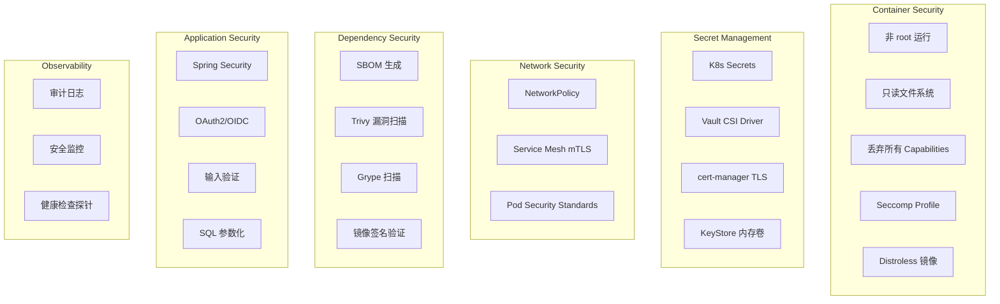

> **生产环境安全提示**
>
> 本文档包含可直接执行的运维命令。执行前请确认：当前目标集群与 Namespace 是否正确；是否具备足够的 RBAC 权限；是否已在非生产环境验证。命令风险等级标注：🔴 高风险（可能造成数据丢失或服务中断）、🟡 中风险（会修改集群状态，但通常可回滚）、🟢 低风险/只读（信息收集，无副作用）。


# Java 应用 [[Kubernetes|Kubernetes]]es 安全加固深度实践|Kubernetes 安全加固深度实践]]

> **Author**: Cloud Native Security Architect | **Version**: v1.0 | **Update Time**: 2026-05-18
> **Scenario**: Java application security hardening on Kubernetes | **Complexity**: ⭐⭐⭐⭐⭐

<!-- chunk: 概述 -->## 概述

Java 应用在 Kubernetes 上的安全加固涉及多个层面：容器运行时安全、密钥与证书管理、网络安全策略、依赖安全扫描和代码安全实践。随着 JDK 21 中 SecurityManager 的弃用（JEP 411），传统的 Java 沙箱机制将逐步移除，安全防护重心转移到容器和 Kubernetes 平台层面。本文从 Java 应用的视角出发，系统性地介绍在 Kubernetes 环境中构建安全 Java 工作负载的完整方案，涵盖 SecurityContext 配置、KeyStore/TrustStore 管理、Spring Security 集成、SBOM 生成、依赖漏洞扫描和安全编码最佳实践。

Java 应用在 Kubernetes 上面临的安全挑战与其他语言有所不同。首先是 JVM 的内存管理——JVM 默认不感知容器的内存限制，可能使用超过容器限制的内存导致 OOMKilled。其次是 Java 的 KeyStore/TrustStore 机制——Java 应用使用 JKS/PKCS12 格式的密钥库，而不是原生的文件证书，需要额外的转换步骤。第三是 Java 生态的复杂依赖——一个 Spring Boot 应用可能包含数百个传递依赖，每个依赖都可能包含已知漏洞。第四是 SecurityManager 的弃用——传统的 Java 安全管理器将逐步移除，需要依赖平台级的安全控制。

## 威胁模型分析

**容器逃逸**：以 root 用户运行的 Java 容器一旦被入侵，攻击者可利用容器配置缺陷获取宿主机控制权。Java 进程通常不需要 root 权限——它只需要监听高端口（>1024）、读写应用目录和临时目录。以 root 运行的风险在于，攻击者可以利用特权模式或危险 capabilities 实现容器逃逸，获取宿主机的完全控制权。即使应用代码本身没有漏洞，以 root 运行的容器也可能被利用 Java 进程的漏洞（如反序列化漏洞、JNDI 注入）实现代码执行，进而利用容器配置缺陷逃逸。

**密钥泄露**：数据库密码、API Key、TLS 私钥等敏感信息可能通过环境变量泄露、ConfigMap 明文存储或日志打印等方式暴露。Java 应用的密钥泄露风险尤其高——Spring Boot 的 application.yml 中经常包含数据库密码和 API Key，如果不使用外部化配置，这些密钥会被打包到镜像层中。java -jar 命令行参数中的密钥可能通过 ps 命令被其他用户看到。Java 的 System.getenv() 返回的环境变量可以通过 /proc/<pid>/environ 文件读取。

**依赖漏洞**：Java 生态的 Maven/Gradle 依赖树非常复杂，一个 Spring Boot 应用可能包含数百个传递依赖。已知漏洞如 Log4Shell（CVE-2021-44228）、Spring4Shell（CVE-2022-22965）等都曾造成严重影响。Log4Shell 漏洞允许攻击者通过 JNDI 注入执行任意代码，影响范围包括所有使用 Log4j 2.x 的 Java 应用。Spring4Shell 漏洞允许攻击者通过特殊的 HTTP 请求修改应用的 ClassLoader 属性，实现远程代码执行。

**供应链攻击**：攻击者在 Maven Central 发布恶意包（typosquatting），或通过依赖混淆攻击内部仓库。锁定依赖版本、验证依赖完整性和使用内部 Artifact 仓库可降低风险。

**攻击向量与防御矩阵**：

| 攻击向量 | 风险等级 | K8s 防御 | Java 层防御 |
|:---|:---|:---|:---|
| 容器逃逸 | Critical | runAsNonRoot + drop ALL | Distroless 镜像 |
| 密钥泄露 | High | Vault CSI + Secret Volume | Spring Cloud Vault |
| Log4Shell | Critical | 镜像扫描 + 准入控制 | log4j2.formatMsgNoLookups |
| Spring4Shell | Critical | 镜像扫描 + WAF | JDK 17+ / Spring 升级 |
| 依赖混淆 | High | 限制镜像源 | 私有 Maven 仓库 |
| 反序列化 | High | 网络隔离 | 输入验证 + 白名单 |
| SQL 注入 | High | NetworkPolicy | JPA 参数绑定 |
| SSRF | Medium | NetworkPolicy + Egress | URL 白名单 |
| XXE | Medium | - | 禁用外部实体 |
| OOM 攻击 | Medium | 资源限制 | UseContainerSupport |

<!-- chunk: 架构设计 -->## 架构设计

## Java 应用 Kubernetes 安全架构



## SecurityManager 弃用说明

JDK 21 中 SecurityManager 已标记为弃用（JEP 411），将在未来版本移除。在 Kubernetes 环境下，以下平台级机制替代了 SecurityManager 的功能：

| SecurityManager 功能 | Kubernetes 替代方案 | 配置方式 |
|:---|:---|:---|
| 文件系统访问控制 | readOnlyRootFilesystem: true + emptyDir | SecurityContext |
| 网络端口绑定 | SecurityContext + NetworkPolicy | K8s Manifest |
| 进程执行限制 | Seccomp Profile + allowPrivilegeEscalation: false | SecurityContext |
| 类加载限制 | Pod Security Standards + OPA/Kyverno | Namespace Labels |
| 系统属性保护 | SecurityContext + 审计日志 | K8s Audit Policy |
| 权限检查 | RBAC + NetworkPolicy + PSS | K8s RBAC |

<!-- chunk: 核心配置 -->## 核心配置

## SecurityContext 完整配置

```yaml
apiVersion: apps/v1
kind: Deployment
metadata:
  name: spring-app
  namespace: production
spec:
  replicas: 3
  selector:
    matchLabels:
      app: spring-app
  template:
    metadata:
      labels:
        app: spring-app
      annotations:
        vault.hashicorp.com/agent-inject: "true"
        vault.hashicorp.com/role: "spring-app"
        vault.hashicorp.com/agent-inject-secret-db: "database/creds/spring-app"
        vault.hashicorp.com/agent-inject-template-db: |
          {{- with secret "database/creds/spring-app" }}
          SPRING_DATASOURCE_USERNAME={{ .Data.username }}
          SPRING_DATASOURCE_PASSWORD={{ .Data.password }}
          {{- end }}
    spec:
      serviceAccountName: spring-app-sa
      automountServiceAccountToken: false
      securityContext:
        runAsNonRoot: true
        runAsUser: 1001
        runAsGroup: 1001
        fsGroup: 1001
        fsGroupChangePolicy: "OnRootMismatch"
        seccompProfile:
          type: RuntimeDefault
        supplementalGroups:
          - 1001
      containers:
        - name: app
          image: registry.example.com/spring-app@sha256:abc123
          securityContext:
            allowPrivilegeEscalation: false
            readOnlyRootFilesystem: true
            runAsNonRoot: true
            runAsUser: 1001
            capabilities:
              drop:
                - ALL
          env:
            - name: JAVA_OPTS
              value: >-
                -XX:+UseContainerSupport
                -XX:MaxRAMPercentage=75.0
                -XX:+UseG1GC
                -XX:+UseStringDeduplication
                -XX:MaxMetaspaceSize=256m
                -Djava.security.egd=file:/dev/./urandom
                -Djavax.net.ssl.trustStore=/truststore/truststore.jks
                -Djavax.net.ssl.trustStorePassword=changeit
                -Djavax.net.ssl.keyStore=/keystore/keystore.p12
                -Djavax.net.ssl.keyStorePassword=changeit
                -Djavax.net.ssl.keyStoreType=PKCS12
                -Dlog4j2.formatMsgNoLookups=true
                -Dlog4j2.disableJmx=true
                -Dspring.jmx.enabled=false
            - name: SPRING_PROFILES_ACTIVE
              value: "production"
          ports:
            - containerPort: 8080
              name: http
            - containerPort: 8081
              name: management
          resources:
            requests:
              cpu: 200m
              memory: 512Mi
            limits:
              cpu: "1"
              memory: 1Gi
          volumeMounts:
            - name: tmp
              mountPath: /tmp
            - name: app-logs
              mountPath: /var/log/app
            - name: truststore
              mountPath: /truststore
              readOnly: true
            - name: keystore
              mountPath: /keystore
              readOnly: true
            - name: secrets-store
              mountPath: /mnt/secrets
              readOnly: true
          livenessProbe:
            httpGet:
              path: /actuator/health/liveness
              port: management
            initialDelaySeconds: 60
            periodSeconds: 15
            failureThreshold: 3
          readinessProbe:
            httpGet:
              path: /actuator/health/readiness
              port: management
            initialDelaySeconds: 30
            periodSeconds: 10
            failureThreshold: 3
          startupProbe:
            httpGet:
              path: /actuator/health/liveness
              port: management
            initialDelaySeconds: 10
            periodSeconds: 5
            failureThreshold: 30
      initContainers:
        - name: create-keystore
          image: eclipse-temurin:21-jre
          command:
            - sh
            - -c
            - |
              keytool -importcert -noprompt \
                -alias ca-cert \
                -file /certs/tls.crt \
                -keystore /truststore/truststore.jks \
                -storepass changeit \
                -storetype JKS
              openssl pkcs12 -export \
                -in /certs/tls.crt \
                -inkey /certs/tls.key \
                -out /keystore/keystore.p12 \
                -passout pass:changeit
          volumeMounts:
            - name: tls-certs
              mountPath: /certs
              readOnly: true
            - name: truststore
              mountPath: /truststore
            - name: keystore
              mountPath: /keystore
      volumes:
        - name: tmp
          emptyDir:
            medium: Memory
            sizeLimit: "64Mi"
        - name: app-logs
          emptyDir: {}
        - name: tls-certs
          secret:
            secretName: spring-app-tls
        - name: truststore
          emptyDir:
            medium: Memory
        - name: keystore
          emptyDir:
            medium: Memory
        - name: secrets-store
          csi:
            driver: secrets-store.csi.k8s.io
            readOnly: true
            volumeAttributes:
              secretProviderClass: vault-spring-app
```

## Pod Security Standards 实施

```yaml
apiVersion: v1
kind: Namespace
metadata:
  name: production
  labels:
    pod-security.kubernetes.io/enforce: restricted
    pod-security.kubernetes.io/enforce-version: v1.33
    pod-security.kubernetes.io/audit: restricted
    pod-security.kubernetes.io/warn: restricted
```

## Kyverno 策略: 强制 Java 安全基线

```yaml
apiVersion: kyverno.io/v1
kind: ClusterPolicy
metadata:
  name: java-security-baseline
spec:
  validationFailureAction: Enforce
  background: true
  rules:
    - name: require-non-root
      match:
        any:
          - resources:
              kinds:
                - Pod
      validate:
        message: "Java 容器必须以非 root 用户运行"
        pattern:
          spec:
            containers:
              - (name): "*"
                securityContext:
                  runAsNonRoot: true
    - name: disallow-privilege-escalation
      match:
        any:
          - resources:
              kinds:
                - Pod
      validate:
        message: "禁止权限提升"
        pattern:
          spec:
            containers:
              - (name): "*"
                securityContext:
                  allowPrivilegeEscalation: false
    - name: drop-all-capabilities
      match:
        any:
          - resources:
              kinds:
                - Pod
      validate:
        message: "必须丢弃所有 Linux capabilities"
        pattern:
          spec:
            containers:
              - (name): "*"
                securityContext:
                  capabilities:
                    drop:
                      - ALL
    - name: require-resource-limits
      match:
        any:
          - resources:
              kinds:
                - Pod
      validate:
        message: "Java 容器必须设置资源限制"
        pattern:
          spec:
            containers:
              - (name): "*"
                resources:
                  limits:
                    memory: "?*"
                    cpu: "?*"
---
apiVersion: kyverno.io/v1
kind: ClusterPolicy
metadata:
  name: disallow-secrets-in-env
spec:
  rules:
    - name: use-secret-ref-instead
      match:
        any:
          - resources:
              kinds:
                - Pod
      validate:
        message: "禁止在 env 中直接使用明文密钥，请使用 secretKeyRef 或 Vault 注入"
        pattern:
          spec:
            containers:
              - (name): "*"
                ~(env):
                  - value: "*password*|*secret*|*token*|*key*"
```

<!-- chunk: 安全策略实战 -->## 安全策略实战

## 密钥与证书管理

```yaml
apiVersion: cert-manager.io/v1
kind: Certificate
metadata:
  name: spring-app-tls
  namespace: production
spec:
  secretName: spring-app-tls
  duration: 720h
  renewBefore: 168h
  issuerRef:
    name: cluster-ca
    kind: ClusterIssuer
  dnsNames:
    - spring-app.production.svc.cluster.local
    - spring-app.production
    - spring-app
  privateKey:
    algorithm: ECDSA
    size: 256
---
apiVersion: secrets-store.csi.x-k8s.io/v1
kind: SecretProviderClass
metadata:
  name: vault-spring-app
  namespace: production
spec:
  provider: vault
  parameters:
    vaultAddress: "https://vault.production.svc.cluster.local:8200"
    roleName: "spring-app"
    objects: |
      - objectName: "db-password"
        secretPath: "secret/data/production/database"
        secretKey: "password"
      - objectName: "api-key"
        secretPath: "secret/data/production/external-api"
        secretKey: "apiKey"
      - objectName: "jwt-secret"
        secretPath: "secret/data/production/jwt"
        secretKey: "secretKey"
```

## Spring Security 集成

```java
@Configuration
@EnableWebSecurity
public class SecurityConfig {

    @Bean
    public SecurityFilterChain filterChain(HttpSecurity http) throws Exception {
        http
            .authorizeHttpRequests(auth -> auth
                .requestMatchers("/actuator/health/**").permitAll()
                .requestMatchers("/actuator/prometheus").permitAll()
                .requestMatchers("/actuator/info").permitAll()
                .requestMatchers("/api/public/**").permitAll()
                .requestMatchers("/api/**").authenticated()
                .anyRequest().denyAll()
            )
            .oauth2ResourceServer(oauth2 -> oauth2
                .jwt(jwt -> jwt
                    .jwtAuthenticationConverter(jwtAuthenticationConverter())
                )
            )
            .sessionManagement(session -> session
                .sessionCreationPolicy(SessionCreationPolicy.STATELESS)
            )
            .csrf(csrf -> csrf.disable())
            .headers(headers -> headers
                .contentSecurityPolicy(csp -> csp
                    .policyDirectives("default-src 'self'")
                )
                .frameOptions(HeadersConfigurer.FrameOptionsConfig::deny)
                .httpStrictTransportSecurity(hsts -> hsts
                    .includeSubDomains(true)
                    .preload(true)
                    .maxAgeInSeconds(31536000)
                )
            );
        return http.build();
    }

    private JwtAuthenticationConverter jwtAuthenticationConverter() {
        JwtAuthenticationConverter converter = new JwtAuthenticationConverter();
        converter.setJwtGrantedAuthoritiesConverter(jwt -> {
            List<String> roles = jwt.getClaimAsStringList("roles");
            if (roles == null) return Collections.emptyList();
            return roles.stream()
                .map(role -> new SimpleGrantedAuthority("ROLE_" + role))
                .collect(Collectors.toList());
        });
        return converter;
    }
}
```

```yaml
# application.yml
spring:
  security:
    oauth2:
      resourceserver:
        jwt:
          issuer-uri: https://keycloak.production.svc.cluster.local/realms/myapp
          jwk-set-uri: https://keycloak.production.svc.cluster.local/realms/myapp/protocol/openid-connect/certs

management:
  endpoints:
    web:
      exposure:
        include: health,info,prometheus
  endpoint:
    health:
      show-details: when-authorized
      probes:
        enabled: true
  server:
    port: 8081
  metrics:
    tags:
      application: ${spring.application.name}

logging:
  pattern:
    console: "%d{yyyy-MM-dd HH:mm:ss.SSS} [%thread] %-5level %logger{36} - %msg%n"
  level:
    org.springframework.security: WARN
```

## 依赖安全与 SBOM

``` bash
# 🟢 低风险：只读/信息收集，通常无副作用
#!/bin/bash
# java_security_scan.sh

PROJECT_DIR="/workspace/source"
cd "$PROJECT_DIR"

# 1. OWASP Dependency-Check
./mvnw org.owasp:dependency-check-maven:check \
  -DfailBuildOnCVSS=7 \
  -DsuppressionFile=dependency-check-suppressions.xml

# 2. CycloneDX SBOM 生成
./mvnw org.cyclonedx:cyclonedx-maven-plugin:makeBom \
  -DoutputFormat=json \
  -DoutputName=sbom

# 3. Trivy 扫描 JAR 文件
trivy fs --scanners vuln "$PROJECT_DIR/target/" \
  --severity HIGH,CRITICAL \
  --exit-code 1

# 4. Trivy 扫描容器镜像
docker build -t spring-app:scan .
trivy image --severity HIGH,CRITICAL --exit-code 1 spring-app:scan

# 5. Grype 漏洞扫描
syft spring-app:scan -o cyclonedx-json > sbom-container.json
grype sbom:./sbom-container.json --fail-on high

# 6. Log4Shell 检测
trivy image --scanners vuln spring-app:scan | grep -i "log4j|CVE-2021-44228"

# 7. 检查依赖版本锁定
if [ ! -f "mvnw" ]; then
  echo "ERROR: Maven Wrapper not found"
  exit 1
fi

# 8. 验证依赖完整性
./mvnw verify -Dmaven.resolver.transport=wagon

echo "=== Security Scan Complete ==="
echo "SBOM: target/sbom.json"
echo "Dependency-Check: target/dependency-check-report.html"
echo "Trivy Report: trivy-report.json"
```
```yaml
# Tekton Pipeline 安全扫描
apiVersion: tekton.dev/v1
kind: Task
metadata:
  name: java-security-scan
spec:
  steps:
    - name: dependency-check
      image: owasp/dependency-check:latest
      args:
        - --project
        - spring-app
        - --scan
        - /workspace/source
        - --format
        - JSON
        - --out
        - /workspace/output
        - --failOnCVSS
        - "7"
    - name: trivy-scan
      image: aquasec/trivy:latest
      args:
        - fs
        - --severity
        - HIGH,CRITICAL
        - --exit-code
        - "1"
        - /workspace/source/target
    - name: sbom-generate
      image: anchore/syft:latest
      args:
        - /workspace/source/target
        - -o
        - cyclonedx-json
        - /workspace/output/sbom.json
```

## 安全编码实践

```java
@RestController
@RequestMapping("/api/orders")
public class OrderController {

    private final OrderService orderService;

    public OrderController(OrderService orderService) {
        this.orderService = orderService;
    }

    @PostMapping
    public ResponseEntity<OrderDto> createOrder(
            @Valid @RequestBody CreateOrderRequest request) {
        return ResponseEntity.ok(orderService.createOrder(request));
    }

    @GetMapping("/{id}")
    public ResponseEntity<OrderDto> getOrder(@PathVariable Long id) {
        return ResponseEntity.ok(orderService.getOrder(id));
    }
}

record CreateOrderRequest(
    @NotBlank @Size(max = 100) String productName,
    @NotNull @Positive Integer quantity,
    @DecimalMin("0.01") @DecimalMax("999999.99") BigDecimal price,
    @Pattern(regexp = "^[a-zA-Z0-9._%+-]+@[a-zA-Z0-9.-]+\\.[a-zA-Z]{2,}$")
    String customerEmail
) {}
```

```java
@Repository
public class OrderRepository {

    private final JdbcTemplate jdbc;

    public List<Order> findByCustomerId(Long customerId) {
        return jdbc.query(
            "SELECT * FROM orders WHERE customer_id = ? AND deleted = false",
            (rs, rowNum) -> mapOrder(rs),
            customerId
        );
    }

    public List<Order> search(String keyword) {
        String sql = "SELECT * FROM orders WHERE name ILIKE ? AND deleted = false";
        return jdbc.query(sql, (rs, rowNum) -> mapOrder(rs), "%" + keyword + "%");
    }
}
```

## 网络安全策略

```yaml
apiVersion: networking.k8s.io/v1
kind: NetworkPolicy
metadata:
  name: spring-app-netpol
  namespace: production
spec:
  podSelector:
    matchLabels:
      app: spring-app
  policyTypes:
    - Ingress
    - Egress
  ingress:
    - from:
        - namespaceSelector:
            matchLabels:
              name: ingress-nginx
      ports:
        - port: 8080
          protocol: TCP
    - from:
        - namespaceSelector:
            matchLabels:
              name: monitoring
      ports:
        - port: 8081
          protocol: TCP
  egress:
    - to:
        - podSelector:
            matchLabels:
              app: postgres
      ports:
        - port: 5432
          protocol: TCP
    - to:
        - podSelector:
            matchLabels:
              app: redis
      ports:
        - port: 6379
          protocol: TCP
    - to:
        - namespaceSelector: {}
          podSelector:
            matchLabels:
              k8s-app: kube-dns
      ports:
        - port: 53
          protocol: UDP
        - port: 53
          protocol: TCP
    - to:
        - podSelector:
            matchLabels:
              app: keycloak
      ports:
        - port: 8080
          protocol: TCP
```

<!-- chunk: 合规与审计 -->## 合规与审计

## K8s 审计策略

```yaml
apiVersion: audit.k8s.io/v1
kind: Policy
rules:
  - level: RequestResponse
    resources:
      - group: ""
        resources: ["secrets"]
    namespaces: ["production"]
    omitStages:
      - RequestReceived
  - level: Metadata
    resources:
      - group: ""
        resources: ["pods", "deployments"]
    verbs: ["delete", "patch"]
  - level: RequestResponse
    resources:
      - group: "rbac.authorization.k8s.io"
    verbs: ["create", "update", "delete"]
  - level: Request
    resources:
      - group: "cert-manager.io"
      resources: ["certificates", "certificaterequests"]
    verbs: ["create", "update", "delete"]
```

## 安全检查清单

| 类别 | 检查项 | 命令/方法 | 优先级 |
|:---|:---|:---|:---|
| **容器** | 非 root 运行 | runAsNonRoot: true | P0 |
| **容器** | 只读文件系统 | readOnlyRootFilesystem: true | P0 |
| **容器** | 丢弃所有能力 | capabilities.drop: [ALL] | P0 |
| **容器** | Distroless 镜像 | gcr.io/distroless/java21 | P1 |
| **容器** | Seccomp Profile | RuntimeDefault | P1 |
| **密钥** | 无硬编码密码 | 代码审计 | P0 |
| **密钥** | KeyStore 内存挂载 | emptyDir.medium: Memory | P1 |
| **密钥** | Vault CSI 注入 | SecretProviderClass | P1 |
| **密钥** | Log4Shell 防御 | formatMsgNoLookups=true | P0 |
| **网络** | NetworkPolicy | K8s Manifest | P1 |
| **网络** | mTLS (服务网格) | Istio/Linkerd | P2 |
| **依赖** | SBOM 生成 | cyclonedx-maven-plugin | P1 |
| **依赖** | 漏洞扫描 | trivy / grype | P1 |
| **镜像** | 镜像签名 | cosign sign | P1 |
| **镜像** | 固定版本标签 | 不使用 latest | P0 |
| **镜像** | 摘要引用 | image@sha256:xxx | P1 |
| **认证** | OAuth2/OIDC | Spring Security | P1 |
| **代码** | 输入验证 | @Valid / Bean Validation | P0 |
| **代码** | SQL 参数化 | JPA / JdbcTemplate 参数绑定 | P0 |
| **代码** | 敏感数据脱敏 | 日志过滤 | P1 |
| **监控** | 健康检查探针 | Liveness/Readiness | P1 |
| **监控** | 安全告警 | Prometheus Rules | P1 |

## CIS Benchmark 检查

``` bash
# 🟢 低风险：只读/信息收集，通常无副作用
#!/bin/bash
# java_cis_check.sh

echo "=== CIS Benchmark Check for Java Apps ==="
echo ""

echo "1. Check runAsNonRoot"
kubectl get pods -n production -o json | \
  jq -r '.items[] |
    select(.spec.securityContext.runAsNonRoot != true) |
    "FAIL: \(.metadata.name) - not running as non-root"'

echo ""
echo "2. Check readOnlyRootFilesystem"
kubectl get pods -n production -o json | \
  jq -r '.items[] | .spec.containers[] |
    select(.securityContext.readOnlyRootFilesystem != true) |
    "WARN: Container without read-only filesystem"'

echo ""
echo "3. Check resource limits"
kubectl get pods -n production -o json | \
  jq -r '.items[] | .spec.containers[] |
    select(.resources.limits.memory == null) |
    "FAIL: Container without memory limit"'

echo ""
echo "4. Check for :latest tag"
kubectl get pods -n production -o json | \
  jq -r '.items[] | .spec.containers[] |
    select(.image | test(":latest$|^[^:]+$")) |
    "FAIL: Using :latest tag: \(.image)"'

echo ""
echo "5. Check Log4Shell mitigation"
kubectl get pods -n production -o json | \
  jq -r '.items[] | .spec.containers[] |
    .env[]? | select(.value? // "" | test("formatMsgNoLookups")) |
    "PASS: Log4Shell mitigation found"'

echo ""
echo "6. Check ServiceAccount token mount"
kubectl get pods -n production -o json | \
  jq -r '.items[] |
    select(.spec.automountServiceAccountToken == true) |
    "WARN: \(.metadata.name) - auto-mounting SA token"'
```
<!-- chunk: 监控与告警 -->## 监控与告警

```yaml
apiVersion: monitoring.coreos.com/v1
kind: PrometheusRule
metadata:
  name: java-security-alerts
  namespace: monitoring
spec:
  groups:
    - name: java.security
      rules:
        - alert: JavaAppRunningAsRoot
          expr: |
            kube_pod_container_status_running == 1
            and on(namespace, pod) kube_pod_container_security_context_run_as_user == 0
          for: 5m
          labels:
            severity: critical
          annotations:
            summary: "Java 应用以 root 运行"
            description: "Pod {{ $labels.namespace }}/{{ $labels.pod }} 以 root 用户运行"

        - alert: JavaAppMissingResourceLimits
          expr: |
            kube_pod_container_resource_limits_cpu == 0
            and kube_pod_container_info{image=~".*java.*|.*temurin.*|.*spring.*"}
          for: 10m
          labels:
            severity: warning
          annotations:
            summary: "Java 容器缺少资源限制"

        - alert: JavaAppHighMemoryUsage
          expr: |
            container_memory_working_set_bytes{container!="",container!="POD"}
            / container_spec_memory_limit_bytes > 0.85
            and kube_pod_container_info{image=~".*java.*|.*temurin.*"}
          for: 5m
          labels:
            severity: warning
          annotations:
            summary: "Java 容器内存使用率超过 85%"

        - alert: JavaAppOOMKilled
          expr: |
            kube_pod_container_status_last_terminated_reason{reason="OOMKilled"} == 1
            and kube_pod_container_info{image=~".*java.*|.*temurin.*"}
          for: 1m
          labels:
            severity: critical
          annotations:
            summary: "Java 容器被 OOMKilled"
            description: "Pod {{ $labels.namespace }}/{{ $labels.pod }} 因内存超限被杀，检查 JVM 内存配置"

        - alert: JavaAppHighRestartCount
          expr: |
            increase(kube_pod_container_status_restarts_total[1h]) > 3
            and kube_pod_container_info{image=~".*java.*|.*temurin.*"}
          for: 5m
          labels:
            severity: warning
          annotations:
            summary: "Java 容器重启次数过多"
            description: "Pod {{ $labels.namespace }}/{{ $labels.pod }} 在 1 小时内重启 {{ $value }} 次"

        - alert: JavaAppNoReadinessProbe
          expr: |
            kube_pod_container_info{image=~".*java.*|.*temurin.*"} == 1
            and on(namespace, pod, container)
            kube_pod_container_status_ready == 0
            unless on(namespace, pod, container)
            kube_pod_container_status_waiting{reason="CrashLoopBackOff"} == 1
          for: 15m
          labels:
            severity: info
          annotations:
            summary: "Java 容器可能缺少 readiness 探针"
```

<!-- chunk: 事件响应流程 -->## 事件响应流程

| 事件 | 严重程度 | 响应时间 | 操作步骤 |
|:---|:---|:---|:---|
| OOMKilled | High | < 30min | 1. 检查 JVM 内存配置 2. 增加 limits 或调整 MaxRAMPercentage 3. 分析堆转储 |
| Log4Shell 检测 | Critical | < 15min | 1. 隔离受影响 Pod 2. 升级 Log4j 版本 3. 启用 formatMsgNoLookups |
| 密钥泄露 | Critical | < 15min | 1. 轮换泄露的密钥 2. 检查访问日志 3. 修复配置 |
| 容器逃逸 | Critical | < 15min | 1. 隔离节点 2. 收集取证数据 3. 修复配置 |
| 依赖漏洞 | High | < 4h | 1. 评估影响范围 2. 升级依赖版本 3. 重新构建部署 |
| 证书过期 | High | < 1h | 1. 检查 cert-manager 状态 2. 手动触发轮换 3. 通知受影响团队 |

<!-- chunk: 最佳实践 -->## 最佳实践

## Dockerfile 安全

```dockerfile
FROM eclipse-temurin:21-jre-alpine AS builder
WORKDIR /app
COPY . .
RUN ./mvnw package -DskipTests

FROM gcr.io/distroless/java21-debian12:nonroot
COPY --from=builder /app/target/*.jar app.jar
USER nonroot:nonroot
EXPOSE 8080 8081
HEALTHCHECK --interval=10s --timeout=3s CMD ["/usr/bin/java", "-cp", "app.jar", "org.springframework.boot.loader.launch.JarLauncher"]
ENTRYPOINT ["java", "-jar", "app.jar"]
```

## JVM 内存配置最佳实践

| 配置 | 说明 | 推荐值 |
|:---|:---|:---|
| UseContainerSupport | JVM 感知容器限制 | true（JDK 8u191+ 默认） |
| MaxRAMPercentage | 堆内存占容器限制的百分比 | 75.0（留 25% 给非堆和系统） |
| UseG1GC | 使用 G1 垃圾收集器 | 推荐（低延迟场景） |
| UseStringDeduplication | 字符串去重 | 推荐开启 |
| MaxMetaspaceSize | 限制元空间大小 | 256m（防止无限增长） |
| InitialRAMPercentage | 初始堆内存百分比 | 50.0 |
| ThreadStackSize | 线程栈大小 | 默认（通常不需要调整） |

## 持续安全扫描

在 CI/CD 管道的每个阶段嵌入安全扫描：代码提交时进行静态分析（SpotBugs、OWASP Dependency-Check），构建时生成 SBOM 并扫描漏洞，部署前验证镜像签名，运行时持续监控异常行为。

| CI/CD 阶段 | 安全工具 | 检查内容 |
|:---|:---|:---|
| 代码提交 | SpotBugs / PMD | 代码安全缺陷 |
| 代码提交 | OWASP Dependency-Check | 已知漏洞依赖 |
| 构建 | CycloneDX Maven Plugin | SBOM 生成 |
| 构建 | Trivy fs scan | 文件系统漏洞 |
| 构建 | Cosign sign | 镜像签名 |
| 部署前 | Trivy image scan | 镜像漏洞扫描 |
| 部署前 | Kyverno VerifyImages | 签名验证 |
| 运行时 | Falco | 运行时异常检测 |
| 运行时 | Prometheus | 安全指标监控 |

<!-- chunk: 故障排查 -->## 故障排查

## 常见问题

**OOMKilled**：Java 容器的堆内存超过容器内存限制。使用 `-XX:+UseContainerSupport -XX:MaxRAMPercentage=75.0` 替代固定 `-Xmx` 参数，确保 JVM 感知容器内存限制。避免使用 `-Xmx` 固定堆大小，因为当容器 limits 变化时需要同步修改 JVM 参数。如果使用 MaxRAMPercentage=75.0 仍然 OOM，可能是非堆内存（Metaspace、线程栈、直接内存）过多，需要分别限制。

**KeyStore 加载失败**：检查 initContainer 的 keytool 命令是否成功执行。确认 TLS Secret 已正确创建。验证 JAVA_OPTS 中的 KeyStore 路径和密码。常见错误包括：Secret 不存在或名称不匹配、keytool 命令的 -alias 参数与代码中的别名不一致、PKCS12 格式的密码错误。

**Vault CSI 挂载失败**：检查 SecretProviderClass 配置是否正确。确认 Vault Kubernetes 认证角色已创建。查看 CSI Driver Pod 日志。检查 ServiceAccount 是否与 Vault 角色的 bound_service_account_names 匹配。

**Spring Boot Actuator 暴露过多端点**：生产环境应限制 Actuator 暴露的端点，仅暴露 health、info 和 prometheus。避免暴露 env（可能泄露环境变量中的密钥）、heapdump（可能泄露内存中的敏感数据）、trace（可能泄露请求中的敏感信息）等端点。

**JVM 僵死（无响应）**：可能是 Full GC 导致的 Stop-The-World。检查 GC 日志确认是否有长时间的 Full GC。考虑使用 G1GC 或 ZGC 减少停顿时间。如果是内存泄漏导致，需要分析堆转储定位泄漏对象。

## 完整诊断脚本

``` bash
# 🟢 低风险：只读/信息收集，通常无副作用
#!/bin/bash
# java_security_diagnostics.sh

echo "=== Java Pod Security Context ==="
kubectl get pods -n production -o json | \
  jq -r '.items[] |
    "\(.metadata.name): runAsNonRoot=\(.spec.securityContext.runAsNonRoot // false) runAsUser=\(.spec.securityContext.runAsUser // "default") readOnlyFS=\(.spec.containers[0].securityContext.readOnlyRootFilesystem // false)"'
echo ""

echo "=== Resource Limits ==="
kubectl get pods -n production -o json | \
  jq -r '.items[] |
    "\(.metadata.name): cpu_limit=\(.spec.containers[0].resources.limits.cpu // "NONE") mem_limit=\(.spec.containers[0].resources.limits.memory // "NONE")"'
echo ""

echo "=== Image Tags (latest check) ==="
kubectl get pods -n production -o json | \
  jq -r '.items[] | .spec.containers[] | select(.image | test ":latest$|^[^:]+$") |
    "WARNING: \(.image) uses :latest"'
echo ""

echo "=== JVM Memory Configuration ==="
kubectl get pods -n production -o json | \
  jq -r '.items[] | .metadata.name as $pod |
    .spec.containers[0].env[]? | select(.name == "JAVA_OPTS") |
    "\($pod): \(.value)"'
echo ""

echo "=== TrustStore/KeyStore Status ==="
kubectl get pods -n production -o json | \
  jq -r '.items[] | .metadata.name as $pod |
    .spec.containers[0].env[]? | select(.value? // "" | test("trustStore|keyStore")) |
    "\($pod): \(.name)=\(.value)"'
echo ""

echo "=== Health Check Probes ==="
kubectl get pods -n production -o json | \
  jq -r '.items[] | .metadata.name as $pod |
    .spec.containers[0] |
    {liveness: (.livenessProbe != null), readiness: (.readinessProbe != null), startup: (.startupProbe != null)} |
    "\($pod): liveness=\(.liveness) readiness=\(.readiness) startup=\(.startup)"'
echo ""

echo "=== Recent OOMKilled Events ==="
kubectl get events -n production --field-selector reason=OOMKilling --sort-by='.lastTimestamp' | tail -10
echo ""

echo "=== Container Restarts ==="
kubectl get pods -n production -o json | \
  jq -r '.items[] | select(.status.containerStatuses[0].restartCount > 3) |
    "\(.metadata.name): restarts=\(.status.containerStatuses[0].restartCount) lastState=\(.status.containerStatuses[0].lastState)"'
```
---

*本文档基于 Java 应用 Kubernetes 安全加固实践经验编写，持续更新最新技术和最佳实践。*

---

<!-- chunk: Obsidian 相关文档 -->## Obsidian 相关文档

- 安全 MOC
- [[08-安全/README.md|Domain 05: 云原生安全 (Cloud Native Security)]]
- [[08-安全/00-总览/00-open-source-projects-index.md|Domain-25 云原生安全 — 开源项目索引]]
- Falco 云原生安全监控深度实践
- Sysdig企业级容器安全深度实践
- Aqua Security 企业级容器安全平台深度实践
- Kyverno 企业级策略管理深度实践
- HashiCorp Vault 企业级密钥管理深度实践
- OPA Gatekeeper 策略即代码深度实践
- 容器镜像安全扫描深度实践
- Kubernetes 安全加固深度实践
- gVisor 容器沙箱深度解析

## See Also

- 99-cert-manager-tls-guide
- 99-falco-runtime-security-guide
- 99-kyverno-policy-guide
- 99-opa-gatekeeper-policy-guide

- [[08-安全/README.md|返回目录]]

<!-- risk-assessed -->
