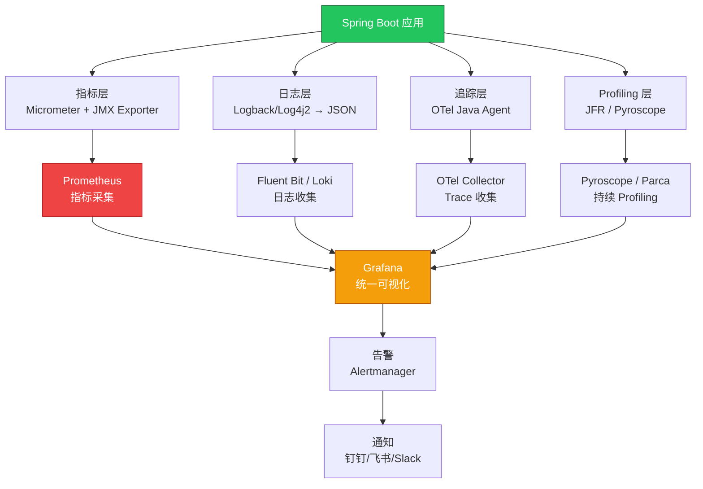

> **生产环境安全提示**
>
> 本文档包含可直接执行的运维命令。执行前请确认：当前目标集群与 Namespace 是否正确；是否具备足够的 RBAC 权限；是否已在非生产环境验证。命令风险等级标注：🔴 高风险（可能造成数据丢失或服务中断）、🟡 中风险（会修改集群状态，但通常可回滚）、🟢 低风险/只读（信息收集，无副作用）。


title: Java 应用 [[kubernetes|Kubernetes]] 可观测性整合指南
description: '# Java 应用 Kubernetes 可观测性整合指南'
category: observability
tags:
- k8s
- observability
- monitoring
- logging
- tracing
- prometheus
- grafana
- jaeger
- opa
- job
last_updated: 2026-05
difficulty: intermediate
reading_level: intermediate
audience:
- SRE
- 运维工程师
- 监控工程师
estimated_read_time: 5min
intent_queries:
- Java 应用 Kubernetes 可观测性整合指南 是什么
- 如何 Java 应用 Kubernetes 可观测性整合指南
- Kubernetes 8 observability 最佳实践
trigger_keywords:
- Java
- 应用
- Kubernetes
- 可观测性整合指南
- observability
cross_refs:
- type: domain
  path: ../集群基础/
  label: '相关知识域: 集群基础'
- type: domain
  path: ../工作负载/
  label: '相关知识域: 工作负载'
- type: domain
  path: ../网络/
  label: '相关知识域: 网络'
- type: domain
  path: ../平台工程/
  label: '相关知识域: 平台工程'
- type: cheatsheet
  path: ../系统基础/topic-cheat-sheet/promql.md
  label: '速查卡: promql'
authors:
- name: KUDIG Team
  role: contributor
k8s_versions:
- '1.28'
- '1.29'
- '1.30'
- '1.31'
- '1.32'
---

# Java 应用 Kubernetes 可观测性整合指南

> **适用版本**: Spring Boot 3.4+ / Micrometer 1.14+ / OpenTelemetry Java Agent 2.x / Prometheus 2.50+  
> **最后更新**: 2026-04-30  
> **难度**: 高级

---

<!-- chunk: 📋 目录 -->
## 📋 目录

- [一、Java 可观测性架构全景](#一java-可观测性架构全景)
- [二、Micrometer + Prometheus 指标体系](#二micrometer--prometheus-指标体系)
- [三、JMX Exporter JVM 深度监控](#三jmx-exporter-jvm-深度监控)
- [四、OpenTelemetry Java Agent 配置](#四opentelemetry-java-agent-配置)
- [五、日志结构化输出](#五日志结构化输出)
- [六、Grafana Dashboard 模板](#六grafana-dashboard-模板)
- [七、告警规则体系](#七告警规则体系)
- [八、分布式追踪集成](#八分布式追踪集成)
- [九、Profiling 集成](#九profiling-集成)
- [十、可观测性检查清单](#十可观测性检查清单)

---

<!-- chunk: 一、Java 可观测性架构全景 -->
## 一、Java 可观测性架构全景



---

<!-- chunk: 二、Micrometer + Prometheus 指标体系 -->
## 二、Micrometer + Prometheus 指标体系

### 2.1 Spring Boot Micrometer 配置

```yaml
# application.yml
management:
  endpoints:
    web:
      exposure:
        include: health,info,prometheus,metrics
  endpoint:
    health:
      show-details: when-authorized
      probes:
        enabled: true
  prometheus:
    metrics:
      export:
        enabled: true
  metrics:
    tags:
      application: ${spring.application.name}
      namespace: ${KUBERNETES_NAMESPACE:default}
      pod: ${HOSTNAME:unknown}
      version: ${APP_VERSION:unknown}
    distribution:
      percentiles-histogram:
        http.server.requests: true
        http.client.requests: true
        spring.data.repository.invocations: true
      slo:
        http.server.requests: 50ms,100ms,200ms,500ms,1000ms
    enable:
      jvm: true
      process: true
      system: true
      tomcat: true
      logback: true
      hikaricp: true
      spring: true
  server:
    port: 8081
```

### 2.2 自定义业务指标

```java
@Configuration
public class MetricsConfig {

    @Bean
    public MeterRegistryCustomizer<MeterRegistry> commonTags() {
        return registry -> registry.config()
            .commonTags(
                "application", registry.getClass().getName()
            );
    }
}

@Service
public class OrderService {
    private final Counter orderCounter;
    private final Timer orderTimer;
    private final Gauge orderQueueGauge;

    public OrderService(MeterRegistry registry, OrderQueue queue) {
        this.orderCounter = Counter.builder("orders.created.total")
            .description("Total orders created")
            .tag("type", "online")
            .register(registry);

        this.orderTimer = Timer.builder("orders.processing.duration")
            .description("Order processing duration")
            .publishPercentiles(0.5, 0.95, 0.99)
            .publishPercentileHistogram()
            .register(registry);

        this.orderQueueGauge = Gauge.builder("orders.queue.size", queue, OrderQueue::size)
            .description("Current order queue size")
            .register(registry);
    }

    public Order createOrder(OrderRequest request) {
        return orderTimer.record(() -> {
            Order order = doCreateOrder(request);
            orderCounter.increment();
            return order;
        });
    }
}
```

### 2.3 HikariCP 连接池指标

```yaml
# application.yml
spring:
  datasource:
    hikari:
      metrics-tracker: true
      register-mbeans: true
      pool-name: spring-app-hikari

# Micrometer 自动采集 HikariCP 指标:
# - hikaricp_connections_active
# - hikaricp_connections_idle
# - hikaricp_connections_pending
# - hikaricp_connections_max
# - hikaricp_connections_min
# - hikaricp_connections_timeout_total
# - hikaricp_connections_creation_seconds
# - hikaricp_connections_usage_seconds
```

### 2.4 K8s ServiceMonitor

```yaml
apiVersion: monitoring.coreos.com/v1
kind: ServiceMonitor
metadata:
  name: spring-app-metrics
  namespace: production
  labels:
    release: prometheus
spec:
  selector:
    matchLabels:
      app-type: spring-boot
  namespaceSelector:
    matchNames:
      - production
      - staging
  endpoints:
    - port: management
      path: /actuator/prometheus
      interval: 15s
      scrapeTimeout: 10s
      honorLabels: true
```

---

<!-- chunk: 三、JMX Exporter JVM 深度监控 -->
## 三、JMX Exporter JVM 深度监控

### 3.1 JMX Exporter Agent 部署

```yaml
apiVersion: apps/v1
kind: Deployment
metadata:
  name: spring-app
spec:
  template:
    spec:
      initContainers:
        - name: download-jmx-exporter
          image: busybox:1.36
          command:
            - sh
            - -c
            - |
              wget -q -O /agent/jmx_prometheus_javaagent.jar \
                https://repo1.maven.org/maven2/io/prometheus/jmx/jmx_prometheus_javaagent/0.20.0/jmx_prometheus_javaagent-0.20.0.jar
          volumeMounts:
            - name: jmx-agent
              mountPath: /agent
      containers:
        - name: app
          image: registry.example.com/spring-app:v1.0.0
          env:
            - name: JAVA_TOOL_OPTIONS
              value: "-javaagent:/agent/jmx_prometheus_javaagent.jar=9404:/config/jmx-config.yaml"
          ports:
            - name: http
              containerPort: 8080
            - name: management
              containerPort: 8081
            - name: jmx-metrics
              containerPort: 9404
          volumeMounts:
            - name: jmx-agent
              mountPath: /agent
            - name: jmx-config
              mountPath: /config
      volumes:
        - name: jmx-agent
          emptyDir: {}
        - name: jmx-config
          configMap:
            name: jmx-exporter-config
```

### 3.2 JMX Exporter 配置

```yaml
# jmx-exporter-config.yaml (K8s ConfigMap)
apiVersion: v1
kind: ConfigMap
metadata:
  name: jmx-exporter-config
data:
  jmx-config.yaml: |
    lowercaseOutputName: true
    lowercaseOutputLabelNames: true
    rules:
      - pattern: "java.lang<type=Memory><HeapMemoryUsage>(used|max|committed)"
        name: jvm_memory_heap_$1_bytes
        type: GAUGE
      - pattern: "java.lang<type=Memory><NonHeapMemoryUsage>(used|max|committed)"
        name: jvm_memory_nonheap_$1_bytes
        type: GAUGE
      - pattern: "java.lang<type=GarbageCollector, name=(.+)><>CollectionTime"
        name: jvm_gc_collection_seconds_sum
        type: COUNTER
        labels:
          gc: "$1"
      - pattern: "java.lang<type=GarbageCollector, name=(.+)><>CollectionCount"
        name: jvm_gc_collection_seconds_count
        type: COUNTER
        labels:
          gc: "$1"
      - pattern: "java.lang<type=Threading><>(ThreadCount|PeakThreadCount|DaemonThreadCount)"
        name: jvm_threads_$1
        type: GAUGE
      - pattern: "java.lang<type=MemoryPool, name=(.+)><Usage>used"
        name: jvm_memory_pool_used_bytes
        type: GAUGE
        labels:
          pool: "$1"
      - pattern: "java.lang<type=Runtime><>Uptime"
        name: jvm_uptime_seconds
        type: GAUGE
        value: "$1 / 1000"
      - pattern: "java.nio<type=BufferPool, name=(.+)><>(Count|MemoryUsed|TotalCapacity)"
        name: jvm_buffer_pool_$2
        type: GAUGE
        labels:
          pool: "$1"
```

---

<!-- chunk: 四、OpenTelemetry Java Agent 配置 -->
## 四、OpenTelemetry Java Agent 配置

### 4.1 OTel Agent 部署

```yaml
apiVersion: apps/v1
kind: Deployment
metadata:
  name: spring-app
spec:
  template:
    spec:
      initContainers:
        - name: download-otel-agent
          image: busybox:1.36
          command:
            - sh
            - -c
            - |
              wget -q -O /otel/opentelemetry-javaagent.jar \
                https://github.com/open-telemetry/opentelemetry-java-instrumentation/releases/download/v2.10.0/opentelemetry-javaagent.jar
          volumeMounts:
            - name: otel-agent
              mountPath: /otel
      containers:
        - name: app
          image: registry.example.com/spring-app:v1.0.0
          env:
            - name: JAVA_TOOL_OPTIONS
              value: "-javaagent:/otel/opentelemetry-javaagent.jar"
            - name: OTEL_SERVICE_NAME
              value: "spring-app"
            - name: OTEL_EXPORTER_OTLP_ENDPOINT
              value: "http://otel-collector.observability:4317"
            - name: OTEL_EXPORTER_OTLP_PROTOCOL
              value: "grpc"
            - name: OTEL_RESOURCE_ATTRIBUTES
              value: "service.namespace=production,service.version=v1.0.0"
            - name: OTEL_TRACES_SAMPLER
              value: "parentbased_traceidratio"
            - name: OTEL_TRACES_SAMPLER_ARG
              value: "0.1"
            - name: OTEL_METRICS_EXPORTER
              value: "prometheus,otlp"
            - name: OTEL_LOGS_EXPORTER
              value: "otlp"
            - name: OTEL_PROPAGATORS
              value: "tracecontext,baggage"
          volumeMounts:
            - name: otel-agent
              mountPath: /otel
      volumes:
        - name: otel-agent
          emptyDir: {}
```

### 4.2 OTel Collector 配置

```yaml
apiVersion: opentelemetry.io/v1beta1
kind: OpenTelemetryCollector
metadata:
  name: otel
  namespace: observability
spec:
  config:
    receivers:
      otlp:
        protocols:
          grpc:
            endpoint: 0.0.0.0:4317
          http:
            endpoint: 0.0.0.0:4318
    processors:
      batch:
        send_batch_size: 1024
        timeout: 5s
      memory_limiter:
        check_interval: 1s
        limit_mib: 512
      resource:
        attributes:
          - key: collector.source
            value: "k8s"
            action: upsert
    exporters:
      otlp/jaeger:
        endpoint: jaeger-collector.observability:4317
        tls:
          insecure: true
      prometheus:
        endpoint: 0.0.0.0:8889
      otlp/loki:
        endpoint: loki.observability:4317
        tls:
          insecure: true
    service:
      pipelines:
        traces:
          receivers: [otlp]
          processors: [memory_limiter, batch]
          exporters: [otlp/jaeger]
        metrics:
          receivers: [otlp]
          processors: [memory_limiter, batch]
          exporters: [prometheus]
        logs:
          receivers: [otlp]
          processors: [memory_limiter, batch]
          exporters: [otlp/loki]
```

### 4.3 OTel Operator 自动注入

```yaml
apiVersion: opentelemetry.io/v1alpha1
kind: Instrumentation
metadata:
  name: java-instrumentation
  namespace: observability
spec:
  exporter:
    endpoint: http://otel-collector.observability:4317
  propagators:
    - tracecontext
    - baggage
  sampler:
    type: parentbased_traceidratio
    argument: "0.1"
  java:
    image: ghcr.io/open-telemetry/opentelemetry-operator/autoinstrumentation-java:latest
    env:
      - name: OTEL_EXPORTER_OTLP_PROTOCOL
        value: grpc
---
# 只需添加注解即可自动注入
apiVersion: apps/v1
kind: Deployment
metadata:
  name: spring-app
  annotations:
    instrumentation.opentelemetry.io/inject-java: "observability/java-instrumentation"
spec:
  template:
    metadata:
      annotations:
        instrumentation.opentelemetry.io/inject-java: "observability/java-instrumentation"
```

---

<!-- chunk: 五、日志结构化输出 -->
## 五、日志结构化输出

### 5.1 Logback JSON 配置

```xml
<!-- logback-spring.xml -->
<configuration>
    <springProfile name="!development">
        <appender name="JSON" class="ch.qos.logback.core.ConsoleTarget">
            <encoder class="net.logstash.logback.encoder.LogstashEncoder">
                <includeContext>true</includeContext>
                <includeMdc>true</includeMdc>
                <includeStructuredArguments>true</includeStructuredArguments>
                <includeNonStructuredArguments>false</includeNonStructuredArguments>
                <includeTags>true</includeTags>
                <includeCallerData>false</includeCallerData>
                <customFields>{
                    "service.name": "${spring.application.name}",
                    "service.namespace": "${KUBERNETES_NAMESPACE:-default}",
                    "service.version": "${APP_VERSION:-unknown}"
                }</customFields>
                <fieldNames>
                    <timestamp>timestamp</timestamp>
                    <version>[ignore]</version>
                    <levelValue>[ignore]</levelValue>
                    <level>level</level>
                    <logger>logger</logger>
                    <thread>thread</thread>
                    <message>message</message>
                    <stackTrace>stack_trace</stackTrace>
                    <context>context</context>
                </fieldNames>
            </encoder>
        </appender>
        <root level="INFO">
            <appender-ref ref="JSON"/>
        </root>
    </springProfile>

    <springProfile name="development">
        <appender name="CONSOLE" class="ch.qos.logback.core.ConsoleTarget">
            <encoder>
                <pattern>%d{yyyy-MM-dd HH:mm:ss.SSS} [%thread] %-5level %logger{36} - %msg%n</pattern>
            </encoder>
        </appender>
        <root level="DEBUG">
            <appender-ref ref="CONSOLE"/>
        </root>
    </springProfile>
</configuration>
```

### 5.2 MDC Trace ID 注入

```java
@Component
public class TraceIdFilter implements Filter {
    @Override
    public void doFilter(ServletRequest request, ServletResponse response, FilterChain chain)
            throws IOException, ServletException {
        MDC.put("trace_id", getCurrentTraceId());
        MDC.put("span_id", getCurrentSpanId());
        try {
            chain.doFilter(request, response);
        } finally {
            MDC.remove("trace_id");
            MDC.remove("span_id");
        }
    }

    private String getCurrentTraceId() {
        Span currentSpan = Span.current();
        if (currentSpan.getSpanContext().isValid()) {
            return currentSpan.getSpanContext().getTraceId();
        }
        return "";
    }
}
```

### 5.3 Fluent Bit 多行日志解析

```yaml
# Fluent Bit ConfigMap - Java Stacktrace 合并
apiVersion: v1
kind: ConfigMap
metadata:
  name: fluent-bit-parser
data:
  parsers.conf: |
    [MULTILINE_PARSER]
        Name          multiline-java
        Type          regex
        Flush_Timeout 1000
        Rule      "start_state"  "/^\d{4}-\d{2}-\d{2}/"  "cont"
        Rule      "cont"         "/^\s+at\s/"             "cont"
        Rule      "cont"         "/^\s+.../"              "cont"
        Rule      "cont"         "/^\s*Caused by:/"       "cont"
        Rule      "cont"         "/^\s*\.\.\.\s+\d+ more/" "cont"
        Rule      "cont"         "/^[^\s]/"               "start_state"
```

---

<!-- chunk: 六、Grafana Dashboard 模板 -->
## 六、Grafana Dashboard 模板

### 6.1 关键指标面板

| 面板 | PromQL | 说明 |
|------|--------|------|
| **QPS** | `rate(http_server_requests_seconds_count{uri!~".*actuator.*"}[5m])` | 请求速率 |
| **P50/P95/P99 延迟** | `histogram_quantile(0.99, rate(http_server_requests_seconds_bucket[5m]))` | 延迟分布 |
| **错误率** | `rate(http_server_requests_seconds_count{status=~"5.."}[5m]) / rate(http_server_requests_seconds_count[5m])` | 5xx 比率 |
| **JVM Heap 使用** | `jvm_memory_used_bytes{area="heap"} / jvm_memory_max_bytes{area="heap"}` | 堆使用率 |
| **GC 暂停** | `rate(jvm_gc_pause_seconds_sum[5m])` | GC 暂停时间 |
| **GC 频率** | `rate(jvm_gc_pause_seconds_count[5m])` | GC 频率 |
| **活跃线程** | `jvm_threads_live_threads` | 活跃线程数 |
| **连接池使用** | `hikaricp_connections_active / hikaricp_connections_max` | 连接池使用率 |
| **CPU 使用** | `process_cpu_usage` | JVM CPU 使用率 |
| **Pod 内存** | `container_memory_working_set_bytes{container="app"}` | 容器内存 |

### 6.2 Dashboard JSON 导入

推荐导入以下 Grafana Dashboard:
- **JVM (Micrometer)**: Dashboard ID `4701`
- **Spring Boot Statistics**: Dashboard ID `12900`
- **Spring Boot 3**: Dashboard ID `19004`
- **Kubernetes Pod**: Dashboard ID `6417`

---

<!-- chunk: 七、告警规则体系 -->
## 七、告警规则体系

### 7.1 Java 应用告警规则

```yaml
apiVersion: monitoring.coreos.com/v1
kind: PrometheusRule
metadata:
  name: java-app-alerts
  namespace: production
spec:
  groups:
    - name: java.application
      rules:
        - alert: SpringBootApplicationDown
          expr: up{job=~"spring-app.*"} == 0
          for: 1m
          labels:
            severity: critical
          annotations:
            summary: "Spring Boot 应用宕机 ({{ $labels.instance }})"

        - alert: HighErrorRate
          expr: |
            sum(rate(http_server_requests_seconds_count{status=~"5.."}[5m])) by (service)
            / sum(rate(http_server_requests_seconds_count[5m])) by (service)
            > 0.05
          for: 5m
          labels:
            severity: warning
          annotations:
            summary: "错误率过高 ({{ $labels.service }})"
            description: "5xx 错误率 {{ $value | humanizePercentage }}"

        - alert: HighLatencyP99
          expr: |
            histogram_quantile(0.99,
              sum(rate(http_server_requests_seconds_bucket{uri!~".*actuator.*"}[5m])) by (le, service)
            ) > 2
          for: 5m
          labels:
            severity: warning
          annotations:
            summary: "P99 延迟过高 ({{ $labels.service }})"

        - alert: JVMHeapUsageHigh
          expr: |
            sum(jvm_memory_used_bytes{area="heap"}) by (pod)
            / sum(jvm_memory_max_bytes{area="heap"}) by (pod)
            > 0.85
          for: 10m
          labels:
            severity: warning

        - alert: JVMGCFrequentFullGC
          expr: |
            rate(jvm_gc_pause_seconds_count{action="end of major GC"}[5m]) > 0.03
          for: 5m
          labels:
            severity: warning

        - alert: HikariCPConnectionsExhausted
          expr: |
            hikaricp_connections_active / hikaricp_connections_max > 0.9
          for: 5m
          labels:
            severity: warning

        - alert: HighThreadCount
          expr: jvm_threads_live_threads > 500
          for: 10m
          labels:
            severity: warning
```

---

<!-- chunk: 八、分布式追踪集成 -->
## 八、分布式追踪集成

### 8.1 Spring Boot 3 + Micrometer Tracing

```xml
<dependency>
    <groupId>io.micrometer</groupId>
    <artifactId>micrometer-tracing-bridge-otel</artifactId>
</dependency>
<dependency>
    <groupId>io.opentelemetry</groupId>
    <artifactId>opentelemetry-exporter-otlp</artifactId>
</dependency>
```

### 8.2 RestTemplate 传播 Trace Context

```java
@Configuration
public class RestClientConfig {

    @Bean
    public RestTemplate restTemplate(RestTemplateBuilder builder) {
        return builder
            .setConnectTimeout(Duration.ofSeconds(5))
            .setReadTimeout(Duration.ofSeconds(10))
            .build();
    }
}
```

---

<!-- chunk: 九、Profiling 集成 -->
## 九、Profiling 集成

### 9.1 Pyroscope Java Agent

```yaml
env:
  - name: JAVA_TOOL_OPTIONS
    value: >-
      -javaagent:/pyroscope/pyroscope.jar
      -Dpyroscope.application.name=spring-app
      -Dpyroscope.profiler.event=itimer
      -Dpyroscope.server.address=http://pyroscope.observability:4040
      -Dpyroscope.format=jfr
```

### 9.2 JFR 持续录制

> ⚠️ **🟡 中危变更** — 变更集群资源状态，建议先 --dry-run 或 diff 确认
> - `kubectl exec`：进入容器执行命令，可能改变容器状态

``` bash
# 🟡 中风险：会修改集群/资源状态，执行前请确认目标、影响范围与授权
# 在 K8s 中启动 JFR 录制
kubectl exec deployment/spring-app -- \
  jcmd 1 JFR.start \
    name=continuous \
    settings=profile \
    maxage=1h \
    maxsize=100m

# 导出 JFR 录制
kubectl exec deployment/spring-app -- \
  jcmd 1 JFR.dump \
    name=continuous \
    filename=/tmp/recording.jfr

# 下载到本地分析
kubectl cp deployment/spring-app:/tmp/recording.jfr ./recording.jfr
```
---

<!-- chunk: 十、可观测性检查清单 -->
## 十、可观测性检查清单

| 层级 | 检查项 | 配置 | 优先级 |
|------|--------|------|--------|
| **指标** | Prometheus 端点暴露 | `/actuator/prometheus` | P0 |
| **指标** | JVM 指标采集 | Micrometer + JMX Exporter | P0 |
| **指标** | 业务指标注册 | `Counter/Timer/Gauge` | P1 |
| **指标** | 连接池指标 | HikariCP metrics | P1 |
| **日志** | JSON 格式输出 | `LogstashEncoder` | P0 |
| **日志** | Trace ID 关联 | MDC + OTel Bridge | P1 |
| **日志** | 多行日志合并 | Fluent Bit multiline parser | P1 |
| **追踪** | OTel Agent 注入 | Init Container / OTel Operator | P1 |
| **追踪** | Trace 上下文传播 | `tracecontext,baggage` | P1 |
| **仪表盘** | JVM Dashboard | Grafana 4701 | P1 |
| **仪表盘** | Spring Boot Dashboard | Grafana 19004 | P1 |
| **告警** | 错误率告警 | `> 5%` for 5m | P0 |
| **告警** | GC 频繁告警 | Full GC > 3/min | P0 |
| **告警** | 堆内存告警 | `> 85%` for 10m | P1 |
| **Profiling** | 持续 Profiling | Pyroscope / JFR | P2 |

---

<!-- chunk: 🔗 相关文档 -->
## 🔗 相关文档

- [Spring Boot on K8s](../../02-工作负载/01-核心工作负载/25-spring-boot-kubernetes-guide.md) — Spring Boot 部署
- [JVM GC 容器调优](../../19-故障诊断/05-JVM调优/03-jvm-gc-container-tuning-guide.md) — GC 监控与调优
- [分布式追踪指南](../04-链路追踪/08-distributed-tracing-guide.md) — OTel 深度实践
- [Prometheus 企业监控](../02-指标/13-prometheus-enterprise-guide.md) — Prometheus 配置
- [性能 Profiling 工具](../07-工具/07-performance-profiling-tools.md) — Profiling 工具链

---

<!-- chunk: Obsidian 相关文档 -->
## Obsidian 相关文档

- 可观测性 MOC
- [[09-可观测性/README.md|Observability Domain (可观测性领域)]]
- [[09-可观测性/01-总览/00-open-source-projects-index.md|Domain-8 可观测性 — 开源项目索引]]
- Kubernetes 可观测性架构体系
- 指标监控体系详解
- 03 - 日志收集架构详解 (Logging Architecture)
- 分布式追踪体系
- 05 - 告警管理策略 (Alerting Management)
- 06 - 监控告警实战与最佳实践 (Monitoring Alerting Practice)
- 04 - 监控仪表板设计与最佳实践 (Monitoring Dashboards)
- 08 - 日志审计与合规管理 (Logging Auditing & Compliance)
- 05 - 事件与审计日志管理 (Events & Audit Logs)

## Related

- 12-demo-env-guide
- 21-platform-selection-guide

- [[09-可观测性/README.md|返回目录]]- [[21-生态参考/03-领域索引/observability-index.md|Observability 可观测性知识图谱索引]]

## See Also

- 26-troubleshooting-tools
- 27-performance-profiling-tools
- 99-kubernetes-v1.33-observability-guide
- FINAL-QUALITY-ASSESSMENT


<!-- risk-assessed -->
