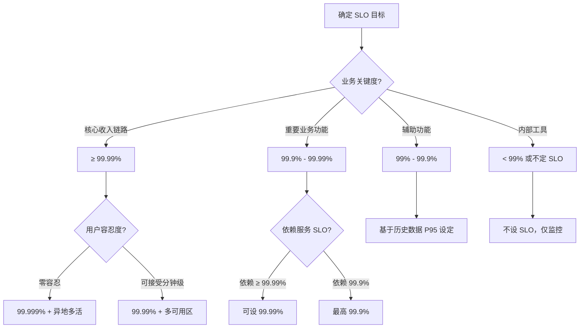

> **生产环境安全提示**
>
> 本文档包含可直接执行的运维命令。执行前请确认：当前目标集群与 Namespace 是否正确；是否具备足够的 RBAC 权限；是否已在非生产环境验证。命令风险等级标注：🔴 高风险（可能造成数据丢失或服务中断）、🟡 中风险（会修改集群状态，但通常可回滚）、🟢 低风险/只读（信息收集，无副作用）。


# SLO 设定与实施指南

> **核心原则**: SLO 不是越高越好，而是基于业务需求、用户期望和技术成本的平衡。未达成的 SLO 比没有 SLO 更糟糕。

## SLO 基础概念

### SLO vs SLA vs SLI 的关系

```
SLI (指标) ──衡量──> SLO (目标) ──承诺──> SLA (合同)
  │                    │                  │
  可用性 99.9%      目标 99.9%         赔付 < 99.9%
  延迟 P99<200ms    目标 P99<200ms     赔付 P99>200ms
```

| 概念 | 定义 | 受众 | 违约后果 |
|------|------|------|---------|
| **SLI** | 测量指标 | 工程师 | 无 |
| **SLO** | 内部目标 | 团队/部门 | 内部流程触发（如停止发布） |
| **SLA** | 对外合同 | 客户 | 经济赔偿/服务积分 |

**关键区别**: SLO 可以比 SLA 更严格，为 SLA 提供缓冲空间。

```
SLA: 99.9% 可用性（年停机 8.76 小时）
SLO: 99.95% 可用性（年停机 4.38 小时）
  → SLO 比 SLA 严格 2 倍，提供 4.38 小时缓冲
```

## 可用性等级对照表

### 9 个等级及业务含义

| 等级 | 可用性 | 年停机时间 | 月停机时间 | 适用场景 |
|------|--------|-----------|-----------|---------|
| **1 个 9** | 90% | 36.5 天 | 73 小时 | 内部测试环境 |
| **2 个 9** | 99% | 3.65 天 | 7.3 小时 | 内部工具、非关键系统 |
| **3 个 9** | 99.9% | 8.76 小时 | 43.8 分钟 | 一般业务系统 |
| **4 个 9** | 99.99% | 52.6 分钟 | 4.38 分钟 | 支付、核心交易 |
| **5 个 9** | 99.999% | 5.26 分钟 | 26.3 秒 | 金融核心、电信 |
| **6 个 9** | 99.9999% | 31.5 秒 | 2.63 秒 | 军事、航空航天 |
| **7 个 9** | 99.99999% | 3.15 秒 | 0.26 秒 | 极端关键系统 |

### 可用性成本曲线

```
可用性      成本        复杂度
99.9%  ────────────────── 基础高可用
         ↑
99.95% ────────────────── 多可用区
         ↑↑
99.99% ────────────────── 全球多活
         ↑↑↑
99.999%────────────────── 异地多活+自动故障转移
         ↑↑↑↑
99.9999%───────────────── 理论上难以实现
```

**经验法则**: 每增加一个 9，成本增加 10 倍。

## SLO 目标值设定指南

### 99.9% vs 99.99% 的架构含义

选择 SLO 目标值不仅仅是数字游戏，它直接决定了技术架构的复杂度和成本。

| 维度 | 99.9% (3个9) | 99.95% (3.5个9) | 99.99% (4个9) | 99.999% (5个9) |
|------|-------------|----------------|--------------|---------------|
| **月停机预算** | 43.8 分钟 | 21.9 分钟 | 4.38 分钟 | 26.3 秒 |
| **单点问题容忍** | 可接受短暂单点 | 需快速故障转移 | 不能有任何单点 | 全冗余+自动切换 |
| **部署策略** | 滚动更新 | 蓝绿部署 | 金丝雀+自动回滚 | 多活+流量调度 |
| **数据库要求** | 主从复制 | 半同步复制 | 同步复制/多主 | 多地域共识 |
| **监控粒度** | 分钟级 | 分钟级 | 秒级 | 毫秒级 |
| **团队响应** | 工作日响应 | 2 小时内响应 | 15 分钟响应 | 自动化处理 |
| **架构成本** | 1x 基准 | 3-5x 基准 | 10-30x 基准 | 50-100x 基准 |

### SLO 设定的决策框架



### 不同场景的 SLO 推荐值

| 服务类型 | 可用性 SLO | 延迟 SLO | 说明 |
|---------|-----------|---------|------|
| **面向用户的 Web API** | 99.9% | P99 < 500ms | 平衡用户体验与成本 |
| **内部微服务调用** | 99.95% | P99 < 200ms | 内部调用应更可靠 |
| **支付网关** | 99.99% | P99 < 200ms | 直接关联资金，零容忍 |
| **数据流水线** | 99.5% | 批次完成率 > 99% | 批处理允许一定失败 |
| **管理后台 API** | 99% | P99 < 2s | 非用户-facing，可容忍 |
| **[[kubernetes\|Kubernetes]] 控制平面** | 99.9% | P99 < 1s (apiserver) | 影响整个集群 |
| **集群 DNS** | 99.99% | P99 < 5ms | 影响所有服务发现 |
| **[[ingress\|Ingress]] 控制器** | 99.9% | P99 < 500ms | 外部流量入口 |

### 基于历史数据的 SLO 设定方法

```python
# SLO 设定分析脚本
def recommend_slo(historical_availability: list[float]) -> dict:
    """
    基于历史可用性数据推荐 SLO
    
    Args:
        historical_availability: 过去 N 个周期的可用性数据
    
    Returns:
        保守、合理、激进三档建议
    """
    import statistics
    
    mean = statistics.mean(historical_availability)
    stdev = statistics.stdev(historical_availability)
    min_val = min(historical_availability)
    p95 = sorted(historical_availability)[int(len(historical_availability) * 0.95)]
    
    return {
        "conservative": max(0.99, min_val - 0.001),  # 低于历史最差
        "reasonable": max(0.99, mean - 2 * stdev),   # 均值减 2 个标准差
        "aggressive": max(0.99, p95),                 # 优于 95% 的历史表现
        "statistics": {
            "mean": f"{mean:.4%}",
            "stdev": f"{stdev:.4%}",
            "min": f"{min_val:.4%}",
            "p95": f"{p95:.4%}"
        }
    }

# 示例：某服务过去 12 周的可用性数据
availability_history = [
    0.9992, 0.9995, 0.9991, 0.9998,
    0.9993, 0.9996, 0.9990, 0.9997,
    0.9994, 0.9999, 0.9993, 0.9996
]

recommendation = recommend_slo(availability_history)
print(f"保守建议: {recommendation['conservative']:.4%}")
print(f"合理建议: {recommendation['reasonable']:.4%}")
print(f"激进建议: {recommendation['aggressive']:.4%}")

# 输出示例:
# 保守建议: 99.8900%
# 合理建议: 99.8500%
# 激进建议: 99.9600%
```

## SLO 设定方法论

### Step 1: 识别关键用户旅程 (CUJ)

```
方法: 从用户角度描述完整的使用场景

示例: 电商平台的"下单支付"旅程
1. 用户浏览商品 → 商品服务
2. 添加购物车 → 购物车服务
3. 提交订单 → 订单服务
4. 发起支付 → 支付网关
5. 支付结果通知 → 回调服务
6. 订单状态更新 → 订单服务
7. 用户查看订单 → 订单查询服务
```

### Step 2: 识别 SLI

为每个关键步骤选择合适的 SLI（参考 [[09-可观测性/06-SLO-SLI/04-sli-definition-selection.md|01 sli definition selection]]）：

```
步骤 3: 提交订单
  SLI: 订单创建成功率
  SLI: 订单创建 P99 延迟

步骤 4: 发起支付
  SLI: 支付请求成功率
  SLI: 支付请求 P99 延迟

步骤 5: 支付结果通知
  SLI: 回调处理成功率
  SLI: 回调处理延迟
```

### Step 3: 基于历史数据设定初始 SLO

```
收集过去 30-90 天的 SLI 数据：

订单创建成功率:
  过去 30 天平均: 99.87%
  过去 30 天最低: 99.65%
  过去 30 天 P99: 99.97%

初始 SLO 建议:
  保守: 99.85%（基于历史平均）
  合理: 99.90%（略低于历史平均，留有余量）
  激进: 99.95%（需要改进才能达成）

推荐: 从 99.90% 开始，运行 1-2 个季度后调整
```

### Step 4: 验证 SLO 可行性

```
可行性检查清单:

□ 当前系统能否在不重大改造的情况下达成？
□ 依赖服务（数据库、缓存、第三方）的可用性是否支持？
□ 团队是否有能力在 SLO 告警时快速响应？
□ 错误预算是否合理（见下节）？
□ 业务方是否理解并接受对应的成本？
```

### Step 5: 获得组织共识

```
SLO 需要多方共识:

产品经理: 用户能接受多大的错误率？
  → "支付失败率超过 0.1% 会严重影响用户信任"

开发团队: 技术上能否达成？成本如何？
  → "需要增加异地多活，成本增加 300%"

运维团队: 监控和告警能否覆盖？
  → "现有监控可以覆盖，需要新增 3 个告警规则"

管理层: 投入产出比是否合理？
  → "增加 300% 成本减少 50% 支付失败，ROI 不划算"

最终决策: 保持 99.9%，聚焦优化现有架构
```

## 多层级 SLO 体系

### 服务级 SLO

针对单个微服务或组件的 SLO，是最细粒度的可靠性目标。

```yaml
# 服务级 SLO 示例: order-service
service: order-service
level: service
slos:
  - name: availability
    target: 0.999        # 99.9%
    measurement: |
      sum(rate(http_requests_total{service="order-service",status!="5.."}[5m]))
      / sum(rate(http_requests_total{service="order-service"}[5m]))
    window: 30d
    
  - name: latency
    target: 0.99         # P99 < 500ms
    measurement: |
      histogram_quantile(0.99,
        sum(rate(http_request_duration_seconds_bucket{service="order-service"}[5m])) by (le)
      )
    window: 30d
```

### 集群级 SLO

针对整个 Kubernetes 集群的基础设施 SLO，衡量控制平面和节点层面的可靠性。

```yaml
# 集群级 SLO 示例
category: cluster-infrastructure
level: cluster
slos:
  - name: control_plane_availability
    target: 0.999
    measurement: |
      sum(rate(apiserver_request_total{code!="5.."}[5m]))
      / sum(rate(apiserver_request_total[5m]))
    window: 30d
    
  - name: etcd_health
    target: 0.9999
    measurement: |
      # etcd 所有实例健康的比例
      count(etcd_server_has_leader == 1)
      / count(etcd_server_has_leader)
    window: 30d
    
  - name: node_ready_ratio
    target: 0.995
    measurement: |
      count(kube_node_status_condition{condition="Ready",status="true"} == 1)
      / count(kube_node_status_condition{condition="Ready"})
    window: 30d
```

**集群级 SLO PromQL**:
```promql
# 控制平面可用性
sum(rate(apiserver_request_total{code!="5.."}[5m]))
/
sum(rate(apiserver_request_total[5m]))

# etcd 健康检查
etcd_server_has_leader

# 节点就绪率
count(kube_node_status_condition{condition="Ready",status="true"} == 1)
/
count(kube_node_status_condition{condition="Ready"})

# Pod 调度成功率
sum(rate(scheduler_schedule_attempts_total{result="scheduled"}[5m]))
/
sum(rate(scheduler_schedule_attempts_total[5m]))
```

### 平台级 SLO

平台级 SLO 面向最终用户，跨越多个服务和集群，反映完整的用户体验。

```yaml
# 平台级 SLO 示例: 电商平台
category: platform
level: platform
slos:
  - name: order_completion_rate
    description: 用户从下单到支付完成的整体成功率
    target: 0.998
    measurement: |
      # 需要业务埋点或分布式追踪数据
      sum(rate(order_completed_total[5m]))
      / sum(rate(order_initiated_total[5m]))
    window: 30d
    
  - name: end_to_end_latency
    description: 用户请求从浏览器到完整响应的端到端延迟
    target: 0.99  # P99 < 1s
    measurement: |
      # 通常来自 APM 工具 (Jaeger/Datadog)
      trace_duration_seconds{service="frontend",span="root"}
    window: 30d
    
  - name: checkout_success_rate
    description: 结账流程成功率（含支付）
    target: 0.9995
    measurement: |
      sum(rate(checkout_completed_total[5m]))
      / sum(rate(checkout_started_total[5m]))
    window: 30d
```

### 多层级 SLO 对齐原则

```
平台级 SLO ≤ 各服务级 SLO 的串联乘积

示例:
  平台级: 订单完成率 99.8%
  
  服务级:
    - 订单服务: 99.9%
    - 支付服务: 99.95%
    - 库存服务: 99.9%
    
  理论串联可用性 = 99.9% × 99.95% × 99.9% ≈ 99.75%
  
  平台级 99.8% > 理论 99.75% → ⚠️ 不可达！
  
  解决: 要么降低平台级 SLO 到 99.7%，要么提升服务级 SLO
```

## [[prometheus|Prometheus]] Recording Rules 配置模板

### 为什么需要 Recording Rules

SLO 相关的 PromQL 查询通常涉及复杂的历史聚合（如 30 天窗口的 histogram_quantile），直接在 Grafana 或告警中执行会消耗大量资源。Recording Rules 预先计算并存储结果，大幅提升查询性能。

### 基础 Recording Rules 模板

```yaml
# recording-rules-slo.yaml
groups:
  # ==================== 记录规则: 服务级 SLO ====================
  - name: slo_service_availability
    interval: 60s
    rules:
      # 记录各服务的总请求率
      - record: slo:service_requests_total:rate5m
        expr: |
          sum(rate(http_requests_total[5m])) by (service, namespace)
        
      # 记录各服务的成功请求率
      - record: slo:service_requests_success:rate5m
        expr: |
          sum(rate(http_requests_total{status!="5.."}[5m])) by (service, namespace)
        
      # 记录各服务的错误率（直接可用的 SLI）
      - record: slo:service_error_rate:ratio5m
        expr: |
          1 - (
            slo:service_requests_success:rate5m
            / slo:service_requests_total:rate5m
          )

  - name: slo_service_latency
    interval: 60s
    rules:
      # 记录各服务 P50 延迟
      - record: slo:service_latency:p50
        expr: |
          histogram_quantile(0.50,
            sum(rate(http_request_duration_seconds_bucket[5m])) by (le, service, namespace)
          )
        
      # 记录各服务 P99 延迟
      - record: slo:service_latency:p99
        expr: |
          histogram_quantile(0.99,
            sum(rate(http_request_duration_seconds_bucket[5m])) by (le, service, namespace)
          )

  # ==================== 记录规则: 基础设施 SLO ====================
  - name: slo_infrastructure
    interval: 30s
    rules:
      # API Server 可用性
      - record: slo:apiserver_availability:ratio5m
        expr: |
          sum(rate(apiserver_request_total{code!="5.."}[5m]))
          / sum(rate(apiserver_request_total[5m]))
      
      # API Server P99 延迟
      - record: slo:apiserver_latency:p99
        expr: |
          histogram_quantile(0.99,
            sum(rate(apiserver_request_duration_seconds_bucket{verb!="WATCH"}[5m])) by (le)
          )
      
      # etcd WAL fsync P99
      - record: slo:etcd_wal_fsync:p99
        expr: |
          histogram_quantile(0.99,
            sum(rate(etcd_disk_wal_fsync_duration_seconds_bucket[5m])) by (le)
          )
      
      # 节点就绪率
      - record: slo:node_ready:ratio
        expr: |
          count(kube_node_status_condition{condition="Ready",status="true"} == 1)
          / count(kube_node_status_condition{condition="Ready"})

  # ==================== 记录规则: 错误预算 ====================
  - name: slo_error_budget
    interval: 300s
    rules:
      # 30 天窗口的错误率（用于错误预算计算）
      - record: slo:service_error_rate:ratio30d
        expr: |
          1 - (
            sum(rate(http_requests_total{status!="5.."}[30d])) by (service, namespace)
            / sum(rate(http_requests_total[30d])) by (service, namespace)
          )
      
      # 30 天窗口总请求数
      - record: slo:service_requests_total:count30d
        expr: |
          sum(increase(http_requests_total[30d])) by (service, namespace)
      
      # 错误预算消耗比例（假设 SLO 为 99.9%，即允许错误率 0.001）
      - record: slo:service_error_budget_consumed:ratio
        expr: |
          (
            slo:service_error_rate:ratio30d - 0.001
          ) / 0.001
```

### 高级 Recording Rules（多窗口多燃烧率）

```yaml
# recording-rules-burn-rate.yaml
groups:
  - name: slo_burn_rate_windows
    interval: 60s
    rules:
      # 1 小时窗口错误率
      - record: slo:service_error_rate:ratio1h
        expr: |
          1 - (
            sum(rate(http_requests_total{status!="5.."}[1h])) by (service)
            / sum(rate(http_requests_total[1h])) by (service)
          )
      
      # 6 小时窗口错误率
      - record: slo:service_error_rate:ratio6h
        expr: |
          1 - (
            sum(rate(http_requests_total{status!="5.."}[6h])) by (service)
            / sum(rate(http_requests_total[6h])) by (service)
          )
      
      # 1 天窗口错误率
      - record: slo:service_error_rate:ratio1d
        expr: |
          1 - (
            sum(rate(http_requests_total{status!="5.."}[1d])) by (service)
            / sum(rate(http_requests_total[1d])) by (service)
          )
      
      # 3 天窗口错误率
      - record: slo:service_error_rate:ratio3d
        expr: |
          1 - (
            sum(rate(http_requests_total{status!="5.."}[3d])) by (service)
            / sum(rate(http_requests_total[3d])) by (service)
          )

  - name: slo_burn_rates
    interval: 60s
    rules:
      # 1 小时燃烧率 (相对 SLO 错误率)
      - record: slo:service_burn_rate:1h
        expr: |
          slo:service_error_rate:ratio1h / 0.001
      
      # 6 小时燃烧率
      - record: slo:service_burn_rate:6h
        expr: |
          slo:service_error_rate:ratio6h / 0.001
      
      # 1 天燃烧率
      - record: slo:service_burn_rate:1d
        expr: |
          slo:service_error_rate:ratio1d / 0.001
      
      # 3 天燃烧率
      - record: slo:service_burn_rate:3d
        expr: |
          slo:service_error_rate:ratio3d / 0.001
```

### 部署 Recording Rules

> ⚠️ **🟡 中危变更** — 变更集群资源状态，建议先 --dry-run 或 diff 确认
> - `kubectl apply/create/replace`：创建/变更集群资源
> - `kubectl exec`：进入容器执行命令，可能改变容器状态

``` bash
# 🟡 中风险：会修改集群/资源状态，执行前请确认目标、影响范围与授权
# 1. 将规则文件放入 Prometheus 配置目录
kubectl create configmap prometheus-recording-rules \
  --from-file=recording-rules-slo.yaml \
  --from-file=recording-rules-burn-rate.yaml \
  -n monitoring

# 2. 在 Prometheus 配置中引用
# prometheus.yaml
rule_files:
  - /etc/prometheus/rules/recording-rules-slo.yaml
  - /etc/prometheus/rules/recording-rules-burn-rate.yaml

# 3. 热重载 Prometheus
kubectl exec -n monitoring deploy/prometheus -- kill -HUP 1
```
## SLO Dashboard Grafana JSON 模板

### Dashboard 结构概览

一个完整的 SLO Dashboard 应包含以下面板：

1. **SLO 达成率总览** — 各服务当前 SLO 状态（红/黄/绿）
2. **错误预算消耗** — 当前周期内预算消耗百分比
3. **SLI 趋势** — 30 天内 SLI 的历史趋势
4. **燃烧率** — 当前燃烧率及告警阈值
5. **多窗口对比** — 1h/6h/1d/3d/30d 窗口的错误率对比

### Grafana Dashboard JSON

```json
{
  "dashboard": {
    "title": "SLO / Error Budget Dashboard",
    "tags": ["slo", "reliability"],
    "timezone": "browser",
    "schemaVersion": 36,
    "refresh": "30s",
    "panels": [
      {
        "id": 1,
        "title": "SLO Status Overview",
        "type": "stat",
        "gridPos": {"h": 4, "w": 24, "x": 0, "y": 0},
        "targets": [
          {
            "expr": "slo:service_error_rate:ratio30d",
            "legendFormat": "{{service}} — Error Rate (30d)",
            "refId": "A"
          }
        ],
        "fieldConfig": {
          "defaults": {
            "thresholds": {
              "steps": [
                {"color": "green", "value": null},
                {"color": "yellow", "value": 0.0005},
                {"color": "red", "value": 0.001}
              ]
            },
            "unit": "percentunit"
          }
        },
        "options": {
          "colorMode": "background",
          "graphMode": "area"
        }
      },
      {
        "id": 2,
        "title": "Error Budget Consumed",
        "type": "gauge",
        "gridPos": {"h": 6, "w": 8, "x": 0, "y": 4},
        "targets": [
          {
            "expr": "clamp_min(slo:service_error_budget_consumed:ratio, 0)",
            "legendFormat": "{{service}}",
            "refId": "A"
          }
        ],
        "fieldConfig": {
          "defaults": {
            "min": 0,
            "max": 1.5,
            "thresholds": {
              "mode": "absolute",
              "steps": [
                {"color": "green", "value": null},
                {"color": "yellow", "value": 0.5},
                {"color": "orange", "value": 0.75},
                {"color": "red", "value": 1.0}
              ]
            },
            "unit": "percentunit"
          }
        }
      },
      {
        "id": 3,
        "title": "Burn Rate (Current)",
        "type": "stat",
        "gridPos": {"h": 6, "w": 8, "x": 8, "y": 4},
        "targets": [
          {
            "expr": "slo:service_burn_rate:1h",
            "legendFormat": "{{service}} — 1h",
            "refId": "A"
          },
          {
            "expr": "slo:service_burn_rate:6h",
            "legendFormat": "{{service}} — 6h",
            "refId": "B"
          }
        ],
        "fieldConfig": {
          "defaults": {
            "thresholds": {
              "steps": [
                {"color": "green", "value": null},
                {"color": "yellow", "value": 2},
                {"color": "orange", "value": 6},
                {"color": "red", "value": 14.4}
              ]
            }
          }
        }
      },
      {
        "id": 4,
        "title": "Time to Exhaust Budget",
        "type": "stat",
        "gridPos": {"h": 6, "w": 8, "x": 16, "y": 4},
        "targets": [
          {
            "expr": "(1 - clamp_max(slo:service_error_budget_consumed:ratio, 1)) * 30 * 24 / slo:service_burn_rate:1d",
            "legendFormat": "{{service}}",
            "refId": "A"
          }
        ],
        "fieldConfig": {
          "defaults": {
            "unit": "h",
            "thresholds": {
              "steps": [
                {"color": "red", "value": null},
                {"color": "orange", "value": 24},
                {"color": "yellow", "value": 72},
                {"color": "green", "value": 168}
              ]
            }
          }
        }
      },
      {
        "id": 5,
        "title": "Error Rate — Multi-Window",
        "type": "timeseries",
        "gridPos": {"h": 8, "w": 24, "x": 0, "y": 10},
        "targets": [
          {
            "expr": "slo:service_error_rate:ratio1h",
            "legendFormat": "1h — {{service}}",
            "refId": "A"
          },
          {
            "expr": "slo:service_error_rate:ratio6h",
            "legendFormat": "6h — {{service}}",
            "refId": "B"
          },
          {
            "expr": "slo:service_error_rate:ratio1d",
            "legendFormat": "1d — {{service}}",
            "refId": "C"
          },
          {
            "expr": "slo:service_error_rate:ratio30d",
            "legendFormat": "30d — {{service}}",
            "refId": "D"
          }
        ],
        "fieldConfig": {
          "defaults": {
            "custom": {"drawStyle": "line", "lineWidth": 2},
            "unit": "percentunit"
          }
        }
      },
      {
        "id": 6,
        "title": "Latency P99 Trend (30d)",
        "type": "timeseries",
        "gridPos": {"h": 8, "w": 12, "x": 0, "y": 18},
        "targets": [
          {
            "expr": "slo:service_latency:p99",
            "legendFormat": "{{service}}",
            "refId": "A"
          }
        ],
        "fieldConfig": {
          "defaults": {
            "unit": "s",
            "thresholds": {
              "steps": [
                {"color": "green", "value": null},
                {"color": "yellow", "value": 0.5},
                {"color": "red", "value": 1.0}
              ]
            }
          }
        }
      },
      {
        "id": 7,
        "title": "Request Rate",
        "type": "timeseries",
        "gridPos": {"h": 8, "w": 12, "x": 12, "y": 18},
        "targets": [
          {
            "expr": "slo:service_requests_total:rate5m",
            "legendFormat": "{{service}}",
            "refId": "A"
          }
        ],
        "fieldConfig": {
          "defaults": {"unit": "reqps"}
        }
      }
    ],
    "templating": {
      "list": [
        {
          "name": "service",
          "type": "query",
          "query": "label_values(http_requests_total, service)",
          "multi": true,
          "includeAll": true
        },
        {
          "name": "namespace",
          "type": "query",
          "query": "label_values(http_requests_total, namespace)",
          "multi": true,
          "includeAll": true
        }
      ]
    }
  }
}
```

## SLO 实施路径

### 阶段 1: 测量（Month 1-2）

```
目标: 建立 SLI 测量能力，不设定 SLO

任务:
1. 部署/配置监控（Prometheus、Grafana）
2. 为关键服务配置 SLI 指标
3. 建立 SLI 数据看板
4. 收集至少 30 天历史数据

输出:
- SLI 测量看板
- 历史数据基线报告
```

### 阶段 2: 设定（Month 2-3）

```
目标: 基于历史数据设定初始 SLO

任务:
1. 分析历史数据分布
2. 与相关团队讨论并设定 SLO
3. 文档化 SLO 定义
4. 建立错误预算计算

输出:
- SLO 文档
- 错误预算看板
```

### 阶段 3: 执行（Month 3-6）

```
目标: 按 SLO 管理发布和运维

任务:
1. 建立 SLO 告警规则
2. 将 SLO 纳入发布评审
3. 定期（每周）审查 SLO 达成情况
4. 错误预算耗尽时触发发布冻结

输出:
- SLO 告警规则
- SLO 周报
- 发布冻结机制
```

### 阶段 4: 优化（Month 6+）

```
目标: 持续优化 SLO 体系

任务:
1. 根据实际达成情况调整 SLO
2. 优化告警阈值和 Burn Rate
3. 扩展 SLO 覆盖范围
4. 将 SLO 纳入团队绩效考核

输出:
- 优化后的 SLO
- 扩展的 SLO 覆盖
```

## SLO 文档模板

```yaml
# SLO 定义文档模板
slo_id: ORDER-SVC-001
service: order-service
cuj: 用户提交订单
version: 1.0
created: 2026-05-21
owner: order-team@sre.example.com

slis:
  - name: order_creation_success_rate
    description: 订单创建成功率
    measurement: |
      sum(rate(order_created_total{status="success"}[5m])) /
      sum(rate(order_created_total[5m]))
    slo_target: 0.999
    window: 30d
    
  - name: order_creation_latency
    description: 订单创建 P99 延迟
    measurement: |
      histogram_quantile(0.99,
        sum(rate(order_creation_duration_seconds_bucket[5m])) by (le)
      )
    slo_target: 0.5  # 500ms
    window: 30d

error_budget:
  calculation: (1 - SLO) × 总请求数
  budget_30d: 0.1% of total requests
  burn_rate_alerts:
    - rate: 2x   # 将在 15 天内耗尽预算
      severity: warning
    - rate: 14.4x # 将在 2 天内耗尽预算
      severity: critical

escalation:
  budget_remaining_50%: 团队负责人通知
  budget_remaining_25%: 发布冻结，技术负责人介入
  budget_remaining_0%:  紧急复盘，VP 级别通报
```

## 常见 SLO 设定错误

### 错误 1: SLO 过高

```
问题: 设定 99.999% 可用性，但团队无能力达成
后果:
  - 持续告警疲劳
  - 团队士气下降
  - 错误预算永远为负，失去管理意义

解决: 从可达到的水平开始，逐步提升
```

### 错误 2: SLO 过低

```
问题: 设定 99% 可用性，实际系统已达 99.9%
后果:
  - 错误预算永远花不完
  - 失去改进动力
  - 用户实际体验远超 SLO 承诺

解决: SLO 应略低于当前能力，提供改进空间
```

### 错误 3: SLO 过多

```
问题: 为每个 API 端点设定 SLO
后果:
  - 管理复杂度爆炸
  - 无法聚焦关键问题

解决: 只为关键用户旅程设定 SLO（建议每个服务 2-5 个）
```

### 错误 4: 忽略依赖

```
问题: 订单服务 SLO 99.99%，但数据库 SLO 只有 99.9%
后果:
  - 订单服务 SLO 理论上无法达成
  - 错误预算被依赖服务消耗

解决: 确保依赖服务的 SLO 优于或等于上层服务
```

## 相关

- [[09-可观测性/06-SLO-SLI/04-sli-definition-selection.md|01 sli definition selection]] — SLI 定义与选择方法论
- [[09-可观测性/06-SLO-SLI/06-error-budget-management.md|03 error budget management]] — 错误预算管理
- [[09-可观测性/06-SLO-SLI/08-slo-sli-system.md|18 slo sli system]] — SLO/SLI 体系概述


<!-- risk-assessed -->
