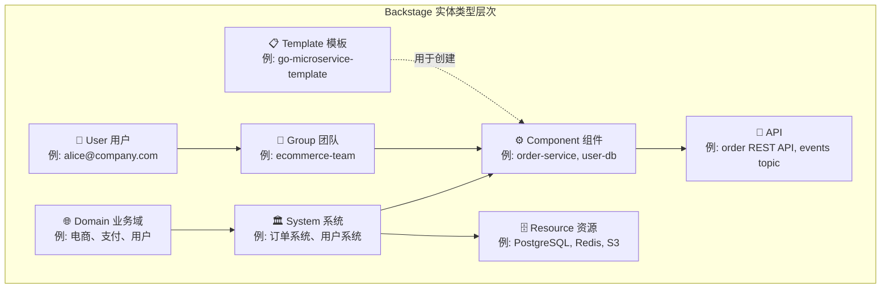
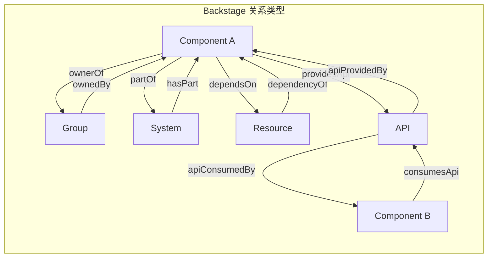
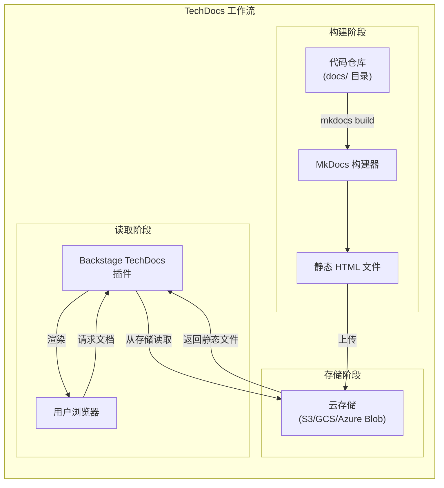
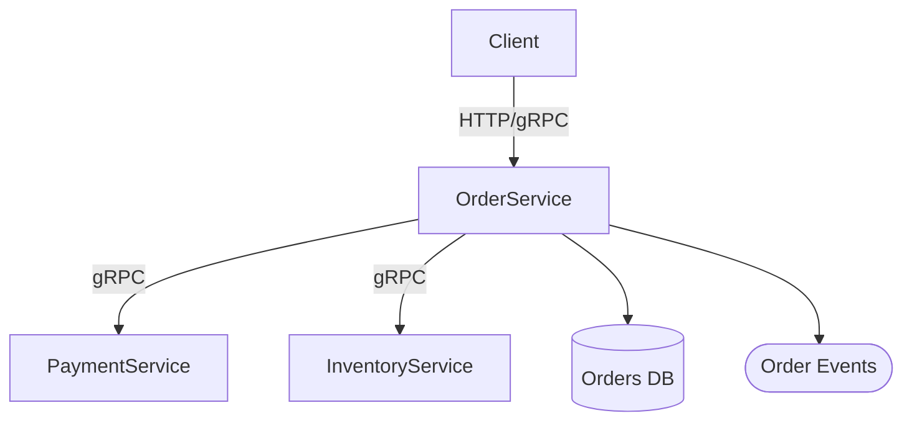

> **生产环境安全提示**
>
> 本文档包含可直接执行的运维命令。执行前请确认：当前目标集群与 Namespace 是否正确；是否具备足够的 RBAC 权限；是否已在非生产环境验证。命令风险等级标注：🔴 高风险（可能造成数据丢失或服务中断）、🟡 中风险（会修改集群状态，但通常可回滚）、🟢 低风险/只读（信息收集，无副作用）。


title: [[Backstage|Backstage]] 软件目录与 TechDocs
description: 2. [catalog-info.yaml 完整指南](#2-catalog-infoyaml-完整指南)
category: platform-engineering
tags:
- k8s
- platform-engineering
- developer-experience
- idp
- scheduler
- [[Prometheus|prometheus]]
- grafana
- [[ArgoCD|argocd]]
- docker
- harbor
last_updated: 2026-05
difficulty: advanced
reading_level: advanced
audience:
- 平台工程师
- SRE
- 架构师
estimated_read_time: 5min
intent_queries:
- Backstage 软件目录与 TechDocs 是什么
- 如何 Backstage 软件目录与 TechDocs
- Kubernetes 36 platform engineering 最佳实践
trigger_keywords:
- Backstage
- 软件目录与
- TechDocs
- platform
- engineering
authors:
- name: KUDIG Team
  role: contributor
k8s_versions:
- '1.28'
- '1.29'
- '1.30'
- '1.31'
- '1.32'
---

# Backstage 软件目录与 TechDocs
# Backstage Software Catalog and TechDocs

> **领域**: 平台工程 | Platform Engineering  
> **难度**: 中级 | Intermediate  
> **阅读时间**: 约 65 分钟 | ~65 min read  
> **最后更新**: 2026-03-04

---

<!-- chunk: 目录 | Table of Contents -->## 目录 | Table of Contents

1. [软件目录核心概念](#1-软件目录核心概念)
2. [catalog-info.yaml 完整指南](#2-catalog-infoyaml-完整指南)
3. [实体类型详解](#3-实体类型详解)
4. [实体关系与系统建模](#4-实体关系与系统建模)
5. [目录发现机制](#5-目录发现机制)
6. [自定义目录处理器](#6-自定义目录处理器)
7. [TechDocs 架构与配置](#7-techdocs-架构与配置)
8. [MkDocs 文档编写指南](#8-mkdocs-文档编写指南)
9. [TechDocs CI/CD 集成](#9-techdocs-cicd-集成)
10. [API 文档集成](#10-api-文档集成)
11. [高级目录功能](#11-高级目录功能)
12. [目录数据质量管理](#12-目录数据质量管理)

---

<!-- chunk: 1. 软件目录核心概念 -->## 1. 软件目录核心概念

## 1.1 为什么需要软件目录？

在大型工程组织中，软件资产的管理面临巨大挑战：

```
没有软件目录时的困境

问题 1: 服务发现困难
  "这个报错来自哪个服务？谁是负责人？"
  答: 不知道，需要问遍 5 个团队

问题 2: 文档碎片化
  "这个 API 的文档在哪里？"
  答: 可能在 Confluence、可能在 README、可能没有

问题 3: 依赖关系不透明
  "升级 payment-service 会影响哪些下游服务？"
  答: 没人知道完整的依赖链

问题 4: 技术债务不可见
  "我们有多少服务还在用 Python 2？"
  答: 无法统计，只能人工摸排

有了软件目录之后:
  ✅ 所有服务一处可见，元数据标准化
  ✅ 文档与代码同存储，始终最新
  ✅ 依赖关系图谱可视化
  ✅ 技术统计一键报告
```

## 1.2 Backstage 软件目录模型



## 1.3 实体命名规范

```
实体引用格式 (Entity Reference)

格式: {kind}:{namespace}/{name}

示例:
  component:default/order-service
  api:default/order-api
  group:default/ecommerce-team
  user:default/alice
  system:default/order-system
  domain:default/ecommerce

简写规则（在同一命名空间内可省略 namespace）:
  component:order-service  ← 等同于 component:default/order-service
```

---

<!-- chunk: 2. catalog-info.yaml 完整指南 -->## 2. catalog-info.yaml 完整指南

## 2.1 基础结构

```yaml
# catalog-info.yaml 基础结构

apiVersion: backstage.io/v1alpha1  # 或 v1beta1
kind: Component                    # 实体类型
metadata:
  name: my-service                 # 服务名称（必须全小写，连字符分隔）
  namespace: default               # 命名空间（通常使用默认）
  
  # 标题（可读性更好）
  title: "My Service - 我的服务"
  
  # 描述
  description: |
    这是一个示例服务，提供 REST API 供前端调用。
    支持用户认证和订单管理功能。
  
  # 标签（用于过滤和搜索）
  labels:
    team: ecommerce
    environment: production
    tier: tier-1
    language: go
    framework: gin
  
  # 注解（键值对，用于工具集成）
  annotations:
    # TechDocs 指向文档路径
    backstage.io/techdocs-ref: dir:.
    
    # GitHub 链接
    github.com/project-slug: company/my-service
    
    # CI/CD 状态 (GitHub Actions)
    github.com/team-slug: company/ecommerce-team
    
    # SonarQube 代码质量
    sonarqube.org/project-key: company_my-service
    
    # PagerDuty Oncall
    pagerduty.com/service-id: "P1234567"
    
    # Jira 项目
    jira/project-key: ECO
    
    # Datadog 服务监控
    datadoghq.com/service-name: my-service
    
    # 自定义注解
    platform.company.com/oncall-slack: "#ecommerce-oncall"
    platform.company.com/sla-tier: "tier-1"
    platform.company.com/cost-center: "CC-12345"
    platform.company.com/runbook: "https://wiki.company.com/ecommerce/runbook"
  
  # 链接（显示在 UI 侧边栏）
  links:
    - url: https://dashboard.company.com/ecommerce/my-service
      title: 监控仪表板
      icon: dashboard
    - url: https://logs.company.com/ecommerce/my-service
      title: 日志查询
      icon: search
    - url: https://github.com/company/my-service
      title: GitHub 代码仓库
      icon: github
    - url: https://my-service.staging.company.com
      title: Staging 环境
      icon: web

spec:
  # 组件类型
  type: service  # service | website | library | database | 自定义类型
  
  # 生命周期阶段
  lifecycle: production  # experimental | production | deprecated
  
  # 所有者（团队或用户）
  owner: group:default/ecommerce-team
  
  # 所属系统
  system: system:default/order-system
  
  # 子组件关系
  subcomponentOf: component:default/order-platform
  
  # 提供的 API
  providesApis:
    - api:default/order-rest-api
    - api:default/order-grpc-api
  
  # 消费的 API
  consumesApis:
    - api:default/payment-api
    - api:default/user-api
    - api:default/notification-api
  
  # 依赖的其他资源
  dependsOn:
    - component:default/order-service
    - resource:default/orders-postgres-db
    - resource:default/orders-redis-cache
    - resource:default/order-events-topic
```

## 2.2 高级注解详解

```yaml
# 常用注解完整参考

metadata:
  annotations:
    ###################################
    # Backstage 内置注解
    ###################################
    
    # TechDocs 文档路径
    backstage.io/techdocs-ref: dir:.  # 当前目录
    # backstage.io/techdocs-ref: url:https://github.com/org/repo/tree/main/docs
    
    # 禁用 TechDocs
    # backstage.io/techdocs-ref: none
    
    # 实体 Source URL（目录显示"在 GitHub 中查看"链接）
    backstage.io/source-location: url:https://github.com/company/my-service
    
    # 人工标记为孤立实体
    backstage.io/orphan: "true"
    
    ###################################
    # CI/CD 集成注解
    ###################################
    
    # GitHub Actions (backstage-plugin-github-actions)
    github.com/project-slug: org/repo
    
    # Jenkins (backstage-plugin-jenkins)
    jenkins.io/job-full-name: "ecommerce/my-service"
    jenkins.io/github-folder: "ecommerce"
    
    # Argo CD (backstage-plugin-argocd)
    argocd/app-name: my-service-prod
    argocd/app-selector: "app.kubernetes.io/name=my-service"
    
    # Tekton (backstage-plugin-tekton)
    tekton.dev/pipelines: "my-service-pipeline"
    
    ###################################
    # 监控集成注解
    ###################################
    
    # Grafana (backstage-plugin-grafana)
    grafana/dashboard-selector: "folderTitle == 'ecommerce'"
    grafana/alert-label-selector: "service=my-service"
    
    # Datadog (backstage-plugin-datadog)
    datadoghq.com/service-name: "my-service"
    datadoghq.com/service-statsd-port: "9125"
    
    # Prometheus (通过自定义插件)
    prometheus.io/alert: "my_service_.*"
    
    ###################################
    # 问题跟踪集成
    ###################################
    
    # Jira (backstage-plugin-jira)
    jira/project-key: "ECO"
    jira/component: "my-service"
    
    # GitHub Issues
    github.com/project-slug: company/my-service
    
    ###################################
    # 代码质量集成
    ###################################
    
    # SonarQube (backstage-plugin-sonarqube)
    sonarqube.org/project-key: "company_my-service"
    
    # CodeClimate
    codeclimate.com/project-slug: "company/my-service"
    
    ###################################
    # 文档与知识管理
    ###################################
    
    # Confluence (自定义插件)
    confluence.io/space-key: "ECO"
    confluence.io/page-id: "123456"
    
    ###################################
    # 运维与告警
    ###################################
    
    # PagerDuty (backstage-plugin-pagerduty)
    pagerduty.com/service-id: "P1234567"
    pagerduty.com/integration-key: "abc123"
    
    # OpsGenie
    opsgenie.com/component-selector: "name=my-service"
    
    ###################################
    # 安全扫描
    ###################################
    
    # Snyk (backstage-plugin-snyk)
    snyk.io/project-ids: "abc123,def456"
    
    # 镜像漏洞扫描结果
    harbor.io/vulnerability-report: "https://harbor.company.com/harbor/projects/1/repositories/my-service/artifacts"
```

---

<!-- chunk: 3. 实体类型详解 -->## 3. 实体类型详解

## 3.1 Component（组件）

```yaml
# Component - 最常见的实体类型

# 微服务 (backend service)
apiVersion: backstage.io/v1alpha1
kind: Component
metadata:
  name: order-service
  title: "订单服务"
  description: "核心订单处理微服务，提供订单创建、查询、状态追踪功能"
  tags:
    - go
    - grpc
    - tier-1
  annotations:
    backstage.io/techdocs-ref: dir:.
    github.com/project-slug: company/order-service
    pagerduty.com/service-id: "P1234567"
    argocd/app-name: "order-service-prod"
spec:
  type: service
  lifecycle: production
  owner: group:default/ecommerce-team
  system: system:default/order-system
  providesApis:
    - api:default/order-grpc-api
    - api:default/order-rest-api
  consumesApis:
    - api:default/payment-grpc-api
    - api:default/inventory-rest-api
  dependsOn:
    - resource:default/orders-db
    - resource:default/order-events-kafka-topic

---
# 前端网站
apiVersion: backstage.io/v1alpha1
kind: Component
metadata:
  name: ecommerce-frontend
  title: "电商前端应用"
  description: "React SPA 电商购物网站"
  tags:
    - react
    - typescript
    - frontend
spec:
  type: website
  lifecycle: production
  owner: group:default/frontend-team
  system: system:default/ecommerce-system
  consumesApis:
    - api:default/order-rest-api
    - api:default/product-rest-api
    - api:default/user-rest-api

---
# 共享库
apiVersion: backstage.io/v1alpha1
kind: Component
metadata:
  name: platform-go-utils
  title: "平台 Go 工具库"
  description: "包含通用 HTTP 中间件、日志工具、配置加载等"
  tags:
    - go
    - library
    - internal
spec:
  type: library
  lifecycle: production
  owner: group:default/platform-team

---
# 数据管道
apiVersion: backstage.io/v1alpha1
kind: Component
metadata:
  name: order-analytics-pipeline
  title: "订单分析数据管道"
  description: "从 Kafka 消费订单事件，聚合分析后写入数据仓库"
  tags:
    - python
    - kafka
    - data-pipeline
spec:
  type: data-pipeline
  lifecycle: production
  owner: group:default/data-team
  system: system:default/analytics-system
  consumesApis:
    - api:default/order-events-kafka-topic
  dependsOn:
    - resource:default/analytics-warehouse
```

## 3.2 API（API 接口）

```yaml
# API 类型实体

# REST API
apiVersion: backstage.io/v1alpha1
kind: API
metadata:
  name: order-rest-api
  title: "订单 REST API"
  description: "订单管理 REST API，支持创建、查询、更新订单状态"
  tags:
    - rest
    - openapi
    - tier-1
  annotations:
    backstage.io/techdocs-ref: dir:docs/api
spec:
  type: openapi
  lifecycle: production
  owner: group:default/ecommerce-team
  system: system:default/order-system
  
  # API 定义（内联或引用）
  definition:
    $text: |
      openapi: "3.0.3"
      info:
        title: Order Service API
        version: "2.0.0"
        description: 订单管理 REST API
      servers:
        - url: https://api.company.com/v2
      paths:
        /orders:
          get:
            summary: 列出订单
            tags: [Orders]
            parameters:
              - name: page
                in: query
                schema:
                  type: integer
              - name: limit
                in: query
                schema:
                  type: integer
                  default: 20
            responses:
              "200":
                description: 成功
                content:
                  application/json:
                    schema:
                      type: object
                      properties:
                        data:
                          type: array
                          items:
                            $ref: "#/components/schemas/Order"
                        pagination:
                          $ref: "#/components/schemas/Pagination"
          post:
            summary: 创建订单
            tags: [Orders]
            requestBody:
              required: true
              content:
                application/json:
                  schema:
                    $ref: "#/components/schemas/CreateOrderRequest"
            responses:
              "201":
                description: 创建成功
      components:
        schemas:
          Order:
            type: object
            properties:
              id:
                type: string
                format: uuid
              status:
                type: string
                enum: [pending, confirmed, shipped, delivered, cancelled]
              customerId:
                type: string
              totalAmount:
                type: number
                format: decimal
              createdAt:
                type: string
                format: date-time

---
# gRPC API
apiVersion: backstage.io/v1alpha1
kind: API
metadata:
  name: order-grpc-api
  title: "订单 gRPC API"
  description: "订单服务内部 gRPC API，用于服务间通信"
  tags:
    - grpc
    - protobuf
spec:
  type: grpc
  lifecycle: production
  owner: group:default/ecommerce-team
  system: system:default/order-system
  
  definition:
    $text: |
      syntax = "proto3";
      package order.v2;
      
      service OrderService {
        rpc CreateOrder(CreateOrderRequest) returns (Order);
        rpc GetOrder(GetOrderRequest) returns (Order);
        rpc ListOrders(ListOrdersRequest) returns (ListOrdersResponse);
        rpc UpdateOrderStatus(UpdateOrderStatusRequest) returns (Order);
      }
      
      message Order {
        string id = 1;
        string customer_id = 2;
        string status = 3;
        double total_amount = 4;
        repeated OrderItem items = 5;
        google.protobuf.Timestamp created_at = 6;
      }
      
      message CreateOrderRequest {
        string customer_id = 1;
        repeated OrderItem items = 2;
        string shipping_address = 3;
      }

---
# 消息队列 API (AsyncAPI)
apiVersion: backstage.io/v1alpha1
kind: API
metadata:
  name: order-events-kafka-topic
  title: "订单事件 Kafka Topic"
  description: "订单生命周期事件流，下游系统可以订阅"
  tags:
    - kafka
    - async
    - events
spec:
  type: asyncapi
  lifecycle: production
  owner: group:default/ecommerce-team
  system: system:default/order-system
  
  definition:
    $text: |
      asyncapi: 2.6.0
      info:
        title: Order Events
        version: 1.0.0
        description: 订单生命周期事件
      
      channels:
        orders.v2.created:
          description: 新订单创建事件
          publish:
            message:
              payload:
                type: object
                properties:
                  orderId:
                    type: string
                  customerId:
                    type: string
                  totalAmount:
                    type: number
                  createdAt:
                    type: string
                    format: date-time
        
        orders.v2.status_changed:
          description: 订单状态变更事件
          publish:
            message:
              payload:
                type: object
                properties:
                  orderId:
                    type: string
                  previousStatus:
                    type: string
                  newStatus:
                    type: string
                  changedAt:
                    type: string
                    format: date-time
```

## 3.3 Resource（资源）

```yaml
# Resource 类型实体 - 基础设施资源

# PostgreSQL 数据库
apiVersion: backstage.io/v1alpha1
kind: Resource
metadata:
  name: orders-db
  title: "订单 PostgreSQL 数据库"
  description: "存储所有订单数据的主数据库，运行在 RDS PostgreSQL 15"
  tags:
    - postgres
    - rds
    - aws
    - tier-1
  annotations:
    platform.company.com/db-host: "orders-db.cluster-abc123.us-east-1.rds.amazonaws.com"
    platform.company.com/db-region: "us-east-1"
    platform.company.com/db-type: "PostgreSQL 15"
    platform.company.com/db-size: "db.r6g.large"
    platform.company.com/backup-policy: "daily"
    platform.company.com/owner-team: "ecommerce"
spec:
  type: database
  lifecycle: production
  owner: group:default/ecommerce-team
  system: system:default/order-system
  dependsOn:
    - resource:default/aws-us-east-1

---
# Kafka Topic
apiVersion: backstage.io/v1alpha1
kind: Resource
metadata:
  name: order-events-kafka-topic
  title: "Order Events Kafka Topic"
  description: "Kafka Topic: orders.v2.*，存储订单生命周期事件"
  tags:
    - kafka
    - messaging
  annotations:
    platform.company.com/kafka-bootstrap: "kafka.company.com:9092"
    platform.company.com/kafka-topic-prefix: "orders.v2"
    platform.company.com/kafka-partitions: "24"
    platform.company.com/kafka-retention: "7 days"
spec:
  type: messaging-topic
  lifecycle: production
  owner: group:default/ecommerce-team
  system: system:default/order-system

---
# S3 存储桶
apiVersion: backstage.io/v1alpha1
kind: Resource
metadata:
  name: order-attachments-s3
  title: "订单附件 S3 存储桶"
  description: "存储订单相关文档和图片"
  tags:
    - s3
    - storage
    - aws
spec:
  type: storage-bucket
  lifecycle: production
  owner: group:default/ecommerce-team
  system: system:default/order-system
```

## 3.4 System（系统）

```yaml
# System 类型 - 组件的逻辑集合

apiVersion: backstage.io/v1alpha1
kind: System
metadata:
  name: order-system
  title: "订单系统"
  description: |
    订单系统负责处理从购物车到支付完成的完整订单生命周期。
    包含订单服务、支付集成、库存扣减、物流对接等核心功能。
  tags:
    - ecommerce
    - core-system
    - tier-1
  annotations:
    platform.company.com/architecture-doc: "https://wiki.company.com/order-system/architecture"
    platform.company.com/slack-channel: "#order-system"
spec:
  owner: group:default/ecommerce-team
  domain: domain:default/ecommerce
  
  # 系统级文档
  links:
    - title: 架构文档
      url: https://wiki.company.com/order-system/architecture
      icon: catalog
    - title: 运维手册
      url: https://wiki.company.com/order-system/runbook
      icon: help
    - title: Grafana 仪表板
      url: https://grafana.company.com/d/order-system
      icon: dashboard
```

## 3.5 Domain（业务域）

```yaml
# Domain 类型 - 最高层级的业务分类

apiVersion: backstage.io/v1alpha1
kind: Domain
metadata:
  name: ecommerce
  title: "电商业务域"
  description: |
    电商核心业务领域，包含用户购物的完整体验流程：
    商品浏览、购物车、订单、支付、物流追踪。
  tags:
    - core-business
    - revenue-critical
  annotations:
    platform.company.com/domain-owner: "alice@company.com"
    platform.company.com/strategy-doc: "https://wiki.company.com/ecommerce-strategy"
spec:
  owner: group:default/ecommerce-leadership
```

## 3.6 Group（团队）与 User（用户）

```yaml
# Group 类型 - 团队定义

apiVersion: backstage.io/v1alpha1
kind: Group
metadata:
  name: ecommerce-team
  title: "电商团队"
  description: "负责电商核心业务功能开发和运维的工程团队"
  annotations:
    github.com/team-slug: company/ecommerce-team
spec:
  type: team
  profile:
    displayName: "电商工程团队"
    email: ecommerce-team@company.com
    picture: https://avatars.githubusercontent.com/...
  
  # 父级团队（组织层级）
  parent: group:default/engineering
  
  # 子团队
  children:
    - group:default/ecommerce-frontend-team
    - group:default/ecommerce-backend-team
  
  # 成员
  members:
    - user:default/alice
    - user:default/bob
    - user:default/charlie

---
# User 类型 - 用户定义（通常从 LDAP/AD 自动同步）

apiVersion: backstage.io/v1alpha1
kind: User
metadata:
  name: alice
  annotations:
    microsoft.com/email: alice@company.com
spec:
  profile:
    displayName: "Alice Chen"
    email: alice@company.com
    picture: https://avatars.company.com/alice
  
  # 所属团队（反向关联，通常自动计算）
  memberOf:
    - group:default/ecommerce-team
    - group:default/platform-champions
```

---

<!-- chunk: 4. 实体关系与系统建模 -->## 4. 实体关系与系统建模

## 4.1 关系类型



## 4.2 完整系统建模示例

```yaml
# 电商订单系统完整建模示例
# 文件结构:
# catalog/
#   domains/ecommerce.yaml
#   systems/order-system.yaml
#   groups/ecommerce-team.yaml
#   components/order-service.yaml
#   components/order-worker.yaml
#   apis/order-rest-api.yaml
#   resources/orders-db.yaml
#   resources/order-events-topic.yaml

# ==== catalog/all.yaml (入口文件) ====
apiVersion: backstage.io/v1alpha1
kind: Location
metadata:
  name: ecommerce-catalog
  description: "电商领域所有实体"
spec:
  targets:
    - ./domains/ecommerce.yaml
    - ./systems/order-system.yaml
    - ./groups/ecommerce-team.yaml
    - ./components/order-service.yaml
    - ./components/order-worker.yaml
    - ./apis/order-rest-api.yaml
    - ./resources/orders-db.yaml
    - ./resources/order-events-topic.yaml

---
# ==== catalog/systems/order-system.yaml ====
apiVersion: backstage.io/v1alpha1
kind: System
metadata:
  name: order-system
  title: "订单系统"
spec:
  owner: group:default/ecommerce-team
  domain: domain:default/ecommerce
  
---
# ==== catalog/components/order-service.yaml ====
apiVersion: backstage.io/v1alpha1
kind: Component
metadata:
  name: order-service
  title: "订单服务"
  annotations:
    backstage.io/techdocs-ref: dir:.
spec:
  type: service
  lifecycle: production
  owner: group:default/ecommerce-team
  system: system:default/order-system
  providesApis:
    - api:default/order-rest-api
  consumesApis:
    - api:default/payment-api
    - api:default/inventory-api
  dependsOn:
    - resource:default/orders-db
    - resource:default/order-events-topic
```

## 4.3 依赖关系图可视化

```typescript
// packages/app/src/components/catalog/EntityPage.tsx
// 配置依赖关系图

import { EntityCatalogGraphCard } from '@backstage/plugin-catalog-graph';

// 在服务详情页添加依赖关系图
const dependenciesContent = (
  <Grid container spacing={3}>
    <Grid item xs={12}>
      <EntityCatalogGraphCard
        variant="gridItem"
        height={400}
        // 关系过滤配置
        relations={[
          'dependsOn',
          'dependencyOf',
          'consumesApi',
          'providesApi',
          'partOf',
          'hasPart',
        ]}
        // 只显示直接关联（深度为 1）
        maxDepth={2}
        // 显示的实体类型
        kinds={['Component', 'API', 'Resource', 'System']}
        // 节点点击跳转到实体页面
        unidirectional={false}
      />
    </Grid>
    <Grid item xs={12} md={6}>
      <EntityDependsOnComponentsCard variant="gridItem" />
    </Grid>
    <Grid item xs={12} md={6}>
      <EntityDependsOnResourcesCard variant="gridItem" />
    </Grid>
    <Grid item xs={12} md={6}>
      <EntityProvidedApisCard />
    </Grid>
    <Grid item xs={12} md={6}>
      <EntityConsumedApisCard />
    </Grid>
  </Grid>
);
```

---

<!-- chunk: 5. 目录发现机制 -->## 5. 目录发现机制

## 5.1 GitHub 自动发现

```yaml
# app-config.yaml - GitHub 自动发现配置

catalog:
  providers:
    github:
      # 发现组织内所有仓库的 catalog-info.yaml
      all-repos:
        organization: 'company'
        catalogPath: '/catalog-info.yaml'
        filters:
          branch: 'main'
          repository: '.*'  # 匹配所有仓库
        schedule:
          frequency: { minutes: 30 }
          timeout: { minutes: 5 }
      
      # 发现特定 Topic 的仓库
      backstage-enabled:
        organization: 'company'
        catalogPath: '/catalog-info.yaml'
        filters:
          branch: 'main'
          topic:
            include: ['backstage-enabled']  # 只包含有此 Topic 的仓库
            exclude: ['archived']
        schedule:
          frequency: { minutes: 15 }
      
      # 发现 Monorepo 中的多个服务
      monorepo:
        organization: 'company'
        catalogPath: '/services/*/catalog-info.yaml'  # 通配符路径
        filters:
          branch: 'main'
          repository: 'monorepo'

  # GitHub 企业版配置
  github-enterprise:
    host: github.company.com
    organization: 'internal-company'
    catalogPath: '/catalog-info.yaml'
    schedule:
      frequency: { minutes: 60 }
```

## 5.2 GitLab 自动发现

```yaml
catalog:
  providers:
    gitlab:
      all-projects:
        host: gitlab.company.com
        # 可以过滤特定群组
        group: 'engineering'  
        entityFilename: catalog-info.yaml
        branch: main
        schedule:
          frequency: { minutes: 30 }
          timeout: { minutes: 10 }
        
        # 排除归档项目
        skipForkedRepos: true
```

## 5.3 Kubernetes 服务发现

```yaml
catalog:
  providers:
    # 从 Kubernetes 注解自动发现服务
    kubernetes:
      dev-cluster:
        cluster: dev-cluster
        # 从 Kubernetes 资源注解读取 Backstage 元数据
        # 需要在 K8s 资源添加注解:
        # backstage.io/kubernetes-id: my-service
```

```yaml
# Kubernetes Deployment 添加 Backstage 注解示例
apiVersion: apps/v1
kind: Deployment
metadata:
  name: order-service
  namespace: ecommerce
  labels:
    app: order-service
  annotations:
    # Backstage 自动发现注解
    backstage.io/kubernetes-id: order-service
    backstage.io/kubernetes-namespace: ecommerce
    
    # 可选：指定 Backstage 实体
    backstage.io/entity-name: order-service
```

## 5.4 自定义 Location 类型

```typescript
// plugins/internal-catalog-processor/src/processor.ts
// 自定义目录位置处理器

import {
  CatalogProcessor,
  CatalogProcessorEmit,
  LocationSpec,
} from '@backstage/plugin-catalog-node';
import { Entity } from '@backstage/catalog-model';

// 自定义处理器：从内部服务注册 API 发现实体
export class InternalServiceRegistryProcessor implements CatalogProcessor {
  
  getProcessorName(): string {
    return 'InternalServiceRegistryProcessor';
  }
  
  // 处理自定义 Location 类型
  async readLocation(
    location: LocationSpec,
    _optional: boolean,
    emit: CatalogProcessorEmit,
  ): Promise<boolean> {
    if (location.type !== 'internal-registry') {
      return false;  // 只处理我们自定义的类型
    }
    
    // 从内部服务注册 API 获取所有服务
    const services = await this.fetchServicesFromRegistry(location.target);
    
    for (const service of services) {
      // 将内部格式转换为 Backstage 实体
      const entity: Entity = {
        apiVersion: 'backstage.io/v1alpha1',
        kind: 'Component',
        metadata: {
          name: service.id,
          title: service.displayName,
          description: service.description,
          annotations: {
            'internal-registry/service-id': service.id,
            'internal-registry/team': service.team,
          },
        },
        spec: {
          type: 'service',
          lifecycle: service.status === 'active' ? 'production' : 'deprecated',
          owner: `group:default/${service.team}`,
          system: `system:default/${service.system}`,
        },
      };
      
      emit.onEntity(entity);
    }
    
    return true;
  }
  
  private async fetchServicesFromRegistry(url: string): Promise<any[]> {
    const response = await fetch(url);
    const data = await response.json();
    return data.services;
  }
}
```

---

<!-- chunk: 6. 自定义目录处理器 -->## 6. 自定义目录处理器

## 6.1 实体验证处理器

```typescript
// 自定义验证处理器：确保所有服务符合平台标准

import {
  CatalogProcessor,
  CatalogProcessorEmit,
} from '@backstage/plugin-catalog-node';
import { Entity, isComponentType } from '@backstage/catalog-model';
import { Logger } from 'winston';

export class PlatformStandardsProcessor implements CatalogProcessor {
  
  constructor(private readonly logger: Logger) {}
  
  getProcessorName(): string {
    return 'PlatformStandardsProcessor';
  }
  
  // 预处理：在实体存入目录前验证
  async preProcessEntity(
    entity: Entity,
    _location: LocationSpec,
  ): Promise<Entity> {
    // 只验证 Component 类型的服务
    if (entity.kind !== 'Component' || entity.spec?.type !== 'service') {
      return entity;
    }
    
    const issues: string[] = [];
    
    // 检查必要注解
    const requiredAnnotations = [
      'backstage.io/techdocs-ref',
      'github.com/project-slug',
    ];
    
    for (const annotation of requiredAnnotations) {
      if (!entity.metadata.annotations?.[annotation]) {
        issues.push(`缺少必要注解: ${annotation}`);
      }
    }
    
    // 检查 owner 是否指向团队（而非个人）
    const owner = entity.spec?.owner as string;
    if (owner && !owner.startsWith('group:')) {
      issues.push(`owner 应该指向团队 (group:xxx)，而非个人用户`);
    }
    
    // 检查 lifecycle 是否为有效值
    const validLifecycles = ['experimental', 'production', 'deprecated'];
    const lifecycle = entity.spec?.lifecycle as string;
    if (lifecycle && !validLifecycles.includes(lifecycle)) {
      issues.push(`lifecycle 值 "${lifecycle}" 无效，应为: ${validLifecycles.join(', ')}`);
    }
    
    // 添加验证状态注解
    if (issues.length > 0) {
      this.logger.warn(
        `实体 ${entity.metadata.name} 不符合平台标准: ${issues.join('; ')}`
      );
      
      return {
        ...entity,
        metadata: {
          ...entity.metadata,
          annotations: {
            ...entity.metadata.annotations,
            'platform.company.com/standards-violations': issues.join('|'),
            'platform.company.com/standards-status': 'non-compliant',
          },
        },
      };
    }
    
    return {
      ...entity,
      metadata: {
        ...entity.metadata,
        annotations: {
          ...entity.metadata.annotations,
          'platform.company.com/standards-status': 'compliant',
        },
      },
    };
  }
}
```

## 6.2 实体关系增强处理器

```typescript
// 自动发现和建立关系的处理器

export class AutoRelationshipProcessor implements CatalogProcessor {
  
  getProcessorName(): string {
    return 'AutoRelationshipProcessor';
  }
  
  async postProcessEntity(
    entity: Entity,
    _location: LocationSpec,
    emit: CatalogProcessorEmit,
  ): Promise<Entity> {
    
    if (entity.kind === 'Component' && entity.spec?.type === 'service') {
      // 从 Kubernetes 注解自动建立与 K8s 资源的关系
      const k8sId = entity.metadata.annotations?.['backstage.io/kubernetes-id'];
      if (k8sId) {
        emit.onRelation({
          type: 'dependsOn',
          sourceRef: `component:default/${entity.metadata.name}`,
          targetRef: `resource:default/kubernetes-${k8sId}`,
        });
      }
      
      // 从 GitHub 注解自动建立代码仓库关系
      const githubSlug = entity.metadata.annotations?.['github.com/project-slug'];
      if (githubSlug) {
        const repoName = githubSlug.split('/')[1];
        emit.onRelation({
          type: 'hasPart',
          sourceRef: `component:default/${entity.metadata.name}`,
          targetRef: `location:default/github-${repoName}`,
        });
      }
    }
    
    return entity;
  }
}
```

---

<!-- chunk: 7. TechDocs 架构与配置 -->## 7. TechDocs 架构与配置

## 7.1 TechDocs 工作原理



## 7.2 TechDocs 配置

```yaml
# app-config.yaml TechDocs 完整配置

techdocs:
  # 构建模式
  # - 'local': 在 Backstage 实例内构建（适合开发）
  # - 'external': 在 CI/CD 中预构建（推荐生产）
  builder: 'external'
  
  generator:
    runIn: 'local'  # 'local' 或 'docker'
    
    # 自定义 MkDocs 镜像（包含额外插件）
    dockerImage: 'registry.company.com/platform/techdocs-builder:1.0.0'
    
    # MkDocs 构建参数
    mkdocs:
      defaultPlugins:
        - techdocs-core
  
  publisher:
    type: 'awsS3'
    awsS3:
      bucketName: company-techdocs-prod
      region: us-east-1
      # 使用 IRSA 不需要显式 credentials
      
      # 可选：使用 CloudFront CDN
      # endpoint: https://cdn.company.com
      
      # KMS 加密
      sse: 'aws:kms'
      sseKmsKeyId: 'arn:aws:kms:us-east-1:123456789:key/xxx'

---
# GCS 配置
techdocs:
  publisher:
    type: 'googleGcs'
    googleGcs:
      bucketName: company-techdocs-prod
      # 使用 Workload Identity 不需要显式 credentials
```

## 7.3 TechDocs 自定义构建器 Dockerfile

```dockerfile
# techdocs-builder/Dockerfile
# 包含额外 MkDocs 插件的自定义 TechDocs 构建器

FROM spotify/techdocs:latest

# 安装额外的 MkDocs 插件
RUN pip install \
  mkdocs-mermaid2-plugin \
  mkdocs-git-revision-date-localized-plugin \
  mkdocs-minify-plugin \
  mkdocs-awesome-pages-plugin \
  mkdocs-section-index \
  mkdocs-glightbox \
  mkdocs-table-reader-plugin \
  plantuml-markdown

# 安装 PlantUML（用于 UML 图表）
RUN apt-get update && apt-get install -y \
  default-jre-headless \
  graphviz \
  && rm -rf /var/lib/apt/lists/*

RUN curl -L \
  https://github.com/plantuml/plantuml/releases/download/v1.2024.3/plantuml-1.2024.3.jar \
  -o /usr/local/bin/plantuml.jar
```

---

<!-- chunk: 8. MkDocs 文档编写指南 -->## 8. MkDocs 文档编写指南

## 8.1 mkdocs.yml 配置

```yaml
# docs/mkdocs.yml
# MkDocs 配置文件

site_name: "订单服务文档"
site_description: "Order Service - 技术文档"
site_author: "电商团队"
docs_dir: docs  # 文档目录，相对于 mkdocs.yml

# TechDocs 必须使用 techdocs-core 主题
plugins:
  - techdocs-core
  
  # 额外插件
  - search:
      lang: zh
  
  - git-revision-date-localized:
      enable_creation_date: true
      type: timeago
      locale: zh
  
  - mermaid2:
      arguments:
        theme: |
          ^(window.matchMedia && window.matchMedia('(prefers-color-scheme: dark)').matches) ? 'dark' : 'light'
  
  - minify:
      minify_html: true

# Markdown 扩展
markdown_extensions:
  - admonition         # 提示框 (note, tip, warning, etc.)
  - pymdownx.details   # 折叠内容
  - pymdownx.superfences:  # 代码块
      custom_fences:
        - name: mermaid
          class: mermaid
          format: !!python/name:pymdownx.superfences.fence_code_format
  - pymdownx.tabbed:
      alternate_style: true
  - pymdownx.highlight:
      anchor_linenums: true
  - pymdownx.inlinehilite
  - pymdownx.snippets
  - pymdownx.tasklist:
      custom_checkbox: true
  - tables
  - toc:
      permalink: true
  - attr_list
  - md_in_html

# 导航结构
nav:
  - 首页: index.md
  - 快速开始:
    - 安装: getting-started/installation.md
    - 配置: getting-started/configuration.md
    - 第一个请求: getting-started/first-request.md
  - 架构:
    - 架构概览: architecture/overview.md
    - 数据模型: architecture/data-model.md
    - 外部依赖: architecture/dependencies.md
  - API 参考:
    - REST API: api/rest-api.md
    - gRPC API: api/grpc-api.md
    - 事件格式: api/events.md
  - 操作手册:
    - 部署指南: operations/deployment.md
    - 监控告警: operations/monitoring.md
    - 故障排查: operations/troubleshooting.md
    - Runbook: operations/runbook.md
  - 开发指南:
    - 本地开发: development/local-setup.md
    - 测试指南: development/testing.md
    - 代码贡献: development/contributing.md
```

## 8.2 文档编写规范与示例

```markdown
# 订单服务技术文档

<!-- chunk: 服务简介 -->## 服务简介

订单服务 (Order Service) 是电商系统的核心组件，负责处理订单全生命周期。

!!! info "快速信息"
    - **团队**: 电商团队 (ecommerce-team)
    - **Slack**: #ecommerce-oncall
    - **SLA**: 99.99% (Tier-1)
    - **负责人**: Alice Chen

<!-- chunk: 架构图 -->## 架构图



<!-- chunk: 快速开始 -->## 快速开始

=== "本地开发"
    ```bash
    # 克隆仓库
    git clone https://github.com/company/order-service
    cd order-service
    
    # 启动依赖 (Docker Compose)
    docker-compose up -d postgres redis kafka
    
    # 运行服务
    make run-local
    ```

=== "Kubernetes 部署"
    ```bash
    # 使用平台 CLI 部署
    platform deploy order-service --env staging
    
    # 查看部署状态
    kubectl get pods -n ecommerce -l app=order-service
    ```

<!-- chunk: API 使用示例 -->## API 使用示例

## 创建订单

!!! example "POST /api/v2/orders"

    **请求**:
    ```json
    {
      "customerId": "CUST-12345",
      "items": [
        {
          "productId": "PROD-001",
          "quantity": 2,
          "price": 99.99
        }
      ],
      "shippingAddress": {
        "street": "123 Main St",
        "city": "Shanghai",
        "country": "CN"
      }
    }
    ```
    
    **响应** (201 Created):
    ```json
    {
      "id": "ORD-789012",
      "status": "pending",
      "totalAmount": 199.98,
      "createdAt": "2026-03-04T10:30:00Z"
    }
    ```

<!-- chunk: 配置参数 -->## 配置参数

| 参数 | 类型 | 默认值 | 描述 |
|------|------|--------|------|
| `DB_HOST` | string | `localhost` | PostgreSQL 主机 |
| `DB_PORT` | int | `5432` | PostgreSQL 端口 |
| `KAFKA_BROKERS` | string | `localhost:9092` | Kafka Brokers 地址 |
| `LOG_LEVEL` | string | `info` | 日志级别 |
| `MAX_CONNECTIONS` | int | `100` | 最大数据库连接数 |

!!! warning "生产环境注意"
    生产环境中所有数据库密码应通过 Vault 注入，
    不要在配置文件中硬编码。

<!-- chunk: 故障排查 -->## 故障排查

??? question "订单创建返回 409 Conflict"
    这通常是幂等 Key 重复导致。检查请求的 `X-Idempotency-Key` header，
    确保每次请求使用唯一的 Key。

??? question "数据库连接超时"
    1. 检查 PostgreSQL 连接池是否耗尽: `SELECT count(*) FROM pg_stat_activity`
    2. 查看当前活跃连接数
    3. 如果连接数达到 `max_connections`，考虑增加连接池大小
    
    ```sql
    -- 查看当前连接状态
    SELECT state, count(*) 
    FROM pg_stat_activity 
    WHERE datname = 'orders'
    GROUP BY state;
    ```
```
# 🟢 低风险：只读/信息收集，通常无副作用
---

<!-- chunk: 9. TechDocs CI/CD 集成 -->## 9. TechDocs CI/CD 集成

## 9.1 GitHub Actions 工作流

```yaml
# .github/workflows/techdocs.yml
# TechDocs 自动构建和发布工作流

name: TechDocs

on:
  push:
    branches: [main]
    paths:
      - 'docs/**'
      - 'mkdocs.yml'
      - 'catalog-info.yaml'
  
  # 允许手动触发
  workflow_dispatch:

jobs:
  publish-techdocs:
    name: 构建并发布 TechDocs
    runs-on: ubuntu-latest
    
    # 权限配置
    permissions:
      id-token: write  # AWS OIDC
      contents: read
    
    steps:
      - name: 检出代码
        uses: actions/checkout@v4
        with:
          fetch-depth: 0  # 获取完整历史（用于 git-revision-date 插件）
      
      - name: 设置 Python
        uses: actions/setup-python@v4
        with:
          python-version: '3.11'
          cache: 'pip'
      
      - name: 安装 TechDocs CLI
        run: pip install mkdocs-techdocs-core
      
      - name: 安装额外 MkDocs 插件
        run: |
          pip install \
            mkdocs-mermaid2-plugin \
            mkdocs-git-revision-date-localized-plugin \
            mkdocs-minify-plugin
      
      - name: 配置 AWS 凭证 (OIDC)
        uses: aws-actions/configure-aws-credentials@v4
        with:
          role-to-assume: arn:aws:iam::123456789:role/TechDocsPublisher
          aws-region: us-east-1
      
      - name: 读取实体信息
        id: catalog-info
        run: |
          KIND=$(yq e '.kind' catalog-info.yaml | tr '[:upper:]' '[:lower:]')
          NAMESPACE=$(yq e '.metadata.namespace // "default"' catalog-info.yaml)
          NAME=$(yq e '.metadata.name' catalog-info.yaml)
          echo "entity_namespace=${NAMESPACE}" >> $GITHUB_OUTPUT
          echo "entity_kind=${KIND}" >> $GITHUB_OUTPUT
          echo "entity_name=${NAME}" >> $GITHUB_OUTPUT
      
      - name: 构建 TechDocs
        run: |
          npx @techdocs/cli generate \
            --no-docker \
            --source-dir . \
            --output-dir ./site
      
      - name: 发布到 S3
        run: |
          npx @techdocs/cli publish \
            --publisher-type awsS3 \
            --storage-name company-techdocs-prod \
            --entity ${{ steps.catalog-info.outputs.entity_namespace }}/${{ steps.catalog-info.outputs.entity_kind }}/${{ steps.catalog-info.outputs.entity_name }} \
            --directory ./site
      
      - name: 通知 Backstage 刷新
        if: success()
        run: |
          curl -X POST \
            -H "Authorization: Bearer ${{ secrets.BACKSTAGE_TOKEN }}" \
            -H "Content-Type: application/json" \
            -d '{"entityRef": "component:${{ steps.catalog-info.outputs.entity_namespace }}/${{ steps.catalog-info.outputs.entity_name }}"}' \
            https://backstage.company.com/api/catalog/refresh
```
## 9.2 GitLab CI 工作流

```yaml
# .gitlab-ci.yml
# TechDocs GitLab CI 配置

stages:
  - build
  - publish

variables:
  TECHDOCS_S3_BUCKET: company-techdocs-prod
  AWS_REGION: us-east-1

build-techdocs:
  stage: build
  image: python:3.11-slim
  
  before_script:
    - pip install mkdocs-techdocs-core mkdocs-mermaid2-plugin
  
  script:
    - npx @techdocs/cli generate --no-docker --source-dir . --output-dir ./site
  
  artifacts:
    paths:
      - site/
    expire_in: 1 hour
  
  only:
    changes:
      - docs/**/*
      - mkdocs.yml
      - catalog-info.yaml
    refs:
      - main

publish-techdocs:
  stage: publish
  image: amazon/aws-cli:latest
  needs: [build-techdocs]
  
  variables:
    AWS_ROLE_ARN: arn:aws:iam::123456789:role/TechDocsPublisher
  
  script:
    - ENTITY_NAMESPACE=$(yq e '.metadata.namespace // "default"' catalog-info.yaml)
    - ENTITY_KIND=$(yq e '.kind' catalog-info.yaml | tr '[:upper:]' '[:lower:]')
    - ENTITY_NAME=$(yq e '.metadata.name' catalog-info.yaml)
    
    - npx @techdocs/cli publish
        --publisher-type awsS3
        --storage-name ${TECHDOCS_S3_BUCKET}
        --entity ${ENTITY_NAMESPACE}/${ENTITY_KIND}/${ENTITY_NAME}
        --directory ./site
  
  only:
    refs:
      - main
  
  environment:
    name: production
```

---

<!-- chunk: 10. API 文档集成 -->## 10. API 文档集成

## 10.1 OpenAPI 规范与 Backstage 集成

```yaml
# 将 API 定义从外部 URL 引用（推荐，避免 catalog-info.yaml 过大）

apiVersion: backstage.io/v1alpha1
kind: API
metadata:
  name: order-rest-api
  title: "订单 REST API"
  annotations:
    backstage.io/techdocs-ref: dir:docs
spec:
  type: openapi
  lifecycle: production
  owner: group:default/ecommerce-team
  
  # 方式 1: 引用 GitHub URL
  definition:
    $text: https://raw.githubusercontent.com/company/order-service/main/api/openapi.yaml
  
  # 方式 2: 引用文件路径（相对于 catalog-info.yaml）
  # definition:
  #   $text: ./api/openapi.yaml
  
  # 方式 3: 内联定义（小型 API）
  # definition:
  #   $text: |
  #     openapi: 3.0.0
  #     ...
```

## 10.2 Swagger UI 集成

```typescript
// 配置 API 文档页面（支持 Swagger UI 交互式测试）

import {
  ApiExplorerPage,
} from '@backstage/plugin-api-docs';

// 在路由中配置 API Explorer
<Route path="/api-docs" element={<ApiExplorerPage />} />

// 自定义 API 文档渲染器
import {
  apiDocsConfigRef,
  defaultDefinitionWidgets,
} from '@backstage/plugin-api-docs';

const apis: AnyApiFactory[] = [
  createApiFactory({
    api: apiDocsConfigRef,
    deps: {},
    factory: () => {
      return {
        getApiDefinitionWidget: (apiEntity: ApiEntity) => {
          // 自定义不同 API 类型的渲染器
          return defaultDefinitionWidgets().find(
            d => d.type === apiEntity.spec.type,
          );
        },
      };
    },
  }),
];
```

## 10.3 自动 API 变更检测

```yaml
# GitHub Actions: API 变更检测工作流
name: API Change Detection

on:
  pull_request:
    paths:
      - 'api/**/*.yaml'
      - 'api/**/*.json'

jobs:
  detect-api-changes:
    runs-on: ubuntu-latest
    
    steps:
      - uses: actions/checkout@v4
        with:
          fetch-depth: 0
      
      - name: 安装 OpenAPI 差异工具
        run: npm install -g @openapitools/openapi-diff
      
      - name: 比较 API 变更
        run: |
          # 获取变更的 API 文件
          CHANGED_FILES=$(git diff --name-only origin/main HEAD | grep 'api/')
          
          BREAKING_CHANGES=false
          
          for file in $CHANGED_FILES; do
            echo "检查 $file 的 API 变更..."
            
            # 比较新旧版本
            git show origin/main:$file > /tmp/old-api.yaml 2>/dev/null || continue
            
            RESULT=$(openapi-diff /tmp/old-api.yaml $file --json 2>/dev/null)
            
            # 检查是否有破坏性变更
            if echo "$RESULT" | jq -e '.incompatibilities | length > 0' > /dev/null; then
              echo "⚠️  发现破坏性 API 变更！"
              echo "$RESULT" | jq '.incompatibilities'
              BREAKING_CHANGES=true
            fi
          done
          
          if [ "$BREAKING_CHANGES" = "true" ]; then
            echo "❌ 检测到破坏性 API 变更，需要提升 API 版本"
            exit 1
          fi
          
          echo "✅ 没有检测到破坏性 API 变更"
      
      - name: 注释 PR
        if: failure()
        uses: actions/github-script@v7
        with:
          script: |
            github.rest.issues.createComment({
              issue_number: context.issue.number,
              owner: context.repo.owner,
              repo: context.repo.repo,
              body: '⚠️ **API 破坏性变更检测**\n\n检测到破坏性 API 变更，请：\n1. 提升 API 版本 (v1 → v2)\n2. 通知 API 消费者\n3. 提供迁移指南'
            })
```

---

<!-- chunk: 11. 高级目录功能 -->## 11. 高级目录功能

## 11.1 目录自定义过滤器

```typescript
// 自定义目录页面过滤器

import {
  CatalogIndexPage,
  EntityKindFilter,
  EntityLifecycleFilter,
  EntityOwnerFilter,
  EntityTagFilter,
} from '@backstage/plugin-catalog';

// 自定义过滤器：按平台标准合规性过滤
import { CustomComplianceFilter } from './filters/ComplianceFilter';

// 配置目录页面
const catalogPage = (
  <CatalogIndexPage
    // 自定义列
    columns={[
      { title: '名称', field: 'metadata.name' },
      { title: '类型', field: 'spec.type' },
      { title: '团队', field: 'spec.owner' },
      { title: '生命周期', field: 'spec.lifecycle' },
      { title: '合规状态', render: entity => 
        entity.metadata.annotations?.['platform.company.com/standards-status'] || '未知'
      },
    ]}
    
    // 自定义过滤器
    filters={[
      <EntityKindFilter key="kind" initialValue="Component" />,
      <EntityLifecycleFilter key="lifecycle" />,
      <EntityOwnerFilter key="owner" />,
      <EntityTagFilter key="tags" />,
      <CustomComplianceFilter key="compliance" />,
    ]}
  />
);
```

## 11.2 实体统计与报告

```typescript
// 目录统计 API 示例

// GET /api/catalog/entities/facets
// 获取目录统计信息

async function getCatalogStats(catalogApi: CatalogApi) {
  // 获取所有组件
  const components = await catalogApi.getEntities({
    filter: { kind: 'Component' },
    fields: ['metadata.name', 'spec.type', 'spec.lifecycle', 'spec.owner',
             'metadata.annotations', 'metadata.tags'],
  });
  
  // 统计分析
  const stats = {
    total: components.items.length,
    
    // 按类型统计
    byType: components.items.reduce((acc, entity) => {
      const type = (entity.spec as any)?.type || 'unknown';
      acc[type] = (acc[type] || 0) + 1;
      return acc;
    }, {} as Record<string, number>),
    
    // 按生命周期统计
    byLifecycle: components.items.reduce((acc, entity) => {
      const lifecycle = (entity.spec as any)?.lifecycle || 'unknown';
      acc[lifecycle] = (acc[lifecycle] || 0) + 1;
      return acc;
    }, {} as Record<string, number>),
    
    // 合规性统计
    complianceStats: {
      compliant: components.items.filter(e => 
        e.metadata.annotations?.['platform.company.com/standards-status'] === 'compliant'
      ).length,
      nonCompliant: components.items.filter(e =>
        e.metadata.annotations?.['platform.company.com/standards-status'] === 'non-compliant'
      ).length,
    },
    
    // 有 TechDocs 的比例
    withTechDocs: components.items.filter(e =>
      e.metadata.annotations?.['backstage.io/techdocs-ref'] &&
      e.metadata.annotations?.['backstage.io/techdocs-ref'] !== 'none'
    ).length,
  };
  
  return stats;
}
```

## 11.3 批量 catalog-info.yaml 生成脚本

```python
#!/usr/bin/env python3
# scripts/generate-catalog-info.py
# 批量生成 catalog-info.yaml 文件

import os
import yaml
import subprocess
from pathlib import Path

def detect_language(repo_path):
    """检测仓库主要语言"""
    extensions = {}
    for f in Path(repo_path).rglob("*"):
        if f.is_file() and not any(p in str(f) for p in ['.git', 'vendor', 'node_modules']):
            ext = f.suffix.lower()
            if ext:
                extensions[ext] = extensions.get(ext, 0) + 1
    
    if not extensions:
        return "unknown"
    
    ext_to_lang = {
        '.go': 'go', '.py': 'python', '.ts': 'typescript',
        '.js': 'javascript', '.java': 'java', '.rs': 'rust',
    }
    
    top_ext = max(extensions, key=extensions.get)
    return ext_to_lang.get(top_ext, "unknown")


def detect_service_type(repo_path):
    """检测服务类型"""
    path = Path(repo_path)
    
    if (path / 'public' / 'index.html').exists() or (path / 'index.html').exists():
        return 'website'
    
    if (path / 'Dockerfile').exists():
        return 'service'
    
    if (path / 'setup.py').exists() or (path / 'pyproject.toml').exists():
        return 'library'
    
    return 'service'


def generate_catalog_info(repo_path, team, github_org):
    """为指定仓库生成 catalog-info.yaml"""
    path = Path(repo_path)
    repo_name = path.name
    
    language = detect_language(repo_path)
    service_type = detect_service_type(repo_path)
    
    catalog = {
        'apiVersion': 'backstage.io/v1alpha1',
        'kind': 'Component',
        'metadata': {
            'name': repo_name,
            'title': repo_name.replace('-', ' ').title(),
            'description': f'{repo_name} service',
            'tags': [language, team],
            'annotations': {
                'backstage.io/techdocs-ref': 'dir:.',
                'github.com/project-slug': f'{github_org}/{repo_name}',
            },
            'links': [
                {
                    'url': f'https://github.com/{github_org}/{repo_name}',
                    'title': 'GitHub',
                    'icon': 'github',
                },
            ],
        },
        'spec': {
            'type': service_type,
            'lifecycle': 'production',
            'owner': f'group:default/{team}',
        },
    }
    
    return catalog


def main():
    import argparse
    parser = argparse.ArgumentParser()
    parser.add_argument('--repos-dir', required=True, help='包含所有仓库的目录')
    parser.add_argument('--team', required=True, help='默认团队名')
    parser.add_argument('--github-org', required=True, help='GitHub 组织名')
    parser.add_argument('--dry-run', action='store_true', help='只打印，不写入文件')
    args = parser.parse_args()
    
    repos_dir = Path(args.repos_dir)
    
    for repo_dir in repos_dir.iterdir():
        if not repo_dir.is_dir() or not (repo_dir / '.git').exists():
            continue
        
        catalog_path = repo_dir / 'catalog-info.yaml'
        
        if catalog_path.exists():
            print(f"⏭️  跳过 {repo_dir.name}（已有 catalog-info.yaml）")
            continue
        
        catalog = generate_catalog_info(repo_dir, args.team, args.github_org)
        
        if args.dry_run:
            print(f"\n{'='*50}")
            print(f"文件: {catalog_path}")
            print(yaml.dump(catalog, default_flow_style=False, allow_unicode=True))
        else:
            with open(catalog_path, 'w', encoding='utf-8') as f:
                yaml.dump(catalog, f, default_flow_style=False, allow_unicode=True)
            print(f"✅ 生成: {catalog_path}")


if __name__ == '__main__':
    main()
```

---

<!-- chunk: 12. 目录数据质量管理 -->## 12. 目录数据质量管理

## 12.1 目录健康度指标

```yaml
# 目录数据质量衡量维度

catalog_quality_metrics:
  completeness:
    name: "完整性"
    metrics:
      - "有描述的实体比例"
      - "有 TechDocs 链接的服务比例"
      - "有 owner 的实体比例"
      - "有 pagerduty 注解的 tier-1 服务比例"
    target: "> 90%"
  
  accuracy:
    name: "准确性"
    metrics:
      - "TechDocs 最近 30 天更新的比例"
      - "API 定义与实际实现一致性"
      - "owner 是否为有效的团队/用户"
    target: "> 85%"
  
  freshness:
    name: "新鲜度"
    metrics:
      - "catalog-info.yaml 最后更新时间"
      - "废弃服务是否标记为 deprecated"
    target: "所有服务在 6 个月内有更新"
  
  coverage:
    name: "覆盖率"
    metrics:
      - "GitHub 仓库中有 catalog-info.yaml 的比例"
      - "在 Kubernetes 中运行但未在目录中的服务数"
    target: "> 95% 的服务在目录中"
```

## 12.2 目录质量自动检查

```typescript
// 定期运行的目录质量检查任务

import { SchedulerServiceTaskRunner } from '@backstage/backend-plugin-api';
import { CatalogApi } from '@backstage/catalog-client';

export async function runCatalogQualityCheck(
  catalog: CatalogApi,
  scheduler: SchedulerServiceTaskRunner,
) {
  await scheduler.run({
    id: 'catalog-quality-check',
    fn: async () => {
      const entities = await catalog.getEntities({
        filter: { kind: 'Component', 'spec.type': 'service' },
      });
      
      const issues: Array<{entity: string; issues: string[]}> = [];
      
      for (const entity of entities.items) {
        const entityIssues: string[] = [];
        
        // 检查 TechDocs
        if (!entity.metadata.annotations?.['backstage.io/techdocs-ref']) {
          entityIssues.push('缺少 TechDocs 链接');
        }
        
        // 检查 Owner
        if (!entity.spec?.owner) {
          entityIssues.push('缺少 owner');
        }
        
        // 检查 Tier-1 服务的 PagerDuty 配置
        if (
          entity.metadata.labels?.tier === 'tier-1' &&
          !entity.metadata.annotations?.['pagerduty.com/service-id']
        ) {
          entityIssues.push('Tier-1 服务缺少 PagerDuty 配置');
        }
        
        // 检查废弃通知
        if (
          entity.spec?.lifecycle === 'deprecated' &&
          !entity.metadata.annotations?.['platform.company.com/deprecation-date']
        ) {
          entityIssues.push('废弃服务缺少废弃日期');
        }
        
        if (entityIssues.length > 0) {
          issues.push({
            entity: `${entity.kind}:${entity.metadata.namespace}/${entity.metadata.name}`,
            issues: entityIssues,
          });
        }
      }
      
      // 发送质量报告到 Slack
      if (issues.length > 0) {
        await sendQualityReportToSlack(issues);
      }
    },
    frequency: { hours: 24 },
    timeout: { minutes: 10 },
  });
}
```

## 12.3 目录治理策略

```yaml
# 目录治理规范

governance_policy:
  
  mandatory_fields:
    all_entities:
      - metadata.name
      - metadata.description
      - spec.owner
    
    component_service:
      - metadata.annotations["backstage.io/techdocs-ref"]
      - metadata.annotations["github.com/project-slug"]
      - spec.lifecycle
      - spec.system
    
    tier_1_services:
      - metadata.annotations["pagerduty.com/service-id"]
      - metadata.annotations["platform.company.com/runbook"]
      - metadata.labels["tier"]
  
  freshness_policy:
    catalog_info_max_age: "6 months"
    techdocs_max_age: "3 months"
    api_definition_max_age: "1 month"
  
  naming_conventions:
    component_name: "lowercase, hyphen-separated, max 63 chars"
    namespace: "lowercase, matches team name"
    tags: "lowercase, hyphen-separated"
  
  enforcement:
    blocking:
      - "CI 中检查 catalog-info.yaml 格式"
      - "缺少 mandatory_fields 时 PR 不允许合并"
    
    non_blocking:
      - "TechDocs 缺失：发送 Slack 通知"
      - "PagerDuty 缺失（非 Tier-1）：月度报告"
    
    reporting:
      frequency: "每月第一个周一"
      audience: ["工程负责人", "平台团队"]
      channels: ["#engineering-all", "邮件"]
```

---

<!-- chunk: 总结 | Summary -->## 总结 | Summary

Backstage 软件目录和 TechDocs 是构建统一开发者体验的关键基础：

## 软件目录要点

1. **实体建模**：从 Domain → System → Component/API/Resource 建立完整的软件资产视图
2. **自动发现**：通过 GitHub/GitLab Provider 自动发现服务，降低维护成本
3. **关系建模**：明确声明服务依赖关系，支持影响分析和变更评估
4. **数据质量**：建立治理策略和自动检查，保证目录数据的准确性和完整性

## TechDocs 要点

1. **文档即代码**：文档与代码同仓库，通过 CI/CD 自动构建和发布
2. **MkDocs 配置**：合理使用插件（Mermaid、admonition、tabbed 等）提升文档质量
3. **CI 集成**：每次代码推送自动更新文档，确保文档始终最新
4. **API 文档**：OpenAPI/AsyncAPI 定义直接在 Backstage 中渲染，支持交互式测试

---

<!-- chunk: 参考资料 | References -->## 参考资料 | References

1. [Backstage Software Catalog Docs](https://backstage.io/docs/features/software-catalog/)
2. [catalog-info.yaml Reference](https://backstage.io/docs/features/software-catalog/descriptor-format)
3. [TechDocs Getting Started](https://backstage.io/docs/features/techdocs/)
4. [MkDocs Documentation](https://www.mkdocs.org/)
5. [MkDocs Material Theme](https://squidfunk.github.io/mkdocs-material/)
6. [Backstage API Docs Plugin](https://backstage.io/docs/features/api-docs/)
7. [AsyncAPI Specification](https://www.asyncapi.com/)
8. [OpenAPI Specification](https://swagger.io/specification/)

---

*文档版本: v1.0 | 最后更新: 2026-03-04 | 作者: Platform Engineering Team*

---

<!-- chunk: Obsidian 相关文档 -->## Obsidian 相关文档

- 平台工程 MOC
- [[10-平台工程/README.md|Domain 07: 平台工程 (Platform Engineering)]]
- Domain-36 平台工程 — 开源项目索引
- 平台工程概述与成熟度模型
- 内部开发者平台设计原则
- Backstage 部署与配置
- Backstage 脚手架与模板系统
- Kratix 平台即代码 (Kratix Platform as Code)
- Crossplane 平台组合 (Crossplane Platform Composition)
- Golden Paths 黄金路径设计 (Golden Paths Design Patterns)
- 开发者体验度量 (Developer Experience Metrics)
- 平台团队拓扑与运营 (Platform Team Topology and Operations)

## See Also

- 02-idp-design-principles
- 03-backstage-deployment
- 05-backstage-scaffolder-templates
- 06-kratix-platform-as-code


<!-- risk-assessed -->
