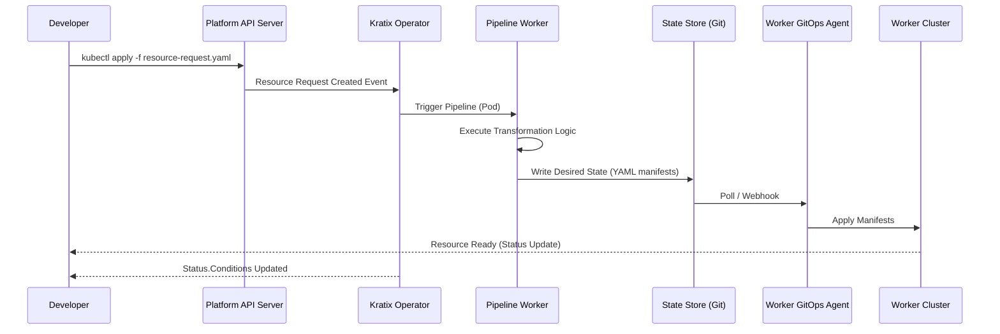
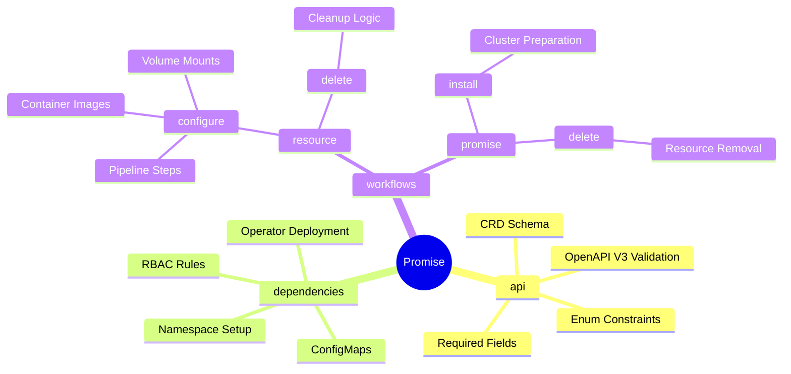
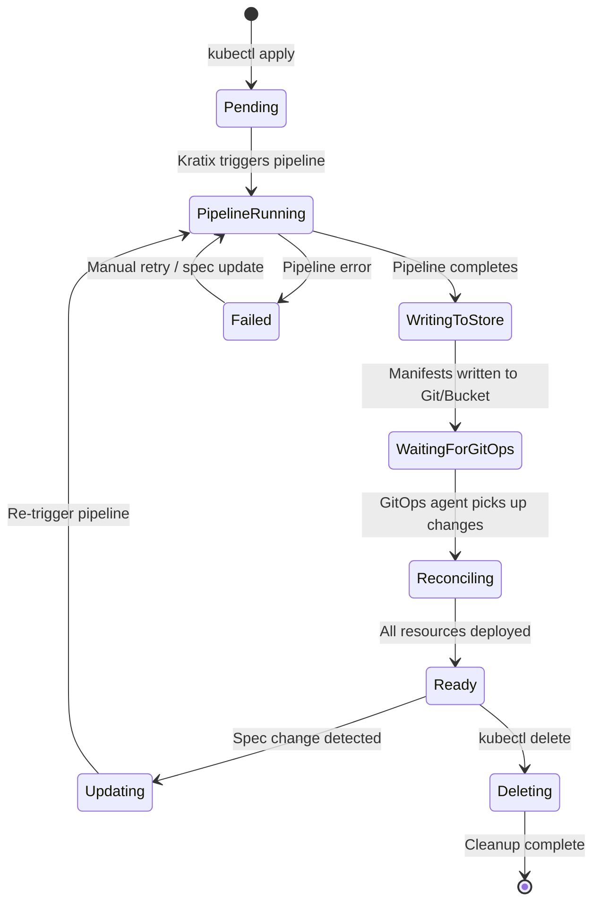
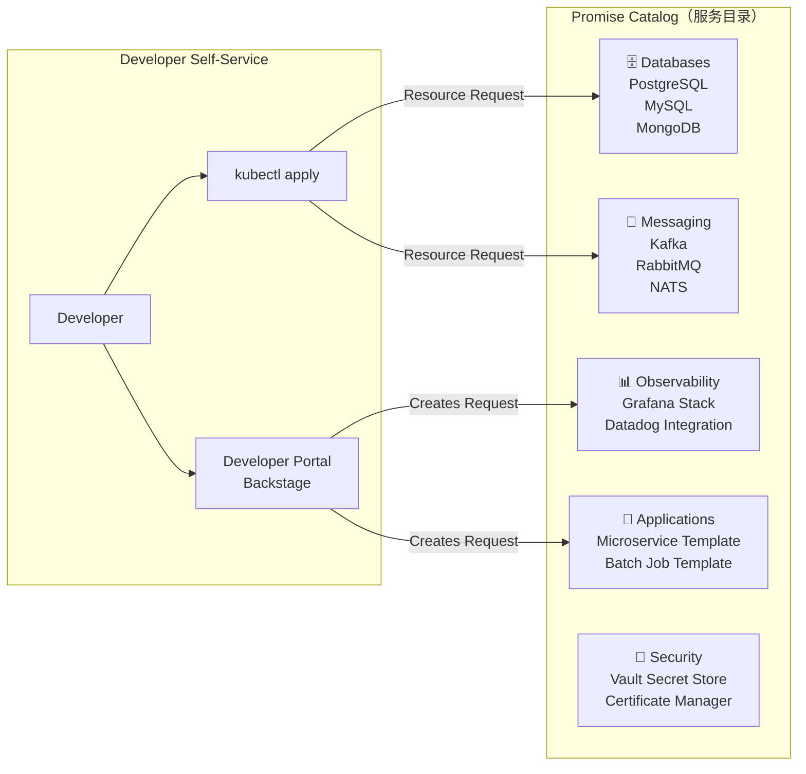
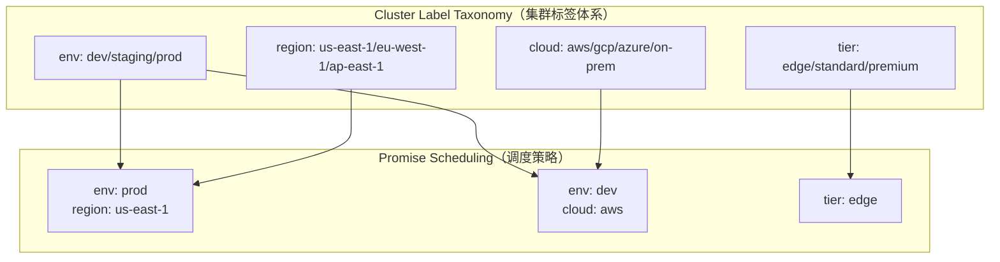
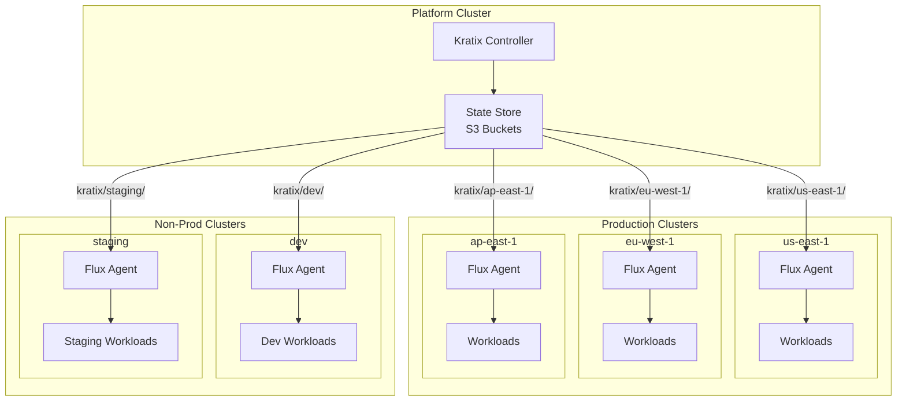
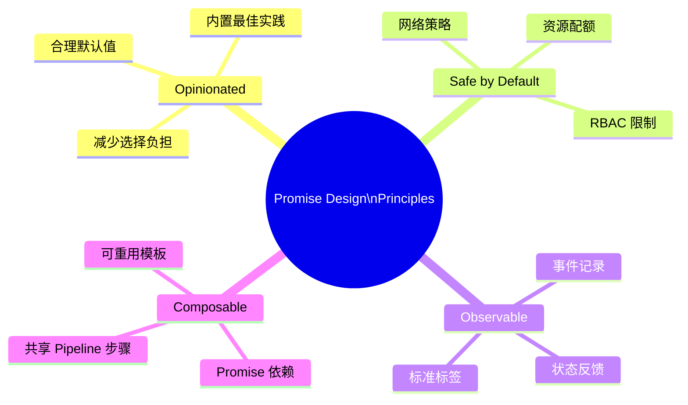
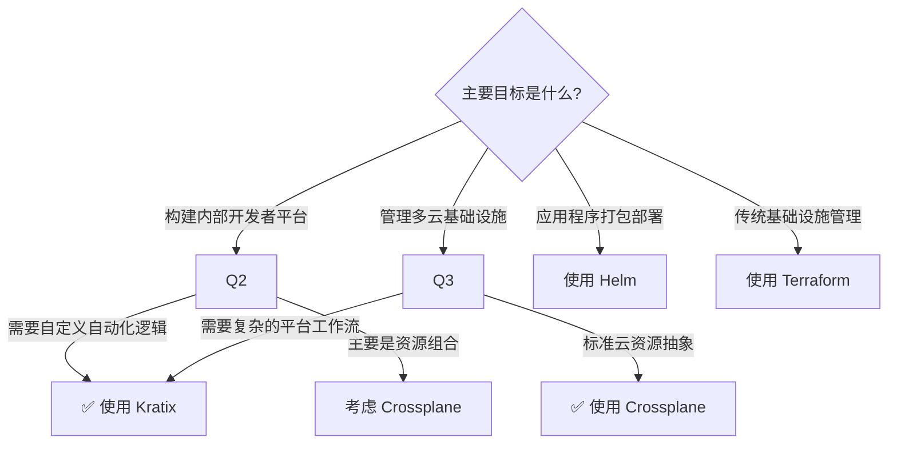
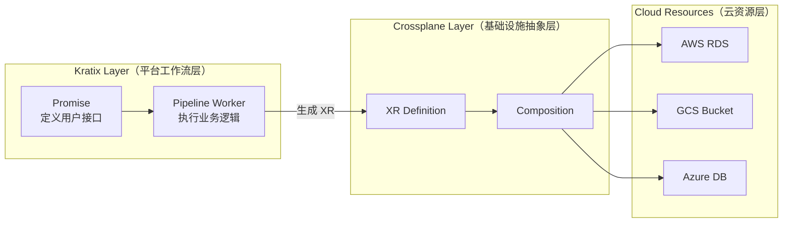
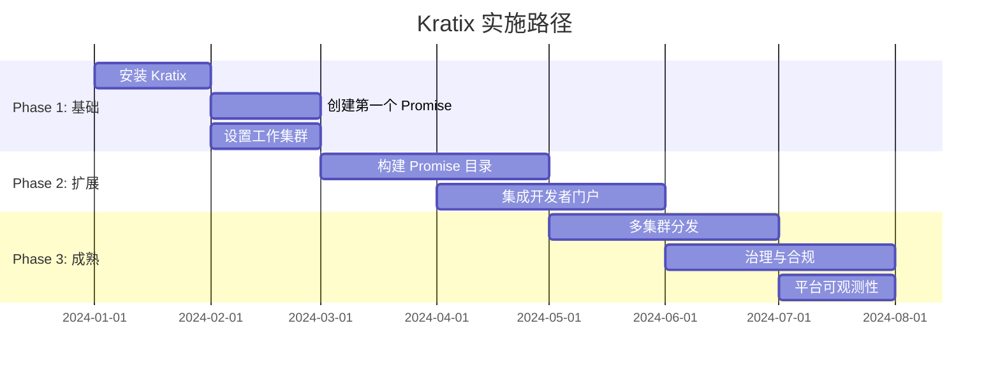

> **生产环境安全提示**
>
> 本文档包含可直接执行的运维命令。执行前请确认：当前目标集群与 Namespace 是否正确；是否具备足够的 RBAC 权限；是否已在非生产环境验证。命令风险等级标注：🔴 高风险（可能造成数据丢失或服务中断）、🟡 中风险（会修改集群状态，但通常可回滚）、🟢 低风险/只读（信息收集，无副作用）。


title: Kratix 平台即代码 (Kratix Platform as Code)
description: '<!-- chunk: 概述 (Overview)' -->## 概述 (Overview)'
category: platform-engineering
tags:
- k8s
- platform-engineering
- developer-experience
- idp
- controller-manager
- [[Prometheus|prometheus]]
- grafana
- [[Helm|helm]]
- [[ArgoCD|argocd]]
- [[Flux|flux]]
last_updated: 2026-05
difficulty: advanced
reading_level: advanced
audience:
- 平台工程师
- SRE
- 架构师
estimated_read_time: 5min
intent_queries:
- Kratix 平台即代码 (Kratix Platform as Code) 是什么
- 如何 Kratix 平台即代码 (Kratix Platform as Code)
- Kubernetes 36 platform engineering 最佳实践
trigger_keywords:
- Kratix
- 平台即代码
- Kratix
- Platform
- as
- Code
- platform
- engineering
authors:
- name: KUDIG Team
  role: contributor
k8s_versions:
- '1.28'
- '1.29'
- '1.30'
- '1.31'
- '1.32'
---

# Kratix 平台即代码 (Kratix Platform as Code)

<!-- chunk: 概述 (Overview) -->## 概述 (Overview)

Kratix 是由 Syntasso 开发的开源平台即代码框架，专为构建内部开发者平台 (IDP) 而设计。它基于 Kubernetes 原生理念，通过声明式 API 将平台能力以 **Promise（承诺）** 的形式提供给开发团队，实现基础设施与服务的自助式交付。

Kratix's core value proposition: **Platform teams define capabilities; Application teams self-serve them.**

---

<!-- chunk: 目录 (Table of Contents) -->## 目录 (Table of Contents)

1. [Kratix 核心概念](#kratix-核心概念)
2. [架构设计](#架构设计)
3. [Promise CRD 详解](#promise-crd-详解)
4. [Resource Request 工作流](#resource-request-工作流)
5. [Pipeline Workers](#pipeline-workers)
6. [自助式服务交付](#自助式服务交付)
7. [多集群分发](#多集群分发)
8. [GitOps 集成](#gitops-集成)
9. [Promise 编写最佳实践](#promise-编写最佳实践)
10. [生产级示例](#生产级示例)
11. [可观测性与治理](#可观测性与治理)
12. [Kratix vs 其他工具](#kratix-vs-其他工具)

---

<!-- chunk: Kratix 核心概念 -->## Kratix 核心概念

## 设计哲学

Kratix 将平台构建问题抽象为两个核心角色：

| 角色 | 职责 | 关注点 |
|------|------|--------|
| **Platform Team（平台团队）** | 编写和维护 Promise | 能力定义、安全规范、合规策略 |
| **Application Team（应用团队）** | 提交 Resource Request | 服务消费、业务需求 |

## 三大核心原语 (Core Primitives)

```
┌─────────────────────────────────────────────────────┐
│                   Kratix Platform                    │
│                                                      │
│  ┌─────────────┐  ┌──────────────┐  ┌────────────┐ │
│  │   Promise   │  │   Resource   │  │  Pipeline  │ │
│  │    (承诺)   │  │   Request    │  │  Worker    │ │
│  │             │  │  (资源请求)  │  │  (流水线)  │ │
│  └─────────────┘  └──────────────┘  └────────────┘ │
└─────────────────────────────────────────────────────┘
```

1. **Promise**: 平台能力的声明式描述，类似于"服务目录条目"
2. **Resource Request**: 应用团队对某个 Promise 的具体消费请求
3. **Pipeline Worker**: 处理 Resource Request 时执行的自动化工作流

---

<!-- chunk: 架构设计 -->## 架构设计

## 整体架构图

```mermaid
graph TB
    subgraph "Platform Cluster (平台集群)"
        direction TB
        K8S[Kubernetes API Server]
        KOp[Kratix Operator]
        StateStore[(State Store\nGit/Bucket)]
        
        subgraph "Promise Registry"
            P1[PostgreSQL Promise]
            P2[Kafka Promise]
            P3[Redis Promise]
        end
        
        subgraph "Pipeline Engine"
            PW1[Pipeline Worker 1]
            PW2[Pipeline Worker 2]
            PW3[Pipeline Worker N]
        end
        
        K8S --> KOp
        KOp --> StateStore
        KOp --> PW1
        KOp --> PW2
        KOp --> PW3
    end
    
    subgraph "Worker Cluster A (工作集群A)"
        FluxA[Flux / ArgoCD]
        WA[Workloads]
        FluxA --> WA
    end
    
    subgraph "Worker Cluster B (工作集群B)"
        FluxB[Flux / ArgoCD]
        WB[Workloads]
        FluxB --> WB
    end
    
    subgraph "Developer (开发者)"
        Dev[kubectl apply\nResource Request]
    end
    
    Dev -->|Resource Request| K8S
    StateStore -->|GitOps Sync| FluxA
    StateStore -->|GitOps Sync| FluxB
    
    style "Platform Cluster (平台集群)" fill:#e8f4fd,stroke:#1565c0
    style "Worker Cluster A (工作集群A)" fill:#e8f5e9,stroke:#2e7d32
    style "Worker Cluster B (工作集群B)" fill:#fff3e0,stroke:#e65100
```

## 数据流向



## 组件详解

## Kratix Operator
- 监听 Promise CRD 和 Resource Request CRD
- 管理 Pipeline Worker 的生命周期
- 协调状态存储与工作集群

## State Store
支持两种后端：
- **Git Repository**: 版本化、可审计
- **Bucket (S3/GCS)**: 高吞吐量场景

## Pipeline Worker
- 基于 Kubernetes Job/Pod 执行
- 容器化，可携带任意工具链
- 输入/输出通过挂载卷传递

---

<!-- chunk: Promise CRD 详解 -->## Promise CRD 详解

## Promise 结构

一个 Promise 是 Kratix 中的核心 CRD，包含三个主要部分：

```yaml
apiVersion: platform.kratix.io/v1alpha1
kind: Promise
metadata:
  name: postgresql
  labels:
    kratix.io/promise-version: "v1.2.0"
    team: platform
spec:
  # 1. API：定义开发者请求的 Schema
  api:
    apiVersion: apiextensions.k8s.io/v1
    kind: CustomResourceDefinition
    metadata:
      name: postgresqls.marketplace.kratix.io
    spec:
      group: marketplace.kratix.io
      names:
        kind: postgresql
        plural: postgresqls
        singular: postgresql
      scope: Namespaced
      versions:
        - name: v1alpha1
          served: true
          storage: true
          schema:
            openAPIV3Schema:
              type: object
              properties:
                spec:
                  type: object
                  properties:
                    env:
                      type: string
                      enum: ["dev", "staging", "prod"]
                      description: "Deployment environment"
                    teamName:
                      type: string
                      description: "Owning team name"
                    dbName:
                      type: string
                      description: "Database name"
                    size:
                      type: string
                      enum: ["small", "medium", "large"]
                      default: "small"
                    version:
                      type: string
                      enum: ["13", "14", "15", "16"]
                      default: "15"
                    backup:
                      type: object
                      properties:
                        enabled:
                          type: boolean
                          default: false
                        schedule:
                          type: string
                          default: "0 2 * * *"
                  required: ["env", "teamName", "dbName"]

  # 2. Dependencies：Promise 级别的依赖（安装在所有工作集群）
  dependencies:
    - apiVersion: v1
      kind: Namespace
      metadata:
        name: postgres-operator-system
    - apiVersion: apps/v1
      kind: Deployment
      metadata:
        name: postgres-operator
        namespace: postgres-operator-system
      spec:
        replicas: 1
        selector:
          matchLabels:
            app: postgres-operator
        template:
          metadata:
            labels:
              app: postgres-operator
          spec:
            containers:
              - name: operator
                image: registry.opensource.zalan.do/acid/postgres-operator:v1.10.0

  # 3. Workflows：处理 Resource Request 的流水线定义
  workflows:
    resource:
      configure:
        - apiVersion: platform.kratix.io/v1alpha1
          kind: Pipeline
          metadata:
            name: instance-configure
          spec:
            steps:
              - name: fetch-and-validate
                image: ghcr.io/syntasso/kratix-pipeline-utility:v0.0.1
                command: [sh]
                args: ["-c", "/scripts/validate.sh"]
                volumeMounts:
                  - name: promise-scheduling
                    mountPath: /kratix/metadata
              - name: generate-manifests
                image: ghcr.io/myorg/postgresql-pipeline:v1.0.0
                command: [sh]
                args: ["-c", "/scripts/generate.sh"]
      delete:
        - apiVersion: platform.kratix.io/v1alpha1
          kind: Pipeline
          metadata:
            name: instance-delete
          spec:
            steps:
              - name: cleanup
                image: ghcr.io/myorg/postgresql-pipeline:v1.0.0
                command: [sh]
                args: ["-c", "/scripts/cleanup.sh"]
```

## Promise 字段说明



## Promise 版本管理

```yaml
# Promise 版本标注最佳实践
apiVersion: platform.kratix.io/v1alpha1
kind: Promise
metadata:
  name: kafka
  annotations:
    kratix.io/description: "Apache Kafka cluster provisioning"
    kratix.io/documentation: "https://internal.docs/kafka-promise"
    kratix.io/owner: "platform-team@company.com"
    kratix.io/slack-channel: "#platform-support"
  labels:
    kratix.io/promise-version: "v2.1.0"
    kratix.io/category: "messaging"
    kratix.io/tier: "approved"
spec:
  # ... promise spec
```

---

<!-- chunk: Resource Request 工作流 -->## Resource Request 工作流

## Resource Request 示例

```yaml
# 开发者提交的资源请求
apiVersion: marketplace.kratix.io/v1alpha1
kind: postgresql
metadata:
  name: payments-db
  namespace: team-payments
  labels:
    app: payment-service
    cost-center: "cc-12345"
spec:
  env: prod
  teamName: payments-team
  dbName: payments
  size: large
  version: "15"
  backup:
    enabled: true
    schedule: "0 1 * * *"
```

## Resource Request 生命周期



## Status 字段结构

```yaml
status:
  conditions:
    - lastTransitionTime: "2024-01-15T10:30:00Z"
      message: "Pipeline completed successfully"
      reason: "PipelineCompleted"
      status: "True"
      type: "PipelineCompleted"
    - lastTransitionTime: "2024-01-15T10:35:00Z"
      message: "All resources reconciled"
      reason: "ResourcesReconciled"
      status: "True"
      type: "Ready"
  observedGeneration: 3
  message: "PostgreSQL instance 'payments-db' is ready"
  # Custom status fields set by pipeline
  connectionInfo:
    host: "payments-db.postgres-operator-system.svc.cluster.local"
    port: "5432"
    secretRef: "payments-db-credentials"
```

---

<!-- chunk: Pipeline Workers -->## Pipeline Workers

## Pipeline 设计原则

Pipeline Worker 是 Kratix 中执行实际工作的核心组件。每个 Pipeline Step 是一个容器，遵循以下约定：

```
/kratix/input/       <- 读取 Resource Request 内容
/kratix/output/      <- 写入目标集群 Manifest
/kratix/metadata/    <- 调度元数据（目标集群选择）
/tmp/                <- 临时工作目录
```

## Pipeline 容器文件结构

```bash
# Pipeline 容器目录布局
/
├── scripts/
│   ├── validate.sh          # 验证输入参数
│   ├── generate.sh          # 生成 Kubernetes 清单
│   └── cleanup.sh           # 清理逻辑
├── templates/
│   ├── postgresql-cluster.yaml.tmpl
│   ├── service.yaml.tmpl
│   └── secret.yaml.tmpl
└── kratix/
    ├── input/
    │   └── object.yaml      # Resource Request（只读）
    ├── output/
    │   └── # 生成的清单写入此处
    └── metadata/
        └── destination-selectors.yaml  # 集群选择
```

## 构建 Pipeline 容器

```dockerfile
# Dockerfile for PostgreSQL Promise Pipeline
FROM alpine:3.18

# 安装工具
RUN apk add --no-cache \
    bash \
    curl \
    yq \
    envsubst \
    gettext

# 复制脚本
COPY scripts/ /scripts/
COPY templates/ /templates/
RUN chmod +x /scripts/*.sh

# 设置工作目录
WORKDIR /kratix

ENTRYPOINT ["/scripts/generate.sh"]
```

## generate.sh 实现示例

```bash
#!/bin/bash
set -euo pipefail

# 读取 Resource Request
OBJECT_FILE="/kratix/input/object.yaml"
OUTPUT_DIR="/kratix/output"
METADATA_DIR="/kratix/metadata"

# 使用 yq 提取字段
ENV=$(yq e '.spec.env' "$OBJECT_FILE")
TEAM_NAME=$(yq e '.spec.teamName' "$OBJECT_FILE")
DB_NAME=$(yq e '.spec.dbName' "$OBJECT_FILE")
SIZE=$(yq e '.spec.size' "$OBJECT_FILE")
VERSION=$(yq e '.spec.version' "$OBJECT_FILE")
BACKUP_ENABLED=$(yq e '.spec.backup.enabled' "$OBJECT_FILE")
RESOURCE_NAME=$(yq e '.metadata.name' "$OBJECT_FILE")
NAMESPACE=$(yq e '.metadata.namespace' "$OBJECT_FILE")

# 根据 size 设置资源规格
case "$SIZE" in
  "small")
    CPU_REQUEST="500m"
    CPU_LIMIT="1"
    MEM_REQUEST="512Mi"
    MEM_LIMIT="1Gi"
    STORAGE="10Gi"
    INSTANCES="1"
    ;;
  "medium")
    CPU_REQUEST="1"
    CPU_LIMIT="2"
    MEM_REQUEST="2Gi"
    MEM_LIMIT="4Gi"
    STORAGE="50Gi"
    INSTANCES="2"
    ;;
  "large")
    CPU_REQUEST="2"
    CPU_LIMIT="4"
    MEM_REQUEST="4Gi"
    MEM_LIMIT="8Gi"
    STORAGE="200Gi"
    INSTANCES="3"
    ;;
esac

# 设置调度目标（集群选择）
mkdir -p "$METADATA_DIR"
cat > "$METADATA_DIR/destination-selectors.yaml" <<EOF
- matchLabels:
    env: "$ENV"
    region: "us-east-1"
EOF

# 生成 PostgreSQL 集群清单
mkdir -p "$OUTPUT_DIR"

cat > "$OUTPUT_DIR/namespace.yaml" <<EOF
apiVersion: v1
kind: Namespace
metadata:
  name: "$NAMESPACE"
  labels:
    team: "$TEAM_NAME"
    managed-by: "kratix"
    env: "$ENV"
EOF

cat > "$OUTPUT_DIR/postgresql-cluster.yaml" <<EOF
apiVersion: "acid.zalan.do/v1"
kind: postgresql
metadata:
  name: "$RESOURCE_NAME"
  namespace: "$NAMESPACE"
  labels:
    team: "$TEAM_NAME"
    env: "$ENV"
    managed-by: kratix
    kratix.io/resource-name: "$RESOURCE_NAME"
spec:
  teamId: "$TEAM_NAME"
  volume:
    size: "$STORAGE"
  numberOfInstances: $INSTANCES
  users:
    ${DB_NAME}_admin:
      - superuser
      - createdb
    ${DB_NAME}_app:
      - login
  databases:
    "$DB_NAME": "${DB_NAME}_admin"
  postgresql:
    version: "$VERSION"
    parameters:
      shared_buffers: "256MB"
      max_connections: "200"
  resources:
    requests:
      cpu: "$CPU_REQUEST"
      memory: "$MEM_REQUEST"
    limits:
      cpu: "$CPU_LIMIT"
      memory: "$MEM_LIMIT"
EOF

# 如果启用备份，添加备份配置
if [ "$BACKUP_ENABLED" == "true" ]; then
  BACKUP_SCHEDULE=$(yq e '.spec.backup.schedule' "$OBJECT_FILE")
  cat >> "$OUTPUT_DIR/postgresql-cluster.yaml" <<EOF
  # Backup configuration via WAL-G
  patroni:
    initdb:
      encoding: "UTF8"
      locale: "en_US.UTF-8"
    slots: {}
    ttl: 30
    loop_wait: 10
    retry_timeout: 10
    synchronous_mode: false
  additionalVolumes:
    - name: backup-config
      mountPath: /etc/backup
      configMap:
        name: "${RESOURCE_NAME}-backup-config"
EOF

  cat > "$OUTPUT_DIR/backup-config.yaml" <<EOF
apiVersion: v1
kind: ConfigMap
metadata:
  name: "${RESOURCE_NAME}-backup-config"
  namespace: "$NAMESPACE"
data:
  backup.sh: |
    #!/bin/bash
    # WAL-G backup script
    export WALG_S3_PREFIX="s3://company-pg-backups/${TEAM_NAME}/${RESOURCE_NAME}"
    wal-g backup-push \$PGDATA
  schedule: "$BACKUP_SCHEDULE"
EOF
fi

# 生成网络策略
cat > "$OUTPUT_DIR/network-policy.yaml" <<EOF
apiVersion: networking.k8s.io/v1
kind: NetworkPolicy
metadata:
  name: "${RESOURCE_NAME}-allow-team"
  namespace: "$NAMESPACE"
spec:
  podSelector:
    matchLabels:
      application: spilo
      cluster-name: "$RESOURCE_NAME"
  policyTypes:
    - Ingress
  ingress:
    - from:
        - namespaceSelector:
            matchLabels:
              team: "$TEAM_NAME"
      ports:
        - protocol: TCP
          port: 5432
EOF

echo "Pipeline completed successfully"
echo "Generated manifests in $OUTPUT_DIR:"
ls -la "$OUTPUT_DIR"
```

## validate.sh 验证脚本

```bash
#!/bin/bash
set -euo pipefail

OBJECT_FILE="/kratix/input/object.yaml"

# 验证必填字段
ENV=$(yq e '.spec.env' "$OBJECT_FILE")
TEAM_NAME=$(yq e '.spec.teamName' "$OBJECT_FILE")
DB_NAME=$(yq e '.spec.dbName' "$OBJECT_FILE")

if [ -z "$TEAM_NAME" ] || [ "$TEAM_NAME" == "null" ]; then
  echo "ERROR: spec.teamName is required"
  exit 1
fi

# 验证团队名称格式
if ! "$TEAM_NAME" =~ ^[a-z0-9-]+$; then
  echo "ERROR: teamName must be lowercase alphanumeric with hyphens"
  exit 1
fi

# 验证 DB 名称长度
if [ ${#DB_NAME} -gt 63 ]; then
  echo "ERROR: dbName must be 63 characters or less"
  exit 1
fi

# 生产环境额外验证
if [ "$ENV" == "prod" ]; then
  BACKUP_ENABLED=$(yq e '.spec.backup.enabled' "$OBJECT_FILE")
  if [ "$BACKUP_ENABLED" != "true" ]; then
    echo "WARNING: Production databases should have backup enabled"
    # 可选：强制要求备份
    # exit 1
  fi
fi

echo "Validation passed"
```

## 多步骤 Pipeline

```yaml
apiVersion: platform.kratix.io/v1alpha1
kind: Promise
metadata:
  name: microservice-platform
spec:
  workflows:
    resource:
      configure:
        - apiVersion: platform.kratix.io/v1alpha1
          kind: Pipeline
          metadata:
            name: microservice-configure
          spec:
            steps:
              # Step 1: 验证和丰富请求
              - name: validate-and-enrich
                image: ghcr.io/myorg/validation-tools:v1.0
                command: ["/scripts/validate-and-enrich.sh"]
                env:
                  - name: POLICY_SERVER
                    value: "http://opa.policy-system.svc:8181"

              # Step 2: 生成基础设施清单
              - name: generate-infra
                image: ghcr.io/myorg/infra-generator:v2.0
                command: ["/scripts/generate-infra.sh"]
                envFrom:
                  - configMapRef:
                      name: platform-defaults

              # Step 3: 应用安全策略
              - name: apply-security-policies
                image: ghcr.io/myorg/security-policy:v1.5
                command: ["/scripts/apply-policies.sh"]
                env:
                  - name: SECURITY_LEVEL
                    valueFrom:
                      configMapKeyRef:
                        name: security-config
                        key: default-level

              # Step 4: 注册到服务目录
              - name: register-service
                image: ghcr.io/myorg/catalog-client:v1.0
                command: ["/scripts/register.sh"]
                env:
                  - name: CATALOG_URL
                    value: "https://catalog.internal"
                  - name: CATALOG_TOKEN
                    valueFrom:
                      secretKeyRef:
                        name: catalog-credentials
                        key: token
```

---

<!-- chunk: 自助式服务交付 -->## 自助式服务交付

## 服务目录设计



## Backstage 集成

```typescript
// Backstage Software Template for Kratix Promise
// catalog-info.yaml

apiVersion: scaffolder.backstage.io/v1beta3
kind: Template
metadata:
  name: postgresql-database
  title: PostgreSQL Database
  description: Provision a PostgreSQL database via Kratix
  tags:
    - database
    - postgresql
    - kratix
spec:
  owner: platform-team
  type: database

  parameters:
    - title: Database Configuration
      required:
        - teamName
        - dbName
        - env
      properties:
        teamName:
          title: Team Name
          type: string
          pattern: '^[a-z0-9-]+$'
        dbName:
          title: Database Name
          type: string
        env:
          title: Environment
          type: string
          enum: [dev, staging, prod]
        size:
          title: Size
          type: string
          enum: [small, medium, large]
          default: small

  steps:
    - id: generate-request
      name: Generate Resource Request
      action: fetch:template
      input:
        url: ./templates/postgresql
        values:
          teamName: ${{ parameters.teamName }}
          dbName: ${{ parameters.dbName }}
          env: ${{ parameters.env }}
          size: ${{ parameters.size }}

    - id: create-pr
      name: Create Pull Request
      action: publish:github:pull-request
      input:
        repoUrl: github.com?repo=platform-requests&owner=myorg
        branchName: postgresql-${{ parameters.dbName }}-${{ parameters.env }}
        title: "Add PostgreSQL: ${{ parameters.dbName }} (${{ parameters.env }})"
        description: |
          <!-- chunk: New PostgreSQL Database Request -->## New PostgreSQL Database Request
          
          - **Team**: ${{ parameters.teamName }}
          - **Database**: ${{ parameters.dbName }}
          - **Environment**: ${{ parameters.env }}
          - **Size**: ${{ parameters.size }}
```

## 自助式工作流对比

```mermaid
graph TB
    subgraph "Before Kratix（传统方式）"
        D1[Developer] -->|Ticket| J1[Jira Ticket]
        J1 -->|Review| P1[Platform Team]
        P1 -->|Manual Provisioning| I1[Infrastructure]
        I1 -->|Days/Weeks| D1
    end
    
    subgraph "After Kratix（平台化方式）"
        D2[Developer] -->|kubectl apply| K2[Kratix API]
        K2 -->|Automated Pipeline| I2[Infrastructure]
        I2 -->|Minutes| D2
    end
    
    style "Before Kratix（传统方式）" fill:#ffebee
    style "After Kratix（平台化方式）" fill:#e8f5e9
```

---

<!-- chunk: 多集群分发 -->## 多集群分发

## Destination（目标集群）注册

```yaml
# 注册工作集群
apiVersion: platform.kratix.io/v1alpha1
kind: Destination
metadata:
  name: prod-us-east-1
  labels:
    env: prod
    region: us-east-1
    tier: production
    cloud: aws
spec:
  # 告诉 Kratix 如何向此集群写入配置
  stateStoreRef:
    name: default-state-store
    kind: BucketStateStore
  # 可选：路径前缀隔离
  filepath:
    mode: nestedByMetadata
```

```yaml
# BucketStateStore 配置
apiVersion: platform.kratix.io/v1alpha1
kind: BucketStateStore
metadata:
  name: default-state-store
spec:
  bucketName: kratix-state-store
  endpoint: s3.amazonaws.com
  insecure: false
  path: "/"
  secretRef:
    name: aws-credentials
    namespace: kratix-platform-system
```

## 集群标签策略



## Pipeline 中动态选择集群

```bash
#!/bin/bash
# destination-selector.sh
# 根据 Resource Request 动态选择目标集群

OBJECT_FILE="/kratix/input/object.yaml"
METADATA_DIR="/kratix/metadata"

ENV=$(yq e '.spec.env' "$OBJECT_FILE")
REGION=$(yq e '.spec.region // "us-east-1"' "$OBJECT_FILE")
TEAM=$(yq e '.spec.teamName' "$OBJECT_FILE")

mkdir -p "$METADATA_DIR"

# 生产环境：选择多个集群实现高可用
if [ "$ENV" == "prod" ]; then
  cat > "$METADATA_DIR/destination-selectors.yaml" <<EOF
- matchLabels:
    env: prod
    region: "$REGION"
    tier: premium
EOF
# 暂存环境：选择单个集群
elif [ "$ENV" == "staging" ]; then
  cat > "$METADATA_DIR/destination-selectors.yaml" <<EOF
- matchLabels:
    env: staging
    region: "us-east-1"
EOF
# 开发环境：选择共享开发集群
else
  cat > "$METADATA_DIR/destination-selectors.yaml" <<EOF
- matchLabels:
    env: dev
    tier: shared
EOF
fi

echo "Destination selectors written for env=$ENV"
```

## 多集群生产拓扑



---

<!-- chunk: GitOps 集成 -->## GitOps 集成

## Flux CD 集成配置

```yaml
# Worker 集群上的 Flux 配置
# 1. 配置 GitRepository（S3 作为 OCIRepository）
apiVersion: source.toolkit.fluxcd.io/v1beta2
kind: Bucket
metadata:
  name: kratix-bucket
  namespace: flux-system
spec:
  interval: 2m
  provider: aws
  bucketName: kratix-state-store
  endpoint: s3.amazonaws.com
  region: us-east-1
  secretRef:
    name: kratix-s3-credentials

---
# 2. 配置 Kustomization
apiVersion: kustomize.toolkit.fluxcd.io/v1
kind: Kustomization
metadata:
  name: kratix-workloads
  namespace: flux-system
spec:
  interval: 2m
  sourceRef:
    kind: Bucket
    name: kratix-bucket
  path: "./kratix/us-east-1/dependencies"
  prune: true
  wait: true
  timeout: 10m
  healthChecks:
    - apiVersion: apps/v1
      kind: Deployment
      name: postgres-operator
      namespace: postgres-operator-system
```

## ArgoCD 集成配置

```yaml
# ArgoCD Application for Kratix
apiVersion: argoproj.io/v1alpha1
kind: Application
metadata:
  name: kratix-workloads
  namespace: argocd
spec:
  project: platform
  source:
    repoURL: 'https://github.com/myorg/kratix-state-store'
    targetRevision: HEAD
    path: kratix/us-east-1
  destination:
    server: 'https://kubernetes.default.svc'
    namespace: kratix-worker-system
  syncPolicy:
    automated:
      prune: true
      selfHeal: true
    syncOptions:
      - CreateNamespace=true
      - PrunePropagationPolicy=foreground
    retry:
      limit: 5
      backoff:
        duration: 5s
        factor: 2
        maxDuration: 3m
  revisionHistoryLimit: 3
```

---

<!-- chunk: Promise 编写最佳实践 -->## Promise 编写最佳实践

## Promise 设计原则



## Promise 分层设计

```yaml
# 基础 Promise：提供通用数据库能力
apiVersion: platform.kratix.io/v1alpha1
kind: Promise
metadata:
  name: base-postgresql
spec:
  api:
    # 最小化 API 设计
    spec:
      properties:
        tier:
          type: string
          enum: [standard, premium]
  workflows:
    resource:
      configure:
        - apiVersion: platform.kratix.io/v1alpha1
          kind: Pipeline
          spec:
            steps:
              - name: base-generate
                image: ghcr.io/myorg/base-db-pipeline:v1.0

---
# 复合 Promise：面向特定业务线
apiVersion: platform.kratix.io/v1alpha1
kind: Promise
metadata:
  name: ecommerce-postgresql
  annotations:
    kratix.io/parent-promise: "base-postgresql"
spec:
  api:
    spec:
      properties:
        productLine:
          type: string
          enum: [catalog, orders, payments, inventory]
        # 自动继承合规要求
        pciCompliance:
          type: boolean
          default: true
```

## 错误处理模式

```bash
#!/bin/bash
# 完善的错误处理脚本模板
set -euo pipefail

# 颜色输出
RED='\033[0;31m'
GREEN='\033[0;32m'
YELLOW='\033[1;33m'
NC='\033[0m'

log_info() { echo -e "${GREEN}[INFO]${NC} $1"; }
log_warn() { echo -e "${YELLOW}[WARN]${NC} $1"; }
log_error() { echo -e "${RED}[ERROR]${NC} $1" >&2; }

# 错误退出时清理
cleanup() {
  local exit_code=$?
  if [ $exit_code -ne 0 ]; then
    log_error "Pipeline failed with exit code: $exit_code"
    # 写入错误状态供 Kratix 读取
    mkdir -p /kratix/metadata
    echo "Pipeline failed: check logs for details" > /kratix/metadata/error-message
  fi
}
trap cleanup EXIT

# 验证挂载卷
validate_mounts() {
  if [ ! -f "/kratix/input/object.yaml" ]; then
    log_error "Missing required input file: /kratix/input/object.yaml"
    exit 1
  fi
  mkdir -p /kratix/output /kratix/metadata
  log_info "Mount validation passed"
}

# 主逻辑
main() {
  log_info "Starting pipeline execution"
  validate_mounts
  
  # 执行具体逻辑...
  
  log_info "Pipeline completed successfully"
}

main "$@"
```

## Promise 测试策略

```yaml
# 使用 kratix test 框架
# test/postgresql_test.go
apiVersion: test.kratix.io/v1
kind: PromiseTest
metadata:
  name: postgresql-small-dev
spec:
  promise: postgresql
  resourceRequest:
    spec:
      env: dev
      teamName: test-team
      dbName: testdb
      size: small
  expectedOutput:
    - apiVersion: acid.zalan.do/v1
      kind: postgresql
      metadata:
        name: postgresql-small-dev
      spec:
        numberOfInstances: 1
        volume:
          size: 10Gi
    - apiVersion: networking.k8s.io/v1
      kind: NetworkPolicy
      metadata:
        name: postgresql-small-dev-allow-team
```

---

<!-- chunk: 生产级示例 -->## 生产级示例

## 完整的微服务平台 Promise

```yaml
apiVersion: platform.kratix.io/v1alpha1
kind: Promise
metadata:
  name: microservice
  labels:
    kratix.io/promise-version: "v3.0.0"
    kratix.io/category: "application"
  annotations:
    kratix.io/description: "Production-ready microservice with observability, security, and CI/CD"
    kratix.io/documentation: "https://platform.internal/docs/microservice-promise"
    kratix.io/owner: "platform-team@company.com"
spec:
  api:
    apiVersion: apiextensions.k8s.io/v1
    kind: CustomResourceDefinition
    metadata:
      name: microservices.internal.company.io
    spec:
      group: internal.company.io
      names:
        kind: Microservice
        plural: microservices
        singular: microservice
      scope: Namespaced
      versions:
        - name: v1alpha1
          served: true
          storage: true
          schema:
            openAPIV3Schema:
              type: object
              properties:
                spec:
                  type: object
                  required: [name, team, language, gitRepo]
                  properties:
                    name:
                      type: string
                      maxLength: 63
                      pattern: '^[a-z0-9-]+$'
                    team:
                      type: string
                    language:
                      type: string
                      enum: [java, python, golang, nodejs, rust]
                    gitRepo:
                      type: string
                    replicas:
                      type: integer
                      minimum: 1
                      maximum: 20
                      default: 2
                    resourceProfile:
                      type: string
                      enum: [nano, small, medium, large, xlarge]
                      default: small
                    autoscaling:
                      type: object
                      properties:
                        enabled:
                          type: boolean
                          default: true
                        minReplicas:
                          type: integer
                          default: 2
                        maxReplicas:
                          type: integer
                          default: 10
                        targetCPU:
                          type: integer
                          default: 70
                    ingress:
                      type: object
                      properties:
                        enabled:
                          type: boolean
                          default: false
                        hostname:
                          type: string
                        tls:
                          type: boolean
                          default: true
                    observability:
                      type: object
                      properties:
                        metrics:
                          type: boolean
                          default: true
                        tracing:
                          type: boolean
                          default: true
                        logLevel:
                          type: string
                          enum: [debug, info, warn, error]
                          default: info

  dependencies:
    # 命名空间和基础 RBAC
    - apiVersion: v1
      kind: Namespace
      metadata:
        name: app-platform-system
    # Prometheus ServiceMonitor CRD（如未安装）
    - apiVersion: apiextensions.k8s.io/v1
      kind: CustomResourceDefinition
      metadata:
        name: servicemonitors.monitoring.coreos.com

  workflows:
    resource:
      configure:
        - apiVersion: platform.kratix.io/v1alpha1
          kind: Pipeline
          metadata:
            name: microservice-configure
          spec:
            serviceAccountName: microservice-pipeline-sa
            steps:
              - name: validate
                image: ghcr.io/myorg/platform-tools:v2.0
                command: ["/scripts/validate.sh"]
              
              - name: generate-namespace-rbac
                image: ghcr.io/myorg/platform-tools:v2.0
                command: ["/scripts/gen-namespace.sh"]
              
              - name: generate-deployment
                image: ghcr.io/myorg/platform-tools:v2.0
                command: ["/scripts/gen-deployment.sh"]
              
              - name: generate-observability
                image: ghcr.io/myorg/platform-tools:v2.0
                command: ["/scripts/gen-observability.sh"]
              
              - name: generate-security
                image: ghcr.io/myorg/platform-tools:v2.0
                command: ["/scripts/gen-security.sh"]
              
              - name: generate-cicd
                image: ghcr.io/myorg/platform-tools:v2.0
                command: ["/scripts/gen-cicd.sh"]
                env:
                  - name: TEKTON_NAMESPACE
                    value: "tekton-pipelines"
      
      delete:
        - apiVersion: platform.kratix.io/v1alpha1
          kind: Pipeline
          metadata:
            name: microservice-delete
          spec:
            steps:
              - name: cleanup-cicd
                image: ghcr.io/myorg/platform-tools:v2.0
                command: ["/scripts/cleanup-cicd.sh"]
              - name: cleanup-resources
                image: ghcr.io/myorg/platform-tools:v2.0
                command: ["/scripts/cleanup.sh"]
```

## 企业级 Promise 目录

```mermaid
graph TD
    subgraph "Approved Promise Catalog（已审批服务目录）"
        subgraph "Data Tier"
            PG[PostgreSQL\nv1.2.0 ✅]
            MY[MySQL\nv1.0.0 ✅]
            RD[Redis\nv2.1.0 ✅]
            MG[MongoDB\nv1.0.0 Beta]
        end
        
        subgraph "Messaging Tier"
            KF[Kafka\nv1.3.0 ✅]
            RB[RabbitMQ\nv1.1.0 ✅]
            NT[NATS\nv0.9.0 Experimental]
        end
        
        subgraph "Application Tier"
            MS[Microservice\nv3.0.0 ✅]
            BJ[Batch Job\nv1.5.0 ✅]
            WF[Workflow\nv1.0.0 ✅]
        end
        
        subgraph "Observability Tier"
            GF[Grafana Stack\nv2.0.0 ✅]
            DD[Datadog\nv1.0.0 ✅]
        end
    end
    
    style "Data Tier" fill:#e3f2fd
    style "Messaging Tier" fill:#f3e5f5
    style "Application Tier" fill:#e8f5e9
    style "Observability Tier" fill:#fff8e1
```

---

<!-- chunk: 可观测性与治理 -->## 可观测性与治理

## Promise 指标收集

```yaml
# Prometheus ServiceMonitor for Kratix
apiVersion: monitoring.coreos.com/v1
kind: ServiceMonitor
metadata:
  name: kratix-metrics
  namespace: kratix-platform-system
spec:
  selector:
    matchLabels:
      app: kratix-platform-controller-manager
  endpoints:
    - port: metrics
      interval: 30s
      path: /metrics
```

## 关键指标

| 指标 | 描述 | 告警阈值 |
|------|------|----------|
| `kratix_promises_total` | Promise 总数 | N/A |
| `kratix_resource_requests_total` | Resource Request 总数 | N/A |
| `kratix_pipeline_duration_seconds` | Pipeline 执行时长 | P99 > 300s |
| `kratix_pipeline_failures_total` | Pipeline 失败次数 | Rate > 5/min |
| `kratix_resource_ready_duration_seconds` | 资源就绪时长 | P95 > 600s |
| `kratix_destinations_total` | 注册集群数 | N/A |

## Grafana Dashboard 配置

```json
{
  "dashboard": {
    "title": "Kratix Platform Overview",
    "panels": [
      {
        "title": "Resource Request Rate",
        "type": "stat",
        "targets": [
          {
            "expr": "rate(kratix_resource_requests_total[5m])",
            "legendFormat": "Requests/sec"
          }
        ]
      },
      {
        "title": "Pipeline P95 Duration",
        "type": "graph",
        "targets": [
          {
            "expr": "histogram_quantile(0.95, rate(kratix_pipeline_duration_seconds_bucket[5m]))",
            "legendFormat": "P95 Pipeline Duration"
          }
        ]
      },
      {
        "title": "Promise Health",
        "type": "table",
        "targets": [
          {
            "expr": "kratix_promise_health",
            "legendFormat": "{{promise_name}}"
          }
        ]
      }
    ]
  }
}
```

## 审计与合规

```yaml
# OPA Policy for Promise Governance
package kratix.admission

import future.keywords.in

# 强制要求所有 Promise 有 owner 注解
deny[msg] {
  input.request.kind.kind == "Promise"
  not input.request.object.metadata.annotations["kratix.io/owner"]
  msg := "Promise must have kratix.io/owner annotation"
}

# 限制 Promise 版本格式
deny[msg] {
  input.request.kind.kind == "Promise"
  version := input.request.object.metadata.labels["kratix.io/promise-version"]
  not regex.match(`^v[0-9]+\.[0-9]+\.[0-9]+$`, version)
  msg := sprintf("Promise version '%v' must follow semver format (vX.Y.Z)", [version])
}

# 生产 Promise 必须有文档链接
deny[msg] {
  input.request.kind.kind == "Promise"
  input.request.object.metadata.labels["kratix.io/tier"] == "approved"
  not input.request.object.metadata.annotations["kratix.io/documentation"]
  msg := "Approved Promises must have kratix.io/documentation annotation"
}
```

---

<!-- chunk: Kratix vs 其他工具 -->## Kratix vs 其他工具

## 对比分析

| 特性 | Kratix | Crossplane | Helm | Terraform |
|------|--------|------------|------|-----------|
| **核心概念** | Promise/Pipeline | XRD/Composition | Chart/Template | Module/Resource |
| **执行模型** | Pipeline Workers | Kubernetes Providers | Template Rendering | State Machine |
| **多集群** | 原生支持 | 有限支持 | 需外部工具 | 需外部工具 |
| **GitOps** | 原生集成 | 需配置 | 需配置 | 有限支持 |
| **编程模型** | Shell/任意语言 | 声明式 YAML | Go Template | HCL |
| **学习曲线** | 中等 | 高 | 低 | 中等 |
| **适用场景** | 平台即代码 | 云资源抽象 | 应用部署 | 基础设施管理 |

## 决策框架



## Kratix + Crossplane 组合模式



---

<!-- chunk: 总结 (Summary) -->## 总结 (Summary)

Kratix 通过 **Promise 即服务目录、Pipeline 即自动化引擎、GitOps 即交付机制** 的三位一体架构，为平台工程实践提供了完整的技术基础：

## 核心价值主张

1. **开发者自主权**: 自助式服务消费，无需等待 Ticket
2. **平台团队效率**: 一次定义，多次复用，标准化交付
3. **企业级治理**: 内置合规策略、网络安全、资源配额
4. **多集群协调**: 跨环境一致性，GitOps 驱动
5. **可扩展性**: 任意工具链，任意编程语言

## 实施路径



---

<!-- chunk: 参考资料 (References) -->## 参考资料 (References)

- [Kratix Official Documentation](https://kratix.io/docs)
- [Syntasso GitHub](https://github.com/syntasso/kratix)
- [CNCF Platforms Working Group](https://tag-app-delivery.cncf.io/wgs/platforms/)
- [Platform Engineering Community](https://platformengineering.org/)
- [Internal Developer Platform Maturity Model](https://internaldeveloperplatform.org/platform-maturity-model/)
- Team Topologies by Matthew Skelton and Manuel Pais

---

<!-- chunk: Obsidian 相关文档 -->## Obsidian 相关文档

- 平台工程 MOC
- [[10-平台工程/README.md|Domain 07: 平台工程 (Platform Engineering)]]
- Domain-36 平台工程 — 开源项目索引
- 平台工程概述与成熟度模型
- 内部开发者平台设计原则
- Backstage 部署与配置
- Backstage 软件目录与 TechDocs
- Backstage 脚手架与模板系统
- Crossplane 平台组合 (Crossplane Platform Composition)
- Golden Paths 黄金路径设计 (Golden Paths Design Patterns)
- 开发者体验度量 (Developer Experience Metrics)
- 平台团队拓扑与运营 (Platform Team Topology and Operations)

## See Also

- 04-backstage-catalog-techdocs
- 05-backstage-scaffolder-templates
- 07-crossplane-platform-composition
- 08-golden-paths-design


<!-- risk-assessed -->
