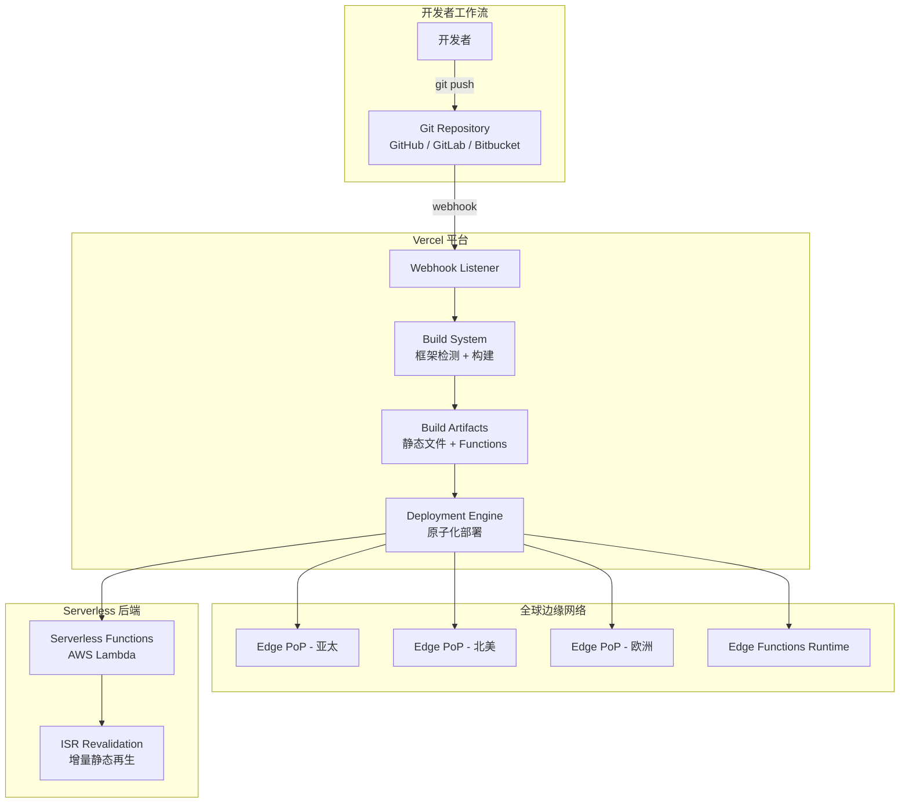

> **生产环境安全提示**
>
> 本文档包含可直接执行的运维命令。执行前请确认：当前目标集群与 Namespace 是否正确；是否具备足够的 RBAC 权限；是否已在非生产环境验证。命令风险等级标注：🔴 高风险（可能造成数据丢失或服务中断）、🟡 中风险（会修改集群状态，但通常可回滚）、🟢 低风险/只读（信息收集，无副作用）。


# Vercel 前端部署平台深度指南
# Vercel Frontend Deployment Platform In-Depth Guide

> **领域**: 平台工程 | [[22-概念/09-平台与发布/platform-engineering-sre.md|Platform Engineering]]  
> **难度**: 入门到中级 | Beginner to Intermediate  
> **阅读时间**: 约 45 分钟 | ~45 min read  
> **最后更新**: 2026-04-03

---

<!-- chunk: 目录 | Table of Contents -->## 目录 | Table of Contents

1. [Vercel 概述与定位](#1-vercel-概述与定位)
2. [核心架构解析](#2-核心架构解析)
3. [快速入门指南](#3-快速入门指南)
4. [项目部署实战](#4-项目部署实战)
5. [Serverless Functions](#5-serverless-functions)
6. [Edge Functions 与 Edge Middleware](#6-edge-functions-与-edge-middleware)
7. [自定义域名与 DNS 配置](#7-自定义域名与-dns-配置)
8. [环境变量与密钥管理](#8-环境变量与密钥管理)
9. [Preview [[deployments|Deployments]] 协作工作流](#9-preview-deployments-协作工作流)
10. [性能优化与 Web Analytics](#10-性能优化与-web-analytics)
11. [前端框架选型：Next.js 与主流框架对比](#11-前端框架选型nextjs-与主流框架对比)
12. [与 [[kubernetes|Kubernetes]]/云原生生态的关系](#12-与-kubernetes云原生生态的关系)
13. [企业级功能与安全](#13-企业级功能与安全)
14. [常见问题与故障排查](#14-常见问题与故障排查)
15. [最佳实践总结](#15-最佳实践总结)

---

<!-- chunk: 1. Vercel 概述与定位 -->## 1. Vercel 概述与定位

## 1.1 什么是 Vercel？

**Vercel** 是一个面向前端开发者的云平台 (PaaS)，由 Next.js 的创造者 Guillermo Rauch 创立，专注于为 Web 应用提供零配置部署、全球边缘网络加速和 Serverless 计算能力。

> **核心理念**: "Develop. Preview. Ship."  
> 开发 → 预览 → 发布，极致简化从代码到上线的全流程。

```
传统部署模式
┌─────────────────────────────────────────────────────────────────┐
│ 开发 → 构建 → 配置服务器 → 配置 Nginx → 配置 SSL → 配置 CDN → 上线  │
│ Dev  → Build → Server Setup → Nginx → SSL → CDN → Deploy       │
│                     耗时：数小时到数天                              │
└─────────────────────────────────────────────────────────────────┘

Vercel 部署模式
┌─────────────────────────────────────────────────────────────────┐
│ 开发 → git push → 自动构建 + 全球分发 + HTTPS → 上线              │
│ Dev  → git push → Auto Build + Global CDN + HTTPS → Live        │
│                     耗时：数十秒到数分钟                            │
└─────────────────────────────────────────────────────────────────┘
```

## 1.2 Vercel 在开发者平台生态中的定位

```
开发者平台分层视图
┌──────────────────────────────────────────────────┐
│              应用层 (Application Layer)            │
│  ┌────────┐ ┌────────┐ ┌────────┐ ┌───────────┐  │
│  │ Vercel │ │Netlify │ │Render  │ │Cloudflare │  │
│  │ Pages  │ │        │ │        │ │  Pages    │  │
│  └────────┘ └────────┘ └────────┘ └───────────┘  │
├──────────────────────────────────────────────────┤
│           Serverless 层 (Compute Layer)           │
│  ┌────────┐ ┌────────┐ ┌────────┐ ┌───────────┐  │
│  │Vercel  │ │AWS     │ │GCP     │ │Cloudflare │  │
│  │Funcs   │ │Lambda  │ │Cloud   │ │Workers    │  │
│  │        │ │        │ │Funcs   │ │           │  │
│  └────────┘ └────────┘ └────────┘ └───────────┘  │
├──────────────────────────────────────────────────┤
│          基础设施层 (Infrastructure Layer)         │
│  ┌────────┐ ┌────────┐ ┌────────┐ ┌───────────┐  │
│  │  AWS   │ │  GCP   │ │ Azure  │ │  阿里云   │  │
│  └────────┘ └────────┘ └────────┘ └───────────┘  │
├──────────────────────────────────────────────────┤
│        容器编排层 (Orchestration Layer)            │
│  ┌────────────────────────────────────────────┐   │
│  │              Kubernetes                     │   │
│  └────────────────────────────────────────────┘   │
└──────────────────────────────────────────────────┘
```

## 1.3 核心功能矩阵

| 功能 | 说明 | 适用场景 |
|------|------|---------|
| **零配置部署** | Git push 自动触发构建和部署 | 所有前端项目 |
| **全球 Edge Network** | 全球 CDN 节点自动就近分发 | 需要低延迟的面向用户应用 |
| **Preview Deployments** | 每个 PR/分支自动生成唯一预览 URL | 团队协作、代码审查 |
| **Serverless Functions** | Node.js/Go/Python/Ruby 后端函数 | 轻量 API、BFF 层 |
| **Edge Functions** | 在边缘节点执行的轻量函数 | 认证、A/B 测试、地理路由 |
| **自定义域名 + HTTPS** | 自动配置 SSL/TLS 证书 | 生产环境 |
| **Web Analytics** | 内置 Core Web Vitals 性能分析 | 性能优化、用户体验监控 |
| **AI SDK** | 构建 AI 驱动 Web 应用的工具集 | LLM 应用、AI Chatbot |

## 1.4 支持的框架

```yaml
一等公民支持 (First-class):
  - Next.js          # Vercel 亲生框架，深度集成
  - SvelteKit        # Svelte 官方全栈框架

完整支持 (Full Support):
  - React (Vite/CRA) # 纯前端 SPA
  - Vue.js / Nuxt    # Vue 生态
  - Astro            # 内容驱动站点
  - Remix            # React 全栈框架
  - Angular          # 企业级前端
  - Solid / SolidStart

静态站点 (Static Sites):
  - Hugo             # Go 模板引擎
  - Gatsby           # React 静态生成
  - Hexo             # Node.js 博客框架
  - Jekyll           # Ruby 静态站点
  - VitePress / VuePress
  - Docusaurus       # 文档站点
```

---

<!-- chunk: 2. 核心架构解析 -->## 2. 核心架构解析

## 2.1 部署架构



## 2.2 请求处理流程

```
用户请求处理流程 (Request Flow)

用户浏览器
    │
    ▼
Vercel Edge Network (最近的 PoP 节点)
    │
    ├── 静态资源 → Edge Cache 命中 → 直接返回 (< 50ms)
    │
    ├── Edge Function → 边缘执行 (< 100ms 冷启动)
    │   └── 认证检查、地理路由、A/B 测试、请求重写
    │
    ├── SSR/API Route → Serverless Function 执行
    │   └── 按需计算，自动扩缩容
    │
    └── ISR 页面 → 检查缓存有效性
        ├── 缓存有效 → 直接返回
        └── 缓存过期 → 返回旧页面 + 后台重新生成
```

## 2.3 关键技术概念

| 概念 | 缩写 | 说明 |
|------|------|------|
| Static Generation | SSG | 构建时预渲染 HTML，适合内容不频繁变化的页面 |
| Server-Side Rendering | SSR | 每次请求时服务端渲染，适合动态个性化内容 |
| Incremental Static Regeneration | ISR | SSG + 按需再生，兼顾性能和时效性 |
| Edge Middleware | - | 在 CDN 边缘运行的轻量逻辑，最低延迟 |
| Atomic Deployments | - | 部署原子性，要么全部成功要么不变更 |
| Immutable Deployments | - | 每次部署生成唯一 URL，永不被覆盖 |

---

<!-- chunk: 3. 快速入门指南 -->## 3. 快速入门指南

## 3.1 前置准备

```bash
# 1. 确认 Node.js 版本 (推荐 18.x 或 20.x)
node --version
# 预期输出: v20.x.x

# 2. 确认包管理器 (npm/yarn/pnpm 均可)
npm --version
# 预期输出: 10.x.x

# 3. 安装 Vercel CLI
npm install -g vercel

# 4. 验证安装
vercel --version
# 预期输出: Vercel CLI 3x.x.x
```

## 3.2 方式一：从模板创建 (推荐新手)

```bash
# 使用 Next.js 模板创建项目
npx create-next-app@latest my-app
cd my-app

# 本地开发
npm run dev
# 预期输出:
#   ▲ Next.js 14.x.x
#   - Local:        http://localhost:3000
#   - Environments: .env.local

# 确认本地运行正常后，部署到 Vercel
vercel

# 首次执行会引导登录和项目配置：
# ? Set up and deploy "~/my-app"? [Y/n] y
# ? Which scope do you want to deploy to? → 选择你的账户
# ? Link to existing project? [y/N] n
# ? What's your project's name? → my-app
# ? In which directory is your code located? → ./
# ✅ Production: https://my-app-xxxx.vercel.app
```

## 3.3 方式二：导入已有 Git 仓库

```bash
# 步骤 1: 登录 Vercel
vercel login
# 选择登录方式: GitHub / GitLab / Bitbucket / Email
# 浏览器会自动打开完成认证

# 步骤 2: 进入已有项目目录
cd /path/to/your-existing-project

# 步骤 3: 链接到 Vercel
vercel link
# ? What's your project's name? → your-project
# ? In which directory is your code located? → ./
# ✅ Linked to your-account/your-project

# 步骤 4: 部署
vercel --prod
# 预期输出:
# 🔍 Inspect: https://vercel.com/your-account/your-project/xxxx
# ✅ Production: https://your-project.vercel.app
```

## 3.4 方式三：通过 Web 界面导入

```
操作步骤:
1. 访问 https://vercel.com/new
2. 点击 "Import Git Repository"
3. 选择 GitHub/GitLab/Bitbucket 并授权
4. 选择要导入的仓库
5. Vercel 自动检测框架并配置构建命令
6. 点击 "Deploy" → 等待构建完成
7. 获得生产 URL: https://your-project.vercel.app
```

## 3.5 CLI 常用命令速查

```bash
# === 部署相关 ===
vercel                     # 部署到 Preview 环境
vercel --prod              # 部署到 Production 环境
vercel --prebuilt          # 使用预构建产物部署

# === 开发相关 ===
vercel dev                 # 本地模拟 Vercel 环境运行
vercel build               # 本地构建 (不部署)

# === 环境变量 ===
vercel env add             # 添加环境变量
vercel env ls              # 列出环境变量
vercel env pull .env.local # 拉取环境变量到本地文件

# === 项目管理 ===
vercel link                # 链接本地目录到 Vercel 项目
vercel inspect <url>       # 查看部署详情
vercel logs <url>          # 查看部署日志
vercel rollback            # 回滚到上一个生产部署

# === 域名管理 ===
vercel domains add <domain>    # 添加自定义域名
vercel domains ls              # 列出所有域名
vercel certs ls                # 列出 SSL 证书
```

---

<!-- chunk: 4. 项目部署实战 -->## 4. 项目部署实战

## 4.1 Next.js 项目 (全栈)

```bash
# 创建 Next.js 项目
npx create-next-app@latest my-nextjs-app --typescript --tailwind --app
cd my-nextjs-app
```

**项目结构**:

```
my-nextjs-app/
├── app/
│   ├── layout.tsx          # 根布局
│   ├── page.tsx            # 首页
│   ├── api/
│   │   └── hello/
│   │       └── route.ts    # API Route → 自动部署为 Serverless Function
│   └── blog/
│       └── [slug]/
│           └── page.tsx    # 动态路由
├── public/                 # 静态资源 → 自动部署到 Edge CDN
├── next.config.js
├── package.json
└── vercel.json             # Vercel 配置 (可选)
```

**vercel.json 配置示例**:

```json
{
  "framework": "nextjs",
  "buildCommand": "npm run build",
  "outputDirectory": ".next",
  "regions": ["hnd1", "sfo1"],
  "headers": [
    {
      "source": "/api/(.*)",
      "headers": [
        { "key": "Cache-Control", "value": "no-store" },
        { "key": "Access-Control-Allow-Origin", "value": "*" }
      ]
    },
    {
      "source": "/(.*)",
      "headers": [
        { "key": "X-Frame-Options", "value": "DENY" },
        { "key": "X-Content-Type-Options", "value": "nosniff" }
      ]
    }
  ],
  "rewrites": [
    { "source": "/api/proxy/:path*", "destination": "https://backend.example.com/:path*" }
  ],
  "redirects": [
    { "source": "/old-page", "destination": "/new-page", "permanent": true }
  ]
}
```

## 4.2 纯静态站点 (VitePress / Hugo)

```bash
# VitePress 文档站点
npm init vitepress@latest my-docs
cd my-docs

# vercel.json 配置
cat > vercel.json << 'EOF'
{
  "buildCommand": "npm run docs:build",
  "outputDirectory": ".vitepress/dist",
  "cleanUrls": true
}
EOF

# 部署
vercel --prod
```

## 4.3 Monorepo 部署

```json
{
  "buildCommand": "cd packages/web && npm run build",
  "outputDirectory": "packages/web/dist",
  "installCommand": "npm install --workspace=packages/web",
  "rootDirectory": "packages/web"
}
```

---

<!-- chunk: 5. Serverless Functions -->## 5. Serverless Functions

## 5.1 基本用法

```
文件路径映射关系:
api/hello.ts          →  GET/POST https://your-app.vercel.app/api/hello
api/users/[id].ts     →  GET/POST https://your-app.vercel.app/api/users/123
api/data/index.ts     →  GET/POST https://your-app.vercel.app/api/data
```

**TypeScript 示例**:

```typescript
// api/hello.ts
import type { VercelRequest, VercelResponse } from '@vercel/node';

export default function handler(req: VercelRequest, res: VercelResponse) {
  const { name = 'World' } = req.query;
  res.status(200).json({ message: `Hello, ${name}!` });
}
```

**Next.js App Router 示例**:

```typescript
// app/api/users/route.ts
import { NextResponse } from 'next/server';

export async function GET(request: Request) {
  const { searchParams } = new URL(request.url);
  const page = searchParams.get('page') || '1';

  const users = await fetchUsersFromDB(Number(page));
  return NextResponse.json({ users, page });
}

export async function POST(request: Request) {
  const body = await request.json();
  const user = await createUser(body);
  return NextResponse.json(user, { status: 201 });
}
```

## 5.2 Serverless Function 配置

```json
{
  "functions": {
    "api/heavy-task.ts": {
      "memory": 1024,
      "maxDuration": 30
    },
    "api/quick-response.ts": {
      "memory": 128,
      "maxDuration": 5
    }
  }
}
```

**配置参数说明**:

| 参数 | 默认值 | 范围 | 说明 |
|------|--------|------|------|
| `memory` | 1024 MB | 128 - 3008 MB | 函数运行内存 |
| `maxDuration` | 10s (Hobby) / 60s (Pro) | 1 - 300s | 最大执行时间 |
| `regions` | `iad1` | 见区域列表 | 函数部署区域 |

---

<!-- chunk: 6. Edge Functions 与 Edge Middleware -->## 6. Edge Functions 与 Edge Middleware

## 6.1 Edge Middleware

Edge Middleware 在请求到达应用之前执行，运行在全球所有边缘节点，延迟极低。

```typescript
// middleware.ts (项目根目录)
import { NextResponse } from 'next/server';
import type { NextRequest } from 'next/server';

export function middleware(request: NextRequest) {
  // 示例 1: 地理位置路由
  const country = request.geo?.country || 'US';
  if (country === 'CN') {
    return NextResponse.redirect(new URL('/zh', request.url));
  }

  // 示例 2: 认证检查
  const token = request.cookies.get('auth-token');
  if (!token && request.nextUrl.pathname.startsWith('/dashboard')) {
    return NextResponse.redirect(new URL('/login', request.url));
  }

  // 示例 3: A/B 测试
  const bucket = request.cookies.get('ab-bucket')?.value || 
    (Math.random() > 0.5 ? 'a' : 'b');
  const response = NextResponse.next();
  response.cookies.set('ab-bucket', bucket);
  
  if (bucket === 'b') {
    return NextResponse.rewrite(new URL('/experiment-b' + request.nextUrl.pathname, request.url));
  }

  return response;
}

export const config = {
  matcher: ['/((?!api|_next/static|favicon.ico).*)'],
};
```

## 6.2 Edge Functions vs Serverless Functions

| 对比维度 | Edge Functions | Serverless Functions |
|---------|---------------|---------------------|
| 执行位置 | 全球所有边缘节点 | 指定区域 (如 `iad1`) |
| 冷启动 | < 100ms | 250ms - 1s |
| 运行时 | V8 Isolate (轻量) | Node.js / Go / Python |
| 最大执行时间 | 30s | 10s - 300s |
| 内存 | 128 MB | 128 - 3008 MB |
| 支持的 API | Web Standard APIs | 完整 Node.js API |
| 适用场景 | 认证、路由、A/B 测试 | 数据库操作、复杂逻辑 |

---

<!-- chunk: 7. 自定义域名与 DNS 配置 -->## 7. 自定义域名与 DNS 配置

## 7.1 添加自定义域名

```bash
# CLI 方式
vercel domains add example.com

# 验证域名所有权 (添加 TXT 记录)
# 预期输出:
# > Verification required. Add the following TXT record:
# > Name:  _vercel.example.com
# > Value: vc-domain-verify=xxxxxxxxxxxx
```

## 7.2 DNS 配置

```
配置方式一: Vercel DNS (推荐)
将域名 Nameservers 指向 Vercel:
  ns1.vercel-dns.com
  ns2.vercel-dns.com

配置方式二: 外部 DNS
添加以下记录:
  类型    名称    值
  A       @       76.76.21.21
  CNAME   www     cname.vercel-dns.com
```

## 7.3 HTTPS/SSL 证书

```
自动化证书管理流程:
1. 添加域名 → Vercel 自动发起 Let's Encrypt 证书申请
2. DNS 验证通过 → 自动签发证书
3. 证书到期前 → 自动续期
4. 全程无需手动干预
```

---

<!-- chunk: 8. 环境变量与密钥管理 -->## 8. 环境变量与密钥管理

## 8.1 环境变量类型

```bash
# 添加环境变量 (交互式)
vercel env add DATABASE_URL

# 选择环境:
# ? Which Environments? (select multiple)
#   ● Production    → 生产环境
#   ● Preview       → 预览部署
#   ● Development   → vercel dev 本地开发

# 拉取环境变量到本地
vercel env pull .env.local
```

## 8.2 敏感信息处理

```
环境变量安全最佳实践:
✅ 数据库密码、API Key → 使用 Vercel Environment Variables (加密存储)
✅ 非敏感配置 → 可放在 vercel.json 或代码中
❌ 永远不要将密钥提交到 Git 仓库
❌ 不要在客户端代码中使用无 NEXT_PUBLIC_ 前缀的环境变量

Next.js 环境变量前缀规则:
  NEXT_PUBLIC_*  → 会暴露给浏览器端 (打包进 JS Bundle)
  其他           → 仅服务端可用 (Serverless Functions / SSR)
```

---

<!-- chunk: 9. Preview Deployments 协作工作流 -->## 9. Preview Deployments 协作工作流

## 9.1 工作流

```
Preview Deployment 工作流:

1. 开发者创建 feature branch
   └── git checkout -b feature/new-header

2. Push 到远程仓库
   └── git push origin feature/new-header

3. Vercel 自动触发 Preview 部署
   └── 生成唯一 URL: https://project-git-feature-new-header-team.vercel.app

4. 创建 Pull Request
   └── Vercel Bot 自动评论 PR，附带预览链接和构建状态

5. 团队成员点击预览链接审查
   └── 可通过 Vercel Toolbar 直接在页面上评论

6. PR 合并到 main 分支
   └── 自动触发 Production 部署

7. Preview 部署保留为历史快照
   └── 可随时回顾任意版本
```

## 9.2 Vercel Bot 在 PR 中的集成

```
GitHub PR 中 Vercel Bot 自动评论内容:

✅ Deploy Preview ready!

🔗 Preview: https://project-xxxx.vercel.app
📝 Inspect: https://vercel.com/team/project/xxxx

┌──────────────────────┬─────────────┐
│ Build Logs           │ View Logs   │
│ Bundle Size          │ 156 kB      │
│ First Load JS        │ 89 kB       │
│ Pages                │ 12          │
│ Serverless Functions │ 3           │
│ Edge Functions       │ 1           │
└──────────────────────┴─────────────┘
```

---

<!-- chunk: 10. 性能优化与 Web Analytics -->## 10. 性能优化与 Web Analytics

## 10.1 Vercel Speed Insights

```
Core Web Vitals 监控指标:

┌────────────────┬────────────┬──────────────────────────┐
│ 指标           │ 目标值     │ 含义                     │
├────────────────┼────────────┼──────────────────────────┤
│ LCP            │ < 2.5s     │ 最大内容绘制时间          │
│ FID            │ < 100ms    │ 首次输入延迟             │
│ CLS            │ < 0.1      │ 累计布局偏移             │
│ INP            │ < 200ms    │ 交互到下次绘制延迟        │
│ TTFB           │ < 800ms    │ 首字节时间               │
└────────────────┴────────────┴──────────────────────────┘
```

## 10.2 性能优化清单

```yaml
静态资源优化:
  - 使用 next/image 自动优化图片 (WebP/AVIF 转换、懒加载)
  - 启用 gzip/brotli 压缩 (Vercel 默认开启)
  - 合理设置 Cache-Control 头

渲染策略选择:
  - 内容变化少 → SSG (构建时生成)
  - 内容定期更新 → ISR (增量再生，设置 revalidate)
  - 高度个性化 → SSR + Edge Cache
  - 纯客户端交互 → CSR (Client-Side Rendering)

代码拆分:
  - 使用 dynamic import 按需加载
  - 分析 Bundle Size: vercel inspect <deployment-url>
  - 使用 @next/bundle-analyzer 可视化分析
```

---

<!-- chunk: 11. 前端框架选型：Next.js 与主流框架对比 -->## 11. 前端框架选型：Next.js 与主流框架对比

在 Vercel 上部署项目，框架选型至关重要。Next.js 作为 Vercel 的「亲生框架」拥有最深度的集成，但并非所有场景都适合。本节帮助你做出正确选择。

## 11.1 渲染模式对比

| 框架 | 默认渲染方式 | 服务端渲染 (SSR) | 静态生成 (SSG) | 增量再生 (ISR) |
|------|------------|-----------------|---------------|---------------|
| **Next.js** | 服务端优先 (RSC) | ✅ 原生 | ✅ 原生 | ✅ 独有 |
| **React (Vite/CRA)** | 纯客户端 (CSR) | ❌ 需自建 | ❌ | ❌ |
| **Vue (Vite)** | 纯客户端 (CSR) | ❌ 需自建 | ❌ | ❌ |
| **Nuxt** | 服务端优先 | ✅ 原生 | ✅ 原生 | ✅ |
| **Astro** | 静态优先 (零JS) | ✅ 可选 | ✅ 原生 | ❌ |
| **Remix** | 服务端优先 | ✅ 原生 | ❌ | ❌ |
| **SvelteKit** | 服务端优先 | ✅ 原生 | ✅ 原生 | ❌ |

## 11.2 Next.js vs 纯前端框架核心差异

```
┌─────────────────┬──────────────────┬──────────────────┐
│                 │ React/Vue (纯SPA) │ Next.js (全栈)    │
├─────────────────┼──────────────────┼──────────────────┤
│ 首屏加载        │ 白屏→加载JS→渲染  │ 服务端直出HTML     │
│ SEO             │ ❌ 搜索引擎看不到  │ ✅ 完整HTML可索引  │
│ 路由            │ 需装 react-router │ 文件系统自动路由   │
│ API 后端        │ 需独立后端服务     │ 内置 API Routes   │
│ 图片优化        │ 手动处理          │ next/image 自动优化│
│ 代码拆分        │ 手动 lazy import  │ 自动按页面拆分     │
│ 部署            │ 纯静态文件        │ 需 Node.js 或 Vercel│
└─────────────────┴──────────────────┴──────────────────┘

一句话总结：React 是引擎，Next.js 是整车。
```

## 11.3 Next.js 独有的杀手级特性

| 特性 | 说明 |
|------|------|
| **App Router + RSC** | React Server Components，组件在服务端执行，不发送 JS 到浏览器 |
| **ISR** | 增量静态再生 —— 静态页面可按需后台刷新，兼顾速度和时效性 |
| **Middleware** | 在 Edge 层拦截请求，做认证/路由/A/B 测试 |
| **next/image** | 自动 WebP/AVIF 转换、响应式尺寸、懒加载 |
| **next/font** | 字体零 CLS（布局偏移），自动 self-host Google Fonts |
| **Server Actions** | 表单直接调服务端函数，无需手写 API |

## 11.4 框架选型决策指南

```yaml
选 Next.js:
  - 需要 SEO (官网、博客、电商、文档站)
  - 需要首屏快速加载 (SSR/SSG)
  - 想要全栈一体 (前端 + API 在一个项目)
  - 团队用 React 生态
  - 部署到 Vercel (天然最优)

选纯 React (Vite):
  - 纯后台管理系统 (不需要 SEO)
  - 内嵌 WebView / Electron 应用
  - 项目极简，不需要服务端逻辑
  - 团队对 SSR 没有需求

选 Vue / Nuxt:
  - 团队更熟悉 Vue 语法 (模板 vs JSX)
  - Nuxt 约等于 Vue 生态的 Next.js

选 Astro:
  - 内容驱动站点 (博客/文档)
  - 追求极致轻量 (默认零 JS 发送到浏览器)
  - 可混用 React/Vue/Svelte 组件
```

## 11.5 Vercel 上各框架的部署体验

| 框架 | Vercel 集成度 | 零配置部署 | 特殊优化 |
|------|-------------|-----------|----------|
| **Next.js** | ⭐⭐⭐⭐⭐ | ✅ | ISR、Edge Runtime、Image Optimization、PPR |
| **Nuxt** | ⭐⭐⭐⭐ | ✅ | Nitro server 自动适配 |
| **SvelteKit** | ⭐⭐⭐⭐ | ✅ | adapter-vercel 官方维护 |
| **Astro** | ⭐⭐⭐⭐ | ✅ | @astrojs/vercel 官方适配器 |
| **Remix** | ⭐⭐⭐ | ✅ | @vercel/remix 适配 |
| **React (Vite)** | ⭐⭐⭐ | ✅ | 纯静态，CDN 分发 |
| **Vue (Vite)** | ⭐⭐⭐ | ✅ | 纯静态，CDN 分发 |
| **Angular** | ⭐⭐ | ✅ | 基础支持 |

> **结论**: 如果你选择 Vercel 作为部署平台，Next.js 能获得最多的平台级优化（ISR、Edge Middleware、Image Optimization 等）。但其他框架同样可以顺畅部署，只是少了部分高级特性。

---

<!-- chunk: 12. 与 Kubernetes/云原生生态的关系 -->## 12. 与 Kubernetes/云原生生态的关系

## 12.1 定位对比

```
# 🟢 低风险：只读/信息收集，通常无副作用
Vercel vs Kubernetes: 不同抽象层级

Vercel (前端 PaaS 层)
├── 开发者只关心: 代码 + 配置
├── 不需要管理: 服务器、容器、网络、扩缩容
├── 适合: 前端应用、JAMstack、轻量全栈
└── 底层: AWS Lambda + CloudFront (由 Vercel 管理)

Kubernetes (容器编排层)
├── 运维需要管理: Pod、Service、Ingress、HPA、PV...
├── 完全可控: 网络策略、资源配额、安全策略
├── 适合: 微服务架构、有状态服务、复杂后端
└── 底层: 云厂商 VM / 裸金属
```
## 12.2 混合架构模式

在企业中，Vercel 与 Kubernetes 常常互补使用：

```
企业级混合架构示例:

┌─────────────────────────────────────────────────────┐
│                     用户请求                         │
│                        │                             │
│                    ┌───▼───┐                         │
│                    │  CDN  │                         │
│                    └───┬───┘                         │
│               ┌────────┴────────┐                    │
│               ▼                 ▼                    │
│     ┌─────────────────┐  ┌──────────────────┐       │
│     │  Vercel          │  │  Kubernetes       │       │
│     │  ─────           │  │  ──────────       │       │
│     │  • 营销官网      │  │  • 核心业务 API   │       │
│     │  • 文档站点      │  │  • 微服务集群     │       │
│     │  • 管理后台前端  │  │  • 数据库服务     │       │
│     │  • Landing Pages │  │  • 消息队列       │       │
│     │  • AI Chatbot UI │  │  • ML 推理服务    │       │
│     └────────┬────────┘  └────────┬─────────┘       │
│              │                    │                   │
│              └────────┬───────────┘                   │
│                       │                               │
│              ┌────────▼──────────┐                    │
│              │ 共享基础设施       │                    │
│              │ • 认证服务 (SSO)  │                    │
│              │ • 对象存储 (S3)   │                    │
│              │ • 监控告警        │                    │
│              └───────────────────┘                    │
└─────────────────────────────────────────────────────┘
```

## 12.3 何时用 Vercel，何时用 Kubernetes

| 场景 | 推荐方案 | 原因 |
|------|---------|------|
| 公司官网 / 营销页面 | Vercel | 零运维、全球 CDN、SEO 友好 |
| 文档站点 | Vercel | 静态生成、自动部署 |
| 管理后台前端 | Vercel | 快速迭代、Preview 部署 |
| 核心业务 API | Kubernetes | 需要持久连接、复杂编排 |
| 微服务集群 | Kubernetes | 服务发现、负载均衡、弹性 |
| 有状态服务 (数据库等) | Kubernetes | 持久存储、有状态集管理 |
| AI/ML 推理服务 | Kubernetes | GPU 调度、自定义运行时 |
| 轻量 BFF / API 网关 | Vercel Serverless | 按需扩缩、无服务器管理 |

---

<!-- chunk: 13. 企业级功能与安全 -->## 13. 企业级功能与安全

## 13.1 Vercel 计划对比

| 功能 | Hobby (免费) | Pro ($20/月) | Enterprise |
|------|-------------|-------------|------------|
| 部署数 | 无限 | 无限 | 无限 |
| 带宽 | 100 GB | 1 TB | 自定义 |
| Serverless 执行时间 | 10s | 60s | 300s |
| 团队成员 | 1 | 无限 | 无限 |
| Preview Deployments | ✅ | ✅ | ✅ |
| 自定义域名 | ✅ | ✅ | ✅ |
| DDoS 防护 | 基础 | 高级 | 企业级 |
| SSO/SAML | ❌ | ❌ | ✅ |
| SLA | ❌ | 99.99% | 自定义 |
| 审计日志 | ❌ | ❌ | ✅ |
| IP 白名单 | ❌ | ❌ | ✅ |

## 13.2 安全最佳实践

```yaml
部署安全:
  - 启用 Deployment Protection: 仅授权用户可访问 Preview 部署
  - 启用 Git Authentication: 确保仅受信任的仓库可触发部署
  - 定期轮换环境变量中的密钥

网络安全:
  - 配置安全响应头 (CSP, HSTS, X-Frame-Options)
  - 使用 Vercel Firewall (Enterprise) 配置 WAF 规则
  - 启用 DDoS 防护

代码安全:
  - 不在客户端暴露敏感环境变量
  - 使用 Vercel 的 Secret 管理功能
  - 启用依赖项安全扫描
```

---

<!-- chunk: 14. 常见问题与故障排查 -->## 14. 常见问题与故障排查

## 14.1 构建失败

```bash
# 查看构建日志
vercel logs <deployment-url>

# 常见构建错误及解决方案:

# 错误: Module not found
# 原因: 依赖未正确安装
# 解决: 确认 package.json 中包含所有依赖，检查 .gitignore 是否误忽略了文件

# 错误: Build exceeded maximum duration
# 原因: 构建超时 (Hobby: 45min, Pro: 45min)
# 解决: 优化构建过程，减少不必要的构建步骤

# 错误: Function size too large (> 50MB)
# 原因: Serverless Function 打包体积超限
# 解决: 检查依赖，使用 tree-shaking，排除不必要的包
```

## 14.2 部署成功但页面异常

```bash
# 检查步骤:
# 1. 确认本地 vercel dev 是否正常
vercel dev

# 2. 检查环境变量是否在所有环境都配置
vercel env ls

# 3. 检查 vercel.json 配置
# 常见问题: rewrites/redirects 规则冲突

# 4. 查看 Function 日志
vercel logs <deployment-url> --follow

# 5. 使用 Inspect 查看部署详情
vercel inspect <deployment-url>
```

## 14.3 性能问题

```
性能排查清单:

1. TTFB 过高
   ├── 检查 Serverless Function 冷启动 → 考虑使用 Edge Functions
   ├── 检查数据库查询延迟 → 确保数据库与 Function 在同一区域
   └── 检查 Function 区域配置 → vercel.json regions 字段

2. LCP 过高
   ├── 检查图片是否使用 next/image 优化
   ├── 检查字体加载策略 → 使用 next/font
   └── 检查首屏是否有不必要的客户端渲染

3. Bundle Size 过大
   ├── 使用 @next/bundle-analyzer 分析
   ├── 检查是否有未 tree-shake 的库
   └── 考虑使用 dynamic import 拆分
```

---

<!-- chunk: 15. 最佳实践总结 -->## 15. 最佳实践总结

## 15.1 项目配置最佳实践

```yaml
推荐项目配置:
  框架选择:
    - 全栈应用: Next.js (App Router)
    - 文档站点: VitePress / Docusaurus
    - 静态博客: Astro
    - 轻量 SPA: React + Vite

  部署配置:
    - 始终使用 vercel.json 声明配置
    - 为 Serverless Functions 设置合理的 memory 和 maxDuration
    - 配置安全响应头
    - 使用 regions 指定最近区域

  团队协作:
    - 充分利用 Preview Deployments 进行代码审查
    - 使用 Vercel Comments 在预览页面上直接反馈
    - 按环境分离环境变量 (Production / Preview / Development)

  性能优化:
    - 优先使用 SSG/ISR，减少 SSR
    - 使用 Edge Middleware 处理认证和路由
    - 使用 next/image 和 next/font 优化资源加载
    - 监控 Core Web Vitals，保持 Performance Score > 90
```

## 15.2 Vercel 学习资源

| 资源 | 链接 | 说明 |
|------|------|------|
| Vercel 官方文档 | https://vercel.com/docs | 权威技术文档 |
| Next.js 官方文档 | https://nextjs.org/docs | Next.js 框架文档 |
| Vercel Templates | https://vercel.com/templates | 开箱即用的项目模板 |
| Vercel Blog | https://vercel.com/blog | 技术博客和最佳实践 |
| AI SDK 文档 | https://sdk.vercel.ai | 构建 AI 应用的工具集 |
| Next.js Learn | https://nextjs.org/learn | 官方交互式教程 |

---

<!-- chunk: 参考链接 -->## 参考链接

- [Vercel 官网](https://vercel.com)
- [Vercel CLI 文档](https://vercel.com/docs/cli)
- [Next.js on Vercel](https://vercel.com/docs/frameworks/nextjs)
- [Vercel Edge Functions](https://vercel.com/docs/functions/edge-functions)
- [Vercel AI SDK](https://sdk.vercel.ai)

---

*本文档由云原生技术专家团队维护，内容基于 2026 年 Vercel 最新平台特性。*

---

<!-- chunk: Obsidian 相关文档 -->## Obsidian 相关文档

- 平台工程 KUDIG Database — Global MOC
- [[10-平台工程/README.md|Domain 07: 平台工程 (Platform Engineering)]]
- Domain-36 平台工程 — 开源项目索引
- 平台工程概述与成熟度模型
- 内部开发者平台设计原则
- Backstage 部署与配置
- Backstage 软件目录与 TechDocs
- Backstage 脚手架与模板系统
- Kratix 平台即代码 (Kratix Platform as Code)
- Crossplane 平台组合 (Crossplane Platform Composition)
- Golden Paths 黄金路径设计 (Golden Paths Design Patterns)
- 开发者体验度量 (Developer Experience Metrics)

## See Also

- 09-developer-experience-metrics
- 10-platform-team-topology
- 99-backstage-idp-guide
- 01-platform-engineering-overview


<!-- risk-assessed -->
