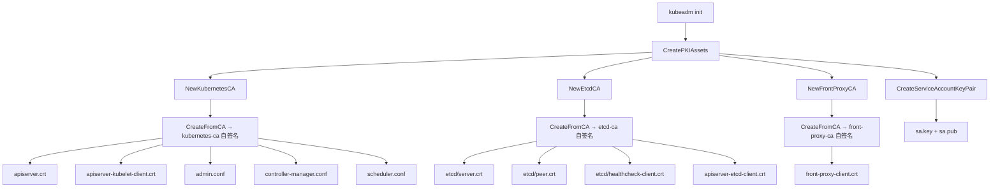

> **生产环境安全提示**
>
> 本文档包含可直接执行的运维命令。执行前请确认：当前目标集群与 Namespace 是否正确；是否具备足够的 RBAC 权限；是否已在非生产环境验证。命令风险等级标注：🔴 高风险（可能造成数据丢失或服务中断）、🟡 中风险（会修改集群状态，但通常可回滚）、🟢 低风险/只读（信息收集，无副作用）。


title: Kubernetes 集群 PKI 架构总览
description: '# Kubernetes 集群 PKI 架构总览'
category: functions
tags:
- k8s
- operations
- cluster-management
- etcd
- apiserver
- kubelet
- scheduler
- controller-manager
- containerd
- rbac
last_updated: '2026-05-18'
difficulty: expert
reading_level: expert
audience:
- Kubernetes 管理员
- 安全工程师
- 集群运维人员
- DevOps 工程师
estimated_read_time: 5min
intent_queries:
- Kubernetes 三组 CA 架构设计 kubernetes-ca etcd-ca front-proxy-ca
- kubeadm PKI 证书生成流程 CreatePKIAssets 源码分析
- Kubernetes 证书信任链 validation certificate chain
- kubeadm 证书生成 14 个证书密钥对完整列表
- Kubernetes PKI 架构 三组 CA 独立信任域设计
trigger_keywords:
- kubernetes-ca
- etcd-ca
- front-proxy-ca
- PKI 架构
- CreatePKIAssets
- 证书信任链
- kubeadm 证书生成
- 证书路径
- 证书有效期
- 独立信任域
related_domains:
- 集群基础
- 安全
related_topics:
- cluster-cert/ca-generation
- cluster-cert/apiserver-cert
- cluster-cert/etcd-cert
- cluster-cert/kubelet-cert
authors:
- name: KUDIG Team
  role: contributor
k8s_versions:
- '1.28'
- '1.29'
- '1.30'
- '1.31'
- '1.32'
---

# Kubernetes 集群 PKI 架构总览

## 概述

Kubernetes 集群采用多 CA 架构，将不同信任域的证书隔离管理。整个 PKI 体系由 **三组独立的 CA** 构成，分别服务于控制面组件通信、etcd 集群通信和 API 聚合层扩展。本文档从源码层面全面分析 PKI 架构的设计原理、证书签发链路、组件加载顺序以及安全最佳实践。

---

## 函数签名

```go
func CreatePKIAssets(cfg *kubeadmapi.InitConfiguration) error

func NewKubernetesCA() *KubeadmCert

func NewEtcdCA() *KubeadmCert

func NewFrontProxyCA() *KubeadmCert

func (k *KubeadmCert) CreateFromCA(cfg *kubeadmapi.InitConfiguration, caCert *KubeadmCert) error

func CreateServiceAccountKeyPair(cfg *kubeadmapi.InitConfiguration) error

func UsingExternalCA(cfg *kubeadmapi.InitConfiguration) (bool, error)

func ValidateCertPeriod(cert *x509.Certificate, key string) error
```

---

## 源码位置

| 功能 | 文件路径 |
|------|---------|
| 证书阶段主控 | `cmd/kubeadm/app/phases/certs/certs.go` |
| CA 证书定义 | `cmd/kubeadm/app/phases/certs/certs.go` |
| 证书工具封装 | `cmd/kubeadm/app/util/pkiutil/pki_helpers.go` |
| 通用证书生成 | `staging/src/k8s.io/client-go/util/cert/cert.go` |
| CSR 签名控制器 | `pkg/controller/certificates/signer/signer.go` |
| kubelet 证书管理 | `pkg/kubelet/certificate/kubelet.go` |
| 常量定义 | `cmd/kubeadm/app/constants/constants.go` |

---

## 参数说明

| 参数 | 类型 | 说明 |
|------|------|------|
| `cfg` | `*kubeadmapi.InitConfiguration` | kubeadm 初始化配置，包含网络、证书有效期、节点注册等 |
| `cert` | `*x509.Certificate` | X.509 证书对象 |
| `key` | `string` | 证书用途标识，用于日志 |
| `cfg.CertificatesDir` | `string` | PKI 文件存储目录，默认 `/etc/kubernetes/pki` |
| `cfg.CertificateValidityPeriod` | `time.Duration` | 非 CA 证书有效期，默认 1 年 |
| `cfg.Networking.DNSDomain` | `string` | 集群 DNS 域名，默认 `cluster.local` |

---

## 返回值

| 函数 | 返回值 | 说明 |
|------|--------|------|
| `CreatePKIAssets` | `error` | 任何证书生成失败时返回错误 |
| `NewKubernetesCA` | `*KubeadmCert` | Kubernetes CA 证书定义 |
| `UsingExternalCA` | `(bool, error)` | 是否使用外部 CA |
| `ValidateCertPeriod` | `error` | 证书有效期不合法时返回错误 |

---

## 调用链



---

## 源码分析

### 1. CreatePKIAssets — PKI 资产创建入口

```go
func CreatePKIAssets(cfg *kubeadmapi.InitConfiguration) error {
    certList := CertificatesDir(cfg)

    for _, cert := range certList {
        if cert.CAName == "" {
            if err := cert.CreateAsCA(cfg); err != nil {
                return err
            }
        } else {
            caCert := getCA(cert.CAName, certList)
            if err := cert.CreateFromCA(cfg, caCert); err != nil {
                return err
            }
        }
    }

    if err := CreateServiceAccountKeyPair(cfg); err != nil {
        return err
    }

    return nil
}
```

### 2. 三组 CA 的定义

```go
func NewKubernetesCA() *KubeadmCert {
    return &KubeadmCert{
        Name:     "ca",
        LongName: "certificate authority",
        BaseName: KubeadmCertRootCABaseName,
        Config: certutil.Config{
            CommonName: "kubernetes-ca",
        },
    }
}

func NewEtcdCA() *KubeadmCert {
    return &KubeadmCert{
        Name:     "etcd-ca",
        LongName: "etcd certificate authority",
        BaseName: "ca",
        Config: certutil.Config{
            CommonName: "etcd-ca",
        },
    }
}

func NewFrontProxyCA() *KubeadmCert {
    return &KubeadmCert{
        Name:     "front-proxy-ca",
        LongName: "front-proxy certificate authority",
        BaseName: KubeadmCertFrontProxyCA,
        Config: certutil.Config{
            CommonName: "front-proxy-ca",
        },
    }
}
```

### 3. 自签名 CA 创建

```go
func (k *KubeadmCert) CreateAsCA(cfg *kubeadmapi.InitConfiguration) error {
    caCert, caKey, err := pkiutil.NewCertificateAuthority(
        &certutil.Config{
            CommonName: k.Config.CommonName,
        })
    if err != nil {
        return err
    }
    return pkiutil.WriteCertAndKey(cfg.CertificatesDir, k.BaseName, caCert, caKey)
}
```

```go
func NewCertificateAuthority(config *certutil.Config) (*x509.Certificate, *rsa.PrivateKey, error) {
    key, err := NewPrivateKey()
    if err != nil {
        return nil, nil, err
    }
    cert, err := NewSelfSignedCACert(config, key)
    if err != nil {
        return nil, nil, err
    }
    return cert, key, nil
}
```

```go
func NewSelfSignedCACert(config *certutil.Config, key crypto.Signer) (*x509.Certificate, error) {
    serial, _ := rand.Int(rand.Reader, new(big.Int).SetInt64(math.MaxInt64))
    tmpl := x509.Certificate{
        SerialNumber: serial,
        Subject: pkix.Name{
            CommonName:   config.CommonName,
            Organization: config.Organization,
        },
        NotBefore:             time.Now().Add(-5 * time.Minute).UTC(),
        NotAfter:              time.Now().Add(CAValidityPeriod).UTC(),
        KeyUsage:              x509.KeyUsageKeyEncipherment | x509.KeyUsageDigitalSignature | x509.KeyUsageCertSign,
        BasicConstraintsValid: true,
        IsCA:                  true,
    }
    derBytes, _ := x509.CreateCertificate(rand.Reader, &tmpl, &tmpl, key.Public(), key)
    return x509.ParseCertificate(derBytes)
}
```

---

## PKI 架构图

```
┌─────────────────────────────────────────────────────────────────────┐
│                    Kubernetes 集群 PKI 架构                           │
├─────────────────────────────────────────────────────────────────────┤
│                                                                      │
│  ┌─────────────────┐  ┌─────────────────┐  ┌─────────────────┐     │
│  │  kubernetes-ca  │  │    etcd-ca      │  │  front-proxy-ca │     │
│  │   (集群根 CA)    │  │  (etcd 独立 CA)  │  │  (聚合层 CA)     │     │
│  │   默认 10 年     │  │   默认 10 年     │  │   默认 10 年     │     │
│  └────────┬────────┘  └────────┬────────┘  └────────┬────────┘     │
│           │                    │                    │              │
│           ▼                    ▼                    ▼              │
│  ┌─────────────────────────────────────────────────────────────┐  │
│  │                     kubernetes-ca 签发                        │  │
│  │  ├─ apiserver.crt         (API Server 服务端证书)             │  │
│  │  ├─ apiserver-kubelet-client.crt (API Server -> kubelet)     │  │
│  │  ├─ admin.conf            (管理员 kubeconfig)                 │  │
│  │  ├─ controller-manager.conf (kube-controller-manager)        │  │
│  │  ├─ scheduler.conf        (kube-scheduler)                   │  │
│  │  └─ (kubelet 客户端证书通过 CSR 动态签发)                    │  │
│  └─────────────────────────────────────────────────────────────┘  │
│                                                                      │
│  ┌─────────────────────────────────────────────────────────────┐  │
│  │                     etcd-ca 签发                              │  │
│  │  ├─ etcd/server.crt       (etcd 服务端证书)                   │  │
│  │  ├─ etcd/peer.crt         (etcd 对等证书, 集群间通信)         │  │
│  │  ├─ etcd/healthcheck-client.crt (etcd 健康检查客户端证书)     │  │
│  │  └─ apiserver-etcd-client.crt (API Server -> etcd)            │  │
│  └─────────────────────────────────────────────────────────────┘  │
│                                                                      │
│  ┌─────────────────────────────────────────────────────────────┐  │
│  │                  front-proxy-ca 签发                          │  │
│  │  └─ front-proxy-client.crt  (API 聚合层客户端证书)            │  │
│  └─────────────────────────────────────────────────────────────┘  │
│                                                                      │
│  ┌─────────────────────────────────────────────────────────────┐  │
│  │                  ServiceAccount 密钥对                        │  │
│  │  ├─ sa.pub  (公钥, API Server 验证 JWT Token)                 │  │
│  │  └─ sa.key  (私钥, Controller Manager 签名 Token)             │  │
│  └─────────────────────────────────────────────────────────────┘  │
│                                                                      │
└─────────────────────────────────────────────────────────────────────┘
```

---

## 三组 CA 的独立性与设计意图

### 1. kubernetes-ca（集群根 CA）

**设计意图**：
- 作为整个 Kubernetes 控制面的信任根
- 签发 API Server、组件客户端证书
- 与 etcd CA 分离，允许独立轮换 etcd 证书而不影响控制面

### 2. etcd-ca（etcd 独立 CA）

**设计意图**：
- etcd 作为独立分布式存储，拥有自己的 PKI 体系
- 允许将 etcd 部署在独立主机上，由独立团队管理
- 支持外部 etcd 集群（不通过 kubeadm 管理 etcd 证书）

### 3. front-proxy-ca（API 聚合层 CA）

**设计意图**：
- 隔离 API 聚合层（Aggregation Layer）的信任链
- API Server 使用 front-proxy-client 证书连接扩展 API Server
- 扩展 API Server 使用 front-proxy-ca 验证请求身份
- 与 kubernetes-ca 分离，避免聚合层证书问题影响核心控制面

---

## 证书路径与命名规范

**kubeadm 默认存储路径**：`/etc/kubernetes/pki/`

```
/etc/kubernetes/pki/
├── ca.crt                          # Kubernetes CA 证书
├── ca.key                          # Kubernetes CA 私钥
├── apiserver.crt                   # API Server 服务端证书
├── apiserver.key                   # API Server 服务端私钥
├── apiserver-kubelet-client.crt    # API Server -> kubelet 客户端证书
├── apiserver-kubelet-client.key    # API Server -> kubelet 客户端私钥
├── apiserver-etcd-client.crt       # API Server -> etcd 客户端证书
├── apiserver-etcd-client.key       # API Server -> etcd 客户端私钥
├── front-proxy-ca.crt              # Front Proxy CA 证书
├── front-proxy-ca.key              # Front Proxy CA 私钥
├── front-proxy-client.crt          # Front Proxy 客户端证书
├── front-proxy-client.key          # Front Proxy 客户端私钥
├── sa.pub                          # ServiceAccount 公钥
├── sa.key                          # ServiceAccount 私钥
└── etcd/
    ├── ca.crt                      # etcd CA 证书
    ├── ca.key                      # etcd CA 私钥
    ├── server.crt                  # etcd 服务端证书
    ├── server.key                  # etcd 服务端私钥
    ├── peer.crt                    # etcd Peer 证书
    ├── peer.key                    # etcd Peer 私钥
    ├── healthcheck-client.crt      # etcd 健康检查客户端证书
    └── healthcheck-client.key      # etcd 健康检查客户端私钥
```

---

## 证书有效期配置

```go
const (
    CertificateValidityPeriod = time.Hour * 24 * 365
    CAValidityPeriod          = time.Hour * 24 * 365 * 10
)
```

| 证书类型 | 默认有效期 | 配置项 |
|---------|----------|--------|
| CA 证书 | 10 年 | `CAValidityPeriod` |
| 服务端/客户端证书 | 1 年 | `CertificateValidityPeriod` |
| kubelet 客户端证书 | 1 年 (默认) | 通过 CSR 动态签发 |
| kubelet 服务端证书 | 1 年 (默认) | 通过 CSR 动态签发 |

**自定义有效期**：
```yaml
apiVersion: kubeadm.k8s.io/v1beta3
kind: ClusterConfiguration
certificateValidityPeriod: "8760h"    # 非 CA 证书有效期
caCertificateValidityPeriod: "87600h" # CA 证书有效期
```

---

## 信任链验证关系

```
# 🟢 低风险：只读/信息收集，通常无副作用
客户端 (kubectl/kubelet)                    API Server
     │                                         │
     │  1. 使用 ca.crt 验证 API Server 证书    │
     │◄────────────────────────────────────────┤
     │                                         │
     │  2. 使用客户端证书 (admin.conf) 认证    │
     ├────────────────────────────────────────►│
     │                                         │
     │         API Server 内部验证             │
     │     使用 kubernetes-ca 验证客户端证书   │
     │                                         │
 API Server ──────► etcd                      etcd
 使用 etcd/ca.crt 验证 etcd 证书      使用 etcd/ca.crt 验证 API Server 客户端证书
```
---

## 组件启动时的证书加载顺序

```
kubelet 启动
    │
    ├─ 1. 读取 /etc/kubernetes/kubelet.conf（或 bootstrap-kubelet.conf）
    ├─ 2. 如果无有效客户端证书，使用 Bootstrap Token 创建 CSR
    ├─ 3. 等待 CSR 批准，将证书写入 /var/lib/kubelet/pki/
    ├─ 4. 加载服务端证书（如启用 serverTLSBootstrap）
    └─ 5. 启动 kubelet 服务

API Server 启动
    │
    ├─ 1. 读取 --tls-cert-file/--tls-private-key-file
    ├─ 2. 读取 --client-ca-file（验证客户端证书）
    ├─ 3. 读取 --etcd-cafile/--etcd-certfile/--etcd-keyfile
    ├─ 4. 读取 --service-account-key-file（验证 SA Token）
    ├─ 5. 读取 --proxy-client-cert-file/--proxy-client-key-file
    └─ 6. 启动 HTTPS 服务

Controller Manager 启动
    │
    ├─ 1. 读取 --service-account-private-key-file（签名 SA Token）
    ├─ 2. 读取 kubeconfig（连接 API Server）
    └─ 3. 启动控制器循环
```

**关键观察**：
- 所有组件在启动时**一次性加载证书文件到内存**
- 证书文件被替换后，组件不会自动感知（kubelet 除外，它使用证书管理器轮询）
- 因此证书轮换后必须重启组件才能使用新证书

---

## 执行流程

```
kubeadm init
  │
  ├── Preflight 检查
  │     └── 检查端口、权限、已有证书
  │
  ├── CreatePKIAssets
  │     ├── 生成 kubernetes-ca (自签名, 10 年)
  │     ├── 生成 etcd-ca (自签名, 10 年)
  │     ├── 生成 front-proxy-ca (自签名, 10 年)
  │     ├── 生成 apiserver.crt (CA 签发, 1 年)
  │     ├── 生成 apiserver-kubelet-client.crt (CA 签发, 1 年)
  │     ├── 生成 apiserver-etcd-client.crt (etcd-ca 签发, 1 年)
  │     ├── 生成 front-proxy-client.crt (front-proxy-ca 签发, 1 年)
  │     ├── 生成 etcd/server.crt (etcd-ca 签发, 1 年)
  │     ├── 生成 etcd/peer.crt (etcd-ca 签发, 1 年)
  │     ├── 生成 etcd/healthcheck-client.crt (etcd-ca 签发, 1 年)
  │     ├── 生成 sa.key + sa.pub (RSA 密钥对)
  │     └── 生成 admin.conf, controller-manager.conf, scheduler.conf
  │
  └── 所有证书写入 /etc/kubernetes/pki/
```

---

## 使用场景

### 场景 1：外部 CA 模式

```go
func UsingExternalCA(cfg *kubeadmapi.InitConfiguration) (bool, error) {
    caCert, caKey, err := pkiutil.TryLoadCertAndKeyFromDisk(
        cfg.CertificatesDir, "ca")
    if err != nil {
        return false, err
    }
    // 如果有 CA 证书但没有 CA 私钥，说明使用外部 CA
    return caKey == nil, nil
}
```

在 external CA 模式下，kubeadm 只持有 CA 证书，不持有私钥，无法签发新证书。

### 场景 2：证书轮换

```bash
kubeadm certs check-expiration
kubeadm certs renew all
```

### 场景 3：备份与恢复

```bash
# 备份整个 PKI 目录
tar czf k8s-pki-backup.tar.gz /etc/kubernetes/pki/

# 恢复
tar xzf k8s-pki-backup.tar.gz -C /
```

---

## 配置示例 YAML

```yaml
apiVersion: kubeadm.k8s.io/v1beta3
kind: ClusterConfiguration
certificatesDir: "/etc/kubernetes/pki"
certificateValidityPeriod: "8760h"
caCertificateValidityPeriod: "87600h"
networking:
  serviceSubnet: "10.96.0.0/12"
  podSubnet: "10.244.0.0/16"
  dnsDomain: "cluster.local"
apiServer:
  extraArgs:
    authorization-mode: "Node,RBAC"
  certSANs:
    - "k8s.example.com"
    - "192.168.1.100"
---
apiVersion: kubeadm.k8s.io/v1beta3
kind: InitConfiguration
localAPIEndpoint:
  advertiseAddress: "192.168.1.10"
  bindPort: 6443
nodeRegistration:
  name: "control-plane-1"
  criSocket: "unix:///var/run/containerd/containerd.sock"
  kubeletExtraArgs:
    rotate-server-certificates: "true"
```

---

## 实战示例

### 示例 1：检查所有证书有效期

```bash
kubeadm certs check-expiration
```

### 示例 2：验证 CA 证书链

```bash
openssl verify -CAfile /etc/kubernetes/pki/ca.crt /etc/kubernetes/pki/apiserver.crt
```

### 示例 3：查看完整证书列表

```bash
ls -la /etc/kubernetes/pki/
ls -la /etc/kubernetes/pki/etcd/
```

### 示例 4：检查证书 SAN 和用途

```bash
openssl x509 -in /etc/kubernetes/pki/apiserver.crt -noout -text | \
  grep -A5 "Subject Alternative Name|Extended Key Usage|Key Usage"
```

### 示例 5：统计证书文件数量

```bash
find /etc/kubernetes/pki/ -name "*.crt" | wc -l
find /etc/kubernetes/pki/ -name "*.key" | wc -l
```

---

## 常见错误

| 错误 | 现象 | 根因 | 解决 |
|-----|------|------|------|
| CA 私钥丢失 | `kubeadm certs renew` 失败 | 误删 ca.key | 从备份恢复，或重新生成整个 PKI |
| 证书目录权限 | 组件无法启动 | `/etc/kubernetes/pki/` 权限错误 | `chmod 700 /etc/kubernetes/pki/` |
| 多主节点证书不同步 | 节点间 TLS 握手失败 | 各节点独立生成了不同的 CA | 复制第一个节点的 CA 到所有节点 |
| etcd CA 独立性 | API Server 无法连接 etcd | 使用了 kubernetes-ca 而非 etcd-ca | 确保 apiserver-etcd-client 由 etcd-ca 签发 |
| SA 密钥不匹配 | ServiceAccount Token 验证失败 | sa.key 和 sa.pub 不匹配 | 重新生成 SA 密钥对 |
| 外部 CA 签发失败 | `kubeadm init` 卡住 | 外部 CA 服务不可达 | 确认外部 CA 服务正常运行 |

---

## 相关函数

| 函数 | 源码位置 | 说明 |
|------|---------|------|
| `CreatePKIAssets` | `cmd/kubeadm/app/phases/certs/certs.go` | PKI 资产创建入口 |
| `NewCertificateAuthority` | `cmd/kubeadm/app/util/pkiutil/pki_helpers.go` | CA 自签名 |
| `NewSignedCert` | `staging/src/k8s.io/client-go/util/cert/cert.go` | CA 签名核心 |
| `WriteCertAndKey` | `cmd/kubeadm/app/util/pkiutil/pki_helpers.go` | 证书写入磁盘 |
| `TryLoadCertAndKeyFromDisk` | `cmd/kubeadm/app/util/pkiutil/pki_helpers.go` | 加载已有证书 |
| `UsingExternalCA` | `cmd/kubeadm/app/phases/certs/certs.go` | 外部 CA 检测 |
| `CreateServiceAccountKeyPair` | `cmd/kubeadm/app/phases/certs/certs.go` | SA 密钥对生成 |

## Related

- [[reference|#reference Hub]] — tag hub

- [[17-系统基础/05-速查卡/go.md|go]]
- [[17-系统基础/05-速查卡/k8s.md|k8s]]
- [[23-实体/02-K8s核心组件/kubernetes.md|kubernetes]]
- [[23-实体/03-运行时/containerd.md|containerd]]


<!-- risk-assessed -->
