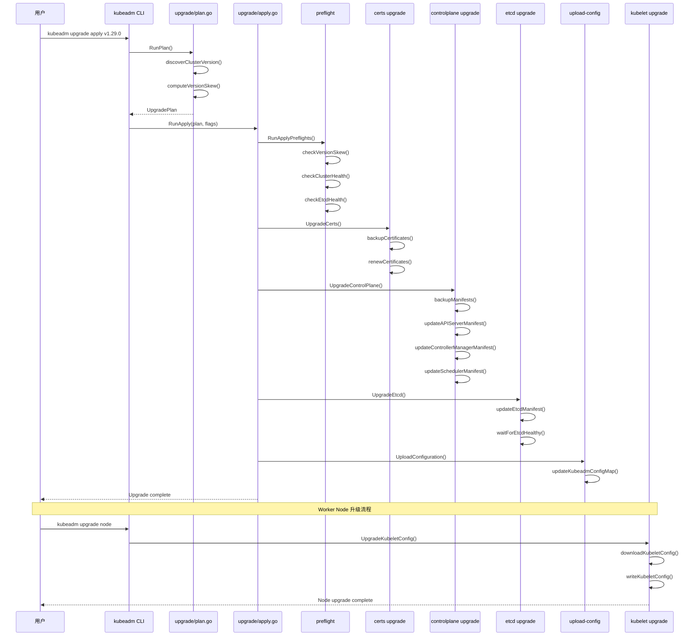

> **生产环境安全提示**
>
> 本文档包含可直接执行的运维命令。执行前请确认：当前目标集群与 Namespace 是否正确；是否具备足够的 RBAC 权限；是否已在非生产环境验证。命令风险等级标注：🔴 高风险（可能造成数据丢失或服务中断）、🟡 中风险（会修改集群状态，但通常可回滚）、🟢 低风险/只读（信息收集，无副作用）。


title: 集群升级进阶滚动升级与回滚策略
description: '| `cmd/kubeadm/app/phases/upgrade/computehash.go` | L30-L120 | 计算配置哈希
  |'
category: functions
tags:
- k8s
- operations
- cluster-management
- etcd
- apiserver
- kubelet
- scheduler
- controller-manager
- cilium
- calico
last_updated: 2026-05-18
difficulty: expert
reading_level: expert
audience:
- Kubernetes 运维工程师
- 平台工程师
estimated_read_time: 5min
intent_queries:
- Kubernetes cluster upgrade rolling update
- kubeadm upgrade apply v1.29 control plane upgrade
- cluster upgrade rollback strategy
- HA cluster rolling upgrade procedure
- etcd backup restore upgrade
trigger_keywords:
- upgrade
- rolling upgrade
- rollback
- HA
- high availability
- control plane
- kubeadm upgrade apply
- kubeadm upgrade node
- etcd backup
- etcd snapshot
- upgrade plan
- static pod
- manifest
- certificate renewal
related_domains:
- 集群基础
- 故障诊断
related_topics:
- 09-upgrade
- cluster-create/03-certs
- cluster-create/07-etcd
- cluster-create/14-ha-advanced
authors:
- name: KUDIG Team
  role: contributor
k8s_versions:
- '1.28'
- '1.29'
- '1.30'
- '1.31'
- '1.32'
---

# 集群升级进阶: 滚动升级与回滚策略

## 函数/流程签名

```go
func RunApply(plan *UpgradePlan, flags *ApplyFlags) error
func RunNode(data *NodeData) error
func PerformUpgrade(cfg *kubeadmapi.InitConfiguration, waitTimeout time.Duration) error
func UpgradeControlPlane(cfg *kubeadmapi.ClusterConfiguration, patchesDir string) error
func UpgradeKubeletConfig(cfg *kubeadmapi.ClusterConfiguration, nodeRegOpts *kubeadmapi.NodeRegistrationOptions) error
func UpgradeEtcd(cfg *kubeadmapi.ClusterConfiguration, client clientset.Interface) error
func Diff(oldVersion, newVersion string) error
```

## 源码位置

| 文件路径 | 行号范围 | 说明 |
|---------|---------|------|
| `cmd/kubeadm/app/cmd/upgrade/apply.go` | L80-L350 | `RunApply` 升级 apply 主入口 |
| `cmd/kubeadm/app/cmd/upgrade/node.go` | L45-L180 | `RunNode` 升级 node 入口 |
| `cmd/kubeadm/app/cmd/upgrade/plan.go` | L60-L280 | `RunPlan` 生成升级计划 |
| `cmd/kubeadm/app/phases/upgrade/computehash.go` | L30-L120 | 计算配置哈希 |
| `cmd/kubeadm/app/phases/upgrade/controlplane.go` | L35-L200 | 控制面组件升级 |
| `cmd/kubeadm/app/phases/upgrade/etcd.go` | L30-L150 | etcd 升级 |
| `cmd/kubeadm/app/phases/upgrade/staticpod.go` | L40-L220 | 静态 Pod manifest 更新 |
| `cmd/kubeadm/app/phases/upgrade/kubeletconfig.go` | L35-L160 | kubelet 配置升级 |
| `cmd/kubeadm/app/phases/upgrade/postupgrade.go` | L25-L100 | 升级后处理 |
| `cmd/kubeadm/app/phases/upgrade/certs.go` | L30-L130 | 证书升级处理 |

## 参数说明

### UpgradePlan 结构体

| 参数名 | 类型 | 说明 | 验证规则 |
|--------|------|------|---------|
| `oldVersion` | `*version.Version` | 当前集群版本 | 必须是有效 semver |
| `newVersion` | `*version.Version` | 目标升级版本 | 必须比 oldVersion 高一个 minor 版本 |
| `etcdUpgrade` | `bool` | 是否升级 etcd | 默认 true |
| `certificateRenewal` | `bool` | 是否续签证书 | 默认 true |
| `patchesDir` | `string` | 补丁目录 | 必须是有效目录路径 |

### ApplyFlags 参数

| 参数名 | 类型 | 说明 | 默认值 |
|--------|------|------|--------|
| `kubeConfigPath` | `string` | kubeconfig 文件路径 | `/etc/kubernetes/admin.conf` |
| `dryRun` | `bool` | 只打印不执行 | `false` |
| `force` | `bool` | 强制升级 (跳过部分检查) | `false` |
| `ignorePreflightErrors` | `[]string` | 忽略的预检错误列表 | 空 |
| `skipPhases` | `[]string` | 跳过的阶段列表 | 空 |
| `etcdUpgrade` | `bool` | 是否升级 etcd | `true` |
| `certificateRenewal` | `bool` | 是否续签证书 | `true` |
| `patchesDir` | `string` | 补丁目录路径 | 空 |

## 返回值

| 返回值 | 类型 | 说明 |
|--------|------|------|
| `UpgradePlan` | `*struct` | 升级计划，包含版本差异和组件列表 |
| `ComponentConfigVersionInfo` | `struct` | 组件配置版本信息 |
| `error` | `error` | 升级过程中的错误 |

## 调用链



## 源码分析

### RunApply 主入口 (apply.go)

```go
// cmd/kubeadm/app/cmd/upgrade/apply.go
// RunApply 执行集群升级 apply 操作
func RunApply(plan *UpgradePlan, flags *ApplyFlags) error {
    // 1. 创建 Kubernetes 客户端
    //    连接到 API Server 获取集群当前状态
    client, err := flags.ToClient()
    if err != nil {
        return fmt.Errorf("failed to create kubernetes client: %w", err)
    }

    // 2. 执行升级预检
    //    检查版本偏差、集群健康状态、etcd 可用性
    if err := RunApplyPreflights(client, plan); err != nil {
        return fmt.Errorf("preflight check failed: %w", err)
    }

    // 3. 备份现有配置
    //    备份目录: /etc/kubernetes/tmp/kubeadm-backup-<timestamp>
    backupDir := fmt.Sprintf("/etc/kubernetes/tmp/kubeadm-backup-%d",
        time.Now().Unix())
    if err := backupConfig(backupDir); err != nil {
        return fmt.Errorf("failed to backup config: %w", err)
    }

    // 4. 升级证书 (如果 certificateRenewal=true)
    if flags.certificateRenewal {
        if err := UpgradeCerts(plan.NewVersion); err != nil {
            return fmt.Errorf("failed to upgrade certs: %w", err)
        }
    }

    // 5. 升级控制面组件
    //    更新 static Pod manifests 中的 image tag
    if err := UpgradeControlPlane(plan, flags.patchesDir); err != nil {
        return fmt.Errorf("failed to upgrade control plane: %w", err)
    }

    // 6. 升级 etcd (如果 etcdUpgrade=true)
    if flags.etcdUpgrade {
        if err := UpgradeEtcd(plan, client); err != nil {
            return fmt.Errorf("failed to upgrade etcd: %w", err)
        }
    }

    // 7. 等待控制面就绪
    //    轮询 /healthz 端点，超时 5 分钟
    if err := WaitForControlPlane(client, 5*time.Minute); err != nil {
        return fmt.Errorf("control plane did not become ready: %w", err)
    }

    // 8. 上传新配置到 ConfigMap
    if err := UploadConfiguration(plan); err != nil {
        return fmt.Errorf("failed to upload config: %w", err)
    }

    return nil
}
```

### 升级计划生成 (plan.go)

```go
// cmd/kubeadm/app/cmd/upgrade/plan.go
// RunPlan 生成升级计划，列出可升级版本
func RunPlan(flags *PlanFlags) error {
    // 1. 获取当前集群版本
    client, err := flags.ToClient()
    if err != nil {
        return err
    }

    currentNodeVersion, err := getNodeVersion(client)
    if err != nil {
        return fmt.Errorf("failed to get current version: %w", err)
    }

    // 2. 获取可升级版本列表
    //    从 release URL 或本地缓存获取可用版本
    availableVersions, err := getAvailableVersions(flags.kubeVersion)
    if err != nil {
        return fmt.Errorf("failed to get available versions: %w", err)
    }

    // 3. 过滤不支持的升级路径
    //    只允许 +1 minor 版本升级 (如 1.28 → 1.29)
    validVersions := []string{}
    for _, v := range availableVersions {
        if canUpgradeVersion(currentNodeVersion, v) {
            validVersions = append(validVersions, v.String())
        }
    }

    // 4. 计算各组件版本差异
    //    对比当前组件版本和目标版本
    componentVersions := []ComponentConfigVersionInfo{
        {
            Component:   "kube-apiserver",
            OldVersion:  currentNodeVersion.String(),
            NewVersion:  flags.kubeVersion,
        },
        {
            Component:   "kube-controller-manager",
            OldVersion:  currentNodeVersion.String(),
            NewVersion:  flags.kubeVersion,
        },
        {
            Component:   "kube-scheduler",
            OldVersion:  currentNodeVersion.String(),
            NewVersion:  flags.kubeVersion,
        },
        {
            Component:   "kube-proxy",
            OldVersion:  currentNodeVersion.String(),
            NewVersion:  flags.kubeVersion,
        },
    }

    // 5. 打印升级计划
    printUpgradePlan(componentVersions, validVersions)
    return nil
}
```

### 版本偏差检查 (plan.go)

```go
// cmd/kubeadm/app/cmd/upgrade/plan.go
// canUpgradeVersion 检查版本升级路径是否合法
func canUpgradeVersion(current, target *version.Version) bool {
    // 1. 不允许降级
    if target.LessThan(current) {
        return false
    }

    // 2. 不允许跨大版本升级
    //    例如: 1.27.x → 1.29.x 不允许
    //    但 1.27.x → 1.28.x 允许
    if target.Major() != current.Major() {
        return false // 不支持跨 major 版本
    }

    // 3. 只允许升级到下一个 minor 版本
    //    minor 差值必须 <= 1
    minorDiff := target.Minor() - current.Minor()
    if minorDiff > 1 {
        return false // 不支持跨 minor 版本
    }

    // 4. 同一 minor 版本的补丁升级总是允许的
    //    例如: 1.28.0 → 1.28.3
    return true
}
```

### 控制面升级 (controlplane.go)

```go
// cmd/kubeadm/app/phases/upgrade/controlplane.go
// UpgradeControlPlane 升级控制面 static Pod manifests
func UpgradeControlPlane(
    plan *UpgradePlan,
    patchesDir string,
) error {
    // 1. 备份现有 manifests
    //    cp /etc/kubernetes/manifests/*.yaml → backup/
    manifestDir := "/etc/kubernetes/manifests"
    backupDir := fmt.Sprintf("/etc/kubernetes/tmp/manifest-backup-%d",
        time.Now().Unix())
    if err := backupManifests(manifestDir, backupDir); err != nil {
        return fmt.Errorf("failed to backup manifests: %w", err)
    }

    // 2. 升级 kube-apiserver
    //    更新镜像标签和配置参数
    if err := upgradeComponent(
        "kube-apiserver",
        plan.NewVersion,
        patchesDir,
        func(manifest *v1.Pod) error {
            // 更新镜像版本
            manifest.Spec.Containers[0].Image = fmt.Sprintf(
                "registry.k8s.io/kube-apiserver:%s",
                plan.NewVersion,
            )
            // 应用补丁 (如果有)
            return applyPatches(manifest, patchesDir, "kube-apiserver")
        },
    ); err != nil {
        return fmt.Errorf("failed to upgrade kube-apiserver: %w", err)
    }

    // 3. 等待 kube-apiserver 就绪
    //    轮询 /healthz 端点
    if err := waitForAPIServer(5 * time.Minute); err != nil {
        return fmt.Errorf("apiserver not ready after upgrade: %w", err)
    }

    // 4. 升级 kube-controller-manager
    if err := upgradeComponent(
        "kube-controller-manager",
        plan.NewVersion,
        patchesDir,
        func(manifest *v1.Pod) error {
            manifest.Spec.Containers[0].Image = fmt.Sprintf(
                "registry.k8s.io/kube-controller-manager:%s",
                plan.NewVersion,
            )
            return applyPatches(manifest, patchesDir, "kube-controller-manager")
        },
    ); err != nil {
        return fmt.Errorf("failed to upgrade controller-manager: %w", err)
    }

    // 5. 升级 kube-scheduler
    if err := upgradeComponent(
        "kube-scheduler",
        plan.NewVersion,
        patchesDir,
        func(manifest *v1.Pod) error {
            manifest.Spec.Containers[0].Image = fmt.Sprintf(
                "registry.k8s.io/kube-scheduler:%s",
                plan.NewVersion,
            )
            return applyPatches(manifest, patchesDir, "kube-scheduler")
        },
    ); err != nil {
        return fmt.Errorf("failed to upgrade scheduler: %w", err)
    }

    return nil
}
```

### etcd 升级 (etcd.go)

```go
// cmd/kubeadm/app/phases/upgrade/etcd.go
// UpgradeEtcd 升级 etcd static Pod
func UpgradeEtcd(
    plan *UpgradePlan,
    client clientset.Interface,
) error {
    // 1. 检查当前 etcd 健康状态
    //    所有成员必须是 healthy 的
    etcdClient, err := getEtcdClient(client)
    if err != nil {
        return fmt.Errorf("failed to connect to etcd: %w", err)
    }

    ctx, cancel := context.WithTimeout(context.Background(), 30*time.Second)
    defer cancel()

    // 2. 获取 etcd 集群成员列表
    members, err := etcdClient.MemberList(ctx)
    if err != nil {
        return fmt.Errorf("failed to list etcd members: %w", err)
    }

    // 3. 验证所有成员健康
    for _, member := range members.Members {
        if err := checkEtcdMemberHealth(member); err != nil {
            return fmt.Errorf("etcd member %s is unhealthy: %w",
                member.Name, err)
        }
    }

    // 4. 更新 etcd static Pod manifest
    //    修改 image tag 为新版本
    newEtcdImage := fmt.Sprintf("registry.k8s.io/etcd:%s",
        plan.EtcdVersion)
    if err := updateEtcdManifest(newEtcdImage); err != nil {
        return fmt.Errorf("failed to update etcd manifest: %w", err)
    }

    // 5. 等待 etcd 重新启动并恢复健康
    if err := waitForEtcdHealthy(etcdClient, 5*time.Minute); err != nil {
        return fmt.Errorf("etcd did not become healthy: %w", err)
    }

    // 6. 验证数据完整性
    //    检查所有 key 是否可读
    if err := verifyEtcdData(etcdClient); err != nil {
        return fmt.Errorf("etcd data verification failed: %w", err)
    }

    return nil
}
```

### Worker 节点升级 (node.go)

```go
// cmd/kubeadm/app/cmd/upgrade/node.go
// RunNode 执行 worker 节点升级
func RunNode(flags *NodeFlags) error {
    // 1. 从 API Server 获取最新配置
    client, err := flags.ToClient()
    if err != nil {
        return err
    }

    // 2. 下载最新的 kubelet 配置
    //    从 ConfigMap kube-system/kubeadm-config 获取
    cfg, err := downloadKubeadmConfig(client)
    if err != nil {
        return fmt.Errorf("failed to download config: %w", err)
    }

    // 3. 备份现有 kubelet 配置
    backupKubeletConfig()

    // 4. 写入新的 kubelet 配置
    //    /var/lib/kubelet/config.yaml
    if err := writeKubeletConfig(cfg); err != nil {
        return fmt.Errorf("failed to write kubelet config: %w", err)
    }

    // 5. 写入新的 kubelet kubeconfig
    //    /etc/kubernetes/kubelet.conf
    if err := writeKubeletKubeconfig(cfg); err != nil {
        return fmt.Errorf("failed to write kubelet kubeconfig: %w", err)
    }

    // 6. 重启 kubelet
    //    systemctl restart kubelet
    if err := restartKubelet(); err != nil {
        return fmt.Errorf("failed to restart kubelet: %w", err)
    }

    return nil
}
```

## 执行流程

### 控制面节点升级流程

```
步骤 1:  kubeadm upgrade plan
    → 获取当前版本，计算可升级版本
    ↓
步骤 2:  预检
    → 版本偏差检查 (不允许跨 minor 版本)
    → 集群健康检查 (所有节点 Ready)
    → etcd 健康检查 (所有成员 healthy)
    ↓
步骤 3:  备份
    → 备份 /etc/kubernetes/manifests/
    → 备份 /etc/kubernetes/pki/
    → 备份 /var/lib/etcd/
    ↓
步骤 4:  证书续签 (可选)
    → 续签 apiserver, apiserver-kubelet-client 证书
    → CA 证书不续签 (10 年有效期)
    ↓
步骤 5:  升级 kube-apiserver
    → 更新 static Pod manifest image tag
    → kubelet 检测文件变化，自动重启容器
    → 等待 /healthz 返回 200
    ↓
步骤 6:  升级 kube-controller-manager
    → 更新 manifest + 等待就绪
    ↓
步骤 7:  升级 kube-scheduler
    → 更新 manifest + 等待就绪
    ↓
步骤 8:  升级 etcd
    → 更新 etcd manifest image tag
    → 等待 etcd 集群恢复 healthy
    → 验证数据完整性
    ↓
步骤 9:  上传新配置
    → 更新 ConfigMap kube-system/kubeadm-config
    → 包含新的 ClusterConfiguration
    ↓
步骤 10: 升级 kube-proxy
    → 更新 DaemonSet image tag
    → 所有节点滚动更新
```

### HA 集群滚动升级流程

> ⚠️ **🟠 高危操作** — 影响业务流量或节点状态，需变更工单+影响评估+计划回滚
> - `kubectl drain`：驱逐节点所有 Pod，业务流量受影响
> - `systemctl stop/restart`：停止/重启系统服务，影响节点上所有容器

> **🔴 高风险操作警告**
>
> 下方命令属于不可逆或高影响操作，执行前请确认：
> - 已备份关键数据与配置
> - 处于批准的变更窗口期
> - 已获得相关责任人授权
> - 已准备回滚或恢复方案
> - 目标集群、Namespace、节点/资源名称正确无误

```
# 🔴 高风险：可能造成数据丢失或服务中断，执行前需备份、变更审批与回滚方案
步骤 1: 升级第一个 control-plane 节点
    → kubeadm upgrade apply v1.29.0
    → 验证该节点所有组件正常
    ↓
步骤 2: 升级第二个 control-plane 节点
    → kubeadm upgrade apply v1.29.0
    → (使用相同的 --certificate-key)
    → 验证该节点所有组件正常
    ↓
步骤 3: 升级第三个 control-plane 节点
    → kubeadm upgrade apply v1.29.0
    → 验证该节点所有组件正常
    ↓
步骤 4: 逐个升级 worker 节点
    → kubectl drain <node> --ignore-daemonsets
    → kubeadm upgrade node
    → apt-get install kubelet=1.29.0-1.1
    → systemctl restart kubelet
    → kubectl uncordon <node>
    ↓
步骤 5: 升级 CNI 插件
    → 更新 Calico/Cilium DaemonSet
    ↓
步骤 6: 验证集群
    → kubectl get nodes (所有节点新版本)
    → kubectl get pods -A (所有 Pod Running)
```
## 使用场景

### 场景 1: 标准 minor 版本升级 (1.28 → 1.29)

> ⚠️ **🟠 高危操作** — 影响业务流量或节点状态，需变更工单+影响评估+计划回滚
> - `systemctl stop/restart`：停止/重启系统服务，影响节点上所有容器

> **🔴 高风险操作警告**
>
> 下方命令属于不可逆或高影响操作，执行前请确认：
> - 已备份关键数据与配置
> - 处于批准的变更窗口期
> - 已获得相关责任人授权
> - 已准备回滚或恢复方案
> - 目标集群、Namespace、节点/资源名称正确无误

``` bash
# 🔴 高风险：可能造成数据丢失或服务中断，执行前需备份、变更审批与回滚方案
# 1. 检查升级计划
kubeadm upgrade plan
# 输出:
# [upgrade/config] Making sure the configuration is correct:
# [upgrade/config] FYI: You can look at this config file with 'kubectl -n kube-system get cm kubeadm-config -o yaml'
# [upgrade] Running pre-flight checks.
# [upgrade] The latest version in the v1.28 series: v1.28.4
#
# Components that must be upgraded manually after control-plane upgrade:
#   kubelet: v1.28.0 → v1.29.0
#
# Upgrade to the latest version:
#   kube-apiserver: v1.28.0 → v1.29.0
#   kube-controller-manager: v1.28.0 → v1.29.0
#   kube-scheduler: v1.28.0 → v1.29.0
#   kube-proxy: v1.28.0 → v1.29.0
#   etcd: 3.5.9-0 → 3.5.11-0

# 2. 拉取新版本镜像
kubeadm config images pull --kubernetes-version=v1.29.0

# 3. 执行升级
kubeadm upgrade apply v1.29.0

# 4. 升级 kubelet
apt-get install -y kubelet=1.29.0-1.1
systemctl restart kubelet

# 5. 验证
kubectl get nodes
# NAME      STATUS   ROLES           AGE   VERSION
# master    Ready    control-plane   30d   v1.29.0
```
### 场景 2: HA 集群滚动升级

> ⚠️ **🟠 高危操作** — 影响业务流量或节点状态，需变更工单+影响评估+计划回滚
> - `kubectl drain`：驱逐节点所有 Pod，业务流量受影响
> - `systemctl stop/restart`：停止/重启系统服务，影响节点上所有容器

> **🔴 高风险操作警告**
>
> 下方命令属于不可逆或高影响操作，执行前请确认：
> - 已备份关键数据与配置
> - 处于批准的变更窗口期
> - 已获得相关责任人授权
> - 已准备回滚或恢复方案
> - 目标集群、Namespace、节点/资源名称正确无误

``` bash
# 🔴 高风险：可能造成数据丢失或服务中断，执行前需备份、变更审批与回滚方案
# 第一个 control-plane 节点
kubeadm upgrade apply v1.29.0 --certificate-key=<key>

# 第二个 control-plane 节点 (join)
kubeadm upgrade apply v1.29.0 --certificate-key=<key>

# Worker 节点升级 (逐个)
kubectl drain worker-1 --ignore-daemonsets --delete-emptydir-data
ssh worker-1 "kubeadm upgrade node"
ssh worker-1 "apt-get install -y kubelet=1.29.0-1.1"
ssh worker-1 "systemctl restart kubelet"
kubectl uncordon worker-1

# 验证所有节点版本
kubectl get nodes -o wide
```
### 场景 3: 升级失败回滚

> ⚠️ **🔴 灾难性操作** — 含不可逆命令，执行前必须满足变更窗口+双人复核+事前备份+回滚方案
> - `etcdctl snapshot restore`：用快照覆盖 etcd 数据目录，集群状态强制回退
> - `systemctl stop/restart`：停止/重启系统服务，影响节点上所有容器

> **🔴 高风险操作警告**
>
> 下方命令属于不可逆或高影响操作，执行前请确认：
> - 已备份关键数据与配置
> - 处于批准的变更窗口期
> - 已获得相关责任人授权
> - 已准备回滚或恢复方案
> - 目标集群、Namespace、节点/资源名称正确无误

``` bash
# 🔴 高风险：可能造成数据丢失或服务中断，执行前需备份、变更审批与回滚方案
# 1. 查找备份目录
ls -la /etc/kubernetes/tmp/

# 2. 恢复 static Pod manifests
cp /etc/kubernetes/tmp/kubeadm-backup-*/manifests/*.yaml \
   /etc/kubernetes/manifests/

# 3. 恢复 etcd 数据 (如果需要)
# 停止 etcd
crictl stop $(crictl ps --name etcd -q)
crictl rm $(crictl ps --name etcd -a -q)

# 从快照恢复
ETCDCTL_API=3 etcdctl snapshot restore /backup/etcd-snapshot.db \
  --data-dir /var/lib/etcd

# 4. 恢复证书 (如果证书已续签)
cp /etc/kubernetes/tmp/kubeadm-backup-*/pki/* /etc/kubernetes/pki/

# 5. 重启 kubelet
systemctl restart kubelet

# 6. 等待组件恢复
kubectl get pods -n kube-system
```
### 场景 4: 使用配置文件升级

```yaml
# upgrade-config.yaml
apiVersion: kubeadm.k8s.io/v1beta3
kind: InitConfiguration
nodeRegistration:
  criSocket: unix:///var/run/containerd/containerd.sock
---
apiVersion: kubeadm.k8s.io/v1beta3
kind: ClusterConfiguration
kubernetesVersion: v1.29.0
imageRepository: registry.k8s.io
etcd:
  local:
    imageRepository: registry.k8s.io
    imageTag: 3.5.11-0
dns:
  imageRepository: registry.k8s.io
  imageTag: v1.10.1
```

```bash
kubeadm upgrade apply --config=upgrade-config.yaml
```

## 配置示例

### etcd 备份脚本 (升级前必须)

```yaml
# etcd-backup-job.yaml
apiVersion: batch/v1
kind: Job
metadata:
  name: etcd-backup
  namespace: kube-system
spec:
  template:
    spec:
      nodeName: master-1  # 在 control-plane 节点执行
      containers:
      - name: backup
        image: registry.k8s.io/etcd:3.5.11-0
        command:
        - /bin/sh
        - -c
        - |
          ETCDCTL_API=3 etcdctl snapshot save /backup/etcd-snapshot.db \
            --endpoints=https://127.0.0.1:2379 \
            --cacert=/etc/kubernetes/pki/etcd/ca.crt \
            --cert=/etc/kubernetes/pki/etcd/healthcheck-client.crt \
            --key=/etc/kubernetes/pki/etcd/healthcheck-client.key
          ETCDCTL_API=3 etcdctl snapshot status /backup/etcd-snapshot.db --write-table
        volumeMounts:
        - name: etcd-certs
          mountPath: /etc/kubernetes/pki/etcd
          readOnly: true
        - name: backup
          mountPath: /backup
      volumes:
      - name: etcd-certs
        hostPath:
          path: /etc/kubernetes/pki/etcd
      - name: backup
        hostPath:
          path: /tmp/etcd-backup
      restartPolicy: OnFailure
```

### 升级前预检清单

```yaml
# pre-upgrade-checklist.yaml (文档参考)
apiVersion: v1
kind: ConfigMap
metadata:
  name: upgrade-checklist
  namespace: kube-system
data:
  checklist: |
    升级前检查清单:
    1. 备份 etcd 数据
       ETCDCTL_API=3 etcdctl snapshot save /backup/etcd.db
    2. 备份 /etc/kubernetes/ 目录
       tar czf /backup/kubernetes-etc.tar.gz /etc/kubernetes/
    3. 检查所有节点 Ready
       kubectl get nodes
    4. 检查所有 Pod Running
       kubectl get pods -A | grep -v Running
    5. 检查证书有效期
       kubeadm certs check-expiration
    6. 检查 etcd 健康
       ETCDCTL_API=3 etcdctl endpoint health
    7. 检查磁盘空间 (> 10GB 可用)
       df -h /var/lib/etcd /var/lib/containerd
    8. 记录当前版本
       kubectl version -o yaml
```

## 实战示例

### 完整升级演练 (1.28 → 1.29)

> ⚠️ **🟠 高危操作** — 影响业务流量或节点状态，需变更工单+影响评估+计划回滚
> - `kubectl drain`：驱逐节点所有 Pod，业务流量受影响
> - `systemctl stop/restart`：停止/重启系统服务，影响节点上所有容器

> **🔴 高风险操作警告**
>
> 下方命令属于不可逆或高影响操作，执行前请确认：
> - 已备份关键数据与配置
> - 处于批准的变更窗口期
> - 已获得相关责任人授权
> - 已准备回滚或恢复方案
> - 目标集群、Namespace、节点/资源名称正确无误

``` bash
# 🔴 高风险：可能造成数据丢失或服务中断，执行前需备份、变更审批与回滚方案
# === 升级前检查 ===

# 当前版本
kubectl version --short
# Client Version: v1.28.0
# Server Version: v1.28.0

# 节点状态
kubectl get nodes
# NAME      STATUS   ROLES           AGE   VERSION
# master    Ready    control-plane   30d   v1.28.0
# worker-1  Ready    <none>          30d   v1.28.0
# worker-2  Ready    <none>          30d   v1.28.0

# etcd 健康
ETCDCTL_API=3 etcdctl endpoint health \
  --cacert=/etc/kubernetes/pki/etcd/ca.crt \
  --cert=/etc/kubernetes/pki/etcd/healthcheck-client.crt \
  --key=/etc/kubernetes/pki/etcd/healthcheck-client.key
# https://127.0.0.1:2379 is healthy: successfully committed proposal

# 证书有效期
kubeadm certs check-expiration
# CERTIFICATE                EXPIRES             RESIDUAL TIME
# ca                        2033-12-20           9y
# apiserver                 2024-12-20           364d
# apiserver-kubelet-client  2024-12-20           364d

# === 升级控制面 ===

# 升级 kubeadm
apt-get update && apt-get install -y kubeadm=1.29.0-1.1

# 查看升级计划
kubeadm upgrade plan
# [upgrade/config] Making sure the configuration is correct.
# [upgrade] Running pre-flight checks.
# [upgrade] The latest version in the v1.28 series: v1.28.4
#
# Components that must be upgraded manually after control-plane upgrade:
#   kubelet: v1.28.0 → v1.29.0
#
# Upgrade to the latest version:
#   kube-apiserver: v1.28.0 → v1.29.0
#   kube-controller-manager: v1.28.0 → v1.29.0
#   kube-scheduler: v1.28.0 → v1.29.0
#   kube-proxy: v1.28.0 → v1.29.0
#   etcd: 3.5.9-0 → 3.5.11-0

# 执行升级
kubeadm upgrade apply v1.29.0
# [upgrade/pre-flight] Running pre-flight checks.
# [upgrade/pre-flight] You can also recreate this cluster with: kubeadm init phase
# [upgrade/apply] Upgrading your Static Pod-hosted control plane to version "v1.29.0"...
# [upgrade/etcd] Upgrading etcd...
# [upgrade/staticpods] Preparing for "kube-apiserver" upgrade
# [upgrade/staticpods] Renewing certificates for "kube-apiserver"
# [upgrade/staticpods] Moved new manifest to "/etc/kubernetes/manifests/kube-apiserver.yaml"
# [upgrade/staticpods] Waiting for the kubelet to restart the component
# [upgrade/staticpods] Component "kube-apiserver" upgraded successfully
# [upgrade/staticpods] Component "kube-controller-manager" upgraded successfully
# [upgrade/staticpods] Component "kube-scheduler" upgraded successfully
# [upgrade/postupgrade] Applying label changes...
# [upgrade/postupgrade] Applying annotation changes...
# [upgrade/config] Upload config completed successfully
# Done!

# 升级 kubelet
apt-get install -y kubelet=1.29.0-1.1 kubectl=1.29.0-1.1
systemctl restart kubelet

# === 升级 Worker 节点 ===

# 在 worker-1 上
kubectl drain worker-1 --ignore-daemonsets --delete-emptydir-data
# node/worker-1 cordoned
# evicting pod default/nginx-6c8b5b5d4f-abcde

ssh worker-1 "apt-get update && apt-get install -y kubeadm=1.29.0-1.1"
ssh worker-1 "kubeadm upgrade node"
# [upgrade] Reading configuration from the cluster...
# [upgrade] FYI: You can look at this config file with 'kubectl -n kube-system get cm kubeadm-config -o yaml'
# [upgrade] Backing up kubelet config file to /etc/kubernetes/tmp/kubeadm-kubelet-config...
# [upgrade] Updating kubelet configuration
# [upgrade] Upgrade complete!

ssh worker-1 "apt-get install -y kubelet=1.29.0-1.1"
ssh worker-1 "systemctl restart kubelet"
kubectl uncordon worker-1

# === 验证 ===

kubectl get nodes
# NAME      STATUS   ROLES           AGE   VERSION
# master    Ready    control-plane   30d   v1.29.0
# worker-1  Ready    <none>          30d   v1.29.0
# worker-2  Ready    <none>          30d   v1.29.0

kubectl get pods -A
# NAMESPACE     NAME                              READY   STATUS    AGE
# kube-system   coredns-5d7c7b8b5d-abcde          1/1     Running   10m
# kube-system   etcd-master                       1/1     Running   10m
# kube-system   kube-apiserver-master             1/1     Running   10m
# kube-system   kube-controller-manager-master    1/1     Running   10m
# kube-system   kube-proxy-abcde                  1/1     Running   10m
# kube-system   kube-scheduler-master             1/1     Running   10m
```
### 查看升级差异

```bash
# 查看配置差异
kubeadm upgrade diff v1.29.0
# [upgrade/config] Making sure the configuration is correct.
# --- /etc/kubernetes/manifests/kube-apiserver.yaml
# +++ /etc/kubernetes/manifests/kube-apiserver.yaml (new)
# @@ -15,7 +15,7 @@
#        - --service-cluster-ip-range=10.96.0.0/12
#        image: registry.k8s.io/kube-apiserver:v1.28.0
#        image: registry.k8s.io/kube-apiserver:v1.29.0
# +      - --enable-aggregator-routing=false
```

## 常见错误

| 错误 | 原因 | 解决方案 |
|------|------|---------|
| `[upgrade/health] FATAL: cluster is unhealthy` | etcd 或 API Server 不健康 | 检查 etcd 健康状态，等待集群恢复 |
| `unsupported version skew` | 版本差异过大 (跨 minor 版本) | 逐版本升级 (1.27→1.28→1.29) |
| `[upgrade/apply] FATAL: cannot upgrade from vX to vY` | 不支持的升级路径 | 确认只升级到下一个 minor 版本 |
| `static pod update timed out` | 组件重启超时 (5 分钟) | 检查 kubelet 日志，手动重启 |
| `etcd upgrade failed: member unhealthy` | etcd 成员不健康 | 修复 etcd 后重试升级 |
| `certificate renewal failed` | 证书目录权限问题 | 检查 /etc/kubernetes/pki 权限 |
| `[preflight] Some fatal errors occurred: Port-6443 in use` | 升级过程中端口冲突 | 等待旧进程退出，重试 |
| `kubelet version skew too large` | kubelet 版本偏差 > 2 个小版本 | 先升级 kubelet 到中间版本 |
| `failed to pull image` | 新版本镜像拉取失败 | 预先拉取: `kubeadm config images pull` |
| `ConfigMap "kubeadm-config" not found` | 集群配置丢失 | 手动创建 ConfigMap |

## 相关函数

- [集群升级基础](09-upgrade.md) — 升级流程概览和命令
- [集群概览](01-overview.md) — kubeadm 整体架构
- [证书管理](03-certs.md) — 升级过程中的证书续签
- [控制面组件](05-control-plane.md) — static Pod 升级机制
- [etcd 管理](07-etcd.md) — etcd 备份和升级
- [高可用进阶](14-ha-advanced.md) — HA 集群滚动升级
- [安全机制](16-security.md) — 升级过程中的安全配置
- [初始化阶段](17-init-phases.md) — init phase 与 upgrade phase 对比

## Related

- [[reference|#reference Hub]] — tag hub

- [[hot|hot]]
- [[17-系统基础/05-速查卡/go.md|go]]
- [[17-系统基础/05-速查卡/k8s.md|k8s]]
- [[23-实体/02-K8s核心组件/kubernetes.md|kubernetes]]


<!-- risk-assessed -->
