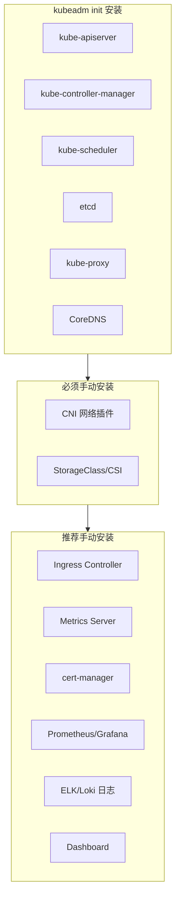

> **生产环境安全提示**
>
> 本文档包含可直接执行的运维命令。执行前请确认：当前目标集群与 Namespace 是否正确；是否具备足够的 RBAC 权限；是否已在非生产环境验证。命令风险等级标注：🔴 高风险（可能造成数据丢失或服务中断）、🟡 中风险（会修改集群状态，但通常可回滚）、🟢 低风险/只读（信息收集，无副作用）。


title: kubeadm 不安装的组件 (What kubeadm Does Not Install)
description: '// 以下组件需要用户自行安装和管理:'
category: functions
tags:
- k8s
- operations
- cluster-management
- etcd
- apiserver
- kubelet
- scheduler
- controller-manager
- prometheus
- grafana
last_updated: '2026-05-18'
difficulty: intermediate
reading_level: intermediate
audience:
- DevOps工程师
- Kubernetes管理员
- 云原生工程师
estimated_read_time: 5min
intent_queries:
- Kubernetes components kubeadm does not install
- Kubernetes CNI network plugin installation Calico
- Kubernetes Ingress Controller metrics server dashboard
- Kubernetes Storage CSI driver provisioner
- kubeadm init post-installation checklist
trigger_keywords:
- kubeadm does not install
- CNI
- Ingress
- metrics-server
- dashboard
- StorageClass
- CSI
- cert-manager
- Prometheus
- logging
- post-install
- addon
related_domains:
- 集群基础
- 网络
- domain-7-storage
related_topics:
- kubeadm init
- CNI
- Ingress
- Storage
- monitoring
- logging
authors:
- name: KUDIG Team
  role: contributor
k8s_versions:
- '1.28'
- '1.29'
- '1.30'
- '1.31'
- '1.32'
---

# kubeadm 不安装的组件 (What kubeadm Does Not Install)

## 函数/流程签名

```go
// kubeadm init 只安装以下组件:
// - kube-apiserver (static pod)
// - kube-controller-manager (static pod)
// - kube-scheduler (static pod)
// - etcd (static pod)
// - kube-proxy (daemonset)
// - CoreDNS (deployment)
//
// 以下组件需要用户自行安装和管理:
// - CNI 网络插件
// - Ingress Controller
// - Storage provisioner / CSI driver
// - Metrics Server
// - Dashboard
// - 日志采集 (Fluentd/Elasticsearch)
// - 监控 (Prometheus/Grafana)
// - cert-manager
```

## 源码位置

| 文件路径 | 说明 |
|---------|------|
| `cmd/kubeadm/app/phases/addons/` | kubeadm 仅安装 CoreDNS 和 kube-proxy |
| `cmd/kubeadm/app/phases/addons/proxy/` | kube-proxy DaemonSet |
| `cmd/kubeadm/app/phases/addons/dns/` | CoreDNS Deployment |
| `cmd/kubeadm/app/cmd/init.go` | init 完成后提示用户安装 CNI |

## 参数说明

### kubeadm init 后必须安装

| 组件 | 类型 | 说明 | 推荐选项 |
|------|------|------|---------|
| CNI 网络插件 | DaemonSet | Pod 网络，跨节点通信必需 | Calico, Cilium, Flannel |
| StorageClass | StorageClass + CSI Driver | 动态存储制备 | 云厂商 CSI, local-path-provisioner |

### kubeadm init 后推荐安装

| 组件 | 类型 | 说明 | 推荐选项 |
|------|------|------|---------|
| Ingress Controller | Deployment + Service | HTTP/HTTPS 路由 | Nginx Ingress, Traefik, Kong |
| Metrics Server | Deployment | HPA 和 kubectl top 依赖 | metrics-server |
| Dashboard | Deployment | Web 管理界面 | kubernetes-dashboard |
| cert-manager | Deployment | TLS 证书自动化 | cert-manager |
| Prometheus | StatefulSet + ConfigMap | 监控和告警 | kube-prometheus-stack |
| Logging | DaemonSet | 日志采集和存储 | Fluentd + Elasticsearch + Kibana |
| External DNS | Deployment | DNS 记录自动管理 | external-dns |

## 调用链



## 使用场景

### 场景 1: 安装 Calico CNI

```yaml
# Calico CNI 安装 (最常用的网络插件)
# quickstart.yaml
apiVersion: operator.tigera.io/v1
kind: Installation
metadata:
  name: default
spec:
  calicoNetwork:
    ipPools:
    - blockSize: 26
      cidr: 10.244.0.0/16
      encapsulation: VXLANCrossSubnet
      natOutgoing: Enabled
      nodeSelector: all()
---
apiVersion: operator.tigera.io/v1
kind: APIServer
metadata:
  name: default
spec: {}
```

> ⚠️ **🟡 中危变更** — 变更集群资源状态，建议先 --dry-run 或 diff 确认
> - `kubectl apply/create/replace`：创建/变更集群资源

``` bash
# 🟡 中风险：会修改集群/资源状态，执行前请确认目标、影响范围与授权
# 安装 Calico
kubectl apply -f https://raw.githubusercontent.com/projectcalico/calico/v3.26.0/manifests/calico.yaml

# 验证
kubectl get pods -n kube-system -l k8s-app=calico-node
# NAME                READY   STATUS    RESTARTS   AGE
# calico-node-abcde   1/1     Running   0          5m

# 查看 Pod 网络
kubectl get pods -A -o wide
# NAMESPACE   NAME       READY   STATUS    IP            NODE
# default     nginx      1/1     Running   10.244.0.10   master
```
### 场景 2: 安装 Cilium CNI

> ⚠️ **🟡 中危变更** — 变更集群资源状态，建议先 --dry-run 或 diff 确认
> - `helm upgrade/install`：部署/升级 release

``` bash
# 🟡 中风险：会修改集群/资源状态，执行前请确认目标、影响范围与授权
# 使用 Helm 安装 Cilium
helm repo add cilium https://helm.cilium.io/
helm install cilium cilium/cilium \
  --namespace kube-system \
  --set hubble.enabled=true \
  --set hubble.relay.enabled=true \
  --set hubble.ui.enabled=true \
  --set kubeProxyReplacement=strict \
  --set encryption.enabled=true \
  --set encryption.type=wireguard

# 验证
cilium status
# /¯¯\
#  /¯¯\__/¯¯\    Cilium:         OK
#  \__/¯¯\__/    Operator:       OK
#  /¯¯\__/¯¯\    Hubble:         OK
#  \__/¯¯\__/    ClusterMesh:    disabled
#     \__/
#
# DaemonSet         cilium             Desired: 3, Ready: 3/3
# DaemonSet         cilium             Desired: 3, Ready: 3/3
```
### 场景 3: 安装 Nginx Ingress Controller

```yaml
# nginx-ingress.yaml
apiVersion: v1
kind: Namespace
metadata:
  name: ingress-nginx
---
apiVersion: source.toolkit.fluxcd.io/v1
kind: HelmRepository
metadata:
  name: ingress-nginx
  namespace: ingress-nginx
spec:
  url: https://kubernetes.github.io/ingress-nginx
---
# 或使用 kubectl 直接安装
# kubectl apply -f https://raw.githubusercontent.com/kubernetes/ingress-nginx/main/deploy/static/provider/cloud/deploy.yaml
```

> ⚠️ **🟡 中危变更** — 变更集群资源状态，建议先 --dry-run 或 diff 确认
> - `kubectl apply/create/replace`：创建/变更集群资源

``` bash
# 🟡 中风险：会修改集群/资源状态，执行前请确认目标、影响范围与授权
# 安装 Nginx Ingress
kubectl apply -f https://raw.githubusercontent.com/kubernetes/ingress-nginx/controller-v1.8.2/deploy/static/provider/cloud/deploy.yaml

# 验证
kubectl get pods -n ingress-nginx
# NAME                                       READY   STATUS    RESTARTS   AGE
# ingress-nginx-controller-abcde             1/1     Running   0          5m

# 创建 Ingress
kubectl expose deployment nginx --port=80 --target-port=80
kubectl create ingress nginx --rule="nginx.example.com/*=nginx:80"
```
### 场景 4: 安装 Metrics Server

```yaml
# metrics-server.yaml
apiVersion: apps/v1
kind: Deployment
metadata:
  name: metrics-server
  namespace: kube-system
spec:
  selector:
    matchLabels:
      k8s-app: metrics-server
  template:
    spec:
      containers:
      - name: metrics-server
        image: registry.k8s.io/metrics-server/metrics-server:v0.7.0
        args:
        - --cert-dir=/tmp
        - --secure-port=4443
        - --kubelet-preferred-address-types=InternalIP,ExternalIP,Hostname
        - --kubelet-use-node-status-port
        - --metric-resolution=15s
        ports:
        - containerPort: 4443
          protocol: TCP
```

> ⚠️ **🟡 中危变更** — 变更集群资源状态，建议先 --dry-run 或 diff 确认
> - `kubectl apply/create/replace`：创建/变更集群资源

``` bash
# 🟡 中风险：会修改集群/资源状态，执行前请确认目标、影响范围与授权
# 安装 Metrics Server
kubectl apply -f https://github.com/kubernetes-sigs/metrics-server/releases/latest/download/components.yaml

# 验证
kubectl top nodes
# NAME      CPU(cores)   CPU%   MEMORY(bytes)   MEMORY%
# master    250m         3%     1024Mi          6%
# worker-1  150m         1%     512Mi           3%

kubectl top pods -A
# NAMESPACE     NAME                              CPU(cores)   MEMORY(bytes)
# kube-system   kube-apiserver-master             50m          256Mi
# kube-system   kube-controller-manager-master    20m          64Mi
# kube-system   kube-scheduler-master             10m          32Mi
# kube-system   etcd-master                       30m          128Mi
# kube-system   coredns-5d7c7b8b5d-abcde          5m           16Mi
# kube-system   calico-node-abcde                 15m          48Mi
```
### 场景 5: 安装 local-path-provisioner

```yaml
# local-path-storage.yaml
apiVersion: v1
kind: Namespace
metadata:
  name: local-path-storage
---
apiVersion: storage.k8s.io/v1
kind: StorageClass
metadata:
  name: local-path
provisioner: rancher.io/local-path
volumeBindingMode: WaitForFirstConsumer
reclaimPolicy: Delete
```

> ⚠️ **🟡 中危变更** — 变更集群资源状态，建议先 --dry-run 或 diff 确认
> - `kubectl apply/create/replace`：创建/变更集群资源

``` bash
# 🟡 中风险：会修改集群/资源状态，执行前请确认目标、影响范围与授权
# 安装
kubectl apply -f https://raw.githubusercontent.com/rancher/local-path-provisioner/v0.0.24/deploy/local-path-storage.yaml

# 验证
kubectl get storageclass
# NAME         PROVISIONER              RECLAIMPOLICY   VOLUMEBINDINGMODE
# local-path   rancher.io/local-path    Delete          WaitForFirstConsumer

# 测试 PVC
kubectl apply -f - <<EOF
apiVersion: v1
kind: PersistentVolumeClaim
metadata:
  name: test-pvc
spec:
  accessModes: ["ReadWriteOnce"]
  storageClassName: local-path
  resources:
    requests:
      storage: 1Gi
EOF
```
## 配置示例

### 完整集群初始化脚本

> ⚠️ **🟡 中危变更** — 变更集群资源状态，建议先 --dry-run 或 diff 确认
> - `kubectl apply/create/replace`：创建/变更集群资源

``` bash
# 🟡 中风险：会修改集群/资源状态，执行前请确认目标、影响范围与授权
#!/bin/bash
set -euo pipefail

# 1. kubeadm init
kubeadm init \
  --pod-network-cidr=10.244.0.0/16 \
  --kubernetes-version=v1.28.0

# 2. 配置 kubectl
mkdir -p $HOME/.kube
cp /etc/kubernetes/admin.conf $HOME/.kube/config
chown $(id -u):$(id -g) $HOME/.kube/config

# 3. 安装 Calico CNI (必须)
kubectl apply -f https://raw.githubusercontent.com/projectcalico/calico/v3.26.0/manifests/calico.yaml
kubectl wait --for=condition=Ready pods -l k8s-app=calico-node -n kube-system --timeout=120s

# 4. 安装 Metrics Server
kubectl apply -f https://github.com/kubernetes-sigs/metrics-server/releases/latest/download/components.yaml

# 5. 安装 Ingress Controller
kubectl apply -f https://raw.githubusercontent.com/kubernetes/ingress-nginx/controller-v1.8.2/deploy/static/provider/cloud/deploy.yaml

# 6. 安装 local-path-provisioner (测试环境)
kubectl apply -f https://raw.githubusercontent.com/rancher/local-path-provisioner/v0.0.24/deploy/local-path-storage.yaml

# 7. 验证
echo "=== Cluster Info ==="
kubectl get nodes
kubectl get pods -A
kubectl get storageclass

echo "=== Cluster is ready! ==="
echo "Join worker nodes with:"
kubeadm token create --print-join-command
```
## 实战示例

### 检查集群缺失组件

> ⚠️ **🟡 中危变更** — 变更集群资源状态，建议先 --dry-run 或 diff 确认
> - `kubectl exec`：进入容器执行命令，可能改变容器状态

``` bash
# 🟡 中风险：会修改集群/资源状态，执行前请确认目标、影响范围与授权
# 检查 CNI 是否安装
kubectl get pods -A | grep -E "calico|cilium|flannel|weave"
# 如果没有输出 → CNI 未安装，Pod 无法跨节点通信

# 检查 Metrics Server
kubectl top nodes 2>&1
# error: Metrics API not available → 需要安装 metrics-server

# 检查 Ingress
kubectl get ingressclass
# No resources found → 需要安装 Ingress Controller

# 检查 StorageClass
kubectl get storageclass
# No resources found → 需要安装 storage provisioner

# 检查 DNS 解析
kubectl run test-dns --image=busybox --command -- sleep 3600
kubectl exec test-dns -- nslookup kubernetes.default
# Server:    10.96.0.10
# Address 1: 10.96.0.10 kube-dns.kube-system.svc.cluster.local
# DNS 正常 → CoreDNS 已安装
```
## 常见错误

| 错误 | 原因 | 解决方案 |
|------|------|---------|
| `ContainerCreating` 卡住 | CNI 未安装 | 安装 Calico/Cilium/Flannel |
| `Metrics API not available` | Metrics Server 未安装 | 安装 metrics-server |
| `no persistent volumes available` | StorageClass 未配置 | 安装 local-path-provisioner 或 CSI driver |
| `Connection refused` 跨节点 Pod | CNI 配置错误 | 检查 CNI podSubnet 和 kubeadm 一致 |
| `ImagePullBackOff` CNI | 镜像拉取失败 | 预拉取 CNI 镜像或配置代理 |
| `Ingress 404` | Ingress Controller 未安装 | 安装 Nginx/Traefik Ingress |

### 场景 6: 安装 cert-manager (TLS 自动化)

> ⚠️ **🟡 中危变更** — 变更集群资源状态，建议先 --dry-run 或 diff 确认
> - `kubectl apply/create/replace`：创建/变更集群资源

``` bash
# 🟡 中风险：会修改集群/资源状态，执行前请确认目标、影响范围与授权
# 安装 cert-manager
kubectl apply -f https://github.com/cert-manager/cert-manager/releases/download/v1.13.0/cert-manager.yaml

# 验证
kubectl get pods -n cert-manager
# NAME                                       READY   STATUS    RESTARTS   AGE
# cert-manager-abcde                         1/1     Running   0          5m
# cert-manager-cainjector-abcde              1/1     Running   0          5m
# cert-manager-webhook-abcde                 1/1     Running   0          5m
```
```yaml
# 使用 Let's Encrypt 自动签发证书
apiVersion: cert-manager.io/v1
kind: ClusterIssuer
metadata:
  name: letsencrypt-prod
spec:
  acme:
    server: https://acme-v02.api.letsencrypt.org/directory
    email: admin@example.com
    privateKeySecretRef:
      name: letsencrypt-prod
    solvers:
    - http01:
        ingress:
          class: nginx
---
apiVersion: networking.k8s.io/v1
kind: Ingress
metadata:
  name: app-ingress
  annotations:
    cert-manager.io/cluster-issuer: letsencrypt-prod
spec:
  tls:
  - hosts:
    - app.example.com
    secretName: app-tls
  rules:
  - host: app.example.com
    http:
      paths:
      - path: /
        pathType: Prefix
        backend:
          service:
            name: app
            port:
              number: 80
```

### 场景 7: 安装 Kubernetes Dashboard

> ⚠️ **🟡 中危变更** — 变更集群资源状态，建议先 --dry-run 或 diff 确认
> - `kubectl apply/create/replace`：创建/变更集群资源

``` bash
# 🟡 中风险：会修改集群/资源状态，执行前请确认目标、影响范围与授权
# 安装 Dashboard
kubectl apply -f https://raw.githubusercontent.com/kubernetes/dashboard/v2.7.0/aio/deploy/recommended.yaml

# 创建管理员 ServiceAccount
kubectl create serviceaccount dashboard-admin -n kubernetes-dashboard
kubectl create clusterrolebinding dashboard-admin \
  --clusterrole=cluster-admin \
  --serviceaccount=kubernetes-dashboard:dashboard-admin

# 获取登录 Token
kubectl create token dashboard-admin -n kubernetes-dashboard --duration=24h

# 访问 Dashboard
kubectl proxy
# 浏览器打开: http://localhost:8001/api/v1/namespaces/kubernetes-dashboard/services/https:kubernetes-dashboard:/proxy/
```
### 场景 8: 安装 Prometheus 监控栈

> ⚠️ **🟡 中危变更** — 变更集群资源状态，建议先 --dry-run 或 diff 确认
> - `helm upgrade/install`：部署/升级 release

``` bash
# 🟡 中风险：会修改集群/资源状态，执行前请确认目标、影响范围与授权
# 使用 kube-prometheus-stack (包含 Prometheus + Grafana + Alertmanager)
helm repo add prometheus-community https://prometheus-community.github.io/helm-charts
helm repo update

helm install monitoring prometheus-community/kube-prometheus-stack \
  --namespace monitoring \
  --create-namespace \
  --set prometheus.prometheusSpec.retention=15d \
  --set prometheus.prometheusSpec.storageSpec.volumeClaimTemplate.spec.storageClassName=local-path \
  --set prometheus.prometheusSpec.storageSpec.volumeClaimTemplate.spec.resources.requests.storage=50Gi \
  --set grafana.adminPassword=admin123

# 验证
kubectl get pods -n monitoring
# NAME                                                   READY   STATUS    RESTARTS   AGE
# monitoring-prometheus-operator-abcde                    1/1     Running   0          5m
# monitoring-grafana-abcde                                1/1     Running   0          5m
# monitoring-kube-state-metrics-abcde                     1/1     Running   0          5m
# prometheus-monitoring-kube-prometheus-prometheus-0      2/2     Running   0          5m
# alertmanager-monitoring-kube-prometheus-alertmanager-0  2/2     Running   0          5m

# 访问 Grafana
kubectl port-forward -n monitoring svc/monitoring-grafana 3000:80
# 浏览器: http://localhost:3000 (admin/admin123)
```
### CNI 插件对比

| CNI 插件 | 网络模式 | 性能 | NetworkPolicy | eBPF | 推荐场景 |
|----------|---------|------|--------------|------|---------|
| Calico | BGP/VXLAN/IPIP | 高 | 支持 | 可选 | 生产环境通用 |
| Cilium | eBPF/VXLAN | 最高 | 支持 | 原生 | 高性能/安全要求 |
| Flannel | VXLAN/host-gw | 中 | 不支持 | 否 | 简单测试环境 |
| Weave | VXLAN+Sleeve | 中 | 支持 | 否 | 中小规模 |
| Antrea | OVS | 高 | 支持 | 可选 | vSphere 环境 |

### kubeadm 初始化后完整部署流程

> ⚠️ **🟡 中危变更** — 变更集群资源状态，建议先 --dry-run 或 diff 确认
> - `kubectl apply/create/replace`：创建/变更集群资源

``` bash
# 🟡 中风险：会修改集群/资源状态，执行前请确认目标、影响范围与授权
#!/bin/bash
# 生产环境完整部署流程
set -euo pipefail

K8S_VERSION="v1.28.0"
POD_CIDR="10.244.0.0/16"

echo "=== Step 1: kubeadm init ==="
kubeadm init --pod-network-cidr=$POD_CIDR --kubernetes-version=$K8S_VERSION
mkdir -p $HOME/.kube
cp /etc/kubernetes/admin.conf $HOME/.kube/config
chown $(id -u):$(id -g) $HOME/.kube/config

echo "=== Step 2: Install Calico CNI ==="
kubectl apply -f https://raw.githubusercontent.com/projectcalico/calico/v3.26.0/manifests/calico.yaml
kubectl wait --for=condition=Ready pods -l k8s-app=calico-node -n kube-system --timeout=180s

echo "=== Step 3: Install Metrics Server ==="
kubectl apply -f https://github.com/kubernetes-sigs/metrics-server/releases/latest/download/components.yaml

echo "=== Step 4: Install Nginx Ingress ==="
kubectl apply -f https://raw.githubusercontent.com/kubernetes/ingress-nginx/controller-v1.8.2/deploy/static/provider/cloud/deploy.yaml
kubectl wait --for=condition=Ready pods -l app.kubernetes.io/name=ingress-nginx -n ingress-nginx --timeout=180s

echo "=== Step 5: Install cert-manager ==="
kubectl apply -f https://github.com/cert-manager/cert-manager/releases/download/v1.13.0/cert-manager.yaml
kubectl wait --for=condition=Ready pods -l app.kubernetes.io/instance=cert-manager -n cert-manager --timeout=180s

echo "=== Step 6: Install local-path-provisioner ==="
kubectl apply -f https://raw.githubusercontent.com/rancher/local-path-provisioner/v0.0.24/deploy/local-path-storage.yaml

echo "=== Step 7: Verify ==="
kubectl get nodes
kubectl get pods -A
kubectl get storageclass
echo "=== Cluster deployment complete! ==="
echo "Join workers: kubeadm token create --print-join-command"
```
### 各 CNI 安装命令速查

> ⚠️ **🟡 中危变更** — 变更集群资源状态，建议先 --dry-run 或 diff 确认
> - `helm upgrade/install`：部署/升级 release
> - `kubectl apply/create/replace`：创建/变更集群资源
> - `kubectl exec`：进入容器执行命令，可能改变容器状态

``` bash
# 🟡 中风险：会修改集群/资源状态，执行前请确认目标、影响范围与授权
# Calico
kubectl apply -f https://raw.githubusercontent.com/projectcalico/calico/v3.26.0/manifests/calico.yaml

# Cilium
helm install cilium cilium/cilium --namespace kube-system

# Flannel
kubectl apply -f https://raw.githubusercontent.com/flannel-io/flannel/master/Documentation/kube-flannel.yml

# Weave
kubectl apply -f https://github.com/weaveworks/weave/releases/download/v2.8.1/weave-daemonset-k8s.yaml

# 验证 CNI 安装
kubectl get pods -A -o wide | grep -E "calico|cilium|flannel|weave"
# 所有 CNI Pod 应该 Running

# 测试跨节点通信
kubectl run test-1 --image=nginx --restart=Never
kubectl run test-2 --image=busybox --restart=Never -- sleep 3600
# 等待 Pod Running
kubectl exec test-2 -- wget -qO- http://test-1.default.svc.cluster.local
```
### 组件安装状态检查

``` bash
# 🟢 低风险：只读/信息收集，通常无副作用
# 一键检查所有组件安装状态
echo "=== CNI ==="
kubectl get pods -A -l k8s-app=calico-node -o wide 2>/dev/null || \
  kubectl get pods -A -l k8s-app=cilium -o wide 2>/dev/null || \
  echo "WARNING: No CNI detected"

echo "=== Metrics Server ==="
kubectl get deployment metrics-server -n kube-system 2>/dev/null || \
  echo "WARNING: Metrics Server not installed (kubectl top won't work)"

echo "=== Ingress ==="
kubectl get deployment -n ingress-nginx 2>/dev/null || \
  echo "WARNING: No Ingress Controller installed"

echo "=== Storage ==="
kubectl get storageclass 2>/dev/null || \
  echo "WARNING: No StorageClass configured"

echo "=== DNS ==="
kubectl get deployment coredns -n kube-system

echo "=== etcd ==="
kubectl get pods -n kube-system -l component=etcd

echo "=== All Components ==="
kubectl get pods -A -o wide
```
## 相关函数

- [集群概览](01-overview.md) — kubeadm init 安装内容
- [kube-proxy](21-kube-proxy.md) — kubeadm 安装的 kube-proxy
- [存储与卷](22-storage-volumes.md) — CSI 和 StorageClass
- [CRI 运行时](18-cri-runtime.md) — CNI 与 CRI 的关系
- [安全机制](16-security.md) — Ingress TLS 和 cert-manager

## Related

- [[reference|#reference Hub]] — tag hub

- [[log|log]]
- [[31-脚本/man/INSTALL.md|INSTALL]]
- [[17-系统基础/05-速查卡/go.md|go]]
- [[17-系统基础/05-速查卡/networking.md|networking]]
- [[17-系统基础/05-速查卡/k8s.md|k8s]]


<!-- risk-assessed -->
