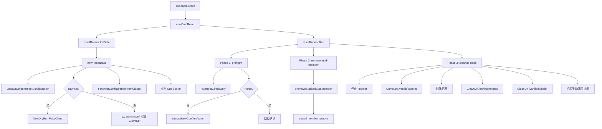
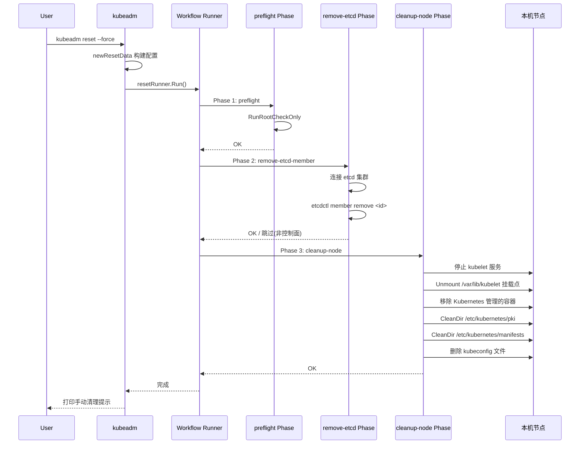

> **生产环境安全提示**
>
> 本文档包含可直接执行的运维命令。执行前请确认：当前目标集群与 Namespace 是否正确；是否具备足够的 RBAC 权限；是否已在非生产环境验证。命令风险等级标注：🔴 高风险（可能造成数据丢失或服务中断）、🟡 中风险（会修改集群状态，但通常可回滚）、🟢 低风险/只读（信息收集，无副作用）。


title: Kubernetes 集群删除逻辑 — 基于官方代码分析
category: cluster-delete
tags:
- cluster-delete
- kubeadm
- reset
- kubectl
- drain
- delete-node
- workflow
- phases
last_updated: 2026-05-18
description: 深入分析 Kubernetes 集群删除的完整逻辑，涵盖 kubeadm reset 命令的 resetData 构建、Phase 执行框架、API
  Client 创建、DryRun 模式以及各删除方式的对比（kubeadm reset vs kubectl delete node vs 手动清理）。
difficulty: advanced
intent_queries:
- kubernetes cluster delete source code analysis
- kubeadm reset resetData newResetData kubernetes
- workflow runner kubeadm phases
- kubernetes cluster delete vs kubectl delete node
- kubeadm reset vs manual cleanup
trigger_keywords:
- cluster delete
- kubeadm reset
- resetData
- newResetData
- workflow.Runner
- Phase execution
- DryRun
- ForceReset
- kubectl delete node
- manual cleanup
reading_level: advanced
audience:
- platform-engineer
- kubernetes-administrator
- sre
estimated_read_time: 5min
related_domains:
- 集群基础
- 集群基础
related_topics:
- cluster-delete
- reset
- cleanup
- etcd-cleanup
- force-delete
- security-delete
- network-cleanup
- ha-delete
- cloud-delete
- troubleshooting
domain_link: '[Installation](../集群基础/README.md)'
topic_link: '[Cluster Delete README](./README.md)'
authors:
- name: KUDIG Team
  role: contributor
k8s_versions:
- '1.28'
- '1.29'
- '1.30'
- '1.31'
- '1.32'
---

# Kubernetes 集群删除逻辑 — 基于官方代码分析

## 函数签名

```go
func newCmdReset(in io.Reader, out io.Writer, resetOptions *resetOptions) *cobra.Command

func (r *resetData) ForceReset() bool
func (r *resetData) DryRun() bool
func (r *resetData) Client() clientset.Interface
func (r *resetData) CertificatesDir() string
func (r *resetData) CRISocketPath() string
func (r *resetData) CleanupTmpDir() bool
func (r *resetData) Cfg() *kubeadmapi.InitConfiguration
func (r *resetData) ResetCfg() *kubeadmapi.ResetConfiguration
```

## 源码位置

| 组件 | 源码路径 | 说明 |
|------|---------|------|
| reset 入口 | `cmd/kubeadm/app/cmd/reset.go` | 命令注册、resetData 构建 |
| reset phases | `cmd/kubeadm/app/cmd/phases/reset/` | preflight/remove-etcd/cleanup-node |
| etcd 操作 | `cmd/kubeadm/app/phases/etcd/local.go` | RemoveStackedEtcdMember |
| workflow 引擎 | `cmd/kubeadm/app/cmd/phases/workflow/runner.go` | Phase 执行框架 |
| 配置加载 | `cmd/kubeadm/app/util/config/initconfiguration.go` | 配置解析与默认值 |
| 清理工具 | `cmd/kubeadm/app/util/users.go` | 用户和目录清理 |

## 参数说明

### resetOptions 字段

| 字段 | 类型 | 说明 |
|------|------|------|
| `kubeconfigPath` | `string` | admin kubeconfig 路径，默认 `/etc/kubernetes/admin.conf` |
| `cfgPath` | `string` | `--config` 指定的配置文件路径 |
| `ignorePreflightErrors` | `[]string` | 忽略的预检错误列表 |
| `externalcfg` | `*kubeadmapiv1.ResetConfiguration` | 命令行标志构建的默认配置 |
| `skipCRIDetect` | `bool` | 是否跳过容器运行时检测 |

### ResetConfiguration 字段

| 字段 | 类型 | 说明 | 默认值 |
|------|------|------|--------|
| `CertificatesDir` | `string` | 证书目录 | `/etc/kubernetes/pki` |
| `CleanupTmpDir` | `bool` | 是否清理临时目录 | `false` |
| `CRISocket` | `string` | 容器运行时 socket 路径 | 自动检测 |
| `DryRun` | `bool` | 干跑模式 | `false` |
| `Force` | `bool` | 跳过确认提示 | `false` |
| `IgnorePreflightErrors` | `[]string` | 忽略的预检错误 | |
| `SkipPhases` | `[]string` | 跳过的阶段列表 | |
| `UnmountFlags` | `[]string` | Linux unmount2() 标志 | |
| `Timeouts` | `*Timeouts` | 超时配置 | |

## 返回值

| 函数 | 返回值 | 说明 |
|------|--------|------|
| `newCmdReset` | `*cobra.Command` | 返回配置好的 reset 子命令 |
| `ForceReset` | `bool` | 是否跳过用户确认 |
| `DryRun` | `bool` | 是否为干跑模式 |
| `Client` | `clientset.Interface` | Kubernetes API 客户端（dry-run 时为 FakeClient） |
| `Cfg` | `*kubeadmapi.InitConfiguration` | 从集群获取的配置，不可达时为 nil |

## 调用链



## 源码分析

### 概述

Kubernetes 集群删除涉及多个层面：节点级重置（`kubeadm reset`）、API 对象删除（`kubectl delete node`）、etcd 成员移除以及系统级清理（容器、网络、证书、数据目录）。kubeadm reset 使用 workflow.Runner 管理 Phase 执行，与 `kubeadm init` 共享同一 workflow 引擎，采用 best-effort 策略，尽力回滚但不保证完全清理。

### 命令注册与初始化

```go
// cmd/kubeadm/app/cmd/reset.go
func newCmdReset(in io.Reader, out io.Writer, resetOptions *resetOptions) *cobra.Command {
    resetRunner := workflow.NewRunner()

    cmd := &cobra.Command{
        Use:   "reset",
        Short: "Performs a best effort revert of changes made to this host by 'kubeadm init' or 'kubeadm join'",
        RunE: func(cmd *cobra.Command, args []string) error {
            data, err := resetRunner.InitData(args)
            if err != nil {
                return err
            }
            if err := resetRunner.Run(args); err != nil {
                return err
            }
            fmt.Fprint(out, manualCleanupInstructions)
            return nil
        },
    }

    resetRunner.AppendPhase(phases.NewPreflightPhase())
    resetRunner.AppendPhase(phases.NewRemoveETCDMemberPhase())
    resetRunner.AppendPhase(phases.NewCleanupNodePhase())

    resetRunner.SetDataInitializer(func(cmd *cobra.Command, args []string) (workflow.RunData, error) {
        return newResetData(cmd, resetOptions, in, out, true)
    })

    resetRunner.BindToCommand(cmd)
    return cmd
}
```

### resetData 构建流程

```go
type resetData struct {
    certificatesDir       string
    client                clientset.Interface
    criSocketPath         string
    forceReset            bool
    ignorePreflightErrors sets.Set[string]
    inputReader           io.Reader
    outputWriter          io.Writer
    cfg                   *kubeadmapi.InitConfiguration
    resetCfg              *kubeadmapi.ResetConfiguration
    dryRun                bool
    cleanupTmpDir         bool
}

func newResetData(cmd *cobra.Command, opts *resetOptions, in io.Reader, out io.Writer, allowExperimental bool) (*resetData, error) {
    resetCfg, err := configutil.LoadOrDefaultResetConfiguration(
        opts.cfgPath,
        opts.externalcfg,
        configutil.LoadOrDefaultConfigurationOptions{
            AllowExperimental: allowExperimental,
            SkipCRIDetect:     opts.skipCRIDetect,
        },
    )
    if err != nil {
        return nil, err
    }

    var client clientset.Interface
    if resetCfg.DryRun {
        dryRun := apiclient.NewDryRun().
            WithDefaultMarshalFunction().
            WithWriter(os.Stdout)
        dryRun.AppendReactor(dryRun.GetKubeadmConfigReactor()).
            AppendReactor(dryRun.GetKubeletConfigReactor()).
            AppendReactor(dryRun.GetKubeProxyConfigReactor())
        client = dryRun.FakeClient()
    } else {
        client, err = kubeconfigutil.ClientSetFromFile(opts.kubeconfigPath)
        if err != nil {
            klog.Warningf("could not create a Kubernetes API client: %v", err)
        }
    }

    var cfg *kubeadmapi.InitConfiguration
    if client != nil {
        cfg, err = configutil.FetchInitConfigurationFromCluster(client, nil, "reset", true, true, true)
        if err != nil {
            klog.Warningf("could not fetch the kubeadm-config ConfigMap: %v", err)
        }
    }

    criSocketPath := detectCRISocket(resetCfg, cfg)

    return &resetData{
        certificatesDir:       resetCfg.CertificatesDir,
        client:                client,
        criSocketPath:         criSocketPath,
        forceReset:            resetCfg.Force,
        ignorePreflightErrors: sets.New[string](resetCfg.IgnorePreflightErrors...),
        inputReader:           in,
        outputWriter:          out,
        cfg:                   cfg,
        resetCfg:              resetCfg,
        dryRun:                resetCfg.DryRun,
        cleanupTmpDir:         resetCfg.CleanupTmpDir,
    }, nil
}
```

**关键设计**：
- 如果无法连接 API Server（集群已不可用），`reset` 仍然可以执行
- `cfg` 为 nil 时，etcd 移除阶段会跳过，但节点清理阶段仍正常工作
- DryRun 使用 FakeClient 替代真实 API 调用

### Phase 注册与执行框架

```go
// cmd/kubeadm/app/cmd/phases/workflow/runner.go
type Runner struct {
    phases           []Phase
    dataInitializer  DataInitializer
    Options          RunnerOptions
}

type Phase struct {
    Name         string
    Aliases      []string
    Short        string
    Long         string
    Run          func(RunData) error
    RunIf        func(RunData) bool
    InheritFlags []string
}

func (r *Runner) Run(args []string) error {
    data, err := r.dataInitializer(args)
    if err != nil {
        return err
    }

    for _, phase := range r.phases {
        if r.shouldSkip(phase.Name) {
            klog.V(1).Infof("[skip] Skipping phase %q", phase.Name)
            continue
        }
        if phase.RunIf != nil && !phase.RunIf(data) {
            continue
        }
        if err := phase.Run(data); err != nil {
            return err
        }
    }
    return nil
}
```

### 删除方式对比

> ⚠️ **🔴 灾难性操作** — 含不可逆命令，执行前必须满足变更窗口+双人复核+事前备份+回滚方案
> - `kubeadm reset`：清理节点所有 K8s 配置/证书/CNI，节点脱离集群
> - `kubectl delete`：删除资源（可由声明式清单重建）

> **🔴 高风险操作警告**
>
> 下方命令属于不可逆或高影响操作，执行前请确认：
> - 已备份关键数据与配置
> - 处于批准的变更窗口期
> - 已获得相关责任人授权
> - 已准备回滚或恢复方案
> - 目标集群、Namespace、节点/资源名称正确无误

```
# 🔴 高风险：可能造成数据丢失或服务中断，执行前需备份、变更审批与回滚方案
┌─────────────────────────────────────────────────────────────────────┐
│                     集群删除方式                                      │
├──────────────────────┬──────────────────────────────────────────────┤
│ kubeadm reset        │ 单节点重置：停止 kubelet、删除容器/配置/证书   │  # ⚠️ 清理节点所有 K8s 配置
│ kubectl delete node  │ API 层删除：从 etcd 移除 Node 对象            │
│ kubeadm reset --force│ 强制重置：跳过确认提示                        │  # ⚠️ 清理节点所有 K8s 配置
│ 手动清理             │ iptables、CNI、/var/lib/kubelet 等             │
└──────────────────────┴──────────────────────────────────────────────┘
```
## 执行流程



## 使用场景

1. **工作节点移除**：drain → delete node → kubeadm reset
2. **控制面节点移除**：remove-etcd-member → drain → delete node → reset
3. **集群完全销毁**：所有节点按序 reset，最后手动清理网络/存储
4. **故障恢复**：节点异常后 reset 重新加入集群
5. **开发环境重置**：快速清理并重新创建测试集群

## 配置示例

```yaml
apiVersion: kubeadm.k8s.io/v1beta4
kind: ResetConfiguration
certificatesDir: /etc/kubernetes/pki
cleanupTmpDir: true
criSocket: unix:///run/containerd/containerd.sock
dryRun: false
force: true
ignorePreflightErrors:
  - IsPrivilegedUser
skipPhases: []
unmountFlags:
  - MNT_DETACH
timeouts:
  etcdTakeover: 2m0s
```

## 实战示例

### 生产环境完整节点移除

> ⚠️ **🔴 灾难性操作** — 含不可逆命令，执行前必须满足变更窗口+双人复核+事前备份+回滚方案
> - `kubeadm reset`：清理节点所有 K8s 配置/证书/CNI，节点脱离集群
> - `rm -rf (系统/数据路径)`：删除系统或数据文件，可能摧毁节点或丢失全部数据
> - `iptables -F/-P DROP`：清空/改防火墙规则，可能立即断网(含SSH)
> - `kubectl drain`：驱逐节点所有 Pod，业务流量受影响

> **🔴 高风险操作警告**
>
> 下方命令属于不可逆或高影响操作，执行前请确认：
> - 已备份关键数据与配置
> - 处于批准的变更窗口期
> - 已获得相关责任人授权
> - 已准备回滚或恢复方案
> - 目标集群、Namespace、节点/资源名称正确无误

``` bash
# 🔴 高风险：可能造成数据丢失或服务中断，执行前需备份、变更审批与回滚方案
# 步骤 1: 驱逐节点上的 Pod
kubectl drain worker-1 --ignore-daemonsets --delete-emptydir-data
# node/worker-1 cordoned
# evicting pod default/web-app-5d8c7b6f9c-abcde
# evicting pod default/web-app-5d8c7b6f9c-fghij
# pod/web-app-5d8c7b6f9c-abcde evicted
# pod/web-app-5d8c7b6f9c-fghij evicted

# 步骤 2: 从 API 层删除 Node 对象
kubectl delete node worker-1
# node "worker-1" deleted

# 步骤 3: 在目标节点执行 reset
kubeadm reset --force  # ⚠️ 清理节点所有 K8s 配置
# [reset] Reading configuration from the cluster...
# [reset] FYI: You can look at this config file with 'kubectl -n kube-system get cm kubeadm-config -o yaml'
# [preflight] Running pre-flight checks
# [reset] Stopping the kubelet service
# [reset] Unmounting mounted directories in "/var/lib/kubelet"
# [reset] Deleting Kubernetes-managed containers
# [reset] Cleaning up /etc/kubernetes/pki
# [reset] Cleaning up /etc/kubernetes/manifests
# [reset] Cleaning up /var/lib/kubelet
# [reset] Cleaning up /var/lib/etcd
# [reset] Removing /etc/kubernetes/admin.conf
# [reset] Removing /etc/kubernetes/kubelet.conf
# [reset] Removing /etc/kubernetes/bootstrap-kubelet.conf
# [reset] Removing /etc/kubernetes/controller-manager.conf
# [reset] Removing /etc/kubernetes/scheduler.conf

# 步骤 4: 手动清理残留
iptables -F && iptables -t nat -F && iptables -t mangle -F && iptables -X
ipvsadm -C
rm -rf /etc/cni/net.d  # ⚠️ 删除系统/数据文件
rm -rf $HOME/.kube/config  # ⚠️ 删除系统/数据文件
```
### 仅移除 etcd 成员

> ⚠️ **🔴 灾难性操作** — 含不可逆命令，执行前必须满足变更窗口+双人复核+事前备份+回滚方案
> - `etcdctl member remove`：移除 etcd 成员，误删多数派会致集群不可用/丢数据

``` bash
# 🟢 低风险：只读/信息收集，通常无副作用
# 查看当前 etcd 成员
ETCDCTL_API=3 etcdctl member list \
  --endpoints=https://127.0.0.1:2379 \
  --cacert=/etc/kubernetes/pki/etcd/ca.crt \
  --cert=/etc/kubernetes/pki/etcd/healthcheck-client.crt \
  --key=/etc/kubernetes/pki/etcd/healthcheck-client.key \
  -w table

# +------------------+---------+----------+----------------------------+
# |        ID        | STATUS  |   NAME   |        PEER ADDRS          |
# +------------------+---------+----------+----------------------------+
# | 7c4c8d5d4f000001 | started | master-1 | https://192.168.1.10:2380  |
# | 7c4c8d5d4f000002 | started | master-2 | https://192.168.1.11:2380  |
# | 7c4c8d5d4f000003 | started | master-3 | https://192.168.1.12:2380  |
# +------------------+---------+----------+----------------------------+

# 移除指定成员
ETCDCTL_API=3 etcdctl member remove 7c4c8d5d4f000003 \
  --endpoints=https://192.168.1.10:2379 \
  --cacert=/etc/kubernetes/pki/etcd/ca.crt \
  --cert=/etc/kubernetes/pki/etcd/healthcheck-client.crt \
  --key=/etc/kubernetes/pki/etcd/healthcheck-client.key
# Member 7c4c8d5d4f000003 removed from cluster xxxxxxx
```
### DryRun 模式

> ⚠️ **🔴 灾难性操作** — 含不可逆命令，执行前必须满足变更窗口+双人复核+事前备份+回滚方案
> - `kubeadm reset`：清理节点所有 K8s 配置/证书/CNI，节点脱离集群

```bash
kubeadm reset --dry-run  # ⚠️ 清理节点所有 K8s 配置
# [dryrun] Would stop the kubelet service
# [dryrun] Would unmount mounted directories in "/var/lib/kubelet"
# [dryrun] Would remove Kubernetes-managed containers
# [dryrun] Would delete contents of directories: [/etc/kubernetes/pki /etc/kubernetes/manifests]
# [dryrun] Would delete files: [/etc/kubernetes/admin.conf /etc/kubernetes/kubelet.conf ...]

```

## 常见错误

| 错误 | 现象 | 原因 | 解决方案 |
|------|------|------|----------|
| etcd 成员移除失败 | `[reset] error removing etcd member` | etcd 集群不可达或仲裁不足 | 手动 `etcdctl member remove` |
| Unmount 卡住 | reset 挂起不完成 | 某些挂载点被进程占用 | `umount -l` 或 `fuser -m` 查找占用进程 |
| 容器删除失败 | `error removing containers` | 容器运行时无响应 | 手动 `crictl rm -a` |
| 清理后 kubelet 仍运行 | 节点状态仍显示 NotReady | systemd 重新拉起 kubelet | `systemctl disable kubelet && systemctl stop kubelet` |
| CNI 残留 | 重新部署时网络异常 | `/etc/cni/net.d` 未清理 | 手动 `rm -rf /etc/cni/net.d` |
| iptables 残留 | Service 访问异常 | reset 不清理 iptables | `iptables -F && iptables -t nat -F` |
| 无法获取集群配置 | `[reset] could not fetch kubeadm-config` | API Server 不可达 | 不影响 reset，仅跳过 etcd 移除 |

## 相关函数

- [`runPreflight`](02-reset.md) — 预检阶段：root 权限检查和用户确认
- [`runRemoveEtcd`](05-etcd-cleanup.md) — etcd 成员移除阶段
- [`runCleanupNode`](04-cleanup.md) — 节点清理阶段
- [`RemoveStackedEtcdMember`](05-etcd-cleanup.md) — 移除本地 stacked etcd 成员
- [`CleanDir`](04-cleanup.md) — 清理目录内容但保留目录本身
- [`InteractivelyConfirmAction`](02-reset.md) — 交互式确认操作

## Related

- [[reference|#reference Hub]] — tag hub

- [[deep-dive|#deep-dive Hub]] — tag hub

- [[README|README]]
- [[31-脚本/man/INSTALL.md|INSTALL]]
- [[17-系统基础/05-速查卡/go.md|go]]
- [[17-系统基础/05-速查卡/linux.md|linux]]
- [[17-系统基础/05-速查卡/k8s.md|k8s]]

```

<!-- risk-assessed -->
