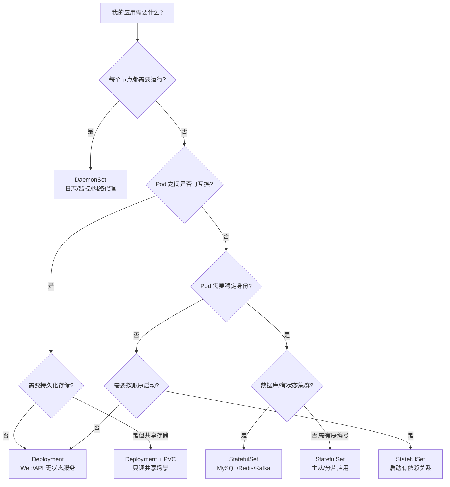

> **生产环境安全提示**
>
> 本文档包含可直接执行的运维命令。执行前请确认：当前目标集群与 Namespace 是否正确；是否具备足够的 RBAC 权限；是否已在非生产环境验证。命令风险等级标注：🔴 高风险（可能造成数据丢失或服务中断）、🟡 中风险（会修改集群状态，但通常可回滚）、🟢 低风险/只读（信息收集，无副作用）。


# Deployment vs StatefulSet vs DaemonSet 选型指南

## 三大控制器核心对比

| 维度 | Deployment | StatefulSet | DaemonSet |
|------|-----------|-------------|-----------|
| **Pod 身份** | 随机 hash 后缀 | 稳定有序编号（-0, -1, -2） | 节点绑定（每节点一个） |
| **Pod 名称** | `web-7d9f6c-xk9wl` | `db-0`, `db-1`, `db-2` | `fluentd-node1`, `fluentd-node2` |
| **存储** | 共享 PVC 或无状态 | 每 Pod 独立 PVC（VolumeClaimTemplate） | 通常挂载节点本地路径 |
| **网络** | 通过 Service 统一入口 | 每 Pod 独立 DNS（Headless Service） | 每节点独立访问 |
| **启动顺序** | 随机并行 | 严格顺序（0→1→2） | 随节点就绪 |
| **滚动更新** | 自由并行 | 逆序更新（2→1→0） | 节点逐个更新 |
| **扩缩容** | 任意副本数 | 有序扩容/逆序缩容 | 随节点数自动调整 |
| **典型场景** | 无状态微服务 | 数据库、消息队列 | 日志采集、监控代理 |

## Deployment 控制器架构要点

```go
// 核心：通过 ReplicaSet 管理 Pod，不保证 Pod 身份
// Pod 名称格式：<deployment-name>-<pod-template-hash>-<random-suffix>
// 所有 Pod 可互换，共享同一 PVC（若挂载）

// 源码位置
// pkg/controller/deployment/deployment_controller.go
func (dc *DeploymentController) syncDeployment(ctx context.Context, key string) error
```

### Deployment 特征

```yaml
# Pod 名称示例（随机后缀）
web-7d9f6c8f5-xk9wl
web-7d9f6c8f5-pq2rt
web-7d9f6c8f5-mn4vz

# DNS 访问：通过 Service 统一入口
web.production.svc.cluster.local

# 存储：所有 Pod 挂载同一 PVC，或各自独立创建（但 PVC 名称随机）
```

## StatefulSet 控制器架构要点

```go
// 核心：每个 Pod 有稳定的标识（ordinal index）
// Pod 名称格式：<statefulset-name>-<ordinal>
// 源码位置
// pkg/controller/statefulset/stateful_set.go
func (ssc *StatefulSetController) syncStatefulSet(
    ctx context.Context,
    set *apps.StatefulSet,
    pods []*v1.Pod,
) error
```

### StatefulSet 特征

```yaml
# Pod 名称示例（稳定有序）
mysql-0    # 主节点
mysql-1    # 从节点1
mysql-2    # 从节点2

# DNS 访问：每 Pod 独立 DNS（需配合 Headless Service）
mysql-0.mysql.production.svc.cluster.local
mysql-1.mysql.production.svc.cluster.local

# 存储：VolumeClaimTemplate 为每个 Pod 创建独立 PVC
# PVC 名称：<template-name>-<pod-name>
data-mysql-0
data-mysql-1
data-mysql-2
```

### StatefulSet 顺序控制源码

```go
// pkg/controller/statefulset/stateful_set_control.go
// 核心保证：顺序启动（Running and Ready before next），逆序删除

func (ssc *defaultStatefulSetControl) updateStatefulSet(
    ctx context.Context,
    set *apps.StatefulSet,
    currentRevision *apps.ControllerRevision,
    updateRevision *apps.ControllerRevision,
    collisionCount int32,
    pods []*v1.Pod,
) (*apps.StatefulSetStatus, error) {
    // 确保第 i 个 Pod 就绪后，才创建第 i+1 个 Pod
    for ord := 0; ord < int(replicaCount); ord++ {
        pod := pods[ord]
        if !isRunningAndReady(pod) && ord < int(monotonicallyDecreasing) {
            // 等待当前 Pod 就绪后再继续
            return &status, nil
        }
    }
}
```

## DaemonSet 控制器架构要点

```go
// 核心：每个 Node 运行且仅运行一个 Pod
// 不设置 replicas，副本数 = 符合 selector 的节点数
// 源码位置
// pkg/controller/daemon/daemon_controller.go
func (dsc *DaemonSetsController) syncDaemonSet(ctx context.Context, key string) error
```

### DaemonSet 特征

```yaml
# Pod 名称格式：<daemonset-name>-<node-hash>
fluentd-node-xk9wl  # node1 上的 Pod
fluentd-node-pq2rt  # node2 上的 Pod

# DaemonSet 不通过 ReplicaSet，直接管理 Pod
# 新节点加入集群 → 自动创建 Pod
# 节点被删除 → 对应 Pod 自动清理
```

### DaemonSet 节点调度源码

```go
// DaemonSet 使用 nodeName 直接绑定，绕过调度器
func (dsc *DaemonSetsController) nodeShouldRunDaemonPod(
    node *v1.Node,
    ds *apps.DaemonSet,
) (shouldRun bool, shouldContinueRunning bool, err error) {
    // 检查 nodeSelector、tolerations、affinity
    // 检查节点是否 Ready
    // 检查节点资源是否满足 Pod 需求
    ...
}
```

## 选型决策树



## 三类工作负载配置对比

### Deployment（无状态 Web 服务）

```yaml
apiVersion: apps/v1
kind: Deployment
metadata:
  name: web-api
spec:
  replicas: 5
  # 关键：无需 serviceName，通过 ClusterIP Service 访问
  selector:
    matchLabels:
      app: web-api
  template:
    metadata:
      labels:
        app: web-api
    spec:
      containers:
      - name: web
        image: myapp:v1.0.0
        # Pod 间完全等价，可任意扩缩
```

### StatefulSet（MySQL 主从集群）

```yaml
apiVersion: apps/v1
kind: StatefulSet
metadata:
  name: mysql
spec:
  serviceName: mysql-headless  # 必须指定 Headless Service
  replicas: 3
  selector:
    matchLabels:
      app: mysql
  template:
    metadata:
      labels:
        app: mysql
    spec:
      containers:
      - name: mysql
        image: mysql:8.0
        env:
        # 通过 hostname 判断是否为主节点
        - name: MY_POD_NAME
          valueFrom:
            fieldRef:
              fieldPath: metadata.name
  # VolumeClaimTemplate 为每个 Pod 创建独立 PVC
  volumeClaimTemplates:
  - metadata:
      name: data
    spec:
      accessModes: ["ReadWriteOnce"]
      resources:
        requests:
          storage: 100Gi
      storageClassName: ssd
---
# Headless Service：让每个 Pod 有独立 DNS
apiVersion: v1
kind: Service
metadata:
  name: mysql-headless
spec:
  clusterIP: None  # Headless
  selector:
    app: mysql
  ports:
  - port: 3306
```

### DaemonSet（节点日志采集）

```yaml
apiVersion: apps/v1
kind: DaemonSet
metadata:
  name: fluentd
spec:
  selector:
    matchLabels:
      app: fluentd
  template:
    metadata:
      labels:
        app: fluentd
    spec:
      # 容忍节点 taint，确保所有节点都能部署
      tolerations:
      - effect: NoSchedule
        operator: Exists
      - effect: NoExecute
        operator: Exists
      containers:
      - name: fluentd
        image: fluent/fluentd:v1.16
        # 挂载节点本地日志目录
        volumeMounts:
        - name: varlog
          mountPath: /var/log
        - name: varlibdockercontainers
          mountPath: /var/lib/docker/containers
          readOnly: true
      volumes:
      - name: varlog
        hostPath:
          path: /var/log
      - name: varlibdockercontainers
        hostPath:
          path: /var/lib/docker/containers
```

## 常见误用场景

| 误用 | 正确选择 | 原因 |
|------|---------|------|
| 用 Deployment 部署 Redis 集群 | StatefulSet | Redis Cluster 需要稳定 Pod 名称和独立存储 |
| 用 StatefulSet 部署无状态 API | Deployment | 不需要顺序保证，StatefulSet 更新更慢 |
| 用 Deployment 部署 Prometheus | StatefulSet | 需要持久化 TSDB 存储到独立 PVC |
| 用 Deployment 部署 CNI Agent | DaemonSet | 需要在每个节点运行且随节点变化自动管理 |
| 用 DaemonSet 部署普通 Web 服务 | Deployment | DaemonSet 不支持 replicas 控制，不适合可扩展服务 |

## 资源消耗对比

| 特性 | Deployment | StatefulSet | DaemonSet |
|------|-----------|-------------|-----------|
| 控制器开销 | 通过 RS 二层管理 | 直接管理 Pod | 直接管理 Pod |
| 存储开销 | 共享或无 | 每 Pod 独立 PVC | 节点 HostPath |
| 扩缩速度 | 快（并行） | 慢（顺序） | 自动跟随节点 |
| 更新停机时间 | 零（默认） | 零（逆序滚动） | 节点级别 |

## 相关函数

- [`syncDeployment`](02-deployment-controller.md) — Deployment 主协调函数
- [`rolloutRolling`](04-rolling-update.md) — Deployment 滚动更新实现

## 版本说明

- StatefulSet 自 v1.9 起 GA
- DaemonSet 自 v1.2 起稳定
- 基于 Kubernetes v1.28 – v1.32 源码分析

## Related

- [[22-概念/02-工作负载/deployment-controller-architecture.md|deployment-controller-architecture]]
- [[23-实体/02-K8s核心组件/kubernetes.md|kubernetes]]
- [[23-实体/02-K8s核心组件/cni.md|cni]]
- [[17-系统基础/05-速查卡/sql.md|sql]]
- [[17-系统基础/06-知识字典/workloads/daemonset.md|daemonset]]


<!-- risk-assessed -->
