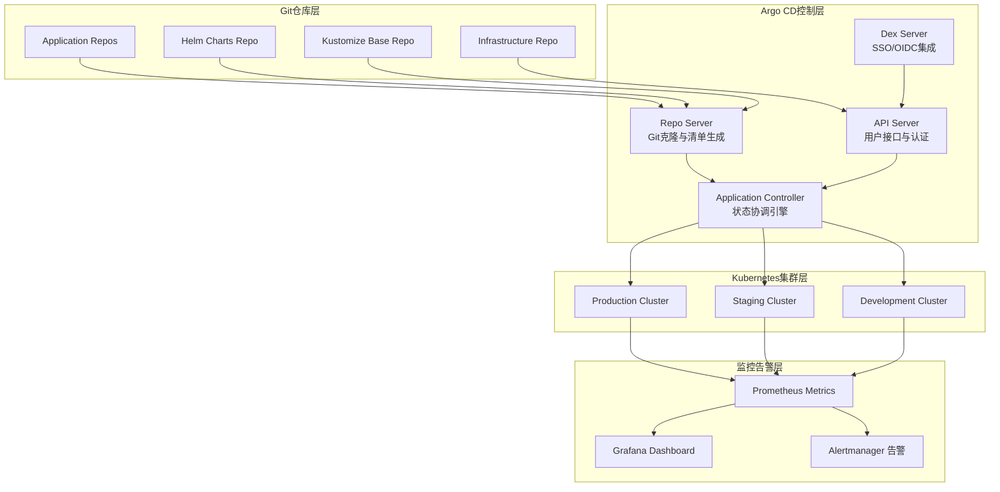
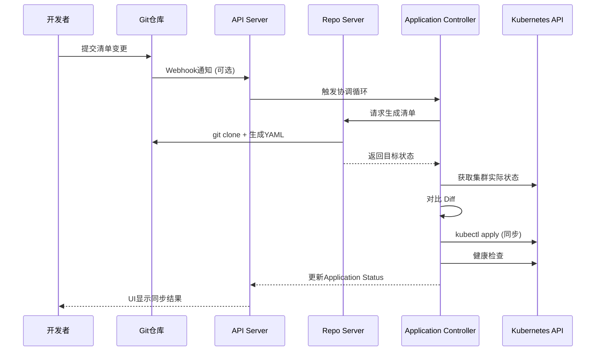

> **生产环境安全提示**
>
> 本文档包含可直接执行的运维命令。执行前请确认：当前目标集群与 Namespace 是否正确；是否具备足够的 RBAC 权限；是否已在非生产环境验证。命令风险等级标注：🔴 高风险（可能造成数据丢失或服务中断）、🟡 中风险（会修改集群状态，但通常可回滚）、🟢 低风险/只读（信息收集，无副作用）。


# [[Argo|Argo]] CD企业级GitOps实践指南

> **作者**: GitOps架构专家 | **版本**: v2.0 | **更新时间**: 2026-04-24
> **适用场景**: 企业级持续交付平台 | **复杂度**: ⭐⭐⭐⭐⭐
> **适用版本**: Argo CD v3.3.x / [[Helm|Helm]] Chart v7.8.x

---

<!-- chunk: 📋 目录 -->## 📋 目录

- [一、概述](#一概述)
- [二、GitOps架构深度解析](#二gitops架构深度解析)
- [三、企业级高可用部署](#三企业级高可用部署)
- [四、核心配置](#四核心配置)
- [五、安全与合规管理](#五安全与合规管理)
- [六、多环境管理策略](#六多环境管理策略)
- [七、监控与回滚](#七监控与回滚)
- [八、最佳实践](#八最佳实践)
- [九、故障排查](#九故障排查)

---

<!-- chunk: 一、概述 -->## 一、概述

Argo CD 是 CNCF 毕业项目，是业界采用最广泛的 GitOps 持续交付工具。它通过将 Git 仓库作为应用定义的唯一事实来源（Single Source of Truth），自动对比 Git 中声明的期望状态与 [[Kubernetes|Kubernetes]] 集群中的实际状态，并驱动集群状态向期望状态收敛。Argo CD 的核心设计理念是声明式、版本化和自动化——所有配置变更通过 Git 提交触发，每一次部署都可审计、可回滚。

在企业级场景中，Argo CD 面临的核心挑战包括：大规模应用管理（单实例管理 1000+ 应用）、多集群多租户隔离、安全合规（RBAC、SSO、审计）、高可用部署（消除单点问题）以及与现有 CI/CD 工具链的集成。本文档基于大规模生产环境的应用经验，系统性地覆盖了从架构设计到运维管理的完整技术方案，帮助企业在 Kubernetes 生态中构建安全、可靠的 GitOps 交付体系。

Argo CD 的技术优势在于其丰富的生态——ApplicationSet 提供了声明式的多环境/多集群应用生成能力，AppProject 实现了项目级的权限隔离，Argo Rollouts 提供了渐进式交付能力，Argo Notifications 支持灵活的事件通知。这些组件组合在一起，形成了一个完整的云原生交付平台。

---

<!-- chunk: 二、GitOps架构深度解析 -->## 二、GitOps架构深度解析

## 2.1 核心概念与原理

Argo CD 的核心工作循环是"持续协调"（Continuous Reconciliation）。Application Controller 定期从 Git 仓库拉取应用清单，与集群中的实际资源进行对比，当检测到偏差（Drift）时，根据配置的同步策略自动或手动地将集群状态拉回到期望状态。



## 2.2 GitOps工作流程详解

GitOps 工作流程可以分为四个阶段：开发、审查、部署和验证。每个阶段都有明确的职责边界和自动化检查点。

```yaml
gitops_workflow:
  phases:
    development:
      - step: "开发者提交代码到feature分支"
        trigger: "git push"
        automation: "CI流水线自动运行单元测试和集成测试"
      - step: "创建Pull Request触发代码审查"
        trigger: "PR created"
        automation: "静态分析、安全扫描、依赖检查"
    
    review:
      - step: "代码审查通过"
        actors: ["至少2位审查者", "CI流水线通过"]
      - step: "安全扫描和漏洞检测"
        automation: "SAST/DAST/SCA扫描"
      - step: "合规性检查"
        automation: "许可证检查、SBOM生成"
    
    deployment:
      - step: "合并到主分支触发部署"
        trigger: "PR merged"
      - step: "Argo CD检测到Git变更"
        mechanism: "轮询 (默认3分钟) / Webhook 即时触发"
      - step: "Repo Server生成Kubernetes清单"
        tools: ["Helm template", "Kustomize build", "Jsonnet eval"]
      - step: "Application Controller检测状态漂移"
        comparison: "Git desired state vs Cluster actual state"
      - step: "自动同步到目标环境"
        strategy: "根据syncPolicy配置决定自动/手动"
    
    verification:
      - step: "应用健康状态检查"
        checks: ["Deployment ready", "Service endpoint", "Ingress reachable"]
      - step: "冒烟测试验证"
        automation: "Argo CD Resource Hook (PostSync)"
      - step: "监控指标验证"
        checks: ["Error rate < 1%", "P99 latency < 500ms"]
      - step: "失败时自动回滚"
        mechanism: "syncPolicy.retry + Rollback mechanism"
```

## 2.3 Argo CD 内部组件交互



---

<!-- chunk: 三、企业级高可用部署 -->## 三、企业级高可用部署

## 3.1 Argo CD Helm部署配置

```yaml
# values-argo-cd-production.yaml
global:
  domain: argocd.example.com
  image:
    repository: quay.io/argoproj/argocd
    tag: v3.3.8

configs:
  cm:
    # 默认资源排除 (Argo CD v3.0+)
    resource.exclusions: |
      - apiGroups:
        - ""
        kinds:
        - Endpoints
        - EndpointSlice
        - Lease
        clusters:
        - "*"
      - apiGroups:
        - cilium.io
        kinds:
        - CiliumIdentity
        - CiliumEndpoint
        clusters:
        - "*"
    
    # 资源自定义健康检查
    resource.customizations: |
      apps/Deployment:
        health.lua: |
          hs = {}
          if obj.status ~= nil then
            if obj.status.availableReplicas ~= nil then
              hs.status = "Healthy"
              hs.message = "Deployment is available"
            end
          end
          return hs

  rbac:
    policy.default: role:readonly
    policy.csv: |
      p, role:org-admin, applications, *, */*, allow
      p, role:org-admin, clusters, get, *, allow
      p, role:org-admin, repositories, *, *, allow
      g, your-github-org:admin-team, role:org-admin

  secret:
    extra:
      argocd.secretkey: "<base64-encoded-32-byte-key>"

  params:
    server.insecure: false
    server.enable.gzip: true
    controller.repo.server.timeout.seconds: "120"

dex:
  enabled: true

server:
  replicas: 3
  resources:
    requests:
      memory: 256Mi
      cpu: 100m
    limits:
      memory: 512Mi
      cpu: 500m
  autoscaling:
    enabled: true
    minReplicas: 3
    maxReplicas: 10
    targetCPUUtilizationPercentage: 80
  ingress:
    enabled: true
    ingressClassName: nginx
    annotations:
      cert-manager.io/cluster-issuer: "letsencrypt-prod"
      nginx.ingress.kubernetes.io/ssl-redirect: "true"
      nginx.ingress.kubernetes.io/backend-protocol: "HTTPS"
    tls: true

repoServer:
  replicas: 2
  resources:
    requests:
      memory: 256Mi
      cpu: 100m
    limits:
      memory: 1Gi
      cpu: 1000m
  volumes:
    - name: custom-tools
      emptyDir: {}
  volumeMounts:
    - name: custom-tools
      mountPath: /usr/local/bin/ksops
  initContainers:
    - name: download-tools
      image: alpine:3.19
      command: [sh, -c]
      args:
        - wget -O /custom-tools/ksops https://github.com/viaduct-ai/kustomize-sops/releases/download/v4.3.3/ksops_4.3.3_Linux_x86_64.tar.gz &&
          tar -xzf /custom-tools/ksops -C /custom-tools &&
          chmod +x /custom-tools/ksops
      volumeMounts:
        - name: custom-tools
          mountPath: /custom-tools

controller:
  replicas: 1
  resources:
    requests:
      memory: 512Mi
      cpu: 250m
    limits:
      memory: 2Gi
      cpu: 2000m
  args:
    - --repo-server-timeout-seconds=120
    - --status-processors=20
    - --operation-processors=10

redis:
  enabled: true
```

## 3.2 外部Redis高可用部署

```yaml
apiVersion: apps/v1
kind: StatefulSet
metadata:
  name: argocd-redis-ha
  namespace: argocd
spec:
  serviceName: argocd-redis-ha
  replicas: 3
  selector:
    matchLabels:
      app: argocd-redis-ha
  template:
    metadata:
      labels:
        app: argocd-redis-ha
    spec:
      affinity:
        podAntiAffinity:
          requiredDuringSchedulingIgnoredDuringExecution:
            - labelSelector:
                matchLabels:
                  app: argocd-redis-ha
              topologyKey: kubernetes.io/hostname
      containers:
      - name: redis
        image: redis:7-alpine
        command:
        - redis-server
        - /redis.conf
        ports:
        - containerPort: 6379
        volumeMounts:
        - name: redis-conf
          mountPath: /redis.conf
          subPath: redis.conf
        - name: redis-data
          mountPath: /data
        resources:
          requests:
            memory: 128Mi
            cpu: 50m
          limits:
            memory: 256Mi
            cpu: 100m
        livenessProbe:
          exec:
            command:
            - redis-cli
            - ping
          initialDelaySeconds: 30
          periodSeconds: 10
        readinessProbe:
          exec:
            command:
            - redis-cli
            - ping
          initialDelaySeconds: 5
          periodSeconds: 5
      volumes:
      - name: redis-conf
        configMap:
          name: argocd-redis-config
  volumeClaimTemplates:
  - metadata:
      name: redis-data
    spec:
      accessModes: ["ReadWriteOnce"]
      storageClassName: "fast-ssd"
      resources:
        requests:
          storage: 10Gi
---
apiVersion: v1
kind: ConfigMap
metadata:
  name: argocd-redis-config
  namespace: argocd
data:
  redis.conf: |
    bind 0.0.0.0
    port 6379
    dir /data
    appendonly yes
    appendfilename "appendonly.aof"
    appendfsync everysec
    maxmemory 256mb
    maxmemory-policy allkeys-lru
    save 900 1
    save 300 10
    save 60 10000
```

## 3.3 部署命令

> ⚠️ **🟡 中危变更** — 变更集群资源状态，建议先 --dry-run 或 diff 确认
> - `helm upgrade/install`：部署/升级 release

``` bash
# 🟡 中风险：会修改集群/资源状态，执行前请确认目标、影响范围与授权
helm repo add argo https://argoproj.github.io/argo-helm
helm install argocd argo/argo-cd \
  --namespace argocd \
  --create-namespace \
  --values values-argo-cd-production.yaml \
  --version 7.8.0

# 验证部署
kubectl get pods -n argocd
kubectl get ingress -n argocd

# 获取初始管理员密码
kubectl -n argocd get secret argocd-initial-admin-secret \
  -o jsonpath="{.data.password}" | base64 -d
```
---

<!-- chunk: 四、核心配置 -->## 四、核心配置

## 4.1 Application 定义

```yaml
apiVersion: argoproj.io/v1alpha1
kind: Application
metadata:
  name: microservice-api
  namespace: argocd
  finalizers:
    - resources-finalizer.argocd.argoproj.io
spec:
  project: team-alpha

  source:
    repoURL: https://github.com/company/team-alpha-apps.git
    targetRevision: main
    path: apps/api/overlays/production

    helm:
      releaseName: api
      valueFiles:
        - values-production.yaml
      parameters:
        - name: replicaCount
          value: "3"
        - name: image.tag
          value: "v1.2.3"

  destination:
    server: https://kubernetes.default.svc
    namespace: team-alpha-production

  syncPolicy:
    automated:
      prune: true
      selfHeal: true
      allowEmpty: false
    syncOptions:
      - CreateNamespace=true
      - PrunePropagationPolicy=foreground
      - PruneLast=true
      - ApplyOutOfSyncOnly=true
      - ServerSideApply=true
    retry:
      limit: 5
      backoff:
        duration: 5s
        factor: 2
        maxDuration: 3m

  ignoreDifferences:
    - group: apps
      kind: Deployment
      jsonPointers:
        - /spec/replicas
    - group: ""
      kind: Service
      jsonPointers:
        - /spec/clusterIP

  revisionHistoryLimit: 10

  info:
    - name: url
      value: https://api.example.com
    - name: slack-channel
      value: "#team-alpha-alerts"
```

## 4.2 AppProject 项目隔离

```yaml
apiVersion: argoproj.io/v1alpha1
kind: AppProject
metadata:
  name: team-alpha
  namespace: argocd
spec:
  description: "Team Alpha Production Environment"

  sourceRepos:
    - "https://github.com/company/team-alpha-apps.git"
    - "https://github.com/company/helm-charts.git"
    - "https://charts.helm.sh/stable/*"

  destinations:
    - namespace: "team-alpha-*"
      server: https://kubernetes.default.svc
    - namespace: "team-alpha-*"
      server: https://k8s-cluster-prod.example.com

  clusterResourceWhitelist:
    - group: ""
      kind: Namespace
    - group: rbac.authorization.k8s.io
      kind: ClusterRole
    - group: rbac.authorization.k8s.io
      kind: ClusterRoleBinding

  namespaceResourceBlacklist:
    - group: ""
      kind: ResourceQuota
    - group: ""
      kind: LimitRange

  roles:
    - name: admin
      description: "Team Alpha Admin - Full access"
      policies:
        - p, proj:team-alpha:admin, applications, *, team-alpha/*, allow
        - p, proj:team-alpha:admin, projects, get, team-alpha, allow
      groups:
        - "github-org:team-alpha-admin"

    - name: developer
      description: "Team Alpha Developer - Read + Sync"
      policies:
        - p, proj:team-alpha:developer, applications, get, team-alpha/*, allow
        - p, proj:team-alpha:developer, applications, sync, team-alpha/*, allow
        - p, proj:team-alpha:developer, logs, get, team-alpha/*, allow
      groups:
        - "github-org:team-alpha"

    - name: readonly
      description: "Team Alpha ReadOnly"
      policies:
        - p, proj:team-alpha:readonly, applications, get, team-alpha/*, allow
      groups:
        - "github-org:team-alpha-readonly"

  syncWindows:
    - kind: allow
      schedule: "10 1 * * *"
      duration: 1h
      applications:
        - "*"
      manualSync: true
    - kind: deny
      schedule: "0 0 * * *"
      duration: 24h
      namespaces:
        - team-alpha-critical
      manualSync: false
```

## 4.3 ApplicationSet 多环境管理

```yaml
apiVersion: argoproj.io/v1alpha1
kind: ApplicationSet
metadata:
  name: microservices
  namespace: argocd
spec:
  generators:
    - git:
        repoURL: https://github.com/company/gitops.git
        revision: main
        directories:
          - path: apps/*/overlays/*
  template:
    metadata:
      name: '{{path[1]}}-{{path[3]}}'
    spec:
      project: default
      source:
        repoURL: https://github.com/company/gitops.git
        targetRevision: main
        path: '{{path}}'
      destination:
        server: https://kubernetes.default.svc
        namespace: '{{path[1]}}-{{path[3]}}'
      syncPolicy:
        automated:
          prune: true
          selfHeal: true
        syncOptions:
          - CreateNamespace=true
```

## 4.4 Helm Chart 应用

```yaml
apiVersion: argoproj.io/v1alpha1
kind: Application
metadata:
  name: nginx-ingress
  namespace: argocd
spec:
  project: infrastructure
  source:
    repoURL: https://kubernetes.github.io/ingress-nginx
    chart: ingress-nginx
    targetRevision: 4.8.3
    helm:
      releaseName: nginx-ingress
      valueFiles:
        - values-production.yaml
      values: |
        controller:
          replicaCount: 3
          service:
            type: LoadBalancer
          resources:
            limits:
              cpu: 1000m
              memory: 1Gi
            requests:
              cpu: 100m
              memory: 256Mi
          metrics:
            enabled: true
            serviceMonitor:
              enabled: true
      parameters:
        - name: controller.service.annotations.service\.beta\.kubernetes\.io/aws-load-balancer-type
          value: nlb

  destination:
    server: https://kubernetes.default.svc
    namespace: ingress-nginx

  syncPolicy:
    automated:
      prune: true
      selfHeal: true
    syncOptions:
      - CreateNamespace=true
      - ServerSideApply=true
```

---

<!-- chunk: 五、安全与合规管理 -->## 五、安全与合规管理

## 5.1 RBAC权限配置

```yaml
# Argo CD RBAC 配置 (ConfigMap argocd-rbac-cm)
policy.csv: |
  # 默认拒绝所有
  p, role:none, *, *, */*, deny

  # 管理员权限
  p, role:admin, applications, *, */*, allow
  p, role:admin, clusters, *, *, allow
  p, role:admin, repositories, *, *, allow
  p, role:admin, projects, *, *, allow
  p, role:admin, accounts, *, *, allow

  # 开发者权限 - 只能在dev命名空间同步
  p, role:developer, applications, get, */*, allow
  p, role:developer, applications, sync, dev/*, allow
  p, role:developer, projects, get, *, allow
  p, role:developer, logs, get, dev/*, allow

  # 运维权限 - 全命名空间操作
  p, role:operator, applications, *, */*, allow
  p, role:operator, clusters, get, *, allow
  p, role:operator, repositories, get, *, allow
  p, role:operator, logs, get, */*, allow
  p, role:operator, exec, create, */*, allow

  # 审计权限 - 只读 + 事件
  p, role:auditor, applications, get, */*, allow
  p, role:auditor, projects, get, *, allow
  p, role:auditor, logs, get, */*, allow
  p, role:auditor, events, get, */*, allow

  # 角色绑定
  g, admin@example.com, role:admin
  g, developers@example.com, role:developer
  g, operators@example.com, role:operator
  g, auditors@example.com, role:auditor

policy.default: role:none
scopes: '[groups]'
```

## 5.2 SSO集成配置

```yaml
# Dex SSO 配置
dex.config: |
  connectors:
    - type: github
      id: github
      name: GitHub
      config:
        clientID: $dex.github.clientId
        clientSecret: $dex.github.clientSecret
        orgs:
        - name: your-organization

    - type: ldap
      id: ldap
      name: LDAP
      config:
        host: ldap.example.com:636
        insecureNoSSL: false
        rootCAData: $ldap.ca.cert
        bindDN: cn=admin,dc=example,dc=com
        bindPW: $ldap.bind.password
        usernamePrompt: Email Address
        userSearch:
          baseDN: ou=people,dc=example,dc=com
          filter: "(objectClass=person)"
          username: mail
          idAttr: DN
          emailAttr: mail
          nameAttr: displayName
        groupSearch:
          baseDN: ou=groups,dc=example,dc=com
          filter: "(objectClass=groupOfNames)"
          userMatchers:
          - userAttr: DN
            groupAttr: member
          nameAttr: cn

    - type: saml
      id: okta
      name: Okta
      config:
        ssoURL: https://your-org.okta.com/app/your-app/sso/saml
        caData: $saml.ca.cert
        redirectURI: https://argocd.example.com/api/dex/callback
        usernameAttr: name
        emailAttr: email
        groupsAttr: groups

  staticClients:
    - id: argo-cd
      redirectURIs:
        - https://argocd.example.com/auth/callback
      name: Argo CD
      secretEnv: ARGOCD_SSO_CLIENT_SECRET
```

## 5.3 网络安全策略

```yaml
apiVersion: networking.k8s.io/v1
kind: NetworkPolicy
metadata:
  name: argocd-network-policy
  namespace: argocd
spec:
  podSelector:
    matchLabels:
      app.kubernetes.io/part-of: argocd
  policyTypes:
    - Ingress
    - Egress
  ingress:
    - from:
        - namespaceSelector:
            matchLabels:
              name: ingress-nginx
      ports:
        - port: 8080
          protocol: TCP
    - from:
        - podSelector:
            matchLabels:
              app.kubernetes.io/part-of: argocd
  egress:
    - to:
        - namespaceSelector: {}
      ports:
        - port: 443
          protocol: TCP
        - port: 53
          protocol: UDP
    - to:
        - namespaceSelector:
            matchLabels:
              name: monitoring
      ports:
        - port: 9090
          protocol: TCP
```

---

<!-- chunk: 六、多环境管理策略 -->## 六、多环境管理策略

## 6.1 环境目录策略 (推荐)

```
gitops-repo/
├── apps/
│   ├── base/                    # 基础配置
│   │   ├── api/
│   │   │   ├── kustomization.yaml
│   │   │   ├── deployment.yaml
│   │   │   └── service.yaml
│   │   └── frontend/
│   ├── overlays/
│   │   ├── development/
│   │   │   ├── kustomization.yaml
│   │   │   └── patches/
│   │   │       └── replicas.yaml
│   │   ├── staging/
│   │   │   ├── kustomization.yaml
│   │   │   └── patches/
│   │   └── production/
│   │       ├── kustomization.yaml
│   │       └── patches/
│   │           ├── replicas.yaml
│   │           └── resources.yaml
├── infrastructure/
│   ├── base/
│   │   ├── ingress-nginx/
│   │   └── cert-manager/
│   └── overlays/
│       ├── production/
│       └── staging/
└── clusters/
    ├── production/
    │   └── apps.yaml
    └── staging/
        └── apps.yaml
```

## 6.2 环境晋升流程

```yaml
promotion_workflow:
  trigger: git_tag
  stages:
    - from: development
      to: staging
      conditions:
        - tests_passed: true
        - security_scan: clean
        - code_review_approved: true
      automation:
        - 自动创建 PR 到 staging 分支
        - CI 流水线运行集成测试
        - Argo CD 自动同步到 staging 集群

    - from: staging
      to: production
      conditions:
        - manual_approval: required
        - staging_smoke_test: passed
        - monitoring_stable: 24h
        - performance_benchmark: within_threshold
      automation:
        - 创建 PR 到 main 分支
        - 需要生产环境审批人确认
        - Argo CD 手动触发同步
        - PostSync Hook 执行冒烟测试
```

---

<!-- chunk: 七、监控与回滚 -->## 七、监控与回滚

## 7.1 Prometheus监控配置

```yaml
apiVersion: monitoring.coreos.com/v1
kind: ServiceMonitor
metadata:
  name: argocd-metrics
  namespace: monitoring
spec:
  selector:
    matchLabels:
      app.kubernetes.io/part-of: argocd
  namespaceSelector:
    matchNames:
      - argocd
  endpoints:
  - port: metrics
    path: /metrics
    interval: 30s
---
apiVersion: monitoring.coreos.com/v1
kind: PrometheusRule
metadata:
  name: argocd-alerts
  namespace: monitoring
spec:
  groups:
  - name: argocd.rules
    rules:
    - alert: ArgoCDAppSyncFailed
      expr: argocd_app_info{sync_status="OutOfSync"} == 1
      for: 15m
      labels:
        severity: warning
      annotations:
        summary: "Argo CD Application 同步失败"
        description: "应用 {{ $labels.name }} 在 {{ $labels.namespace }} 中同步失败超过15分钟"

    - alert: ArgoCDAppDegraded
      expr: argocd_app_info{health_status="Degraded"} == 1
      for: 5m
      labels:
        severity: critical
      annotations:
        summary: "Argo CD Application 处于降级状态"
        description: "应用 {{ $labels.name }} 健康状态异常: {{ $labels.health_status }}"

    - alert: ArgoCDSyncOperationFailed
      expr: increase(argocd_app_sync_total{phase="Error"}[5m]) > 0
      for: 1m
      labels:
        severity: critical
      annotations:
        summary: "Argo CD同步操作失败"
        description: "应用 {{ $labels.name }} 同步操作出现错误"

    - alert: ArgoCDControllerProcessingSlow
      expr: |
        rate(argocd_app_reconcile_duration_seconds_sum[5m]) /
        rate(argocd_app_reconcile_duration_seconds_count[5m]) > 30
      for: 5m
      labels:
        severity: warning
      annotations:
        summary: "Argo CD控制器处理缓慢"
        description: "应用协调处理时间超过30秒"

    - alert: ArgoCDRepoServerHighErrorRate
      expr: |
        rate(argocd_repo_server_request_total{status_code!="200"}[5m]) /
        rate(argocd_repo_server_request_total[5m]) > 0.1
      for: 5m
      labels:
        severity: warning
      annotations:
        summary: "Repo Server 错误率过高"
```

## 7.2 回滚策略

```bash
# 方式一: 命令行回滚到指定版本
argocd app rollback <app-name> <revision-id>

# 方式二: Git revert (推荐)
git revert <commit-hash>
git push origin main
# Argo CD 会自动检测到变更并同步回滚

# 方式三: 在 UI 中选择历史版本回滚
# Application → History and Rollback → 选择版本 → Rollback

# 方式四: 使用 Resource Hook 自动回滚
```

```yaml
# 自动回滚的 Resource Hook 示例
apiVersion: batch/v1
kind: Job
metadata:
  name: rollback-hook
  annotations:
    argocd.argoproj.io/hook: PostSync
    argocd.argoproj.io/hook-delete-policy: HookSucceeded
spec:
  template:
    spec:
      containers:
      - name: health-check
        image: curlimages/curl:latest
        command:
          - /bin/sh
          - -c
          - |
            STATUS=$(curl -s -o /dev/null -w "%{http_code}" https://api.example.com/health)
            if [ "$STATUS" != "200" ]; then
              echo "Health check failed with status $STATUS"
              exit 1
            fi
      restartPolicy: Never
  backoffLimit: 3
```

## 7.3 备份与灾难恢复

> ⚠️ **🔴 灾难性操作** — 含不可逆命令，执行前必须满足变更窗口+双人复核+事前备份+回滚方案
> - `rm -rf (系统/数据路径)`：删除系统或数据文件，可能摧毁节点或丢失全部数据

> **🔴 高风险操作警告**
>
> 下方命令属于不可逆或高影响操作，执行前请确认：
> - 已备份关键数据与配置
> - 处于批准的变更窗口期
> - 已获得相关责任人授权
> - 已准备回滚或恢复方案
> - 目标集群、Namespace、节点/资源名称正确无误

``` bash
# 🔴 高风险：可能造成数据丢失或服务中断，执行前需备份、变更审批与回滚方案
#!/bin/bash
# argocd_backup.sh
BACKUP_DIR="/backup/argocd"
DATE=$(date +%Y%m%d_%H%M%S)
BACKUP_NAME="argocd_backup_${DATE}"

mkdir -p ${BACKUP_DIR}/${BACKUP_NAME}

# 备份应用配置
kubectl get applications -A -o yaml > ${BACKUP_DIR}/${BACKUP_NAME}/applications.yaml

# 备份项目配置
kubectl get appprojects -A -o yaml > ${BACKUP_DIR}/${BACKUP_NAME}/projects.yaml

# 备份ConfigMaps和Secrets
kubectl get configmap -n argocd -o yaml > ${BACKUP_DIR}/${BACKUP_NAME}/configmaps.yaml
kubectl get secret -n argocd -o yaml > ${BACKUP_DIR}/${BACKUP_NAME}/secrets.yaml

# 使用 argocd admin export (推荐)
argocd admin export > ${BACKUP_DIR}/${BACKUP_NAME}/argocd-export.yaml

# 压缩并上传
tar -czf ${BACKUP_DIR}/${BACKUP_NAME}.tar.gz -C ${BACKUP_DIR} ${BACKUP_NAME}
rm -rf ${BACKUP_DIR}/${BACKUP_NAME}  # ⚠️ 删除系统/数据文件

if [ -n "$REMOTE_STORAGE" ]; then
    aws s3 cp ${BACKUP_DIR}/${BACKUP_NAME}.tar.gz s3://$REMOTE_STORAGE/backups/
fi
```
---

<!-- chunk: 八、最佳实践 -->## 八、最佳实践

## 8.1 GitOps实施最佳实践

```yaml
仓库结构设计:
  - 基础设施仓库与应用仓库分离
  - 使用 Kustomize Overlay 实现环境差异化
  - 标准化的目录结构约定
  - 版本标签规范 (semver)

应用配置管理:
  - 声明式配置优先
  - 使用 ApplicationSet 减少重复定义
  - 参数化和模板化
  - 配置版本控制与标签
  - 避免在 Application 中硬编码镜像标签

安全合规要求:
  - 强制代码审查 (Branch Protection)
  - 自动安全扫描集成
  - 访问权限最小化 (最小权限 RBAC)
  - 审计日志完整
  - Secret 管理使用外部工具

同步策略:
  - 开发环境: automated + selfHeal
  - 预发布环境: automated + selfHeal
  - 生产环境: 手动触发 (或 automated with syncWindows)
  - 所有关键应用设置 revisionHistoryLimit
```

## 8.2 性能优化

```yaml
大规模部署优化 (>500 apps):
  controller:
    - 增加 status-processors: 20-50
    - 增加 operation-processors: 10-20
    - 设置 repo-server-timeout: 120-300s
    - 启用 Server-Side Apply

  repoServer:
    - 增加副本数: 3-5
    - 增加资源限制: memory 1-2Gi
    - 启用 Git 仓库缓存

  全局:
    - 配置 resource.exclusions 排除高变动资源
    - 合理设置 appResyncPeriod (默认180s)
    - 使用 Webhook 替代轮询减少 API Server 压力
```

---

<!-- chunk: 九、故障排查 -->## 九、故障排查

## 9.1 常见问题诊断

```yaml
同步失败:
  排查命令:
    - argocd app get <app> --refresh
    - argocd app diff <app>
    - kubectl describe application <app> -n argocd
  常见原因:
    - Git 仓库连接问题
    - Helm/Kustomize 模板渲染错误
    - 目标集群权限不足
    - 资源冲突 (已存在同名资源)
  解决方案:
    - 检查 Repo Server 日志
    - 使用 argocd app manifest get 查看生成的清单
    - 添加 ignoreDifferences 规则
    - 检查 AppProject 权限配置

Application 卡在 Progressing:
  排查命令:
    - kubectl get deployment <name> -n <ns>
    - kubectl describe replicaset <name> -n <ns>
  常见原因:
    - 镜像拉取失败
    - 资源不足 (CPU/Memory limits)
    - Readiness Probe 失败
    - PVC Pending
  解决方案:
    - 检查 Pod Events
    - 验证镜像仓库凭证
    - 检查资源配额

Repo Server 错误:
  排查命令:
    - kubectl logs -n argocd deploy/argocd-repo-server
    - argocd repo list
  常见原因:
    - Git 凭证过期
    - 私有 Helm 仓库访问失败
    - 内存不足 (大型 Helm chart)
  解决方案:
    - 更新仓库凭证
    - 增加 Repo Server 资源限制
    - 清理 Git 缓存

性能问题:
  排查命令:
    - kubectl top pods -n argocd
    - 检查 Redis 内存使用
  常见原因:
    - 应用数量过多
    - Git 仓库过大
    - 频繁全量刷新
  解决方案:
    - 增加 Controller workers
    - 配置 resource.exclusions
    - 优化 Git 仓库结构
```

---

*本文档基于企业级GitOps实践经验编写，持续更新最新技术和最佳实践。*

---

<!-- chunk: Obsidian 相关文档 -->## Obsidian 相关文档

- 发布变更 MOC
- [[11-发布变更/README.md|Domain 08: GitOps与CI/CD (GitOps & CI/CD)]]
- Domain-23 GitOps & CI/CD — 开源项目索引
- Jenkins企业级CI/CD流水线深度实践
- GitLab CI/CD 企业级流水线自动化平台
- GitHub Actions Enterprise CI/CD Platform 深度实践
- Tekton 云原生 CI/CD 深度实践
- Flux v2 GitOps 持续交付深度实践
- GitOps 安全与合规深度实践
- CI/CD 流水线模式与渐进式交付深度实践
- Argo CD 企业级 GitOps 实践指南
- Flux GitOps 实践指南

## See Also

- 99-tekton-cicd-guide
- 99-tekton-java-cicd-guide
- 02-jenkins-enterprise-cicd
- 03-gitlab-enterprise-cicd

## Related

- [[21-生态参考/03-领域索引/gitops-cicd-index.md|GitOps / CI-CD 全局索引]]

## 相关合成分析

- [[22-概念/09-平台与发布/gitops-sre-release-gate.md|GitOps SRE 发布门控]]


<!-- risk-assessed -->
