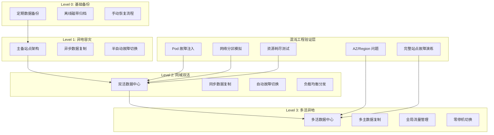

> **生产环境安全提示**
>
> 本文档包含可直接执行的运维命令。执行前请确认：当前目标集群与 Namespace 是否正确；是否具备足够的 RBAC 权限；是否已在非生产环境验证。命令风险等级标注：🔴 高风险（可能造成数据丢失或服务中断）、🟡 中风险（会修改集群状态，但通常可回滚）、🟢 低风险/只读（信息收集，无副作用）。


# 企业级容灾架构与混沌工程深度实践

> **作者**: 企业级灾备架构专家 | **版本**: v2.0 | **更新时间**: 2026-05-18
> **适用场景**: 企业级容灾架构设计与混沌工程实践 | **复杂度**: ⭐⭐⭐⭐⭐

---

<!-- chunk: 概述 -->## 概述

在云原生和微服务架构日益普及的今天，系统复杂性呈指数级增长，传统的"预防为主"的灾备思路已经无法应对分布式系统中的各种不确定性。混沌工程（[[17-系统基础/06-知识字典/operations/chaos-engineering.md|Chaos Engineering]]）作为一种主动发现系统弱点的学科方法论，通过在受控条件下向系统注入问题，验证系统的韧性（Resilience）能力，已成为现代灾备体系中不可或缺的环节。本文档深入探讨企业级容灾架构设计和混沌工程实践，提供从灾备策略到故障演练的完整技术指南。

## RPO 与 RTO 定义

- **RPO（Recovery Point Objective，恢复点目标）**：系统可容忍的最大数据丢失量。在混沌工程中，RPO 直接影响实验设计——若系统的 RPO 要求为秒级，则需要重点验证数据同步和持久化机制的可靠性。
- **RTO（Recovery Time Objective，恢复时间目标）**：系统从问题中恢复到正常服务的最大允许时间。混沌实验通过测量系统在故障注入后的实际恢复时间，验证 RTO 目标是否可达成。

```yaml
chaos_engineering_rpo_rto:
  alignment_with_dr:
    - principle: "混沌实验应覆盖所有影响 RPO/RTO 达成的问题场景"
    - principle: "实验结果应量化为实际可达到的 RPO/RTO 数值"
    - principle: "稳态假设应基于业务 SLO，与 RPO/RTO 目标对齐"
    
  experiment_design:
    rpo_focused:
      - "数据库主从切换时的数据丢失量"
      - "消息队列宕机后的消息恢复"
      - "缓存问题后的数据一致性"
    rto_focused:
      - "节点问题后的自动恢复时间"
      - "可用区问题后的流量切换时间"
      - "完整数据中心问题后的业务恢复时间"
```

---

<!-- chunk: 架构设计 -->## 架构设计

## 企业级容灾等级架构



## 容灾架构选型

| 容灾等级 | RPO | RTO | 成本指数 | 技术方案 | 适用行业 |
|:---|:---|:---|:---|:---|:---|
| Level 0 备份恢复 | 24h+ | 24-72h | 1x | 定期备份 + 离线存储 | 一般企业 |
| Level 1 异地容灾 | 1-4h | 4-8h | 3x | 异步复制 + 主备切换 | 制造、零售 |
| Level 2 同城双活 | 秒级 | 分钟级 | 5x | 同步复制 + 自动切换 | 金融、电信 |
| Level 3 多活异地 | 接近零 | 秒级 | 10x+ | 多主复制 + GSLB | 互联网、支付 |

## 双活架构实现

```yaml
# active-active-architecture.yaml
disaster_recovery_architecture:
  data_centers:
    primary_dc:
      location: "北京亦庄数据中心"
      capacity: "100%"
      network_latency_to_secondary: "<2ms"
      services:
        kubernetes_cluster:
          name: "primary-k8s"
          version: "1.30"
          nodes: 50
          workloads: "70% 流量"
        database_cluster:
          name: "primary-db"
          type: "MySQL InnoDB Cluster"
          instances: 5
        storage_system:
          name: "primary-storage"
          type: "Ceph"
          capacity_tb: 500
          
    secondary_dc:
      location: "上海张江数据中心"
      capacity: "100%"
      network_latency_to_primary: "<2ms"
      services:
        kubernetes_cluster:
          name: "secondary-k8s"
          nodes: 50
          workloads: "30% 流量"
        database_cluster:
          name: "secondary-db"
          type: "MySQL InnoDB Cluster"
          instances: 5
        storage_system:
          name: "secondary-storage"
          type: "Ceph"
          capacity_tb: 500
  
  data_synchronization:
    database_replication:
      type: "multi-master"
      sync_mode: "semi-synchronous"
      conflict_resolution: "timestamp-based"
      monitoring:
        lag_threshold_warning: "1s"
        lag_threshold_critical: "5s"
        
    storage_replication:
      type: "synchronous"
      bandwidth: "10Gbps"
      compression: "lz4"
      encryption: "AES-256"
      
    cache_replication:
      type: "Redis Cluster"
      mode: "cross-dc-replication"
      sync: "async"
      ttl_fallback: true
      
  traffic_management:
    global_load_balancer:
      provider: "F5 BIG-IP DNS"
      health_check:
        interval: "5s"
        timeout: "3s"
        failure_threshold: 3
      routing_policy:
        - primary_weight: 70
        - secondary_weight: 30
        - failover_threshold: 50
        
    dns_failover:
      ttl: "60s"
      monitoring_endpoints:
        - "https://api.beijing.company.com/health"
        - "https://api.shanghai.company.com/health"
      failover_mode: "automatic"
      
    service_mesh:
      provider: "Istio"
      multi_cluster: true
      traffic_shifting: "渐进式切换"
```

---

<!-- chunk: 核心配置 -->## 核心配置

## 混沌工程实验框架

```python
# chaos-engineering-framework.py
import time
import random
import logging
from datetime import datetime, timedelta
from typing import Dict, List, Optional
import kubernetes
from kubernetes import client, config
import requests

class ChaosEngineeringFramework:
    def __init__(self, kube_config_path: Optional[str] = None):
        if kube_config_path:
            config.load_kube_config(config_file=kube_config_path)
        else:
            config.load_incluster_config()
            
        self.core_v1 = client.CoreV1Api()
        self.apps_v1 = client.AppsV1Api()
        self.networking_v1 = client.NetworkingV1Api()
        self.logger = logging.getLogger(__name__)
        self.experiments = {}
        
    def define_experiment(self, name: str, target: str, 
                         hypothesis: str, steady_state: Dict) -> str:
        experiment_id = f"exp_{int(time.time())}_{random.randint(1000, 9999)}"
        
        self.experiments[experiment_id] = {
            'name': name,
            'target': target,
            'hypothesis': hypothesis,
            'steady_state': steady_state,
            'created_at': datetime.now().isoformat(),
            'status': 'defined',
            'original_state': {}
        }
        
        self.logger.info(f"实验已定义: {experiment_id} - {name}")
        return experiment_id
    
    def save_original_state(self, experiment_id: str, namespace: str, 
                           deployment_name: str) -> None:
        deployment = self.apps_v1.read_namespaced_deployment(deployment_name, namespace)
        self.experiments[experiment_id]['original_state'] = {
            'deployment_name': deployment_name,
            'namespace': namespace,
            'replicas': deployment.spec.replicas,
            'resources': deployment.spec.template.spec.containers[0].resources.to_dict() if deployment.spec.template.spec.containers[0].resources else {},
            'labels': deployment.spec.selector.match_labels
        }
    
    def inject_pod_failure(self, experiment_id: str, namespace: str, 
                           deployment_name: str, failure_rate: float = 0.3) -> bool:
        try:
            self.save_original_state(experiment_id, namespace, deployment_name)
            
            deployment = self.apps_v1.read_namespaced_deployment(deployment_name, namespace)
            current_replicas = deployment.spec.replicas
            pods_to_delete = max(1, int(current_replicas * failure_rate))
            
            label_selector = ",".join(
                [f"{k}={v}" for k, v in deployment.spec.selector.match_labels.items()]
            )
            pods = self.core_v1.list_namespaced_pod(namespace, label_selector=label_selector)
            
            selected_pods = random.sample(pods.items, min(pods_to_delete, len(pods.items)))
            
            deleted_pods = []
            for pod in selected_pods:
                self.core_v1.delete_namespaced_pod(pod.metadata.name, namespace)
                deleted_pods.append(pod.metadata.name)
                self.logger.info(f"已删除Pod: {pod.metadata.name}")
            
            self.experiments[experiment_id]['injected_faults'] = {
                'type': 'pod_failure',
                'deleted_pods': deleted_pods,
                'failure_rate': failure_rate,
                'injected_at': datetime.now().isoformat()
            }
            self.experiments[experiment_id]['status'] = 'running'
            
            return True
            
        except Exception as e:
            self.logger.error(f"注入Pod问题失败: {e}")
            return False
    
    def inject_network_partition(self, experiment_id: str, namespace: str,
                                target_labels: Dict[str, str]) -> bool:
        try:
            network_policy = client.V1NetworkPolicy(
                metadata=client.V1ObjectMeta(
                    name=f"chaos-partition-{experiment_id[:12]}",
                    labels={"chaos-experiment": "true"}
                ),
                spec=client.V1NetworkPolicySpec(
                    pod_selector=client.V1LabelSelector(match_labels=target_labels),
                    policy_types=["Ingress", "Egress"],
                    ingress=[],
                    egress=[]
                )
            )
            
            self.networking_v1.create_namespaced_network_policy(namespace, network_policy)
            
            self.experiments[experiment_id]['injected_faults'] = {
                'type': 'network_partition',
                'policy_name': f"chaos-partition-{experiment_id[:12]}",
                'namespace': namespace,
                'injected_at': datetime.now().isoformat()
            }
            self.experiments[experiment_id]['status'] = 'running'
            
            return True
            
        except Exception as e:
            self.logger.error(f"注入网络分区失败: {e}")
            return False
    
    def inject_resource_exhaustion(self, experiment_id: str, namespace: str,
                                  deployment_name: str, resource_type: str = 'cpu') -> bool:
        try:
            self.save_original_state(experiment_id, namespace, deployment_name)
            
            deployment = self.apps_v1.read_namespaced_deployment(deployment_name, namespace)
            container = deployment.spec.template.spec.containers[0]
            
            if resource_type == 'cpu':
                container.resources = client.V1ResourceRequirements(
                    limits={'cpu': '10m', 'memory': '128Mi'},
                    requests={'cpu': '5m', 'memory': '64Mi'}
                )
            elif resource_type == 'memory':
                container.resources = client.V1ResourceRequirements(
                    limits={'cpu': '100m', 'memory': '16Mi'},
                    requests={'cpu': '50m', 'memory': '8Mi'}
                )
            
            self.apps_v1.patch_namespaced_deployment(deployment_name, namespace, deployment)
            
            self.experiments[experiment_id]['injected_faults'] = {
                'type': 'resource_exhaustion',
                'resource_type': resource_type,
                'deployment': deployment_name,
                'injected_at': datetime.now().isoformat()
            }
            self.experiments[experiment_id]['status'] = 'running'
            
            return True
            
        except Exception as e:
            self.logger.error(f"注入资源耗尽失败: {e}")
            return False
    
    def monitor_steady_state(self, experiment_id: str, 
                           duration_seconds: int = 300) -> Dict:
        experiment = self.experiments[experiment_id]
        steady_state = experiment['steady_state']
        
        monitoring_results = {
            'experiment_id': experiment_id,
            'monitoring_start': datetime.now().isoformat(),
            'duration_seconds': duration_seconds,
            'metrics': {},
            'violations': []
        }
        
        start_time = time.time()
        
        while time.time() - start_time < duration_seconds:
            for metric_name, criteria in steady_state.items():
                current_value = self._get_metric_value(metric_name, criteria.get('target'))
                
                monitoring_results['metrics'][metric_name] = {
                    'current_value': current_value,
                    'expected_range': criteria.get('range'),
                    'timestamp': datetime.now().isoformat()
                }
                
                if not self._validate_metric(metric_name, current_value, criteria):
                    monitoring_results['violations'].append({
                        'metric': metric_name,
                        'current_value': current_value,
                        'expected_criteria': criteria,
                        'timestamp': datetime.now().isoformat()
                    })
            
            time.sleep(10)
        
        monitoring_results['monitoring_end'] = datetime.now().isoformat()
        monitoring_results['steady_state_breached'] = len(monitoring_results['violations']) > 0
        
        self.experiments[experiment_id]['monitoring_results'] = monitoring_results
        return monitoring_results
    
    def rollback_experiment(self, experiment_id: str) -> bool:
        try:
            experiment = self.experiments[experiment_id]
            faults = experiment.get('injected_faults', {})
            
            if faults.get('type') == 'network_partition':
                namespace = faults.get('namespace', 'default')
                policy_name = faults.get('policy_name')
                if policy_name:
                    self.networking_v1.delete_namespaced_network_policy(policy_name, namespace)
                    
            elif faults.get('type') == 'resource_exhaustion':
                original = experiment.get('original_state', {})
                if original:
                    deployment = self.apps_v1.read_namespaced_deployment(
                        original['deployment_name'], original['namespace']
                    )
                    container = deployment.spec.template.spec.containers[0]
                    if original.get('resources') and original['resources'].get('limits'):
                        container.resources = client.V1ResourceRequirements(
                            limits=original['resources']['limits'],
                            requests=original['resources'].get('requests', original['resources']['limits'])
                        )
                    self.apps_v1.patch_namespaced_deployment(
                        original['deployment_name'], original['namespace'], deployment
                    )
            
            experiment['status'] = 'completed'
            experiment['rollback_completed'] = datetime.now().isoformat()
            
            self.logger.info(f"实验已回滚: {experiment_id}")
            return True
            
        except Exception as e:
            self.logger.error(f"回滚实验失败: {e}")
            return False
    
    def generate_experiment_report(self, experiment_id: str) -> Dict:
        experiment = self.experiments[experiment_id]
        monitoring = experiment.get('monitoring_results', {})
        
        return {
            'experiment_id': experiment_id,
            'name': experiment['name'],
            'hypothesis': experiment['hypothesis'],
            'fault_injected': experiment.get('injected_faults', {}),
            'steady_state_breached': monitoring.get('steady_state_breached', False),
            'violations': monitoring.get('violations', []),
            'hypothesis_validated': not monitoring.get('steady_state_breached', False),
            'recommendations': self._generate_recommendations(experiment),
            'created_at': experiment['created_at'],
            'status': experiment['status']
        }
    
    def _get_metric_value(self, metric_name: str, target: str) -> float:
        if metric_name == 'response_time':
            return random.uniform(50, 200)
        elif metric_name == 'error_rate':
            return random.uniform(0, 0.05)
        elif metric_name == 'availability':
            return random.uniform(0.95, 1.0)
        return 0.0
    
    def _validate_metric(self, metric_name: str, value: float, criteria: Dict) -> bool:
        expected_range = criteria.get('range', [0, float('inf')])
        return expected_range[0] <= value <= expected_range[1]
    
    def _generate_recommendations(self, experiment: Dict) -> List[str]:
        recommendations = []
        monitoring = experiment.get('monitoring_results', {})
        faults = experiment.get('injected_faults', {})
        
        if monitoring.get('steady_state_breached'):
            recommendations.append("系统在问题下未能保持稳态，需要加强容错能力")
            
        fault_type = faults.get('type')
        if fault_type == 'pod_failure':
            recommendations.append("考虑增加 Pod 副本数和 PDB 策略")
        elif fault_type == 'network_partition':
            recommendations.append("优化服务间的超时和重试机制")
        elif fault_type == 'resource_exhaustion':
            recommendations.append("实施更精细的资源配额和 HPA 策略")
            
        return recommendations


# 使用示例
if __name__ == "__main__":
    chaos = ChaosEngineeringFramework()
    
    exp_id = chaos.define_experiment(
        name="用户服务容错能力测试",
        target="user-service",
        hypothesis="即使30%的Pod失效，服务仍能保持99%的可用性",
        steady_state={
            'availability': {'range': [0.99, 1.0]},
            'response_time': {'range': [0, 500]},
            'error_rate': {'range': [0, 0.01]}
        }
    )
    
    chaos.inject_pod_failure(exp_id, "production", "user-service", 0.3)
    results = chaos.monitor_steady_state(exp_id, 300)
    chaos.rollback_experiment(exp_id)
    
    report = chaos.generate_experiment_report(exp_id)
    print(f"实验结果: 假设{'已验证' if report['hypothesis_validated'] else '未通过'}")
```

---

<!-- chunk: 备份策略 -->## 备份策略

## 容灾备份与混沌工程的结合

混沌工程并不是独立于备份策略存在的。相反，它通过主动验证来确保备份策略在关键时刻确实可用。

```yaml
# 混沌工程驱动的备份策略验证
chaos_driven_backup_validation:
  backup_integrity_testing:
    schedule: "每周"
    experiment: "从最近备份恢复一个虚拟机，验证数据完整性"
    steady_state:
      - "虚拟机成功启动"
      - "数据库查询返回预期结果"
      - "文件系统校验和匹配"
      
  replication_lag_testing:
    schedule: "每月"
    experiment: "在主站点写入数据，测量灾备站点同步延迟"
    steady_state:
      - "复制延迟 < RPO 目标"
      - "数据一致性校验通过"
      
  failover_testing:
    schedule: "每季度"
    experiment: "执行 Test Failover，验证灾备站点功能完整性"
    steady_state:
      - "所有服务正常启动"
      - "应用健康检查通过"
      - "RTO 实际值 < RTO 目标"
```

---

<!-- chunk: 恢复流程 -->## 恢复流程

## 分级恢复流程

```yaml
# 企业级灾备恢复流程
recovery_procedures:
  level_1_single_service:
    trigger: "单个服务/微服务不可用"
    rto_target: "5 分钟"
    steps:
      - step: 1
        action: "自动告警触发"
        responsible: "监控系统"
        duration: "< 1 分钟"
        
      - step: 2
        action: "Kubernetes 自动重建 Pod"
        responsible: "K8s 控制器"
        duration: "1-3 分钟"
        auto: true
        
      - step: 3
        action: "服务健康检查确认"
        responsible: "运维值班"
        duration: "1 分钟"
        
  level_2_database_failover:
    trigger: "数据库主节点问题"
    rto_target: "30 秒"
    steps:
      - step: 1
        action: "数据库集群自动选举新主节点"
        responsible: "数据库集群（自动）"
        duration: "10-30 秒"
        auto: true
        
      - step: 2
        action: "应用自动重连新主节点"
        responsible: "应用连接池（自动）"
        duration: "5-10 秒"
        auto: true
        
      - step: 3
        action: "验证数据一致性"
        responsible: "DBA 值班"
        duration: "5 分钟"
        
  level_3_availability_zone:
    trigger: "整个可用区问题"
    rto_target: "5 分钟"
    steps:
      - step: 1
        action: "DNS/GSLB 自动检测问题并切换"
        responsible: "全局流量管理"
        duration: "30-60 秒"
        auto: true
        
      - step: 2
        action: "跨 AZ 副本接管流量"
        responsible: "负载均衡器"
        duration: "1-2 分钟"
        auto: true
        
      - step: 3
        action: "容量扩展（HPA 触发）"
        responsible: "K8s HPA"
        duration: "3-5 分钟"
        auto: true
        
      - step: 4
        action: "通知运维团队验证"
        responsible: "运维团队"
        duration: "持续"
        
  level_4_data_center:
    trigger: "完整数据中心问题"
    rto_target: "30 分钟"
    steps:
      - step: 1
        action: "灾备决策委员会确认启动切换"
        responsible: "IT 管理层"
        duration: "5-10 分钟"
        
      - step: 2
        action: "执行存储故障切换"
        responsible: "存储团队"
        duration: "5 分钟"
        
      - step: 3
        action: "启动灾备站点虚拟机/容器"
        responsible: "自动化脚本"
        duration: "10-15 分钟"
        
      - step: 4
        action: "更新 DNS 和负载均衡器"
        responsible: "网络团队"
        duration: "5 分钟"
        
      - step: 5
        action: "全面业务验证"
        responsible: "应用团队"
        duration: "10 分钟"
```

---

<!-- chunk: 容灾演练方案 -->## 容灾演练方案

## 年度混沌工程 Game Day 计划

```yaml
# Game Day 演练计划
game_day_program:
  monthly_micro:
    type: "微服务级故障注入"
    frequency: "每月一次"
    scope: "单个微服务"
    experiments:
      - "随机终止一个 Pod，验证自动恢复"
      - "模拟服务超时，验证熔断和降级"
      - "注入延迟，验证超时配置"
    success_criteria:
      - "服务在 30 秒内恢复正常"
      - "无用户可感知的错误"
    blast_radius: "单个服务"
    rollback: "自动回滚"
    
  quarterly_service_group:
    type: "服务组级故障演练"
    frequency: "每季度一次"
    scope: "相关服务组（如订单链路）"
    experiments:
      - "关闭整个数据库集群，验证故障切换"
      - "模拟消息队列不可用，验证降级策略"
      - "注入整组服务的网络延迟"
    participants: ["SRE 团队", "开发团队", "产品团队"]
    success_criteria:
      - "核心交易成功率 > 99%"
      - "P99 延迟 < 2 秒"
    blast_radius: "服务组"
    rollback: "5 分钟内手动回滚"
    
  semi_annual_infrastructure:
    type: "基础设施级故障演练"
    frequency: "每半年一次"
    scope: "基础设施组件"
    experiments:
      - "模拟可用区问题（关闭整个 AZ 的节点）"
      - "模拟 DNS 服务问题"
      - "模拟负载均衡器问题"
      - "模拟 Kafka 集群问题"
    participants: ["SRE 团队", "网络团队", "DBA 团队"]
    success_criteria:
      - "业务 RTO 达标"
      - "数据零丢失（RPO = 0）"
    blast_radius: "可用区"
    rollback: "预定义回滚计划"
    
  annual_game_day:
    type: "年度 Game Day"
    frequency: "每年一次"
    scope: "全系统"
    description: "模拟真实灾难场景，验证完整灾备体系"
    scenarios:
      - scenario: "数据中心完全不可用"
        steps:
          - "模拟主数据中心断电"
          - "验证自动故障切换到灾备站点"
          - "灾备站点承载全部流量 4 小时"
          - "执行问题回切"
          
      - scenario: "勒索软件攻击"
        steps:
          - "检测异常数据加密行为"
          - "隔离受影响系统"
          - "从不可变备份恢复数据"
          - "验证数据完整性"
          
      - scenario: "级联问题"
        steps:
          - "注入多个关联服务问题"
          - "验证断路器和降级策略"
          - "验证自动扩缩容响应"
          - "验证监控和告警有效性"
          
    participants: ["全体 IT 团队", "业务部门", "管理层"]
    duration: "2 天"
    deliverables:
      - "完整演练报告"
      - "RPO/RTO 实际达成值"
      - "系统韧性评分"
      - "改进计划"
```

---

<!-- chunk: 监控告警 -->## 监控告警

## 韧性监控体系

```yaml
# 混沌工程和灾备监控配置
resilience_monitoring:
  steady_state_monitors:
    - name: "服务可用性"
      metric: "service_availability_percent"
      target: ">= 99.95%"
      alert_threshold: "< 99.9%"
      
    - name: "请求延迟 P99"
      metric: "request_latency_p99_ms"
      target: "< 500ms"
      alert_threshold: "> 1000ms"
      
    - name: "错误率"
      metric: "error_rate_percent"
      target: "< 0.1%"
      alert_threshold: "> 0.5%"
      
    - name: "数据复制延迟"
      metric: "replication_lag_seconds"
      target: "< 5s"
      alert_threshold: "> 30s"
      
  chaos_experiment_monitors:
    - name: "实验影响范围"
      metric: "chaos_affected_services_count"
      alert: "超出预期范围时自动中止实验"
      
    - name: "稳态违反"
      metric: "chaos_steady_state_violations"
      alert: "违反时触发告警并记录"
      
  disaster_recovery_monitors:
    - name: "备份作业成功率"
      metric: "backup_success_rate"
      target: ">= 99%"
      
    - name: "复制 RPO 达标率"
      metric: "replication_rpo_compliance"
      target: ">= 99.9%"
      
    - name: "恢复测试成功率"
      metric: "recovery_test_success_rate"
      target: "100%"
```

## Prometheus 告警规则

```yaml
apiVersion: v1
kind: ConfigMap
metadata:
  name: resilience-alerts
data:
  resilience.yml: |
    groups:
      - name: resilience.critical
        rules:
          - alert: SteadyStateViolation
            expr: |
              (rate(http_requests_total{code=~"5.."}[5m]) / rate(http_requests_total[5m])) > 0.01
            for: 2m
            labels:
              severity: critical
            annotations:
              summary: "服务稳态违反：错误率超过 1%"
              
          - alert: ReplicationLagExceeded
            expr: mysql_slave_seconds_behind_master > 60
            for: 5m
            labels:
              severity: critical
            annotations:
              summary: "数据库复制延迟超过 60 秒，RPO 面临风险"
              
          - alert: PodCrashLooping
            expr: rate(kube_pod_container_status_restarts_total[15m]) > 0
            for: 5m
            labels:
              severity: warning
            annotations:
              summary: "Pod {{ $labels.pod }} 持续重启"
```

---

<!-- chunk: 最佳实践 -->## 最佳实践

## 混沌工程原则

1. **建立稳态假设**：在注入问题前，先定义系统"正常"的行为基线
2. **最小爆炸半径**：从最小范围的实验开始，逐步扩大影响范围
3. **生产环境优先**：虽然 staging 环境可以提前发现问题，但生产环境才能验证真实韧性
4. **自动化和可重复**：所有实验应可脚本化执行和自动回滚
5. **持续进行**：混沌工程不是一次性活动，而是持续验证过程

## 容灾架构最佳实践

1. **设计优先恢复**：在架构层面消除单点问题，而非依赖灾备工具
2. **数据层韧性**：数据库多副本、跨 AZ 部署、自动故障切换
3. **流量管理韧性**：全局负载均衡、DNS 故障转移、渐进式流量切换
4. **自动化恢复**：Kubernetes 自愈能力、数据库自动选举、HPA 自动扩缩容
5. **文档和人员**：维护操作手册、定期培训、明确角色分工

---

<!-- chunk: 故障排查 -->## 故障排查

## 混沌实验故障排查

> ⚠️ **🔴 灾难性操作** — 含不可逆命令，执行前必须满足变更窗口+双人复核+事前备份+回滚方案
> - `kubectl delete --all`：批量删除某类全部资源，波及面巨大
> - `kubectl delete`：删除资源（可由声明式清单重建）

> **🔴 高风险操作警告**
>
> 下方命令属于不可逆或高影响操作，执行前请确认：
> - 已备份关键数据与配置
> - 处于批准的变更窗口期
> - 已获得相关责任人授权
> - 已准备回滚或恢复方案
> - 目标集群、Namespace、节点/资源名称正确无误

``` bash
# 🔴 高风险：可能造成数据丢失或服务中断，执行前需备份、变更审批与回滚方案
#!/bin/bash
# 混沌实验故障排查脚本

echo "=== 混沌实验诊断 ==="

# 1. 检查实验状态
echo "[1] 最近混沌实验状态"
kubectl get chaosengine -A -o wide 2>/dev/null
kubectl get chaosexperiment -A -o wide 2>/dev/null

# 2. 检查 Pod 混沌状态
echo "[2] 被标记的 Pod"
kubectl get pods -A -l chaos-experiment=true -o wide

# 3. 检查网络策略
echo "[3] 混沌网络策略"
kubectl get networkpolicy -A -l chaos-experiment=true

# 4. 检查服务端点
echo "[4] 服务端点状态"
kubectl get endpoints -A | grep -v "10.0.0.1"

# 5. 检查事件
echo "[5] 最近混沌相关事件"
kubectl get events -A --sort-by='.lastTimestamp' | grep -i chaos | tail -20

# 6. 紧急回滚所有实验
echo "[6] 紧急回滚（如需执行）"
echo "  kubectl delete chaosengine -A --all"  # ⚠️ 批量删除，波及面大
echo "  kubectl delete networkpolicy -A -l chaos-experiment=true"
```
## 常见问题手册

| 问题现象 | 可能原因 | 排查步骤 | 解决方案 |
|:---|:---|:---|:---|
| 实验无法注入 | RBAC 权限不足 | 检查 ServiceAccount 权限 | 添加必要的 ClusterRole 权限 |
| 实验后服务未恢复 | 回滚脚本执行失败 | 检查回滚日志 | 手动恢复原始配置 |
| 稳态检查误报 | 监控指标采集延迟 | 检查 Prometheus 采集间隔 | 调整告警阈值和持续时间 |
| 网络策略未清除 | finalizer 阻止删除 | 检查 NetworkPolicy finalizer | 手动移除 finalizer 后删除 |
| 爆炸半径超出预期 | 标签选择器过于宽泛 | 检查实验目标标签 | 收窄标签选择范围 |
| 数据库切换失败 | 复制延迟过大 | 检查 GTID 一致性 | 等待复制追平后重试 |

---

**文档版本**: v2.0  
**最后更新**: 2026-05-18  
**适用场景**: 企业级容灾架构与混沌工程

---

<!-- chunk: 混沌工程实验设计方法论 -->## 混沌工程实验设计方法论

## 实验设计四步法

混沌工程实验的设计应遵循严格的科学方法论。Netflix 提出的混沌工程四步法是目前业界最广泛采用的框架：定义稳态、提出假设、注入问题、验证假设。

第一步是定义稳态（Define Steady State）。稳态是系统在正常条件下可观察、可测量的行为。例如"API 请求成功率 >= 99.95%"、"P99 延迟 < 500ms"、"数据库主从复制延迟 < 1秒"。这些指标应该与业务 SLO 对齐，因为混沌工程验证的最终目标是业务连续性。

第二步是提出假设（Form Hypothesis）。假设是一个可以被证伪的陈述，例如"即使 30% 的 API 服务 Pod 被终止，服务仍能保持 99.9% 的可用性"。假设必须具体、可量化，并且与 RPO/RTO 目标对齐。

第三步是注入问题（Inject Faults）。在可控条件下向系统注入真实可能发生的问题。问题类型和影响范围应从小到大逐步扩大（最小爆炸半径原则）。首次实验应在非生产环境进行。

第四步是验证假设（Validate Hypothesis）。通过对比注入问题前后的稳态指标，判断假设是否成立。如果假设被证伪（稳态被破坏），说明系统在对应问题场景下存在韧性缺陷，需要修复。

```yaml
# 混沌实验设计模板
chaos_experiment_template:
  metadata:
    experiment_id: "EXP-YYYYMMDD-NNN"
    name: ""
    owner: ""
    created_at: ""
    
  hypothesis:
    statement: ""
    business_impact: ""
    rpo_rto_alignment: ""
    
  steady_state:
    probes:
      - name: ""
        type: "prometheus | http | command | k8s"
        query: ""
        expected_range: [min, max]
        interval_seconds: 10
        duration_seconds: 300
        
  fault_injection:
    type: "pod_kill | network_delay | network_partition | cpu_stress | memory_stress | disk_io | dns_failure | az_failure"
    target:
      namespace: ""
      label_selector: {}
      percentage: 0
    parameters: {}
    duration_seconds: 0
    
  rollback:
    automatic: true
    trigger: "稳态违反超过阈值"
    timeout_seconds: 0
    
  result:
    hypothesis_validated: null
    actual_rto: null
    actual_rpo: null
    violations: []
    recommendations: []
```

## 实验结果分析与改进

```python
# 混沌实验结果分析器
class ChaosExperimentAnalyzer:
    def __init__(self, experiment_results):
        self.results = experiment_results
        
    def analyze_impact(self):
        before = self.results['steady_state_before']
        during = self.results['steady_state_during']
        after = self.results['steady_state_after']
        
        impact_report = {
            'availability_degradation': self._calculate_degradation(
                before.get('availability', 100),
                during.get('availability', 0)
            ),
            'latency_increase': self._calculate_increase(
                before.get('latency_p99_ms', 0),
                during.get('latency_p99_ms', 0)
            ),
            'error_rate_spike': self._calculate_spike(
                before.get('error_rate', 0),
                during.get('error_rate', 0)
            ),
            'recovery_time_seconds': self._calculate_recovery_time(during, after),
            'data_loss': self._check_data_loss(before, after)
        }
        
        return impact_report
        
    def _calculate_degradation(self, before, during):
        return max(0, before - during)
        
    def _calculate_increase(self, before, during):
        if before == 0:
            return 0
        return ((during - before) / before) * 100
        
    def _calculate_spike(self, before, during):
        return during - before
        
    def _calculate_recovery_time(self, during, after):
        if during.get('recovered_at') and during.get('injected_at'):
            from datetime import datetime
            recover = datetime.fromisoformat(after['recovered_at'])
            inject = datetime.fromisoformat(during['injected_at'])
            return (recover - inject).total_seconds()
        return None
        
    def _check_data_loss(self, before, after):
        return before.get('data_checksum') != after.get('data_checksum')
        
    def generate_recommendations(self, impact_report):
        recommendations = []
        
        if impact_report['availability_degradation'] > 0.1:
            recommendations.append(
                f"可用性下降 {impact_report['availability_degradation']:.2f}%，"
                f"建议增加副本数和 PDB 策略"
            )
            
        if impact_report['latency_increase'] > 50:
            recommendations.append(
                f"延迟增加 {impact_report['latency_increase']:.1f}%，"
                f"建议优化超时配置和重试策略"
            )
            
        if impact_report['data_loss']:
            recommendations.append(
                "检测到数据丢失，建议审查数据复制和持久化机制"
            )
            
        if impact_report['recovery_time_seconds']:
            rto_seconds = self.results.get('target_rto_seconds', 300)
            actual = impact_report['recovery_time_seconds']
            if actual > rto_seconds:
                recommendations.append(
                    f"恢复时间 {actual:.0f}秒 超过 RTO 目标 {rto_seconds}秒，"
                    f"需要优化自动恢复机制"
                )
                
        return recommendations
```

---

<!-- chunk: 业务影响分析 -->## 业务影响分析

## 业务连续性管理框架

业务影响分析（Business Impact Analysis, BIA）是灾备规划的起点。通过对所有业务流程进行系统性分析，确定每个流程的关键性等级、可容忍的最大中断时间和数据丢失量，以及恢复的优先级顺序。BIA 的结果直接决定了灾备架构的设计和技术方案的选择。

```yaml
# 业务影响分析模板
business_impact_analysis:
  critical_business_functions:
    - function_name: "客户交易处理"
      criticality: "P1 - 关键"
      description: "处理所有客户在线交易，包括订单创建、支付处理和交易确认"
      
      impact_of_disruption:
        financial_per_hour: "50 万元"
        reputational: "严重"
        regulatory: "违反银监会规定"
        
      dependencies:
        applications:
          - "交易核心系统"
          - "支付网关"
          - "风控引擎"
        infrastructure:
          - "数据库集群"
          - "消息队列"
          - "负载均衡器"
        third_party:
          - "银行接口"
          - "第三方支付"
          
      recovery_requirements:
        rto: "2 小时"
        rpo: "5 分钟"
        recovery_priority: 1
        
      recovery_strategy:
        primary: "数据库同步复制 + 应用多活部署"
        secondary: "CDP 副本即时恢复"
        tertiary: "从不可变备份完整恢复"
        
    - function_name: "客户服务热线"
      criticality: "P2 - 重要"
      description: "处理客户来电咨询、投诉和技术支持"
      
      impact_of_disruption:
        financial_per_hour: "10 万元"
        reputational: "中等"
        
      recovery_requirements:
        rto: "4 小时"
        rpo: "30 分钟"
        recovery_priority: 2
        
      recovery_strategy:
        primary: "切换到云呼叫中心"
        secondary: "启用 IVR 自动应答"
        
    - function_name: "内部办公系统"
      criticality: "P3 - 一般"
      description: "包括邮件、OA、文件共享等内部系统"
      
      impact_of_disruption:
        financial_per_hour: "1 万元"
        
      recovery_requirements:
        rto: "24 小时"
        rpo: "4 小时"
        recovery_priority: 3
```

## 事件响应分级

```yaml
# 事件响应分级标准
incident_response_levels:
  level_1_sev1:
    name: "P1 紧急事件"
    criteria: "核心业务完全中断，影响大量客户"
    examples:
      - "主数据中心完全不可用"
      - "核心数据库损坏"
      - "大规模安全 breach"
      
    response:
      notification_time: "5 分钟"
      response_team: "全体 IT 管理层 + 全体技术团队"
      communication: "全员通知 + 客户公告"
      
    escalation:
      t_plus_0: "自动告警触发"
      t_plus_5m: "值班 SRE 确认"
      t_plus_15m: "IT 总监参与"
      t_plus_30m: "CTO 参与决策"
      t_plus_1h: "CEO 和董事会通知"
      
  level_2_sev2:
    name: "P2 重大事件"
    criteria: "重要业务部分中断，影响部分客户"
    response:
      notification_time: "15 分钟"
      response_team: "相关技术团队 + 运维经理"
      communication: "内部通知"
      
  level_3_sev3:
    name: "P3 一般事件"
    criteria: "非核心系统中断，内部影响"
    response:
      notification_time: "1 小时"
      response_team: "值班运维"
      communication: "工单系统"
```

---

<!-- chunk: 灾备通信计划 -->## 灾备通信计划

## 多通道通信体系

在灾难发生时，有效的通信是快速恢复的关键。企业应建立多通道、多层次的灾备通信体系，确保信息能够及时传达到所有相关方。

```yaml
# 灾备通信计划
disaster_communication_plan:
  notification_channels:
    primary:
      type: "企业即时通讯（Slack/Teams）"
      channel: "#dr-incident-response"
      auto_notification: true
      
    secondary:
      type: "电话会议"
      bridge_number: "+86-xxx-xxxx-xxxx"
      pin: "123456"
      
    tertiary:
      type: "短信群发"
      provider: "阿里云短信"
      template: "dr-notification"
      
  stakeholder_communication:
    internal:
      executive_team:
        timing: "确认灾难后 15 分钟内"
        channel: "电话 + 邮件"
        content: "灾难概述 + 预估影响 + 预计恢复时间"
        
      technical_teams:
        timing: "确认灾难后 5 分钟内"
        channel: "Slack + PagerDuty"
        content: "技术详情 + 分配任务 + 协作链接"
        
      all_employees:
        timing: "确认灾难后 1 小时内"
        channel: "邮件 + 企业微信"
        content: "状态更新 + 预计恢复时间 + 工作指引"
        
    external:
      customers:
        timing: "确认灾难后 2 小时内"
        channel: "服务状态页 + 邮件"
        content: "服务影响说明 + 预计恢复时间"
        
      regulators:
        timing: "按合规要求（通常 24 小时内）"
        channel: "正式报告"
        content: "事件报告 + 影响评估 + 补救措施"
```

---

<!-- chunk: 灾备体系成熟度评估 -->## 灾备体系成熟度评估

## 能力成熟度模型

企业灾备体系的成熟度可以按照五个等级评估。每个等级对应不同的技术能力、管理水平和组织成熟度。

```yaml
dr_maturity_model:
  level_1_initial:
    description: "初始阶段"
    characteristics:
      - "备份配置存在但未验证"
      - "没有正式的灾备计划"
      - "恢复依赖个人经验"
      - "无定期演练"
    target: "建立基础备份机制"
    
  level_2_repeatable:
    description: "可重复阶段"
    characteristics:
      - "有基本的灾备计划文档"
      - "备份定期执行"
      - "有简单的恢复流程"
      - "年度演练（基本）"
    target: "建立标准化流程"
    
  level_3_defined:
    description: "已定义阶段"
    characteristics:
      - "完善的灾备计划和管理体系"
      - "RPO/RTO 目标明确定义"
      - "定期演练（季度/半年）"
      - "监控和告警体系建立"
      - "混沌工程引入"
    target: "持续验证和优化"
    
  level_4_managed:
    description: "已管理阶段"
    characteristics:
      - "灾备指标量化管理"
      - "自动化故障切换"
      - "混沌工程常态化"
      - "灾备能力纳入 SLO"
    target: "预测性管理"
    
  level_5_optimizing:
    description: "优化阶段"
    characteristics:
      - "多活架构零停机"
      - "自愈能力"
      - "持续韧性工程"
      - "灾备成本优化"
      - "全组织韧性文化"
    target: "持续创新和改进"
```

---

**文档版本**: v2.0  
**最后更新**: 2026-05-18  
**适用场景**: 企业级容灾架构与混沌工程

---

<!-- chunk: Obsidian 相关文档 -->## Obsidian 相关文档

- domain-30-disaster-recovery-business-continuity KUDIG Database — Global MOC
- [[12-可靠性/README.md|Domain 09: 企业级灾备与业务连续性 (Enterprise [[20-最佳实践/01-best-practices/operations/disaster-recovery|Disaster Recovery]] & Busin...]]
- index.md|Domain-30 灾备与业务连续性 — 开源项目索引]]
- VMware vSphere 企业级灾备与业务连续性
- Veeam Backup & Replication 企业级备份恢复解决方案
- Commvault 企业级灾备与业务连续性深度实践
- Rubrik 企业级灾备与业务连续性深度实践
- Kubernetes 备份与恢复深度实践
- 混沌工程平台实践：LitmusChaos 与 Chaos Mesh
- 应用级灾备架构：多区域部署与故障转移
- Velero 企业级备份恢复实践指南

## See Also

- 01-vmware-vsphere-enterprise-dr
- 02-veeam-enterprise-backup
- 05-commvault-enterprise-disaster-recovery
- 06-rubrik-enterprise-disaster-recovery


<!-- risk-assessed -->
