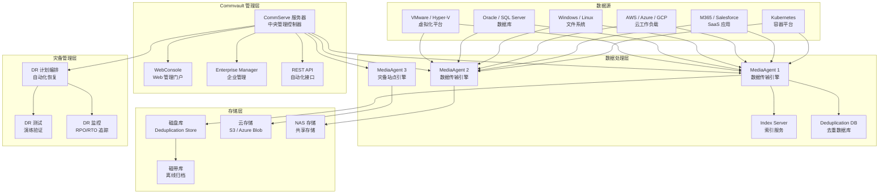

> **生产环境安全提示**
>
> 本文档包含可直接执行的运维命令。执行前请确认：当前目标集群与 Namespace 是否正确；是否具备足够的 RBAC 权限；是否已在非生产环境验证。命令风险等级标注：🔴 高风险（可能造成数据丢失或服务中断）、🟡 中风险（会修改集群状态，但通常可回滚）、🟢 低风险/只读（信息收集，无副作用）。


title: Commvault 企业级灾备与业务连续性深度实践
description: '# Commvault 企业级灾备与业务连续性深度实践'
category: disaster-recovery
tags:
- k8s
- disaster-recovery
- backup
- ha
- scheduler
- redis
- mysql
- job
- gateway
- rbac
last_updated: 2026-05
difficulty: advanced
reading_level: advanced
audience:
- SRE
- 运维工程师
- 架构师
estimated_read_time: 5min
intent_queries:
- Commvault 企业级灾备与业务连续性深度实践 是什么
- 如何 Commvault 企业级灾备与业务连续性深度实践
- [[kubernetes|Kubernetes]] 30 disaster recovery business continuity 最佳实践
trigger_keywords:
- Commvault
- 企业级灾备与业务连续性深度实践
- disaster
- recovery
- business
- continuity
authors:
- name: KUDIG Team
  role: contributor
k8s_versions:
- '1.28'
- '1.29'
- '1.30'
- '1.31'
- '1.32'
---

# Commvault 企业级灾备与业务连续性深度实践

> **作者**: 灾备架构师 | **版本**: v2.0 | **更新时间**: 2026-05-18
> **场景**: 企业级数据保护和灾难恢复解决方案 | **复杂度**: ⭐⭐⭐⭐⭐

---

<!-- chunk: 概述 -->## 概述

Commvault 是业界功能最全面的企业级数据保护和管理平台之一，提供从备份恢复、灾难恢复、归档管理到数据治理的一体化解决方案。其独特的 CommServe 集中管理架构、MediaAgent 分布式数据处理设计以及智能数据管理（IDM）能力，使其成为金融、医疗、政府等受监管行业的首选数据保护方案。本文档基于大规模生产环境经验，全面探讨 Commvault 的企业级部署架构、灾备策略实施和业务连续性管理。

## RPO 与 RTO 定义

- **RPO（Recovery Point Objective）**：在 Commvault 环境中，RPO 直接由备份频率和存储复制策略决定。通过连续数据保护（CDP）功能可实现秒级 RPO；通过定时备份策略实现小时级 RPO；通过存储阵列复制实现近零 RPO。
- **RTO（Recovery Time Objective）**：Commvault 的 RTO 能力取决于恢复方式和目标环境。裸金属恢复（BMR）可实现 30 分钟内的系统级恢复；虚拟机即时挂载（Live Mount）可实现分钟级文件/应用恢复；跨站点故障切换可将 RTO 缩短至小时级。

```yaml
commvault_rpo_rto_capabilities:
  scheduled_backup:
    rpo: "1-24 小时（根据策略频率）"
    rto: "分钟级（文件级）~ 小时级（系统级）"
    
  continuous_data_protection:
    rpo: "秒级"
    rto: "分钟级"
    
  storage_replication:
    rpo: "接近零（同步复制）"
    rto: "分钟级（自动故障切换）"
    
  live_mount:
    rpo: "取决于最近备份"
    rto: "1-5 分钟（虚拟机即时挂载）"
```

---

<!-- chunk: 架构设计 -->## 架构设计

## 核心组件架构



## 企业级部署配置

```yaml
commvault_enterprise_deployment:
  commserve:
    hostname: "commserve-prod.company.com"
    ip: "192.168.1.100"
    os: "Windows Server 2022"
    cpu: 16
    memory_gb: 64
    storage_gb: 2000
    database:
      type: "SQL Server 2022"
      edition: "Enterprise"
      ha: "Always On Availability Group"
      backup_schedule: "每 15 分钟日志备份"
      backup_retention_days: 30
    network:
      management:
        ip: "192.168.1.100"
        subnet: "255.255.255.0"
        gateway: "192.168.1.1"
      backup:
        ip: "10.0.1.100"
        mtu: 9000
        
  mediaagents:
    primary:
      - hostname: "MA-PROD-01"
        ip: "192.168.1.110"
        cpu: 16
        memory_gb: 64
        os: "Windows Server 2022"
        role: "primary"
        max_concurrent_jobs: 20
        storage:
          - type: "Disk Library"
            path: "E:\DedupStore"
            capacity_tb: 100
            deduplication: true
            
      - hostname: "MA-PROD-02"
        ip: "192.168.1.111"
        cpu: 16
        memory_gb: 64
        role: "primary"
        
    dr_site:
      - hostname: "MA-DR-01"
        ip: "192.168.2.110"
        cpu: 12
        memory_gb: 32
        role: "disaster_recovery"
        bandwidth_to_primary_mbps: 1000
        
  storage_policies:
    critical_systems:
      name: "SP-Critical"
      backup_type: "Incremental Forever"
      schedule:
        full: "每周日 22:00"
        incremental: "每日 22:00"
        synthetic_full: "每周三 22:00"
      retention:
        daily: 30
        weekly: 12
        monthly: 24
        yearly: 7
      deduplication:
        enabled: true
        type: "Global"
        hash_algorithm: "SHA-256"
      encryption:
        enabled: true
        algorithm: "AES-256"
        key_management: "External KMIP"
      storage_tiers:
        - tier: "Performance"
          media: "SSD Disk Library"
          retention_days: 14
        - tier: "Capacity"
          media: "HDD Disk Library"
          retention_days: 90
        - tier: "Archive"
          media: "Cloud (S3 Glacier)"
          retention_years: 7
          
  security:
    authentication:
      method: "Active Directory"
      mfa: true
      session_timeout: 30
    encryption:
      in_transit: "TLS 1.3"
      at_rest: "AES-256"
      key_rotation_days: 90
    audit:
      log_retention_days: 365
      syslog_forwarding: "siem.company.com"
```

---

<!-- chunk: 核心配置 -->## 核心配置

## 分层备份策略配置

```powershell
# Commvault PowerShell 分层备份策略

# 1. 创建存储策略
New-CVStoragePolicy -Name "Tiered-Enterprise-Backup" `
    -Description "企业级分层备份策略" `
    -RetentionRules @{
        "Daily" = @{ RetentionDays = 30; BackupType = "Incremental" }
        "Weekly" = @{ RetentionWeeks = 12; BackupType = "SyntheticFull" }
        "Monthly" = @{ RetentionMonths = 24; BackupType = "Full" }
        "Yearly" = @{ RetentionYears = 7; BackupType = "Full" }
    } `
    -DeduplicationEnabled $true `
    -GlobalDeduplication $true `
    -EncryptionEnabled $true `
    -EncryptionAlgorithm "AES-256"

# 2. 配置存储池
Add-CVStoragePool -StoragePolicy "Tiered-Enterprise-Backup" `
    -PoolName "Performance-SSD-Pool" `
    -MediaType "Disk" `
    -Path "\\storage-ssd\backup-pool" `
    -BlockSizeKB 512 `
    -DeduplicationRatio 20 `
    -RetentionDays 14

Add-CVStoragePool -StoragePolicy "Tiered-Enterprise-Backup" `
    -PoolName "Capacity-HDD-Pool" `
    -MediaType "Disk" `
    -Path "\\storage-hdd\backup-pool" `
    -BlockSizeKB 1024 `
    -RetentionDays 90

Add-CVStoragePool -StoragePolicy "Tiered-Enterprise-Backup" `
    -PoolName "Archive-Cloud-Pool" `
    -MediaType "Cloud" `
    -CloudProvider "Amazon S3" `
    -BucketName "company-commvault-archive" `
    -Region "us-west-2" `
    -StorageClass "Glacier Deep Archive" `
    -RetentionYears 7

# 3. 创建备份子客户端
New-CVBackupSet -ClientGroup "Production-Servers" `
    -BackupSetName "Critical-Systems" `
    -StoragePolicy "Tiered-Enterprise-Backup" `
    -SubclientPolicy @{
        "Database-Servers" = @{
            Schedule = "每日 23:00 全量"
            Type = "Application-Aware"
            PreScript = "C:\Scripts\PreBackup-DB.ps1"
            PostScript = "C:\Scripts\PostBackup-DB.ps1"
        }
        "File-Servers" = @{
            Schedule = "每日 22:00 增量"
            Type = "FileSystem"
        }
        "Virtual-Machines" = @{
            Schedule = "每 4 小时增量"
            Type = "VMware-Intelligent"
            CBT = "Enabled"
        }
    }
```

## 应用一致性备份

```xml
<!-- Commvault 应用一致性备份配置 -->
<ApplicationConsistentBackup>
    <Application name="SQL Server">
        <VSSConfiguration>
            <WriterName>SqlServerWriter</WriterName>
            <ComponentSelection>All</ComponentSelection>
            <TransactionLogBackup>Enabled</TransactionLogBackup>
            <LogTruncation>AfterBackup</LogTruncation>
            <LogBackupInterval>15</LogBackupInterval> <!-- 每15分钟 -->
        </VSSConfiguration>
        <PreScript>
            <Command>powershell.exe -File "C:\Scripts\PreBackup-SQL.ps1"</Command>
            <TimeoutMinutes>30</TimeoutMinutes>
        </PreScript>
        <PostScript>
            <Command>powershell.exe -File "C:\Scripts\PostBackup-SQL.ps1"</Command>
        </PostScript>
    </Application>
    
    <Application name="Oracle">
        <RMANConfiguration>
            <ArchiveLogMode>ARCHIVELOG</ArchiveLogMode>
            <ControlFileAutobackup>Enabled</ControlFileAutobackup>
            <BackupValidation>Enabled</BackupValidation>
            <ChannelCount>4</ChannelCount>
            <SectionSizeGB>10</SectionSizeGB>
        </RMANConfiguration>
    </Application>
    
    <Application name="Exchange">
        <VSSConfiguration>
            <WriterName>Microsoft Exchange Writer</WriterName>
            <GranularRecovery>Enabled</GranularRecovery>
            <MailboxRecovery>Enabled</MailboxRecovery>
        </VSSConfiguration>
    </Application>
</ApplicationConsistentBackup>
```

---

<!-- chunk: 备份策略 -->## 备份策略

## 多站点灾备存储策略

```yaml
# Commvault 多站点灾备配置
multi_site_disaster_recovery:
  primary_site:
    location: "北京数据中心"
    commserve: "commserve-beijing"
    mediaagents: ["MA-BJ-01", "MA-BJ-02"]
    storage:
      disk_tb: 500
      tape_library: "IBM-TS4500-Local"
    network_gbps: 10
    rpo: "4 小时"
    rto: "2 小时"
    
  secondary_site:
    location: "上海数据中心"
    commserve: "commserve-shanghai"
    mediaagents: ["MA-SH-01", "MA-SH-02"]
    storage:
      disk_tb: 300
      tape_library: "IBM-TS4500-DR"
    network_gbps: 1
    rpo: "24 小时"
    rto: "8 小时"
    replication:
      mode: "automated"
      schedule: "每 4 小时增量同步"
      bandwidth_throttle: "500 Mbps"
      
  tertiary_site:
    location: "广州云灾备中心"
    type: "cloud"
    provider: "阿里云 OSS"
    rpo: "7 天"
    rto: "3 天"
    sync_schedule: "每日同步"
    
  failover_procedures:
    site_failure:
      detection_minutes: 30
      steps:
        - "启动备用 CommServe"
        - "激活远程 MediaAgent"
        - "重定向备份流量"
        - "验证数据完整性"
        - "通知所有相关人员"
```

---

<!-- chunk: 恢复流程 -->## 恢复流程

## 自动化恢复编排

```powershell
# Commvault 灾难恢复编排脚本
class DisasterRecoveryOrchestrator {
    [string]$PrimarySite
    [string]$SecondarySite
    [bool]$FailoverInProgress
    
    DisasterRecoveryOrchestrator($primary, $secondary) {
        $this.PrimarySite = $primary
        $this.SecondarySite = $secondary
        $this.FailoverInProgress = $false
    }
    
    [bool] CheckSiteHealth($site) {
        try {
            $response = Invoke-RestMethod -Uri "https://$site/HealthCheck" -TimeoutSec 30
            return $response.Status -eq "Healthy"
        } catch {
            Write-Warning "无法连接到 $site"
            return $false
        }
    }
    
    [void] PerformFailover() {
        if ($this.FailoverInProgress) { return }
        $this.FailoverInProgress = $true
        
        Write-Host "开始执行故障转移..." -ForegroundColor Yellow
        
        try {
            # 步骤1: 停止主站点备份作业
            Write-Host "[1/5] 停止主站点备份作业..."
            Stop-CVBackupJobs -CommServe $this.PrimarySite
            
            # 步骤2: 验证灾备站点就绪
            Write-Host "[2/5] 验证灾备站点就绪..."
            if (-not $this.CheckSiteHealth($this.SecondarySite)) {
                throw "灾备站点不可用"
            }
            
            # 步骤3: 激活灾备站点
            Write-Host "[3/5] 激活灾备站点..."
            Enable-CVDRSite -CommServe $this.SecondarySite
            
            # 步骤4: 重定向客户端
            Write-Host "[4/5] 重定向备份客户端..."
            $clients = Get-CVClients -CommServe $this.PrimarySite
            foreach ($client in $clients) {
                Move-CVClient -ClientName $client.Name -Target $this.SecondarySite
            }
            
            # 步骤5: 验证恢复
            Write-Host "[5/5] 验证故障转移..."
            if ($this.ValidateFailover()) {
                Write-Host "故障转移成功！" -ForegroundColor Green
            }
        } catch {
            Write-Error "故障转移失败: $_"
            $this.InitiateRollback()
        } finally {
            $this.FailoverInProgress = $false
        }
    }
    
    [bool] ValidateFailover() {
        $backupStatus = Get-CVBackupStatus -CommServe $this.SecondarySite
        return $backupStatus.RunningJobs -ge 0 -and $backupStatus.FailedJobs -eq 0
    }
    
    [void] InitiateRollback() {
        Write-Warning "开始回滚..."
    }
}

# 使用
$dr = [DisasterRecoveryOrchestrator]::new("commserve-beijing", "commserve-shanghai")
$dr.PerformFailover()
```

---

<!-- chunk: 容灾演练方案 -->## 容灾演练方案

```yaml
# Commvault 容灾演练计划
dr_drill_program:
  monthly_backup_restore_test:
    type: "备份恢复验证"
    scope: "随机选择 5 个关键系统"
    steps:
      - "从最近备份恢复到测试环境"
      - "验证数据完整性"
      - "执行应用功能测试"
      - "记录恢复时间"
      - "清理测试环境"
    success_criteria:
      - "所有恢复成功"
      - "RTO < 目标值"
      - "数据校验通过"
      
  quarterly_site_failover:
    type: "站点故障切换测试"
    scope: "灾备站点完整性验证"
    steps:
      - "执行 Test Failover"
      - "启动灾备站点所有服务"
      - "运行业务功能测试套件"
      - "验证数据一致性"
      - "执行 Undo Failover"
    participants: ["备份团队", "应用团队", "网络团队"]
    
  annual_full_dr:
    type: "年度完整灾备演练"
    scope: "全部核心业务系统"
    steps:
      - "模拟主站点完全不可用"
      - "切换到灾备站点"
      - "灾备站点承载生产流量 4 小时"
      - "执行问题回切"
      - "全面数据一致性验证"
```

---

<!-- chunk: 监控告警 -->## 监控告警

## 智能告警规则

```yaml
commvault_alerting:
  backup_job_failures:
    severity: "high"
    conditions:
      - metric: "failed_backup_jobs"
        operator: ">"
        threshold: 3
        duration: "15m"
    actions:
      - type: "email"
        recipients: ["backup-admin@company.com"]
      - type: "webhook"
        url: "https://monitoring.company.com/webhook"
        
  storage_capacity:
    severity: "warning"
    conditions:
      - metric: "storage_utilization"
        operator: ">"
        threshold: 85
    actions:
      - type: "email"
        recipients: ["storage-team@company.com"]
        
  ransomware_detection:
    severity: "critical"
    conditions:
      - metric: "file_modification_rate"
        operator: ">"
        threshold: 1000
        duration: "5m"
    actions:
      - type: "immediate_isolation"
      - type: "notification"
        recipients: ["security@company.com"]
        
  rpo_violation:
    severity: "critical"
    conditions:
      - metric: "backup_gap_hours"
        operator: ">"
        threshold: "RPO目标 * 1.5"
    actions:
      - type: "email"
        recipients: ["dr-team@company.com"]
```

## 监控仪表板

```json
{
  "dashboard": "Commvault Enterprise Monitoring",
  "panels": [
    {
      "title": "备份作业状态",
      "metrics": ["total_jobs", "successful_jobs", "failed_jobs"],
      "thresholds": {"failed_jobs": {"warning": 5, "critical": 10}}
    },
    {
      "title": "存储容量",
      "metrics": ["utilization_percent"],
      "thresholds": {"utilization": {"normal": 0, "warning": 80, "critical": 95}}
    },
    {
      "title": "备份性能",
      "metrics": ["avg_duration_minutes", "throughput_mb_per_second"],
      "time_range": "30d"
    },
    {
      "title": "RPO 合规性",
      "metrics": ["rpo_compliance_rate"],
      "target": ">= 99.9%"
    }
  ]
}
```

---

<!-- chunk: 最佳实践 -->## 最佳实践

1. **全局去重**：启用 Global Deduplication 减少跨站点传输数据量，通常可实现 10:1 到 30:1 的去重比
2. **存储分层**：热数据放 SSD、温数据放 HDD、冷数据归档到云或磁带，平衡性能和成本
3. **不可变备份**：使用 Object Lock 或 WORM 存储防止勒索软件，至少保留一份不可变副本
4. **自动化恢复**：所有恢复流程脚本化，使用 Commvault REST API 编排自动化恢复
5. **定期验证**：每月执行备份恢复测试，每季度执行站点故障切换演练

---

<!-- chunk: 故障排查 -->## 故障排查

## 常见问题诊断

```bash
#!/bin/bash
# Commvault 故障排查脚本

echo "=== Commvault 诊断 ==="

# 1. 检查 CommServe 服务
echo "[1] CommServe 服务状态"
ssh commserve-prod "
    sc query GxClMgrS
    sc query GxEvMgrS
    sc query GxVSSProv
"

# 2. 检查 MediaAgent 连接
echo "[2] MediaAgent 连接状态"
ssh commserve-prod "
    qmedia list
    qmedia status
"

# 3. 检查存储库
echo "[3] 存储库状态"
ssh commserve-prod "
    qlib list
    qlib status
    qpath list
"

# 4. 检查失败作业
echo "[4] 最近失败作业"
ssh commserve-prod "
    qjob list --status Failed --last 24h
    qjob log <failed_job_id> --last 50
"

# 5. 性能分析
echo "[5] 系统资源"
ssh commserve-prod "
    cpu_usage
    memory_usage
    disk_usage /opt/commvault
"
```

## 故障排查手册

| 问题现象 | 可能原因 | 排查步骤 | 解决方案 |
|:---|:---|:---|:---|
| 备份作业失败 | VSS Writer 异常 | `vssadmin list writers` | 重启 VSS 服务 |
| 去重数据库损坏 | 磁盘问题或断电 | 检查 DDB 一致性 | 从备份重建 DDB |
| MediaAgent 不可达 | 网络或防火墙问题 | ping + 端口检查 | 修复网络配置 |
| 存储库空间不足 | 增长超出预期 | 审查增长趋势 | 扩展存储或调整保留 |
| 恢复速度慢 | 网络瓶颈 | 检查带宽利用率 | 增加并发流或优化网络 |
| 许可证过期 | 忘记续费 | 检查许可证状态 | 联系供应商续费 |

---

<!-- chunk: 性能优化与容量规划 -->## 性能优化与容量规划

## Commvault 性能调优策略

Commvault 在大规模企业环境中的性能优化需要从多个维度系统性考量。首先是数据库层面的优化——CommServe 的 SQL Server 数据库存储了所有作业元数据、配置信息和索引，其性能直接影响整个备份系统的响应速度。建议为 SQL Server 分配至少 16GB 内存，启用即时文件初始化（Instant File Initialization），配置合适的最大/最小内存限制，并定期更新统计信息和重建索引。

其次是 MediaAgent 的 I/O 优化。MediaAgent 是数据传输的核心引擎，其性能取决于网络带宽、磁盘 I/O 和 CPU 处理能力。在配置 MediaAgent 时，应确保备份网络接口使用 Jumbo Frame（MTU 9000），存储路径配置在高速磁盘上（SSD 优先），并根据数据量调整并发任务数。

```yaml
# Commvault 性能优化配置
performance_optimization:
  sql_server:
    max_memory_mb: 24576
    min_memory_mb: 4096
    instant_file_initialization: true
    max_degree_of_parallelism: 4
    index_maintenance:
      schedule: "每周日 02:00"
      operations:
        - "UPDATE STATISTICS JobHistory"
        - "UPDATE STATISTICS BackupInfo"
        - "ALTER INDEX ALL ON JobHistory REBUILD"
        
  mediaagent:
    concurrent_backup_streams: 20
    concurrent_restore_streams: 10
    deduplication_block_size: "128KB"
    network:
      mtu: 9000
      tcp_window_size: "64KB"
      send_buffer_size: "256KB"
      receive_buffer_size: "256KB"
      
  storage:
    disk_queue_depth: 64
    read_ahead_kb: 4096
    io_scheduler: "noop"
    mount_options: "noatime,nobarrier"
```

## 网络带宽优化

跨站点备份和复制是企业级 Commvault 部署中的常见场景。在带宽受限的情况下，需要使用网络节流（Throttle）和压缩技术来优化传输效率。

```yaml
# 网络带宽优化策略
network_optimization:
  throttling:
    business_hours:
      start: "08:00"
      end: "20:00"
      max_bandwidth_mbps: 200
      
    off_hours:
      start: "20:00"
      end: "08:00"
      max_bandwidth_mbps: 1000
      
  compression:
    source_side: true
    level: "high"
    algorithm: "lz4"
    
  deduplication:
    source_side: true
    global: true
    hash_algorithm: "SHA-256"
    
  wan_optimization:
    enabled: true
    cache_size_gb: 500
    protocol_optimization: true
```

## 容量预测与规划

```python
#!/usr/bin/env python3
"""
Commvault 容量预测工具
"""
import json
from datetime import datetime, timedelta

class CommvaultCapacityPlanner:
    def __init__(self, current_data_tb, growth_rate_percent, dedup_ratio):
        self.current_data_tb = current_data_tb
        self.growth_rate = growth_rate_percent / 100
        self.dedup_ratio = dedup_ratio
        
    def forecast_monthly(self, months=36):
        results = []
        for i in range(1, months + 1):
            raw_tb = self.current_data_tb * ((1 + self.growth_rate / 12) ** i)
            deduped_tb = raw_tb / self.dedup_ratio
            results.append({
                "month": i,
                "date": (datetime.now() + timedelta(days=i * 30)).strftime("%Y-%m"),
                "raw_data_tb": round(raw_tb, 2),
                "deduped_storage_tb": round(deduped_tb, 2),
                "growth_from_current_tb": round(raw_tb - self.current_data_tb, 2)
            })
        return results
    
    def recommend_action(self, available_storage_tb, months=12):
        forecast = self.forecast_monthly(months)
        future_need = forecast[-1]["deduped_storage_tb"]
        
        if future_need > available_storage_tb * 0.8:
            additional_tb = future_need - available_storage_tb * 0.8
            return {
                "action": "扩展存储容量",
                "additional_tb_needed": round(additional_tb, 2),
                "timeline": "3-6 个月内",
                "urgency": "high" if additional_tb > available_storage_tb * 0.3 else "medium"
            }
        return {
            "action": "容量充足",
            "months_until_full": "24+",
            "urgency": "low"
        }
```

---

<!-- chunk: 合规性与审计 -->## 合规性与审计

## 企业合规框架

Commvault 在合规性方面提供了全面的支持，包括 GDPR、等保 2.0、SEC 17a-4、HIPAA 等法规框架。企业应根据自身行业和监管要求，配置相应的合规策略。

```yaml
# Commvault 合规性配置
compliance_framework:
  gdpr:
    data_subject_rights:
      right_to_access: true
      right_to_erasure: true
      right_to_portability: true
    retention_limits:
      maximum_years: 7
      review_interval_days: 90
      
  level_protection_2:
    level: "三级"
    requirements:
      multi_factor_auth: true
      access_control: "fine_grained"
      security_audit: "full_coverage"
      data_encryption: "AES-256"
      intrusion_prevention: true
      log_retention_days: 180
      
  sec_17a4:
    writable_once_read_many: true
    retention_years: 7
    non_erasable: true
    audit_trail: true
```

---

<!-- chunk: 安全最佳实践 -->## 安全最佳实践

Commvault 的安全配置应遵循最小权限原则和纵深防御策略：

1. **身份认证**：集成 Active Directory，启用 MFA，配置密码复杂度策略
2. **访问控制**：基于角色分配权限（Admin / Operator / Viewer），定期审查用户权限
3. **数据加密**：传输层 TLS 1.3，存储层 AES-256，密钥通过外部 KMIP 服务器管理
4. **审计日志**：所有操作记录审计日志，转发到 SIEM 平台，保留 365 天
5. **不可变存储**：配置 WORM 存储，确保备份数据无法被修改或删除
6. **网络隔离**：备份网络与管理网络隔离，限制端口访问

```yaml
# Commvault 安全加固配置
security_hardening:
  authentication:
    method: "Active Directory + MFA"
    password_policy:
      min_length: 14
      complexity: "high"
      max_age_days: 60
      history_count: 12
      
  session_management:
    web_timeout_minutes: 20
    api_timeout_minutes: 15
    max_concurrent_sessions: 3
    
  encryption:
    in_transit: "TLS 1.3"
    at_rest: "AES-256"
    key_management:
      type: "External KMIP"
      server: "kmip.company.com"
      rotation_days: 90
      
  audit:
    enabled: true
    log_retention_days: 365
    syslog_server: "siem.company.com:514"
    events:
      - "user_login"
      - "user_logout"
      - "backup_create"
      - "backup_delete"
      - "restore_initiate"
      - "policy_change"
      - "permission_change"
      - "configuration_change"
```

---

<!-- chunk: Commvault 自动化运维 -->## Commvault 自动化运维

## 自动化运维脚本集

Commvault 在大规模环境中的日常运维需要高度自动化。以下脚本集涵盖了从备份验证、存储清理、作业监控到合规检查的完整运维场景。

每个脚本都设计为可以独立运行或通过任务调度器（如 Windows Task Scheduler 或 cron）定时执行。建议将这些脚本集成到企业的自动化运维平台中，与监控告警系统联动，实现无人值守的自动化运维。

```powershell
# Commvault 自动化运维脚本集

# 1. 备份完整性自动验证
function Invoke-CVBackupIntegrityCheck {
    param(
        [string]$BackupSetName,
        [int]$MaxAgeHours = 24
    )
    
    Write-Host "验证备份完整性: $BackupSetName"
    
    $backupSet = Get-CVBackupSet -Name $BackupSetName
    $lastBackup = $backupSet | Get-CVBackup | Sort-Object EndTime -Descending | Select-Object -First 1
    
    if ($null -eq $lastBackup) {
        Write-Error "未找到备份记录"
        return $false
    }
    
    $backupAge = (Get-Date) - $lastBackup.EndTime
    if ($backupAge.TotalHours -gt $MaxAgeHours) {
        Write-Warning "备份年龄 $($backupAge.TotalHours) 小时超过阈值 $MaxAgeHours 小时"
        return $false
    }
    
    Write-Host "备份年龄: $($backupAge.TotalHours) 小时"
    Write-Host "备份状态: $($lastBackup.Status)"
    Write-Host "备份大小: $([math]::Round($lastBackup.Size / 1GB, 2)) GB"
    
    # 验证可恢复性
    $restorePoints = Get-CVRestorePoint -Backup $lastBackup
    if ($restorePoints.Count -eq 0) {
        Write-Error "没有可用的恢复点"
        return $false
    }
    
    Write-Host "恢复点数量: $($restorePoints.Count)"
    return $true
}

# 2. 存储库自动扩容检测
function Test-CVStorageCapacity {
    $repositories = Get-VBRBackupRepository
    $alerts = @()
    
    foreach ($repo in $repositories) {
        $freePercent = ($repo.Info.CachedFreeSpace / $repo.Info.CachedTotalSpace) * 100
        $usedGB = [math]::Round(($repo.Info.CachedTotalSpace - $repo.Info.CachedFreeSpace) / 1GB, 2)
        $totalGB = [math]::Round($repo.Info.CachedTotalSpace / 1GB, 2)
        $freeGB = [math]::Round($repo.Info.CachedFreeSpace / 1GB, 2)
        
        $status = "Healthy"
        if ($freePercent -lt 10) { $status = "Critical" }
        elseif ($freePercent -lt 20) { $status = "Warning" }
        elseif ($freePercent -lt 30) { $status = "Low" }
        
        $alerts += @{
            Repository = $repo.Name
            TotalGB = $totalGB
            UsedGB = $usedGB
            FreeGB = $freeGB
            FreePercent = [math]::Round($freePercent, 2)
            Status = $status
        }
    }
    
    $alerts | Format-Table -AutoSize
    return $alerts
}

# 3. 作业失败自动诊断
function Get-CVFailedJobDiagnosis {
    param([int]$Hours = 24)
    
    $failedJobs = Get-CVJob | Get-CVJobSession | 
        Where-Object { $_.Status -eq "Failed" -and $_.EndTime -gt (Get-Date).AddHours(-$Hours) }
    
    foreach ($job in $failedJobs) {
        Write-Host "=== 作业诊断: $($job.Name) ===" -ForegroundColor Yellow
        Write-Host "失败时间: $($job.EndTime)"
        Write-Host "持续时长: $($job.Duration)"
        
        # 获取错误详情
        $errorLog = Get-CVJobLog -JobSession $job -Level Error
        foreach ($err in $errorLog) {
            Write-Host "  错误: $($err.Message)" -ForegroundColor Red
        }
        
        # 建议修复步骤
        Write-Host "  建议操作:" -ForegroundColor Cyan
        if ($job.ErrorMessage -match "VSS") {
            Write-Host "    1. 检查 VSS Writer 状态: vssadmin list writers"
            Write-Host "    2. 重启 VSS 服务: net stop/start VSS"
        } elseif ($job.ErrorMessage -match "network|timeout") {
            Write-Host "    1. 检查网络连通性"
            Write-Host "    2. 检查防火墙规则"
        } elseif ($job.ErrorMessage -match "space|capacity") {
            Write-Host "    1. 检查存储库剩余空间"
            Write-Host "    2. 清理过期备份数据"
        }
    }
}

# 4. 合规性自动报告
function New-CVComplianceReport {
    param([string]$OutputPath = "C:\Reports")
    
    $report = @{
        GeneratedAt = Get-Date -Format "yyyy-MM-dd HH:mm:ss"
        BackupCompliance = @()
        RetentionCompliance = @()
        EncryptionCompliance = @()
    }
    
    # 检查备份频率合规性
    $clients = Get-CVClient
    foreach ($client in $clients) {
        $lastBackup = Get-CVBackup -Client $client | Sort-Object EndTime -Descending | Select-Object -First 1
        
        if ($null -eq $lastBackup) {
            $report.BackupCompliance += @{
                Client = $client.Name
                Status = "NonCompliant"
                Reason = "从未执行备份"
            }
        } elseif ((Get-Date) - $lastBackup.EndTime -gt [TimeSpan]::FromHours(25)) {
            $report.BackupCompliance += @{
                Client = $client.Name
                Status = "NonCompliant"
                Reason = "备份超过 25 小时未执行"
                LastBackup = $lastBackup.EndTime
            }
        } else {
            $report.BackupCompliance += @{
                Client = $client.Name
                Status = "Compliant"
                LastBackup = $lastBackup.EndTime
            }
        }
    }
    
    $report | ConvertTo-Json -Depth 3 | 
        Out-File "$OutputPath\ComplianceReport_$(Get-Date -Format 'yyyyMMdd').json"
    
    return $report
}
```

## Commvault REST API 自动化

Commvault 提供了完整的 REST API 接口，支持所有管理操作的自动化。以下是使用 Python 调用 Commvault API 的示例，涵盖备份触发、状态查询和恢复操作。

```python
#!/usr/bin/env python3
"""
Commvault REST API 自动化工具
"""
import requests
import json
from datetime import datetime
from typing import Dict, List, Optional

class CommvaultAPI:
    def __init__(self, webconsole_url: str, username: str, password: str):
        self.base_url = f"{webconsole_url}/webconsole/api"
        self.session = requests.Session()
        self.session.verify = False
        self.token = self._authenticate(username, password)
        self.session.headers.update({
            "Authtoken": self.token,
            "Content-Type": "application/json"
        })
        
    def _authenticate(self, username: str, password: str) -> str:
        resp = self.session.post(
            f"{self.base_url}/Login",
            json={"username": username, "password": password}
        )
        return resp.json().get("token")
    
    def trigger_backup(self, backupset_id: int, backup_level: str = "INCREMENTAL") -> Dict:
        resp = self.session.post(
            f"{self.base_url}/Backup",
            json={
                "backupType": 0,
                "backupsetName": backupset_id,
                "backupLevel": backup_level
            }
        )
        return resp.json()
    
    def get_job_status(self, job_id: int) -> Dict:
        resp = self.session.get(f"{self.base_url}/Job/{job_id}")
        return resp.json()
    
    def list_backup_jobs(self, days: int = 7) -> List[Dict]:
        resp = self.session.get(
            f"{self.base_url}/Job",
            params={
                "operationType": "BACKUP",
                "startDate": int((datetime.now().timestamp() - days * 86400) * 1000)
            }
        )
        return resp.json().get("jobs", [])
    
    def get_storage_pools(self) -> List[Dict]:
        resp = self.session.get(f"{self.base_url}/StoragePool")
        return resp.json().get("storagePools", [])
    
    def trigger_restore(self, backup_id: int, client_id: int, paths: List[str]) -> Dict:
        resp = self.session.post(
            f"{self.base_url}/Restore",
            json={
                "mode": 1,
                "backupsetId": backup_id,
                "clientId": client_id,
                "paths": paths,
                "inPlace": True,
                "overwrite": True
            }
        )
        return resp.json()
    
    def generate_report(self, report_type: str = "BackupJobSummary") -> Dict:
        resp = self.session.post(
            f"{self.base_url}/Report",
            json={
                "reportType": report_type,
                "outputFormat": "JSON",
                "dateRange": {
                    "fromTime": int((datetime.now().timestamp() - 7 * 86400) * 1000),
                    "toTime": int(datetime.now().timestamp() * 1000)
                }
            }
        )
        return resp.json()
```

---

<!-- chunk: Commvault 与云平台集成 -->## Commvault 与云平台集成

## 多云数据保护

Commvault 支持与 AWS、Azure、GCP 和阿里云等主流云平台深度集成，提供云工作负载保护、云存储归档和跨云数据迁移能力。

```yaml
# Commvault 多云集成配置
cloud_integration:
  aws:
    ec2_protection:
      method: "VM-centric backup via AWS API"
      frequency: "每日增量，每周全量"
      retention: "30 天"
      regions: ["us-east-1", "us-west-2"]
      
    rds_protection:
      method: "RDS Snapshot + Commvault catalog"
      frequency: "每日"
      retention: "14 天"
      
    s3_archival:
      bucket: "company-commvault-archive"
      storage_class: "GLACIER_DEEP_ARCHIVE"
      immutability:
        enabled: true
        mode: "Compliance"
        lock_days: 2555  # 7年
        
  azure:
    vm_protection:
      method: "Azure VM backup via Commvault"
      frequency: "每日"
      retention: "30 天"
      
    blob_archival:
      container: "commvault-archive"
      access_tier: "Archive"
      
  alibaba_cloud:
    oss_archival:
      bucket: "company-commvault-archive"
      storage_class: "Archive"
      redundancy: "ZRS"  # Zone Redundant Storage
```

---

<!-- chunk: Commvault 灾备编排 -->## Commvault 灾备编排

## 自动化恢复编排

Commvault 的恢复编排功能允许定义多步骤的恢复流程，包括前置验证、数据恢复、应用启动和后置验证。通过将恢复流程脚本化，可以消除人工操作的不确定性，确保每次恢复都按照预定流程执行。

```yaml
# Commvault 恢复编排配置
recovery_orchestration:
  plan_name: "Enterprise-Critical-Recovery"
  description: "核心业务系统灾难恢复编排计划"
  
  phases:
    phase_1_validation:
      name: "恢复前验证"
      steps:
        - name: "验证灾备站点网络连通性"
          type: "script"
          command: "ping -c 3 dr-site.company.com"
          
        - name: "验证存储可用性"
          type: "script"
          command: "check-storage-access --site dr"
          
        - name: "验证备份完整性"
          type: "api"
          endpoint: "/api/Backup/validate"
          
    phase_2_database_recovery:
      name: "数据库恢复"
      depends_on: "phase_1_validation"
      steps:
        - name: "恢复 MySQL 主数据库"
          type: "restore"
          target: "dr-mysql-primary"
          source_backup: "latest_clean"
          validation: "mysql-check -h dr-mysql-primary -e 'SELECT 1'"
          
        - name: "恢复 Redis 缓存集群"
          type: "restore"
          target: "dr-redis-cluster"
          
        - name: "验证数据一致性"
          type: "script"
          command: "verify-db-consistency --source primary --target dr"
          
    phase_3_application_recovery:
      name: "应用恢复"
      depends_on: "phase_2_database_recovery"
      steps:
        - name: "恢复 API 服务"
          type: "restore"
          target: "dr-api-servers"
          
        - name: "恢复前端 Web 服务"
          type: "restore"
          target: "dr-web-servers"
          
        - name: "验证应用健康"
          type: "http_check"
          url: "http://dr-api.company.com/health"
          expected_status: 200
          
    phase_4_traffic_switch:
      name: "流量切换"
      depends_on: "phase_3_application_recovery"
      steps:
        - name: "更新 DNS 记录"
          type: "script"
          command: "update-dns --target dr-site"
          
        - name: "更新负载均衡器"
          type: "script"
          command: "update-lb --target dr-site"
          
        - name: "发送恢复完成通知"
          type: "notification"
          recipients: ["dr-team@company.com", "management@company.com"]
          message: "灾难恢复完成，业务已切换到灾备站点"
```

---

**文档版本**: v2.0  
**最后更新**: 2026-05-18  
**适用版本**: Commvault Complete Backup & Recovery 11.36+

---

<!-- chunk: Obsidian 相关文档 -->## Obsidian 相关文档

- domain-30-disaster-recovery-business-continuity KUDIG Database — Global MOC
- [[12-可靠性/README.md|Domain 09: 企业级灾备与业务连续性 (Enterprise Disaster Recovery & Busin...]]
- Domain-30 灾备与业务连续性 — 开源项目索引
- VMware vSphere 企业级灾备与业务连续性
- Veeam Backup & Replication 企业级备份恢复解决方案
- 企业级容灾架构与混沌工程深度实践
- Rubrik 企业级灾备与业务连续性深度实践
- Kubernetes 备份与恢复深度实践
- 混沌工程平台实践：LitmusChaos 与 Chaos Mesh
- 应用级灾备架构：多区域部署与故障转移
- Velero 企业级备份恢复实践指南

## See Also

- 02-veeam-enterprise-backup
- 03-enterprise-disaster-recovery-chaos-engineering
- 06-rubrik-enterprise-disaster-recovery
- 07-kubernetes-backup-restore-deep-dive

## Related

- [[21-生态参考/03-领域索引/backup-dr-index.md|Backup & DR 备份与灾备知识图谱索引]]


<!-- risk-assessed -->
