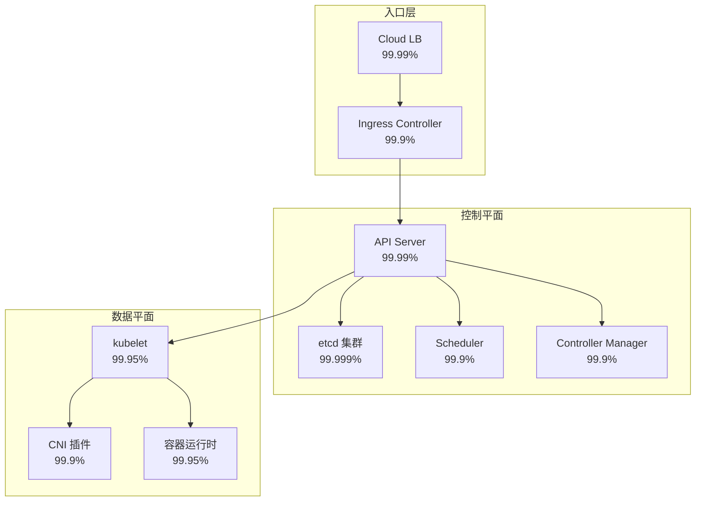

> **生产环境安全提示**
>
> 本文档包含可直接执行的运维命令。执行前请确认：当前目标集群与 Namespace 是否正确；是否具备足够的 RBAC 权限；是否已在非生产环境验证。命令风险等级标注：🔴 高风险（可能造成数据丢失或服务中断）、🟡 中风险（会修改集群状态，但通常可回滚）、🟢 低风险/只读（信息收集，无副作用）。


# 可用性计算模型

> **核心原则**: 可用性不是玄学，是可以精确计算和分解的数学问题。理解串联、并联、MTBF、MTTR 的数学关系，是设计高可用架构的基础。

## 基本公式

### 基于时间的可用性

```
可用性 = 正常运行时间 / (正常运行时间 + 停机时间)

或:
可用性 = MTBF / (MTBF + MTTR)

其中:
  MTBF = Mean Time Between Failures (平均问题间隔)
  MTTR = Mean Time To Recovery (平均恢复时间)
```

**公式推导**:

在一个完整的问题周期中，系统经历「正常运行 → 问题 → 恢复 → 正常运行」的循环。

```
总周期 = MTBF (正常) + MTTR (问题)
可用性 = 正常运行时间 / 总周期 = MTBF / (MTBF + MTTR)

不可用性 = MTTR / (MTBF + MTTR) ≈ MTTR / MTBF  (当 MTBF >> MTTR 时)
```

### 基于请求的可用性

```
可用性 = 成功请求数 / 总请求数

或:
可用性 = 1 - 错误率
```

**两种模型的适用场景**:

| 模型 | 适用场景 | 示例 |
|------|---------|------|
| 基于时间 | 持续运行服务、基础设施组件 | 数据库、API 服务、K8s 节点 |
| 基于请求 | 面向用户请求的服务 | Web 应用、微服务接口 |

## 可用性串联/并联计算模型详解

### 串联系统

串联系统中，所有组件必须同时正常运行，系统才能提供服务。任何一个组件问题，整个系统就问题。

```
服务 A (99.9%) → 服务 B (99.95%) → 服务 C (99.9%)

综合可用性 = A × B × C
           = 0.999 × 0.9995 × 0.999
           ≈ 99.75%
```

**通用公式**:

```
A_series = A₁ × A₂ × A₃ × ... × Aₙ

不可用性近似:
U_series ≈ U₁ + U₂ + U₃ + ... + Uₙ  (当 U << 1 时)
```

> **关键洞察**: 串联系统的可用性**永远低于**任何单个组件的可用性。串联组件越多，可用性下降越快。

**串联可用性快速参考表**:

| 组件数 | 每个 99.9% | 每个 99.99% | 每个 99.999% |
|--------|-----------|------------|-------------|
| 2 | 99.80% | 99.98% | 99.998% |
| 3 | 99.70% | 99.97% | 99.997% |
| 5 | 99.50% | 99.95% | 99.995% |
| 10 | 99.01% | 99.90% | 99.990% |
| 20 | 98.02% | 99.80% | 99.980% |
| 50 | 95.11% | 99.51% | 99.951% |

### 并联系统（冗余）

并联系统中，只要至少一个组件正常运行，系统就能提供服务。常用于消除单点问题。

```
服务 A1 (99.9%) 
           ╲
            → 负载均衡 → 综合可用性
           ╱
服务 A2 (99.9%)

综合可用性 = 1 - (1 - A₁) × (1 - A₂)
           = 1 - (0.001)²
           = 1 - 0.000001
           = 99.9999%
```

**通用公式**:

```
A_parallel = 1 - (1 - A₁) × (1 - A₂) × ... × (1 - Aₙ)

对于相同组件 (A₁ = A₂ = ... = Aₙ = A):
A_parallel = 1 - (1 - A)ⁿ

不可用性:
U_parallel = U₁ × U₂ × ... × Uₙ = Uⁿ  (相同组件)
```

**并联可用性快速参考表** (每个组件 99.9%):

| 冗余数 | 并联可用性 | 不可用性 |
|--------|-----------|---------|
| 1 | 99.9% | 0.1% |
| 2 | 99.9999% | 0.0001% |
| 3 | 99.9999999% | 0.0000001% |
| 4 | 99.9999999999% | 0.0000000001% |

### N+1 冗余模型

N+1 冗余是最常见的生产配置：N 个组件承载正常负载，1 个备用组件在问题时接管。

```
假设: N=3 个活跃节点 + 1 个备用节点，单节点可用性 99.9%

系统可用条件: 至少 N 个节点可用 (即最多 1 个节点问题)

A_N+1 = P(0 问题) + P(1 问题)
      = C(4,0) × A⁴ + C(4,1) × A³ × (1-A)
      = 1 × 0.999⁴ + 4 × 0.999³ × 0.001
      ≈ 0.996006 + 0.003988
      ≈ 99.9994%
```

**通用 N+M 冗余公式**:

```
总节点 = N + M
系统可用条件: 至少 N 个节点可用

A_system = Σ(k=0 to M) C(N+M, k) × A^(N+M-k) × (1-A)^k
```

| 冗余模式 | 单节点 99.9% | 单节点 99.99% |
|---------|-------------|--------------|
| 1+1 (双活) | 99.9999% | 99.999999% |
| 2+1 | 99.9997% | 99.999997% |
| 3+1 | 99.9994% | 99.999994% |
| 4+1 | 99.9990% | 99.999990% |

## [[Kubernetes|Kubernetes]] 组件依赖图的可用性分解示例

### K8s 控制平面依赖图



### 控制平面可用性计算

控制平面是串联系统（所有组件必须同时可用）：

```
A_control = A_apiserver × A_etcd × A_scheduler × A_ccm
          = 0.9999 × 0.99999 × 0.999 × 0.999
          ≈ 0.99789
          ≈ 99.79%

⚠️ 注意: 如果 etcd 是单节点，A_etcd = 99.9%，则:
A_control = 0.9999 × 0.999 × 0.999 × 0.999
          ≈ 99.69%
```

> **关键设计决策**: etcd 必须使用 3 节点或 5 节点集群。单节点 etcd 会显著拉低整个控制平面的可用性。

### 数据平面可用性计算

数据平面包含节点级组件：

```
A_node = A_kubelet × A_cni × A_cri
       = 0.9995 × 0.999 × 0.9995
       ≈ 99.80%
```

对于多节点集群，应用可用性取决于 Pod 分布策略：

```
假设: 应用部署在 3 个节点上，要求至少 2 个副本可用
单节点可用性 = 99.8%

A_app = P(3 可用) + P(2 可用)
      = C(3,0) × 0.998³ + C(3,1) × 0.998² × 0.002
      = 0.994012 + 0.005976
      ≈ 99.9988%
```

### 端到端可用性计算

```
用户请求路径:
Cloud LB → Ingress Controller → API Server (认证) → Service → Pod

A_e2e = A_lb × A_ingress × A_apiserver_auth × A_service × A_pod

假设:
  A_lb = 99.99%
  A_ingress = 99.9% (单实例)
  A_apiserver = 99.99%
  A_service = 99.99% (kube-proxy / CNI)
  A_pod = 99.9988% (3 副本，2+1 策略)

A_e2e = 0.9999 × 0.999 × 0.9999 × 0.9999 × 0.999988
      ≈ 99.77%

⚠️ 仅 3 个 9！要提高到 4 个 9，需要 Ingress Controller 高可用:
  A_ingress_ha = 1 - (1 - 0.999)² = 99.9999%
  A_e2e_ha = 0.9999 × 0.999999 × 0.9999 × 0.9999 × 0.999988
           ≈ 99.97%
```

### K8s 组件可用性目标建议

| 组件 | 单实例目标 | 高可用配置 | 推荐架构 |
|------|-----------|-----------|---------|
| API Server | 99.9% | 99.9999% | 3 节点负载均衡 |
| etcd | 99.9% | 99.999% | 3 节点或 5 节点集群 |
| Scheduler | 99.9% | 99.99% | Leader Election 主备 |
| Controller Manager | 99.9% | 99.99% | Leader Election 主备 |
| kubelet | 99.95% | - | 节点级守护进程 |
| Ingress Controller | 99.9% | 99.9999% | 多副本 + LB |
| [[CoreDNS|CoreDNS]] | 99.9% | 99.99% | 2+ 副本 |

## 从 99.9% 到 99.999% 的架构成本对比

### 可用性等级与年停机时间

| 等级 | 可用性 | 年停机 | 月停机 | 周停机 | 日停机 |
|------|--------|--------|--------|--------|--------|
| 2 个 9 | 99% | 3.65 天 | 7.3 小时 | 1.68 小时 | 14.4 分钟 |
| 3 个 9 | 99.9% | 8.76 小时 | 43.8 分钟 | 10.1 分钟 | 1.44 分钟 |
| 4 个 9 | 99.99% | 52.6 分钟 | 4.38 分钟 | 1.01 分钟 | 8.64 秒 |
| 5 个 9 | 99.999% | 5.26 分钟 | 26.3 秒 | 6.05 秒 | 0.86 秒 |
| 6 个 9 | 99.9999% | 31.5 秒 | 2.63 秒 | 0.61 秒 | 0.09 秒 |

### 架构成本对比

| 维度 | 99.9% (3 个 9) | 99.99% (4 个 9) | 99.999% (5 个 9) |
|------|---------------|----------------|-----------------|
| **etcd 节点数** | 1 (测试) / 3 (生产) | 3 | 5 |
| **API Server 副本** | 2 | 3+ | 3+ + 跨 AZ |
| **应用副本策略** | 2 副本 | 3 副本跨 AZ | 3+ 副本跨 Region |
| **Ingress 高可用** | 单实例 + 健康检查 | 多副本 + LB | 多副本 + 跨 AZ LB |
| **数据备份策略** | 每日备份 | 每小时备份 + PITR | 实时复制 + 热备 |
| **监控粒度** | 1 分钟 | 10 秒 | 1 秒 + 分布式追踪 |
| **团队响应** | 工单 + 页面 | 自动故障转移 + 15min 响应 | 自动恢复 + 5min 响应 |
| **基础设施成本倍数** | 1× | 2-3× | 5-10× |
| **运维复杂度** | 低 | 中 | 高 |
| **适用场景** | 内部工具、开发环境 | 生产服务、SaaS | 金融交易、核心支付 |

### 成本效益分析

```
从 99.9% → 99.99%:
  年停机减少: 8.76 小时 → 52.6 分钟 (减少 8 小时)
  成本增加: 2-3 倍
  ROI: 适合绝大多数生产服务

从 99.99% → 99.999%:
  年停机减少: 52.6 分钟 → 5.26 分钟 (减少 47 分钟)
  成本增加: 2-3 倍 (总计 5-10 倍)
  ROI: 仅适合高价值交易链路

从 99.999% → 99.9999%:
  年停机减少: 5.26 分钟 → 31.5 秒
  成本增加: 5-10 倍 (总计 25-100 倍)
  ROI: 极少数场景（如高频交易）
```

## MTTR/MTBF 与可用性的数学关系

### 核心公式体系

```
可用性 A = MTBF / (MTBF + MTTR)

不可用性 U = MTTR / (MTBF + MTTR) ≈ MTTR / MTBF

MTBF = 总运行时间 / 问题次数
MTTR = 总修复时间 / 问题次数
```

**MTBF 与问题频率的关系**:

```
问题频率 λ = 1 / MTBF  (单位: 次/小时)

对于指数分布（无记忆性假设）:
P(在时间 t 内无问题) = e^(-λt) = e^(-t/MTBF)
```

### 可用性目标的 MTBF/MTTR 分解

**目标: 99.9% 可用性**

```
A = 0.999 = MTBF / (MTBF + MTTR)

情况 1: MTTR = 1 小时 (自动恢复)
  0.999 = MTBF / (MTBF + 1)
  0.999 × MTBF + 0.999 = MTBF
  0.999 = 0.001 × MTBF
  MTBF = 999 小时 ≈ 41.6 天
  → 允许每月约 0.7 次问题

情况 2: MTTR = 30 分钟
  MTBF = 0.999 × 30 / 0.001 = 29,970 分钟 ≈ 20.8 天

情况 3: MTTR = 5 分钟 (自动重启)
  MTBF = 0.999 × 5 / 0.001 = 4,995 分钟 ≈ 3.47 天
  → 允许每周约 2 次问题
```

**目标: 99.99% 可用性**

```
A = 0.9999

情况 1: MTTR = 1 小时
  MTBF = 0.9999 × 1 / 0.0001 = 9,999 小时 ≈ 416 天 ≈ 1.14 年
  → 每年约 0.87 次问题

情况 2: MTTR = 10 分钟
  MTBF = 0.9999 × 10 / 0.0001 = 99,990 分钟 ≈ 69.4 天
  → 允许每月约 0.43 次问题

情况 3: MTTR = 1 分钟 (自动化)
  MTBF = 0.9999 × 1 / 0.0001 = 9,999 分钟 ≈ 6.94 天
  → 允许每周约 1 次问题
```

**目标: 99.999% 可用性**

```
A = 0.99999

情况 1: MTTR = 1 小时
  MTBF = 0.99999 / 0.00001 = 99,999 小时 ≈ 11.4 年
  → 极难通过人工恢复达到

情况 2: MTTR = 5 分钟
  MTBF = 0.99999 × 5 / 0.00001 = 499,995 分钟 ≈ 347 天
  → 每年约 1 次问题

情况 3: MTTR = 30 秒 (全自动故障转移)
  MTBF = 0.99999 × 0.5 / 0.00001 = 4,999.95 分钟 ≈ 3.47 天
  → 需要极高的自动化水平
```

### MTTR/MTBF 快速参考表

| 可用性目标 | MTTR=1h | MTTR=30min | MTTR=10min | MTTR=5min | MTTR=1min | MTTR=30s |
|-----------|---------|------------|------------|-----------|-----------|----------|
| 99% | 99h (4.1天) | 49.5h (2天) | 16.5h | 8.25h | 1.65h | 49.5min |
| 99.9% | 999h (41.6天) | 499.5h (20.8天) | 166.5h (6.9天) | 83.25h (3.5天) | 16.65h | 8.3h |
| 99.99% | 9,999h (1.14年) | 4,999.5h (208天) | 1,666.5h (69.4天) | 833.25h (34.7天) | 166.65h (6.9天) | 83.3h (3.5天) |
| 99.999% | 99,999h (11.4年) | 49,999.5h (5.7年) | 16,666.5h (1.9年) | 8,333h (347天) | 1,666.5h (69.4天) | 833.25h (34.7天) |

### 降低 MTTR 的关键策略

```
MTTR = 检测时间(TTD) + 诊断时间(TTDia) + 修复时间(TTF) + 验证时间(TTV)

降低 MTTR 的方法:
1. 减少检测时间: 1 分钟粒度监控 + 智能告警
2. 减少诊断时间: 预置 Runbook + 可观测性平台
3. 减少修复时间: 自动化修复 + 故障转移
4. 减少验证时间: 自动化健康检查 + 金丝雀验证
```

## 实际计算示例

### 示例 1: 电商订单服务的可用性设计

**场景**: 电商平台的订单服务，目标可用性 99.99% (4 个 9)。

**系统架构**:
```
用户 → Cloud LB (99.99%) → Ingress HA (99.9999%)
  → 订单 API (3 副本, 单实例 99.9%) → 订单服务 Pod
  → 支付服务 (3 副本, 单实例 99.9%) → 数据库主从 (99.99%)
  → 消息队列 (3 节点集群, 单节点 99.9%)
```

**计算过程**:

```
Step 1: 计算订单 API 层可用性 (3 副本并联)
A_api = 1 - (1 - 0.999)³
      = 1 - 0.000000001
      = 99.9999999%

Step 2: 计算支付服务可用性 (3 副本并联)
A_payment = 1 - (1 - 0.999)³
          = 99.9999999%

Step 3: 计算数据库可用性 (主从, 要求主库可用)
A_db = A_master × A_slave_replication
     = 0.9999 × 0.9999
     = 99.98%  (近似)

⚠️ 更准确: 主从切换可用性
A_db_ha = P(主正常) + P(主问题且从正常且切换成功)
        = 0.9999 + 0.0001 × 0.9999 × 0.99
        ≈ 99.99999%

Step 4: 计算消息队列可用性 (3 节点, 至少 2 个可用)
A_mq = C(3,0) × 0.999³ + C(3,1) × 0.999² × 0.001
     = 0.997002999 + 0.002994003
     = 99.9997002%

Step 5: 计算订单服务端到端可用性 (串联)
A_order_service = A_api × A_payment × A_db_ha × A_mq
                = 0.999999999 × 0.999999999 × 0.9999999 × 0.999997002
                ≈ 99.99969%

Step 6: 计算完整用户路径可用性
A_total = A_lb × A_ingress × A_order_service
        = 0.9999 × 0.999999 × 0.9999969
        ≈ 99.9996%

✅ 结果: 99.9996% > 99.99%，满足目标且有冗余
```

**验证**:
```
年停机预算 = 365 × 24 × 60 × (1 - 0.9999996)
         = 525,600 × 0.0000004
         = 0.21 分钟 ≈ 12.6 秒/年

实际可用性 99.9996% 对应年停机约 12.6 秒，远超 99.99% 的要求 (52.6 分钟)。
```

### 示例 2: K8s 控制平面的可用性评估

**场景**: 评估当前 K8s 集群控制平面的可用性，识别瓶颈。

**当前配置**:
```
- API Server: 2 节点负载均衡, 单节点 99.9%
- etcd: 3 节点集群, 单节点 99.9%
- Scheduler: 1 实例 (Leader Election)
- Controller Manager: 1 实例 (Leader Election)
```

**计算过程**:

```
Step 1: API Server 可用性 (2 节点并联)
A_apiserver = 1 - (1 - 0.999)²
            = 1 - 0.000001
            = 99.9999%

Step 2: etcd 可用性 (3 节点, 要求多数派 = 至少 2 个)
A_etcd = C(3,0) × 0.999³ + C(3,1) × 0.999² × 0.001
       = 0.997002999 + 0.002994003
       = 99.9997002%

Step 3: Scheduler 可用性 (单实例)
A_scheduler = 99.9%

Step 4: Controller Manager 可用性 (单实例)
A_ccm = 99.9%

Step 5: 控制平面总可用性 (串联)
A_control = A_apiserver × A_etcd × A_scheduler × A_ccm
          = 0.999999 × 0.999997002 × 0.999 × 0.999
          ≈ 0.997895
          ≈ 99.79%

⚠️ 问题识别:
  - 控制平面仅 99.79%，低于 API Server 和 etcd 的单个可用性
  - 瓶颈: Scheduler 和 Controller Manager 是单点
  - 改进: 启用多副本 Leader Election (虽然是主备，但主备切换需要时间)

改进后 (Scheduler 和 CCM 改为双活热备):
  假设 Leader Election 故障转移时间 10 秒
  如果 MTBF = 30 天 = 2,592,000 秒
  实际可用性 = MTBF / (MTBF + MTTR)
             = 2,592,000 / (2,592,000 + 10)
             ≈ 99.9996%

A_control_improved = 0.999999 × 0.999997 × 0.999996 × 0.999996
                   ≈ 99.9988%
```

**改进建议**:

| 组件 | 当前可用性 | 改进措施 | 改进后可用性 |
|------|-----------|---------|------------|
| API Server | 99.9999% | 保持 2+ 节点 | 99.9999% |
| etcd | 99.9997% | 保持 3 节点 | 99.9997% |
| Scheduler | 99.9% | 多实例 + Leader Election | 99.9996% |
| Controller Manager | 99.9% | 多实例 + Leader Election | 99.9996% |
| **控制平面总计** | **99.79%** | - | **99.9988%** |

### 示例 3: 多区域容灾架构的可用性计算

**场景**: 金融支付系统，目标可用性 99.999% (5 个 9)，需要跨 Region 容灾。

**架构设计**:
```
Region A (主):
  - API 层: 99.99%
  - 应用层: 99.99%
  - 数据层: 99.99%

Region B (备):
  - API 层: 99.99%
  - 应用层: 99.99%
  - 数据层: 99.99%

切换机制: 自动故障转移, MTTR = 5 分钟
```

**计算过程**:

```
Step 1: 单 Region 可用性 (内部串联)
A_region = A_api × A_app × A_db
         = 0.9999 × 0.9999 × 0.9999
         = 0.99970003
         ≈ 99.97%

Step 2: 双 Region 并联可用性 (自动切换)

对于热备/温备架构，可用性计算需要考虑切换成功率:

A_dr = P(Region A 正常)
     + P(Region A 问题) × P(Region B 正常) × P(切换成功)

假设切换成功率 = 99%:
A_dr = 0.99970003
     + (1 - 0.99970003) × 0.99970003 × 0.99
     = 0.99970003 + 0.00029997 × 0.99970003 × 0.99
     = 0.99970003 + 0.00029667
     ≈ 99.99967%

✅ 结果: 99.99967% > 99.999%，满足 5 个 9 目标

年停机预算 = 365 × 24 × 60 × (1 - 0.9999967)
           = 525,600 × 0.0000033
           ≈ 1.73 分钟/年
```

**容灾切换的 MTTR 影响**:

```
如果手动切换 (MTTR = 1 小时):
  A_dr_manual = 0.9997 + 0.0003 × 0.9997 × (MTBF_B / (MTBF_B + 60))

假设 Region B MTBF = 30 天:
  A_region_b = 30 × 24 / (30 × 24 + 1) = 720/721 ≈ 99.86%
  
  这个模型复杂，简化计算:
  A_dr_manual ≈ 0.9997 + 0.0003 × 0.9997 × 0.9986 × P(切换成功)
              ≈ 0.9997 + 0.000299
              ≈ 99.9999% (在切换成功时)
              
  但如果切换失败或延迟:
  实际可用性会显著下降
  
结论: 要达到 5 个 9，自动切换是必需的
```

**RTO/RPO 与可用性的关系**:

```
RTO (Recovery Time Objective): 恢复时间目标
RPO (Recovery Point Objective): 数据丢失时间目标

可用性不仅取决于系统是否运行，还取决于:
1. 数据一致性 (RPO)
2. 恢复速度 (RTO)

有效可用性 = A_normal + (1 - A_normal) × P(成功恢复) × (1 - RTO/总时间)

对于 5 个 9 目标:
  RTO 必须 < 5 分钟 (年停机预算仅 5.26 分钟)
  如果每年问题 1 次，RTO 必须 < 5 分钟
  如果每年问题 2 次，RTO 必须 < 2.5 分钟
```

## 可用性监控与告警

### [[Prometheus|Prometheus]] 可用性查询

```promql
# 基于请求的成功率 (过去 28 天)
(
  sum(increase(http_requests_total{status=~"2..|3.."}[28d]))
  /
  sum(increase(http_requests_total[28d]))
) * 100

# 基于时间的可用性 (使用 up 指标)
(
  avg_over_time(up{job="kubernetes-pods"}[28d])
) * 100

# 多服务串联可用性计算
(
  avg_over_time(up{job="api-server"}[28d])
  *
  avg_over_time(up{job="etcd"}[28d])
  *
  avg_over_time(up{job="ingress-nginx"}[28d])
) * 100

# 月度错误预算消耗率
(
  (
    sum(increase(http_requests_total{status=~"5.."}[30d]))
    /
    sum(increase(http_requests_total[30d]))
  )
  /
  (1 - 0.9999)  # SLO 目标 99.99%
) * 100
```

### 可用性告警规则

```yaml
groups:
  - name: availability
    interval: 60s
    rules:
      - alert: AvailabilityBelowSLO
        expr: |
          (
            sum(rate(http_requests_total{status=~"2..|3.."}[5m]))
            /
            sum(rate(http_requests_total[5m]))
          ) < 0.999
        for: 5m
        labels:
          severity: critical
        annotations:
          summary: "服务可用性低于 SLO"
          description: "过去 5 分钟可用性 {{ $value | humanizePercentage }}"

      - alert: BurnRateTooHigh
        expr: |
          (
            sum(rate(http_requests_total{status=~"5.."}[1h]))
            /
            sum(rate(http_requests_total[1h]))
          ) > (1 - 0.9999) * 14.4  # 快速消耗
        for: 2m
        labels:
          severity: warning
        annotations:
          summary: "错误预算快速消耗"

      - record: service_availability_28d
        expr: |
          sum(rate(http_requests_total{status=~"2..|3.."}[28d]))
          /
          sum(rate(http_requests_total[28d]))
```

## 可用性设计原则

### 1. 识别真正的串联路径

```
# 🟢 低风险：只读/信息收集，通常无副作用
❌ 错误: 认为所有组件都是串联的
  A_total = A1 × A2 × A3 × A4 × A5 × A6 ... (越来越低)

✅ 正确: 识别并行和冗余路径
  - 缓存层可以吸收数据库问题 (降级可用)
  - 多个可用区可以容忍单 AZ 问题
  - 异步处理可以容忍消息队列短暂中断
```
### 2. 聚焦最薄弱环节

```
可用性瓶颈定律: 串联系统的可用性由最不可靠的组件决定

示例:
  A = 99.99% × 99.99% × 99% × 99.99%
  = 0.9999 × 0.9999 × 0.99 × 0.9999
  ≈ 98.97%  (!)

第三个组件 (99%) 拉低了整个系统！
优先投资: 将 99% 的组件提升到 99.9%，收益最大
```

### 3. 自动化优于人工

```
人工响应 MTTR: 15-60 分钟
自动恢复 MTTR: 30 秒 - 5 分钟

要达到 4 个 9 或 5 个 9:
  必须实现问题自动检测和自动恢复
  人工介入仅用于未知类型的问题
```

### 4. 可用性预算分配

```
系统目标: 99.99%

预算分配示例:
  - 基础设施 (K8s 控制平面): 99.999% (占用 10% 预算)
  - 应用服务层: 99.995% (占用 50% 预算)
  - 依赖服务 (数据库等): 99.995% (占用 30% 预算)
  - 网络/入口层: 99.999% (占用 10% 预算)

错误预算 = 1 - 可用性目标 = 0.01% = 52.6 分钟/年
  基础设施预算: 5.3 分钟
  应用服务预算: 26.3 分钟
  依赖服务预算: 15.8 分钟
  网络层预算: 5.3 分钟
```

### 5. 避免过度工程

```
并非所有服务都需要 5 个 9。

决策矩阵:
  - 内部工具 / 开发环境: 99% (2 个 9)
  - 非核心 SaaS 功能: 99.9% (3 个 9)
  - 核心生产服务: 99.99% (4 个 9)
  - 金融交易 / 支付链路: 99.999% (5 个 9)

成本效益原则:
  每增加一个 9，成本通常增加 2-10 倍
  确保业务价值支撑投入
```

## 相关

- [[09-可观测性/06-SLO-SLI/02-slo-implementation-guide.md|02 slo implementation guide]]
- [[12-可靠性/06-SRE实践/02-release-gate-slo-based.md|02 release gate slo based]]


<!-- risk-assessed -->
