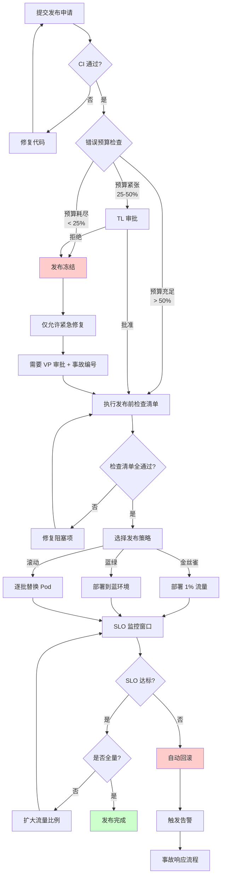
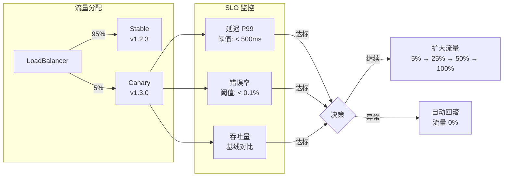

> **生产环境安全提示**
>
> 本文档包含可直接执行的运维命令。执行前请确认：当前目标集群与 Namespace 是否正确；是否具备足够的 RBAC 权限；是否已在非生产环境验证。命令风险等级标注：🔴 高风险（可能造成数据丢失或服务中断）、🟡 中风险（会修改集群状态，但通常可回滚）、🟢 低风险/只读（信息收集，无副作用）。


# 基于 SLO 的发布门控

> **核心原则**: 发布不是审批流程，而是基于数据的安全决策。错误预算是发布决策的唯一依据——预算充足则推进，预算不足则冻结。

## 发布决策矩阵

```
错误预算剩余    发布策略
─────────────────────────────────
> 75%          正常发布
50-75%         正常发布 + 加强监控
25-50%         仅发布关键修复
< 25%          发布冻结（紧急修复除外）
0%             完全冻结
─────────────────────────────────
```

### 错误预算消耗状态说明

| 状态 | 预算剩余 | 发布策略 | 监控强度 | 审批要求 |
|------|---------|---------|---------|---------|
| 🟢 **健康** | > 75% | 正常发布 | 标准 | 常规审批 |
| 🟡 **警告** | 50-75% | 正常发布 | 加强 | 常规审批 |
| 🟠 **紧张** | 25-50% | 仅关键修复 | 密集 | TL 审批 |
| 🔴 **耗尽** | < 25% | 发布冻结 | 战时 | 总监审批 |
| ⚫ **透支** | ≤ 0% | 完全冻结 | 战时 | VP 审批 |

## 基于 SLO 的发布门控流程图



## 发布前检查清单

### 基础设施检查 (1-5)

- [ ] **1. 集群资源充足**: 目标命名空间 CPU/内存 Request 使用率 < 70%
- [ ] **2. 节点健康**: 所有节点 Ready，无 DiskPressure、MemoryPressure
- [ ] **3. 存储容量**: PVC 使用率 < 80%，有扩展空间
- [ ] **4. 网络策略**: 新服务的 [[NetworkPolicy|NetworkPolicy]] 已配置并验证
- [ ] **5. DNS 解析**: 新域名/服务名已正确解析

### 应用检查 (6-10)

- [ ] **6. 镜像安全扫描**: [[Trivy|Trivy]]/Snyk 扫描无 HIGH/CRITICAL 漏洞
- [ ] **7. 配置验证**: ConfigMap/Secret 变更已 diff 确认
- [ ] **8. 资源限制**: CPU/Memory Request 和 Limit 已设置合理值
- [ ] **9. 健康检查**: LivenessProbe 和 ReadinessProbe 已配置且通过
- [ ] **10. HPA 配置**: 自动扩缩容策略已配置（生产环境必须）

### 可观测性检查 (11-15)

- [ ] **11. 指标埋点**: 关键业务指标已接入 [[Prometheus|Prometheus]]
- [ ] **12. 日志规范**: 日志格式统一，关键路径有结构化日志
- [ ] **13. 告警规则**: 新服务的告警规则已配置并测试
- [ ] **14. Dashboard**: Grafana 大盘已创建或更新
- [ ] **15. 追踪集成**: 分布式追踪已接入（[[Jaeger|Jaeger]]/Tempo/SkyWalking）

### SLO/发布检查 (16-20)

- [ ] **16. SLO 基线**: 过去 7 天 SLO 达标率 > 99%，无持续下降趋势
- [ ] **17. 错误预算**: 剩余错误预算 > 25%（关键服务 > 50%）
- [ ] **18. 依赖检查**: 下游依赖服务的 SLO 状态健康
- [ ] **19. 回滚方案**: 回滚命令已准备，回滚时间 < 5 分钟
- [ ] **20. 值班就绪**: On-call 工程师已确认知晓发布计划

### 业务与合规检查 (21-25)

- [ ] **21. 变更评审**: 技术方案已通过评审（重大变更）
- [ ] **22. 兼容性**: API 变更向后兼容或客户端已升级
- [ ] **23. 数据库变更**: Schema 变更有回滚脚本，已测试
- [ ] **24. 合规审计**: 涉及敏感数据的变更已通过安全评审
- [ ] **25. 发布窗口**: 非业务高峰期（如避开双 11、黑五）

### 检查清单自动化

```yaml
# .github/workflows/release-gate.yaml
name: Release Gate
on:
  workflow_dispatch:

jobs:
  gate:
    runs-on: ubuntu-latest
    steps:
      - name: Check Cluster Resources
        run: |
          CPU_USAGE=$(kubectl top nodes --no-headers | awk '{sum+=$3} END {print sum/NR}')
          if (( $(echo "$CPU_USAGE > 70" | bc -l) )); then
            echo "❌ 集群 CPU 使用率过高: ${CPU_USAGE}%"
            exit 1
          fi

      - name: Check Node Health
        run: |
          NOT_READY=$(kubectl get nodes --no-headers | grep -v Ready | wc -l)
          if [ "$NOT_READY" -gt 0 ]; then
            echo "❌ 存在 NotReady 节点"
            exit 1
          fi

      - name: Check Error Budget
        run: |
          BURN_RATE=$(curl -s "$SLO_API/burn_rate?service=$SERVICE&window=30d")
          if (( $(echo "$BURN_RATE > 0.75" | bc -l) )); then
            echo "❌ 错误预算已消耗 ${BURN_RATE}%"
            exit 1
          fi
          echo "✅ 错误预算充足: ${BURN_RATE}%"

      - name: Check SLO Trend
        run: |
          SLO_7D=$(curl -s "$SLO_API/availability?service=$SERVICE&window=7d")
          if (( $(echo "$SLO_7D < 0.99" | bc -l) )); then
            echo "⚠️ 过去 7 天 SLO 仅 ${SLO_7D}"
            exit 1
          fi

      - name: Verify Rollback Plan
        run: |
          if [ ! -f "rollback/${VERSION}.yaml" ]; then
            echo "❌ 回滚方案未准备"
            exit 1
          fi
```

## 错误预算充足 vs 不足的发布策略对比

### 策略对比总表

| 维度 | 预算充足 (> 50%) | 预算紧张 (25-50%) | 预算耗尽 (< 25%) |
|------|-----------------|------------------|-----------------|
| **发布频率** | 正常节奏 | 降低 50% | 仅紧急修复 |
| **发布时段** | 任意工作日 | 仅工作日上午 | 仅工作日下午 |
| **审批层级** | 常规 (TL) | TL + SRE | 总监 + VP |
| **发布策略** | 滚动/蓝绿/金丝雀 | 金丝雀 (更保守) | 紧急补丁流程 |
| **监控窗口** | 标准 (5-15min) | 延长 (30min) | 持续监控至恢复 |
| **回滚阈值** | SLO 不达标 | 任何异常信号 | 零容忍 |
| **并行发布** | 允许 2-3 个 | 仅 1 个 | 禁止 |
| **Feature Flag** | 新功能默认开启 | 新功能默认关闭 | 禁止新功能 |
| **数据变更** | 正常 Schema 变更 | Schema 变更需双写 | 禁止大表变更 |
| **通知范围** | 团队频道 | 团队 + 依赖方 | 全员 + 客户通知 |

### 预算充足时的发布流程

```
错误预算: 65% 剩余

发布策略:
  1. 选择滚动更新 (Rolling Update)
  2. maxSurge=25%, maxUnavailable=0
  3. 每批次监控 5 分钟 SLO
  4. 异常自动暂停，人工决策继续或回滚

风险承受度:
  - 允许短暂 SLO 下降 (只要 28 天窗口内不超预算)
  - 可以同时发布多个低风险变更
  - 新功能可以直接全量开启
```

### 预算紧张时的发布流程

```
错误预算: 35% 剩余

发布策略:
  1. 强制金丝雀发布
  2. 初始流量: 1% → 5% → 10% → 25% → 50% → 100%
  3. 每阶段监控 30 分钟 SLO
  4. 任何 P99 延迟上升 > 20% 立即回滚

限制措施:
  - 仅允许高优先级 bugfix 和功能发布
  - 禁止数据库大表变更
  - 禁止依赖升级 (除非安全漏洞)
  - Feature Flag 默认关闭，逐步灰度
  - 发布需 TL 和 SRE 双审批
```

### 预算耗尽时的发布冻结

```
错误预算: 10% 剩余 (或已透支)

冻结措施:
  1. CI/CD pipeline 自动阻断非紧急发布
  2. 所有 PR 合并到 main 需 SRE 总监审批
  3. 紧急修复必须通过事故响应流程:
     a. 创建 P0/P1 事故
     b. VP 或总监书面批准
     c. 最小化变更范围
     d. 专人实时盯盘
     e. 发布后立即复盘

解冻条件:
  - 自然进入新的 SLO 窗口 (如月度预算重置)
  - 或当前窗口内成功修复导致 SLO 回升
  - 错误预算恢复至 > 25%
```

## 渐进式发布与 SLO 监控结合方案

### 金丝雀发布 + SLO 监控



### 金丝雀各阶段检查表

| 阶段 | 流量比例 | 监控时长 | SLO 检查项 | 通过条件 | 失败动作 |
|------|---------|---------|-----------|---------|---------|
| **Stage 0** | 0% (部署) | 5 min | Pod 启动、健康检查 | 100% Ready | 自动删除 |
| **Stage 1** | 1% | 10 min | P99 延迟、错误率 | 延迟 < 基线×1.2 | 自动回滚 |
| **Stage 2** | 5% | 15 min | P99 延迟、错误率、CPU/内存 | 全部达标 | 自动回滚 |
| **Stage 3** | 10% | 20 min | + 业务指标、自定义 SLI | 全部达标 | 自动回滚 |
| **Stage 4** | 25% | 30 min | + 依赖服务延迟 | 全部达标 | 自动回滚 |
| **Stage 5** | 50% | 30 min | 全量 SLO 检查 | 全部达标 | 手动确认回滚 |
| **Stage 6** | 100% | 60 min | 全量 SLO + 错误预算 | 无告警 | 手动回滚 |

### 蓝绿发布 + SLO 验证

```yaml
# 蓝绿发布 Argo Rollout 示例
apiVersion: argoproj.io/v1alpha1
kind: Rollout
metadata:
  name: order-service
spec:
  replicas: 10
  strategy:
    blueGreen:
      activeService: order-service-active
      previewService: order-service-preview
      autoPromotionEnabled: false  # 手动或自动推广
      autoPromotionAnalysis:
        templates:
          - templateName: slo-success-rate
        args:
          - name: service-name
            value: order-service-preview
      prePromotionAnalysis:
        templates:
          - templateName: slo-latency-p99
        args:
          - name: service-name
            value: order-service-preview
---
apiVersion: argoproj.io/v1alpha1
kind: AnalysisTemplate
metadata:
  name: slo-success-rate
spec:
  metrics:
    - name: success-rate
      interval: 1m
      count: 5
      successCondition: result[0] >= 0.999
      provider:
        prometheus:
          address: http://prometheus:9090
          query: |
            sum(rate(http_requests_total{service="{{args.service-name}}",status=~"2.."}[1m]))
            /
            sum(rate(http_requests_total{service="{{args.service-name}}"}[1m]))
---
apiVersion: argoproj.io/v1alpha1
kind: AnalysisTemplate
metadata:
  name: slo-latency-p99
spec:
  metrics:
    - name: latency-p99
      interval: 1m
      count: 5
      successCondition: result[0] <= 0.5
      provider:
        prometheus:
          address: http://prometheus:9090
          query: |
            histogram_quantile(0.99,
              sum(rate(http_request_duration_seconds_bucket{service="{{args.service-name}}"}[1m])) by (le)
            )
```

### 渐进式发布 PromQL 监控面板

```promql
# === 金丝雀 vs 稳定版本对比 ===

# 1. 错误率对比
# 金丝雀版本错误率
sum(rate(http_requests_total{service="order-service",version="canary",status=~"5.."}[5m]))
/
sum(rate(http_requests_total{service="order-service",version="canary"}[5m]))

# 稳定版本错误率
sum(rate(http_requests_total{service="order-service",version="stable",status=~"5.."}[5m]))
/
sum(rate(http_requests_total{service="order-service",version="stable"}[5m]))

# 2. P99 延迟对比
# 金丝雀
histogram_quantile(0.99,
  sum(rate(http_request_duration_seconds_bucket{service="order-service",version="canary"}[5m])) by (le)
)

# 稳定
histogram_quantile(0.99,
  sum(rate(http_request_duration_seconds_bucket{service="order-service",version="stable"}[5m])) by (le)
)

# 3. 流量比例监控
sum(rate(http_requests_total{service="order-service",version="canary"}[1m]))
/
sum(rate(http_requests_total{service="order-service"}[1m]))

# 4. 金丝雀 Pod 健康度
sum(kube_deployment_status_replicas_available{deployment="order-service-canary"})
/
sum(kube_deployment_spec_replicas{deployment="order-service-canary"})
```

## 自动回滚触发条件

### 回滚触发器分类

| 触发器类型 | 严重程度 | 触发条件 | 动作延迟 | 是否自动 |
|-----------|---------|---------|---------|---------|
| **致命错误** | P0 | 错误率 > 5% 或 Pod CrashLoopBackOff | 0s | 是 |
| **SLO 违反** | P1 | 错误率 > SLO 目标 × 2 | 2min | 是 |
| **延迟飙升** | P1 | P99 延迟 > 基线 × 2 | 5min | 是 |
| **资源耗尽** | P2 | CPU Throttling > 10% 或 OOM | 3min | 是 |
| **依赖问题** | P2 | 下游服务错误率 > 1% | 5min | 否 (人工确认) |
| **业务异常** | P2 | 自定义业务指标异常 | 10min | 否 |

### 自动回滚 PromQL 表达式

```promql
# === 致命错误触发器 ===

# 触发器 1: HTTP 5xx 错误率 > 5%
(
  sum(rate(http_requests_total{service="order-service",status=~"5.."}[2m]))
  /
  sum(rate(http_requests_total{service="order-service"}[2m]))
) > 0.05

# 触发器 2: Pod CrashLoopBackOff
kube_pod_container_status_waiting_reason{reason="CrashLoopBackOff",pod=~"order-service-.*"} == 1

# === SLO 违反触发器 ===

# 触发器 3: 错误率超过 SLO 目标 2 倍 (SLO 99.9% → 阈值 0.2%)
(
  sum(rate(http_requests_total{service="order-service",status=~"5.."}[5m]))
  /
  sum(rate(http_requests_total{service="order-service"}[5m]))
) > 0.002

# 触发器 4: 28 天滚动错误预算消耗过快 (Burn Rate > 14.4)
(
  sum(rate(http_requests_total{service="order-service",status=~"5.."}[1h]))
  /
  sum(rate(http_requests_total{service="order-service"}[1h]))
) > ((1 - 0.999) * 14.4)

# === 延迟飙升触发器 ===

# 触发器 5: P99 延迟超过基线 2 倍
(
  histogram_quantile(0.99,
    sum(rate(http_request_duration_seconds_bucket{service="order-service"}[5m])) by (le)
  )
  >
  (
    avg(histogram_quantile(0.99,
      sum(rate(http_request_duration_seconds_bucket{service="order-service"}[1h] offset 1d)) by (le)
    )) * 2
  )
)

# 触发器 6: P99 延迟超过 SLA 阈值 (500ms)
histogram_quantile(0.99,
  sum(rate(http_request_duration_seconds_bucket{service="order-service"}[5m])) by (le)
) > 0.5

# === 资源耗尽触发器 ===

# 触发器 7: CPU Throttling 比率 > 10%
(
  sum(rate(container_cpu_cfs_throttled_periods_total{pod=~"order-service-.*"}[5m]))
  /
  sum(rate(container_cpu_cfs_periods_total{pod=~"order-service-.*"}[5m]))
) > 0.1

# 触发器 8: OOM Killed
sum(increase(kube_pod_container_status_restarts_total{pod=~"order-service-.*"}[10m])) by (pod) > 0
and
kube_pod_container_status_last_terminated_reason{reason="OOMKilled",pod=~"order-service-.*"} == 1

# === 依赖问题触发器 ===

# 触发器 9: 下游数据库连接错误率 > 1%
(
  sum(rate(http_requests_total{service="order-service",status=~"5..",error_type="db_connection"}[5m]))
  /
  sum(rate(http_requests_total{service="order-service"}[5m]))
) > 0.01

# 触发器 10: 外部 API 超时率 > 5%
(
  sum(rate(http_requests_total{service="order-service",status="504"}[5m]))
  /
  sum(rate(http_requests_total{service="order-service"}[5m]))
) > 0.05
```

### 自动回滚实现 (Argo Rollouts + Prometheus)

```yaml
# === 自动回滚 AnalysisTemplate ===
apiVersion: argoproj.io/v1alpha1
kind: AnalysisTemplate
metadata:
  name: auto-rollback-triggers
spec:
  metrics:
    - name: error-rate-fatal
      interval: 30s
      count: 3
      failureLimit: 1
      successCondition: result[0] < 0.05
      provider:
        prometheus:
          address: http://prometheus:9090
          query: |
            sum(rate(http_requests_total{service="{{args.service}}",status=~"5.."}[2m]))
            /
            sum(rate(http_requests_total{service="{{args.service}}"}[2m]))

    - name: slo-violation
      interval: 1m
      count: 2
      failureLimit: 1
      successCondition: result[0] < 0.002
      provider:
        prometheus:
          address: http://prometheus:9090
          query: |
            sum(rate(http_requests_total{service="{{args.service}}",status=~"5.."}[5m]))
            /
            sum(rate(http_requests_total{service="{{args.service}}"}[5m]))

    - name: latency-spike
      interval: 1m
      count: 5
      failureLimit: 2
      successCondition: result[0] <= 0.5
      provider:
        prometheus:
          address: http://prometheus:9090
          query: |
            histogram_quantile(0.99,
              sum(rate(http_request_duration_seconds_bucket{service="{{args.service}}"}[5m])) by (le)
            )

    - name: cpu-throttle
      interval: 1m
      count: 3
      failureLimit: 1
      successCondition: result[0] < 0.1
      provider:
        prometheus:
          address: http://prometheus:9090
          query: |
            sum(rate(container_cpu_cfs_throttled_periods_total{pod=~"{{args.service}}-.*"}[5m]))
            /
            sum(rate(container_cpu_cfs_periods_total{pod=~"{{args.service}}-.*"}[5m]))

    - name: pod-health
      interval: 30s
      count: 5
      failureLimit: 2
      successCondition: result[0] == 1
      provider:
        prometheus:
          address: http://prometheus:9090
          query: |
            sum(kube_deployment_status_replicas_available{deployment="{{args.service}}"})
            /
            sum(kube_deployment_spec_replicas{deployment="{{args.service}}"})
```

### 手动回滚命令参考

> ⚠️ **🟡 中危变更** — 变更集群资源状态，建议先 --dry-run 或 diff 确认
> - `kubectl exec`：进入容器执行命令，可能改变容器状态
> - `kubectl rollout undo/restart`：触发滚动变更，影响副本

``` bash
# 🟡 中风险：会修改集群/资源状态，执行前请确认目标、影响范围与授权
# === kubectl 原生回滚 ===
# 查看历史版本
kubectl rollout history deployment/order-service

# 回滚到上一个版本
kubectl rollout undo deployment/order-service

# 回滚到指定版本
kubectl rollout undo deployment/order-service --to-revision=3

# === Helm 回滚 ===
# 查看历史
helm history order-service

# 回滚到上一版本
helm rollback order-service

# 回滚到指定版本
helm rollback order-service 2

# === Argo CD 回滚 ===
# 通过 UI: Applications → order-service → Sync → 选择历史 revision
# 通过 CLI:
argocd app rollback order-service 3

# === 紧急回滚脚本 ===
#!/bin/bash
# rollback.sh
SERVICE=$1
NAMESPACE=${2:-default}

echo "🚨 紧急回滚 $SERVICE..."

# 1. 暂停当前 rollout
kubectl rollout pause deployment/$SERVICE -n $NAMESPACE

# 2. 回滚
echo "回滚到上一个版本..."
kubectl rollout undo deployment/$SERVICE -n $NAMESPACE

# 3. 等待回滚完成
kubectl rollout status deployment/$SERVICE -n $NAMESPACE --timeout=300s

# 4. 验证 SLO 恢复
echo "验证 SLO..."
sleep 60
ERROR_RATE=$(kubectl exec -it deploy/prometheus -- \
  curl -s 'http://localhost:9090/api/v1/query?query=...')

echo "当前错误率: $ERROR_RATE"
echo "✅ 回滚完成"
```
## CI/CD 集成

```yaml
# GitLab CI 示例
stages:
  - build
  - test
  - gate
  - deploy

slo_gate:
  stage: gate
  script:
    - |
      BURN_RATE=$(curl -s "$SLO_API/burn_rate?service=order-service&window=30d")
      echo "当前错误预算消耗率: ${BURN_RATE}%"
      
      if (( $(echo "$BURN_RATE > 0.75" | bc -l) )); then
        echo "❌ 错误预算已消耗超过 75%，发布被拒绝"
        exit 1
      fi
      
      if (( $(echo "$BURN_RATE > 0.50" | bc -l) )); then
        echo "⚠️ 错误预算消耗超过 50%，需要 TL 审批"
        # 调用审批 API
      fi
      
      echo "✅ 错误预算充足，允许发布"
  only:
    - main

canary_deploy:
  stage: deploy
  script:
    - kubectl apply -f k8s/canary/
    - ./scripts/wait-for-slo.sh --service order-service --traffic 5% --timeout 600
  when: manual
```

### GitHub Actions 集成

```yaml
# .github/workflows/slo-gate.yaml
name: SLO Release Gate
on:
  push:
    branches: [main]

jobs:
  slo-check:
    runs-on: ubuntu-latest
    steps:
      - uses: actions/checkout@v4

      - name: Check Error Budget
        id: budget
        run: |
          RESPONSE=$(curl -s "$SLO_API/budget_remaining?service=${{ github.event.repository.name }}")
          REMAINING=$(echo $RESPONSE | jq -r '.remaining_percent')
          echo "remaining=$REMAINING" >> $GITHUB_OUTPUT
          echo "错误预算剩余: ${REMAINING}%"

      - name: Gate Decision
        run: |
          REMAINING=${{ steps.budget.outputs.remaining }}
          if (( $(echo "$REMAINING < 25" | bc -l) )); then
            echo "❌ 发布被阻断: 错误预算仅剩 ${REMAINING}%"
            exit 1
          fi
          echo "✅ 发布门控通过"

      - name: Deploy Canary
        if: steps.budget.outputs.remaining > 50
        run: |
          kubectl apply -f k8s/canary/

      - name: Deploy with Extra Monitoring
        if: steps.budget.outputs.remaining <= 50
        run: |
          echo "⚠️ 预算紧张，启用额外监控..."
          kubectl apply -f k8s/canary-extra-monitoring/
```

## 实施最佳实践

### 发布窗口管理

```
推荐发布窗口 (根据业务特点调整):

✅ 低风险时段:
  - 周二至周四 上午 10:00 - 下午 4:00
  - 团队全员在岗时段
  - 非促销/活动期

❌ 高风险时段:
  - 周五下午及周末
  - 节假日期间
  - 大促前 1 周
  - 季度末/年末
```

### 发布节奏建议

| 环境 | 频率 | 门控要求 | 策略 |
|------|------|---------|------|
| 开发 | 随时 | 无 | 直接部署 |
| 测试 | 每日 | 基础检查 | 蓝绿 |
| 预发 | 每周 2-3 次 | 完整检查清单 | 金丝雀 10% |
| 生产 | 每周 1 次 | SLO 门控 + 审批 | 金丝雀 1% → 100% |
| 生产 (紧急) | 按需 | TL 审批 | 最小化变更 |

### SLO 门控仪表板指标

```promql
# 发布决策大盘核心查询

# 1. 当前错误预算剩余百分比
(1 - (
  sum(increase(http_requests_total{status=~"5.."}[30d]))
  /
  sum(increase(http_requests_total[30d]))
) / (1 - 0.999)) * 100

# 2. 近 7 天可用性趋势
sum(rate(http_requests_total{status=~"2..|3.."}[7d]))
/
sum(rate(http_requests_total[7d]))

# 3. 当前运行中发布状态
argocd_app_info{sync_status="Synced",health_status="Healthy"}
```

### 常见陷阱

```
❌ 陷阱 1: 只看瞬时错误率
  → 短暂流量 spike 导致误判
  ✅ 使用 5-15 分钟窗口的聚合指标

❌ 陷阱 2: 忽略长尾延迟
  → P50 正常但 P99 飙升影响用户体验
  ✅ 监控 P99 和 P99.9

❌ 陷阱 3: 没有考虑依赖方
  → 自己服务正常，但下游数据库拖垮整体
  ✅ 端到端 SLO 监控

❌ 陷阱 4: 自动回滚过于激进
  → 正常启动过程中的指标抖动触发回滚
  ✅ 设置合理的 warmup 期 (如 60s)

❌ 陷阱 5: 回滚后也触发告警
  → 回滚操作本身被误判为问题
  ✅ 标注发布/回滚时间窗口，抑制预期内告警

❌ 陷阱 6: 忽略发布后的长尾影响
  → 变更在 2 小时后触发缓存雪崩
  ✅ 延长发布后监控窗口至 4-24 小时

❌ 陷阱 7: 错误预算计算口径不一致
  → 门控用 7 天窗口，SLO 用 30 天窗口
  ✅ 统一使用 SLO 评估窗口进行门控决策
```

## 相关

- [[09-可观测性/06-SLO-SLI/06-error-budget-management.md|03 error budget management]]
- [[09-可观测性/06-SLO-SLI/07-burn-rate-alerting.md|04 burn rate alerting]]

## 相关合成分析

- [[22-概念/09-平台与发布/gitops-sre-release-gate.md|GitOps SRE 发布门控]]


<!-- risk-assessed -->
