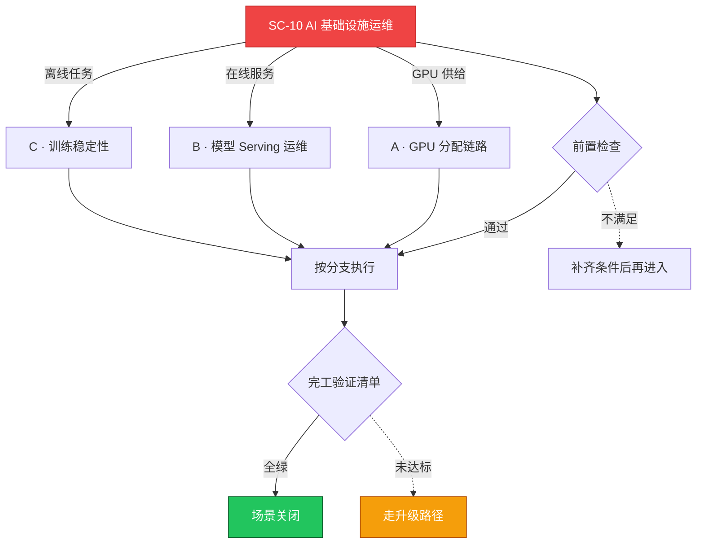

# SC-10 场景剧本: AI 基础设施运维

> **ID**: `SC-10` · **分组**: 建设与交付 · **英文**: AI Infra Operations · **更新**: 2026-08-27
> **层次定位**: 工单剧本编排层 —— 回答「什么场景、按什么顺序、调用哪些资源」。
> Domain 讲原理，Skill 给动作，FTA 管推导；本页负责把它们串成可执行的工作流。

## 一、适用场景（何时进入本剧本）

- Pod 因 GPU 资源不足长期 Pending
- 推理服务延迟抖动 / 显存命中率下降
- 训练任务 OOM 或节点宕机后的续训需求

## 二、场景概述

AI 负载的特殊性在于稀缺异构资源 + 长时任务 + 显存严苛约束，本剧本聚焦 GPU 分配链路与推理 Serving 两大主战场。

## 三、前置检查（开工门槛，逐项勾选）

- [ ] 驱动/CUDA/容器运行时版本矩阵一致性确认
- [ ] 梳理调度器与配额策略现状 → [[15-AI基础设施/README.md|AI 基础设施域]]

## 四、快速决策树

## 五、工作流分支

### A · GPU 分配链路

> 条件: GPU 供给

1. device-plugin 注册状态与时钟漂移核查 → [[19-故障诊断/06-FTA故障树/list/gpu-fta.md|FTA · gpu]]
2. 排除 GPU 因素后沿用通用 Pending 方法论 → [[19-故障诊断/08-技能体系/03-pod-pending.md|03 · pod pending]]

### B · 模型 Serving 运维

> 条件: 在线服务

1. HPA 指标从 GPU 利用率切换为并发/RPS 口径
2. 滚动发布按整卡粒度推进避免显存叠加溢出 → [[19-故障诊断/08-技能体系/13-autoscaling-failure.md|13 · autoscaling failure]]

### C · 训练稳定性

> 条件: 离线任务

1. checkpoint 间隔与对象存储落盘验证
2. NCCL 慢节点自动化剔除（环状诊断脚本挂任务 HOOK）

## 六、完工验证清单

- [ ] GPU 整卡分配率与碎片率同时达标（碎片 <5%）
- [ ] 推理服务 P99 达标且 OOM 无复现周期 ≥7 天
- [ ] 断点续训演练 100% 成功

## 七、常见陷阱（前人踩坑榜）

- ⚠️ nvidia.com/gpu 整卡粗粒度申请导致小模型浪费半张卡
- ⚠️ 共享存储高吞吐写打满对象存储配额拖垮全体训练任务
- ⚠️ 在有任务运行的节点上直接热升级驱动

## 八、升级路径

| 触发条件 | 升级动作 |
|---|---|
| 硬件级 XID 错误频发 | 通知供应商换卡并把节点划入隔离池 |

## 九、资源编排（跨层素材索引）

### 领域文档（原理与规范）

- [[15-AI基础设施/README.md|AI 基础设施域]]
- [[16-专项技术/README.md|专项技术]]

### FTA 故障树（根因推导）

- [[19-故障诊断/06-FTA故障树/list/gpu-fta.md|FTA · gpu]]
- [[19-故障诊断/06-FTA故障树/list/crd-operator-fta.md|FTA · crd-operator]]

### 操作技能卡（原子动作）

- [[19-故障诊断/08-技能体系/03-pod-pending.md|03 · pod pending]]
- [[19-故障诊断/08-技能体系/13-autoscaling-failure.md|13 · autoscaling failure]]
- [[19-故障诊断/08-技能体系/18-performance-bottleneck.md|18 · performance bottleneck]]

## 十、相邻场景

- [[13-生产运维/08-运维场景剧本/performance-tuning|SC-04 性能调优]]
- [[13-生产运维/08-运维场景剧本/capacity-planning|SC-14 容量规划]]

---

*本文档由 `31-脚本/generate-scenarios.py` 于 2026-08-27 自动生成。请修改脚本中的场景数据后重新生成，勿直接编辑本文件。*
