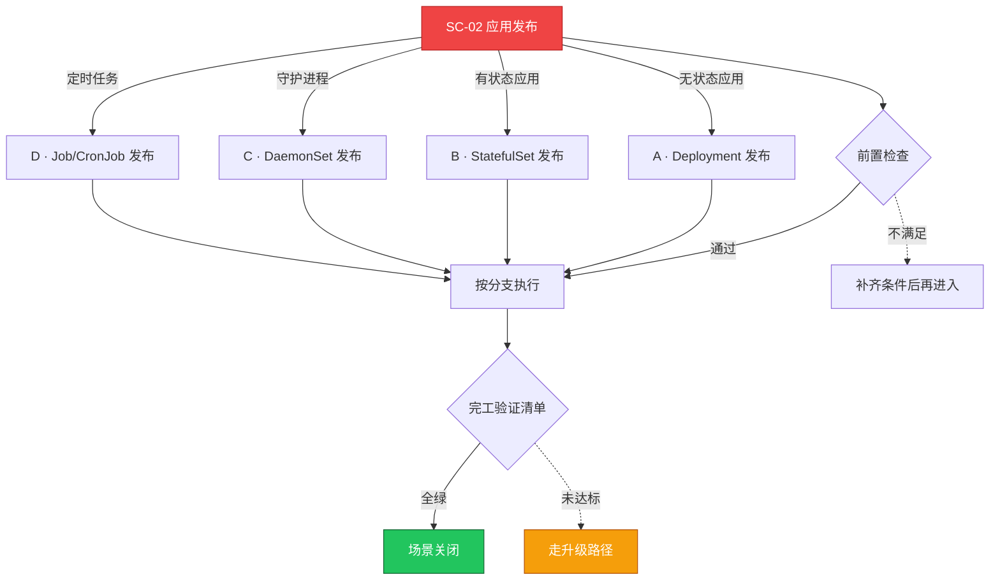

# SC-02 场景剧本: 应用发布

> **ID**: `SC-02` · **分组**: 建设与交付 · **英文**: Application Deployment · **更新**: 2026-08-27
> **层次定位**: 工单剧本编排层 —— 回答「什么场景、按什么顺序、调用哪些资源」。
> Domain 讲原理，Skill 给动作，FTA 管推导；本页负责把它们串成可执行的工作流。

## 一、适用场景（何时进入本剧本）

- 新应用首次上集群
- 常规版本迭代/热修复发布
- 批量重发布（镜像轮换、Secret 轮转）

## 二、场景概述

覆盖无状态/有状态/守护/任务四类工作负载的标准发布动作，以探针、资源声明、配置分离三大前置检查挡住大部分发布事故。

## 三、前置检查（开工门槛，逐项勾选）

- [ ] 资源声明齐全：requests/limits 与压测数据一致
- [ ] 镜像可用性与拉取凭证核对（留意内网域名超时历史） → [[13-生产运维/05-工单案例/ticket-case-006-image-pull-acr-timeout.md|ACR 拉取超时]]
- [ ] 重型应用的 OOM 参数与磁盘 IO 压力预案 → [[13-生产运维/05-工单案例/ticket-case-002-java-oom-essd-iohang.md|Java OOM + IO Hang]]
- [ ] 配置分离：ConfigMap/Secret 变更有版本化与生效策略
- [ ] 探针三件套合理：liveness 不做重依赖检查、readiness 反映真实可用、startup 兜底慢启动

## 四、快速决策树

## 五、工作流分支

### A · Deployment 发布

> 条件: 无状态应用

1. maxUnavailable/maxSurge 与 PDB 匹配，滚动期容量不减半
2. 观察 rollout status 与 ReplicaSet 代际演进 → [[19-故障诊断/08-技能体系/09-deployment-rollout-failure.md|09 · deployment rollout failure]]
3. 副本不齐/状态异常时按症候分流排查 → [[19-故障诊断/08-技能体系/02-pod-crashloop-oomkilled.md|02 · pod crashloop oomkilled]]

### B · StatefulSet 发布

> 条件: 有状态应用

1. 发布前校验 PVC 绑定状态与 storageClass 变更风险
2. 更新中断时优先排查卷绑定类根因 → [[19-故障诊断/08-技能体系/23-statefulset-failure.md|23 · statefulset failure]]、[[13-生产运维/05-工单案例/ticket-case-028-statefulset-pvc-unbound.md|PVC 未绑定]]

### C · DaemonSet 发布

> 条件: 守护进程

1. 覆盖率不足时按节点调度链路排查 → [[19-故障诊断/08-技能体系/24-daemonset-failure.md|24 · daemonset failure]]、[[13-生产运维/05-工单案例/ticket-case-025-daemonset-not-running-on-all-nodes.md|DS 未全覆盖]]

### D · Job/CronJob 发布

> 条件: 定时任务

1. 关注 concurrencyPolicy 与 startingDeadlineSeconds 语义 → [[19-故障诊断/08-技能体系/25-job-cronjob-failure.md|25 · job cronjob failure]]、[[13-生产运维/05-工单案例/ticket-case-034-cronjob-stuck-job-skipped-schedule.md|CronJob 卡住跳调度]]

## 六、完工验证清单

- [ ] 全部副本 Ready，Endpoints 数量与期望一致
- [ ] 灰度流量抽测通过：业务接口 + 日志无异常栈
- [ ] HPA/监控面板无毛刺，错误率回到基线
- [ ] 保留上一版 RS/镜像 tag 以便快速回滚

## 七、常见陷阱（前人踩坑榜）

- ⚠️ 镜像 tag 使用 latest 导致回滚语义失效
- ⚠️ terminationGracePeriodSeconds=0 引发连接复位闪断
- ⚠️ ConfigMap 依赖 rollout 重启生效但变更策略配成了忽略
- ⚠️ 同命名空间多个部署同时滚动放大抖动

## 八、升级路径

| 触发条件 | 升级动作 |
|---|---|
| 发布验证连续两次未通过 | 冻结该批次发布并回滚至上一稳定版 |
| 疑似平台层问题（apiserver/webhook） | 转 SC-03 故障排查总纲 |

## 九、资源编排（跨层素材索引）

### 领域文档（原理与规范）

- [[02-工作负载/README.md|工作负载域]]
- [[03-清单模式/README.md|清单模式规范]]

### FTA 故障树（根因推导）

- [[19-故障诊断/06-FTA故障树/list/pod-fta.md|FTA · pod]]
- [[19-故障诊断/06-FTA故障树/list/deployment-fta.md|FTA · deployment]]
- [[19-故障诊断/06-FTA故障树/list/statefulset-fta.md|FTA · statefulset]]
- [[19-故障诊断/06-FTA故障树/list/pdb-fta.md|FTA · pdb]]

### 操作技能卡（原子动作）

- [[19-故障诊断/08-技能体系/02-pod-crashloop-oomkilled.md|02 · pod crashloop oomkilled]]
- [[19-故障诊断/08-技能体系/08-pvc-storage-failure.md|08 · pvc storage failure]]
- [[19-故障诊断/08-技能体系/15-configmap-secret-failure.md|15 · configmap secret failure]]

## 十、相邻场景

- [[13-生产运维/08-运维场景剧本/gitops-workflow|SC-15 GitOps 工作流]]
- [[13-生产运维/08-运维场景剧本/daily-ops|SC-09 日常巡检]]

---

*本文档由 `31-脚本/generate-scenarios.py` 于 2026-08-27 自动生成。请修改脚本中的场景数据后重新生成，勿直接编辑本文件。*
