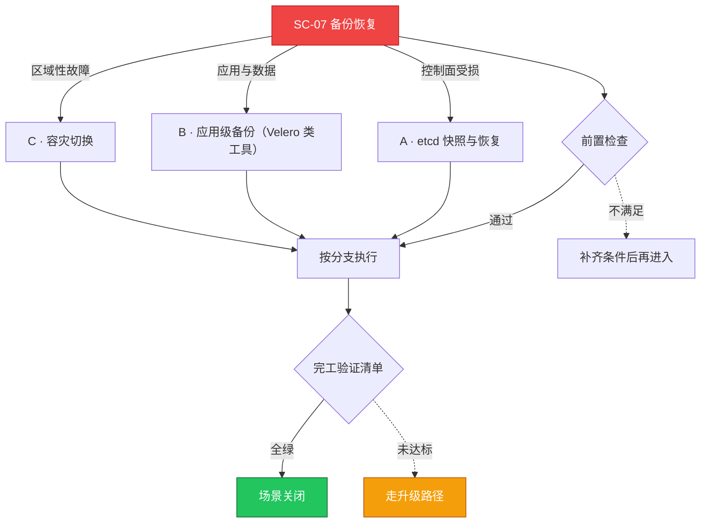

# SC-07 场景剧本: 备份恢复

> **ID**: `SC-07` · **分组**: 可靠性韧性 · **英文**: Backup & Restore · **更新**: 2026-08-27
> **层次定位**: 工单剧本编排层 —— 回答「什么场景、按什么顺序、调用哪些资源」。
> Domain 讲原理，Skill 给动作，FTA 管推导；本页负责把它们串成可执行的工作流。

## 一、适用场景（何时进入本剧本）

- 例行备份任务执行与抽查
- 升级、大规模迁移前的保护性快照
- 误删数据/损坏后的应急恢复

## 二、场景概述

『可备份』只是起点，『可恢复』才是终点：所有备份必须经历实弹恢复演练才算数。

## 三、前置检查（开工门槛，逐项勾选）

- [ ] 备份对象四象限清单：etcd 快照、资源清单(GitOps 库)、PV 数据、证书私钥
- [ ] RPO/RTO 目标书面化并与业务方签字确认
- [ ] 恢复环境与介质可达性预检 → [[12-可靠性/02-灾难恢复/index.md|灾备恢复专题]]

## 四、快速决策树

## 五、工作流分支

### A · etcd 快照与恢复

> 条件: 控制面受损

1. snapshot save 定时执行 + 离线异地副本（校验 checksum）
2. 恢复必须在隔离环境先行彩排验证 → [[19-故障诊断/06-FTA故障树/list/etcd-fta.md|FTA · etcd]]、[[19-故障诊断/06-FTA故障树/list/backup-restore-fta.md|FTA · backup-restore]]

### B · 应用级备份（Velero 类工具）

> 条件: 应用与数据

1. 使用 hook 保证数据库一致性快照（fsfreeze/db dump）
2. restore 后必须重建 ServiceAccount 与凭证绑定关系

### C · 容灾切换

> 条件: 区域性故障

1. 按多集群手册执行 DNS/GSLB 切换 → [[13-生产运维/07-运维手册/05-multi-cluster-operations.md|多集群运维手册]]
2. 切回正向演练同样计入达标项

## 六、完工验证清单

- [ ] 季度恢复演练达标：RTO 实测 ≤ 目标值
- [ ] 抽样 restore 的数据一致性哈希比对通过
- [ ] 备份介质离线留存占比 ≥50%（防勒索逻辑）

## 七、常见陷阱（前人踩坑榜）

- ⚠️ 只备份不演练——真出事才发现快照跨大版本不兼容
- ⚠️ 证书随快照原样恢复导致集群 PKI 冲突
- ⚠️ PV 使用存储层快照却不停写，静默产生数据撕裂

## 八、升级路径

| 触发条件 | 升级动作 |
|---|---|
| 恢复演练失败或 RTO 超标 | 列入 P1 风险跟踪并暂停相关升级计划 |

## 九、资源编排（跨层素材索引）

### 领域文档（原理与规范）

- [[12-可靠性/README.md|可靠性域]]
- [[12-可靠性/02-灾难恢复/index.md|灾难恢复专题]]

### FTA 故障树（根因推导）

- [[19-故障诊断/06-FTA故障树/list/backup-restore-fta.md|FTA · backup-restore]]
- [[19-故障诊断/06-FTA故障树/list/etcd-fta.md|FTA · etcd]]
- [[19-故障诊断/06-FTA故障树/list/csi-fta.md|FTA · csi]]

### 操作技能卡（原子动作）

- [[19-故障诊断/08-技能体系/12-control-plane-failure.md|12 · control plane failure]]
- [[19-故障诊断/08-技能体系/08-pvc-storage-failure.md|08 · pvc storage failure]]

## 十、相邻场景

- [[13-生产运维/08-运维场景剧本/upgrade-migration|SC-08 升级迁移]]
- [[13-生产运维/08-运维场景剧本/multi-cluster|SC-17 多集群管理]]

---

*本文档由 `31-脚本/generate-scenarios.py` 于 2026-08-27 自动生成。请修改脚本中的场景数据后重新生成，勿直接编辑本文件。*
