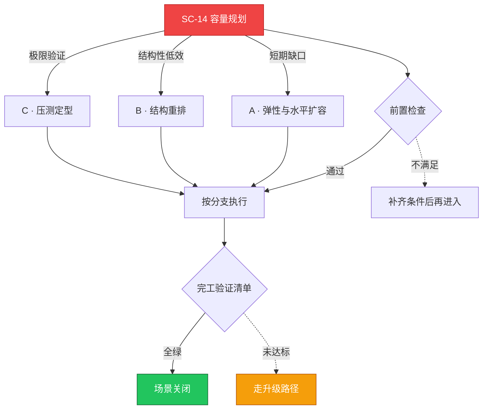

# SC-14 场景剧本: 容量规划

> **ID**: `SC-14` · **分组**: 可靠性韧性 · **英文**: Capacity Planning · **更新**: 2026-08-27
> **层次定位**: 工单剧本编排层 —— 回答「什么场景、按什么顺序、调用哪些资源」。
> Domain 讲原理，Skill 给动作，FTA 管推导；本页负责把它们串成可执行的工作流。

## 一、适用场景（何时进入本剧本）

- 大促/活动前备战窗口开启
- 节点水印连续一周高于 70%（CPU/内存任一维度）
- 因资源不足导致的 Pending 占比抬头

## 二、场景概述

容量是一种预算：以业务增长率为输入锚点，沉淀水位→预测→压测→执行的季度轮回机制。

## 三、前置检查（开工门槛，逐项勾选）

- [ ] 读取 SC-09 巡检沉淀的三个月水位趋势 → [[13-生产运维/08-运维场景剧本/daily-ops|SC-09 日常巡检]]
- [ ] request 失真体检：real/request 比 <0.6 的右调清单 → [[13-生产运维/01-成本治理/02-idle-resource-right-sizing.md|闲置资源右调]]
- [ ] 列出隐性天花板：IP 池/端口/安全组限额（别只算 CPU 内存）

## 四、快速决策树

## 五、工作流分支

### A · 弹性与水平扩容

> 条件: 短期缺口

1. CA 参数梳理（上下限/scale-down 延迟/冷启动压测） → [[19-故障诊断/06-FTA故障树/list/cluster-autoscaler-fta.md|FTA · cluster-autoscaler]]、[[13-生产运维/05-工单案例/ticket-case-045-cluster-autoscaler-scaleup-fail.md|CA 扩容失败]]
2. HPA 行为参数（stabilizationWindow）贴合业务波形

### B · 结构重排

> 条件: 结构性低效

1. 大小规格节点池混布降低碎片化 Pending → [[13-生产运维/05-工单案例/ticket-case-012-pod-pending-resource-exhaustion.md|资源耗尽 Pending]]
2. 反亲和与拓扑打散策略回归验证

### C · 压测定型

> 条件: 极限验证

1. 影子流量全链路压测至目标峰值 ×1.3
2. 容量基线纳入生产就绪度评审附件 → [[13-生产运维/07-运维手册/03-capacity-planning-readiness.md|容量规划就绪指南]]

## 六、完工验证清单

- [ ] 峰值水位控制在 70% 预警线以下且有 headroom 台账
- [ ] 弹性到位时间实测 <5 分钟
- [ ] 成本影响测算随行提交（防止拍脑袋扩容）

## 七、常见陷阱（前人踩坑榜）

- ⚠️ 只算 CPU 内存，IP 池枯竭使扩容全军覆没
- ⚠️ 压测只打单接口，网关限流从未经受检验
- ⚠️ 扩完不做缩容复盘，容量账永远虚胖

## 八、升级路径

| 触发条件 | 升级动作 |
|---|---|
| 两周内无法满足确定性业务缺口 | 上报架构委员会进入机型采购/混合云流程 |

## 九、资源编排（跨层素材索引）

### 领域文档（原理与规范）

- [[13-生产运维/07-运维手册/03-capacity-planning-readiness.md|容量规划就绪指南]]
- [[13-生产运维/01-成本治理/01-cost-allocation-chargeback.md|成本分摊]]

### FTA 故障树（根因推导）

- [[19-故障诊断/06-FTA故障树/list/cluster-autoscaler-fta.md|FTA · cluster-autoscaler]]
- [[19-故障诊断/06-FTA故障树/list/hpa-fta.md|FTA · hpa]]

### 操作技能卡（原子动作）

- [[19-故障诊断/08-技能体系/13-autoscaling-failure.md|13 · autoscaling failure]]
- [[19-故障诊断/08-技能体系/26-namespace-quota-limitrange.md|26 · namespace quota limitrange]]

## 十、相邻场景

- [[13-生产运维/08-运维场景剧本/daily-ops|SC-09 日常巡检]]
- [[13-生产运维/08-运维场景剧本/cost-optimization|SC-19 成本优化]]

---

*本文档由 `31-脚本/generate-scenarios.py` 于 2026-08-27 自动生成。请修改脚本中的场景数据后重新生成，勿直接编辑本文件。*
