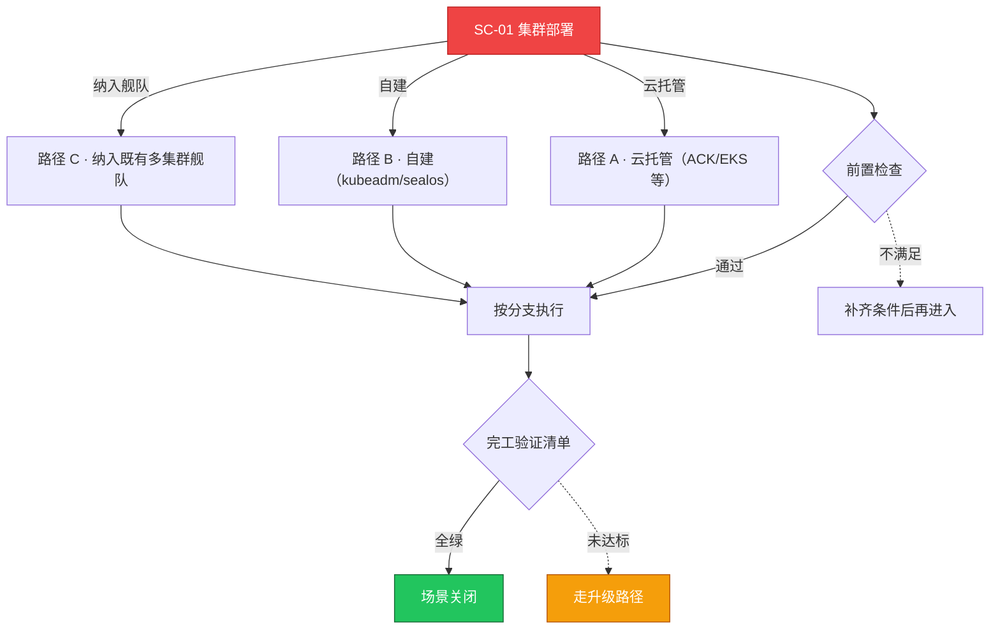

# SC-01 场景剧本: 集群部署

> **ID**: `SC-01` · **分组**: 建设与交付 · **英文**: Cluster Deployment · **更新**: 2026-08-27
> **层次定位**: 工单剧本编排层 —— 回答「什么场景、按什么顺序、调用哪些资源」。
> Domain 讲原理，Skill 给动作，FTA 管推导；本页负责把它们串成可执行的工作流。

## 一、适用场景（何时进入本剧本）

- 新业务上线需要独立集群
- 灾难后集群重建或机房迁移
- 测试/预发环境扩容新集群
- 旧集群退役前的替换建设

## 二、场景概述

覆盖托管云（ACK/EKS）、自建（kubeadm/sealos）与多集群纳管三条建设路径的标准化交付流程，串联网络方案选型、控制面高可用、证书体系与交付验收检查点，产出可直接承载生产的集群。

## 三、前置检查（开工门槛，逐项勾选）

- [ ] 确认部署模式：托管服务 vs 自建 vs 混合（决定后续路径选择）
- [ ] 确认版本策略：目标版本及 n-1 升级兼容窗口
- [ ] 确认网络方案：CNI 选型与云厂商 VPC 路由模型（Terway/Calico/Cilium）
- [ ] 确认容量基线：节点规格、可用区分布、控制面副本数（≥3）
- [ ] 确认周边依赖就绪：镜像仓库、DNS、存储后端、监控接入点 → [[18-云厂商/README.md|云厂商集成要点]]

## 四、快速决策树

## 五、工作流分支

### 路径 A · 云托管（ACK/EKS 等）

> 条件: 云托管

1. 通过 IaC 或控制台创建集群，启用多可用区与受管控制面
2. 按云厂商网络模型配置 CNI，预先评估 ENI/IP 配额上限 → [[13-生产运维/05-工单案例/ticket-case-001-terway-eni-exhaustion.md|Terway ENI 耗尽致 NotReady]]
3. 配置节点池：系统盘/数据盘分离、标签污点规划、自动伸缩策略
4. 对照云厂商故障树做预防性巡检 → [[19-故障诊断/06-FTA故障树/list/cloud-provider-fta.md|FTA · cloud-provider]]

### 路径 B · 自建（kubeadm/sealos）

> 条件: 自建

1. 初始化控制面 HA（堆叠 etcd ≥3 节点），记录 join 命令与 PKI 输出
2. 安装 CNI 与 CoreDNS，验证跨节点 Pod 互通 → [[19-故障诊断/06-FTA故障树/list/cni-fta.md|FTA · cni]]
3. 加入 worker 节点并打标签/污点，锁定 kubelet 版本
4. 排查部署期常见失败：证书、kubelet 启动、镜像预拉取 → [[19-故障诊断/06-FTA故障树/list/kubeadm-fta.md|FTA · kubeadm]]

### 路径 C · 纳入既有多集群舰队

> 条件: 纳入舰队

1. 明确纳管平面（注册中心/下发面），统一凭证与审计入口 → [[13-生产运维/07-运维手册/05-multi-cluster-operations.md|多集群运维手册]]
2. 打通网络边界：VPN/专线/东西向网关，验证跨集群 Service 可达性

## 六、完工验证清单

- [ ] 所有节点 Ready 且无异常事件（kubectl get nodes / events）
- [ ] 核心组件（apiserver/etcd/scheduler/cm）健康且副本数符合预期
- [ ] 示例 Pod 跨节点调度成功，Service/DNS/PV 全链路可用
- [ ] 备份机制已激活（etcd 快照定时任务 + 首份快照异地落盘）
- [ ] 监控采集、告警路由、On-Call 排班均已接入

## 七、常见陷阱（前人踩坑榜）

- ⚠️ 证书有效期使用默认值未延长，一年后爆发性过期
- ⚠️ CNI 与云 VPC 路由冲突导致偶发丢包难复现 → [[13-生产运维/05-工单案例/ticket-case-001-terway-eni-exhaustion.md|案例 · 001-terway-eni-exhaustion]]
- ⚠️ 控制面单副本先上线、HA 计划『以后再补』——然后没有了以后
- ⚠️ 交付只验功能不验容量，上线首周即触发 Eviction

## 八、升级路径

| 触发条件 | 升级动作 |
|---|---|
| 部署阻塞控制面健康问题超过 4 小时 | 升级至平台架构组并冻结其他变更 |
| 涉及云厂商配额/底层限制 | 提云厂商工单并附 FTA 定位证据链 |

## 九、资源编排（跨层素材索引）

### 领域文档（原理与规范）

- [[01-集群基础/README.md|集群基础]]
- [[13-生产运维/00-总览/01-production-readiness-operations-guide.md|生产就绪运营指南]]

### FTA 故障树（根因推导）

- [[19-故障诊断/06-FTA故障树/list/apiserver-fta.md|FTA · apiserver]]
- [[19-故障诊断/06-FTA故障树/list/etcd-fta.md|FTA · etcd]]
- [[19-故障诊断/06-FTA故障树/list/node-fta.md|FTA · node]]

### 操作技能卡（原子动作）

- [[19-故障诊断/08-技能体系/12-control-plane-failure.md|12 · control plane failure]]
- [[19-故障诊断/08-技能体系/06-certificate-expiry.md|06 · certificate expiry]]

## 十、相邻场景

- [[13-生产运维/08-运维场景剧本/upgrade-migration|SC-08 升级迁移]]
- [[13-生产运维/08-运维场景剧本/daily-ops|SC-09 日常巡检]]
- [[13-生产运维/08-运维场景剧本/multi-cluster|SC-17 多集群管理]]

---

*本文档由 `31-脚本/generate-scenarios.py` 于 2026-08-27 自动生成。请修改脚本中的场景数据后重新生成，勿直接编辑本文件。*
