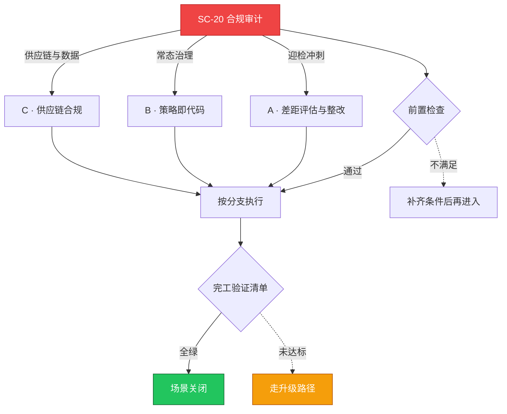

# SC-20 场景剧本: 合规审计

> **ID**: `SC-20` · **分组**: 安全合规 · **英文**: Compliance & Audit · **更新**: 2026-08-27
> **层次定位**: 工单剧本编排层 —— 回答「什么场景、按什么顺序、调用哪些资源」。
> Domain 讲原理，Skill 给动作，FTA 管推导；本页负责把它们串成可执行的工作流。

## 一、适用场景（何时进入本剧本）

- 等保三级/行业监管测评窗口临近
- 客户安全问卷与大厂准入审计
- 监管漏洞通报限期整改

## 二、场景概述

合规是被设计的而不是被应付的：控制条款→技术证据→自动化持续验证的三层映射体系。

## 三、前置检查（开工门槛，逐项勾选）

- [ ] 框架映射表：条款 ↔ CIS ↔ 内部控制项编号 → [[08-安全/README.md|安全域导航]]
- [ ] 证据三库齐备：配置基线库 / 审计日志库 / 流程制度库
- [ ] 与 SC-05 加固基线联合排期 → [[13-生产运维/08-运维场景剧本/security-hardening|SC-05 安全加固]]

## 四、快速决策树

## 五、工作流分支

### A · 差距评估与整改

> 条件: 迎检冲刺

1. 机器扫描 + 人工走查双轨取证 → [[13-生产运维/02-集群治理/05-cluster-governance-lifecycle-compliance.md|集群治理生命周期合规]]
2. 整改台账（责任人/期限/复测方式）每周更新

### B · 策略即代码

> 条件: 常态治理

1. OPA/Kyverno 规则与条款编号双向注释挂钩 → [[13-生产运维/02-集群治理/03-admission-policy-governance.md|准入策略治理]]
2. audit log 保留期与防篡改(WORM)存储 → [[19-故障诊断/08-技能体系/15-configmap-secret-failure.md|15 · configmap secret failure]]

### C · 供应链合规

> 条件: 供应链与数据

1. SBOM 生成与准入签名验证链贯通
2. 数据分级存储位置映射（境内/境外区域约束台账）

## 六、完工验证清单

- [ ] 复测得分达线且高风险项清零
- [ ] 随机抽取 10 条证据可在 5 分钟内机器复现
- [ ] 下一自评周期已录入系统日历防遗忘衰减

## 七、常见陷阱（前人踩坑榜）

- ⚠️ 迎检前临时造材料——换个评测师立刻穿帮
- ⚠️ 只审生产环境漏掉 CI/CD 测试环境的同等义务
- ⚠️ 把『需可查看』误定为『可登录操作』造成过度授权

## 八、升级路径

| 触发条件 | 升级动作 |
|---|---|
| 高危项 7 日无法整改 | 报请风控委员会备案过渡补偿措施 |

## 九、资源编排（跨层素材索引）

### 领域文档（原理与规范）

- [[08-安全/README.md|安全域]]
- [[13-生产运维/02-集群治理/index.md|集群治理索引]]

### FTA 故障树（根因推导）

- [[19-故障诊断/06-FTA故障树/list/webhook-admission-fta.md|FTA · webhook-admission]]
- [[19-故障诊断/06-FTA故障树/list/rbac-fta.md|FTA · rbac]]

### 操作技能卡（原子动作）

- [[19-故障诊断/08-技能体系/19-security-incident-response.md|19 · security incident response]]
- [[19-故障诊断/08-技能体系/10-rbac-quota-failure.md|10 · rbac quota failure]]

## 十、相邻场景

- [[13-生产运维/08-运维场景剧本/security-hardening|SC-05 安全加固]]
- [[13-生产运维/08-运维场景剧本/security-incident|SC-13 安全事件响应]]

---

*本文档由 `31-脚本/generate-scenarios.py` 于 2026-08-27 自动生成。请修改脚本中的场景数据后重新生成，勿直接编辑本文件。*
