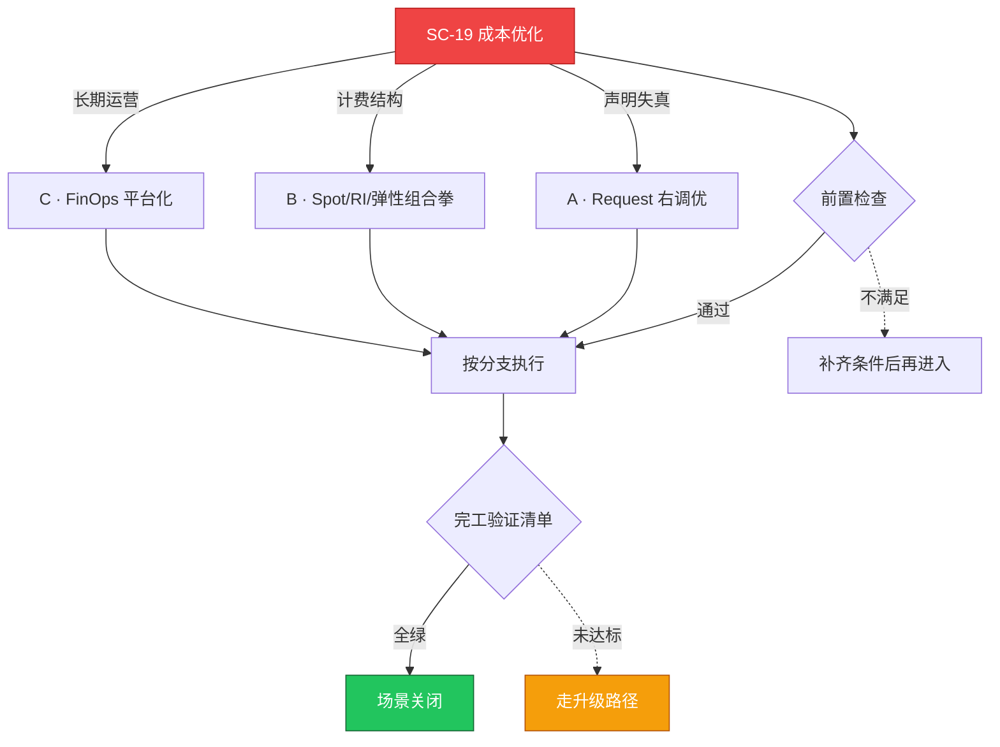

# SC-19 场景剧本: 成本优化

> **ID**: `SC-19` · **分组**: 经营效率 · **英文**: Cost Optimization · **更新**: 2026-08-27
> **层次定位**: 工单剧本编排层 —— 回答「什么场景、按什么顺序、调用哪些资源」。
> Domain 讲原理，Skill 给动作，FTA 管推导；本页负责把它们串成可执行的工作流。

## 一、适用场景（何时进入本剧本）

- 月度账单环比上涨 >15% 或突破预算线
- 利用率体检出炉肥胖清单（CPU 均值 <15% / 内存 <25%）
- 新财年预算编制听证

## 二、场景概述

FinOps 不是砍预算，而是把每一分钱翻译成业务价值语言的可运营循环。原则：降本动作全部可回滚，SLO 对赌兜底。

## 三、前置检查（开工门槛，逐项勾选）

- [ ] 可见性先行：分摊标签覆盖率检查（无标签不入账） → [[13-生产运维/01-成本治理/01-cost-allocation-chargeback.md|成本分摊与退款]]
- [ ] 业务容忍度访谈：可抢占/可定时缩容的白名单
- [ ] 水位基线承接自 SC-14 容量规划 → [[13-生产运维/08-运维场景剧本/capacity-planning|SC-14 容量规划]]

## 四、快速决策树

## 五、工作流分支

### A · Request 右调优

> 条件: 声明失真

1. 基于 VPA recommend 曲线加权生成建议并灰度验证
2. 闲置额度回收进公共池 → [[13-生产运维/01-成本治理/02-idle-resource-right-sizing.md|闲置资源右调]]

### B · Spot/RI/弹性组合拳

> 条件: 计费结构

1. 中断友好型负载迁 Spot 池 + 驱逐兜底方案 → [[13-生产运维/01-成本治理/03-spot-instance-strategy.md|Spot 策略]]、[[19-故障诊断/06-FTA故障树/list/cluster-autoscaler-fta.md|FTA · cluster-autoscaler]]
2. 稳态负载 RI/包年包月配比测算 → [[13-生产运维/01-成本治理/05-kubernetes-cost-governance.md|K8s 成本治理]]

### C · FinOps 平台化

> 条件: 长期运营

1. Kubecost/OpenCost 落地与预算告警接线 → [[13-生产运维/01-成本治理/04-kubecost-finops-automation.md|Kubecost 自动化]]
2. 面向管理层的账单叙事固定节奏 → [[13-生产运维/01-成本治理/06-finops-cost-governance-runbook.md|FinOps 运营 Runbook]]

## 六、完工验证清单

- [ ] 单位成本（每万次调用成本）环比改善可量化
- [ ] 优化动作清单均可一键回滚且原配置已备份
- [ ] SLO 未劣化（与业务方事先对赌）

## 七、常见陷阱（前人踩坑榜）

- ⚠️ 一刀切压缩 requests 制造 OOM——省小钱赔大钱
- ⚠️ Spot 大规模回收无分散策略导致业务团灭
- ⚠️ 清理孤儿存储时误删仍被 StatefulSet 引用的 PV

## 八、升级路径

| 触发条件 | 升级动作 |
|---|---|
| 预估月节省空间 >30% | 成立专项小组并制定季度 OKR |

## 九、资源编排（跨层素材索引）

### 领域文档（原理与规范）

- [[13-生产运维/01-成本治理/07-finops-cost-optimization-guide.md|FinOps 优化指南]]

### FTA 故障树（根因推导）

- [[19-故障诊断/06-FTA故障树/list/cluster-autoscaler-fta.md|FTA · cluster-autoscaler]]

### 操作技能卡（原子动作）

- [[19-故障诊断/08-技能体系/13-autoscaling-failure.md|13 · autoscaling failure]]
- [[19-故障诊断/08-技能体系/18-performance-bottleneck.md|18 · performance bottleneck]]

## 十、相邻场景

- [[13-生产运维/08-运维场景剧本/capacity-planning|SC-14 容量规划]]
- [[13-生产运维/08-运维场景剧本/daily-ops|SC-09 日常巡检]]

---

*本文档由 `31-脚本/generate-scenarios.py` 于 2026-08-27 自动生成。请修改脚本中的场景数据后重新生成，勿直接编辑本文件。*
