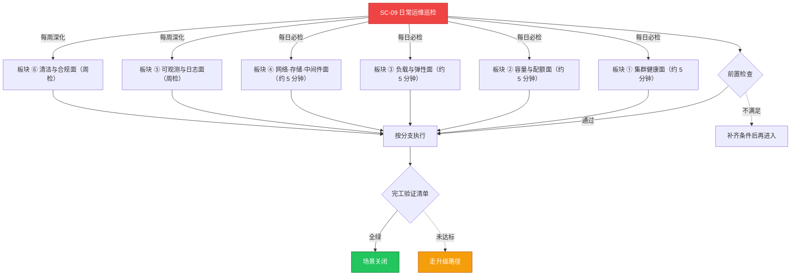

# SC-09 场景剧本: 日常运维巡检

> **ID**: `SC-09` · **分组**: 稳定性保障 · **英文**: Daily Operations · **更新**: 2026-08-27
> **层次定位**: 工单剧本编排层 —— 回答「什么场景、按什么顺序、调用哪些资源」。
> Domain 讲原理，Skill 给动作，FTA 管推导；本页负责把它们串成可执行的工作流。

## 一、适用场景（何时进入本剧本）

- 每日固定巡检窗口（建议晨会前 30 分钟）
- 节假日/大促期间的加强巡检模式
- 重大变更次日增强复查

## 二、场景概述

把『每天随手看看』固化为六个可勾选板块：四个每日必检 + 两个每周深化。全部命令幂等只读，巡检结论落入日检记录形成趋势资产；黄灯项当场建跟踪单，红灯项立即转入 SC-03 总纲。

## 三、前置检查（开工门槛，逐项勾选）

- [ ] 复核昨夜值班交接事项，确认无遗留 P2 以上未闭环项 → [[13-生产运维/03-事件响应/04-on-call-playbook.md|On-Call 手册]]
- [ ] 浏览今日变更计划，标记高风险时段避开深度清理动作 → [[13-生产运维/07-运维手册/02-change-management-guide.md|变更管理指南]]
- [ ] 打开当月巡检记录表准备趋势对照

## 四、快速决策树

## 五、工作流分支

### 板块 ① 集群健康面（约 5 分钟）

> 条件: 每日必检

1. nodes 全 Ready；NotReady/SchedulingDisabled 异常节点即时取证建单
2. kube-system 与自研平台命名空间全部 Running 且无 CrashLoop
3. Warning events 近 12h 波形环比抬升即深挖 → [[19-故障诊断/README.md|故障诊断域入口]]

### 板块 ② 容量与配额面（约 5 分钟）

> 条件: 每日必检

1. 节点 allocatable 使用率三维热点排序（CPU/内存/磁盘）
2. 证书 ≤30 天预警清单出具，续期任务挂起即跟进 → [[19-故障诊断/08-技能体系/06-certificate-expiry.md|06 · certificate expiry]]、[[13-生产运维/05-工单案例/ticket-case-005-kubelet-cert-expired.md|kubelet 证书过期]]
3. namespace 配额命中率超过 85% 的提前介入复盘

### 板块 ③ 负载与弹性面（约 5 分钟）

> 条件: 每日必检

1. 非 Running Pod 清零检查（Pending/ImagePullBackOff 等） → [[19-故障诊断/08-技能体系/03-pod-pending.md|03 · pod pending]]
2. HPA/VPA 指标源健康度与近期伸缩行为合理性回顾
3. autoscaler 本体异常当日必须升级处理 → [[19-故障诊断/06-FTA故障树/list/cluster-autoscaler-fta.md|FTA · cluster-autoscaler]]、[[13-生产运维/05-工单案例/ticket-case-020-cluster-autoscaler-scale-failure.md|CA 扩容失败]]

### 板块 ④ 网络·存储·中间件面（约 5 分钟）

> 条件: 每日必检

1. Endpoints 为空的 Service 清单应为空集 → [[19-故障诊断/08-技能体系/05-service-connectivity.md|05 · service connectivity]]、[[13-生产运维/05-工单案例/ticket-case-019-kubeproxy-service-unreachable.md|proxy 断连]]
2. Pending 超过 1 小时的 PVC 与 CSI 组件心跳核查
3. CoreDNS 尾延迟与解析 QPS 异常波动筛查 → [[19-故障诊断/08-技能体系/04-dns-resolution-failure.md|04 · dns resolution failure]]、[[13-生产运维/05-工单案例/ticket-case-008-coredns-vpc-dns-forward.md|CoreDNS 转发案例]]

### 板块 ⑤ 可观测与日志面（周检）

> 条件: 每周深化

1. Prometheus 存储增长斜率与 TSDB compaction 健康 → [[13-生产运维/05-工单案例/ticket-case-015-prometheus-data-loss-slow-query.md|Prometheus 劣化]]
2. 日志管道丢包率与缓冲区水位 → [[19-故障诊断/08-技能体系/17-logging-pipeline-failure.md|17 · logging pipeline failure]]

### 板块 ⑥ 清洁与合规面（周检）

> 条件: 每周深化

1. completed Job 与 evicted Pod 的保留策略执行情况 → [[13-生产运维/05-工单案例/ticket-case-035-node-diskpressure-eviction.md|磁盘压力驱逐]]
2. 孤儿 ConfigMap/PVC 审计并列回收白名单（双人复核）
3. 巡检摘要按话术模板同步相关方 → [[13-生产运维/06-回复话术/README.md|回复话术库]]

## 六、完工验证清单

- [ ] 六板块检查全部绿灯并签署电子巡检记录
- [ ] 发现的黄灯项均已建立跟踪单（owner + deadline 齐备）
- [ ] 趋势面板本周与前四周形态可比（无数据断点）

## 七、常见陷阱（前人踩坑榜）

- ⚠️ 巡检变成刷新页面：发现红灯但不产出工单等于没巡
- ⚠️ 只看均值不看尾部——P99 劣化总是先于阈值告警出现
- ⚠️ 清理动作安排在业务高峰执行，误伤热点数据

## 八、升级路径

| 触发条件 | 升级动作 |
|---|---|
| 巡检中发现 P0 征兆 | 当场转入 SC-03 总纲并移交 On-Call 接管 |
| 连续两天同类黄灯 | 立项专项分析并纳入周会汇报 |

## 九、资源编排（跨层素材索引）

### 领域文档（原理与规范）

- [[13-生产运维/07-运维手册/01-production-sre-daily-ops.md|生产 SRE 日常运维手册]]
- [[13-生产运维/07-运维手册/10-node-and-runtime-ops.md|节点与运行时运营]]
- [[13-生产运维/05-工单案例/ticket-routing-rules.md|工单路由规则]]

### FTA 故障树（根因推导）

- [[19-故障诊断/06-FTA故障树/list/node-fta.md|FTA · node]]
- [[19-故障诊断/06-FTA故障树/list/monitoring-fta.md|FTA · monitoring]]

### 操作技能卡（原子动作）

- [[19-故障诊断/08-技能体系/03-pod-pending.md|03 · pod pending]]
- [[19-故障诊断/08-技能体系/04-dns-resolution-failure.md|04 · dns resolution failure]]
- [[19-故障诊断/08-技能体系/06-certificate-expiry.md|06 · certificate expiry]]

## 十、相邻场景

- [[13-生产运维/08-运维场景剧本/capacity-planning|SC-14 容量规划]]
- [[13-生产运维/08-运维场景剧本/monitoring-alerting|SC-06 监控告警]]
- [[13-生产运维/08-运维场景剧本/cost-optimization|SC-19 成本优化]]

---

*本文档由 `31-脚本/generate-scenarios.py` 于 2026-08-27 自动生成。请修改脚本中的场景数据后重新生成，勿直接编辑本文件。*
