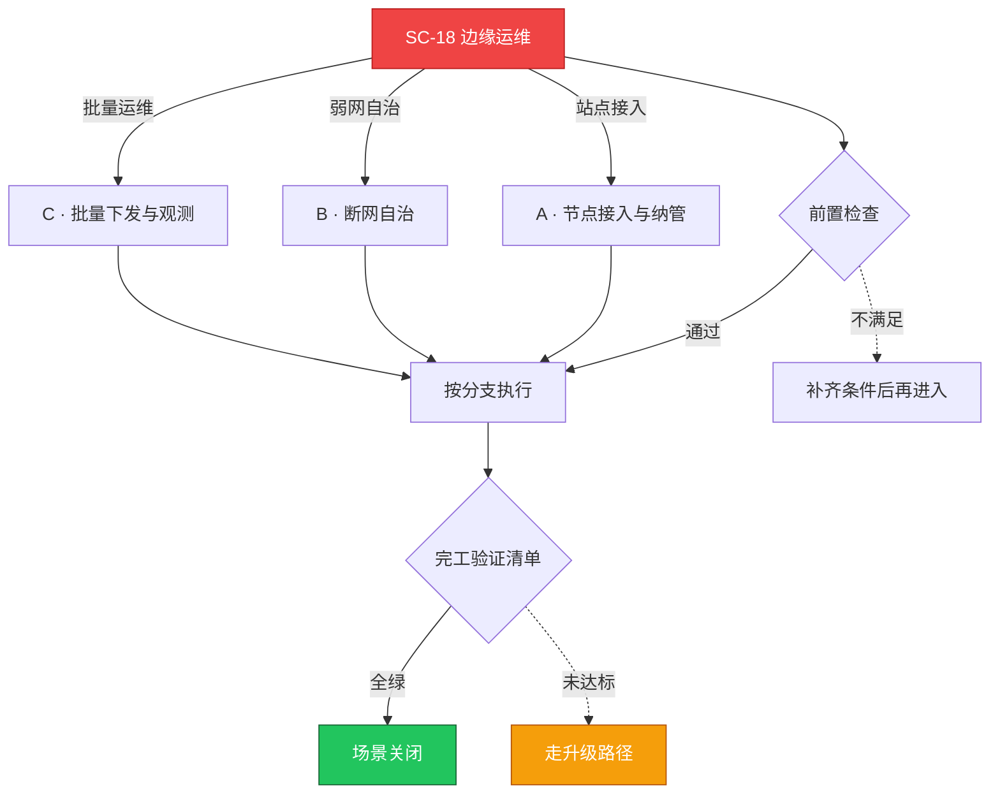

# SC-18 场景剧本: 边缘运维

> **ID**: `SC-18` · **分组**: 建设与交付 · **英文**: Edge Computing Operations · **更新**: 2026-08-27
> **层次定位**: 工单剧本编排层 —— 回答「什么场景、按什么顺序、调用哪些资源」。
> Domain 讲原理，Skill 给动作，FTA 管推导；本页负责把它们串成可执行的工作流。

## 一、适用场景（何时进入本剧本）

- 新边缘站点接入 / 规模化批量下发
- 弱网或断网投诉伴随本地业务中断
- 边缘节点离线率超标

## 二、场景概述

边界的设计信仰是自治：云端大脑可以断联，边缘小脑必须能独立撑住本地业务。

## 三、前置检查（开工门槛，逐项勾选）

- [ ] 云边隧道模式确认（WebSocket tunnel / mTLS 元数据通道）
- [ ] 参考专项技术域的边缘实践沉淀 → [[16-专项技术/README.md|专项技术域]]
- [ ] 边缘硬件档案：架构(ARM/x86)、内存上限、磁盘寿命

## 四、快速决策树

## 五、工作流分支

### A · 节点接入与纳管

> 条件: 站点接入

1. 证书/cgroup/runtime 依赖一次性装配包化
2. 离线安装失败时的镜像与仓库排查套路 → [[19-故障诊断/08-技能体系/11-image-pull-failure.md|11 · image pull failure]]

### B · 断网自治

> 条件: 弱网自治

1. metaServer 本地缓存名单与应用白名单精细化
2. 自治期间本地卷状态收集与回传补齐机制 → [[19-故障诊断/06-FTA故障树/list/csi-fta.md|FTA · csi]]

### C · 批量下发与观测

> 条件: 批量运维

1. 站点分组灰度下发（升级波次表管控）
2. 轻量日志/监控代理的瘦身策略 → [[19-故障诊断/06-FTA故障树/list/monitoring-fta.md|FTA · monitoring]]

## 六、完工验证清单

- [ ] 拔纤演练：本地业务自治降级运行 8 小时无硬损
- [ ] 回连后状态 reconciliation 一致性核对通过
- [ ] 单站点故障不传染（信噪与队列隔离验证）

## 七、常见陷阱（前人踩坑榜）

- ⚠️ 照搬中心集群的重型 DaemonSet——小机型跑不动
- ⚠️ 云端控制器假定了 always-online 的交互逻辑
- ⚠️ 忽视 NTP 导致证书校验与日志时序全面混乱

## 八、升级路径

| 触发条件 | 升级动作 |
|---|---|
| 站点硬件级更换 | 启动现场物流 SOP 并提供远程装配支援 |

## 九、资源编排（跨层素材索引）

### 领域文档（原理与规范）

- [[16-专项技术/README.md|专项技术域]]
- [[14-容器运行时/README.md|容器运行时域]]

### FTA 故障树（根因推导）

- [[19-故障诊断/06-FTA故障树/list/kubelet-fta.md|FTA · kubelet]]
- [[19-故障诊断/06-FTA故障树/list/cloud-provider-fta.md|FTA · cloud-provider]]

### 操作技能卡（原子动作）

- [[19-故障诊断/08-技能体系/01-node-notready.md|01 · node notready]]
- [[19-故障诊断/08-技能体系/20-node-resource-pressure.md|20 · node resource pressure]]

## 十、相邻场景

- [[13-生产运维/08-运维场景剧本/multi-cluster|SC-17 多集群管理]]
- [[13-生产运维/08-运维场景剧本/daily-ops|SC-09 日常巡检]]

---

*本文档由 `31-脚本/generate-scenarios.py` 于 2026-08-27 自动生成。请修改脚本中的场景数据后重新生成，勿直接编辑本文件。*
