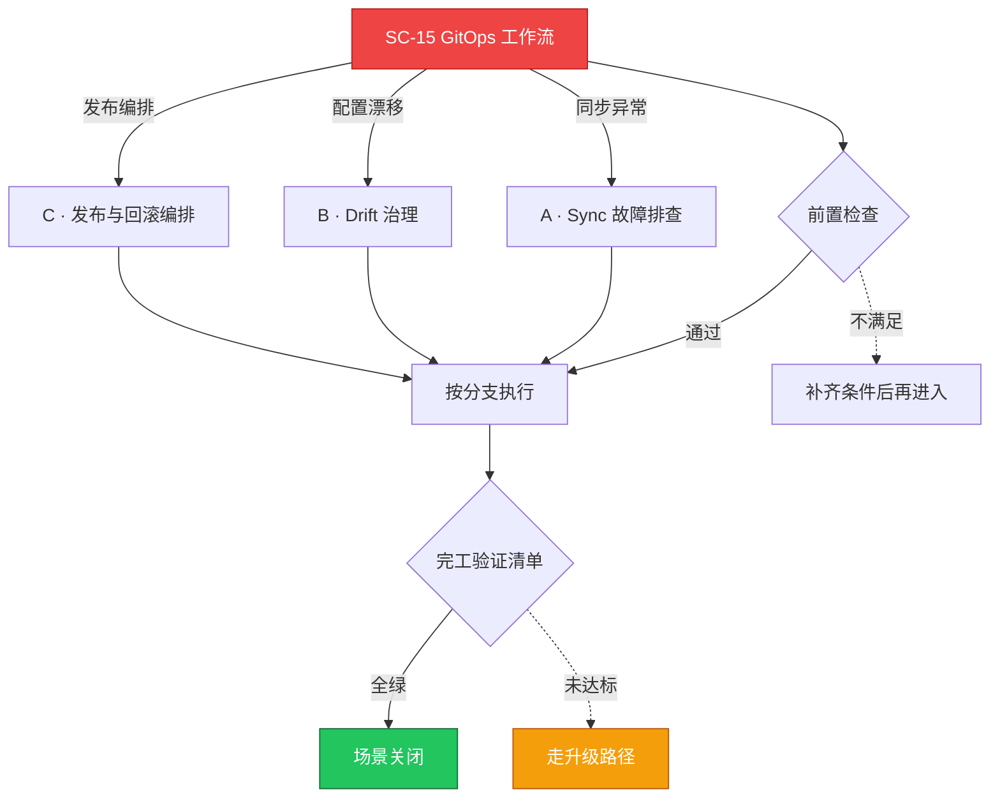

# SC-15 场景剧本: GitOps 工作流

> **ID**: `SC-15` · **分组**: 建设与交付 · **英文**: GitOps Workflow · **更新**: 2026-08-27
> **层次定位**: 工单剧本编排层 —— 回答「什么场景、按什么顺序、调用哪些资源」。
> Domain 讲原理，Skill 给动作，FTA 管推导；本页负责把它们串成可执行的工作流。

## 一、适用场景（何时进入本剧本）

- 新 GitOps 体系初建或多集群推广
- Application 长期 OutOfSync/Progressing
- 漂移告警：人工 kubectl 改动未经提交

## 二、场景概述

Git 即真理：仓库目录规范是第一公民，同步/漂移/回滚全部由提交驱动，集群侧禁止手改。

## 三、前置检查（开工门槛，逐项勾选）

- [ ] 仓库布局评审通过（app-of-apps / 环境 overlay 分层）
- [ ] CI 流水线与人工写入权限分离（一切变更 PR 化）
- [ ] 敏感配置方案先行（SealedSecrets/ESO），禁止明文入库

## 四、快速决策树

## 五、工作流分支

### A · Sync 故障排查

> 条件: 同步异常

1. Progressing 卡死三分叉：webhook 不可达/hook 失败/history 上限 → [[19-故障诊断/06-FTA故障树/list/gitops-argocd-fta.md|FTA · gitops-argocd]]、[[11-发布变更/README.md|发布变更域]]

### B · Drift 治理

> 条件: 配置漂移

1. autosync 策略分级：prod 手动+评审，dev 自动
2. diff masking 屏蔽噪音字段（status 类字段）降噪

### C · 发布与回滚编排

> 条件: 发布编排

1. 与 SC-02 共用发布验证门禁 → [[13-生产运维/08-运维场景剧本/app-deployment|SC-02 应用发布]]
2. rollback = git revert，彻底杜绝手改集群

## 六、完工验证清单

- [ ] 漂移告警 MTTA <10 分钟且条条有 owner
- [ ] AppProject 权限最小化审计通过
- [ ] 灾备演练：空集群从 repo 重建 <2 小时

## 七、常见陷阱（前人踩坑榜）

- ⚠️ CI 直接 kubectl apply 绕过 GitOps 制造永久漂移
- ⚠️ helm values 巨型 YAML 无人敢改，diff 失控
- ⚠️ 拿 sync window 当变更管控反而延误事故止血

## 八、升级路径

| 触发条件 | 升级动作 |
|---|---|
| GitOps 系统自身不可用 | 启用只读逃生账号 + 事故特批写入流程 |

## 九、资源编排（跨层素材索引）

### 领域文档（原理与规范）

- [[11-发布变更/README.md|发布变更域]]
- [[10-平台工程/README.md|平台工程域]]

### FTA 故障树（根因推导）

- [[19-故障诊断/06-FTA故障树/list/gitops-argocd-fta.md|FTA · gitops-argocd]]

### 操作技能卡（原子动作）

- [[19-故障诊断/08-技能体系/09-deployment-rollout-failure.md|09 · deployment rollout failure]]
- [[19-故障诊断/08-技能体系/28-helm-chart-failure.md|28 · helm chart failure]]

## 十、相邻场景

- [[13-生产运维/08-运维场景剧本/app-deployment|SC-02 应用发布]]
- [[13-生产运维/08-运维场景剧本/upgrade-migration|SC-08 升级迁移]]

---

*本文档由 `31-脚本/generate-scenarios.py` 于 2026-08-27 自动生成。请修改脚本中的场景数据后重新生成，勿直接编辑本文件。*
