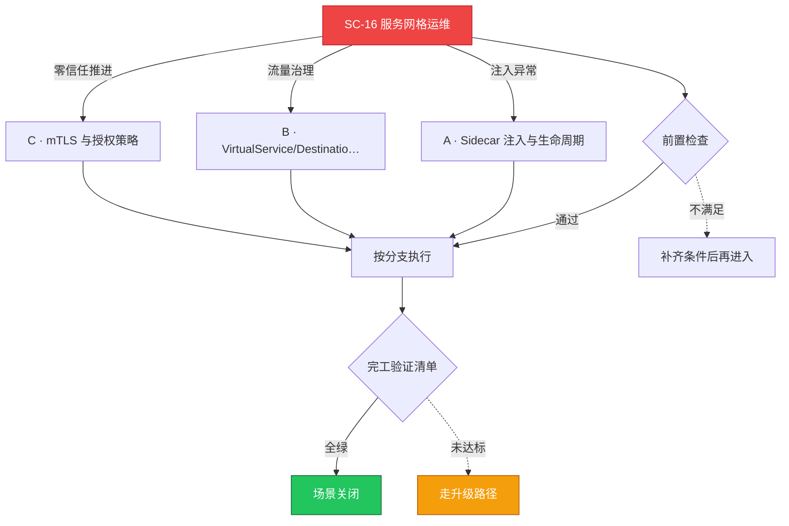

# SC-16 场景剧本: 服务网格运维

> **ID**: `SC-16` · **分组**: 建设与交付 · **英文**: Service Mesh Operations · **更新**: 2026-08-27
> **层次定位**: 工单剧本编排层 —— 回答「什么场景、按什么顺序、调用哪些资源」。
> Domain 讲原理，Skill 给动作，FTA 管推导；本页负责把它们串成可执行的工作流。

## 一、适用场景（何时进入本剧本）

- namespace 打标后 Pod 未注入 sidecar
- mTLS STRICT 切换后互访 503/UH
- Envoy 配置下发异常或 sidecar CPU 飙升

## 二、场景概述

网格是把双刃剑：本剧本守住 sidecar 一致性、mTLS 灰度节奏、遥测开销三条防线。

## 三、前置检查（开工门槛，逐项勾选）

- [ ] istiod 健康/注入 webhook 就绪/revision 策略确认 → [[19-故障诊断/06-FTA故障树/list/service-mesh-istio-fta.md|FTA · service-mesh-istio]]
- [ ] 画出 PeerAuthentication 当前作用域（mesh/ns/port）

## 四、快速决策树

## 五、工作流分支

### A · Sidecar 注入与生命周期

> 条件: 注入异常

1. label 注入策略后需 recreate 才生效的要点进模板
2. init 容器 iptables 写入失败排查样板 → [[19-故障诊断/06-FTA故障树/list/pod-fta.md|FTA · pod]]

### B · VirtualService/DestinationRule

> 条件: 流量治理

1. subset 与一致性哈希依赖的全局局部性检查 → [[19-故障诊断/06-FTA故障树/list/gateway-api-fta.md|FTA · gateway-api]]
2. golden signals 按 service 级大盘建立

### C · mTLS 与授权策略

> 条件: 零信任推进

1. PERMISSIVE 观察 7 天再切 STRICT 的节奏铁律
2. AuthorizationPolicy 拒绝原因采样进 access log 辅助排障

## 六、完工验证清单

- [ ] 网格内工作负载注入覆盖率 100% 无裸奔
- [ ] mTLS 切换前后 RPC 成功率差值 <0.1%
- [ ] sidecar CPU/内存开销画像不超过申报阈值

## 七、常见陷阱（前人踩坑榜）

- ⚠️ outlierDetection 阈值配错把健康 Pod 全部 ejected
- ⚠️ 根证书轮转期间集中 restart 未分批造成雪崩
- ⚠️ 全网格 trace 采样 100% 把 Envoy 内存打爆

## 八、升级路径

| 触发条件 | 升级动作 |
|---|---|
| 南北向网关全局故障 | 先行执行绕过 mesh 的直连逃生预案 |

## 九、资源编排（跨层素材索引）

### 领域文档（原理与规范）

- [[05-网络/README.md|网络域]]

### FTA 故障树（根因推导）

- [[19-故障诊断/06-FTA故障树/list/service-mesh-istio-fta.md|FTA · service-mesh-istio]]
- [[19-故障诊断/06-FTA故障树/list/gateway-api-fta.md|FTA · gateway-api]]
- [[19-故障诊断/06-FTA故障树/list/higress-fta.md|FTA · higress]]

### 操作技能卡（原子动作）

- [[19-故障诊断/08-技能体系/05-service-connectivity.md|05 · service connectivity]]
- [[19-故障诊断/08-技能体系/14-ingress-gateway-failure.md|14 · ingress gateway failure]]

## 十、相邻场景

- [[13-生产运维/08-运维场景剧本/network-diagnosis|SC-11 网络诊断]]
- [[13-生产运维/08-运维场景剧本/app-deployment|SC-02 应用发布]]

---

*本文档由 `31-脚本/generate-scenarios.py` 于 2026-08-27 自动生成。请修改脚本中的场景数据后重新生成，勿直接编辑本文件。*
