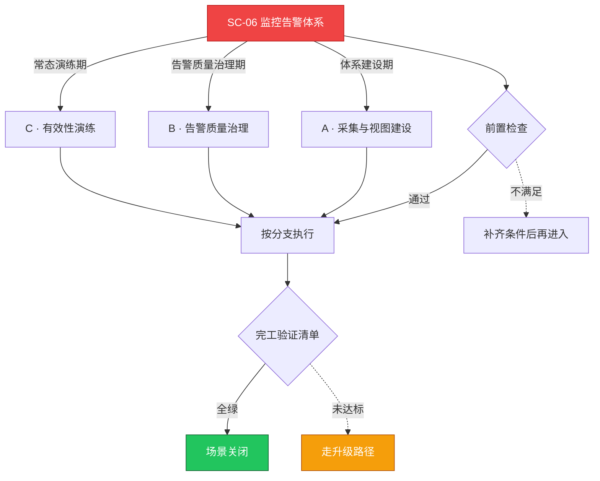

# SC-06 场景剧本: 监控告警体系

> **ID**: `SC-06` · **分组**: 稳定性保障 · **英文**: Monitoring & Alerting · **更新**: 2026-08-27
> **层次定位**: 工单剧本编排层 —— 回答「什么场景、按什么顺序、调用哪些资源」。
> Domain 讲原理，Skill 给动作，FTA 管推导；本页负责把它们串成可执行的工作流。

## 一、适用场景（何时进入本剧本）

- 新业务/新集群接入监控
- 无效告警占比超标（>30%）或爆发告警风暴
- SLO 周期评审发现覆盖盲区

## 二、场景概述

先保『看得见』再治『看得清』：四级指标金字塔（infra→middleware→app→biz）＋三级告警分级＋例行有效性演练。

## 三、前置检查（开工门槛，逐项勾选）

- [ ] 盘点监控对象：绘制 infra→middleware→app→biz 四级资源层级图
- [ ] 对齐既有可观测运营基线（采集/存储/查询三层健康度） → [[13-生产运维/07-运维手册/09-observability-operations.md|可观测性运营手册]]
- [ ] 评估告警消费能力：值班者每小时可处理条数上限

## 四、快速决策树

## 五、工作流分支

### A · 采集与视图建设

> 条件: 体系建设期

1. 黑盒+白盒双轨接入，exporter 清单化管理 → [[19-故障诊断/06-FTA故障树/list/monitoring-fta.md|FTA · monitoring]]
2. 核心大盘满足一屏定级：RED（业务）+ USE（资源）双视角

### B · 告警质量治理

> 条件: 告警质量治理期

1. 每条规则回答四问：谁看/何时看/做什么动作/多久必须看
2. 监控自身数据面故障要有自愈与降级方案 → [[19-故障诊断/08-技能体系/16-monitoring-alerting-failure.md|16 · monitoring alerting failure]]、[[13-生产运维/05-工单案例/ticket-case-015-prometheus-data-loss-slow-query.md|Prometheus 数据丢失]]
3. 抑制规则成对维护：主告警自动抑制其衍生告警

### C · 有效性演练

> 条件: 常态演练期

1. 季度注入式故障演练验证告警触达与文案可操作性
2. SLO 多窗口燃烧率规则的召回/误报复盘

## 六、完工验证清单

- [ ] 关键链路覆盖率 100%（每条告警可映射到组件矩阵）
- [ ] 端到端触达实测 <2 分钟，夜间无效告警为零
- [ ] 大盘-告警-Runbook 三者链接闭合可互跳

## 七、常见陷阱（前人踩坑榜）

- ⚠️ 阈值拍脑袋设置，低于容量红线才预警毫无意义
- ⚠️ 只有全局大盘，没有按业务 Owner 的视图归属
- ⚠️ 静默全靠手工，缺少与变更窗口联动的自动静默

## 八、升级路径

| 触发条件 | 升级动作 |
|---|---|
| 监控平台自身故障期间 | 启用降级采集通道并将人工巡检频次翻倍 |

## 九、资源编排（跨层素材索引）

### 领域文档（原理与规范）

- [[09-可观测性/README.md|可观测性域]]
- [[13-生产运维/07-运维手册/06-sla-slo-definition-templates.md|SLA/SLO 模板]]

### FTA 故障树（根因推导）

- [[19-故障诊断/06-FTA故障树/list/monitoring-fta.md|FTA · monitoring]]

### 操作技能卡（原子动作）

- [[19-故障诊断/08-技能体系/16-monitoring-alerting-failure.md|16 · monitoring alerting failure]]
- [[19-故障诊断/08-技能体系/17-logging-pipeline-failure.md|17 · logging pipeline failure]]

## 十、相邻场景

- [[13-生产运维/08-运维场景剧本/daily-ops|SC-09 日常巡检]]
- [[13-生产运维/08-运维场景剧本/troubleshooting|SC-03 故障排查总纲]]

---

*本文档由 `31-脚本/generate-scenarios.py` 于 2026-08-27 自动生成。请修改脚本中的场景数据后重新生成，勿直接编辑本文件。*
