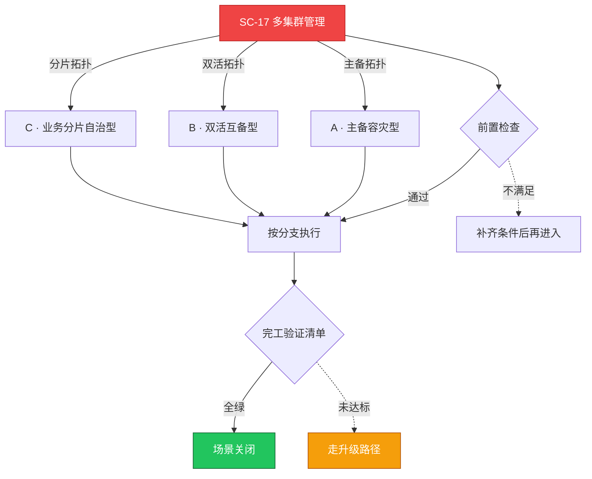

# SC-17 场景剧本: 多集群管理

> **ID**: `SC-17` · **分组**: 可靠性韧性 · **英文**: Multi-Cluster Management · **更新**: 2026-08-27
> **层次定位**: 工单剧本编排层 —— 回答「什么场景、按什么顺序、调用哪些资源」。
> Domain 讲原理，Skill 给动作，FTA 管推导；本页负责把它们串成可执行的工作流。

## 一、适用场景（何时进入本剧本）

- 新集群并入舰队 / 旧集群退出
- 跨集群调用延迟或流量环路
- 年度容灾切换演练窗口

## 二、场景概述

多集群的本质是治理半径扩大：统一的身份体系、统一的下发面、且故障切换必须可演练。

## 三、前置检查（开工门槛，逐项勾选）

- [ ] 舰队清单与健康画像仪表先行 → [[13-生产运维/07-运维手册/05-multi-cluster-operations.md|多集群运维手册]]
- [ ] 身份联邦（OIDC/token 链）与网络边界（专线/peering）确认

## 四、快速决策树

## 五、工作流分支

### A · 主备容灾型

> 条件: 主备拓扑

1. 以备份恢复驱动的接管流程为主轴（重点盯 RTO） → [[13-生产运维/08-运维场景剧本/backup-restore|SC-07 备份恢复]]
2. 核心 DNS/GSLB 切换 runbook 每季一演

### B · 双活互备型

> 条件: 双活拓扑

1. 跨集群 service export/import 的治理规范 → [[19-故障诊断/06-FTA故障树/list/cloud-provider-fta.md|FTA · cloud-provider]]
2. split-brain 阈值与第三方仲裁探针定义

### C · 业务分片自治型

> 条件: 分片拓扑

1. 命名空间→集群的路由表版本化管理
2. 分片再平衡的操作预演脚本化

## 六、完工验证清单

- [ ] 接管演练 RTO/RPO 实测值达标并留档
- [ ] 配置偏差扫描（policy-as-code diff）报告零高危
- [ ] 出口逃生：任一集群可单独摘除而不影响舰队

## 七、常见陷阱（前人踩坑榜）

- ⚠️ 靠复制粘贴部署而非中心化下发——配置漂移无处不在
- ⚠️ 缺乏跨集群链路追踪，排障只见一半调用链
- ⚠️ 专线欠费悄悄断开两个月无人知晓

## 八、升级路径

| 触发条件 | 升级动作 |
|---|---|
| 舰队级控制面瘫痪 | 启用应急预案二把手 + 云厂商 TAM 绿色通道 |

## 九、资源编排（跨层素材索引）

### 领域文档（原理与规范）

- [[13-生产运维/07-运维手册/05-multi-cluster-operations.md|多集群运维手册]]

### FTA 故障树（根因推导）

- [[19-故障诊断/06-FTA故障树/list/cloud-provider-fta.md|FTA · cloud-provider]]
- [[19-故障诊断/06-FTA故障树/list/cluster-autoscaler-fta.md|FTA · cluster-autoscaler]]

### 操作技能卡（原子动作）

- [[19-故障诊断/08-技能体系/26-namespace-quota-limitrange.md|26 · namespace quota limitrange]]

## 十、相邻场景

- [[13-生产运维/08-运维场景剧本/backup-restore|SC-07 备份恢复]]
- [[13-生产运维/08-运维场景剧本/edge-ops|SC-18 边缘运维]]

---

*本文档由 `31-脚本/generate-scenarios.py` 于 2026-08-27 自动生成。请修改脚本中的场景数据后重新生成，勿直接编辑本文件。*
