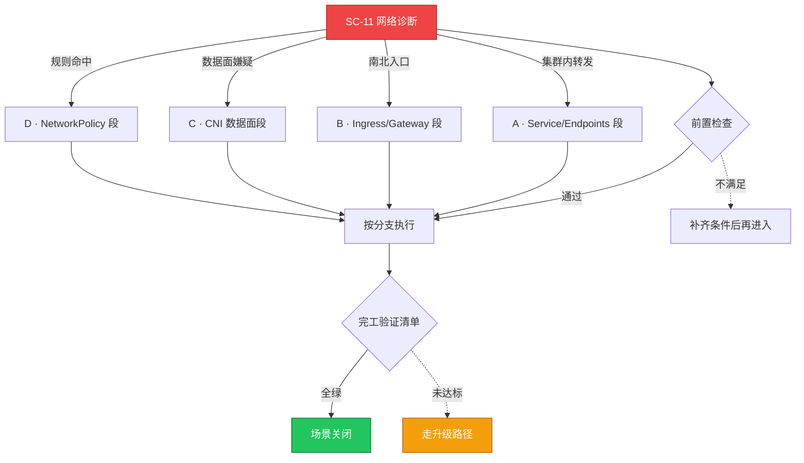

# SC-11 场景剧本: 网络诊断

> **ID**: `SC-11` · **分组**: 稳定性保障 · **英文**: Network Diagnosis · **更新**: 2026-08-27
> **层次定位**: 工单剧本编排层 —— 回答「什么场景、按什么顺序、调用哪些资源」。
> Domain 讲原理，Skill 给动作，FTA 管推导；本页负责把它们串成可执行的工作流。

## 一、适用场景（何时进入本剧本）

- 东西向不通：Pod↔Pod / Pod↔Service 异常
- 南北向异常：LB/Ingress 入口 502、404、超时
- 外联异常：egress 白名单阻断、SNAT 端口耗尽

## 二、场景概述

二分法哲学：每一跳只回答通或不通，五跳之内问题必现形。全程坚持 tcpdump/conntrack 双证留痕。

## 三、前置检查（开工门槛，逐项勾选）

- [ ] 第一跳固定先测 DNS（nslookup / 直查 CoreDNS） → [[19-故障诊断/08-技能体系/04-dns-resolution-failure.md|04 · dns resolution failure]]
- [ ] 抓取问题时间窗内的 NetworkPolicy 与配置变更 diff
- [ ] 确定两端采样点（客户端 Pod 与服务端 Pod 同令牌请求）

## 四、快速决策树

## 五、工作流分支

### A · Service/Endpoints 段

> 条件: 集群内转发

1. selector 匹配与 readiness 状态核对 → [[19-故障诊断/08-技能体系/05-service-connectivity.md|05 · service connectivity]]
2. 代理转发面深入排查 → [[19-故障诊断/06-FTA故障树/list/kube-proxy-fta.md|FTA · kube-proxy]]、[[19-故障诊断/06-FTA故障树/list/service-fta.md|FTA · service]]

### B · Ingress/Gateway 段

> 条件: 南北入口

1. controller 自身健康与重载失败优先排查 → [[19-故障诊断/08-技能体系/14-ingress-gateway-failure.md|14 · ingress gateway failure]]、[[13-生产运维/05-工单案例/ticket-case-011-ingress-controller-pod-404-502.md|Ingress 404/502]]
2. LB 配置类故障样本对照 → [[13-生产运维/05-工单案例/ticket-case-003-slb-backend-group-misconfig.md|SLB 后端组]]、[[19-故障诊断/06-FTA故障树/list/nginx-ingress-fta.md|FTA · nginx-ingress]]

### C · CNI 数据面段

> 条件: 数据面嫌疑

1. VPC 路由与 ENI 类疑难集中营 → [[19-故障诊断/06-FTA故障树/list/terway-fta.md|FTA · terway]]、[[13-生产运维/05-工单案例/ticket-case-001-terway-eni-exhaustion.md|Terway ENI 耗尽]]
2. 跨发行版症状比对 → [[19-故障诊断/06-FTA故障树/list/calico-fta.md|FTA · calico]]、[[19-故障诊断/06-FTA故障树/list/cilium-fta.md|FTA · cilium]]

### D · NetworkPolicy 段

> 条件: 规则命中

1. 以 implicit deny 视角自审放行链 → [[19-故障诊断/08-技能体系/22-networkpolicy-connectivity.md|22 · networkpolicy connectivity]]、[[13-生产运维/05-工单案例/ticket-case-010-networkpolicy-blocks-traffic.md|Policy 断流]]、[[19-故障诊断/06-FTA故障树/list/networkpolicy-fta.md|FTA · networkpolicy]]

## 六、完工验证清单

- [ ] 原始故障路径复测 100% 连通并留存抓包证据
- [ ] 相邻业务冒烟通过：证明修复无旁路损伤
- [ ] 若根因为配额/容量，新增对应红线监控

## 七、常见陷阱（前人踩坑榜）

- ⚠️ ndots:5 造成搜索域爆炸，误判为上游 DNS 故障
- ⚠️ keepalive 长连接绕过了刚刚更新的 Endpoints
- ⚠️ 只测 TCP 握手不验应用层语义——通了但不是你要的服务

## 八、升级路径

| 触发条件 | 升级动作 |
|---|---|
| 触及 VPC/SLB 底层行为存疑 | 提云厂商工单并附双向抓包证据 |

## 九、资源编排（跨层素材索引）

### 领域文档（原理与规范）

- [[05-网络/README.md|网络域]]

### FTA 故障树（根因推导）

- [[19-故障诊断/06-FTA故障树/list/dns-fta.md|FTA · dns]]
- [[19-故障诊断/06-FTA故障树/list/cni-fta.md|FTA · cni]]
- [[19-故障诊断/06-FTA故障树/list/kube-proxy-fta.md|FTA · kube-proxy]]
- [[19-故障诊断/06-FTA故障树/list/ingress-fta.md|FTA · ingress]]

### 操作技能卡（原子动作）

- [[19-故障诊断/08-技能体系/04-dns-resolution-failure.md|04 · dns resolution failure]]
- [[19-故障诊断/08-技能体系/05-service-connectivity.md|05 · service connectivity]]
- [[19-故障诊断/08-技能体系/14-ingress-gateway-failure.md|14 · ingress gateway failure]]

## 十、相邻场景

- [[13-生产运维/08-运维场景剧本/troubleshooting|SC-03 故障排查总纲]]
- [[13-生产运维/08-运维场景剧本/mesh-ops|SC-16 服务网格运维]]

---

*本文档由 `31-脚本/generate-scenarios.py` 于 2026-08-27 自动生成。请修改脚本中的场景数据后重新生成，勿直接编辑本文件。*
