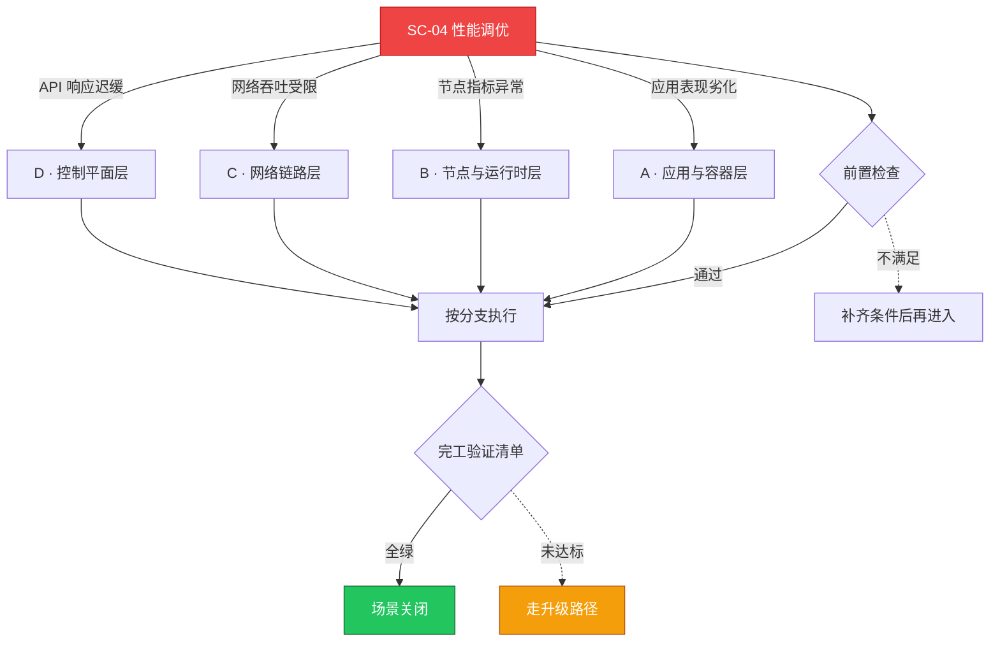

# SC-04 场景剧本: 性能调优

> **ID**: `SC-04` · **分组**: 稳定性保障 · **英文**: Performance Tuning · **更新**: 2026-08-27
> **层次定位**: 工单剧本编排层 —— 回答「什么场景、按什么顺序、调用哪些资源」。
> Domain 讲原理，Skill 给动作，FTA 管推导；本页负责把它们串成可执行的工作流。

## 一、适用场景（何时进入本剧本）

- 接口延迟突增 / 吞吐下滑逼近 SLO 缓冲带
- 节点 CPU/内存/磁盘水位持续高于 80%
- 调度延迟变大、Pod 启动时长上升

## 二、场景概述

自上而下四层漏斗定位瓶颈，强调『先测量、再调整、可回退』的调参纪律，防止资源堆砌掩盖真因。

## 三、前置检查（开工门槛，逐项勾选）

- [ ] 固定基线：与上周同期对比而非绝对值
- [ ] 排除外部因素：下游依赖、流量结构变化、大促日程
- [ ] 锁定观测窗口与采样精度（警惕均值掩盖长尾毛刺）

## 四、快速决策树

## 五、工作流分支

### A · 应用与容器层

> 条件: 应用表现劣化

1. profiling 对火焰图，重点看锁竞争与 GC 占比 → [[13-生产运维/05-工单案例/ticket-case-002-java-oom-essd-iohang.md|Java OOM + IO Hang]]
2. requests/limits 与实际峰值匹配度复盘，纠正失真声明

### B · 节点与运行时层

> 条件: 节点指标异常

1. 磁盘压力是隐形杀手：iostat/dmesg 双确认 → [[19-故障诊断/08-技能体系/20-node-resource-pressure.md|20 · node resource pressure]]、[[13-生产运维/05-工单案例/ticket-case-014-node-disk-pressure.md|节点磁盘压力]]
2. runtime 层日志与镜像占盘治理 → [[19-故障诊断/06-FTA故障树/list/containerd-fta.md|FTA · containerd]]

### C · 网络链路层

> 条件: 网络吞吐受限

1. conntrack 表饱和与 SNAT 端口耗尽检查 → [[19-故障诊断/06-FTA故障树/list/kube-proxy-fta.md|FTA · kube-proxy]]
2. CNI 数据面实现差异确认（eBPF vs iptables） → [[19-故障诊断/06-FTA故障树/list/cilium-fta.md|FTA · cilium]]

### D · 控制平面层

> 条件: API 响应迟缓

1. apiserver QPS/延迟与 etcd fsync 时延画像 → [[19-故障诊断/06-FTA故障树/list/apiserver-fta.md|FTA · apiserver]]、[[19-故障诊断/06-FTA故障树/list/etcd-fta.md|FTA · etcd]]
2. 弹性组件失灵也会伪装成性能问题 → [[19-故障诊断/08-技能体系/13-autoscaling-failure.md|13 · autoscaling failure]]、[[19-故障诊断/06-FTA故障树/list/hpa-fta.md|FTA · hpa]]

## 六、完工验证清单

- [ ] 目标指标改善达到预期且无新瓶颈转移（瓶颈不会消失只会搬家）
- [ ] 所有参数变更记录于变更单并可一键回退
- [ ] 压测复演一轮确认稳定性

## 七、常见陷阱（前人踩坑榜）

- ⚠️ 盲目上调 requests 反而压缩可调度容量引发 Pending
- ⚠️ 只盯 CPU 忽略 IO/网络等待占比
- ⚠️ 同一时段叠加多项变更导致无法归因

## 八、升级路径

| 触发条件 | 升级动作 |
|---|---|
| 调优涉及内核参数或发行版配置 | 交由系统组评审窗口统一执行 |

## 九、资源编排（跨层素材索引）

### 领域文档（原理与规范）

- [[13-生产运维/07-运维手册/09-observability-operations.md|可观测性运营]]
- [[17-系统基础/README.md|系统基础(Linux)]]

### FTA 故障树（根因推导）

- [[19-故障诊断/06-FTA故障树/list/hpa-fta.md|FTA · hpa]]
- [[19-故障诊断/06-FTA故障树/list/vpa-fta.md|FTA · vpa]]
- [[19-故障诊断/06-FTA故障树/list/node-fta.md|FTA · node]]

### 操作技能卡（原子动作）

- [[19-故障诊断/08-技能体系/18-performance-bottleneck.md|18 · performance bottleneck]]
- [[19-故障诊断/08-技能体系/13-autoscaling-failure.md|13 · autoscaling failure]]
- [[19-故障诊断/08-技能体系/20-node-resource-pressure.md|20 · node resource pressure]]

## 十、相邻场景

- [[13-生产运维/08-运维场景剧本/capacity-planning|SC-14 容量规划]]
- [[13-生产运维/08-运维场景剧本/cost-optimization|SC-19 成本优化]]
- [[13-生产运维/08-运维场景剧本/troubleshooting|SC-03 故障排查总纲]]

---

*本文档由 `31-脚本/generate-scenarios.py` 于 2026-08-27 自动生成。请修改脚本中的场景数据后重新生成，勿直接编辑本文件。*
