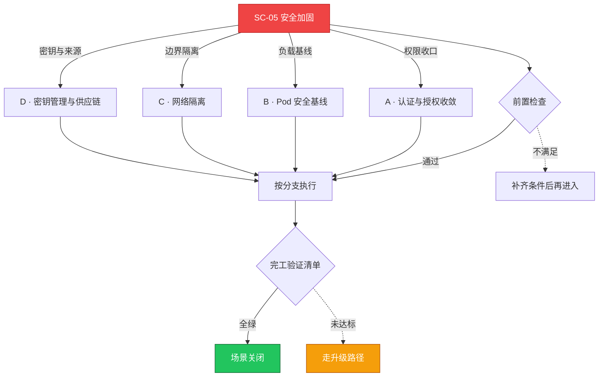

# SC-05 场景剧本: 安全加固

> **ID**: `SC-05` · **分组**: 安全合规 · **英文**: Security Hardening · **更新**: 2026-08-27
> **层次定位**: 工单剧本编排层 —— 回答「什么场景、按什么顺序、调用哪些资源」。
> Domain 讲原理，Skill 给动作，FTA 管推导；本页负责把它们串成可执行的工作流。

## 一、适用场景（何时进入本剧本）

- 新集群上线前基线加固
- 审计整改项/渗透测试修复
- 等保与行业合规倒排工期

## 二、场景概述

以 CIS 映射为基线、以 audit→warn→enforce 渐进式落地为纪律，防止『一收紧就断服务』的事故型加固。

## 三、前置检查（开工门槛，逐项勾选）

- [ ] 运行 CIS Benchmark 扫描获得差距清单
- [ ] 业务方填写豁免申请（哪些服务依赖宽松权限及其原因）
- [ ] 选定策略引擎与实施轨道（audit → warn → enforce 三段式）

## 四、快速决策树

## 五、工作流分支

### A · 认证与授权收敛

> 条件: 权限收口

1. RBAC 走聚合角色与准入复核，禁用 cluster-admin 泛授 → [[19-故障诊断/08-技能体系/10-rbac-quota-failure.md|10 · rbac quota failure]]、[[13-生产运维/05-工单案例/ticket-case-039-rbac-api-access-denied.md|RBAC AccessDenied 案例]]

### B · Pod 安全基线

> 条件: 负载基线

1. namespace 按 PSA 等级分级落地（privileged/restricted）
2. 特权容器与 hostPath 的例外审批流程固化 → [[19-故障诊断/06-FTA故障树/list/psp-scc-fta.md|FTA · psp-scc]]

### C · 网络隔离

> 条件: 边界隔离

1. default-deny 后白名单放行，切记预留 DNS 通路 → [[19-故障诊断/08-技能体系/22-networkpolicy-connectivity.md|22 · networkpolicy connectivity]]、[[13-生产运维/05-工单案例/ticket-case-010-networkpolicy-blocks-traffic.md|Policy 断流案例]]
2. 复杂拓扑查询故障树对照 → [[19-故障诊断/06-FTA故障树/list/networkpolicy-fta.md|FTA · networkpolicy]]

### D · 密钥管理与供应链

> 条件: 密钥与来源

1. etcd Secret 静态加密 + 外部 KMS，凭据定期轮转 → [[19-故障诊断/08-技能体系/15-configmap-secret-failure.md|15 · configmap secret failure]]
2. 镜像签名验证与准入扫描门禁（unsigned 一律 deny）

## 六、完工验证清单

- [ ] CIS 通过率达到设定目标且 audit 日志零误杀申诉
- [ ] 红队抽查横向移动路径较加固前收窄可量化
- [ ] 所有 enforce 级策略具备一键降级的操作文档

## 七、常见陷阱（前人踩坑榜）

- ⚠️ RBAC 收紧遗漏 CI/CD 服务账号，流水线半夜集体阵亡
- ⚠️ NetworkPolicy 只测 pod-to-pod 忘了 egress DNS/元数据端点
- ⚠️ 跳过 audit 直奔 enforce，事后说不清影响了谁

## 八、升级路径

| 触发条件 | 升级动作 |
|---|---|
| 涉及生产关键链路的强策略 | 变更委员会评审并设一周观察期 |

## 九、资源编排（跨层素材索引）

### 领域文档（原理与规范）

- [[08-安全/README.md|安全域]]
- [[13-生产运维/02-集群治理/04-rbac-governance-model.md|RBAC 治理模型]]
- [[13-生产运维/02-集群治理/03-admission-policy-governance.md|准入策略治理]]

### FTA 故障树（根因推导）

- [[19-故障诊断/06-FTA故障树/list/rbac-fta.md|FTA · rbac]]
- [[19-故障诊断/06-FTA故障树/list/networkpolicy-fta.md|FTA · networkpolicy]]
- [[19-故障诊断/06-FTA故障树/list/certificate-fta.md|FTA · certificate]]

### 操作技能卡（原子动作）

- [[19-故障诊断/08-技能体系/10-rbac-quota-failure.md|10 · rbac quota failure]]
- [[19-故障诊断/08-技能体系/22-networkpolicy-connectivity.md|22 · networkpolicy connectivity]]
- [[19-故障诊断/08-技能体系/26-namespace-quota-limitrange.md|26 · namespace quota limitrange]]

## 十、相邻场景

- [[13-生产运维/08-运维场景剧本/compliance-audit|SC-20 合规审计]]
- [[13-生产运维/08-运维场景剧本/security-incident|SC-13 安全事件响应]]

---

*本文档由 `31-脚本/generate-scenarios.py` 于 2026-08-27 自动生成。请修改脚本中的场景数据后重新生成，勿直接编辑本文件。*
