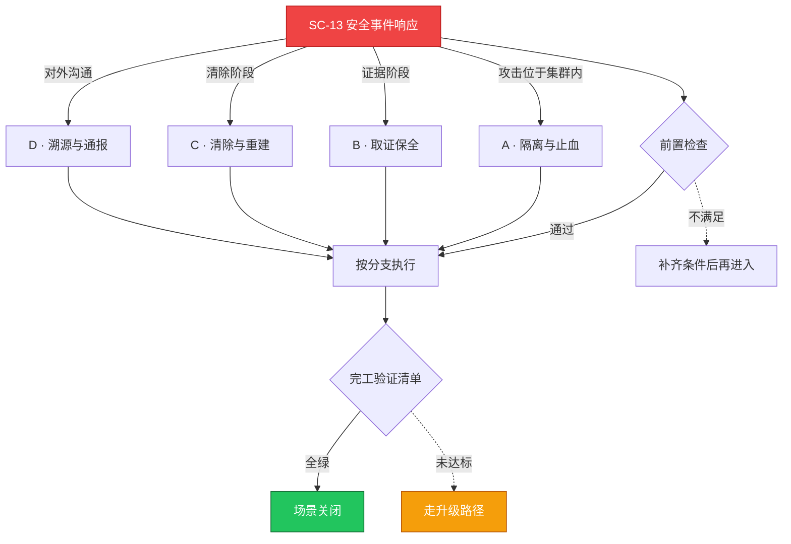

# SC-13 场景剧本: 安全事件响应

> **ID**: `SC-13` · **分组**: 安全合规 · **英文**: Security Incident Response · **更新**: 2026-08-27
> **层次定位**: 工单剧本编排层 —— 回答「什么场景、按什么顺序、调用哪些资源」。
> Domain 讲原理，Skill 给动作，FTA 管推导；本页负责把它们串成可执行的工作流。

## 一、适用场景（何时进入本剧本）

- 入侵检测/挖矿特征命中告警
- 异常外联至威胁情报黑名单 IP
- 密钥泄露或审计日志中的越权痕迹

## 二、场景概述

铁律次序：先隔离、再取证、后清除；被感染资产一律重建而非原地清洗——假设对手已持久化。

## 三、前置检查（开工门槛，逐项勾选）

- [ ] 按分级标准完成事件定性（SEV-S/P1/P2） → [[13-生产运维/03-事件响应/01-escalation-matrix-severity-levels.md|事件分级标准]]
- [ ] 开启专用安保频道（脱离日常 on-call 群）
- [ ] 记录初始时间戳 T0，法务/合规全程跟随

## 四、快速决策树

## 五、工作流分支

### A · 隔离与止血

> 条件: 攻击位于集群内

1. Node taint + cordon，恶意命名空间策略全封闭 → [[19-故障诊断/08-技能体系/19-security-incident-response.md|19 · security incident response]]
2. 吊销可疑 SA Token 与长效凭证，轮换镜像仓库密钥

### B · 取证保全

> 条件: 证据阶段

1. 容器文件系统/内存快照上传证物桶（chain of custody 登记）
2. 导出 apiserver audit log 固定时间窗 → [[13-生产运维/03-事件响应/08-supply-chain-incident-response.md|供应链事件响应]]

### C · 清除与重建

> 条件: 清除阶段

1. 受感染节点与镜像一律重建不复用
2. 容器运行时逃逸路径复核 → [[13-生产运维/03-事件响应/07-container-runtime-threat-response.md|运行时威胁响应]]

### D · 溯源与通报

> 条件: 对外沟通

1. 统一发言人使用既定话术对外通报 → [[13-生产运维/03-事件响应/03-communication-templates-stakeholder.md|干系人沟通模板]]
2. IOC 回填威胁情报库并反向全网扫描存量

## 六、完工验证清单

- [ ] 七日内无同类 IOC 复燃
- [ ] 审计日志确认权限收敛到位（最小暴露面）
- [ ] 复盘报告涉法部分经法务签核归档

## 七、常见陷阱（前人踩坑榜）

- ⚠️ 直接 kill 进程留下持久化后门与定时任务后患
- ⚠️ 取证前重启节点，内存证据灰飞烟灭
- ⚠️ 只收敛受影响命名空间，遗漏横向移动副路径

## 八、升级路径

| 触发条件 | 升级动作 |
|---|---|
| 确认数据外泄或勒索加密 | 立即上升公司安全委员会并启动公关预案 |

## 九、资源编排（跨层素材索引）

### 领域文档（原理与规范）

- [[08-安全/README.md|安全域]]
- [[13-生产运维/03-事件响应/index.md|事件响应手册集]]

### FTA 故障树（根因推导）

- [[19-故障诊断/06-FTA故障树/list/webhook-admission-fta.md|FTA · webhook-admission]]
- [[19-故障诊断/06-FTA故障树/list/psp-scc-fta.md|FTA · psp-scc]]

### 操作技能卡（原子动作）

- [[19-故障诊断/08-技能体系/19-security-incident-response.md|19 · security incident response]]
- [[19-故障诊断/08-技能体系/15-configmap-secret-failure.md|15 · configmap secret failure]]

## 十、相邻场景

- [[13-生产运维/08-运维场景剧本/security-hardening|SC-05 安全加固]]
- [[13-生产运维/08-运维场景剧本/compliance-audit|SC-20 合规审计]]

---

*本文档由 `31-脚本/generate-scenarios.py` 于 2026-08-27 自动生成。请修改脚本中的场景数据后重新生成，勿直接编辑本文件。*
