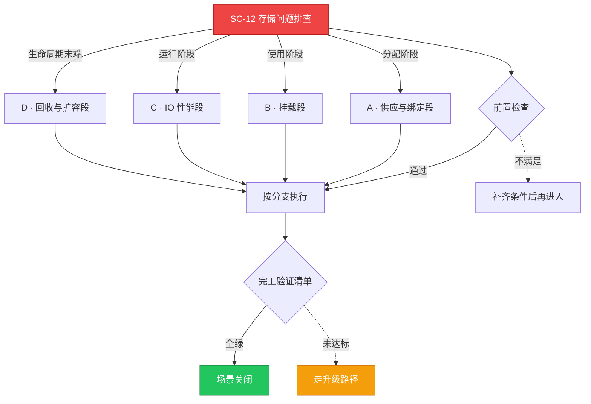

# SC-12 场景剧本: 存储问题排查

> **ID**: `SC-12` · **分组**: 稳定性保障 · **英文**: Storage Issues · **更新**: 2026-08-27
> **层次定位**: 工单剧本编排层 —— 回答「什么场景、按什么顺序、调用哪些资源」。
> Domain 讲原理，Skill 给动作，FTA 管推导；本页负责把它们串成可执行的工作流。

## 一、适用场景（何时进入本剧本）

- PVC Pending / 卷绑定失败
- Pod 挂卷报错 mount failed / timeout
- IO 延迟飙升、云盘性能打满类事件

## 二、场景概述

以 CSI 事件流为主轴，一段一段排除供应→绑定→挂载→IO→回收的问题，拒绝笼统重启。

## 三、前置检查（开工门槛，逐项勾选）

- [ ] Describe PVC 摘取事件关键词（FailedBinding/ProvisioningFailed） → [[19-故障诊断/08-技能体系/08-pvc-storage-failure.md|08 · pvc storage failure]]
- [ ] CSI controller/node 组件心跳与版本匹配核查 → [[19-故障诊断/06-FTA故障树/list/csi-fta.md|FTA · csi]]

## 四、快速决策树

## 五、工作流分支

### A · 供应与绑定段

> 条件: 分配阶段

1. storageClass 的 provisioner/volumeBindingMode 与区域亲和核对
2. 扩缩容后插件实例缺失的典型样本 → [[13-生产运维/05-工单案例/ticket-case-004-csi-plugin-missing-after-scale.md|扩容后 CSI 插件缺失]]

### B · 挂载段

> 条件: 使用阶段

1. mount 错误码分类：权限/网络/残留挂载点 → [[13-生产运维/05-工单案例/ticket-case-028-statefulset-pvc-unbound.md|STS PVC 未绑定]]
2. 批量挂载失败按 StatefulSet 序号聚类定位 → [[19-故障诊断/08-技能体系/23-statefulset-failure.md|23 · statefulset failure]]

### C · IO 性能段

> 条件: 运行阶段

1. 云盘突发带宽/限流阈值核查 → [[13-生产运维/05-工单案例/ticket-case-002-java-oom-essd-iohang.md|ESSD IO Hang]]
2. fsync 延迟异常纳入节点驱逐联动审查

### D · 回收与扩容段

> 条件: 生命周期末端

1. reclaimPolicy 对照业务预期（Deleted 的回收站语义确认）
2. 在线扩容前置条件：allowVolumeExpansion=true 且无快照链

## 六、完工验证清单

- [ ] 新增示例 StatefulSet 完整走通供→绑→挂→IO 四步
- [ ] 问题卷的性能曲线恢复正常区间
- [ ] 回收类操作双人复核（防误删生产卷）

## 七、常见陷阱（前人踩坑榜）

- ⚠️ 把云盘计费状态异常误诊为 CSI 故障
- ⚠️ 同一可用区售罄反复重试 Provisioner 形成排队雪崩
- ⚠️ force-detach 施加于多挂载卷引发数据竞争

## 八、升级路径

| 触发条件 | 升级动作 |
|---|---|
| 多租户同时挂载失败的底座故障 | 广播暂停对应 StorageClass 新供给并升级 |

## 九、资源编排（跨层素材索引）

### 领域文档（原理与规范）

- [[06-存储/README.md|存储域]]

### FTA 故障树（根因推导）

- [[19-故障诊断/06-FTA故障树/list/csi-fta.md|FTA · csi]]
- [[19-故障诊断/06-FTA故障树/list/statefulset-fta.md|FTA · statefulset]]

### 操作技能卡（原子动作）

- [[19-故障诊断/08-技能体系/08-pvc-storage-failure.md|08 · pvc storage failure]]
- [[19-故障诊断/08-技能体系/23-statefulset-failure.md|23 · statefulset failure]]

## 十、相邻场景

- [[13-生产运维/08-运维场景剧本/troubleshooting|SC-03 故障排查总纲]]
- [[13-生产运维/08-运维场景剧本/backup-restore|SC-07 备份恢复]]

---

*本文档由 `31-脚本/generate-scenarios.py` 于 2026-08-27 自动生成。请修改脚本中的场景数据后重新生成，勿直接编辑本文件。*
