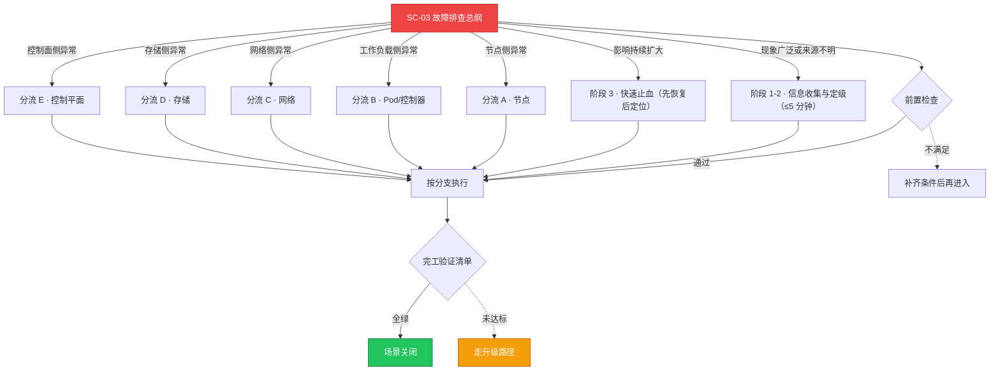

# SC-03 场景剧本: 故障排查总纲

> **ID**: `SC-03` · **分组**: 稳定性保障 · **英文**: Troubleshooting Master Playbook · **更新**: 2026-08-27
> **层次定位**: 工单剧本编排层 —— 回答「什么场景、按什么顺序、调用哪些资源」。
> Domain 讲原理，Skill 给动作，FTA 管推导；本页负责把它们串成可执行的工作流。

## 一、适用场景（何时进入本剧本）

- 任何 P0/P1 生产告警触发（节点/工作负载/网络/存储/控制面）
- 用户报障：访问失败、性能骤降、功能异常
- 巡检发现持续劣化的异常趋势

## 二、场景概述

一切专项排查的入口剧本。以『信息收集 → 影响评估 → 快速止血 → 根因定位 → 修复验证』五阶段为主线，阶段四按组件分流到专项剧本与 FTA 故障树。铁律：先取证再动手，避免无序重启销毁现场。

## 三、前置检查（开工门槛，逐项勾选）

- [ ] 确认真伪与持续性：排除误报，等待至少一个完整指标周期
- [ ] 按升级矩阵完成初步定级（P0~P3） → [[13-生产运维/03-事件响应/01-escalation-matrix-severity-levels.md|事件升级矩阵]]
- [ ] 影响半径速记：节点数 / 工作负载 / 用户面 SLO 影响
- [ ] 近 1 小时变更清单：发布、配置、扩缩容、证书、内核操作
- [ ] P0 即刻拉起 War Room → [[13-生产运维/03-事件响应/02-war-room-coordination-procedures.md|War Room 协调规程]]

## 四、快速决策树

## 五、工作流分支

### 阶段 1-2 · 信息收集与定级（≤5 分钟）

> 条件: 现象广泛或来源不明

1. kubectl get events --sort-by=.lastTimestamp 抓 Warning 波形
2. kubectl top nodes / top pods --all-namespaces 找资源热点
3. 将异常时间线与近期变更记录对齐 → [[11-发布变更/04-变更管理/index.md|变更管理索引]]
4. 向干系人发出首份通报（模板化表达） → [[13-生产运维/03-事件响应/03-communication-templates-stakeholder.md|干系人沟通模板]]

### 阶段 3 · 快速止血（先恢复后定位）

> 条件: 影响持续扩大

1. 决策优先级：切流降级 > 回滚最近变更 > 隔离故障单元 > 受控重启
2. 止血动作必须先截图留证再执行，防止现场销毁
3. 操作前对照变更冻结窗口约束 → [[13-生产运维/07-运维手册/07-change-freeze-policy.md|变更冻结策略]]

### 分流 A · 节点

> 条件: 节点侧异常

1. NotReady/资源压力按卡片处置 → [[19-故障诊断/08-技能体系/01-node-notready.md|01 · node notready]]、[[19-故障诊断/08-技能体系/20-node-resource-pressure.md|20 · node resource pressure]]
2. 深入物理面根因用 FTA 推导 → [[19-故障诊断/06-FTA故障树/list/kubelet-fta.md|FTA · kubelet]]、[[19-故障诊断/06-FTA故障树/list/containerd-fta.md|FTA · containerd]]

### 分流 B · Pod/控制器

> 条件: 工作负载侧异常

1. Pending/CrashLoop/OOM 三大症候对症下药 → [[19-故障诊断/08-技能体系/03-pod-pending.md|03 · pod pending]]、[[19-故障诊断/08-技能体系/02-pod-crashloop-oomkilled.md|02 · pod crashloop oomkilled]]
2. 疑难杂症按 Pod 创建端到端链路追踪 → [[19-故障诊断/06-FTA故障树/list/pod-creation-end-to-end-fta.md|FTA · pod-creation-end-to-end]]、[[19-故障诊断/06-FTA故障树/list/scheduler-fta.md|FTA · scheduler]]

### 分流 C · 网络

> 条件: 网络侧异常

1. 四跳法快速分层：DNS→Service→Ingress→Policy → [[19-故障诊断/08-技能体系/04-dns-resolution-failure.md|04 · dns resolution failure]]、[[19-故障诊断/08-技能体系/05-service-connectivity.md|05 · service connectivity]]
2. 复杂链路转入网络诊断专项剧本 → [[13-生产运维/08-运维场景剧本/network-diagnosis|SC-11 网络诊断]]

### 分流 D · 存储

> 条件: 存储侧异常

1. 挂卷/Pending PVC 先看事件与 CSI 组件健康 → [[19-故障诊断/08-技能体系/08-pvc-storage-failure.md|08 · pvc storage failure]]、[[19-故障诊断/06-FTA故障树/list/csi-fta.md|FTA · csi]]
2. 转专项剧本深挖 → [[13-生产运维/08-运维场景剧本/storage-issues|SC-12 存储问题]]

### 分流 E · 控制平面

> 条件: 控制面侧异常

1. 首要保全证据：etcd 快照 + 日志归档，再谈修复 → [[19-故障诊断/08-技能体系/12-control-plane-failure.md|12 · control plane failure]]、[[19-故障诊断/06-FTA故障树/list/etcd-fta.md|FTA · etcd]]、[[19-故障诊断/06-FTA故障树/list/apiserver-fta.md|FTA · apiserver]]
2. 配额与权限类误判常被误认为控制面故障 → [[19-故障诊断/08-技能体系/10-rbac-quota-failure.md|10 · rbac quota failure]]

## 六、完工验证清单

- [ ] 核心指标回到 7 天基线带宽内且持续 ≥2 个周期
- [ ] 受影响业务接口成功率/延迟达标，无衍生告警
- [ ] 止血手段副作用已评估（临时资源的回收计划明确）
- [ ] 48h 内产出复盘 RCA，结论回写知识库与 FTA → [[13-生产运维/03-事件响应/index.md|事件响应手册集]]

## 七、常见陷阱（前人踩坑榜）

- ⚠️ 没有留证就重启组件——根因永久丢失，只能靠猜
- ⚠️ 只在容器内找问题，忽略节点级 DNS/IO/时钟漂移
- ⚠️ 高峰期执行回滚引发二次事故，违背先扩容再变更的原则
- ⚠️ 把症状当根因关单：重启恢复 ≠ 排查完成

## 八、升级路径

| 触发条件 | 升级动作 |
|---|---|
| 15 分钟内无有效止血路径的 P0 | 升级值班经理并拉起 War Room |
| 疑似云产品侧故障 | 提云厂商工单并同步初步证据包 |

## 九、资源编排（跨层素材索引）

### 领域文档（原理与规范）

- [[19-故障诊断/README.md|故障诊断域]]
- [[13-生产运维/03-事件响应/04-on-call-playbook.md|On-Call 手册]]
- [[13-生产运维/07-运维手册/09-observability-operations.md|可观测性运营]]
- [[13-生产运维/05-工单案例/ticket-routing-rules.md|工单路由规则]]

### FTA 故障树（根因推导）

- [[19-故障诊断/06-FTA故障树/list/pod-fta.md|FTA · pod]]
- [[19-故障诊断/06-FTA故障树/list/node-fta.md|FTA · node]]
- [[19-故障诊断/06-FTA故障树/list/etcd-fta.md|FTA · etcd]]
- [[19-故障诊断/06-FTA故障树/list/dns-fta.md|FTA · dns]]
- [[19-故障诊断/06-FTA故障树/list/csi-fta.md|FTA · csi]]

### 操作技能卡（原子动作）

- [[19-故障诊断/08-技能体系/01-node-notready.md|01 · node notready]]
- [[19-故障诊断/08-技能体系/03-pod-pending.md|03 · pod pending]]
- [[19-故障诊断/08-技能体系/04-dns-resolution-failure.md|04 · dns resolution failure]]
- [[19-故障诊断/08-技能体系/11-image-pull-failure.md|11 · image pull failure]]
- [[19-故障诊断/08-技能体系/18-performance-bottleneck.md|18 · performance bottleneck]]

## 十、相邻场景

- [[13-生产运维/08-运维场景剧本/network-diagnosis|SC-11 网络诊断]]
- [[13-生产运维/08-运维场景剧本/storage-issues|SC-12 存储问题]]
- [[13-生产运维/08-运维场景剧本/performance-tuning|SC-04 性能调优]]
- [[13-生产运维/08-运维场景剧本/security-incident|SC-13 安全事件响应]]

---

*本文档由 `31-脚本/generate-scenarios.py` 于 2026-08-27 自动生成。请修改脚本中的场景数据后重新生成，勿直接编辑本文件。*
