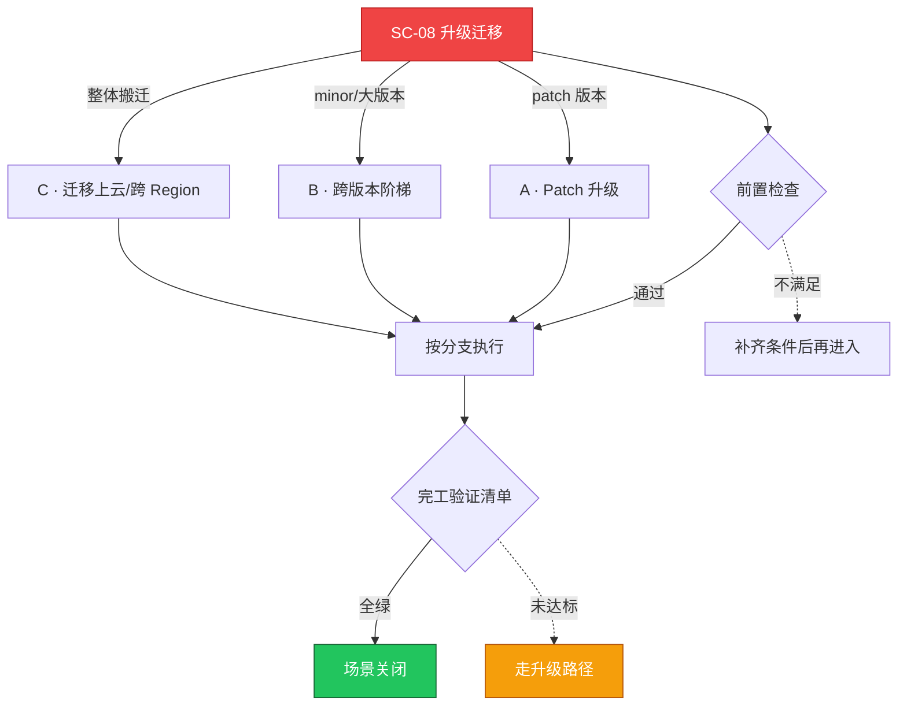

# SC-08 场景剧本: 升级迁移

> **ID**: `SC-08` · **分组**: 建设与交付 · **英文**: Upgrade & Migration · **更新**: 2026-08-27
> **层次定位**: 工单剧本编排层 —— 回答「什么场景、按什么顺序、调用哪些资源」。
> Domain 讲原理，Skill 给动作，FTA 管推导；本页负责把它们串成可执行的工作流。

## 一、适用场景（何时进入本剧本）

- 当前版本临近上游支持尾声
- 新特性或安全合规要求强制版本门槛
- 跨云/跨机房迁移伴随版本跃迁

## 二、场景概述

一次只升一级、插件与控制面的升级次序、每一级的逃生门——升级事故几乎全是纪律问题。

## 三、前置检查（开工门槛，逐项勾选）

- [ ] 兼容性矩阵确认：CNI/CSI/Ingress/runtime 与目标版本互相兼容
- [ ] deprecation 扫描：当前 API usage 对照目标版本移除清单归零
- [ ] 保护性快照已完成并通过校验 → [[13-生产运维/08-运维场景剧本/backup-restore|SC-07 备份恢复]]
- [ ] 维护窗口公告发布且变更冻结生效

## 四、快速决策树

## 五、工作流分支

### A · Patch 升级

> 条件: patch 版本

1. 节点池分批 drain → upgrade → uncordon，每批保有 ≥1/3 冗余
2. 升级后核查组件信任链与 kubelet 凭证 → [[19-故障诊断/06-FTA故障树/list/cluster-upgrade-fta.md|FTA · cluster-upgrade]]

### B · 跨版本阶梯

> 条件: minor/大版本

1. 严禁跳级：x.y → x.y+1 逐级完成且每级回归测试
2. 证书有效期护栏：不足 90 天先续期再升级 → [[13-生产运维/05-工单案例/ticket-case-005-kubelet-cert-expired.md|kubelet 证书过期]]、[[19-故障诊断/08-技能体系/27-cluster-upgrade-migration.md|27 · cluster upgrade migration]]

### C · 迁移上云/跨 Region

> 条件: 整体搬迁

1. 双跑并行：以 GitOps manifest 迁移为主，杜绝数据面手工拷贝
2. DNS 灰度切换并保留 ≥7 天双栈回切窗口

## 六、完工验证清单

- [ ] 全组件版本一致且无 mixed-version 告警
- [ ] 废弃 API 审计查询结果归零
- [ ] 试点业务全量回归 + 监控指标 72 小时平稳

## 七、常见陷阱（前人踩坑榜）

- ⚠️ 插件（CNI/Webhook）滞后于控制面形成兼容裂缝
- ⚠️ 升级期间并行其他变更，失败后无从归因
- ⚠️ 金丝雀池遗漏网关/中间件节点批次

## 八、升级路径

| 触发条件 | 升级动作 |
|---|---|
| 任一批次升级后数据面受损 | 立即中止批次队列并回滚，转 SC-03 总纲处理 |

## 九、资源编排（跨层素材索引）

### 领域文档（原理与规范）

- [[11-发布变更/04-变更管理/index.md|变更管理]]
- [[01-集群基础/README.md|集群基础]]

### FTA 故障树（根因推导）

- [[19-故障诊断/06-FTA故障树/list/cluster-upgrade-fta.md|FTA · cluster-upgrade]]
- [[19-故障诊断/06-FTA故障树/list/kubeadm-fta.md|FTA · kubeadm]]
- [[19-故障诊断/06-FTA故障树/list/certificate-fta.md|FTA · certificate]]

### 操作技能卡（原子动作）

- [[19-故障诊断/08-技能体系/27-cluster-upgrade-migration.md|27 · cluster upgrade migration]]
- [[19-故障诊断/08-技能体系/06-certificate-expiry.md|06 · certificate expiry]]

## 十、相邻场景

- [[13-生产运维/08-运维场景剧本/backup-restore|SC-07 备份恢复]]
- [[13-生产运维/08-运维场景剧本/cluster-deployment|SC-01 集群部署]]

---

*本文档由 `31-脚本/generate-scenarios.py` 于 2026-08-27 自动生成。请修改脚本中的场景数据后重新生成，勿直接编辑本文件。*
