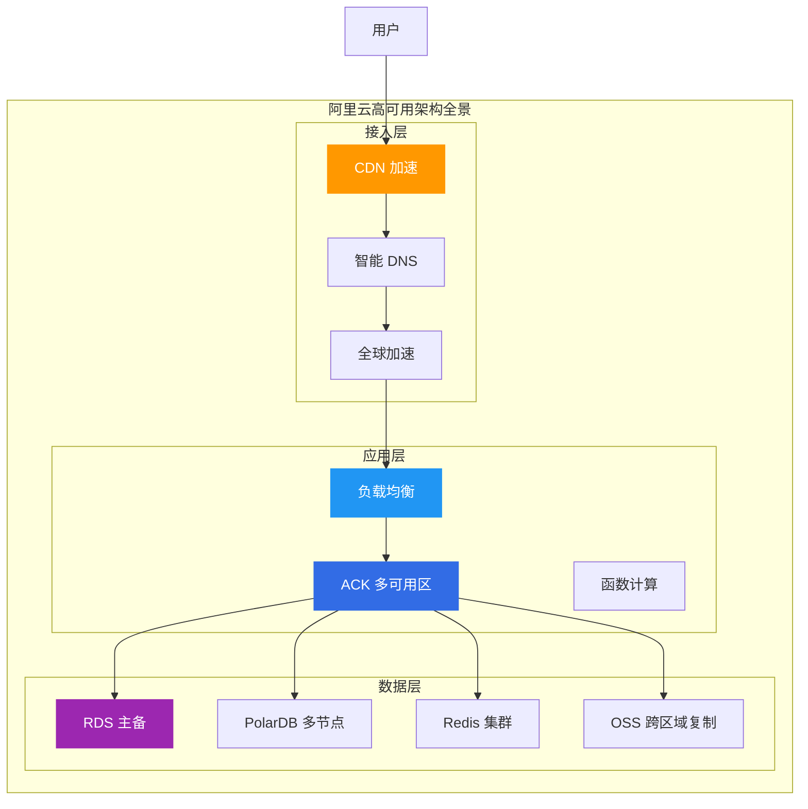
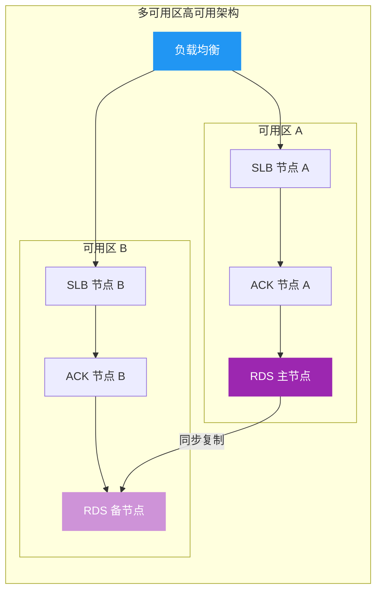
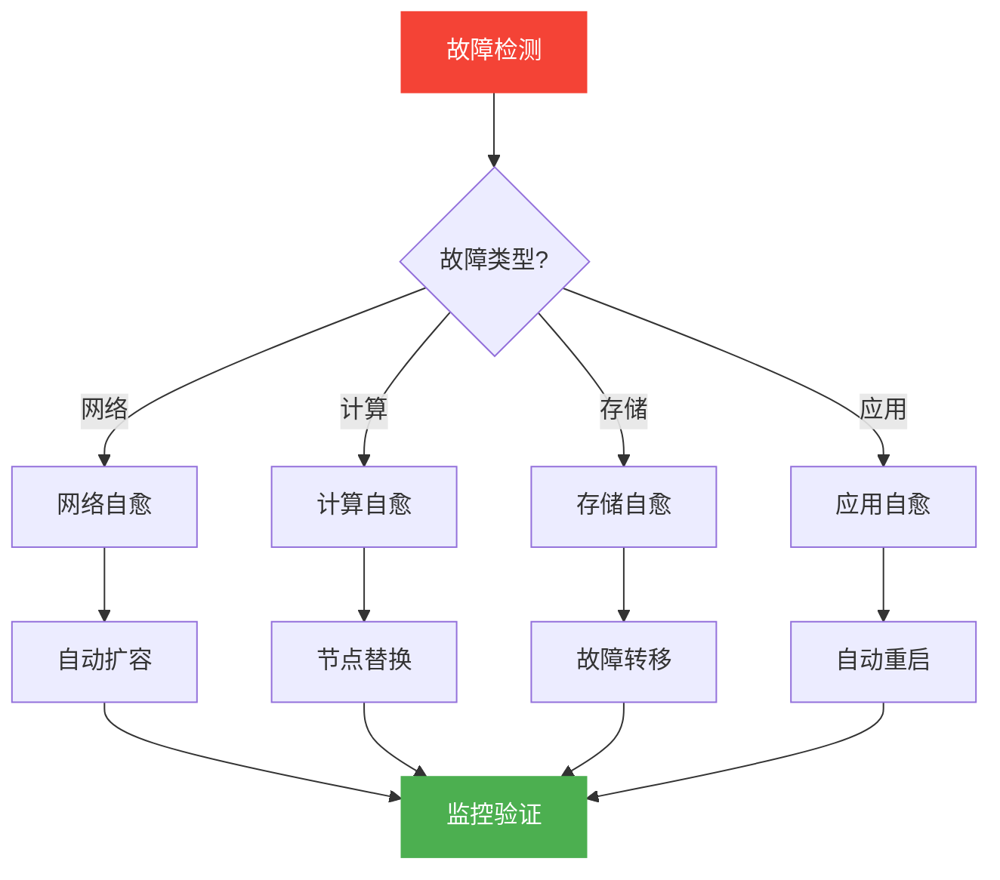

# 阿里云高可用架构设计

> 面向架构师的高可用架构设计指南，从基础设施、应用层、数据层三个维度构建企业级高可用体系。

## 高可用架构全景



---

## 一、高可用设计原则

### 1.1 核心指标

| 指标 | 含义 | 目标值 |
|------|------|--------|
| **可用性 SLA** | 系统正常运行时间比例 | 99.99% (52分钟/年) |
| **RTO** | 故障恢复时间目标 | < 5分钟 |
| **RPO** | 数据恢复点目标 | < 1分钟 |
| **MTTR** | 平均修复时间 | < 15分钟 |

### 1.2 设计原则

| 原则 | 说明 | 实践 |
|------|------|------|
| **消除单点** | 无单一故障点 | 多可用区部署 |
| **故障隔离** | 故障不扩散 | 舱壁模式、熔断 |
| **快速恢复** | 自动化恢复 | 自愈、降级 |
| **容量冗余** | 预留缓冲容量 | 20% 冗余 |

---

## 二、基础设施层高可用

### 2.1 多可用区架构



### 2.2 跨地域容灾

| 容灾等级 | RTO | RPO | 成本 | 适用场景 |
|----------|-----|-----|------|----------|
| **同城双活** | < 1分钟 | 0 | 中 | 金融核心 |
| **异地灾备** | < 30分钟 | < 5分钟 | 低 | 一般业务 |
| **两地三中心** | < 5分钟 | 0 | 高 | 政企核心 |

---

## 三、应用层高可用

### 3.1 微服务高可用模式

| 模式 | 说明 | 阿里云产品 |
|------|------|------------|
| **服务熔断** | 快速失败，防止雪崩 | Sentinel |
| **服务限流** | 控制请求速率 | Sentinel |
| **服务降级** | 降级非核心功能 | MSE |
| **服务重试** | 自动重试失败请求 | Dubbo/Spring Cloud |

### 3.2 容器服务高可用

**ACK 多可用区部署策略**:

```yaml
# ACK 多可用区节点池配置示例
apiVersion: v1
kind: NodePool
metadata:
  name: high-availability-pool
spec:
  zones:
    - cn-hangzhou-h
    - cn-hangzhou-i
    - cn-hangzhou-j
  scaling:
    minSize: 3
    maxSize: 100
  taints:
    - key: dedicated
      value: application
      effect: NoSchedule
```

---

## 四、数据层高可用

### 4.1 数据库高可用

| 产品 | 高可用方案 | RTO | RPO |
|------|------------|-----|-----|
| **RDS** | 主备切换 | < 30秒 | 0 |
| **PolarDB** | 多节点故障转移 | < 30秒 | 0 |
| **Redis** | 集群主从切换 | < 10秒 | < 1秒 |
| **MongoDB** | 副本集自动切换 | < 30秒 | 0 |

### 4.2 存储高可用

| 产品 | 高可用方案 | 数据持久性 |
|------|------------|------------|
| **OSS** | 跨区域复制 | 99.999999999% |
| **NAS** | 多可用区挂载 | 99.999999999% |
| **ESSD** | 多副本 | 99.999999999% |

---

## 五、故障自愈机制

### 5.1 自动化故障处理



### 5.2 阿里云自愈产品

| 产品 | 能力 | 适用场景 |
|------|------|----------|
| **ARMS** | 应用监控告警 | 应用层故障 |
| **AHAS** | 架构感知 | 架构变更检测 |
| **CloudMonitor** | 基础设施监控 | 资源层故障 |
| **SLS** | 日志分析 | 日志异常检测 |

---

## 六、高可用设计 Checklist

### 6.1 基础设施层

- [ ] 多可用区部署
- [ ] 跨地域容灾
- [ ] 负载均衡冗余
- [ ] DNS 多活

### 6.2 应用层

- [ ] 服务熔断
- [ ] 服务限流
- [ ] 服务降级
- [ ] 健康检查

### 6.3 数据层

- [ ] 数据库主备
- [ ] 跨区域备份
- [ ] 数据校验
- [ ] 恢复演练

---

## 七、架构师面试要点

### 7.1 高频面试题

1. **如何设计 99.99% 可用性的系统?**
   - 多可用区部署
   - 故障自动转移
   - 数据多副本
   - 监控告警

2. **RTO 和 RPO 如何平衡?**
   - RTO：故障恢复时间
   - RPO：数据丢失量
   - 成本与可用性权衡

3. **如何进行容灾演练?**
   - 定期故障注入
   - 混沌工程
   - 自动化演练

---

## 八、相关文档

- [09-计算产品选型.md](09-计算产品选型.md) — 计算产品对比
- [11-数据库产品选型.md](11-数据库产品选型.md) — 数据库产品对比
- [12-网络产品选型.md](12-网络产品选型.md) — 网络产品对比

---

> **文档版本**: v1.0  
> **最后更新**: 2026-08-23  
> **适用对象**: 云原生架构师、SRE、技术决策者
