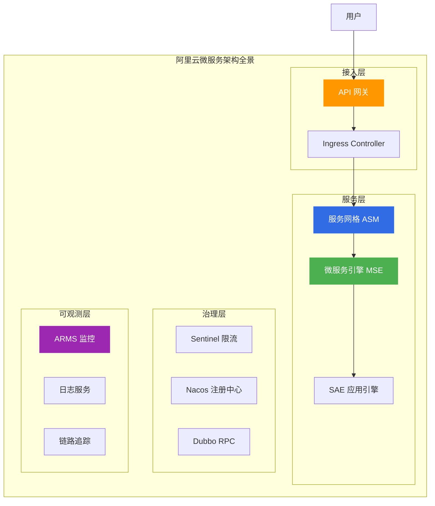
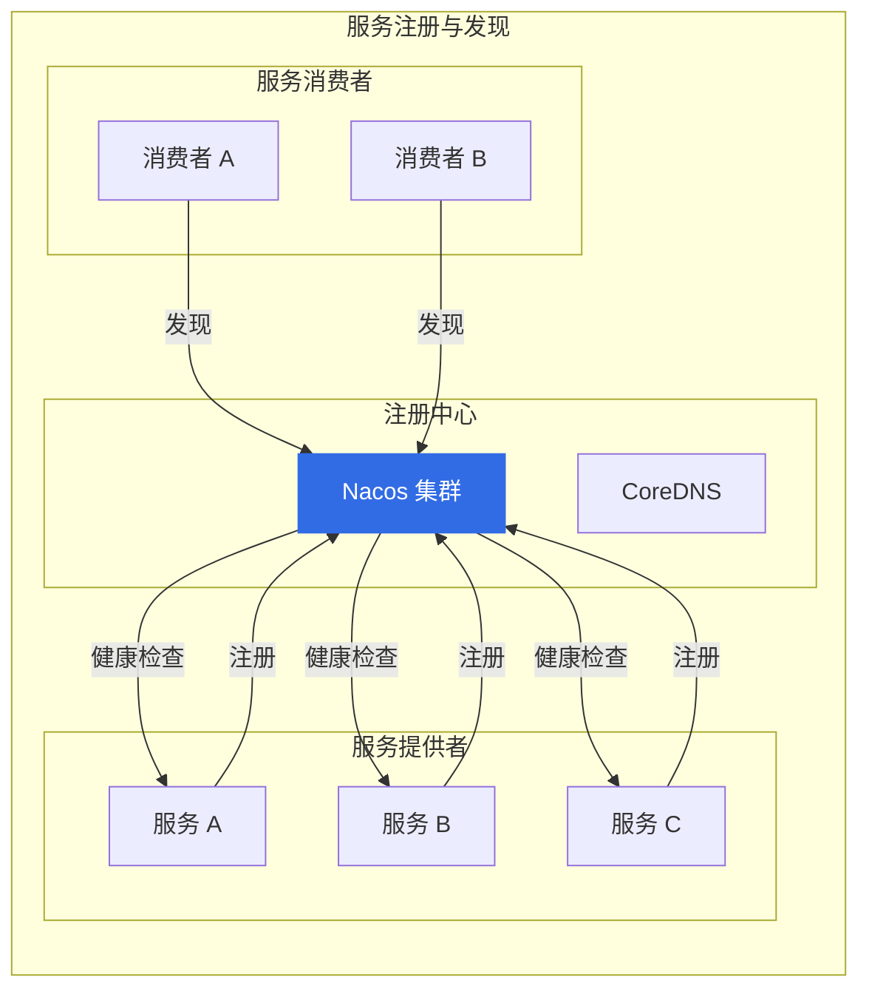
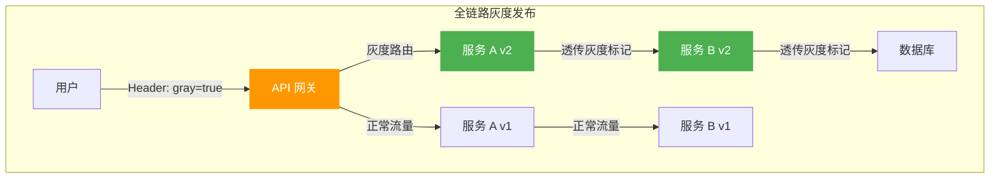
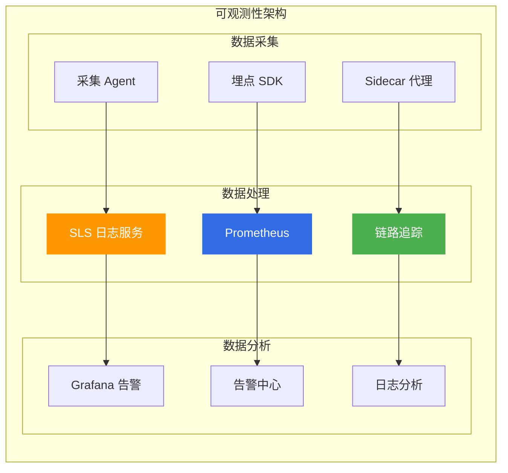
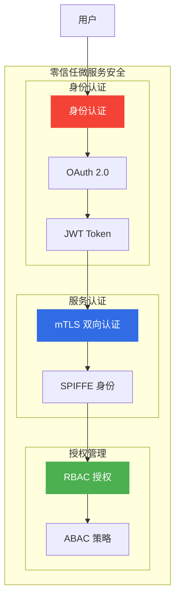

# 阿里云微服务架构方案

> 面向架构师的微服务架构方案指南，从服务治理、流量管理、可观测性三个维度构建企业级微服务体系。

## 微服务架构全景



---

## 一、微服务技术选型

### 1.1 微服务框架对比

| 框架 | 语言 | 特点 | 适用场景 |
|------|------|------|----------|
| **Spring Cloud** | Java | 生态完善、功能丰富 | Java 微服务 |
| **Dubbo** | Java | 高性能 RPC、阿里开源 | Java RPC |
| **Go-Micro** | Go | 轻量级、高性能 | Go 微服务 |
| **Istio** | 多语言 | 服务网格、无侵入 | 多语言环境 |

### 1.2 阿里云微服务产品矩阵

| 产品 | 定位 | 核心能力 |
|------|------|----------|
| **MSE** | 微服务引擎 | 注册配置中心、网关、治理 |
| **ASM** | 服务网格 | 多语言支持、流量管理 |
| **SAE** | 应用引擎 | Serverless 微服务、零改造 |
| **AHAS** | 高可用服务 | 限流降级、架构感知 |

---

## 二、服务治理体系

### 2.1 服务注册与发现



### 2.2 服务限流与熔断

| 策略 | 说明 | 阿里云产品 |
|------|------|------------|
| **限流** | 控制请求速率 | Sentinel |
| **熔断** | 快速失败，防止雪崩 | Sentinel |
| **降级** | 降级非核心功能 | MSE |
| **隔离** | 故障隔离 | ASM |

### 2.3 全链路灰度发布



---

## 三、流量管理

### 3.1 流量管理能力

| 能力 | 说明 | 阿里云产品 |
|------|------|------------|
| **流量染色** | 标记流量来源 | ASM |
| **流量路由** | 按规则路由流量 | ASM |
| **流量镜像** | 复制流量用于测试 | ASM |
| **故障注入** | 模拟故障测试 | AHAS |

### 3.2 流量管理配置示例

```yaml
# ASM 流量管理配置示例
apiVersion: networking.istio.io/v1alpha3
kind: VirtualService
metadata:
  name: productpage
spec:
  hosts:
    - productpage
  http:
    - match:
        - headers:
            x-user-type:
              exact: "vip"
      route:
        - destination:
            host: productpage
            subset: v2
    - route:
        - destination:
            host: productpage
            subset: v1
```

---

## 四、可观测性体系

### 4.1 可观测性三支柱

| 支柱 | 数据类型 | 阿里云产品 |
|------|----------|------------|
| **指标** | Metrics | ARMS Prometheus |
| **日志** | Logs | SLS 日志服务 |
| **追踪** | Traces | ARMS 链路追踪 |

### 4.2 可观测性架构



---

## 五、微服务安全

### 5.1 微服务安全体系

| 安全层 | 措施 | 阿里云产品 |
|--------|------|------------|
| **接入层** | 认证、鉴权、限流 | API 网关 |
| **服务层** | mTLS、服务认证 | ASM |
| **数据层** | 加密、脱敏 | KMS |
| **审计层** | 操作审计 | ActionTrail |

### 5.2 零信任微服务安全



---

## 六、微服务迁移策略

### 6.1 迁移路径

| 阶段 | 策略 | 阿里云产品 |
|------|------|------------|
| **评估** | 应用分析、依赖梳理 | AHAS |
| **改造** | 容器化、微服务化 | ACK |
| **治理** | 服务治理、流量管理 | MSE/ASM |
| **优化** | 性能优化、成本优化 | ARMS |

### 6.2 零改造微服务

**SAE 零改造微服务**:

- Spring Cloud 应用零改造部署
- Dubbo 应用零改造部署
- 自动接入服务治理
- 自动接入可观测性

---

## 七、架构师面试要点

### 7.1 高频面试题

1. **微服务拆分原则?**
   - 单一职责
   - 服务自治
   - 接口明确
   - 适度拆分

2. **服务网格 vs 传统微服务?**
   - 服务网格：无侵入、多语言
   - 传统微服务：SDK 依赖、语言绑定

3. **如何设计微服务可观测性?**
   - 指标、日志、追踪三支柱
   - 统一采集、集中分析
   - 告警自动化

---

## 八、相关文档

- [15-中间件产品选型.md](15-中间件产品选型.md) — 中间件产品对比
- [09-计算产品选型.md](09-计算产品选型.md) — 计算产品对比
- [01-高可用架构设计.md](01-高可用架构设计.md) — 高可用架构

---

> **文档版本**: v1.0  
> **最后更新**: 2026-08-23  
> **适用对象**: 云原生架构师、SRE、技术决策者
