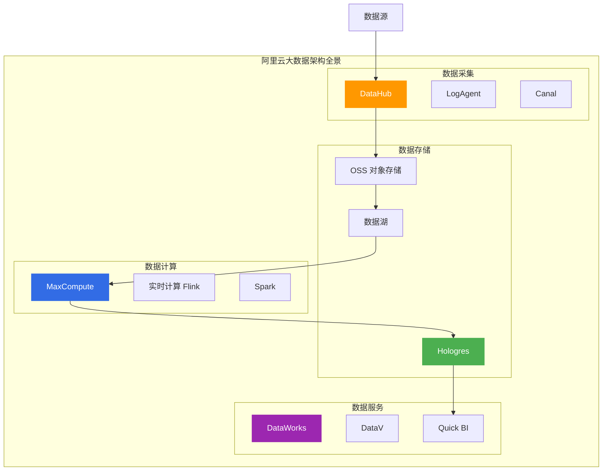
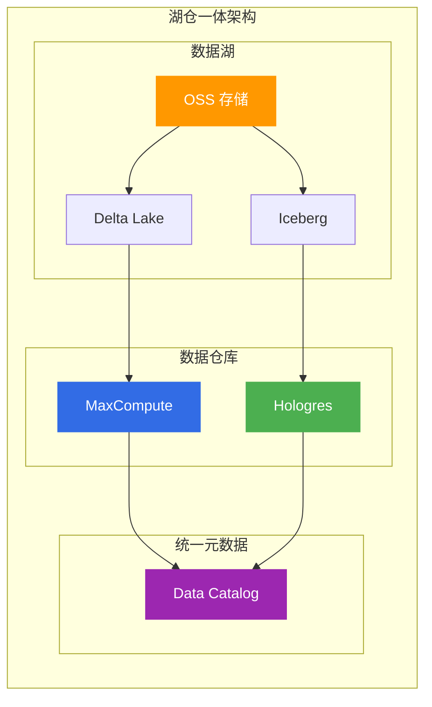
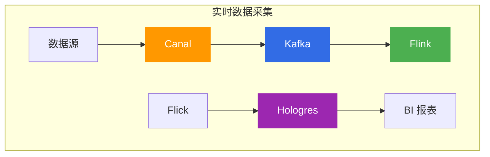
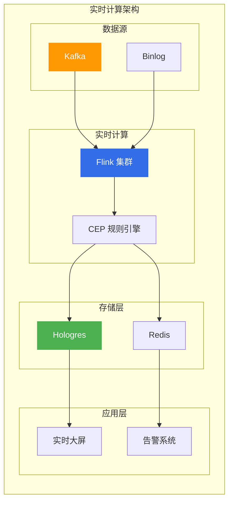
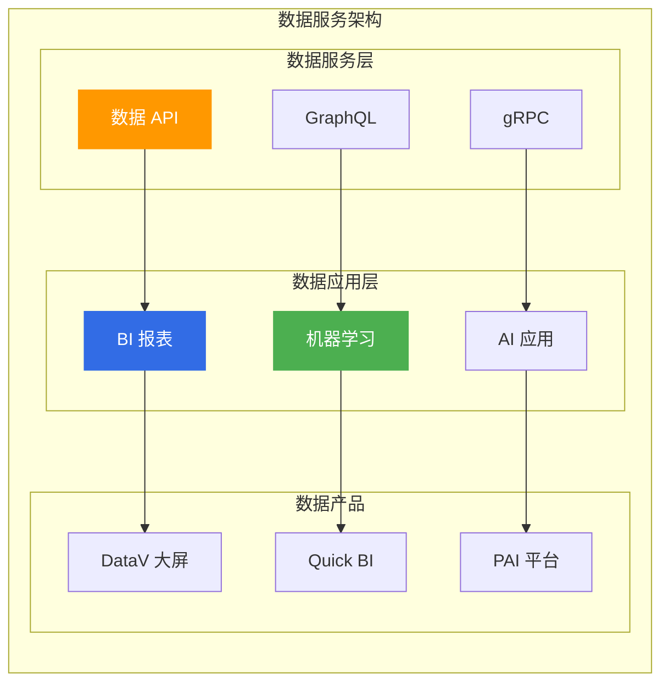

# 阿里云大数据架构方案

> 面向架构师的大数据架构方案指南，从数据采集、存储、计算、治理四个维度构建企业级大数据体系。

## 大数据架构全景

---

## 一、大数据技术选型

### 1.1 大数据产品矩阵

| 产品 | 定位 | 适用场景 | 成本 |
|------|------|----------|------|
| **MaxCompute** | 离线计算 | 大规模 ETL、数据仓库 | 低 |
| **Flink** | 实时计算 | 流处理、实时分析 | 中 |
| **Hologres** | 实时数仓 | 实时分析、联邦查询 | 高 |
| **EMR** | Hadoop 生态 | Spark、Hive | 中 |
| **AnalyticDB** | 实时分析 | BI、OLAP | 高 |

### 1.2 湖仓一体架构

---

## 二、数据采集体系

### 2.1 数据采集方式

| 方式 | 数据源 | 阿里云产品 | 适用场景 |
|------|--------|------------|----------|
| **日志采集** | 应用日志 | SLS LogAgent | 日志分析 |
| **数据库同步** | RDS/MySQL | DTS/Canal | 实时同步 |
| **消息队列** | 业务事件 | Kafka/RocketMQ | 事件驱动 |
| **API 接口** | 第三方数据 | DataWorks | 数据集成 |

### 2.2 实时数据采集架构

---

## 三、数据存储体系

### 3.1 存储分层策略

| 层级 | 存储格式 | 适用场景 | 成本 |
|------|----------|----------|------|
| **热数据** | Hologres | 实时查询 | 高 |
| **温数据** | MaxCompute | 离线分析 | 中 |
| **冷数据** | OSS 归档 | 长期存储 | 低 |

### 3.2 数据湖格式对比

| 格式 | 特点 | 适用场景 |
|------|------|----------|
| **Delta Lake** | ACID 事务、时间旅行 | 数据仓库 |
| **Iceberg** | 开放格式、高性能 | 多引擎查询 |
| **Hudi** | 增量处理、CDC | 实时数据湖 |

---

## 四、数据计算体系

### 4.1 计算引擎选型

| 引擎 | 计算类型 | 延迟 | 适用场景 |
|------|----------|------|----------|
| **MaxCompute** | 批处理 | 分钟级 | 大规模 ETL |
| **Flink** | 流处理 | 秒级 | 实时计算 |
| **Spark** | 批流一体 | 秒级 | 通用计算 |
| **Hologres** | OLAP | 毫秒级 | 实时分析 |

### 4.2 实时计算架构

---

## 五、数据治理体系

### 5.1 数据治理框架

| 治理领域 | 内容 | 阿里云产品 |
|----------|------|------------|
| **元数据管理** | 数据字典、血缘关系 | Data Catalog |
| **数据质量** | 质量规则、质量监控 | DataWorks |
| **数据安全** | 加密、脱敏、权限 | KMS/DSC |
| **数据生命周期** | 归档、清理、保留 | DataWorks |

### 5.2 数据质量规则

| 规则类型 | 说明 | 示例 |
|----------|------|------|
| **完整性** | 数据不缺失 | 非空检查 |
| **准确性** | 数据正确 | 范围检查 |
| **一致性** | 数据一致 | 唯一性检查 |
| **及时性** | 数据及时 | 时效性检查 |

---

## 六、数据服务与应用

### 6.1 数据服务架构

---

## 七、架构师面试要点

### 7.1 高频面试题

1. **数据湖 vs 数据仓库?**
   - 数据湖：原始数据、Schema-on-Read
   - 数据仓库：结构化数据、Schema-on-Write

2. **如何设计实时数据管道?**
   - Kafka + Flink + Hologres
   - 低延迟、高吞吐

3. **数据治理核心要素?**
   - 元数据管理
   - 数据质量
   - 数据安全
   - 生命周期管理

---

## 八、相关文档

- [14-大数据产品选型.md](14-大数据产品选型.md) — 大数据产品对比
- [11-数据库产品选型.md](11-数据库产品选型.md) — 数据库产品对比
- [10-存储产品选型.md](10-存储产品选型.md) — 存储产品对比

---

> **文档版本**: v1.0  
> **最后更新**: 2026-08-23  
> **适用对象**: 云原生架构师、数据架构师、技术决策者
