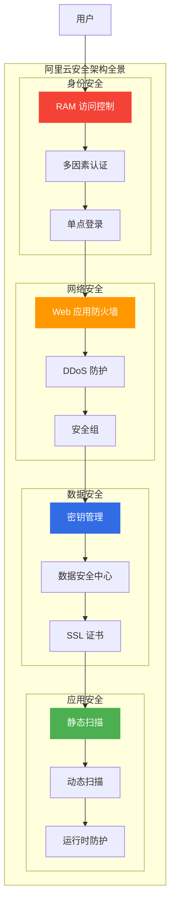
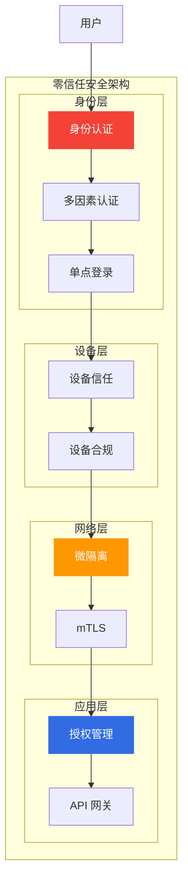
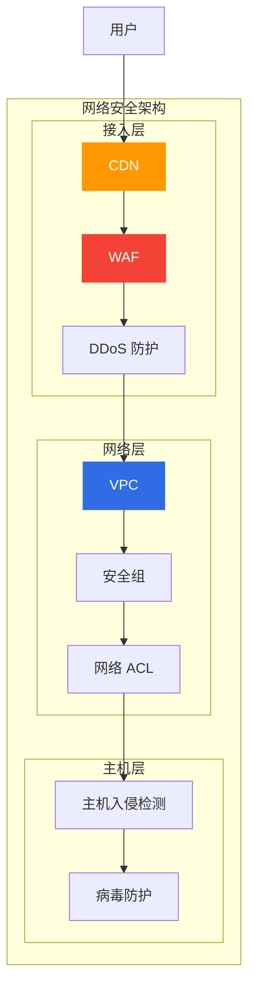
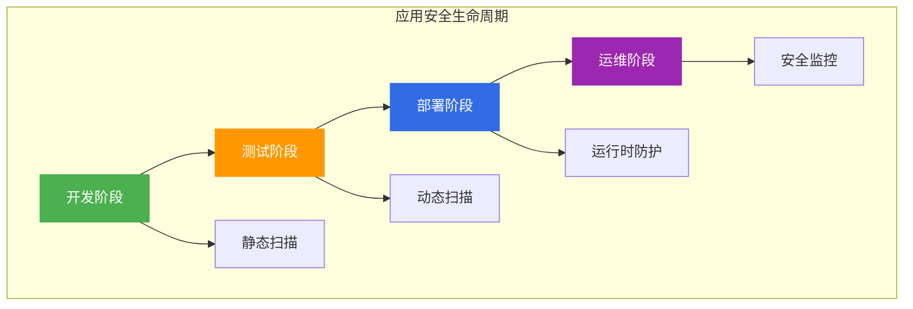
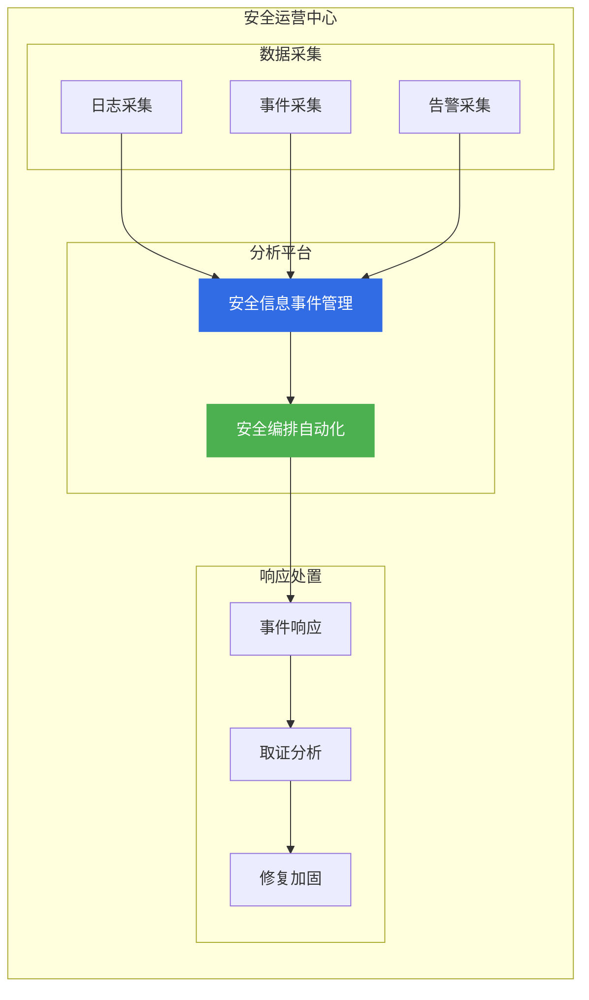

# 阿里云安全架构设计

> 面向架构师的安全架构设计指南，从身份安全、网络安全、数据安全、应用安全四个维度构建企业级安全体系。

## 安全架构全景



---

## 一、零信任安全架构

### 1.1 零信任原则

| 原则 | 说明 | 阿里云产品 |
|------|------|------------|
| **永不信任** | 默认不信任任何请求 | RAM |
| **持续验证** | 持续验证身份和权限 | MFA |
| **最小权限** | 最小化权限授予 | RAM Policy |
| **假设泄露** | 假设已被入侵 | 微隔离 |

### 1.2 零信任架构



---

## 二、身份与访问管理

### 2.1 RAM 访问控制

| 能力 | 说明 | 最佳实践 |
|------|------|----------|
| **用户管理** | 创建和管理用户 | 按角色创建用户 |
| **权限管理** | 授权和撤销权限 | 最小权限原则 |
| **角色管理** | 跨账号访问 | 使用 RAM 角色 |
| **策略管理** | 自定义策略 | JSON 策略语言 |

### 2.2 权限策略示例

```json
{
  "Version": "1",
  "Statement": [
    {
      "Effect": "Allow",
      "Action": [
        "ecs:Describe*",
        "rds:Describe*"
      ],
      "Resource": "*",
      "Condition": {
        "IpAddress": {
          "acs:SourceIp": ["192.168.1.0/24"]
        }
      }
    }
  ]
}
```

---

## 三、网络安全

### 3.1 网络安全产品矩阵

| 产品 | 定位 | 适用场景 |
|------|------|----------|
| **WAF** | Web 应用防火墙 | 防护 SQL 注入、XSS |
| **DDoS** | DDoS 防护 | 防护流量攻击 |
| **安全组** | 虚拟防火墙 | 实例级访问控制 |
| **网络 ACL** | 子网防火墙 | 子网级访问控制 |

### 3.2 网络安全架构



---

## 四、数据安全

### 4.1 数据安全体系

| 安全层 | 措施 | 阿里云产品 |
|--------|------|------------|
| **传输加密** | HTTPS/TLS | SSL 证书 |
| **存储加密** | 服务端加密 | KMS |
| **数据脱敏** | 动态脱敏 | DSC |
| **数据备份** | 定期备份 | DBS |

### 4.2 数据分类分级

| 级别 | 定义 | 保护措施 |
|------|------|----------|
| **公开** | 可公开数据 | 基本保护 |
| **内部** | 内部使用数据 | 访问控制 |
| **机密** | 敏感业务数据 | 加密+脱敏 |
| **绝密** | 核心商业数据 | 最高级保护 |

---

## 五、应用安全

### 5.1 应用安全生命周期



### 5.2 安全开发实践

| 实践 | 说明 | 工具 |
|------|------|------|
| **SAST** | 静态代码扫描 | 代码扫描 |
| **DAST** | 动态应用测试 | 漏洞扫描 |
| **SCA** | 开源组件扫描 | 成分分析 |
| **RASP** | 运行时防护 | 应用防护 |

---

## 六、合规与审计

### 6.1 合规标准

| 标准 | 适用场景 | 阿里云产品 |
|------|----------|------------|
| **等保 2.0** | 国内企业 | 安全合规 |
| **GDPR** | 欧盟业务 | 数据保护 |
| **PCI DSS** | 支付行业 | 支付安全 |
| **ISO 27001** | 信息安全管理 | 安全认证 |

### 6.2 审计体系

| 审计类型 | 内容 | 阿里云产品 |
|----------|------|------------|
| **操作审计** | API 调用记录 | ActionTrail |
| **登录审计** | 登录行为记录 | RAM |
| **数据审计** | 数据访问记录 | DSC |
| **配置审计** | 资源配置变更 | 配置审计 |

---

## 七、安全运营中心

### 7.1 安全运营架构



---

## 八、架构师面试要点

### 8.1 高频面试题

1. **零信任安全架构核心原则?**
   - 永不信任、持续验证
   - 最小权限、假设泄露

2. **如何设计数据安全体系?**
   - 传输加密、存储加密
   - 数据脱敏、访问控制

3. **安全合规核心要素?**
   - 等保 2.0、GDPR
   - 审计日志、定期评估

---

## 九、相关文档

- [13-安全产品选型.md](13-安全产品选型.md) — 安全产品对比
- [12-网络产品选型.md](12-网络产品选型.md) — 网络产品对比

---

> **文档版本**: v1.0  
> **最后更新**: 2026-08-23  
> **适用对象**: 云原生架构师、安全架构师、技术决策者
