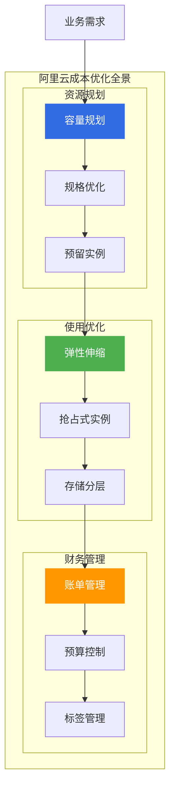
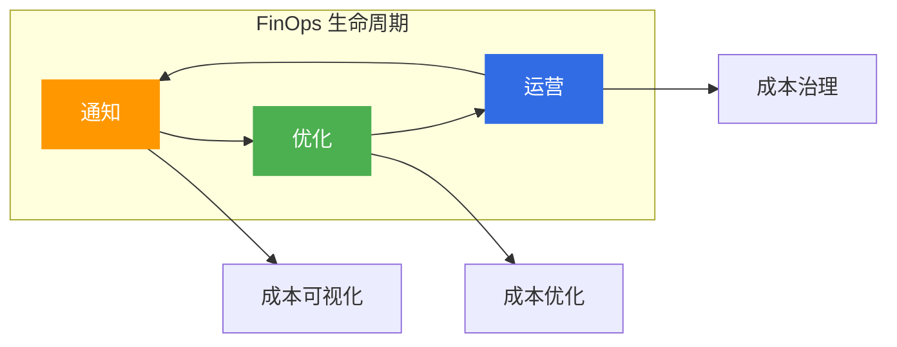
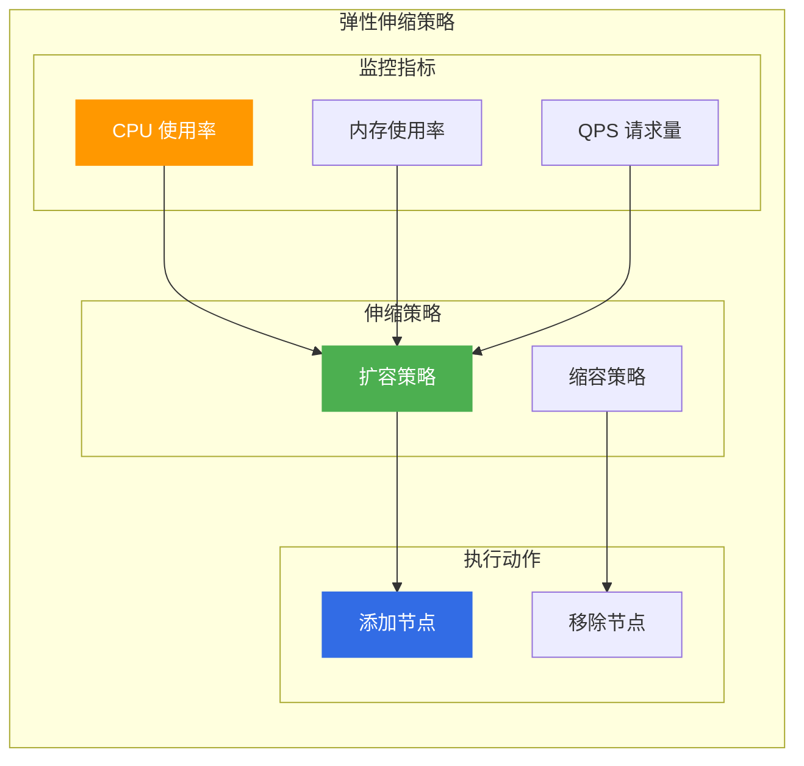
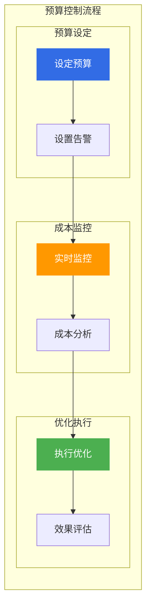

# 阿里云成本优化方案

> 面向架构师的成本优化方案指南，从资源规划、使用优化、财务管理三个维度构建企业级成本优化体系。

## 成本优化全景



---

## 一、FinOps 实践框架

### 1.1 FinOps 核心原则

| 原则 | 说明 | 实践 |
|------|------|------|
| **团队协作** | 业务、技术、财务协作 | 成本分摊 |
| **数据驱动** | 基于数据决策 | 成本分析 |
| **实时优化** | 持续优化成本 | 自动化工具 |
| **价值导向** | 关注业务价值 | ROI 分析 |

### 1.2 FinOps 生命周期



---

## 二、资源规划优化

### 2.1 规格优化

| 优化策略 | 说明 | 适用场景 |
|----------|------|----------|
| **规格族选择** | 选择合适规格族 | 通用型 vs 计算型 |
| **规格族升级** | 升级到新一代规格族 | g7 → g8 |
| **规格调整** | 根据负载调整规格 | CPU/内存配比 |

### 2.2 容量规划方法

| 方法 | 说明 | 工具 |
|------|------|------|
| **历史分析** | 基于历史数据预测 | CloudMonitor |
| **趋势预测** | 基于增长趋势预测 | 成本管家 |
| **压力测试** | 通过压测确定容量 | PTS |

---

## 三、计算成本优化

### 3.1 计费模式选择

| 计费模式 | 适用场景 | 成本节省 |
|----------|----------|----------|
| **包年包月** | 稳定负载 | 30-50% |
| **按量付费** | 临时测试 | 按需使用 |
| **抢占式实例** | 可中断任务 | 50-90% |
| **预留实例券** | 稳定+弹性混合 | 30-60% |

### 3.2 弹性伸缩策略



### 3.3 容器成本优化

| 优化策略 | 说明 | 阿里云产品 |
|----------|------|------------|
| **节点池管理** | 按业务划分节点池 | ACK |
| **资源画像** | 智能推荐规格 | 成本管家 |
| **Pod 优化** | 优化 Pod 资源配置 | ACK |
| **闲置检测** | 检测闲置资源 | 成本管家 |

---

## 四、存储成本优化

### 4.1 存储分层策略

| 存储类型 | 适用场景 | 成本 |
|----------|----------|------|
| **标准存储** | 频繁访问 | 高 |
| **低频访问** | 偶尔访问 | 中 |
| **归档存储** | 很少访问 | 低 |
| **冷归档** | 几乎不访问 | 极低 |

### 4.2 存储生命周期管理

```yaml
# OSS 生命周期配置示例
LifecycleRule:
  - Prefix: "logs/"
    Status: Enabled
    Transitions:
      - Days: 30
        StorageClass: IA
      - Days: 90
        StorageClass: Archive
      - Days: 365
        StorageClass: ColdArchive
    Expiration:
      Days: 730
```

---

## 五、网络成本优化

### 5.1 带宽优化策略

| 策略 | 说明 | 成本节省 |
|------|------|----------|
| **共享带宽** | 多 EIP 共享带宽 | 40% |
| **CDN 加速** | 静态资源 CDN 加速 | 70% |
| **流量包** | 购买流量包 | 30% |
| **NAT 网关** | 多 ECS 共享 NAT | 50% |

### 5.2 计费模式对比

| 计费模式 | 适用场景 | 成本 |
|----------|----------|------|
| **按量付费** | 波动流量 | 按需 |
| **带宽包** | 稳定流量 | 低 |
| **流量包** | 不定流量 | 中 |

---

## 六、数据库成本优化

### 6.1 数据库选型优化

| 场景 | 推荐产品 | 成本考虑 |
|------|----------|----------|
| **开发测试** | RDS 基础版 | 低成本 |
| **一般生产** | RDS 高可用版 | 中等成本 |
| **核心生产** | PolarDB | 高性能 |
| **缓存** | Redis 标准版 | 按需扩展 |

### 6.2 数据库优化策略

| 策略 | 说明 | 工具 |
|------|------|------|
| **规格优化** | 根据负载调整规格 | DAS |
| **存储优化** | 优化存储使用 | DAS |
| **查询优化** | 优化慢查询 | DAS |
| **备份优化** | 优化备份策略 | DBS |

---

## 七、成本治理体系

### 7.1 标签管理

| 标签维度 | 说明 | 示例 |
|----------|------|------|
| **部门** | 成本归属部门 | dept:engineering |
| **项目** | 成本归属项目 | project:web-app |
| **环境** | 环境类型 | env:production |
| **所有者** | 资源所有者 | owner:team-a |

### 7.2 预算控制



---

## 八、架构师面试要点

### 8.1 高频面试题

1. **如何进行云成本优化?**
   - 规格优化、计费模式选择
   - 弹性伸缩、存储分层

2. **FinOps 核心原则?**
   - 团队协作、数据驱动
   - 实时优化、价值导向

3. **如何建立成本治理体系?**
   - 标签管理、预算控制
   - 成本分摊、持续优化

---

## 九、相关文档

- [09-计算产品选型.md](09-计算产品选型.md) — 计算产品对比
- [10-存储产品选型.md](10-存储产品选型.md) — 存储产品对比
- [11-数据库产品选型.md](11-数据库产品选型.md) — 数据库产品对比

---

> **文档版本**: v1.0  
> **最后更新**: 2026-08-23  
> **适用对象**: 云原生架构师、FinOps 工程师、技术决策者
