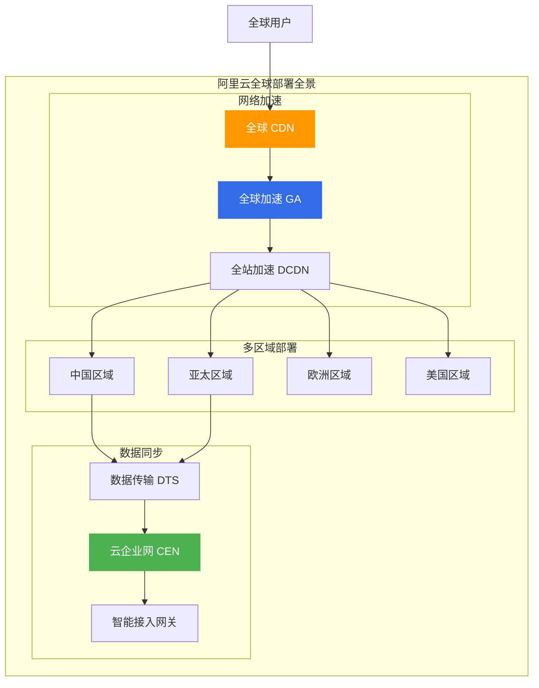
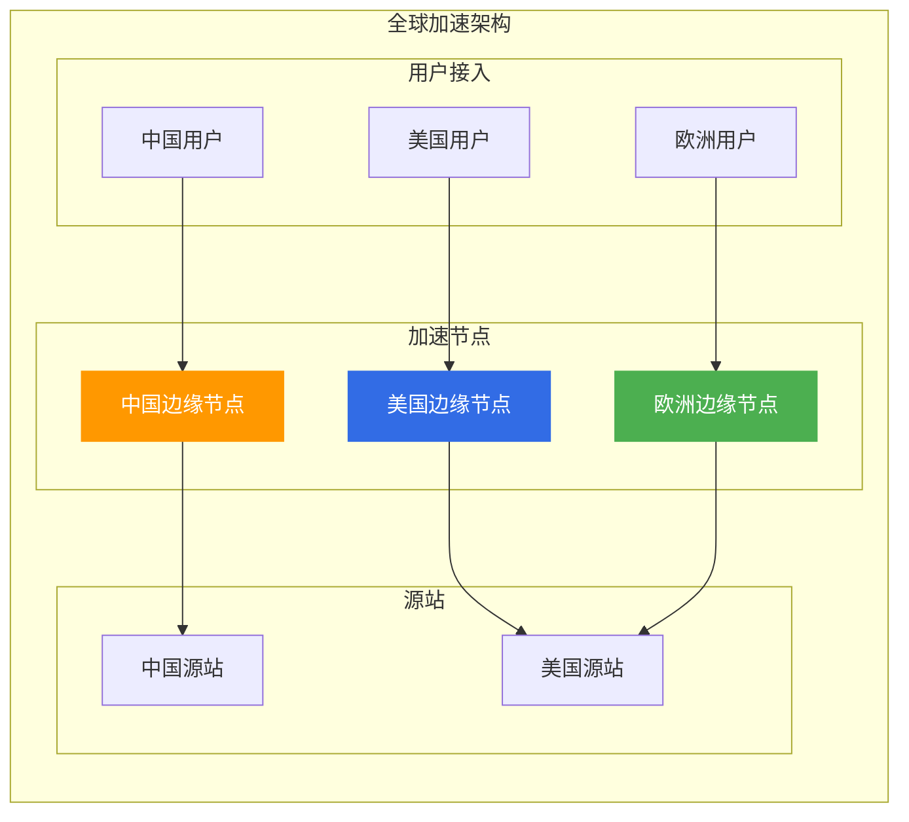
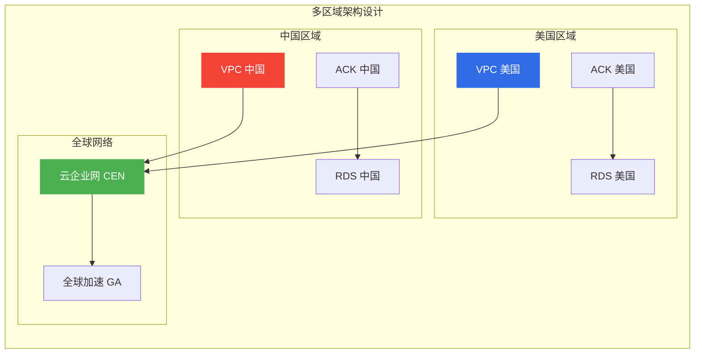
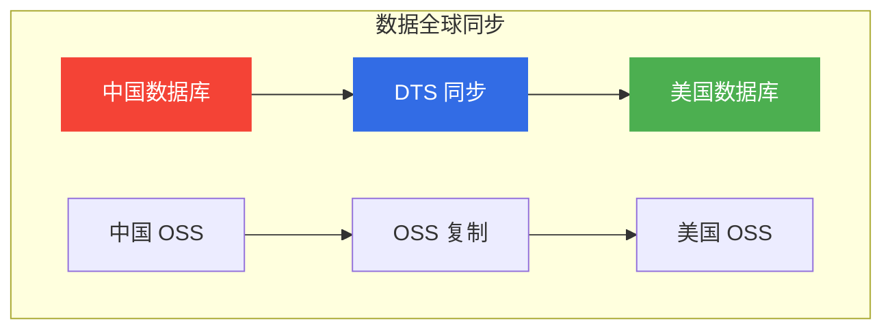
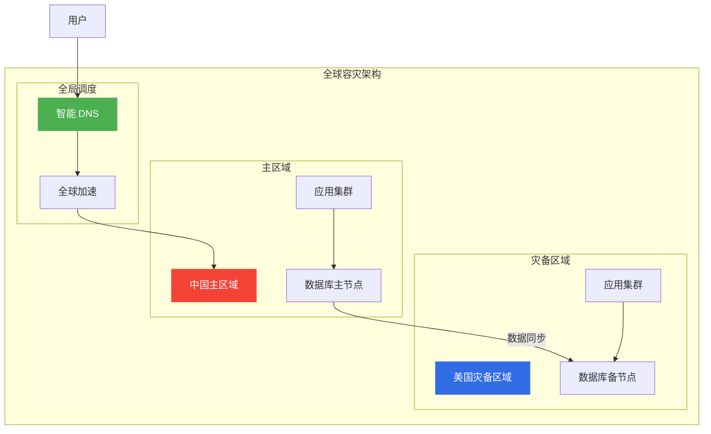
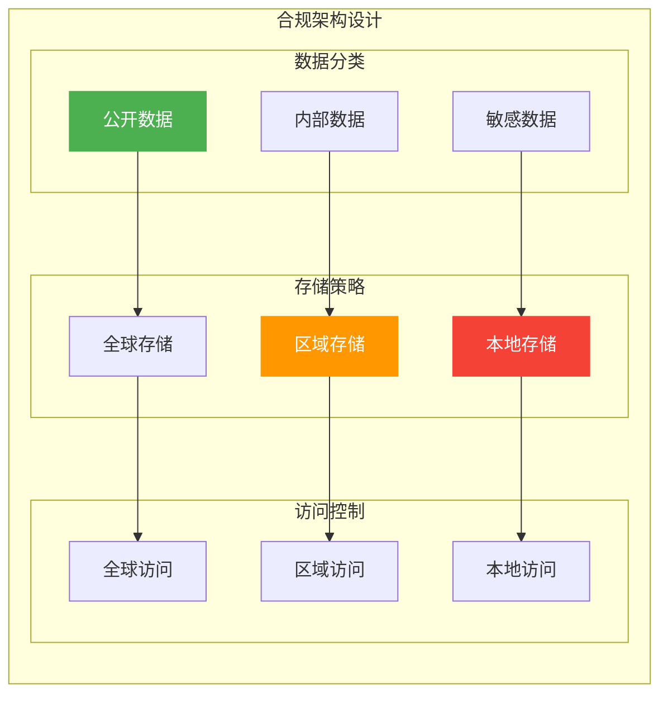

# 阿里云全球部署方案

> 面向架构师的全球部署方案指南，从网络加速、数据同步、应用部署三个维度构建企业级全球部署体系。

## 全球部署全景

---

## 一、全球网络架构

### 1.1 全球网络产品矩阵

| 产品 | 定位 | 适用场景 |
|------|------|----------|
| **CDN** | 内容分发 | 静态资源加速 |
| **GA** | 全球加速 | 动态应用加速 |
| **DCDN** | 全站加速 | 动静分离加速 |
| **CEN** | 云企业网 | 多区域互联 |

### 1.2 全球加速架构

---

## 二、多区域部署策略

### 2.1 部署模式对比

| 模式 | 说明 | 适用场景 | 成本 |
|------|------|----------|------|
| **单区域** | 单区域部署 | 国内业务 | 低 |
| **多区域** | 多区域独立部署 | 全球业务 | 中 |
| **全球统一** | 全球统一架构 | 跨国企业 | 高 |

### 2.2 多区域架构设计

---

## 三、数据全球同步

### 3.1 数据同步方案

| 方案 | 说明 | 适用场景 | 延迟 |
|------|------|----------|------|
| **DTS 同步** | 实时数据同步 | 数据库同步 | 秒级 |
| **OSS 复制** | 跨区域复制 | 文件同步 | 分钟级 |
| **消息队列** | 事件驱动同步 | 事件同步 | 秒级 |

### 3.2 数据同步架构

---

## 四、CDN 全球加速

### 4.1 CDN 加速策略

| 策略 | 说明 | 适用场景 |
|------|------|----------|
| **静态加速** | 图片、CSS、JS | 网站加速 |
| **动态加速** | API、动态内容 | 应用加速 |
| **全站加速** | 动静分离 | 复杂应用 |
| **安全加速** | DDoS 防护 + CDN | 安全场景 |

### 4.2 CDN 配置最佳实践

| 配置项 | 建议 | 说明 |
|--------|------|------|
| **缓存策略** | 静态资源长期缓存 | 提高命中率 |
| **回源策略** | 智能回源 | 降低回源压力 |
| **HTTPS** | 全站 HTTPS | 安全加密 |
| **HTTP/2** | 启用 HTTP/2 | 性能优化 |

---

## 五、全球容灾设计

### 5.1 全球容灾架构

### 5.2 容灾切换策略

| 策略 | RTO | RPO | 适用场景 |
|------|-----|-----|----------|
| **手动切换** | 小时级 | 分钟级 | 非核心业务 |
| **半自动切换** | 分钟级 | 秒级 | 一般业务 |
| **全自动切换** | 秒级 | 0 | 核心业务 |

---

## 六、合规与数据主权

### 6.1 数据主权要求

| 地区 | 要求 | 阿里云方案 |
|------|------|------------|
| **中国** | 数据不出境 | 中国区域部署 |
| **欧盟** | GDPR 合规 | 欧洲区域部署 |
| **美国** | 数据本地化 | 美国区域部署 |

### 6.2 合规架构设计

---

## 七、架构师面试要点

### 7.1 高频面试题

1. **如何设计全球部署架构?**
   - 多区域部署、CDN 加速
   - 数据同步、容灾切换

2. **全球数据同步方案?**
   - DTS 实时同步、OSS 复制
   - 消息队列事件驱动

3. **数据合规与主权?**
   - 数据本地化、GDPR 合规
   - 分类存储、访问控制

---

## 八、相关文档

- [12-网络产品选型.md](12-网络产品选型.md) — 网络产品对比
- [01-高可用架构设计.md](01-高可用架构设计.md) — 高可用架构

---

> **文档版本**: v1.0  
> **最后更新**: 2026-08-23  
> **适用对象**: 云原生架构师、全球化架构师、技术决策者
