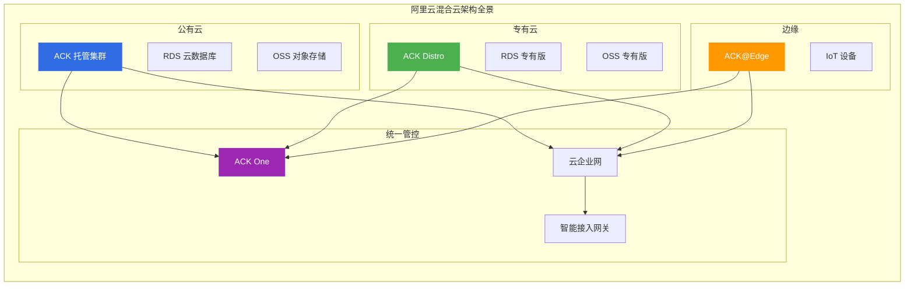
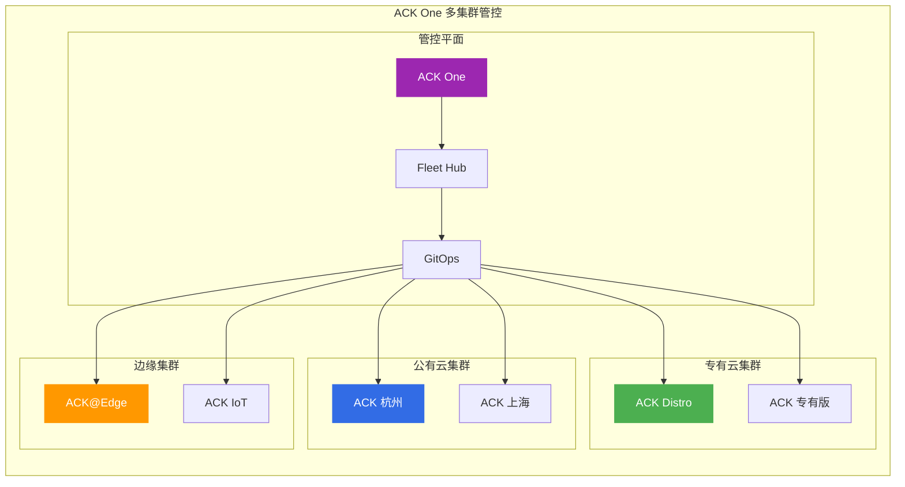
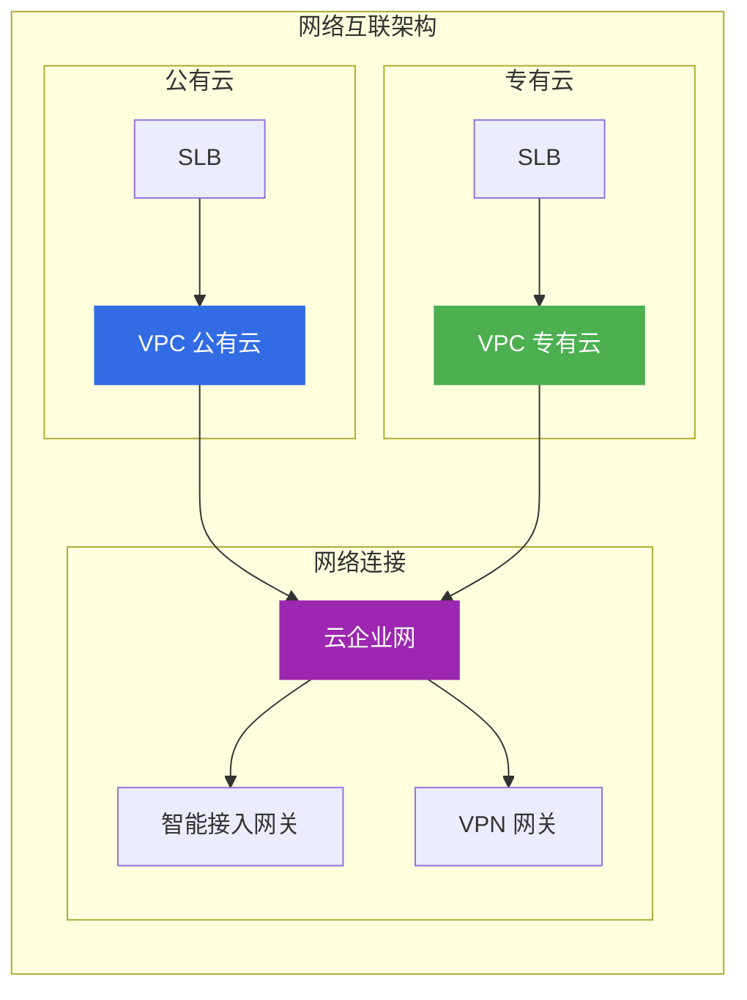
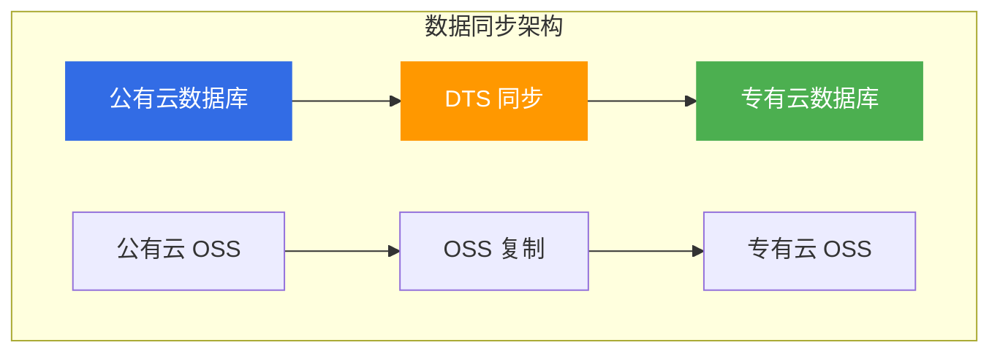
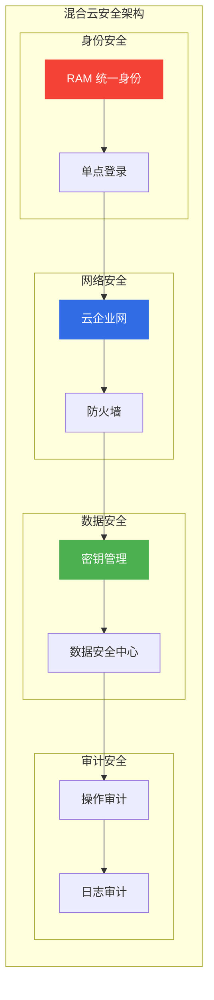
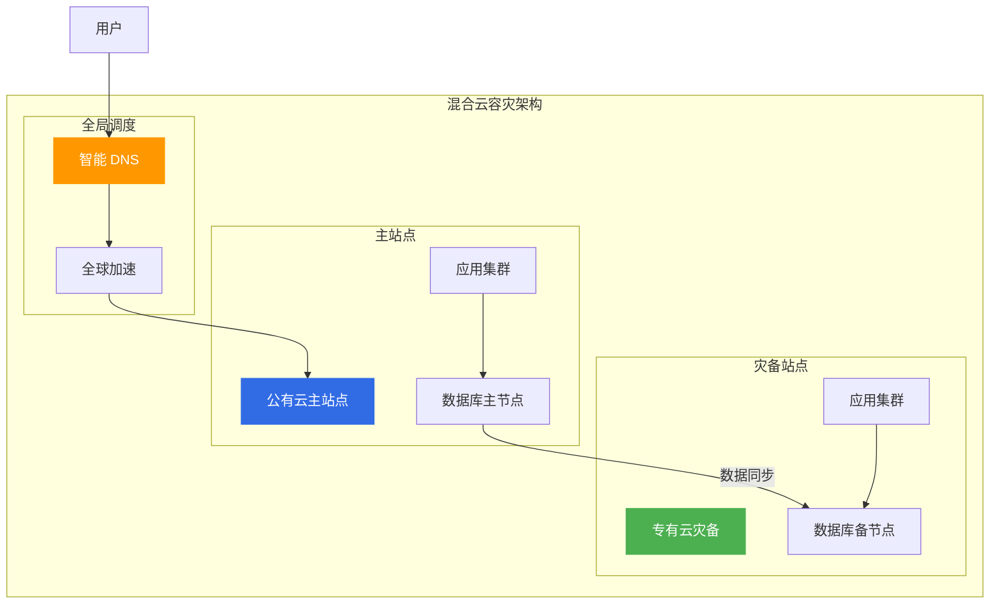

# 阿里云混合云架构方案

> 面向架构师的混合云架构方案指南，从统一管控、网络互联、数据同步三个维度构建企业级混合云体系。

## 混合云架构全景

---

## 一、混合云架构模式

### 1.1 混合云模式对比

| 模式 | 说明 | 适用场景 | 成本 |
|------|------|----------|------|
| **公有云优先** | 核心业务在公有云 | 互联网企业 | 中 |
| **专有云优先** | 核心业务在专有云 | 金融/政企 | 高 |
| **混合部署** | 业务按需部署 | 传统企业转型 | 中高 |

### 1.2 混合云架构设计原则

| 原则 | 说明 | 实践 |
|------|------|------|
| **统一管控** | 统一管理公有云和专有云 | ACK One |
| **网络互联** | 安全可靠的网络连接 | CEN/SAG |
| **数据同步** | 数据一致性保障 | DTS |
| **安全合规** | 满足安全合规要求 | 专有云部署 |

---

## 二、统一管控架构

### 2.1 ACK One 多集群管控

### 2.2 统一管控能力

| 能力 | 说明 | 阿里云产品 |
|------|------|------------|
| **统一部署** | 一键部署到多集群 | ACK One GitOps |
| **统一监控** | 多集群统一监控 | ARMS |
| **统一日志** | 多集群统一日志 | SLS |
| **统一策略** | 多集群统一策略 | ACK One Policy |

---

## 三、网络互联架构

### 3.1 网络互联方案

| 方案 | 说明 | 适用场景 |
|------|------|----------|
| **专线** | 物理专线连接 | 高带宽、低延迟 |
| **VPN** | 加密隧道连接 | 成本敏感 |
| **智能接入网关** | SD-WAN 接入 | 分支机构 |
| **云企业网** | 全球网络互联 | 多区域互联 |

### 3.2 网络互联架构

---

## 四、数据同步架构

### 4.1 数据同步方案

| 方案 | 说明 | 适用场景 | 延迟 |
|------|------|----------|------|
| **DTS 同步** | 实时数据同步 | 数据库同步 | 秒级 |
| **OSS 复制** | 跨区域复制 | 文件同步 | 分钟级 |
| **消息队列** | 事件驱动同步 | 事件同步 | 秒级 |

### 4.2 数据同步架构

---

## 五、安全合规架构

### 5.1 安全合规要求

| 要求 | 说明 | 阿里云方案 |
|------|------|------------|
| **数据本地化** | 数据不出境 | 专有云部署 |
| **等保合规** | 满足等保要求 | 专有云合规 |
| **访问控制** | 统一权限管理 | RAM |
| **审计日志** | 操作审计 | ActionTrail |

### 5.2 安全架构设计

---

## 六、容灾与高可用

### 6.1 混合云容灾架构

### 6.2 容灾切换策略

| 策略 | RTO | RPO | 适用场景 |
|------|-----|-----|----------|
| **手动切换** | 小时级 | 分钟级 | 非核心业务 |
| **半自动切换** | 分钟级 | 秒级 | 一般业务 |
| **全自动切换** | 秒级 | 0 | 核心业务 |

---

## 七、架构师面试要点

### 7.1 高频面试题

1. **混合云架构核心原则?**
   - 统一管控、网络互联
   - 数据同步、安全合规

2. **如何设计混合云网络?**
   - 专线/VPN/智能接入网关
   - 云企业网互联

3. **混合云容灾方案?**
   - 主备切换、数据同步
   - 全局调度、自动切换

---

## 八、相关文档

- [09-计算产品选型.md](09-计算产品选型.md) — 计算产品对比
- [12-网络产品选型.md](12-网络产品选型.md) — 网络产品对比
- [01-高可用架构设计.md](01-高可用架构设计.md) — 高可用架构

---

> **文档版本**: v1.0  
> **最后更新**: 2026-08-23  
> **适用对象**: 云原生架构师、混合云架构师、技术决策者
