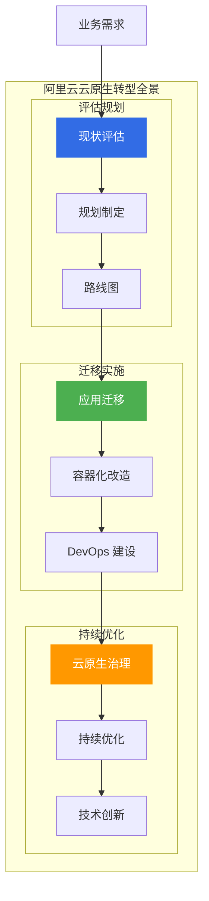
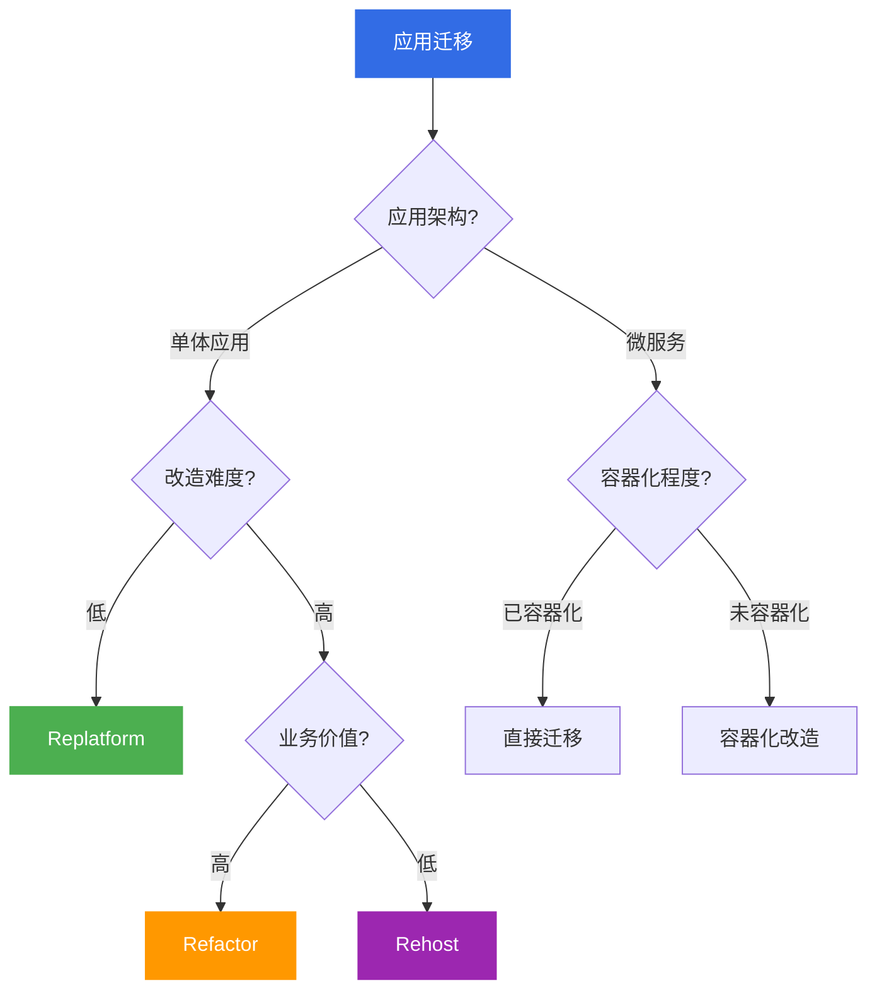
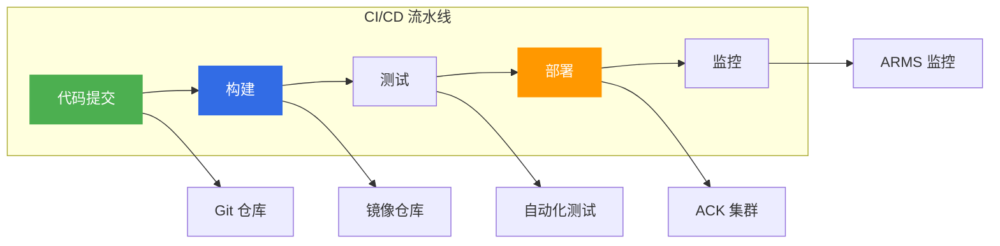
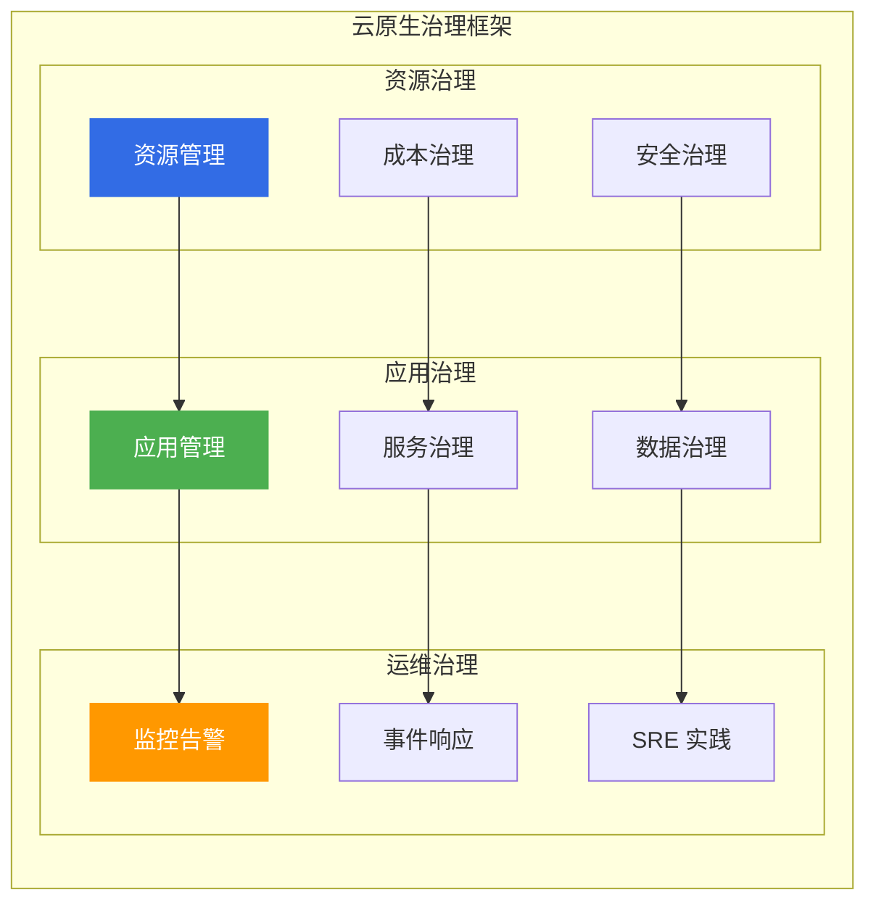
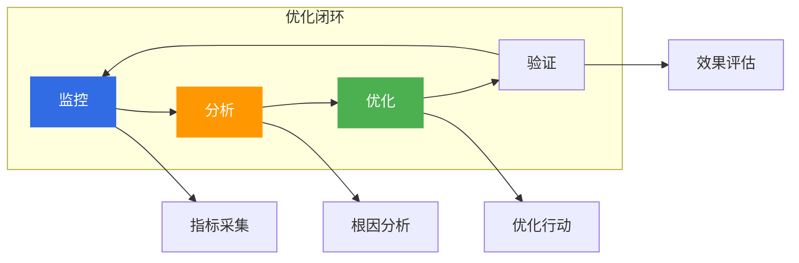

# 阿里云云原生转型路径

> 面向架构师的云原生转型路径指南，从评估规划、迁移实施、持续优化三个维度构建企业级云原生转型体系。

## 云原生转型全景



---

## 一、云原生成熟度评估

### 1.1 成熟度模型

| 级别 | 特征 | 阿里云产品 |
|------|------|------------|
| **L1 传统架构** | 单体应用、手动部署 | ECS |
| **L2 初步云化** | 应用上云、基础自动化 | ACK 托管版 |
| **L3 容器化** | 容器化部署、CI/CD | ACK + ACR |
| **L4 微服务化** | 微服务架构、服务治理 | MSE + ASM |
| **L5 云原生** | 全面云原生、智能化 | ACK One + ARMS |

### 1.2 评估维度

| 维度 | 评估内容 | 评分标准 |
|------|----------|----------|
| **基础设施** | 云化程度、自动化水平 | 1-5 分 |
| **应用架构** | 容器化、微服务化 | 1-5 分 |
| **运维体系** | 监控、告警、自愈 | 1-5 分 |
| **开发流程** | CI/CD、DevOps | 1-5 分 |

---

## 二、迁移策略

### 2.1 迁移策略对比

| 策略 | 说明 | 适用场景 | 风险 |
|------|------|----------|------|
| **Rehost** | 直接迁移 | 快速上云 | 低 |
| **Replatform** | 平台优化 | 中等改造 | 中 |
| **Refactor** | 重构改造 | 长期规划 | 高 |
| **Rebuild** | 重新构建 | 全新架构 | 高 |

### 2.2 迁移决策树



---

## 三、容器化改造

### 3.1 容器化路径

| 阶段 | 内容 | 阿里云产品 |
|------|------|------------|
| **镜像构建** | 应用打包为镜像 | ACR |
| **编排部署** | K8s 编排部署 | ACK |
| **服务治理** | 服务注册发现 | MSE |
| **可观测性** | 监控告警 | ARMS |

### 3.2 容器化最佳实践

```yaml
# 容器化应用配置示例
apiVersion: apps/v1
kind: Deployment
metadata:
  name: web-app
spec:
  replicas: 3
  selector:
    matchLabels:
      app: web-app
  template:
    metadata:
      labels:
        app: web-app
    spec:
      containers:
        - name: web-app
          image: registry.cn-hangzhou.aliyuncs.com/web-app:v1.0
          resources:
            requests:
              cpu: "100m"
              memory: "128Mi"
            limits:
              cpu: "500m"
              memory: "512Mi"
          livenessProbe:
            httpGet:
              path: /health
              port: 8080
          readinessProbe:
            httpGet:
              path: /ready
              port: 8080
```

---

## 四、DevOps 建设

### 4.1 DevOps 工具链

| 阶段 | 工具 | 阿里云产品 |
|------|------|------------|
| **代码管理** | Git | 云效 Codeup |
| **持续集成** | Jenkins/云效 | 云效 Flow |
| **持续部署** | ArgoCD | ACK GitOps |
| **监控反馈** | Prometheus | ARMS |

### 4.2 CI/CD 流水线



---

## 五、微服务化改造

### 5.1 微服务拆分策略

| 策略 | 说明 | 适用场景 |
|------|------|----------|
| **按业务拆分** | 按业务领域拆分 | 业务边界清晰 |
| **按团队拆分** | 按团队职责拆分 | 团队自治 |
| **按数据拆分** | 按数据模型拆分 | 数据独立 |

### 5.2 微服务治理

| 治理能力 | 说明 | 阿里云产品 |
|----------|------|------------|
| **服务注册** | 服务注册发现 | Nacos |
| **配置管理** | 配置中心 | Nacos |
| **流量治理** | 限流降级 | Sentinel |
| **链路追踪** | 分布式追踪 | ARMS |

---

## 六、云原生治理体系

### 6.1 云原生治理框架



### 6.2 治理最佳实践

| 治理领域 | 实践 | 阿里云产品 |
|----------|------|------------|
| **资源治理** | 标签管理、配额管理 | 控制台 |
| **成本治理** | 成本分析、预算控制 | 成本管家 |
| **安全治理** | 安全基线、合规检查 | 安全中心 |
| **应用治理** | 应用目录、版本管理 | ACR |

---

## 七、持续优化

### 7.1 优化方向

| 方向 | 内容 | 阿里云产品 |
|------|------|------------|
| **性能优化** | 应用性能优化 | ARMS |
| **成本优化** | 资源成本优化 | 成本管家 |
| **安全优化** | 安全防护优化 | 安全中心 |
| **运维优化** | 运维效率优化 | SLS |

### 7.2 优化闭环



---

## 八、架构师面试要点

### 8.1 高频面试题

1. **云原生成熟度模型?**
   - L1-L5 五个级别
   - 基础设施、应用架构、运维体系、开发流程

2. **应用迁移策略?**
   - Rehost/Replatform/Refactor/Rebuild
   - 根据应用架构和改造难度选择

3. **DevOps 核心实践?**
   - CI/CD 流水线
   - 自动化测试、自动化部署

---

## 九、相关文档

- [09-计算产品选型.md](09-计算产品选型.md) — 计算产品对比
- [02-微服务架构方案.md](02-微服务架构方案.md) — 微服务架构
- [01-高可用架构设计.md](01-高可用架构设计.md) — 高可用架构

---

> **文档版本**: v1.0  
> **最后更新**: 2026-08-23  
> **适用对象**: 云原生架构师、技术决策者、转型负责人
