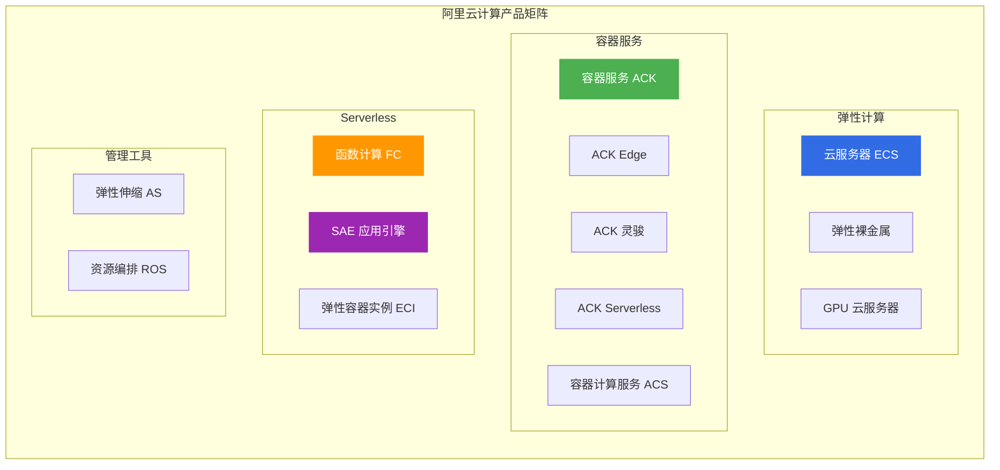
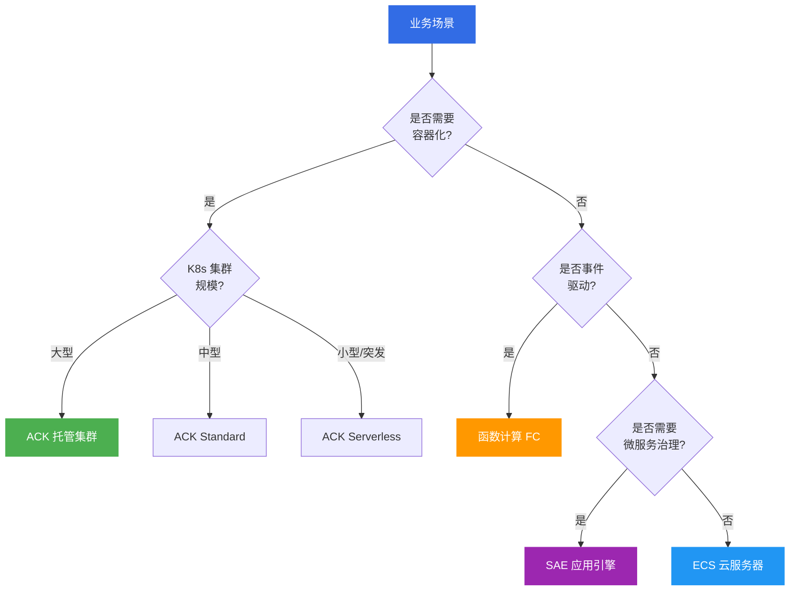
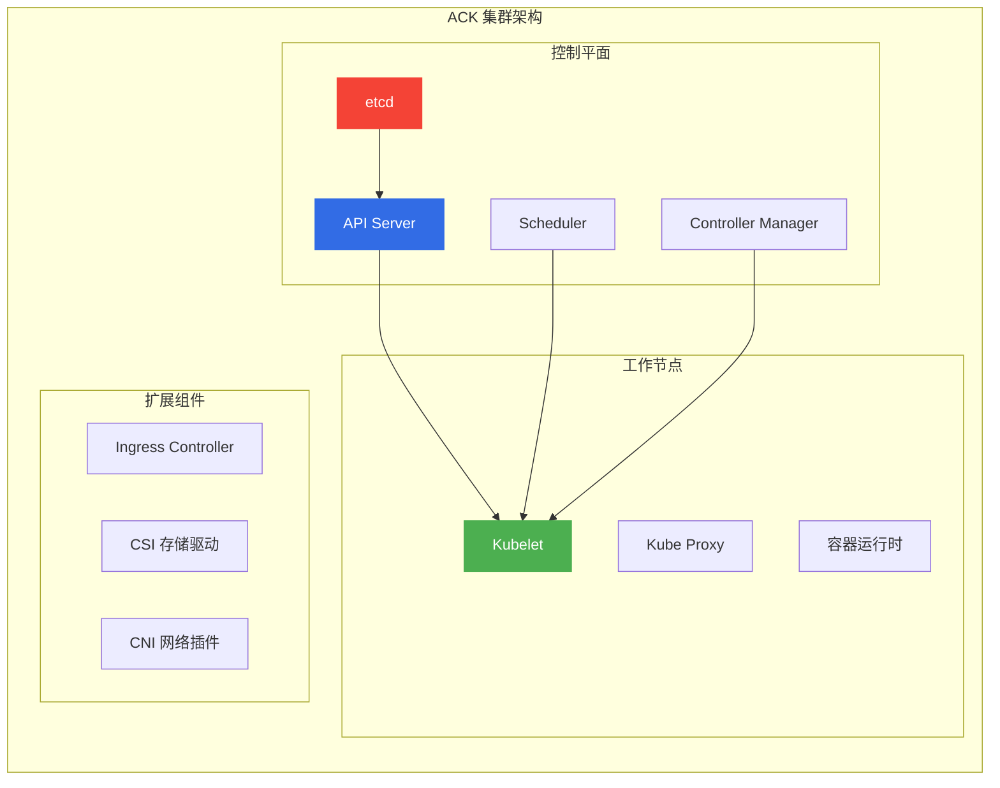
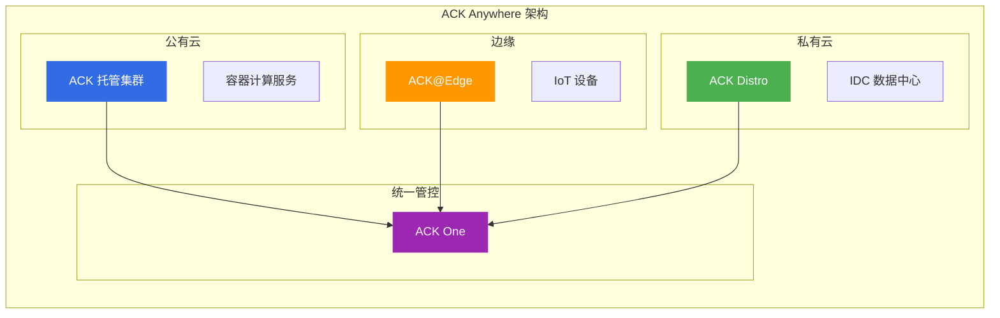
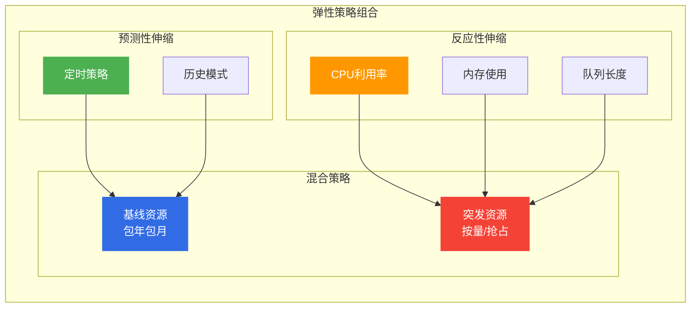

# 阿里云计算产品选型指南

> 面向架构师的计算产品选型决策框架，帮助在不同业务场景下做出最优选择。

## 产品矩阵总览



---

## 一、产品对比矩阵

### 1.1 核心维度对比

| 产品 | 定位 | 适用场景 | 成本模型 | 运维复杂度 | 弹性能力 |
|------|------|----------|----------|------------|----------|
| **ECS** | 通用计算 | Web应用、企业应用 | 包年包月/按量 | 高 | 手动/AS |
| **ACK** | 容器编排 | 微服务、CI/CD | 集群费+节点费 | 中 | 自动扩缩 |
| **FC** | 函数计算 | 事件驱动、API | 按调用计费 | 低 | 秒级弹性 |
| **SAE** | 应用PaaS | Spring Cloud迁移 | 应用实例费 | 低 | 秒级弹性 |
| **ECI** | 免运维容器 | 弹性伸缩、CI/CD | 按实例计费 | 低 | 秒级弹性 |
| **ASK** | Serverless K8s | 事件驱动 | Pod资源费 | 低 | 秒级弹性 |

### 1.2 适用场景决策树



---

## 二、产品深度分析

### 2.1 云服务器 ECS

**核心定位**: 通用弹性计算基础设施

| 规格族 | 适用场景 | 特点 |
|--------|----------|------|
| **ecs.g** | 通用型 | Web应用、中小型数据库 |
| **ecs.c** | 计算型 | 批处理、科学计算 |
| **ecs.r** | 内存型 | 缓存、大数据分析 |
| **ecs.i** | 本地SSD型 | 高IOPS数据库 |
| **ecs.gn** | GPU型 | AI训练、图形渲染 |
| **ecs.ebm** | 裸金属 | 高性能计算、数据库 |

**选型要点**:
- ✅ 需要完全控制操作系统和网络
- ✅ 运行非容器化传统应用
- ✅ 对延迟敏感的高性能应用
- ❌ 不适合事件驱动和函数式计算

---

### 2.2 容器服务 ACK

**核心定位**: 企业级 Kubernetes 容器编排平台

| 集群类型 | 适用场景 | 特点 |
|----------|----------|------|
| **ACK 托管版** | 标准微服务 | 控制平面托管，运维简单 |
| **ACK 专有版** | 金融/政企 | 控制平面自建，完全可控 |
| **ACK Edge** | 边缘计算 | IoT、CDN节点、边缘推理 |
| **ACK 灵骏** | GPU/异构计算 | AI训练、大规模并行 |
| **ACK Serverless** | 免运维K8s | 按Pod计费，秒级弹性 |
| **ACK One** | 多集群管控 | 混合云、容灾、联邦 |

**ACK 架构图**:



**选型要点**:
- ✅ 微服务架构、需要K8s生态
- ✅ CI/CD流水线、GitOps
- ✅ 需要服务网格(ASM)和可观测性
- ❌ 简单应用、团队无K8s经验

---

### 2.5 ACK Anywhere 架构（2025-2026 新特性）

| 产品 | 定位 | 适用场景 |
|------|------|----------|
| **ACK One** | 多集群管控平台 | 混合云、容灾、联邦 |
| **ACK Distro** | 开源 K8s 发行版 | 私有云、边缘部署 |
| **ACK@Edge** | 边缘容器服务 | IoT、CDN、边缘推理 |
| **云原生AI套件** | AI 训练推理一体化 | GPU调度、分布式训练 |

**ACK Anywhere 架构图**:



**选型要点**:
- ✅ 混合云统一管控
- ✅ 边缘计算场景
- ✅ 私有云 K8s 部署
- ❌ 纯公有云场景(用标准 ACK)

---

### 2.6 ECS 最新规格族（2026 新增）

| 规格族 | 定位 | 适用场景 |
|--------|------|----------|
| **ecs.g9i** | 第九代通用型（邀测） | 高性能Web应用 |
| **EAIS** | 弹性加速计算实例 | AI推理、视频处理 |
| **ecs.ebm** | 弹性裸金属 | 数据库、高性能计算 |

---

### 2.3 函数计算 FC

**核心定位**: 事件驱动的无服务器计算

| 触发器类型 | 典型场景 |
|------------|----------|
| **OSS 事件** | 图片处理、视频转码 |
| **消息队列** | 异步任务、事件消费 |
| **HTTP 触发** | API 后端、Webhook |
| **定时触发** | 定时任务、数据同步 |
| **CDN 事件** | 边缘计算 |

**成本模型**:
```
费用 = 调用次数 × 单价 + 执行时间 × 内存配置 × 单价
```

**选型要点**:
- ✅ 事件驱动、异步任务
- ✅ API后端、Webhook
- ✅ 成本敏感、按需付费
- ❌ 长时间运行任务(>15分钟)
- ❌ 需要状态管理的应用

---

### 2.4 SAE 应用引擎

**核心定位**: 面向应用的 Serverless PaaS 平台

**核心能力**:
- 微服务治理(Sentinel、Nacos)
- 应用生命周期管理
- 全链路灰度发布
- 无需容器化即可使用

**迁移路径**:


**选型要点**:
- ✅ Spring Cloud/Dubbo应用迁移上云
- ✅ 快速微服务化但不想管理K8s
- ✅ 需要灰度发布和流量治理
- ❌ 非Java应用、需要完全控制

---

## 三、选型决策矩阵

### 3.1 按业务场景选型

| 业务场景 | 推荐产品 | 次选方案 | 关键考虑 |
|----------|----------|----------|----------|
| **传统Web应用** | ECS + SLB | SAE | 成熟稳定，易于迁移 |
| **微服务架构** | ACK + ASM | SAE | 需要K8s生态和治理能力 |
| **API后端** | FC | SAE | 按调用计费，零运维 |
| **事件处理** | FC | ASK | 事件驱动，秒级弹性 |
| **AI训练** | ACK 灵骏 | GPU ECS | 需要GPU调度和分布式训练 |
| **边缘计算** | ACK Edge | ENS | 边缘节点管理和调度 |
| **批处理任务** | ACK Job | FC | 定时任务和并行计算 |
| **混合云** | ACK One | - | 多集群统一管控 |

### 3.2 按团队能力选型

| 团队能力 | 推荐产品 | 原因 |
|----------|----------|------|
| **无运维团队** | FC、SAE | 零运维、按需付费 |
| **有基础运维** | ACK 托管版 | 控制平面托管 |
| **有K8s专家** | ACK 专有版 | 完全控制，深度定制 |
| **有云原生经验** | ACK One | 多集群、混合云 |

---

## 四、成本优化策略

### 4.1 计费模式选择

| 计费模式 | 适用场景 | 成本节省 |
|----------|----------|----------|
| **包年包月** | 稳定负载、长期运行 | 节省30-50% |
| **按量付费** | 临时测试、突发流量 | 按需使用 |
| **抢占式实例** | 无状态、可中断任务 | 节省50-90% |
| **预留实例券** | 稳定+弹性混合 | 节省30-60% |

### 4.2 弹性策略



---

## 五、架构师面试要点

### 5.1 高频面试题

1. **ECS vs ACK 如何选择?**
   - 回答要点：应用架构、团队能力、运维成本、弹性需求

2. **Serverless 的优缺点?**
   - 优点：零运维、按需付费、秒级弹性
   - 缺点：冷启动、厂商锁定、调试困难

3. **如何设计混合云架构?**
   - ACK One 多集群联邦
   - 统一网络和存储
   - 流量调度策略

### 5.2 架构决策要点

| 决策维度 | 关键问题 |
|----------|----------|
| **成本** | 计费模式选择、弹性策略、资源利用率 |
| **可靠性** | 多可用区部署、故障自愈、数据备份 |
| **安全性** | 网络隔离、身份认证、数据加密 |
| **可扩展** | 水平扩展、垂直扩展、多集群 |

---

## 六、相关文档

- [10-存储产品选型.md](10-存储产品选型.md) — 存储产品对比
- [11-数据库产品选型.md](11-数据库产品选型.md) — 数据库选型
- [12-网络产品选型.md](12-网络产品选型.md) — 网络架构设计
- [[18-云厂商/09-阿里云云原生/README.md|阿里云云原生产品全景]] — 全产品线清单

---

> **文档版本**: v1.0  
> **最后更新**: 2026-08-22  
> **适用对象**: 云原生架构师、SRE、技术决策者
